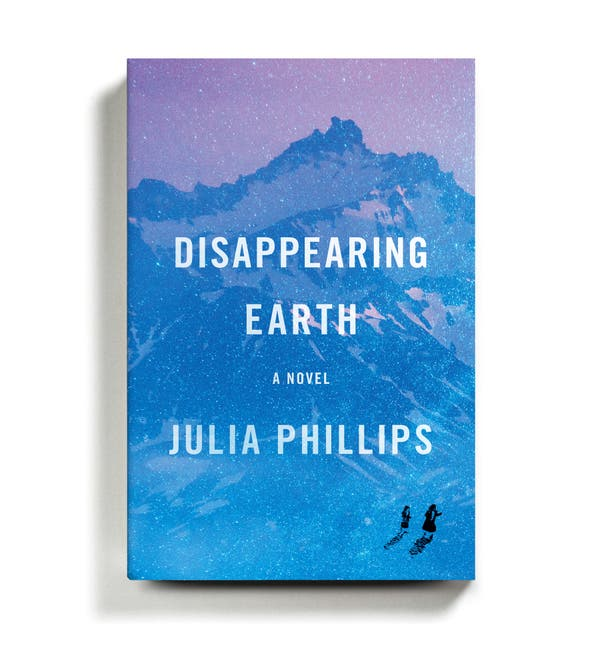
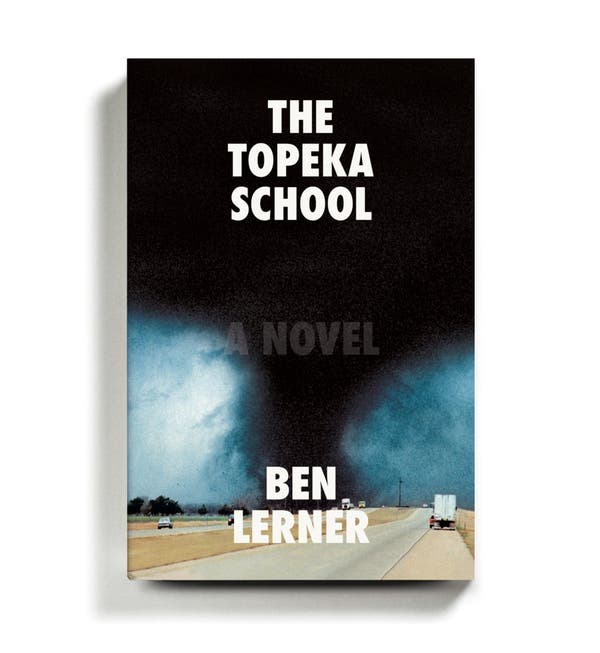
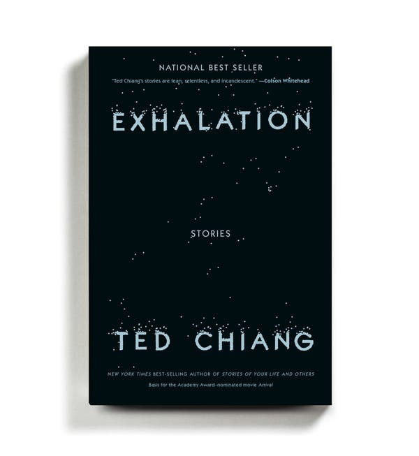
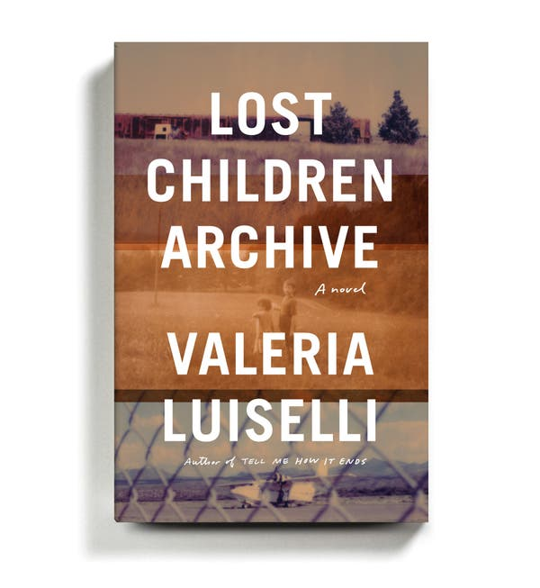
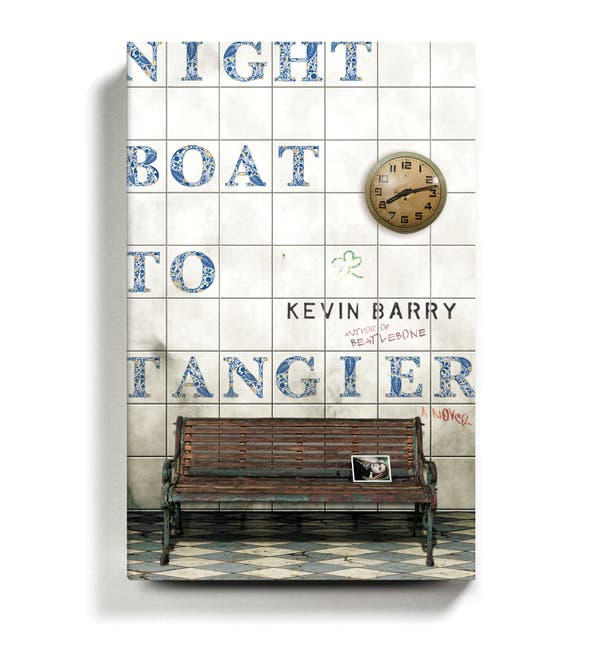
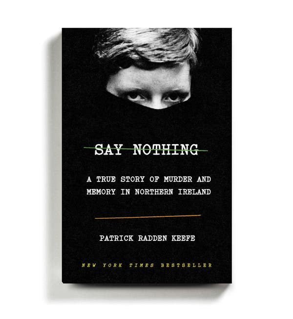
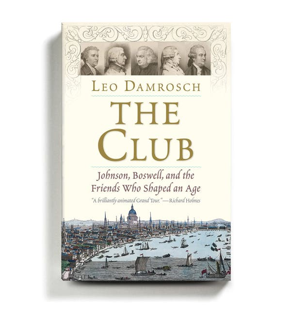
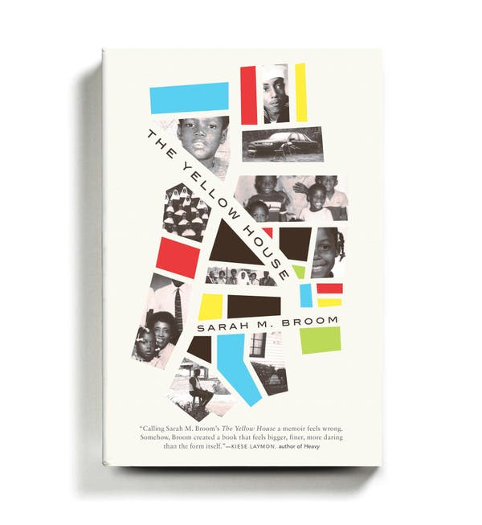
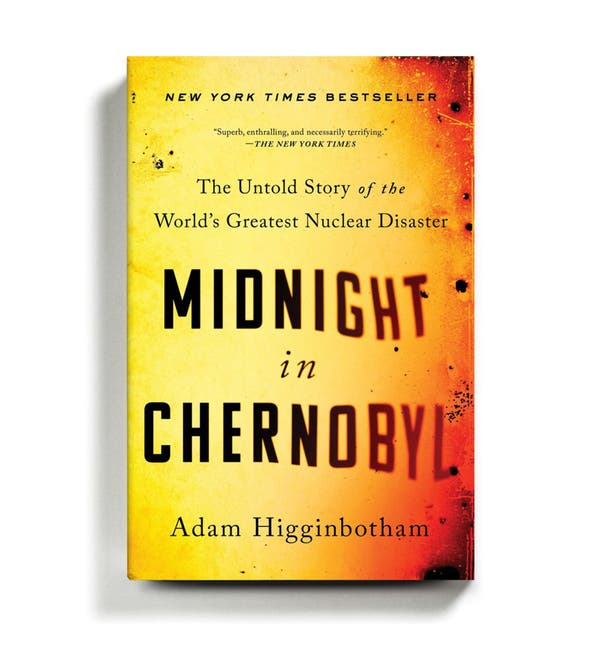

The 10 Best Books of 2019 - The New York Times

# The 10 Best Books of 2019The 10 Best Books of 2019

The editors of The Times Book Review choose the best fiction and nonfiction titles this year.

Nov. 22, 2019

- 
- 
- 

-
-
-

Credit...By Ben Denzer

#

##   Disappearing Earth

### By Julia Phillips

Image

Credit...

In the first chapter of this assured debut novel, two young girls vanish, sending shock waves through a town perched on the edge of the remote, brooding Kamchatka Peninsula. What follows is a novel of overlapping short stories about the various women who have been affected by their disappearance. Each richly textured tale pushes the narrative forward another month and exposes the ways in which the women of Kamchatka have been shattered — personally, culturally and emotionally — by the crime.

**Fiction** | Alfred A. Knopf. $26.95. | [Read the review](https://www.nytimes.com/2019/05/14/books/review/disappearing-earth-julia-phillips.html) | [Listen: Julia Phillips on the podcast](https://www.nytimes.com/2019/06/14/books/review/podcast-underland-robert-macfarlane-disappearing-earth-julia-phillips.html)

##   The Topeka School

### By Ben Lerner

Image

Credit...

Lerner’s exhilarating third novel, after “Leaving the Atocha Station” and “10:04,”  rocks an emphatically American amplitude, ranging freely from parenthood to childhood, from toxic masculinity to the niceties of cunnilingus, from Freud’s Oedipus complex to Tupac’s “All Eyez on Me.” Adam Gordon returns as the protagonist, but this time as a high school debate star, and mostly in the third person. Equal portions of the book are given over to the voices of his psychologist parents, and to a former classmate whose cognitive deficits are the inverse of Adam’s gifts. The earlier novels’ questions about art and authenticity persist; but Adam’s faithlessness is now stretched into a symptom of a national crisis of belief. Lerner’s own arsenal has always included a composer’s feel for orchestration, a ventriloquist’s vocal range and a fine ethnographic attunement. Never before, though, has the latter been so joyously indulged, or the bubblicious texture of late Clintonism been so lovingly evoked.

**Fiction** | Farrar, Straus & Giroux. $27. | [Read the review](https://www.nytimes.com/2019/10/03/books/review/topeka-school-ben-lerner.html)

## Get the Book Review Newsletter

Be the first to see reviews, news and features in The New York Times Book Review.

Advertisement

[Continue reading the main story](https://www.nytimes.com/2019/11/22/books/review/best-books.html#after-story-ad-1)

##   Exhalation

### By Ted Chiang

Image

Credit...

Many of the nine deeply beautiful stories in this collection explore the material consequences of time travel. Reading them feels like sitting at dinner with a friend who explains scientific theory to you without an ounce of condescension. Each thoughtful, elegantly crafted story poses a philosophical question; Chiang curates all nine into a conversation that comes full circle, after having traversed remarkable terrain.

**Fiction** | Alfred A. Knopf. $25.95. | [Read the review](https://www.nytimes.com/2019/05/29/books/review/new-science-fiction-time-travel.html) | [Listen: Ted Chiang on the podcast](https://www.nytimes.com/2019/07/26/books/review/podcast-ted-chiang-exhalation-helen-phillips-need.html)

##   Lost Children Archive

### By Valeria Luiselli

Image

Credit...

The Mexican author’s third novel — her first to be written in English — unfolds against a backdrop of crisis: of children crossing borders, facing death, being detained, being deported unaccompanied by their guardians. The novel centers on a couple and their two children (all unnamed), who are taking a road trip from New York City to the Mexican border; the couple’s marriage is on the brink of collapse as they pursue independent ethnographic research projects and the woman tries to help a Mexican immigrant find her daughters, who’ve gone missing in their attempt to cross the border behind her. The brilliance of Luiselli’s writing stirs rage and pity, but what might one do after reading such a novel? Acutely sensitive to these misgivings, Luiselli has delivered a madly allusive, self-reflexive, experimental book, one that is as much about storytellers and storytelling as it is about lost children.

**Fiction** | Alfred A. Knopf. $27.95. | [Read the review](https://www.nytimes.com/2019/03/06/books/review/lost-children-archive-valeria-luiselli.html) | [Read our profile of Luiselli](https://www.nytimes.com/2019/02/07/arts/valeria-luiselli-lost-children-archive.html)

##   Night Boat to Tangier

### By Kevin Barry

## Editors’ Picks

[  ### Dogs Can’t Help Falling in Love](https://www.nytimes.com/2019/11/22/science/dogs-love-evolution.html?fallback=false&recId=564639701&locked=0&geoContinent=EU&geoRegion=NO%20REGION&recAlloc=story&geoCountry=IM&blockId=home-featured&imp_id=801855355&action=click&module=editorContent&pgtype=Article&region=CompanionColumn&contentCollection=Trending)

[  ### Stop! Don’t Charge Your Phone This Way](https://www.nytimes.com/2019/11/18/technology/personaltech/usb-warning-juice-jacking.html?fallback=false&recId=564639701&locked=0&geoContinent=EU&geoRegion=NO%20REGION&recAlloc=story&geoCountry=IM&blockId=home-featured&imp_id=205613450&action=click&module=editorContent&pgtype=Article&region=CompanionColumn&contentCollection=Trending)

[  ### Face It, Mom and Dad: I’m Not Special](https://www.nytimes.com/2019/11/22/style/modern-love-face-it-im-not-special.html?fallback=false&recId=564639701&locked=0&geoContinent=EU&geoRegion=NO%20REGION&recAlloc=story&geoCountry=IM&blockId=home-featured&imp_id=831549307&action=click&module=editorContent&pgtype=Article&region=CompanionColumn&contentCollection=Trending)

[Continue reading the main story](https://www.nytimes.com/2019/11/22/books/review/best-books.html?action=click&module=editorContent&pgtype=Article&region=CompanionColumn&contentCollection=Trending#after-pp_edpick)

Image

Credit...

A desolate ferry terminal on the Spanish coast isn’t a place where you’d expect to encounter sharp-edged lyricism or rueful philosophy, but thanks to the two Irish gangster antiheroes of Barry’s novel, there’s plenty of both on display, along with scabrously amusing tale-telling and much summoning of painful memories. Their lives have become so intertwined that the young woman whose arrival they await can qualify as family for either man. Will she show? How much do they care? Their banter is a shield against the dark, a witty new take on “Waiting for Godot.”

**Fiction** | Doubleday. $25.95. | [Read the review](https://www.nytimes.com/2019/09/19/books/review/night-boat-to-tangier-kevin-barry.html) | [Listen: Kevin Barry on the podcast](https://www.nytimes.com/2019/09/27/books/review/podcast-samantha-power-education-idealist-craig-johnson-longmire.html)

Advertisement

[Continue reading the main story](https://www.nytimes.com/2019/11/22/books/review/best-books.html#after-story-ad-2)

[ *Best books of the past decade: *[*2010*](https://www.nytimes.com/2010/12/12/books/review/10-best-books-of-2010.html?module=inline)* | *[*2011*](https://www.nytimes.com/2011/12/11/books/10-best-books-of-2011.html?module=inline)* | *[*2012*](https://www.nytimes.com/2012/12/09/books/review/10-best-books-of-2012.html?module=inline)* | *[*2013*](https://www.nytimes.com/2013/12/15/books/review/the-10-best-books-of-2013.html?module=inline)* | *[*2014*](https://www.nytimes.com/2014/12/14/books/review/the-10-best-books-of-2014.html?module=inline)* | *[*2015*](https://www.nytimes.com/interactive/2015/12/02/books/review/best-books-of-2015.html?module=inline)* | *[*2016*](https://www.nytimes.com/interactive/2016/books/review/best-books.html?searchResultPosition=14&module=inline)* | *[*2017*](https://www.nytimes.com/interactive/2017/books/review/10-best-books-2017.html?module=inline)* | *[*2018*](https://www.nytimes.com/2018/11/29/books/review/best-books.html?module=inline) ]

* * *

##   Say Nothing

### By Patrick Radden Keefe

Image

Credit...

Masked intruders dragged Jean McConville, a 38-year-old widow and mother of 10, from her Belfast home in 1972. In this meticulously reported book — as finely paced as a novel — Keefe uses McConville’s murder as a prism to tell the history of the Troubles in Northern Ireland. Interviewing people on both sides of the conflict, he transforms the tragic damage and waste of the era into a searing, utterly gripping saga.

**Nonfiction** | Doubleday. $28.95. | [Read the review](https://www.nytimes.com/2019/02/22/books/review/say-nothing-patrick-radden-keefe.html)

##   The Club

### By Leo Damrosch

Image

Credit...

The English painter Joshua Reynolds just wanted to cheer up his friend Samuel Johnson, who was feeling blue. Who knew that the Friday night gab sessions he proposed they convene at London’s Turk’s Head Tavern would end up attracting virtually all the leading lights of late-18th-century Britain? Damrosch brings the Club’s redoubtable personalities — the brilliant minds, the jousting wits, the tender camaraderie — to vivid life, delivering indelible portraits of Johnson and Reynolds, Edmund Burke, Adam Smith, the actor David Garrick, the historian Edward Gibbon and, of course, Johnson’s loyal biographer James Boswell: “a constellation of talent that has rarely if ever been equaled.”

**Nonfiction** | Yale University Press. $30. | [Read the review](https://www.nytimes.com/2019/04/05/books/review/leo-damrosch-club.html)

##   The Yellow House

### By Sarah M. Broom

Image

Credit...

In her extraordinary, engrossing debut, Broom pushes past the baseline expectations of memoir to create an entertaining and inventive amalgamation of literary forms. Part oral history, part urban history, part celebration of a bygone way of life, “The Yellow House” is a full indictment of the greed, discrimination, indifference and poor city planning that led her family’s home to be wiped off the map. Tracing the history of a single home in New Orleans East (an area “50 times the size of the French Quarter,” yet nowhere to be found on most tourist maps, comprising scraps of real estate whites have passed over), from the ’60s to Hurricane Katrina, this is an instantly essential text, examining the past, present and possible future of the city of New Orleans, and of America writ large.

**Nonfiction** | Grove Press. $26. | [Read the review](https://www.nytimes.com/2019/08/09/books/review/the-yellow-house-sarah-m-broom.html) | [Listen: Sarah M. Broom on the podcast](https://www.nytimes.com/2019/08/30/books/review/podcast-christopher-ketcham-this-land.html)

Advertisement

[Continue reading the main story](https://www.nytimes.com/2019/11/22/books/review/best-books.html#after-story-ad-3)

##   No Visible Bruises

### By Rachel Louise Snyder

Image

Credit...

Snyder’s thoroughly reported book covers what the World Health Organization has called “a global health problem of epidemic proportions.” In America alone, more than half of all murdered women are killed by a current or former partner; domestic violence cuts across lines of class, religion and race. Snyder debunks pervasive myths (restraining orders are the answer, abusers never change) and writes movingly about the lives (and deaths) of people on both sides of the equation. She doesn’t give easy answers but presents a wealth of information that is its own form of hope.

**Nonfiction** | Bloomsbury Publishing. $28. | [Read the review](https://www.nytimes.com/2019/06/07/books/review/rachel-louise-snyder-no-visible-bruises.html) | [Listen: Rachel Louise Snyder on the podcast](https://www.nytimes.com/2019/06/07/books/review/podcast-no-visible-bruises-rachel-louise-snyder-queen-josh-levin.html)

##   Midnight in Chernobyl

### By Adam Higginbotham

Image

Credit...

Higginbotham’s superb account of the April 1986 explosion at the Chernobyl nuclear power plant is one of those rare books about science and technology that read like a tension-filled thriller. Replete with vivid detail and sharply etched personalities, this narrative of astounding incompetence moves from mistake to mistake, miscalculation to miscalculation, as it builds to the inevitable, history-changing disaster.

**Nonfiction** | Simon & Schuster. $29.95. | [Read the review](https://www.nytimes.com/2019/02/06/books/review-midnight-chernobyl-adam-higginbotham.html) | [Listen: Adam Higginbotham on the podcast](https://www.nytimes.com/2019/04/05/books/review/podcast-midnight-in-chernobyl-nuclear-accident-adam-higginbotham.html)

*[ Want more? *[*Learn how the editors put together this year’s list*](https://www.nytimes.com/2019/11/22/reader-center/inside-the-times-10-best-list.html?module=inline)*. ]*

*Follow New York Times Books on *[*Facebook*](https://www.facebook.com/nytbooks/)*, *[*Twitter*](https://twitter.com/nytimesbooks)* and *[*Instagram*](https://www.instagram.com/nytbooks/)*, sign up for *[*our newsletter*](https://www.nytimes.com/newsletters/books-review?module=inline)* or *[*our literary calendar*](https://www.nytimes.com/interactive/2017/books/books-calendar.html?module=inline)*. And listen to us on the *[*Book Review podcast*](https://www.nytimes.com/column/book-review-podcast?module=inline)*.*

* * *

Produced by Lauryn Stallings

**Correction:** *Nov. 22, 2019*

An earlier version of this article misstated the setting of Ben Lerner's "10:04." It is set primarily in New York, not Europe.

- 
- 
- 

-

## [More in Book Review](https://www.nytimes.com/section/books/review?action=click&module=MoreInSection&pgtype=Article&region=Footer&contentCollection=Book%20Review)

[   Tom Pilston/Panos Pictures, via Red​ux](https://www.nytimes.com/2019/11/12/books/review/margaret-thatcher-the-authorized-biography-herself-alone-charles-moore.html?action=click&module=MoreInSection&pgtype=Article&region=Footer&contentCollection=Book%20Review)

[### Seeing Margaret Thatcher Whole](https://www.nytimes.com/2019/11/12/books/review/margaret-thatcher-the-authorized-biography-herself-alone-charles-moore.html?action=click&module=MoreInSection&pgtype=Article&region=Footer&contentCollection=Book%20Review)Nov. 12

[   Isak Tiner for The New York Times](https://www.nytimes.com/2019/11/08/books/review/jonathan-van-ness-over-the-top-dear-girls-ali-wong-medallion-status-john-hodgman.html?action=click&module=MoreInSection&pgtype=Article&region=Footer&contentCollection=Book%20Review)

[### Jonathan Van Ness, Ali Wong and John Hodgman Walk Into a Bar …](https://www.nytimes.com/2019/11/08/books/review/jonathan-van-ness-over-the-top-dear-girls-ali-wong-medallion-status-john-hodgman.html?action=click&module=MoreInSection&pgtype=Article&region=Footer&contentCollection=Book%20Review)Nov. 8

[Continue reading the main story](https://www.nytimes.com/2019/11/22/books/review/best-books.html?action=click&module=MoreInSection&pgtype=Article&region=Footer&contentCollection=Book%20Review#after-pp_morein)

[   Jillian Tamaki](https://www.nytimes.com/2019/11/21/books/review/by-the-book-interview-phoebe-waller-bridge.html?action=click&module=MoreInSection&pgtype=Article&region=Footer&contentCollection=Book%20Review)

[### Phoebe Waller-Bridge Loves Antiheroines. Of Course.](https://www.nytimes.com/2019/11/21/books/review/by-the-book-interview-phoebe-waller-bridge.html?action=click&module=MoreInSection&pgtype=Article&region=Footer&contentCollection=Book%20Review)Nov. 21

[   Leigh Anne Couch](https://www.nytimes.com/2019/11/21/books/review/dont-hate-kevin-wilson-but-he-wrote-his-best-seller-in-10-days.html?action=click&module=MoreInSection&pgtype=Article&region=Footer&contentCollection=Book%20Review)

[### Don’t Hate Kevin Wilson, but He Wrote His Best Seller in 10 Days](https://www.nytimes.com/2019/11/21/books/review/dont-hate-kevin-wilson-but-he-wrote-his-best-seller-in-10-days.html?action=click&module=MoreInSection&pgtype=Article&region=Footer&contentCollection=Book%20Review)Nov. 21

[### 12 New Books We Recommend This Week](https://www.nytimes.com/2019/11/21/books/review/12-new-books-we-recommend-this-week.html?action=click&module=MoreInSection&pgtype=Article&region=Footer&contentCollection=Book%20Review)Nov. 21

## Editors’ Picks

[   Katherine Marks for The New York Times](https://www.nytimes.com/interactive/2019/11/21/realestate/21hunt-fangayen.html?fallback=false&recId=746174370&locked=0&geoContinent=EU&geoRegion=NO%20REGION&recAlloc=story&geoCountry=IM&blockId=home-featured&imp_id=809440929&action=click&module=editorsPicks&pgtype=Article&region=Footer)

[### Three Students, $3,000 and a Dream: An Affordable Brooklyn Apartment. Where Did They Wind Up?](https://www.nytimes.com/interactive/2019/11/21/realestate/21hunt-fangayen.html?fallback=false&recId=746174370&locked=0&geoContinent=EU&geoRegion=NO%20REGION&recAlloc=story&geoCountry=IM&blockId=home-featured&imp_id=809440929&action=click&module=editorsPicks&pgtype=Article&region=Footer)Nov. 21

[   Margeaux Walter for The New York Times](https://www.nytimes.com/2019/11/21/business/kk.html?fallback=false&recId=746174370&locked=0&geoContinent=EU&geoRegion=NO%20REGION&recAlloc=story&geoCountry=IM&blockId=home-featured&imp_id=312449841&action=click&module=editorsPicks&pgtype=Article&region=Footer)

[### Typing These Two Letters Will Scare Your Young Co-Workers](https://www.nytimes.com/2019/11/21/business/kk.html?fallback=false&recId=746174370&locked=0&geoContinent=EU&geoRegion=NO%20REGION&recAlloc=story&geoCountry=IM&blockId=home-featured&imp_id=312449841&action=click&module=editorsPicks&pgtype=Article&region=Footer)Nov. 21

[### Respect the Hustle of Soda Can Raccoon and Murder Cat](https://www.nytimes.com/2019/11/20/nyregion/nyc-animals-urban-wildlife.html?fallback=false&recId=746174370&locked=0&geoContinent=EU&geoRegion=NO%20REGION&recAlloc=story&geoCountry=IM&blockId=home-featured&imp_id=434704176&action=click&module=editorsPicks&pgtype=Article&region=Footer)Nov. 20

## Most Popular

### [‘Saturday Night Live’: Alec Baldwin Leads a Celebrity Extravaganza](https://www.nytimes.com/2019/11/24/arts/television/saturday-night-live-will-ferrell.html?algo=top_conversion&fellback=false&imp_id=526788793&imp_id=989431365&action=click&module=trending&pgtype=Article&region=Footer)

### [How Marla Maples Spends Her Sundays](https://www.nytimes.com/2019/11/22/nyregion/marla-maples-donald-trump.html?algo=top_conversion&fellback=false&imp_id=189759362&imp_id=883680634&action=click&module=trending&pgtype=Article&region=Footer)

### [Opinion: Trump’s White Whale](https://www.nytimes.com/2019/11/23/opinion/sunday/trump-conspiracy-theories-ukraine.html?algo=top_conversion&fellback=false&imp_id=960308048&imp_id=581971471&action=click&module=trending&pgtype=Article&region=Footer)

### [When Your Love Life Is a Punch Line](https://www.nytimes.com/2019/11/20/fashion/weddings/when-your-love-life-is-a-punch-line.html?algo=top_conversion&fellback=false&imp_id=853516468&imp_id=258685255&action=click&module=trending&pgtype=Article&region=Footer)

### [Our Best Thanksgiving Recipes: Turkey, Mashed Potatoes, Pumpkin Pie and More](https://www.nytimes.com/2019/11/23/dining/thanksgiving-recipes.html?algo=top_conversion&fellback=false&imp_id=486467066&imp_id=897070908&action=click&module=trending&pgtype=Article&region=Footer)

### [Is Weed Church Church?](https://www.nytimes.com/2019/11/23/style/weed-church-california.html?algo=top_conversion&fellback=false&imp_id=838131263&imp_id=247576069&action=click&module=trending&pgtype=Article&region=Footer)

### [Opinion: Ta-Nehisi Coates: The Cancellation of Colin Kaepernick](https://www.nytimes.com/2019/11/22/opinion/colin-kaepernick-nfl.html?algo=top_conversion&fellback=false&imp_id=623505171&imp_id=666906051&action=click&module=trending&pgtype=Article&region=Footer)

### [Bolton Teases a City Eager to Hear His Story](https://www.nytimes.com/2019/11/22/us/politics/bolton-twitter-trump.html?algo=top_conversion&fellback=false&imp_id=187352859&imp_id=497221817&action=click&module=trending&pgtype=Article&region=Footer)

### [The Men’s Cardigan Makes a Comeback](https://www.nytimes.com/2019/11/23/fashion/mister-rogers-cardigan.html?algo=top_conversion&fellback=false&imp_id=791958847&imp_id=567953976&action=click&module=trending&pgtype=Article&region=Footer)

### [Opinion: The United States Is Starting to Look Like Ukraine](https://www.nytimes.com/2019/11/22/opinion/trump-impeachment.html?algo=top_conversion&fellback=false&imp_id=283981683&imp_id=219488720&action=click&module=trending&pgtype=Article&region=Footer)

Advertisement

[Continue reading the main story](https://www.nytimes.com/2019/11/22/books/review/best-books.html#after-bottom)