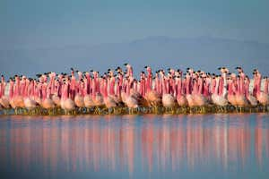
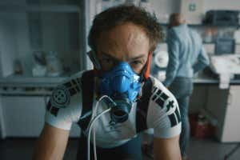
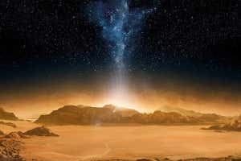
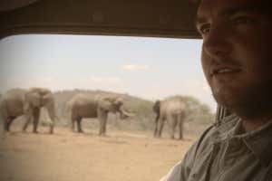
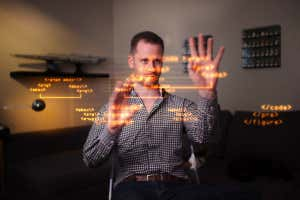
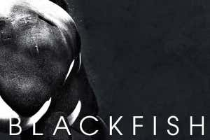
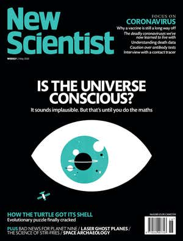

The 10 best documentaries you should watch right now | New Scientist

### [THE DAILY NEWSLETTER](https://www.newscientist.com/sign-up/)

[Sign up to our daily email newsletter](https://www.newscientist.com/sign-up/)

 

[Subscribe and save 57%](https://subscription.newscientist.com/packages/newscientist-2020-q2.php?promCode=14639%2C14640&packageCodes=TAP&offerCode=51i%2C6M)

- [news](https://www.newscientist.com/section/news/)
- [podcasts](https://www.newscientist.com/podcasts/)
- [video](https://www.newscientist.com/video/)
- [technology](https://www.newscientist.com/subject/technology/)
- [space](https://www.newscientist.com/subject/space/)
- [physics](https://www.newscientist.com/subject/physics/)
- [health](https://www.newscientist.com/subject/health/)
- [more](https://www.newscientist.com/article/2241718-the-10-best-documentaries-you-should-watch-right-now/#)»
- [shop](https://shop.newscientist.com/)
- [tours](https://www.newscientist.com/tours/)
- [events](https://www.newscientist.com/science-events/)
- [jobs](https://jobs.newscientist.com/en-gb/?utm_medium=ILC&utm_source=NSNS&utm_campaign=NS_NAV)

# The 10 best documentaries you should watch right now

 [%3b' data-evernote-id='7369' class='js-evernote-checked'%3e %3cg data-evernote-id='7370' class='js-evernote-checked'%3e %3cpath d='M22 5.16c-.406-.054-1.806-.16-3.43-.16-3.4 0-5.733 1.825-5.733 5.17v2.882H9v3.913h3.837V27h4.604V16.965h3.823l.587-3.913h-4.41v-2.5c0-1.123.347-1.903 2.198-1.903H22V5.16z' fill-rule='evenodd' data-evernote-id='7371' class='js-evernote-checked'%3e%3c/path%3e %3c/g%3e %3c/svg%3e)](http://api.addthis.com/oexchange/0.8/forward/facebook/offer?pubid=ns.html&url=https://www.newscientist.com/article/2241718-the-10-best-documentaries-you-should-watch-right-now/&title=The%2010%20best%20documentaries%20you%20should%20watch%20right%20now&description=Apollo%2011%2C%20Take%20Your%20Pills%2C%20Pandemic%3A%20How%20to%20prevent%20an%20outbreak%2C%20and%20Icarus%20are%20all%20great%20documentaries%20available%20to%20stream%20at%20the%20moment)  [%3b' data-evernote-id='7372' class='js-evernote-checked'%3e %3cg data-evernote-id='7373' class='js-evernote-checked'%3e %3cpath d='M27.996 10.116c-.81.36-1.68.602-2.592.71a4.526 4.526 0 0 0 1.984-2.496 9.037 9.037 0 0 1-2.866 1.095 4.513 4.513 0 0 0-7.69 4.116 12.81 12.81 0 0 1-9.3-4.715 4.49 4.49 0 0 0-.612 2.27 4.51 4.51 0 0 0 2.008 3.755 4.495 4.495 0 0 1-2.044-.564v.057a4.515 4.515 0 0 0 3.62 4.425 4.52 4.52 0 0 1-2.04.077 4.517 4.517 0 0 0 4.217 3.134 9.055 9.055 0 0 1-5.604 1.93A9.18 9.18 0 0 1 6 23.85a12.773 12.773 0 0 0 6.918 2.027c8.3 0 12.84-6.876 12.84-12.84 0-.195-.005-.39-.014-.583a9.172 9.172 0 0 0 2.252-2.336' fill-rule='evenodd' data-evernote-id='7374' class='js-evernote-checked'%3e%3c/path%3e %3c/g%3e %3c/svg%3e)](http://api.addthis.com/oexchange/0.8/forward/twitter/offer?pubid=ns.html&url=https://www.newscientist.com/article/2241718-the-10-best-documentaries-you-should-watch-right-now/&title=The%2010%20best%20documentaries%20you%20should%20watch%20right%20now&description=Apollo%2011%2C%20Take%20Your%20Pills%2C%20Pandemic%3A%20How%20to%20prevent%20an%20outbreak%2C%20and%20Icarus%20are%20all%20great%20documentaries%20available%20to%20stream%20at%20the%20moment)  [%3b' data-evernote-id='7375' class='js-evernote-checked'%3e %3cg data-evernote-id='7376' class='js-evernote-checked'%3e %3cpath d='M19.11 17.205c-.372 0-1.088 1.39-1.518 1.39a.63.63 0 0 1-.315-.1c-.802-.402-1.504-.817-2.163-1.447-.545-.516-1.146-1.29-1.46-1.963a.426.426 0 0 1-.073-.215c0-.33.99-.945.99-1.49 0-.143-.73-2.09-.832-2.335-.143-.372-.214-.487-.6-.487-.187 0-.36-.043-.53-.043-.302 0-.53.115-.746.315-.688.645-1.032 1.318-1.06 2.264v.114c-.015.99.472 1.977 1.017 2.78 1.23 1.82 2.506 3.41 4.554 4.34.616.287 2.035.888 2.722.888.817 0 2.15-.515 2.478-1.318.13-.33.244-.73.244-1.088 0-.058 0-.144-.03-.215-.1-.172-2.434-1.39-2.678-1.39zm-2.908 7.593c-1.747 0-3.48-.53-4.942-1.49L7.793 24.41l1.132-3.337a8.955 8.955 0 0 1-1.72-5.272c0-4.955 4.04-8.995 8.997-8.995S25.2 10.845 25.2 15.8c0 4.958-4.04 8.998-8.998 8.998zm0-19.798c-5.96 0-10.8 4.842-10.8 10.8 0 1.964.53 3.898 1.546 5.574L5 27.176l5.974-1.92a10.807 10.807 0 0 0 16.03-9.455c0-5.958-4.842-10.8-10.802-10.8z' fill-rule='evenodd' data-evernote-id='7377' class='js-evernote-checked'%3e%3c/path%3e %3c/g%3e %3c/svg%3e)](http://api.addthis.com/oexchange/0.8/forward/whatsapp/offer?pubid=ns.html&url=https://www.newscientist.com/article/2241718-the-10-best-documentaries-you-should-watch-right-now/&title=The%2010%20best%20documentaries%20you%20should%20watch%20right%20now&description=Apollo%2011%2C%20Take%20Your%20Pills%2C%20Pandemic%3A%20How%20to%20prevent%20an%20outbreak%2C%20and%20Icarus%20are%20all%20great%20documentaries%20available%20to%20stream%20at%20the%20moment)  [%3b' data-evernote-id='7378' class='js-evernote-checked'%3e %3cg data-evernote-id='7379' class='js-evernote-checked'%3e %3cpath d='M26 25.963h-4.185v-6.55c0-1.56-.027-3.57-2.175-3.57-2.18 0-2.51 1.7-2.51 3.46v6.66h-4.182V12.495h4.012v1.84h.058c.558-1.058 1.924-2.174 3.96-2.174 4.24 0 5.022 2.79 5.022 6.417v7.386zM8.23 10.655a2.426 2.426 0 0 1 0-4.855 2.427 2.427 0 0 1 0 4.855zm-2.098 1.84h4.19v13.468h-4.19V12.495z' fill-rule='evenodd' data-evernote-id='7380' class='js-evernote-checked'%3e%3c/path%3e %3c/g%3e %3c/svg%3e)](http://api.addthis.com/oexchange/0.8/forward/linkedin/offer?pubid=ns.html&url=https://www.newscientist.com/article/2241718-the-10-best-documentaries-you-should-watch-right-now/&title=The%2010%20best%20documentaries%20you%20should%20watch%20right%20now&description=Apollo%2011%2C%20Take%20Your%20Pills%2C%20Pandemic%3A%20How%20to%20prevent%20an%20outbreak%2C%20and%20Icarus%20are%20all%20great%20documentaries%20available%20to%20stream%20at%20the%20moment)  [%3b' data-evernote-id='7381' class='js-evernote-checked'%3e %3cg data-evernote-id='7382' class='js-evernote-checked'%3e %3cpath d='M27 15.5a2.452 2.452 0 0 1-1.338 2.21c.098.38.147.777.147 1.19 0 1.283-.437 2.47-1.308 3.563-.872 1.092-2.06 1.955-3.567 2.588-1.506.634-3.143.95-4.91.95-1.768 0-3.403-.316-4.905-.95-1.502-.632-2.69-1.495-3.56-2.587-.872-1.092-1.308-2.28-1.308-3.562 0-.388.045-.777.135-1.166a2.47 2.47 0 0 1-1.006-.912c-.253-.4-.38-.842-.38-1.322 0-.678.237-1.26.712-1.744a2.334 2.334 0 0 1 1.73-.726c.697 0 1.29.26 1.78.782 1.785-1.258 3.893-1.928 6.324-2.01l1.424-6.467a.42.42 0 0 1 .184-.26.4.4 0 0 1 .32-.063l4.53 1.006c.147-.306.368-.553.662-.74a1.78 1.78 0 0 1 .97-.278c.508 0 .94.18 1.302.54.36.36.54.796.54 1.31 0 .512-.18.95-.54 1.315-.36.364-.794.546-1.302.546-.507 0-.94-.18-1.295-.54a1.793 1.793 0 0 1-.533-1.308l-4.1-.92-1.277 5.86c2.455.074 4.58.736 6.37 1.985a2.315 2.315 0 0 1 1.757-.757c.68 0 1.256.242 1.73.726.476.484.713 1.066.713 1.744zm-16.868 2.47c0 .513.178.95.534 1.315.356.365.787.547 1.295.547.508 0 .942-.182 1.302-.547.36-.364.54-.802.54-1.315 0-.513-.18-.95-.54-1.31-.36-.36-.794-.54-1.3-.54-.5 0-.93.183-1.29.547a1.79 1.79 0 0 0-.54 1.303zm9.944 4.406c.09-.09.135-.2.135-.323a.444.444 0 0 0-.44-.447c-.124 0-.23.042-.32.124-.336.348-.83.605-1.486.77a7.99 7.99 0 0 1-1.964.248 7.99 7.99 0 0 1-1.964-.248c-.655-.165-1.15-.422-1.486-.77a.456.456 0 0 0-.32-.124.414.414 0 0 0-.306.124.41.41 0 0 0-.135.317.45.45 0 0 0 .134.33c.352.355.837.636 1.455.843.617.207 1.118.33 1.503.366a11.6 11.6 0 0 0 1.117.056c.36 0 .733-.02 1.117-.056.385-.037.886-.16 1.504-.366.62-.207 1.104-.488 1.456-.844zm-.037-2.544c.507 0 .938-.182 1.294-.547.356-.364.534-.802.534-1.315 0-.505-.18-.94-.54-1.303a1.75 1.75 0 0 0-1.29-.546c-.506 0-.94.18-1.3.54-.36.36-.54.797-.54 1.31s.18.95.54 1.315c.36.365.794.547 1.3.547z' fill-rule='evenodd' data-evernote-id='7383' class='js-evernote-checked'%3e%3c/path%3e %3c/g%3e %3c/svg%3e)](http://api.addthis.com/oexchange/0.8/forward/reddit/offer?pubid=ns.html&url=https://www.newscientist.com/article/2241718-the-10-best-documentaries-you-should-watch-right-now/&title=The%2010%20best%20documentaries%20you%20should%20watch%20right%20now&description=Apollo%2011%2C%20Take%20Your%20Pills%2C%20Pandemic%3A%20How%20to%20prevent%20an%20outbreak%2C%20and%20Icarus%20are%20all%20great%20documentaries%20available%20to%20stream%20at%20the%20moment)  [%3b' data-evernote-id='7384' class='js-evernote-checked'%3e %3cg data-evernote-id='7385' class='js-evernote-checked'%3e %3cg fill-rule='evenodd' data-evernote-id='7386' class='js-evernote-checked'%3e%3c/g%3e %3cpath d='M27 22.757c0 1.24-.988 2.243-2.19 2.243H7.19C5.98 25 5 23.994 5 22.757V13.67c0-.556.39-.773.855-.496l8.78 5.238c.782.467 1.95.467 2.73 0l8.78-5.238c.472-.28.855-.063.855.495v9.087z' data-evernote-id='7387' class='js-evernote-checked'%3e%3c/path%3e%3cpath d='M27 9.243C27 8.006 26.02 7 24.81 7H7.19C5.988 7 5 8.004 5 9.243v.465c0 .554.385 1.232.857 1.514l9.61 5.733c.267.16.8.16 1.067 0l9.61-5.733c.473-.283.856-.96.856-1.514v-.465z' data-evernote-id='7388' class='js-evernote-checked'%3e%3c/path%3e %3c/g%3e %3c/svg%3e)](http://api.addthis.com/oexchange/0.8/forward/email/offer?pubid=ns.html&url=https://www.newscientist.com/article/2241718-the-10-best-documentaries-you-should-watch-right-now/&title=The%2010%20best%20documentaries%20you%20should%20watch%20right%20now&description=Apollo%2011%2C%20Take%20Your%20Pills%2C%20Pandemic%3A%20How%20to%20prevent%20an%20outbreak%2C%20and%20Icarus%20are%20all%20great%20documentaries%20available%20to%20stream%20at%20the%20moment)  [%3b' data-evernote-id='7389' class='js-evernote-checked'%3e %3cg data-evernote-id='7390' class='js-evernote-checked'%3e %3cpath d='M24.67 10.62h-2.86V7.49H10.82v3.12H7.95c-.5 0-.9.4-.9.9v7.66h3.77v1.31L15 24.66h6.81v-5.44h3.77v-7.7c-.01-.5-.41-.9-.91-.9zM11.88 8.56h8.86v2.06h-8.86V8.56zm10.98 9.18h-1.05v-2.1h-1.06v7.96H16.4c-1.58 0-.82-3.74-.82-3.74s-3.65.89-3.69-.78v-3.43h-1.06v2.06H9.77v-3.58h13.09v3.61zm.75-4.91c-.4 0-.72-.32-.72-.72s.32-.72.72-.72c.4 0 .72.32.72.72s-.32.72-.72.72zm-4.12 2.96h-6.1v1.06h6.1v-1.06zm-6.11 3.15h6.1v-1.06h-6.1v1.06z' data-evernote-id='7391' class='js-evernote-checked'%3e%3c/path%3e %3c/g%3e %3c/svg%3e)]()

   [Life](https://www.newscientist.com/subject/life/)     1 May 2020

By [Simon Ings](https://www.newscientist.com/author/simon-ings/)

Planet Earth II
BBC

## Planet Earth II, Blue Planet II, Our Planet and Seven Worlds, One Planet

*BBC iPlayer, Netflix, SkyGo*

Watch the last few years’ major natural history television narrated by David Attenborough, and you will witness a remarkable change. Everyone’s favourite pre-watershed naturalist finally seems to have become angry about the state of the planet, and about our role in its decline. *Planet Earth II* was relatively upbeat about the state of the world, although its last few minutes contained a homily about various “problems”. *Blue Planet II* was more forthright, declaring a war on ocean plastics that [has gathered much pace and enthusiasm](https://www.newscientist.com/article/2205751-plastic-pollution-found-at-every-depth-of-the-ocean-by-deep-sea-survey/) since the show first aired in 2017.

Two years later, and *Seven Worlds, One Planet* saw storms generated by global antrhopogenic climate change blow albatross chicks out of their nests. At last the Natural History Unit’s betters at the BBC had abandoned their pursuit of a specious “balance” around the climate change emergency, and were letting their filmmakers, and Attenborough, tell the unvarnished truth about the natural world – or [what was left of it](https://www.newscientist.com/article/2238102-david-attenboroughs-a-life-on-our-planet-is-a-powerful-call-to-action/).

But they had been gazumped: Netflix had already recruited the same community of producers, filmmakers and naturalists to produce their own series, *Our Planet.* This, surely is what the BBC should have been making years ago. It is expensive, visually ravishing and absolutely unsparing in its analysis of [where the world is headed](https://www.newscientist.com/article/2198797-david-attenboroughs-our-planet-on-netflix-is-beautiful-but-empty/).

Rhea Woltman, one of the Mercury 13
Netflix

## Mercury 13

*Netflix*

From Amelia Earhart to Tiny Broadwick, women feature prominently in histories of pioneering aviation. And when William Randolph Lovelace invited women pilots into his privately funded research project  in the early 1960s, he got the best of the best.

Lovelace was the doctor who developed the physical and psychological tests used to select candidates for space. He had no doubts that women were capable of space flight, and he wasn’t alone. Russia sent the first woman – Valentina Tereshkova – into space in 1963.

In the US, however, NASA turned to military test pilots, who were all male, for its [Apollo programme](https://www.newscientist.com/term/apollo-11-moon-landing/). Speaking before Congress in 1962, some of Lovelace’s women argued that they were prevented from joining on sexual discrimination grounds. Their case was thrown out.

The *Mercury 13* women had the right stuff, and could have have flown, and didn’t. Yet their determination to make the most of their lot is inspiring. One taught herself aerobatics. One co-founded the National Organization of Women. And several – a nice irony – went on to have successful careers as test pilots.

Bryan Fogel, Icarus
Netflix

## Icarus

*Netflix*

The trick of good documentary making is knowing when the story you set out to tell isn’t half as good as the story that just landed in your lap.

*Icarus* director Bryan Fogel is a keen amateur cyclist and was annoyed by the way professional racer Lance Armstrong built his career on the use of [performance-enhancing substances](https://www.newscientist.com/article/2139340-blood-doping-were-armstrong-and-russia-wasting-their-time/). So Fogel decided he’d attempt to cheat his way to some trophies – and make a whistleblowing documentary about the experience.

To do this properly, Fogel needed expert help, and that’s how he fell in with Grigory Rodchenkov, a pillar of Russia’s anti-doping programme and, it turns out, a key player in a decades-long, state-sponsored attempt to skirt the rules.

Once this is exposed, Russia is partly banned from the 2016 Summer Olympics (and banned altogether from the 2018 Winter Olympics) and Rodchenkov, turned whistleblower, flees to the US – largely thanks to Fogel.

Fogel never did cheat his way to that cycling trophy, but I don’t imagine he’s too upset: *Icarus *won a well-deserved Oscar nomination for Best Documentary Feature.

The Planets
BBC

## The Planets

*BBC iPlayer*

Over five visually dazzling episodes, [Brian Cox](https://www.newscientist.com/article/2086837-brian-cox-science-can-teach-politicians-to-be-humble/#ixzz6Hsrl2PcC) guides the viewer through our solar system’s 4.5-billion-year history of collisions, near misses and bizarre planetary harmonics, a dish presented on a bed of fiendish geometry, and smothered in a rich CGI sauce.

Once you get your breath back, I defy you not to rewatch *The Planets* immediately. The science is strong and the special effects are carefully thought through.

Our solar system’s impression of clockwork stability is an illusion. Every planet has been on an incredible journey, its fate, position and even its composition dependent on the chaotic interaction of unimaginably huge forces. Cox’s delivery is a bit over-seasoned for some tastes, but in this series I think it helps that he personifies his rocky, gassy protagonists wherever he can. Mercury, “an embryo ripped from its promising position before it could mature”, will never seem the same again.

Pandemic: How to prevent an outbreak
Netflix

## Pandemic: How to prevent an outbreak

*Netflix*

How is this for timing? Last year, Isabel Castro made a chilling six-part documentary about influenzas past, present and (*sound alarm here*) future. She filmed all over the world, on the assumption that the next big disease to hit humanity will use the airline network to wrap itself around the globe in three months or less.

She shadowed Syra Madad, New York City’s senior director of health and hospitals, because she reckoned Trump-era budget cuts were going to fatally undermine US preparedness for [the next big flu outbreak](https://www.newscientist.com/article/2132257-trumps-2018-budget-slashes-funding-from-healthcare-and-science/). She spent time with Jake Glanville and Sarah Ives, two scientists who were trying to create a global one-shot flu vaccine, so she could explain why such [vaccines are difficult to produce](https://www.newscientist.com/article/2156915-jab-in-the-dark-why-we-dont-have-a-universal-flu-vaccine/). (Some of it’s down to the science; a lot of it’s down to the economics.) And she went to a poultry market in Vietnam, figuring this was as likely a source of the next pandemic as any.

No sooner did *Pandemic* land on the Netflix streaming service, than the whole world found itself [beseiged by covid-19](https://www.newscientist.com/article-topic/coronavirus/). And it’s a testament to Castro’s research that her series, far from feeling upstaged and irrelevant, remains a valuable (if occasionally counter-factual) guide to our present crisis.

Apollo 11
Pictorial Press Ltd / Alamy

## Apollo 11

*Netflix*

Imagine making a 65mm motion picture cinema documentary about [the first moon landing](https://www.newscientist.com/term/apollo-11-moon-landing/) – and then giving up, and filing the whole thing in a drawer. You’d be kicking yourself now. Look what Todd Douglas Miller has made of your footage! He’s spliced it with selections from 11,000 hours of uncatalogued audio and reams more restored original film to make *Apollo 11*. Running  at just one and a half hours in length, this is easily the richest human document ever made of our first extra-terrestrial adventure.

How did Miller do it? For a start, he trusted his sources. If he found a spectacular or informative shot, he’d let it run at length. If an astronaut or someone in the control centre had something useful to say, he’d let them say it, without interruption, without narration, without false drama.

That still gave him plenty to do. Editing together shots of the spectators at the rocket’s launch, he assembles a snapshot of 1960’s America that is at once intimate and epic. Matt Morton’s thumping electronic score, constructed on a period Moog synthesizer, holds everything together: the music is an actor in the unfolding drama, for sure, but it never feels tacked on.

The Ivory Game
Richard Ladkani/Netflix

## The Ivory Game

*Netflix*

Earth League International and its founder Andrea Crosta are the hero-detectives of this true-life thriller, which follows the trade in elephant tusks from Tanzania, Kenya and Zambia to Hong Kong, Vietnam and China.

Directors Kief Davidson and Richard Ladkani have a penchant for drone shots of 4X4s speeding across a flat landscape. (Ladkani included several similar shots in one of our favourite documentaries of 2019, *[Sea of Shadows](https://www.newscientist.com/article/mg24332500-600-sea-of-shadows-film-documents-demise-of-the-worlds-smallest-porpoise/)****.***)

In the five years before 2016, [150,000 elephants were killed for their ivory](https://www.newscientist.com/article/mg22229692-700-ivory-poaching-funds-most-war-and-terrorism-in-africa/#ixzz6HgwNprtr). At the same time, the likelihood of the elephants’ extinction was driving up the price of their ivory, increasing the threat to the remaining herds.

Since the film was released, there has been a little bit of good news. China banned the ivory trade at the end of 2017, and polls suggest Chinese citizens are losing interest in ivory, both as a [traditional medicine and as a luxury good](https://www.newscientist.com/article/2204656-african-elephant-poaching-is-falling-at-last-but-its-still-too-high/). Still, the elephants are far from safe, and this urgent, articulate film remains as topical as ever.

Babies
Netflix

## Babies

*Netflix*

How much do you want to know about your baby? Netflix’s expensive, gripping delightful documentary, directed by Thomas Balmès, follows 15 families from around the world through the [first full year of their new baby’s life](https://www.newscientist.com/article/mg12717321-300-mothers-hold-key-to-studying-child-development/). It packs in solid science along with all that adorable gurgling and bouncing. Each episode follows a different part of the process, such as bonding, food, sleep and speech.

#### Read more: [A parent’s guide to reading a baby’s mind](https://www.newscientist.com/article/mg22329790-700-a-parents-guide-to-reading-a-babys-mind/)

Take Your Pills
Netflix

## Take Your Pills

*Netflix*

Amphetamine was first sold to the public in 1932, in the form of a decongestant inhaler. Five years later, *Time* magazine was already warning that students were using “pep pills” to get them through their coursework. Things are now [far more advanced](https://www.newscientist.com/article/mg24532690-300-drugs-may-be-able-to-fix-our-romantic-lives-when-things-go-wrong/#ixzz6HgrONSXk).

#### Read more: [Behaviour pills flood US schools](https://www.newscientist.com/article/mg14920200-800-behaviour-pills-flood-us-schools/)

From schools to workplaces, people seem to be turning to pills to give them an edge. Director Alison Klayman isn’t bothered about the drugs themselves, however, so much as what they say about a society in which success is so hard to come by that [drug-taking has become a career choice](https://www.newscientist.com/article/mg20026863-400-brain-boosting-drugs-not-to-be-feared/).

Blackfish
Magnolia Pictures

## Blackfish

*Netflix*

Working back from the death of the SeaWorld trainer Dawn Brancheau in 2010, Gabriela Cowperthwaite’s BAFTA-nominated documentary tells the story of Tilikum, a 5500-kilogram bull orca apparently badly affected by life as a marine-park attraction.

In the wild, there are no recorded cases of orcas killing people, but Tilikum has killed three. The more we learn about the complex social lives of these creatures, the more we come to appreciate how much we have still to learn. We certainly shouldn’t be [keeping them in solitary confinement](https://www.newscientist.com/article/2160011-speaking-orca-is-further-proof-they-shouldnt-be-kept-captive/).

Blackfish has been watched over 60 million times, sparking the current trend in investigative nature documentaries. It remains one of the best, and darkest, of its genre.

More on these topics:

- [documentary](https://www.newscientist.com/article-topic/documentary/)
- [film](https://www.newscientist.com/article-topic/film/)
- [television](https://www.newscientist.com/article-topic/television/)

1.   [The 10 best documentaries you should watch right now](https://www.newscientist.com/article/2241718-the-10-best-documentaries-you-should-watch-right-now/)  1

2.   [UK government hits 100,000 tests target by including unanalysed tests](https://www.newscientist.com/article/2237475-uk-government-hits-100000-tests-target-by-including-unanalysed-tests/)  2

3.   [How coronavirus is affecting your dreams – and what to do about it](https://www.newscientist.com/article/2242379-how-coronavirus-is-affecting-your-dreams-and-what-to-do-about-it/)  3

4.   [Is the universe conscious? It seems impossible until you do the maths](https://www.newscientist.com/article/mg24632800-900-is-the-universe-conscious-it-seems-impossible-until-you-do-the-maths/)  4

5.   [What four coronaviruses from history can tell us about covid-19](https://www.newscientist.com/article/mg24632800-700-what-four-coronaviruses-from-history-can-tell-us-about-covid-19/)  5

 [%3b' data-evernote-id='7394' class='js-evernote-checked'%3e %3cg data-evernote-id='7395' class='js-evernote-checked'%3e %3cpath d='M22 5.16c-.406-.054-1.806-.16-3.43-.16-3.4 0-5.733 1.825-5.733 5.17v2.882H9v3.913h3.837V27h4.604V16.965h3.823l.587-3.913h-4.41v-2.5c0-1.123.347-1.903 2.198-1.903H22V5.16z' fill-rule='evenodd' data-evernote-id='7396' class='js-evernote-checked'%3e%3c/path%3e %3c/g%3e %3c/svg%3e)](http://api.addthis.com/oexchange/0.8/forward/facebook/offer?pubid=ns.html&url=https://www.newscientist.com/article/2241718-the-10-best-documentaries-you-should-watch-right-now/&title=The%2010%20best%20documentaries%20you%20should%20watch%20right%20now&description=Apollo%2011%2C%20Take%20Your%20Pills%2C%20Pandemic%3A%20How%20to%20prevent%20an%20outbreak%2C%20and%20Icarus%20are%20all%20great%20documentaries%20available%20to%20stream%20at%20the%20moment)  [%3b' data-evernote-id='7397' class='js-evernote-checked'%3e %3cg data-evernote-id='7398' class='js-evernote-checked'%3e %3cpath d='M27.996 10.116c-.81.36-1.68.602-2.592.71a4.526 4.526 0 0 0 1.984-2.496 9.037 9.037 0 0 1-2.866 1.095 4.513 4.513 0 0 0-7.69 4.116 12.81 12.81 0 0 1-9.3-4.715 4.49 4.49 0 0 0-.612 2.27 4.51 4.51 0 0 0 2.008 3.755 4.495 4.495 0 0 1-2.044-.564v.057a4.515 4.515 0 0 0 3.62 4.425 4.52 4.52 0 0 1-2.04.077 4.517 4.517 0 0 0 4.217 3.134 9.055 9.055 0 0 1-5.604 1.93A9.18 9.18 0 0 1 6 23.85a12.773 12.773 0 0 0 6.918 2.027c8.3 0 12.84-6.876 12.84-12.84 0-.195-.005-.39-.014-.583a9.172 9.172 0 0 0 2.252-2.336' fill-rule='evenodd' data-evernote-id='7399' class='js-evernote-checked'%3e%3c/path%3e %3c/g%3e %3c/svg%3e)](http://api.addthis.com/oexchange/0.8/forward/twitter/offer?pubid=ns.html&url=https://www.newscientist.com/article/2241718-the-10-best-documentaries-you-should-watch-right-now/&title=The%2010%20best%20documentaries%20you%20should%20watch%20right%20now&description=Apollo%2011%2C%20Take%20Your%20Pills%2C%20Pandemic%3A%20How%20to%20prevent%20an%20outbreak%2C%20and%20Icarus%20are%20all%20great%20documentaries%20available%20to%20stream%20at%20the%20moment)  [%3b' data-evernote-id='7400' class='js-evernote-checked'%3e %3cg data-evernote-id='7401' class='js-evernote-checked'%3e %3cpath d='M19.11 17.205c-.372 0-1.088 1.39-1.518 1.39a.63.63 0 0 1-.315-.1c-.802-.402-1.504-.817-2.163-1.447-.545-.516-1.146-1.29-1.46-1.963a.426.426 0 0 1-.073-.215c0-.33.99-.945.99-1.49 0-.143-.73-2.09-.832-2.335-.143-.372-.214-.487-.6-.487-.187 0-.36-.043-.53-.043-.302 0-.53.115-.746.315-.688.645-1.032 1.318-1.06 2.264v.114c-.015.99.472 1.977 1.017 2.78 1.23 1.82 2.506 3.41 4.554 4.34.616.287 2.035.888 2.722.888.817 0 2.15-.515 2.478-1.318.13-.33.244-.73.244-1.088 0-.058 0-.144-.03-.215-.1-.172-2.434-1.39-2.678-1.39zm-2.908 7.593c-1.747 0-3.48-.53-4.942-1.49L7.793 24.41l1.132-3.337a8.955 8.955 0 0 1-1.72-5.272c0-4.955 4.04-8.995 8.997-8.995S25.2 10.845 25.2 15.8c0 4.958-4.04 8.998-8.998 8.998zm0-19.798c-5.96 0-10.8 4.842-10.8 10.8 0 1.964.53 3.898 1.546 5.574L5 27.176l5.974-1.92a10.807 10.807 0 0 0 16.03-9.455c0-5.958-4.842-10.8-10.802-10.8z' fill-rule='evenodd' data-evernote-id='7402' class='js-evernote-checked'%3e%3c/path%3e %3c/g%3e %3c/svg%3e)](http://api.addthis.com/oexchange/0.8/forward/whatsapp/offer?pubid=ns.html&url=https://www.newscientist.com/article/2241718-the-10-best-documentaries-you-should-watch-right-now/&title=The%2010%20best%20documentaries%20you%20should%20watch%20right%20now&description=Apollo%2011%2C%20Take%20Your%20Pills%2C%20Pandemic%3A%20How%20to%20prevent%20an%20outbreak%2C%20and%20Icarus%20are%20all%20great%20documentaries%20available%20to%20stream%20at%20the%20moment)  [%3b' data-evernote-id='7403' class='js-evernote-checked'%3e %3cg data-evernote-id='7404' class='js-evernote-checked'%3e %3cpath d='M26 25.963h-4.185v-6.55c0-1.56-.027-3.57-2.175-3.57-2.18 0-2.51 1.7-2.51 3.46v6.66h-4.182V12.495h4.012v1.84h.058c.558-1.058 1.924-2.174 3.96-2.174 4.24 0 5.022 2.79 5.022 6.417v7.386zM8.23 10.655a2.426 2.426 0 0 1 0-4.855 2.427 2.427 0 0 1 0 4.855zm-2.098 1.84h4.19v13.468h-4.19V12.495z' fill-rule='evenodd' data-evernote-id='7405' class='js-evernote-checked'%3e%3c/path%3e %3c/g%3e %3c/svg%3e)](http://api.addthis.com/oexchange/0.8/forward/linkedin/offer?pubid=ns.html&url=https://www.newscientist.com/article/2241718-the-10-best-documentaries-you-should-watch-right-now/&title=The%2010%20best%20documentaries%20you%20should%20watch%20right%20now&description=Apollo%2011%2C%20Take%20Your%20Pills%2C%20Pandemic%3A%20How%20to%20prevent%20an%20outbreak%2C%20and%20Icarus%20are%20all%20great%20documentaries%20available%20to%20stream%20at%20the%20moment)  [%3b' data-evernote-id='7406' class='js-evernote-checked'%3e %3cg data-evernote-id='7407' class='js-evernote-checked'%3e %3cpath d='M27 15.5a2.452 2.452 0 0 1-1.338 2.21c.098.38.147.777.147 1.19 0 1.283-.437 2.47-1.308 3.563-.872 1.092-2.06 1.955-3.567 2.588-1.506.634-3.143.95-4.91.95-1.768 0-3.403-.316-4.905-.95-1.502-.632-2.69-1.495-3.56-2.587-.872-1.092-1.308-2.28-1.308-3.562 0-.388.045-.777.135-1.166a2.47 2.47 0 0 1-1.006-.912c-.253-.4-.38-.842-.38-1.322 0-.678.237-1.26.712-1.744a2.334 2.334 0 0 1 1.73-.726c.697 0 1.29.26 1.78.782 1.785-1.258 3.893-1.928 6.324-2.01l1.424-6.467a.42.42 0 0 1 .184-.26.4.4 0 0 1 .32-.063l4.53 1.006c.147-.306.368-.553.662-.74a1.78 1.78 0 0 1 .97-.278c.508 0 .94.18 1.302.54.36.36.54.796.54 1.31 0 .512-.18.95-.54 1.315-.36.364-.794.546-1.302.546-.507 0-.94-.18-1.295-.54a1.793 1.793 0 0 1-.533-1.308l-4.1-.92-1.277 5.86c2.455.074 4.58.736 6.37 1.985a2.315 2.315 0 0 1 1.757-.757c.68 0 1.256.242 1.73.726.476.484.713 1.066.713 1.744zm-16.868 2.47c0 .513.178.95.534 1.315.356.365.787.547 1.295.547.508 0 .942-.182 1.302-.547.36-.364.54-.802.54-1.315 0-.513-.18-.95-.54-1.31-.36-.36-.794-.54-1.3-.54-.5 0-.93.183-1.29.547a1.79 1.79 0 0 0-.54 1.303zm9.944 4.406c.09-.09.135-.2.135-.323a.444.444 0 0 0-.44-.447c-.124 0-.23.042-.32.124-.336.348-.83.605-1.486.77a7.99 7.99 0 0 1-1.964.248 7.99 7.99 0 0 1-1.964-.248c-.655-.165-1.15-.422-1.486-.77a.456.456 0 0 0-.32-.124.414.414 0 0 0-.306.124.41.41 0 0 0-.135.317.45.45 0 0 0 .134.33c.352.355.837.636 1.455.843.617.207 1.118.33 1.503.366a11.6 11.6 0 0 0 1.117.056c.36 0 .733-.02 1.117-.056.385-.037.886-.16 1.504-.366.62-.207 1.104-.488 1.456-.844zm-.037-2.544c.507 0 .938-.182 1.294-.547.356-.364.534-.802.534-1.315 0-.505-.18-.94-.54-1.303a1.75 1.75 0 0 0-1.29-.546c-.506 0-.94.18-1.3.54-.36.36-.54.797-.54 1.31s.18.95.54 1.315c.36.365.794.547 1.3.547z' fill-rule='evenodd' data-evernote-id='7408' class='js-evernote-checked'%3e%3c/path%3e %3c/g%3e %3c/svg%3e)](http://api.addthis.com/oexchange/0.8/forward/reddit/offer?pubid=ns.html&url=https://www.newscientist.com/article/2241718-the-10-best-documentaries-you-should-watch-right-now/&title=The%2010%20best%20documentaries%20you%20should%20watch%20right%20now&description=Apollo%2011%2C%20Take%20Your%20Pills%2C%20Pandemic%3A%20How%20to%20prevent%20an%20outbreak%2C%20and%20Icarus%20are%20all%20great%20documentaries%20available%20to%20stream%20at%20the%20moment)  [%3b' data-evernote-id='7409' class='js-evernote-checked'%3e %3cg data-evernote-id='7410' class='js-evernote-checked'%3e %3cg fill-rule='evenodd' data-evernote-id='7411' class='js-evernote-checked'%3e%3c/g%3e %3cpath d='M27 22.757c0 1.24-.988 2.243-2.19 2.243H7.19C5.98 25 5 23.994 5 22.757V13.67c0-.556.39-.773.855-.496l8.78 5.238c.782.467 1.95.467 2.73 0l8.78-5.238c.472-.28.855-.063.855.495v9.087z' data-evernote-id='7412' class='js-evernote-checked'%3e%3c/path%3e%3cpath d='M27 9.243C27 8.006 26.02 7 24.81 7H7.19C5.988 7 5 8.004 5 9.243v.465c0 .554.385 1.232.857 1.514l9.61 5.733c.267.16.8.16 1.067 0l9.61-5.733c.473-.283.856-.96.856-1.514v-.465z' data-evernote-id='7413' class='js-evernote-checked'%3e%3c/path%3e %3c/g%3e %3c/svg%3e)](http://api.addthis.com/oexchange/0.8/forward/email/offer?pubid=ns.html&url=https://www.newscientist.com/article/2241718-the-10-best-documentaries-you-should-watch-right-now/&title=The%2010%20best%20documentaries%20you%20should%20watch%20right%20now&description=Apollo%2011%2C%20Take%20Your%20Pills%2C%20Pandemic%3A%20How%20to%20prevent%20an%20outbreak%2C%20and%20Icarus%20are%20all%20great%20documentaries%20available%20to%20stream%20at%20the%20moment)  [%3b' data-evernote-id='7414' class='js-evernote-checked'%3e %3cg data-evernote-id='7415' class='js-evernote-checked'%3e %3cpath d='M24.67 10.62h-2.86V7.49H10.82v3.12H7.95c-.5 0-.9.4-.9.9v7.66h3.77v1.31L15 24.66h6.81v-5.44h3.77v-7.7c-.01-.5-.41-.9-.91-.9zM11.88 8.56h8.86v2.06h-8.86V8.56zm10.98 9.18h-1.05v-2.1h-1.06v7.96H16.4c-1.58 0-.82-3.74-.82-3.74s-3.65.89-3.69-.78v-3.43h-1.06v2.06H9.77v-3.58h13.09v3.61zm.75-4.91c-.4 0-.72-.32-.72-.72s.32-.72.72-.72c.4 0 .72.32.72.72s-.32.72-.72.72zm-4.12 2.96h-6.1v1.06h6.1v-1.06zm-6.11 3.15h6.1v-1.06h-6.1v1.06z' data-evernote-id='7416' class='js-evernote-checked'%3e%3c/path%3e %3c/g%3e %3c/svg%3e)]()

 

- [Subscribe](https://subscription.newscientist.com/packages/newscientist-2020-q2.php?promCode=14645%2C14646&packageCodes=TAP&offerCode=51i%2C6M)
- [View in the app](https://www.newscientist.com/app-download/)

- [Buy In Print](http://mags-uk.com/browse-by-publisher/new-scientist.html)

More from New Scientist

- [     Do face masks work against the coronavirus and should you wear one?](https://www.newscientist.com/article/2240288-do-face-masks-work-against-the-coronavirus-and-should-you-wear-one/?obOrigUrl=true)
- [     How many people have really died from covid-19 so far?](https://www.newscientist.com/article/mg24632804-100-how-many-people-have-really-died-from-covid-19-so-far/?obOrigUrl=true)
- [     Autism isn't a defect – here's why we should embrace neurodiversity](https://www.newscientist.com/article/mg24532721-700-autism-isnt-a-defect-heres-why-we-should-embrace-neurodiversity/?obOrigUrl=true)
- [     We discovered a coronavirus similar to the covid-19 virus 7 years ago](https://www.newscientist.com/article/mg24532693-700-we-discovered-a-coronavirus-similar-to-the-covid-19-virus-7-years-ago/?obOrigUrl=true)

Promoted Stories

- [     Doctors Baffled: Simple Tip Alleviates Years of Joint Pain (Try Tonight)The Health Report 24](https://t.waitloading.com/28ba1d54-6007-4e03-832c-b74dd2a59524?clid=$ob_click_id$&caid=0068f23f7b1bb452202d3aa5d98cbcf122&cid=00fa3ae367e42e6ffc742bdf9134c3ea5e&at=Doctors+Baffled%3A+Simple+Tip+Alleviates+Years+of+Joint+Pain+%28Try+Tonigh&dt=PharmaFlex+Rx&pid=$publisher_id$&pn=$publisher_name$&sn=$section_name$&sid=$section_id$&obOrigUrl=true)
- [     Orthopedists: Simple Method Combats Joint PainThe Health Report 24](https://t.waitloading.com/28ba1d54-6007-4e03-832c-b74dd2a59524?clid=$ob_click_id$&caid=0068f23f7b1bb452202d3aa5d98cbcf122&cid=00f8f6e22b993945d39bdc3b253cb36360&at=Orthopedists%3A+Simple+Method+Combats+Joint+Pain&dt=PharmaFlex+Rx&pid=$publisher_id$&pn=$publisher_name$&sn=$section_name$&sid=$section_id$&obOrigUrl=true)
- [     Hampstead: Why Is Everyone Going Crazy Over This Inexpensive Smartwatch?Tech Advice 24](https://t.waitloading.com/944076fc-16b8-4173-b4cf-ea5cf9d2026b?clid=$ob_click_id$&caid=00c815ff0fdf42ee2e3d0958afac1e30ac&cid=008d19a578986aa2d0f8a1b429c96e3a1c&at=%24%7Bcity%7D%24%3A+Why+Is+Everyone+Going+Crazy+Over+This+Inexpensive+Smartwatch&dt=Pouvez-vous+vraiment+obtenir+une+montre+connect%C3%A9e+haut+de+gamme+%C3%A0+bas+&pid=$publisher_id$&pn=$publisher_name$&sn=$section_name$&sid=$section_id$&obOrigUrl=true)
- [     U.K. Prime Minister Boris Johnson Sells London HomeMansion Global](https://www.mansionglobal.com/articles/u-k-prime-minister-boris-johnson-sells-london-home-209494?reflink=outbrain_editorial_$section_id$&obOrigUrl=true)

[Recommended by](https://www.outbrain.com/what-is/default/en)

### Sign up to our newsletter

Enter your email address to get started

- [Contact us](https://www.newscientist.com/contact/)
- [Coronavirus: customer update](https://www.newscientist.com/coronavirus-customer-service-update/)
- [Help](https://www.newscientist.com/help/)
- [About us](https://www.newscientist.com/about/)
- [Privacy & cookies](https://www.newscientist.com/privacy/)
- [Cookie preferences](https://www.newscientist.com/article/2241718-the-10-best-documentaries-you-should-watch-right-now/#)
- [Terms & conditions](https://www.newscientist.com/terms/)
- [Advertise](https://experience.newscientist.com/advertise/)
- [Write for us](https://www.newscientist.com/freelancers/)
- [Events](https://www.newscientist.com/science-events/)
- [Science jobs](https://jobs.newscientist.com/en-gb/?utm_medium=ILC&utm_source=NSNS&utm_campaign=NS_FOOTER)
- [Syndication](https://www.newscientist.com/in216-syndication-information/)
- [RSS feeds](https://www.newscientist.com/rss-feeds/)
- [Gift subscriptions](https://subscription.newscientist.com/packages/newscientist-2019-q4-gift.php?promCode=14656%2C14655&packageCodes=TAP&offerCode=6M%2C51i)
- [Student subscriptions](https://www.newscientist.com/subscribe/studentdiscount/)
- [Educational subscriptions](https://landing.newscientist.com/educational-access/)
- [Corporate subscriptions](https://landing.newscientist.com/corporate-access/)

### Get the app

[![](data:image/svg+xml,%3csvg version='1.1' id='US_UK_Download_on_the' xmlns='http://www.w3.org/2000/svg' xmlns:xlink='http://www.w3.org/1999/xlink' x='0px' y='0px' width='110px' height='33px' viewBox='0 0 135 40' enable-background='new 0 0 135 40' xml:space='preserve' data-evernote-id='9223' class='js-evernote-checked'%3e%3cg data-evernote-id='9224' class='js-evernote-checked'%3e%3cpath fill='%23A6A6A6' d='M130.197%2c40H4.729C2.122%2c40%2c0%2c37.872%2c0%2c35.267V4.726C0%2c2.12%2c2.122%2c0%2c4.729%2c0h125.468 C132.803%2c0%2c135%2c2.12%2c135%2c4.726v30.541C135%2c37.872%2c132.803%2c40%2c130.197%2c40L130.197%2c40z' data-evernote-id='9225' class='js-evernote-checked'%3e%3c/path%3e%3cpath d='M134.032%2c35.268c0%2c2.116-1.714%2c3.83-3.834%2c3.83H4.729c-2.119%2c0-3.839-1.714-3.839-3.83V4.725 c0-2.115%2c1.72-3.835%2c3.839-3.835h125.468c2.121%2c0%2c3.834%2c1.72%2c3.834%2c3.835L134.032%2c35.268L134.032%2c35.268z' data-evernote-id='9226' class='js-evernote-checked'%3e%3c/path%3e%3cg data-evernote-id='9227' class='js-evernote-checked'%3e%3cg data-evernote-id='9228' class='js-evernote-checked'%3e%3cpath fill='%23FFFFFF' d='M30.128%2c19.784c-0.029-3.223%2c2.639-4.791%2c2.761-4.864c-1.511-2.203-3.853-2.504-4.676-2.528 c-1.967-0.207-3.875%2c1.177-4.877%2c1.177c-1.022%2c0-2.565-1.157-4.228-1.123c-2.14%2c0.033-4.142%2c1.272-5.24%2c3.196 c-2.266%2c3.923-0.576%2c9.688%2c1.595%2c12.859c1.086%2c1.553%2c2.355%2c3.287%2c4.016%2c3.226c1.625-0.067%2c2.232-1.036%2c4.193-1.036 c1.943%2c0%2c2.513%2c1.036%2c4.207%2c0.997c1.744-0.028%2c2.842-1.56%2c3.89-3.127c1.255-1.78%2c1.759-3.533%2c1.779-3.623 C33.507%2c24.924%2c30.161%2c23.647%2c30.128%2c19.784z' data-evernote-id='9229' class='js-evernote-checked'%3e%3c/path%3e%3cpath fill='%23FFFFFF' d='M26.928%2c10.306c0.874-1.093%2c1.472-2.58%2c1.306-4.089c-1.265%2c0.056-2.847%2c0.875-3.758%2c1.944 c-0.806%2c0.942-1.526%2c2.486-1.34%2c3.938C24.557%2c12.205%2c26.016%2c11.382%2c26.928%2c10.306z' data-evernote-id='9230' class='js-evernote-checked'%3e%3c/path%3e%3c/g%3e%3c/g%3e%3cg data-evernote-id='9231' class='js-evernote-checked'%3e%3cpath fill='%23FFFFFF' d='M53.645%2c31.504h-2.271l-1.244-3.909h-4.324l-1.185%2c3.909h-2.211l4.284-13.308h2.646L53.645%2c31.504z M49.755%2c25.955L48.63%2c22.48c-0.119-0.355-0.342-1.191-0.671-2.507h-0.04c-0.131%2c0.566-0.342%2c1.402-0.632%2c2.507l-1.105%2c3.475 H49.755z' data-evernote-id='9232' class='js-evernote-checked'%3e%3c/path%3e%3cpath fill='%23FFFFFF' d='M64.662%2c26.588c0%2c1.632-0.441%2c2.922-1.323%2c3.869c-0.79%2c0.843-1.771%2c1.264-2.942%2c1.264 c-1.264%2c0-2.172-0.454-2.725-1.362h-0.04v5.055h-2.132V25.067c0-1.026-0.027-2.079-0.079-3.159h1.875l0.119%2c1.521h0.04 c0.711-1.146%2c1.79-1.718%2c3.238-1.718c1.132%2c0%2c2.077%2c0.447%2c2.833%2c1.342C64.284%2c23.949%2c64.662%2c25.127%2c64.662%2c26.588z M62.49%2c26.666 c0-0.934-0.21-1.704-0.632-2.31c-0.461-0.632-1.08-0.948-1.856-0.948c-0.526%2c0-1.004%2c0.176-1.431%2c0.523 c-0.428%2c0.35-0.708%2c0.807-0.839%2c1.373c-0.066%2c0.264-0.099%2c0.48-0.099%2c0.65v1.6c0%2c0.698%2c0.214%2c1.287%2c0.642%2c1.768 s0.984%2c0.721%2c1.668%2c0.721c0.803%2c0%2c1.428-0.31%2c1.875-0.928C62.266%2c28.496%2c62.49%2c27.68%2c62.49%2c26.666z' data-evernote-id='9233' class='js-evernote-checked'%3e%3c/path%3e%3cpath fill='%23FFFFFF' d='M75.699%2c26.588c0%2c1.632-0.441%2c2.922-1.324%2c3.869c-0.789%2c0.843-1.77%2c1.264-2.941%2c1.264 c-1.264%2c0-2.172-0.454-2.724-1.362H68.67v5.055h-2.132V25.067c0-1.026-0.027-2.079-0.079-3.159h1.875l0.119%2c1.521h0.04 c0.71-1.146%2c1.789-1.718%2c3.238-1.718c1.131%2c0%2c2.076%2c0.447%2c2.834%2c1.342C75.32%2c23.949%2c75.699%2c25.127%2c75.699%2c26.588z M73.527%2c26.666 c0-0.934-0.211-1.704-0.633-2.31c-0.461-0.632-1.078-0.948-1.855-0.948c-0.527%2c0-1.004%2c0.176-1.432%2c0.523 c-0.428%2c0.35-0.707%2c0.807-0.838%2c1.373c-0.065%2c0.264-0.099%2c0.48-0.099%2c0.65v1.6c0%2c0.698%2c0.214%2c1.287%2c0.64%2c1.768 c0.428%2c0.48%2c0.984%2c0.721%2c1.67%2c0.721c0.803%2c0%2c1.428-0.31%2c1.875-0.928C73.303%2c28.496%2c73.527%2c27.68%2c73.527%2c26.666z' data-evernote-id='9234' class='js-evernote-checked'%3e%3c/path%3e%3cpath fill='%23FFFFFF' d='M88.039%2c27.772c0%2c1.132-0.393%2c2.053-1.182%2c2.764c-0.867%2c0.777-2.074%2c1.165-3.625%2c1.165 c-1.432%2c0-2.58-0.276-3.449-0.829l0.494-1.777c0.936%2c0.566%2c1.963%2c0.85%2c3.082%2c0.85c0.803%2c0%2c1.428-0.182%2c1.877-0.544 c0.447-0.362%2c0.67-0.848%2c0.67-1.454c0-0.54-0.184-0.995-0.553-1.364c-0.367-0.369-0.98-0.712-1.836-1.029 c-2.33-0.869-3.494-2.142-3.494-3.816c0-1.094%2c0.408-1.991%2c1.225-2.689c0.814-0.699%2c1.9-1.048%2c3.258-1.048 c1.211%2c0%2c2.217%2c0.211%2c3.02%2c0.632l-0.533%2c1.738c-0.75-0.408-1.598-0.612-2.547-0.612c-0.75%2c0-1.336%2c0.185-1.756%2c0.553 c-0.355%2c0.329-0.533%2c0.73-0.533%2c1.205c0%2c0.526%2c0.203%2c0.961%2c0.611%2c1.303c0.355%2c0.316%2c1%2c0.658%2c1.936%2c1.027 c1.145%2c0.461%2c1.986%2c1%2c2.527%2c1.618C87.77%2c26.081%2c88.039%2c26.852%2c88.039%2c27.772z' data-evernote-id='9235' class='js-evernote-checked'%3e%3c/path%3e%3cpath fill='%23FFFFFF' d='M95.088%2c23.508h-2.35v4.659c0%2c1.185%2c0.414%2c1.777%2c1.244%2c1.777c0.381%2c0%2c0.697-0.033%2c0.947-0.099l0.059%2c1.619 c-0.42%2c0.157-0.973%2c0.236-1.658%2c0.236c-0.842%2c0-1.5-0.257-1.975-0.77c-0.473-0.514-0.711-1.376-0.711-2.587v-4.837h-1.4v-1.6h1.4 v-1.757l2.094-0.632v2.389h2.35V23.508z' data-evernote-id='9236' class='js-evernote-checked'%3e%3c/path%3e%3cpath fill='%23FFFFFF' d='M105.691%2c26.627c0%2c1.475-0.422%2c2.686-1.264%2c3.633c-0.883%2c0.975-2.055%2c1.461-3.516%2c1.461 c-1.408%2c0-2.529-0.467-3.365-1.401s-1.254-2.113-1.254-3.534c0-1.487%2c0.43-2.705%2c1.293-3.652c0.861-0.948%2c2.023-1.422%2c3.484-1.422 c1.408%2c0%2c2.541%2c0.467%2c3.396%2c1.402C105.283%2c24.021%2c105.691%2c25.192%2c105.691%2c26.627z M103.479%2c26.696 c0-0.885-0.189-1.644-0.572-2.277c-0.447-0.766-1.086-1.148-1.914-1.148c-0.857%2c0-1.508%2c0.383-1.955%2c1.148 c-0.383%2c0.634-0.572%2c1.405-0.572%2c2.317c0%2c0.885%2c0.189%2c1.644%2c0.572%2c2.276c0.461%2c0.766%2c1.105%2c1.148%2c1.936%2c1.148 c0.814%2c0%2c1.453-0.39%2c1.914-1.168C103.281%2c28.347%2c103.479%2c27.58%2c103.479%2c26.696z' data-evernote-id='9237' class='js-evernote-checked'%3e%3c/path%3e%3cpath fill='%23FFFFFF' d='M112.621%2c23.783c-0.211-0.039-0.436-0.059-0.672-0.059c-0.75%2c0-1.33%2c0.283-1.738%2c0.85 c-0.355%2c0.5-0.533%2c1.132-0.533%2c1.895v5.035h-2.131l0.02-6.574c0-1.106-0.027-2.113-0.08-3.021h1.857l0.078%2c1.836h0.059 c0.225-0.631%2c0.58-1.139%2c1.066-1.52c0.475-0.343%2c0.988-0.514%2c1.541-0.514c0.197%2c0%2c0.375%2c0.014%2c0.533%2c0.039V23.783z' data-evernote-id='9238' class='js-evernote-checked'%3e%3c/path%3e%3cpath fill='%23FFFFFF' d='M122.156%2c26.252c0%2c0.382-0.025%2c0.704-0.078%2c0.967h-6.396c0.025%2c0.948%2c0.334%2c1.673%2c0.928%2c2.173 c0.539%2c0.447%2c1.236%2c0.671%2c2.092%2c0.671c0.947%2c0%2c1.811-0.151%2c2.588-0.454l0.334%2c1.48c-0.908%2c0.396-1.98%2c0.593-3.217%2c0.593 c-1.488%2c0-2.656-0.438-3.506-1.313c-0.848-0.875-1.273-2.05-1.273-3.524c0-1.447%2c0.395-2.652%2c1.186-3.613 c0.828-1.026%2c1.947-1.539%2c3.355-1.539c1.383%2c0%2c2.43%2c0.513%2c3.141%2c1.539C121.873%2c24.047%2c122.156%2c25.055%2c122.156%2c26.252z M120.123%2c25.699c0.014-0.632-0.125-1.178-0.414-1.639c-0.369-0.593-0.936-0.889-1.699-0.889c-0.697%2c0-1.264%2c0.289-1.697%2c0.869 c-0.355%2c0.461-0.566%2c1.014-0.631%2c1.658H120.123z' data-evernote-id='9239' class='js-evernote-checked'%3e%3c/path%3e%3c/g%3e%3cg data-evernote-id='9240' class='js-evernote-checked'%3e%3cg data-evernote-id='9241' class='js-evernote-checked'%3e%3cpath fill='%23FFFFFF' d='M49.05%2c10.009c0%2c1.177-0.353%2c2.063-1.058%2c2.658c-0.653%2c0.549-1.581%2c0.824-2.783%2c0.824 c-0.596%2c0-1.106-0.026-1.533-0.078V6.982c0.557-0.09%2c1.157-0.136%2c1.805-0.136c1.145%2c0%2c2.008%2c0.249%2c2.59%2c0.747 C48.723%2c8.156%2c49.05%2c8.961%2c49.05%2c10.009z M47.945%2c10.038c0-0.763-0.202-1.348-0.606-1.756c-0.404-0.407-0.994-0.611-1.771-0.611 c-0.33%2c0-0.611%2c0.022-0.844%2c0.068v4.889c0.129%2c0.02%2c0.365%2c0.029%2c0.708%2c0.029c0.802%2c0%2c1.421-0.223%2c1.857-0.669 S47.945%2c10.892%2c47.945%2c10.038z' data-evernote-id='9242' class='js-evernote-checked'%3e%3c/path%3e%3cpath fill='%23FFFFFF' d='M54.909%2c11.037c0%2c0.725-0.207%2c1.319-0.621%2c1.785c-0.434%2c0.479-1.009%2c0.718-1.727%2c0.718 c-0.692%2c0-1.243-0.229-1.654-0.689c-0.41-0.459-0.615-1.038-0.615-1.736c0-0.73%2c0.211-1.329%2c0.635-1.794s0.994-0.698%2c1.712-0.698 c0.692%2c0%2c1.248%2c0.229%2c1.669%2c0.688C54.708%2c9.757%2c54.909%2c10.333%2c54.909%2c11.037z M53.822%2c11.071c0-0.435-0.094-0.808-0.281-1.119 c-0.22-0.376-0.533-0.564-0.94-0.564c-0.421%2c0-0.741%2c0.188-0.961%2c0.564c-0.188%2c0.311-0.281%2c0.69-0.281%2c1.138 c0%2c0.435%2c0.094%2c0.808%2c0.281%2c1.119c0.227%2c0.376%2c0.543%2c0.564%2c0.951%2c0.564c0.4%2c0%2c0.714-0.191%2c0.94-0.574 C53.725%2c11.882%2c53.822%2c11.506%2c53.822%2c11.071z' data-evernote-id='9243' class='js-evernote-checked'%3e%3c/path%3e%3cpath fill='%23FFFFFF' d='M62.765%2c8.719l-1.475%2c4.714h-0.96l-0.611-2.047c-0.155-0.511-0.281-1.019-0.379-1.523h-0.019 c-0.091%2c0.518-0.217%2c1.025-0.379%2c1.523l-0.649%2c2.047h-0.971l-1.387-4.714h1.077l0.533%2c2.241c0.129%2c0.53%2c0.235%2c1.035%2c0.32%2c1.513 h0.019c0.078-0.394%2c0.207-0.896%2c0.389-1.503l0.669-2.25h0.854l0.641%2c2.202c0.155%2c0.537%2c0.281%2c1.054%2c0.378%2c1.552h0.029 c0.071-0.485%2c0.178-1.002%2c0.32-1.552l0.572-2.202H62.765z' data-evernote-id='9244' class='js-evernote-checked'%3e%3c/path%3e%3cpath fill='%23FFFFFF' d='M68.198%2c13.433H67.15v-2.7c0-0.832-0.316-1.248-0.95-1.248c-0.311%2c0-0.562%2c0.114-0.757%2c0.343 c-0.193%2c0.229-0.291%2c0.499-0.291%2c0.808v2.796h-1.048v-3.366c0-0.414-0.013-0.863-0.038-1.349h0.921l0.049%2c0.737h0.029 c0.122-0.229%2c0.304-0.418%2c0.543-0.569c0.284-0.176%2c0.602-0.265%2c0.95-0.265c0.44%2c0%2c0.806%2c0.142%2c1.097%2c0.427 c0.362%2c0.349%2c0.543%2c0.87%2c0.543%2c1.562V13.433z' data-evernote-id='9245' class='js-evernote-checked'%3e%3c/path%3e%3cpath fill='%23FFFFFF' d='M71.088%2c13.433h-1.047V6.556h1.047V13.433z' data-evernote-id='9246' class='js-evernote-checked'%3e%3c/path%3e%3cpath fill='%23FFFFFF' d='M77.258%2c11.037c0%2c0.725-0.207%2c1.319-0.621%2c1.785c-0.434%2c0.479-1.01%2c0.718-1.727%2c0.718 c-0.693%2c0-1.244-0.229-1.654-0.689c-0.41-0.459-0.615-1.038-0.615-1.736c0-0.73%2c0.211-1.329%2c0.635-1.794s0.994-0.698%2c1.711-0.698 c0.693%2c0%2c1.248%2c0.229%2c1.67%2c0.688C77.057%2c9.757%2c77.258%2c10.333%2c77.258%2c11.037z M76.17%2c11.071c0-0.435-0.094-0.808-0.281-1.119 c-0.219-0.376-0.533-0.564-0.939-0.564c-0.422%2c0-0.742%2c0.188-0.961%2c0.564c-0.188%2c0.311-0.281%2c0.69-0.281%2c1.138 c0%2c0.435%2c0.094%2c0.808%2c0.281%2c1.119c0.227%2c0.376%2c0.543%2c0.564%2c0.951%2c0.564c0.4%2c0%2c0.713-0.191%2c0.939-0.574 C76.074%2c11.882%2c76.17%2c11.506%2c76.17%2c11.071z' data-evernote-id='9247' class='js-evernote-checked'%3e%3c/path%3e%3cpath fill='%23FFFFFF' d='M82.33%2c13.433h-0.941l-0.078-0.543h-0.029c-0.322%2c0.433-0.781%2c0.65-1.377%2c0.65 c-0.445%2c0-0.805-0.143-1.076-0.427c-0.246-0.258-0.369-0.579-0.369-0.96c0-0.576%2c0.24-1.015%2c0.723-1.319 c0.482-0.304%2c1.16-0.453%2c2.033-0.446V10.3c0-0.621-0.326-0.931-0.979-0.931c-0.465%2c0-0.875%2c0.117-1.229%2c0.349l-0.213-0.688 c0.438-0.271%2c0.979-0.407%2c1.617-0.407c1.232%2c0%2c1.85%2c0.65%2c1.85%2c1.95v1.736C82.262%2c12.78%2c82.285%2c13.155%2c82.33%2c13.433z M81.242%2c11.813v-0.727c-1.156-0.02-1.734%2c0.297-1.734%2c0.95c0%2c0.246%2c0.066%2c0.43%2c0.201%2c0.553c0.135%2c0.123%2c0.307%2c0.184%2c0.512%2c0.184 c0.23%2c0%2c0.445-0.073%2c0.641-0.218c0.197-0.146%2c0.318-0.331%2c0.363-0.558C81.236%2c11.946%2c81.242%2c11.884%2c81.242%2c11.813z' data-evernote-id='9248' class='js-evernote-checked'%3e%3c/path%3e%3cpath fill='%23FFFFFF' d='M88.285%2c13.433h-0.93l-0.049-0.757h-0.029c-0.297%2c0.576-0.803%2c0.864-1.514%2c0.864 c-0.568%2c0-1.041-0.223-1.416-0.669s-0.562-1.025-0.562-1.736c0-0.763%2c0.203-1.381%2c0.611-1.853c0.395-0.44%2c0.879-0.66%2c1.455-0.66 c0.633%2c0%2c1.076%2c0.213%2c1.328%2c0.64h0.02V6.556h1.049v5.607C88.248%2c12.622%2c88.26%2c13.045%2c88.285%2c13.433z M87.199%2c11.445v-0.786 c0-0.136-0.01-0.246-0.029-0.33c-0.059-0.252-0.186-0.464-0.379-0.635c-0.195-0.171-0.43-0.257-0.701-0.257 c-0.391%2c0-0.697%2c0.155-0.922%2c0.466c-0.223%2c0.311-0.336%2c0.708-0.336%2c1.193c0%2c0.466%2c0.107%2c0.844%2c0.322%2c1.135 c0.227%2c0.31%2c0.533%2c0.465%2c0.916%2c0.465c0.344%2c0%2c0.619-0.129%2c0.828-0.388C87.1%2c12.069%2c87.199%2c11.781%2c87.199%2c11.445z' data-evernote-id='9249' class='js-evernote-checked'%3e%3c/path%3e%3cpath fill='%23FFFFFF' d='M97.248%2c11.037c0%2c0.725-0.207%2c1.319-0.621%2c1.785c-0.434%2c0.479-1.008%2c0.718-1.727%2c0.718 c-0.691%2c0-1.242-0.229-1.654-0.689c-0.41-0.459-0.615-1.038-0.615-1.736c0-0.73%2c0.211-1.329%2c0.635-1.794s0.994-0.698%2c1.713-0.698 c0.691%2c0%2c1.248%2c0.229%2c1.668%2c0.688C97.047%2c9.757%2c97.248%2c10.333%2c97.248%2c11.037z M96.162%2c11.071c0-0.435-0.094-0.808-0.281-1.119 c-0.221-0.376-0.533-0.564-0.941-0.564c-0.42%2c0-0.74%2c0.188-0.961%2c0.564c-0.188%2c0.311-0.281%2c0.69-0.281%2c1.138 c0%2c0.435%2c0.094%2c0.808%2c0.281%2c1.119c0.227%2c0.376%2c0.543%2c0.564%2c0.951%2c0.564c0.4%2c0%2c0.715-0.191%2c0.941-0.574 C96.064%2c11.882%2c96.162%2c11.506%2c96.162%2c11.071z' data-evernote-id='9250' class='js-evernote-checked'%3e%3c/path%3e%3cpath fill='%23FFFFFF' d='M102.883%2c13.433h-1.047v-2.7c0-0.832-0.316-1.248-0.951-1.248c-0.311%2c0-0.562%2c0.114-0.756%2c0.343 s-0.291%2c0.499-0.291%2c0.808v2.796h-1.049v-3.366c0-0.414-0.012-0.863-0.037-1.349h0.92l0.049%2c0.737h0.029 c0.123-0.229%2c0.305-0.418%2c0.543-0.569c0.285-0.176%2c0.602-0.265%2c0.951-0.265c0.439%2c0%2c0.805%2c0.142%2c1.096%2c0.427 c0.363%2c0.349%2c0.543%2c0.87%2c0.543%2c1.562V13.433z' data-evernote-id='9251' class='js-evernote-checked'%3e%3c/path%3e%3cpath fill='%23FFFFFF' d='M109.936%2c9.504h-1.154v2.29c0%2c0.582%2c0.205%2c0.873%2c0.611%2c0.873c0.188%2c0%2c0.344-0.016%2c0.467-0.049 l0.027%2c0.795c-0.207%2c0.078-0.479%2c0.117-0.814%2c0.117c-0.414%2c0-0.736-0.126-0.969-0.378c-0.234-0.252-0.35-0.676-0.35-1.271V9.504 h-0.689V8.719h0.689V7.855l1.027-0.31v1.173h1.154V9.504z' data-evernote-id='9252' class='js-evernote-checked'%3e%3c/path%3e%3cpath fill='%23FFFFFF' d='M115.484%2c13.433h-1.049v-2.68c0-0.845-0.316-1.268-0.949-1.268c-0.486%2c0-0.818%2c0.245-1%2c0.735 c-0.031%2c0.103-0.049%2c0.229-0.049%2c0.377v2.835h-1.047V6.556h1.047v2.841h0.02c0.33-0.517%2c0.803-0.775%2c1.416-0.775 c0.434%2c0%2c0.793%2c0.142%2c1.078%2c0.427c0.355%2c0.355%2c0.533%2c0.883%2c0.533%2c1.581V13.433z' data-evernote-id='9253' class='js-evernote-checked'%3e%3c/path%3e%3cpath fill='%23FFFFFF' d='M121.207%2c10.853c0%2c0.188-0.014%2c0.346-0.039%2c0.475h-3.143c0.014%2c0.466%2c0.164%2c0.821%2c0.455%2c1.067 c0.266%2c0.22%2c0.609%2c0.33%2c1.029%2c0.33c0.465%2c0%2c0.889-0.074%2c1.271-0.223l0.164%2c0.728c-0.447%2c0.194-0.973%2c0.291-1.582%2c0.291 c-0.73%2c0-1.305-0.215-1.721-0.645c-0.418-0.43-0.625-1.007-0.625-1.731c0-0.711%2c0.193-1.303%2c0.582-1.775 c0.406-0.504%2c0.955-0.756%2c1.648-0.756c0.678%2c0%2c1.193%2c0.252%2c1.541%2c0.756C121.068%2c9.77%2c121.207%2c10.265%2c121.207%2c10.853z M120.207%2c10.582c0.008-0.311-0.061-0.579-0.203-0.805c-0.182-0.291-0.459-0.437-0.834-0.437c-0.342%2c0-0.621%2c0.142-0.834%2c0.427 c-0.174%2c0.227-0.277%2c0.498-0.311%2c0.815H120.207z' data-evernote-id='9254' class='js-evernote-checked'%3e%3c/path%3e%3c/g%3e%3c/g%3e%3c/g%3e%3c/svg%3e)](https://www.newscientist.com/appiosnsinternational/)

### FOLLOW US

 [%3b' data-evernote-id='9255' class='js-evernote-checked'%3e %3cg data-evernote-id='9256' class='js-evernote-checked'%3e %3cpath d='M22 5.16c-.406-.054-1.806-.16-3.43-.16-3.4 0-5.733 1.825-5.733 5.17v2.882H9v3.913h3.837V27h4.604V16.965h3.823l.587-3.913h-4.41v-2.5c0-1.123.347-1.903 2.198-1.903H22V5.16z' fill-rule='evenodd' data-evernote-id='9257' class='js-evernote-checked'%3e%3c/path%3e %3c/g%3e %3c/svg%3e)](https://www.facebook.com/newscientist)  [%3b' data-evernote-id='9258' class='js-evernote-checked'%3e %3cg data-evernote-id='9259' class='js-evernote-checked'%3e %3cpath d='M27.996 10.116c-.81.36-1.68.602-2.592.71a4.526 4.526 0 0 0 1.984-2.496 9.037 9.037 0 0 1-2.866 1.095 4.513 4.513 0 0 0-7.69 4.116 12.81 12.81 0 0 1-9.3-4.715 4.49 4.49 0 0 0-.612 2.27 4.51 4.51 0 0 0 2.008 3.755 4.495 4.495 0 0 1-2.044-.564v.057a4.515 4.515 0 0 0 3.62 4.425 4.52 4.52 0 0 1-2.04.077 4.517 4.517 0 0 0 4.217 3.134 9.055 9.055 0 0 1-5.604 1.93A9.18 9.18 0 0 1 6 23.85a12.773 12.773 0 0 0 6.918 2.027c8.3 0 12.84-6.876 12.84-12.84 0-.195-.005-.39-.014-.583a9.172 9.172 0 0 0 2.252-2.336' fill-rule='evenodd' data-evernote-id='9260' class='js-evernote-checked'%3e%3c/path%3e %3c/g%3e %3c/svg%3e)](https://www.twitter.com/newscientist)  [%3b' data-evernote-id='9261' class='js-evernote-checked'%3e %3cg data-evernote-id='9262' class='js-evernote-checked'%3e %3cpath d='M26 25.963h-4.185v-6.55c0-1.56-.027-3.57-2.175-3.57-2.18 0-2.51 1.7-2.51 3.46v6.66h-4.182V12.495h4.012v1.84h.058c.558-1.058 1.924-2.174 3.96-2.174 4.24 0 5.022 2.79 5.022 6.417v7.386zM8.23 10.655a2.426 2.426 0 0 1 0-4.855 2.427 2.427 0 0 1 0 4.855zm-2.098 1.84h4.19v13.468h-4.19V12.495z' fill-rule='evenodd' data-evernote-id='9263' class='js-evernote-checked'%3e%3c/path%3e %3c/g%3e %3c/svg%3e)](https://www.linkedin.com/company/528037/)  [%3b' data-evernote-id='9264' class='js-evernote-checked'%3e %3cg data-evernote-id='9265' class='js-evernote-checked'%3e %3cpath d='M7 13.252c0 1.81.772 4.45 2.895 5.045.074.014.178.04.252.04.49 0 .772-1.27.772-1.63 0-.428-1.174-1.34-1.174-3.123 0-3.705 3.028-6.33 6.947-6.33 3.37 0 5.863 1.782 5.863 5.058 0 2.446-1.054 7.035-4.468 7.035-1.232 0-2.286-.83-2.286-2.018 0-1.742 1.307-3.43 1.307-5.225 0-1.092-.67-1.977-1.916-1.977-1.692 0-2.732 1.77-2.732 3.165 0 .774.104 1.63.476 2.336-.683 2.736-2.08 6.814-2.08 9.633 0 .87.135 1.728.224 2.6l.134.137.207-.07c2.494-3.178 2.405-3.8 3.533-7.96.61 1.077 2.182 1.658 3.43 1.658 5.254 0 7.614-4.77 7.614-9.067C26 7.987 21.755 5 17.094 5 12.017 5 7 8.15 7 13.252z' fill-rule='evenodd' data-evernote-id='9266' class='js-evernote-checked'%3e%3c/path%3e %3c/g%3e %3c/svg%3e)](https://www.pinterest.com/newscientist/)

© Copyright New Scientist Ltd.

 [Back to top  ](https://www.newscientist.com/article/2241718-the-10-best-documentaries-you-should-watch-right-now/#navigation)