The 100 Best Movies on Netflix

- [(L)](http://www.facebook.com/sharer/sharer.php?u=https://www.nytimes.com/watching/lists/best-movies-on-netflix?smid=fb-share)
- [(L)](http://twitter.com/intent/tweet?text=%22The%20100%20Best%20Movies%20on%20Netflix%22%20via%20@watching&url=https://www.nytimes.com/watching/lists/best-movies-on-netflix?smid=tw-share)
- [(L)](https://www.nytimes.com/watching/lists/best-movies-on-netflix?emc=edit_ne_20180102&nl=evening-briefing&nlid=72982178&te=1mailto:?subject=The%20100%20Best%20Movies%20on%20Netflix&body=%22The%20100%20Best%20Movies%20on%20Netflix%22%20https://www.nytimes.com/watching/lists/best-movies-on-netflix?mwrsm=Email%0A%20%20%0ADiscover%20more%20titles%20on%20nytimes.com/watching,%20the%20New%20York%20Times%27s%20TV%20and%20movie%20recommendation%20website.)

# The 100 Best Movies on Netflix

By Jason Bailey
Dec. 22, 2017UPDATED Dec. 29, 2017

## The sheer volume of films on Netflix (and the site’s less than ideal interface) can make finding a genuinely great movie there a difficult task. To help, we’ve plucked out the 100 best films currently streaming on the service — 50 major movies, along with 50 related titles that are also worth adding to your queue. (Note: Streaming services sometimes remove titles or change starting dates without giving notice.)

[ 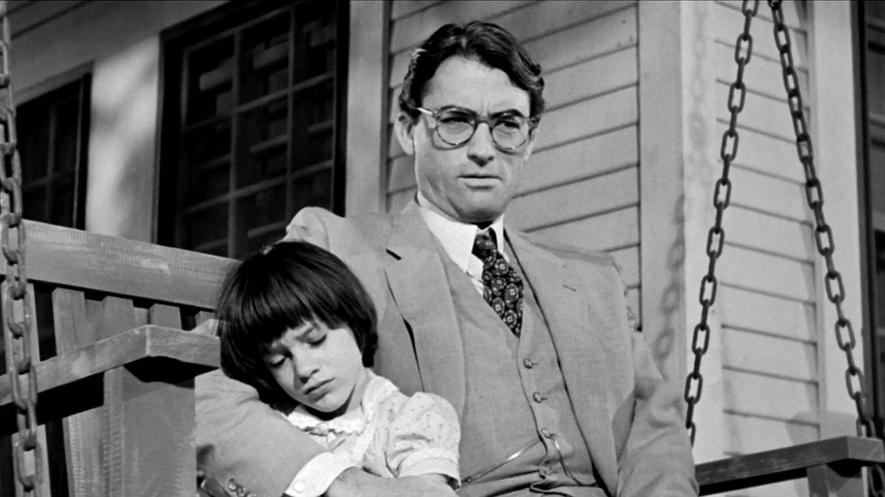  Mary Badham and Gregory Peck in “To Kill a Mockingbird.”Universal Pictures](https://www.nytimes.com/watching/recommendations/watching-film-to-kill-a-mockingbird)

Movie

## [To Kill a Mockingbird](https://www.nytimes.com/watching/recommendations/watching-film-to-kill-a-mockingbird)

Few major motion pictures have proven as durable as this 1962 adaptation of the beloved novel by Harper Lee. Released amid the struggles of the civil rights movement, this elegant memory play concerns a young Southern girl’s awakening to the injustices of racial prejudice, and the ray of hope provided by her idealistic father (an Oscar-winning Gregory Peck, never more sturdy and inspiring). Smoothly interweaving courtroom drama, social justice plea and coming-of-age narrative, “Mockingbird” is evocative and emotional. Keep an eye out for a young Robert Duvall in his big-screen debut. (Other Hollywood classics on Netflix include **“The African Queen”** and **“Sunset Boulevard.”**)

- [Netflix](https://gowatchit.com/movies/30134/watch_now?category=online&modality=widget&origin_url=https%3A%2F%2Fwww.nytimes.com%2Fwatching%2Flists%2Fbest-movies-on-netflix%3Fsmid%3Dfb-nytimes%26smtyp%3Dcur&partner_id=20&provider_format_id=1&provider_id=1)
- [Amazon Video (Buy)](https://gowatchit.com/movies/30134/watch_now?category=online&modality=widget&origin_url=https%3A%2F%2Fwww.nytimes.com%2Fwatching%2Flists%2Fbest-movies-on-netflix%3Fsmid%3Dfb-nytimes%26smtyp%3Dcur&partner_id=20&provider_format_id=7&provider_id=11)
- [iTunes](https://gowatchit.com/movies/30134/watch_now?category=online&modality=widget&origin_url=https%3A%2F%2Fwww.nytimes.com%2Fwatching%2Flists%2Fbest-movies-on-netflix%3Fsmid%3Dfb-nytimes%26smtyp%3Dcur&partner_id=20&provider_format_id=3&provider_id=3)
- [+ 3 others](https://www.nytimes.com/watching/lists/best-movies-on-netflix?emc=edit_ne_20180102&nl=evening-briefing&nlid=72982178&te=1#)

* * *

[   A scene from “Jaws.”Universal Studios](https://www.nytimes.com/watching/recommendations/watching-film-jaws)

Movie

## [Jaws](https://www.nytimes.com/watching/recommendations/watching-film-jaws)

Steven Spielberg had only a single feature and a handful of TV credits to his name when he was handed the task of adapting a pulpy best seller about a killer shark. The famously troubled production, which went weeks over schedule and millions over budget — not least because of the frequently broken mechanical shark — forced the director to rely more on suspense and characterization than on special effects. The rest is cinema history. The scary moments are breathlessly executed, but our attachment to the three protagonists (wonderfully brought to life by Richard Dreyfuss, Roy Scheider and Robert Shaw) renders the stakes far higher than in your standard horror flick. (Looking for more movies on Netflix about nature gone amok? Try **“The Host”** and **“White God.”**)

- [Netflix](https://gowatchit.com/movies/34068/watch_now?category=online&modality=widget&origin_url=https%3A%2F%2Fwww.nytimes.com%2Fwatching%2Flists%2Fbest-movies-on-netflix%3Femc%3Dedit_ne_20180102%26nl%3Devening-briefing%26nlid%3D71386779%26te%3D1&partner_id=20&provider_format_id=1&provider_id=1)
- [Amazon Video (Buy)](https://gowatchit.com/movies/34068/watch_now?category=online&modality=widget&origin_url=https%3A%2F%2Fwww.nytimes.com%2Fwatching%2Flists%2Fbest-movies-on-netflix%3Femc%3Dedit_ne_20180102%26nl%3Devening-briefing%26nlid%3D71386779%26te%3D1&partner_id=20&provider_format_id=7&provider_id=11)
- [Showtime](https://gowatchit.com/movies/34068/watch_now?category=online&modality=widget&origin_url=https%3A%2F%2Fwww.nytimes.com%2Fwatching%2Flists%2Fbest-movies-on-netflix%3Femc%3Dedit_ne_20180102%26nl%3Devening-briefing%26nlid%3D71386779%26te%3D1&partner_id=20&provider_format_id=144&provider_id=62)
- [+ 4 others](https://www.nytimes.com/watching/lists/best-movies-on-netflix?emc=edit_ne_20180102&nl=evening-briefing&nlid=72982178&te=1#)

* * *

[ 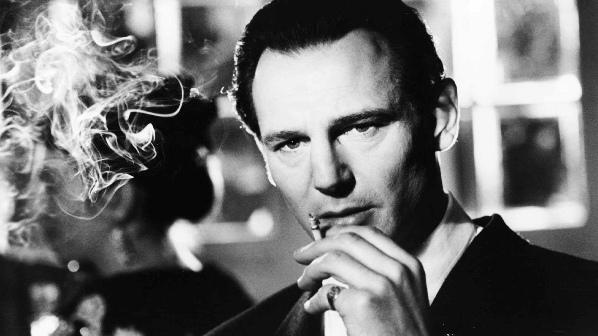  Liam Neeson in “Schindler’s List.”David James/Universal Pictures](https://www.nytimes.com/watching/recommendations/watching-film-schindlers-list)

Movie

## [Schindler’s List](https://www.nytimes.com/watching/recommendations/watching-film-schindlers-list)

After almost 20 years of popcorn moviemaking, Steven Spielberg proved himself to be not only a serious dramatist but also one of our most gifted historical chroniclers with this 1993 film. In it, he tells the true story of Oskar Schindler (Liam Neeson), a German businessman and member of the Nazi party who became the unlikely savior of more than 1,000 Jewish workers in his factories. Spielberg doesn’t shy away from the character’s dubious traits, which makes him an imperfect protagonist. But that makes his moral and ethical awakening all the more powerful. The director’s stark, harrowing black-and-white images infuse the film with such power and verisimilitude that, for many modern viewers, their understanding of the Holocaust has been profoundly shaped by this film. (Other Oscar-friendly prestige dramas on Netflix include **“On Golden Pond” **and **“Field of Dreams.”)**

- [Netflix](https://gowatchit.com/movies/8837/watch_now?category=online&modality=widget&origin_url=https%3A%2F%2Fwww.nytimes.com%2Fwatching%2Flists%2Fbest-movies-on-netflix%3Fsmid%3Dfb-nytimes%26smtyp%3Dcur&partner_id=20&provider_format_id=1&provider_id=1)
- [Amazon Video (Buy)](https://gowatchit.com/movies/8837/watch_now?category=online&modality=widget&origin_url=https%3A%2F%2Fwww.nytimes.com%2Fwatching%2Flists%2Fbest-movies-on-netflix%3Fsmid%3Dfb-nytimes%26smtyp%3Dcur&partner_id=20&provider_format_id=7&provider_id=11)
- [iTunes](https://gowatchit.com/movies/8837/watch_now?category=online&modality=widget&origin_url=https%3A%2F%2Fwww.nytimes.com%2Fwatching%2Flists%2Fbest-movies-on-netflix%3Fsmid%3Dfb-nytimes%26smtyp%3Dcur&partner_id=20&provider_format_id=3&provider_id=3)
- [+ 3 others](https://www.nytimes.com/watching/lists/best-movies-on-netflix?emc=edit_ne_20180102&nl=evening-briefing&nlid=72982178&te=1#)

* * *

[   Pam Grier in “Jackie Brown.”Miramax Films](https://www.nytimes.com/watching/titles/jackie-brown)

Movie

## [Jackie Brown](https://www.nytimes.com/watching/titles/jackie-brown)

Quentin Tarantino crafted his follow-up to “Pulp Fiction” as a valentine to two of his key influences: the author Elmore Leonard, whose novel “Rum Punch” was the source material (it’s Tarantino’s only adapted screenplay to date), and the ’70s exploitation movie legend Pam Grier, for whom he reworked the leading role of an airline stewardess caught between a gunrunner, the F.B.I. and the A.T.F. It has all the hallmarks of a Tarantino picture: memorable and musical dialogue, playful construction, eccentric supporting characters and a throwback aesthetic. But its aging protagonists — not only Grier but also Robert Forster’s seen-it-all bail bondsman — lend the picture a maturity and gravitas that can elude even Tarantino’s best work. (For more Tarantino on Netflix, check out **“**[**Inglourious Basterds**](https://www.nytimes.com/watching/recommendations/inglourious-basterds?auto=true)**” **and **“The Hateful Eight.”**)

- [Netflix](https://gowatchit.com/movies/27365/watch_now?category=online&modality=widget&origin_url=https%3A%2F%2Fwww.nytimes.com%2Fwatching%2Flists%2Fbest-movies-on-netflix%3Fsmid%3Dfb-nytimes%26smtyp%3Dcur&partner_id=20&provider_format_id=1&provider_id=1)
- [Amazon Video (Buy)](https://gowatchit.com/movies/27365/watch_now?category=online&modality=widget&origin_url=https%3A%2F%2Fwww.nytimes.com%2Fwatching%2Flists%2Fbest-movies-on-netflix%3Fsmid%3Dfb-nytimes%26smtyp%3Dcur&partner_id=20&provider_format_id=7&provider_id=11)
- [iTunes](https://gowatchit.com/movies/27365/watch_now?category=online&modality=widget&origin_url=https%3A%2F%2Fwww.nytimes.com%2Fwatching%2Flists%2Fbest-movies-on-netflix%3Fsmid%3Dfb-nytimes%26smtyp%3Dcur&partner_id=20&provider_format_id=3&provider_id=3)
- [+ 3 others](https://www.nytimes.com/watching/lists/best-movies-on-netflix?emc=edit_ne_20180102&nl=evening-briefing&nlid=72982178&te=1#)

* * *

[   Julianne Moore and Mark Wahlberg in “Boogie Nights.”G. Lefkowitz/New Line Cinema](https://www.nytimes.com/watching/recommendations/watching-film-boogie-nights)

Movie

## [Boogie Nights](https://www.nytimes.com/watching/recommendations/watching-film-boogie-nights)

When this crime-infused comedic drama roared onto the indie scene in the fall of 1997, it was widely (and favorably) compared to “[Pulp Fiction](https://www.nytimes.com/watching/recommendations/watching-film-pulp-fiction?auto=true).” It’s not hard to guess why: the setting amid the seedy underbelly of the Los Angeles suburbs; the screenplay filled with sly cinematic allusions; the hot-shot young auteur, directing his second feature. But Paul Thomas Anderson was no Tarantino wannabe; “Boogie Nights,” his breakthrough film, is most memorable for the affection it shows its characters — a crew of pornographers and outcasts — and for its humanistic approach to their eccentricities. (Other high-octane, crime-fueled cult favorites on Netflix include **“**[**Oldboy**](https://www.nytimes.com/watching/recommendations/oldboy?auto=true)**”** and **“City of God.”**)

- [Netflix](https://gowatchit.com/movies/12455/watch_now?category=online&modality=widget&origin_url=https%3A%2F%2Fwww.nytimes.com%2Fwatching%2Flists%2Fbest-movies-on-netflix%3Fsmid%3Dfb-nytimes%26smtyp%3Dcur&partner_id=20&provider_format_id=1&provider_id=1)
- [Amazon Video (Buy)](https://gowatchit.com/movies/12455/watch_now?category=online&modality=widget&origin_url=https%3A%2F%2Fwww.nytimes.com%2Fwatching%2Flists%2Fbest-movies-on-netflix%3Fsmid%3Dfb-nytimes%26smtyp%3Dcur&partner_id=20&provider_format_id=7&provider_id=11)
- [iTunes](https://gowatchit.com/movies/12455/watch_now?category=online&modality=widget&origin_url=https%3A%2F%2Fwww.nytimes.com%2Fwatching%2Flists%2Fbest-movies-on-netflix%3Fsmid%3Dfb-nytimes%26smtyp%3Dcur&partner_id=20&provider_format_id=3&provider_id=3)
- [+ 3 others](https://www.nytimes.com/watching/lists/best-movies-on-netflix?emc=edit_ne_20180102&nl=evening-briefing&nlid=72982178&te=1#)

* * *

[ 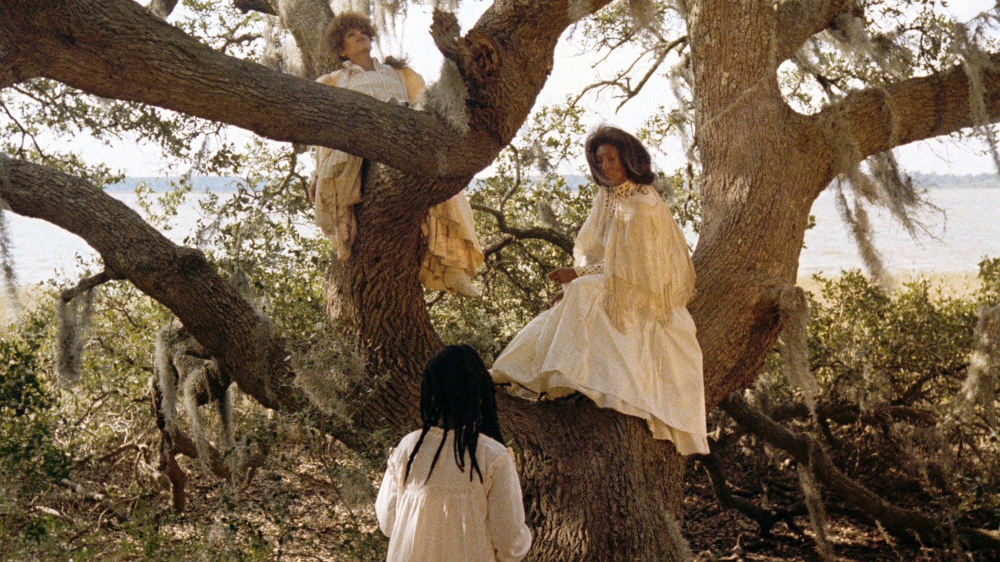  Clockwise from top, Trula Hoosier, Barbara-O and Alva Rogers in “Daughters of the Dust.”Cohen Film Collection](https://www.nytimes.com/watching/titles/daughters-of-the-dust)

Movie

## [Daughters of the Dust](https://www.nytimes.com/watching/titles/daughters-of-the-dust)

This historical drama from writer-director Julie Dash proved something of a challenge for general audiences when it was originally released in 1991. But its reputation has grown in the years since (thanks, in no small part, to the explicit homage paid to it by Beyoncé’s “Lemonade”), elevating it to its proper place among the most important independent films of its era. Working in a splashy, presentational style that emphasizes tone and memory over straightforward storytelling, Dash crafts a gorgeous and evocative work, stunningly rendered and utterly inimitable. (For more gorgeous period pieces on Netflix, try **“The Immigrant”**)

- [Netflix](https://gowatchit.com/movies/205305/watch_now?category=online&modality=widget&origin_url=https%3A%2F%2Fwww.nytimes.com%2Fwatching%2Flists%2Fbest-movies-on-netflix%3Fsmid%3Dfb-nytimes%26smtyp%3Dcur&partner_id=20&provider_format_id=1&provider_id=1)
- [Amazon Video (Buy)](https://gowatchit.com/movies/205305/watch_now?category=online&modality=widget&origin_url=https%3A%2F%2Fwww.nytimes.com%2Fwatching%2Flists%2Fbest-movies-on-netflix%3Fsmid%3Dfb-nytimes%26smtyp%3Dcur&partner_id=20&provider_format_id=7&provider_id=11)
- [iTunes](https://gowatchit.com/movies/205305/watch_now?category=online&modality=widget&origin_url=https%3A%2F%2Fwww.nytimes.com%2Fwatching%2Flists%2Fbest-movies-on-netflix%3Fsmid%3Dfb-nytimes%26smtyp%3Dcur&partner_id=20&provider_format_id=3&provider_id=3)
- [+ 3 others](https://www.nytimes.com/watching/lists/best-movies-on-netflix?emc=edit_ne_20180102&nl=evening-briefing&nlid=72982178&te=1#)

* * *

[ 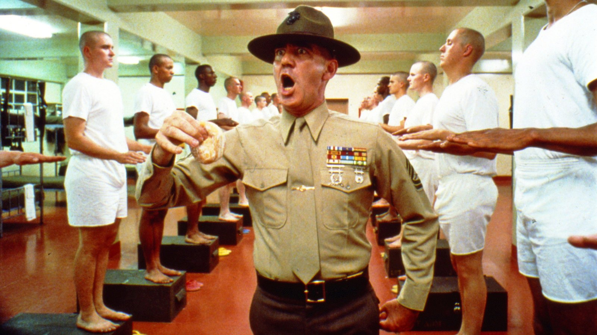  R. Lee Ermey in “Full Metal Jacket.” Warner Bros.](https://www.nytimes.com/watching/recommendations/watching-film-full-metal-jacket)

Movie

## [Full Metal Jacket](https://www.nytimes.com/watching/recommendations/watching-film-full-metal-jacket)

This vivid and disturbing grunt’s-eye view of the war in Vietnam combines elements of Gustav Hasford’s novel “The Short-Timers”; the war reporting of Michael Herr (who helped write the screenplay); and the distinctive eye of its director, Stanley Kubrick. Its best scenes come early, in the basic-training battle between a cruel drill sergeant (R. Lee Ermey) and the heavyset new recruit he singles out for abuse (Vincent D’Onofrio). But Kubrick maintains a sense of relentless discomfort and complicated morality throughout the picture, which functions as a probing examination of the Vietnam conflict and of the mental toll it took on the men who fought it. (War movie aficionados will also find **“The Longest Day” **on Netflix.)

- [Netflix](https://gowatchit.com/movies/32829/watch_now?category=online&modality=widget&origin_url=https%3A%2F%2Fwww.nytimes.com%2Fwatching%2Flists%2Fbest-movies-on-netflix&partner_id=20&provider_format_id=1&provider_id=1)
- [Amazon Video (Buy)](https://gowatchit.com/movies/32829/watch_now?category=online&modality=widget&origin_url=https%3A%2F%2Fwww.nytimes.com%2Fwatching%2Flists%2Fbest-movies-on-netflix&partner_id=20&provider_format_id=7&provider_id=11)
- [iTunes](https://gowatchit.com/movies/32829/watch_now?category=online&modality=widget&origin_url=https%3A%2F%2Fwww.nytimes.com%2Fwatching%2Flists%2Fbest-movies-on-netflix&partner_id=20&provider_format_id=3&provider_id=3)
- [+ 3 others](https://www.nytimes.com/watching/lists/best-movies-on-netflix?emc=edit_ne_20180102&nl=evening-briefing&nlid=72982178&te=1#)

* * *

[ 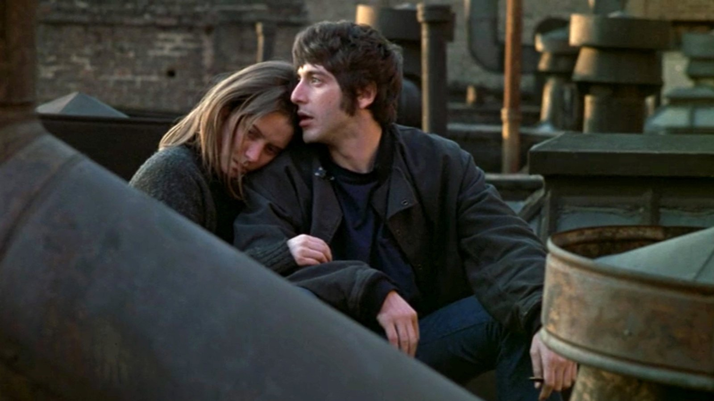  Kitty Winn and Al Pacino in “The Panic in Needle Park.”20th Century Fox](https://www.nytimes.com/watching/titles/the-panic-in-needle-park)

Movie

## [The Panic in Needle Park](https://www.nytimes.com/watching/titles/the-panic-in-needle-park)

A young actor named Al Pacino found his first major movie showcase in this mercilessly intense drug drama from 1971. Pacino plays Bobby, a street hustler and heroin addict who falls for Helen (the equally impressive Kitty Winn), who together spend their days and nights in an endless cycle of scrambling, copping, shooting up, coming down and starting all over again. The screenplay (written by Joan Didion and John Gregory Dunne) examines their lives without passing easy judgment — or succumbing to the monotony of its characters’ lives — while the film’s grainy, documentarylike photography captures the grunginess of early ’70s New York. (**“Heaven Knows What,”** also on Netflix, is a contemporary portrait of heroin addiction that owes much to “Needle Park.”)

- [Netflix](https://gowatchit.com/movies/40732/watch_now?category=online&modality=widget&origin_url=https%3A%2F%2Fwww.nytimes.com%2Fwatching%2Flists%2Fbest-movies-on-netflix%3Fsmid%3Dfb-nytimes%26smtyp%3Dcur&partner_id=20&provider_format_id=1&provider_id=1)

* * *

[   Ronald Zehrfeld and Nina Hoss in “Phoenix.”Christian Schulz/Schramm Film](https://www.nytimes.com/watching/recommendations/phoenix)

Movie

## [Phoenix](https://www.nytimes.com/watching/recommendations/phoenix)

A concentration camp survivor, her face totally reconstructed, seeks out the husband who betrayed her and whom, in spite of everything, she still loves. She finds that he not only believes she died, he also wants this beautiful stranger to help him — by impersonating the wife he thinks is dead. This German historical drama requires some suspension of disbelief, but it’s all in line with the film’s theatrical style and operatic emotions; the film warrants comparison to Alfred Hitchcock’s “Vertigo,” but deserves it. Nina Hoss is spectacular in the leading role, crafting a multilevel performance of reality, fantasy and imitation, and the closing scene is an absolute stunner.

- [Netflix](https://gowatchit.com/movies/269795/watch_now?category=online&modality=widget&origin_url=https%3A%2F%2Fwww.nytimes.com%2Fwatching%2Flists%2Fbest-movies-on-netflix%3Femc%3Dedit_ne_20180102%26nl%3Devening-briefing%26nlid%3D82973164%26te%3D1&partner_id=20&provider_format_id=1&provider_id=1)
- [Amazon Video (Buy)](https://gowatchit.com/movies/269795/watch_now?category=online&modality=widget&origin_url=https%3A%2F%2Fwww.nytimes.com%2Fwatching%2Flists%2Fbest-movies-on-netflix%3Femc%3Dedit_ne_20180102%26nl%3Devening-briefing%26nlid%3D82973164%26te%3D1&partner_id=20&provider_format_id=7&provider_id=11)
- [iTunes](https://gowatchit.com/movies/269795/watch_now?category=online&modality=widget&origin_url=https%3A%2F%2Fwww.nytimes.com%2Fwatching%2Flists%2Fbest-movies-on-netflix%3Femc%3Dedit_ne_20180102%26nl%3Devening-briefing%26nlid%3D82973164%26te%3D1&partner_id=20&provider_format_id=3&provider_id=3)
- [+ 2 others](https://www.nytimes.com/watching/lists/best-movies-on-netflix?emc=edit_ne_20180102&nl=evening-briefing&nlid=72982178&te=1#)

* * *

[ 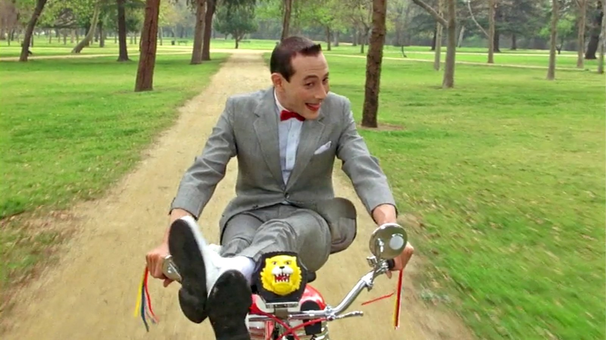  Paul Reubens in “Pee-Wee’s Big Adventure.”Warner Bros.](https://www.nytimes.com/watching/titles/pee-wees-big-adventure)

Movie

## [Pee-Wee’s Big Adventure](https://www.nytimes.com/watching/titles/pee-wees-big-adventure)

Paul Reubens became a pop culture sensation thanks to this 1985 comic adventure, which was also the debut feature of director Tim Burton. Together, they craft a wild and weird world for the childlike Pee-Wee Herman, played by Reubens, who must leave the bubble of his comfortable small-town life (and the Rube Goldberg contraptions of his charming home) when his beloved bicycle is stolen. His “big adventure” takes him to truck stops and biker bars, to museums and rodeos, from Texas to Hollywood, in a series of gloriously goofy and slyly witty set pieces. (For more broad comedy, check out **“Hot Fuzz” **and** “Best in Show.”**)

- [Amazon Video (Buy)](https://gowatchit.com/movies/50951/watch_now?category=online&modality=widget&origin_url=https%3A%2F%2Fwww.nytimes.com%2Fwatching%2Flists%2Fbest-movies-on-netflix%3Femc%3Dedit_ne_20180102%26nl%3Devening-briefing%26nlid%3D59290979%26te%3D1&partner_id=20&provider_format_id=7&provider_id=11)
- [iTunes](https://gowatchit.com/movies/50951/watch_now?category=online&modality=widget&origin_url=https%3A%2F%2Fwww.nytimes.com%2Fwatching%2Flists%2Fbest-movies-on-netflix%3Femc%3Dedit_ne_20180102%26nl%3Devening-briefing%26nlid%3D59290979%26te%3D1&partner_id=20&provider_format_id=3&provider_id=3)
- [Google Play](https://gowatchit.com/movies/50951/watch_now?category=online&modality=widget&origin_url=https%3A%2F%2Fwww.nytimes.com%2Fwatching%2Flists%2Fbest-movies-on-netflix%3Femc%3Dedit_ne_20180102%26nl%3Devening-briefing%26nlid%3D59290979%26te%3D1&partner_id=20&provider_format_id=18&provider_id=16)
- [+ 2 others](https://www.nytimes.com/watching/lists/best-movies-on-netflix?emc=edit_ne_20180102&nl=evening-briefing&nlid=72982178&te=1#)

* * *

[   Gary Oldman in “Tinker, Tailor, Soldier, Spy.”Jack English/Focus Features](https://www.nytimes.com/watching/recommendations/watching-film-tinker-tailor-soldier-spy)

Movie

## [Tinker Tailor Soldier Spy](https://www.nytimes.com/watching/recommendations/watching-film-tinker-tailor-soldier-spy)

Gary Oldman is a marvel as George Smiley, the British intelligence agent at the center of this adaptation of the novel by John le Carré. It’s the kind of performance that draws its power from a character’s refusal to raise his voice: One gets the feeling he’s done what he’s done for so long, with such awareness of his own creeping obsolescence, that he can hardly be bothered. Around that performance, director Tomas Alfredson (“Let the Right One In”) mounts the best big-screen interpretation of le Carré’s work to date, thanks to a dizzyingly complicated but never unclear screenplay adaptation, and a who’s who of British character acting by the supporting cast, which includes Colin Firth, Tom Hardy, Mark Strong, Benedict Cumberbatch, John Hurt and Toby Jones. (Fans of challenging drama should also seek out **“The Diving Bell and the Butterfly,” **and** “Ain’t Them Bodies Saints.”**)

- [Netflix](https://gowatchit.com/movies/264192/watch_now?category=online&modality=widget&origin_url=https%3A%2F%2Fwww.nytimes.com%2Fwatching%2Flists%2Fbest-movies-on-netflix%3Fsmid%3Dfb-nytimes%26smtyp%3Dcur&partner_id=20&provider_format_id=1&provider_id=1)
- [Amazon Video (Buy)](https://gowatchit.com/movies/264192/watch_now?category=online&modality=widget&origin_url=https%3A%2F%2Fwww.nytimes.com%2Fwatching%2Flists%2Fbest-movies-on-netflix%3Fsmid%3Dfb-nytimes%26smtyp%3Dcur&partner_id=20&provider_format_id=7&provider_id=11)
- [iTunes](https://gowatchit.com/movies/264192/watch_now?category=online&modality=widget&origin_url=https%3A%2F%2Fwww.nytimes.com%2Fwatching%2Flists%2Fbest-movies-on-netflix%3Fsmid%3Dfb-nytimes%26smtyp%3Dcur&partner_id=20&provider_format_id=3&provider_id=3)
- [+ 3 others](https://www.nytimes.com/watching/lists/best-movies-on-netflix?emc=edit_ne_20180102&nl=evening-briefing&nlid=72982178&te=1#)

* * *

[ 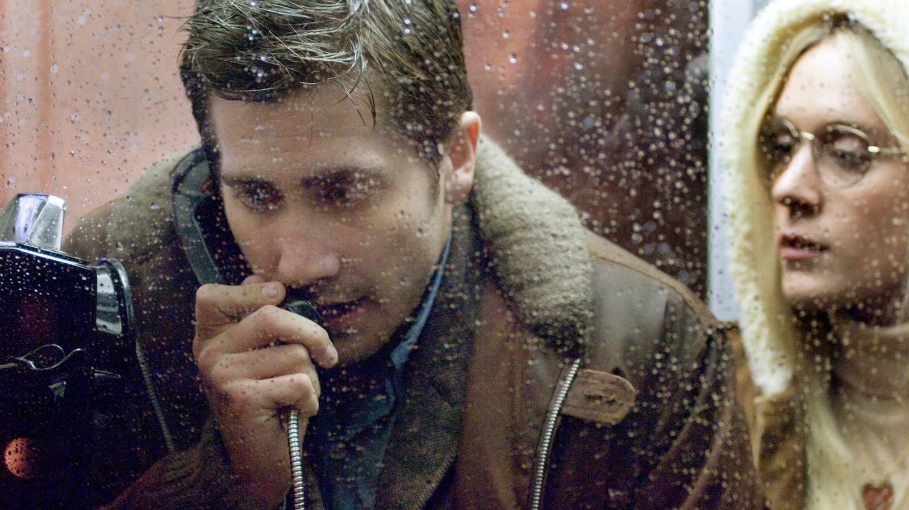  Jake Gyllenhaal and Chloë Sevigny in “Zodiac.”Merrick Morton/Paramount Pictures](https://www.nytimes.com/watching/recommendations/watching-film-zodiac)

Movie

## [Zodiac](https://www.nytimes.com/watching/recommendations/watching-film-zodiac)

Director David Fincher’s first big success, critically and commercially, was his 1995 thriller “Seven,” so he could have easily tread water with this 2007 look at one of America’s most notorious serial killers. Instead, he widened his frame, focusing less on the grisly killings than on their investigative aftermath. Rather than produce yet another rumination on the mind of a killer, “Zodiac” asks what it’s like to devote one’s life to acquiring knowledge that may, for all practical purposes, be unknowable. Set mostly in the ’60s and ’70s, it’s crafted in the style of movies from the era like “All the President’s Men” and “Klute” — dark and foreboding, muted yet explosive.

- [Netflix](https://gowatchit.com/movies/47284/watch_now?category=online&modality=widget&origin_url=https%3A%2F%2Fwww.nytimes.com%2Fwatching%2Flists%2Fbest-movies-on-netflix%3Femc%3Dedit_ne_20180102%26nl%3Devening-briefing%26nlid%3D59290979%26te%3D1&partner_id=20&provider_format_id=1&provider_id=1)
- [Amazon Video (Buy)](https://gowatchit.com/movies/47284/watch_now?category=online&modality=widget&origin_url=https%3A%2F%2Fwww.nytimes.com%2Fwatching%2Flists%2Fbest-movies-on-netflix%3Femc%3Dedit_ne_20180102%26nl%3Devening-briefing%26nlid%3D59290979%26te%3D1&partner_id=20&provider_format_id=7&provider_id=11)
- [Hulu](https://gowatchit.com/movies/47284/watch_now?category=online&modality=widget&origin_url=https%3A%2F%2Fwww.nytimes.com%2Fwatching%2Flists%2Fbest-movies-on-netflix%3Femc%3Dedit_ne_20180102%26nl%3Devening-briefing%26nlid%3D59290979%26te%3D1&partner_id=20&provider_format_id=21&provider_id=15)
- [+ 5 others](https://www.nytimes.com/watching/lists/best-movies-on-netflix?emc=edit_ne_20180102&nl=evening-briefing&nlid=72982178&te=1#)

* * *

[   Emily Watson and Adam Sandler in “Punch-Drunk Love.”Columbia Pictures](https://www.nytimes.com/watching/titles/punch-drunk-love)

Movie

## [Punch-Drunk Love](https://www.nytimes.com/watching/titles/punch-drunk-love)

One of 20th-century cinema’s oddest pairings — the “Boogie Nights” and “Magnolia” auteur, Paul Thomas Anderson, and the “Happy Gilmore” star, Adam Sandler — resulted in a film that brought out the best in both artists. Sandler harnessed the genuine rage and discomfort of his throwaway comedies to create a character of pain and complexity. His light touch, in turn, seemed to give Anderson permission to pare down his extravagant style. Their collaboration is strange, funny and heartbreaking, a potentially terrible idea that takes majestic flight. (For more of Sandler’s serious side, see **“The Meyerowitz Stories (New and Selected)”**; for more wacky comics in straight roles, check out Jim Carrey in **“The Truman Show,”** on Netflix starting Jan. 1.)

- [Netflix](https://gowatchit.com/movies/37416/watch_now?category=online&modality=widget&origin_url=https%3A%2F%2Fwww.nytimes.com%2Fwatching%2Flists%2Fbest-movies-on-netflix&partner_id=20&provider_format_id=1&provider_id=1)
- [Amazon Video (Buy)](https://gowatchit.com/movies/37416/watch_now?category=online&modality=widget&origin_url=https%3A%2F%2Fwww.nytimes.com%2Fwatching%2Flists%2Fbest-movies-on-netflix&partner_id=20&provider_format_id=7&provider_id=11)
- [Hulu](https://gowatchit.com/movies/37416/watch_now?category=online&modality=widget&origin_url=https%3A%2F%2Fwww.nytimes.com%2Fwatching%2Flists%2Fbest-movies-on-netflix&partner_id=20&provider_format_id=21&provider_id=15)
- [+ 4 others](https://www.nytimes.com/watching/lists/best-movies-on-netflix?emc=edit_ne_20180102&nl=evening-briefing&nlid=72982178&te=1#)

* * *

[   Greta Gerwig in "Frances Ha."IFC Films](https://www.nytimes.com/watching/recommendations/watching-film-frances-ha)

Movie

## [Frances Ha](https://www.nytimes.com/watching/recommendations/watching-film-frances-ha)

Director Noah Baumbach and Greta Gerwig, his leading lady in “Greenberg,” reunited to write this contemporary New York comedy in which Gerwig stars as Frances, an aimless twentysomething who’s struggling to navigate the city, her life and her relationships. It sounds like old hat, but Gerwig’s considerable charisma and Baumbach’s elegant, European-influenced style make the material fresh and vibrant. And their screenplay ingeniously dodges the usual romantic entanglements by putting Frances’ closest female friendship through the wringer of jealousy, breakup and reconciliation. (If you enjoy Baumbach’s work, queue up his first feature, **“Kicking and Screaming.”)**

- [Netflix](https://gowatchit.com/movies/266073/watch_now?category=online&modality=widget&origin_url=https%3A%2F%2Fwww.nytimes.com%2Fwatching%2Flists%2Fbest-movies-on-netflix%3Femc%3Dedit_ne_20180102%26nl%3Devening-briefing%26nlid%3D77504479%26te%3D1&partner_id=20&provider_format_id=1&provider_id=1)
- [Amazon Video (Buy)](https://gowatchit.com/movies/266073/watch_now?category=online&modality=widget&origin_url=https%3A%2F%2Fwww.nytimes.com%2Fwatching%2Flists%2Fbest-movies-on-netflix%3Femc%3Dedit_ne_20180102%26nl%3Devening-briefing%26nlid%3D77504479%26te%3D1&partner_id=20&provider_format_id=7&provider_id=11)
- [iTunes](https://gowatchit.com/movies/266073/watch_now?category=online&modality=widget&origin_url=https%3A%2F%2Fwww.nytimes.com%2Fwatching%2Flists%2Fbest-movies-on-netflix%3Femc%3Dedit_ne_20180102%26nl%3Devening-briefing%26nlid%3D77504479%26te%3D1&partner_id=20&provider_format_id=3&provider_id=3)
- [+ 2 others](https://www.nytimes.com/watching/lists/best-movies-on-netflix?emc=edit_ne_20180102&nl=evening-briefing&nlid=72982178&te=1#)

* * *

[   Gael García Bernal and Maribel Verdu in the film “Y Tu Mamá También.”Daniel Daza/IFC Films](https://www.nytimes.com/watching/recommendations/watching-film-y-tu-mama-tambien)

Movie

## [Y Tu Mamá También](https://www.nytimes.com/watching/recommendations/watching-film-y-tu-mama-tambien)

It sounds like the setup for an ’80s sex comedy: Two horny teenage boys take an impromptu road trip and talk a seductive older woman into coming along. But under the sure hand of director Alfonso Cuarón (“Gravity,” “Children of Men”), “Y Tu Mamá También” is about much more than sex. Vividly capturing the intensity and tentativeness of youthful relationships, Cuarón frames their story partly through the unexpected but effective lens of class and political struggle, constructing a delicate film with much to say about masculinity, poverty and mortality. And *then* it’s sexy, on top of that. (For more foreign drama with an erotic hue, check out **“Blue Is the Warmest Color.”**)

- [Netflix](https://gowatchit.com/movies/36154/watch_now?category=online&modality=widget&origin_url=https%3A%2F%2Fwww.nytimes.com%2Fwatching%2Flists%2Fbest-movies-on-netflix%3Femc%3Dedit_ne_20180102%26nl%3Devening-briefing%26nlid%3D79016824%26te%3D1&partner_id=20&provider_format_id=1&provider_id=1)
- [Amazon Video (Buy)](https://gowatchit.com/movies/36154/watch_now?category=online&modality=widget&origin_url=https%3A%2F%2Fwww.nytimes.com%2Fwatching%2Flists%2Fbest-movies-on-netflix%3Femc%3Dedit_ne_20180102%26nl%3Devening-briefing%26nlid%3D79016824%26te%3D1&partner_id=20&provider_format_id=7&provider_id=11)
- [FilmStruck](https://gowatchit.com/movies/36154/watch_now?category=online_subscription&modality=widget&origin_url=https%3A%2F%2Fwww.nytimes.com%2Fwatching%2Flists%2Fbest-movies-on-netflix%3Femc%3Dedit_ne_20180102%26nl%3Devening-briefing%26nlid%3D79016824%26te%3D1&partner_id=20&provider_format_id=196&provider_id=136)

* * *

[   Rooney Mara in “Carol.”Weinstein Company](https://www.nytimes.com/watching/recommendations/carol)

Movie

## [Carol](https://www.nytimes.com/watching/recommendations/carol)

Patricia Highsmith’s lesbian romance novel “The Price of Salt,” originally written under the pseudonym Claire Morgan, is sensitively and intelligently adapted by director Todd Haynes into this companion to his earlier masterpiece “Far From Heaven.” Both are stories of forbidden love set in the repressive past of 1950s suburbia, as sifted through the more progressive sensibilities of the 21st century. Cate Blanchett is smashing as a suburban ‘50s housewife who finds herself so intoxicated by a bohemian shopgirl (an enchanting Rooney Mara) that she’s willing to risk her entire comfortable existence in order, just once, to follow her heart. This is a rare period piece in which the characters actually seem to be living in their settings, not in front of them. (**“Quiz Show”** is another must-see drama set in the 1950s.)

- [Netflix](https://gowatchit.com/movies/302278/watch_now?category=online&modality=widget&origin_url=https%3A%2F%2Fwww.nytimes.com%2Fwatching%2Flists%2Fbest-movies-on-netflix%3Femc%3Dedit_ne_20180102%26nl%3Devening-briefing%26nlid%3D73187976%26te%3D1&partner_id=20&provider_format_id=1&provider_id=1)
- [Amazon Video (Buy)](https://gowatchit.com/movies/302278/watch_now?category=online&modality=widget&origin_url=https%3A%2F%2Fwww.nytimes.com%2Fwatching%2Flists%2Fbest-movies-on-netflix%3Femc%3Dedit_ne_20180102%26nl%3Devening-briefing%26nlid%3D73187976%26te%3D1&partner_id=20&provider_format_id=7&provider_id=11)
- [Showtime](https://gowatchit.com/movies/302278/watch_now?category=online&modality=widget&origin_url=https%3A%2F%2Fwww.nytimes.com%2Fwatching%2Flists%2Fbest-movies-on-netflix%3Femc%3Dedit_ne_20180102%26nl%3Devening-briefing%26nlid%3D73187976%26te%3D1&partner_id=20&provider_format_id=144&provider_id=62)
- [+ 3 others](https://www.nytimes.com/watching/lists/best-movies-on-netflix?emc=edit_ne_20180102&nl=evening-briefing&nlid=72982178&te=1#)

* * *

[ 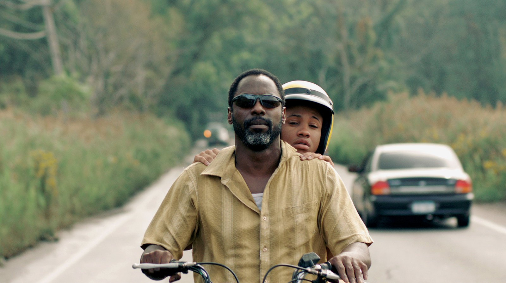  Isaiah Washington, left, and Tequan Richmond in “Blue Caprice.”Robert Blake/Sundance Selects](https://www.nytimes.com/watching/titles/blue-caprice)

Movie

## [Blue Caprice](https://www.nytimes.com/watching/titles/blue-caprice)

The 2002 killing spree by the so-called Beltway snipers, in which two men committed a series of random sniper killings in the Washington D.C. area, is technically the subject of this 2013 drama from director Alexandre Moors. But that’s not what the movie is really *about*. It’s more concerned with the psychological dynamics between the two men, and specifically the give-and-take of neediness and control that gave one of them the power to convince the other to kill for him. Isaiah Washington is chilling as the man who wields that power, while the young Tequan Richmond speaks monologues with his withdrawn silences. (If you like gripping true stories, also see **“Apollo 13,”** on Netflix starting Jan. 1.)

- [Netflix](https://gowatchit.com/movies/266739/watch_now?category=online&modality=widget&origin_url=https%3A%2F%2Fwww.nytimes.com%2Fwatching%2Flists%2Fbest-movies-on-netflix%3Femc%3Dedit_ne_20180102%26nl%3Devening-briefing%26nlid%3D34669013%26te%3D1&partner_id=20&provider_format_id=1&provider_id=1)
- [Amazon Video (Buy)](https://gowatchit.com/movies/266739/watch_now?category=online&modality=widget&origin_url=https%3A%2F%2Fwww.nytimes.com%2Fwatching%2Flists%2Fbest-movies-on-netflix%3Femc%3Dedit_ne_20180102%26nl%3Devening-briefing%26nlid%3D34669013%26te%3D1&partner_id=20&provider_format_id=7&provider_id=11)
- [Hulu](https://gowatchit.com/movies/266739/watch_now?category=online&modality=widget&origin_url=https%3A%2F%2Fwww.nytimes.com%2Fwatching%2Flists%2Fbest-movies-on-netflix%3Femc%3Dedit_ne_20180102%26nl%3Devening-briefing%26nlid%3D34669013%26te%3D1&partner_id=20&provider_format_id=21&provider_id=15)
- [+ 3 others](https://www.nytimes.com/watching/lists/best-movies-on-netflix?emc=edit_ne_20180102&nl=evening-briefing&nlid=72982178&te=1#)

* * *

[   Amy Ryan, center, in “Gone Baby Gone.”Claire Folger/Miramax Films.](https://www.nytimes.com/watching/recommendations/gone-baby-gone)

Movie

## [Gone Baby Gone](https://www.nytimes.com/watching/recommendations/gone-baby-gone)

Ben Affleck mounted a remarkable comeback in 2007, after years of acting in one mediocre movie after another, with this, his feature directorial debut. Affleck also helped write the screenplay to this gripping adaptation of the titular best-seller by Dennis Lehane, casting his brother, Casey Affleck, as a lower-rung private detective in Boston, whose involvement in a child abduction case reveals something far more rotten and sinister in his Southie neighborhood. Ben Affleck coaxes quiet performances out of his first-rate cast (the Oscar-nominated and all but unrecognizable Amy Ryan is the standout) and matches them with his low-key approach; nothing is overstated, but the film accumulates mounting power and emotional resonance with each passing scene.

- [Netflix](https://gowatchit.com/movies/48351/watch_now?category=online&modality=widget&origin_url=https%3A%2F%2Fwww.nytimes.com%2Fwatching%2Flists%2Fbest-movies-on-netflix%3Femc%3Dedit_ne_20180102%26nl%3Devening-briefing%26nlid%3D34669013%26te%3D1&partner_id=20&provider_format_id=1&provider_id=1)
- [Amazon Video (Buy)](https://gowatchit.com/movies/48351/watch_now?category=online&modality=widget&origin_url=https%3A%2F%2Fwww.nytimes.com%2Fwatching%2Flists%2Fbest-movies-on-netflix%3Femc%3Dedit_ne_20180102%26nl%3Devening-briefing%26nlid%3D34669013%26te%3D1&partner_id=20&provider_format_id=7&provider_id=11)
- [iTunes](https://gowatchit.com/movies/48351/watch_now?category=online&modality=widget&origin_url=https%3A%2F%2Fwww.nytimes.com%2Fwatching%2Flists%2Fbest-movies-on-netflix%3Femc%3Dedit_ne_20180102%26nl%3Devening-briefing%26nlid%3D34669013%26te%3D1&partner_id=20&provider_format_id=3&provider_id=3)
- [+ 3 others](https://www.nytimes.com/watching/lists/best-movies-on-netflix?emc=edit_ne_20180102&nl=evening-briefing&nlid=72982178&te=1#)

* * *

[   Guy Pearce in “Memento.”Danny Rothenberg/Newmarket Films](https://www.nytimes.com/watching/recommendations/memento)

Movie

## [Memento](https://www.nytimes.com/watching/recommendations/memento)

Christopher Nolan made his first big splash with this, his second feature film, a stylish film noir riff that tells its familiar story in an exuberantly inventive way: In order to mirror the disorientation of its protagonist, Leonard (Guy Pearce), who has lost his ability to create new memories, Nolan tells the story by ordering its scenes in reverse chronology. As Leonard pursues an investigation of his wife’s murder, revelations fold back on themselves and betrayals become clear to the audience before they’re known to him. Yet even without that narrative flourish, “Memento” would be a scorching piece of work, loaded with sharp performances, moody cinematography and a noir-inspired sense of doom. (For more Christopher Nolan on Netflix, check out **“[The Prestige](https://www.nytimes.com/watching/recommendations/the-prestige?auto=true).”**)

- [Netflix](https://gowatchit.com/movies/33524/watch_now?category=online&modality=widget&origin_url=https%3A%2F%2Fwww.nytimes.com%2Fwatching%2Flists%2Fbest-movies-on-netflix&partner_id=20&provider_format_id=1&provider_id=1)
- [Amazon Video (Buy)](https://gowatchit.com/movies/33524/watch_now?category=online&modality=widget&origin_url=https%3A%2F%2Fwww.nytimes.com%2Fwatching%2Flists%2Fbest-movies-on-netflix&partner_id=20&provider_format_id=7&provider_id=11)
- [iTunes](https://gowatchit.com/movies/33524/watch_now?category=online&modality=widget&origin_url=https%3A%2F%2Fwww.nytimes.com%2Fwatching%2Flists%2Fbest-movies-on-netflix&partner_id=20&provider_format_id=3&provider_id=3)
- [+ 3 others](https://www.nytimes.com/watching/lists/best-movies-on-netflix?emc=edit_ne_20180102&nl=evening-briefing&nlid=72982178&te=1#)

* * *

[   An Seo Hyun, left, and the computer-generated Okja in “Okja.”Netflix](https://www.nytimes.com/watching/titles/okja)

Movie

## [Okja](https://www.nytimes.com/watching/titles/okja)

A marvelously absurd, stingingly satirical and unexpectedly moving story of a girl and her genetically engineered super-pig, this Netflix original from the internationally acclaimed director Bong Joon Ho (“[Snowpiercer,](https://www.nytimes.com/watching/recommendations/watching-film-snowpiercer)” “[Memories of Murder](https://www.nytimes.com/watching/recommendations/memories-of-murder)”) is the kind of movie that goes in so many wild directions at once — urban mayhem one moment, character drama the next — it leaves you breathlessly off-balance. Bong coaxes game and unpredictable performances from his gloriously unhinged cast, with particularly juicy turns by Tilda Swinton and Jake Gyllenhaal. But the star of the movie is the young An Seo Hyun, who provides not only the picture’s spark, but also its heart.

- [Netflix](https://gowatchit.com/movies/443307/watch_now?category=online&modality=widget&origin_url=https%3A%2F%2Fwww.nytimes.com%2Fwatching%2Flists%2Fbest-movies-on-netflix&partner_id=20&provider_format_id=1&provider_id=1)

* * *

[   A scene from “The Iron Giant.”Warner Bros.](https://www.nytimes.com/watching/recommendations/the-iron-giant)

Movie

## [The Iron Giant](https://www.nytimes.com/watching/recommendations/the-iron-giant)

A young boy’s friendship with an alien robot in small-town America provides the spine for this charming animated adventure from director Brad Bird (who went on to direct the Pixar classics “The Incredibles” and “Ratatouille”). Set amid the early years of the Cold War, the film is a throwback to cartoons of that era, not only in terms of its art direction and plotting but also in its more traditional style of animation. “The Iron Giant” is a good old-fashioned piece of full-family entertainment, providing thrills for the kids alongside wry humor and vintage references for their parents.

- [Netflix](https://gowatchit.com/movies/28303/watch_now?category=online&modality=widget&origin_url=https%3A%2F%2Fwww.nytimes.com%2Fwatching%2Flists%2Fbest-movies-on-netflix&partner_id=20&provider_format_id=1&provider_id=1)
- [Amazon Video (Buy)](https://gowatchit.com/movies/28303/watch_now?category=online&modality=widget&origin_url=https%3A%2F%2Fwww.nytimes.com%2Fwatching%2Flists%2Fbest-movies-on-netflix&partner_id=20&provider_format_id=7&provider_id=11)
- [iTunes](https://gowatchit.com/movies/28303/watch_now?category=online&modality=widget&origin_url=https%3A%2F%2Fwww.nytimes.com%2Fwatching%2Flists%2Fbest-movies-on-netflix&partner_id=20&provider_format_id=3&provider_id=3)
- [+ 3 others](https://www.nytimes.com/watching/lists/best-movies-on-netflix?emc=edit_ne_20180102&nl=evening-briefing&nlid=72982178&te=1#)

* * *

[   The title character in “Moana,” voiced by Auli’i Cravalho.Disney](https://www.nytimes.com/watching/recommendations/moana)

Movie

## [Moana](https://www.nytimes.com/watching/recommendations/moana)

Disney’s most recent “princess” is a delightful mold-breaker: a Polynesian chieftain’s daughter, who takes to the high seas in pursuit of a banished demigod. But she’s not interested in finding her prince; she’s out to do nothing less than save her people. Auli’i Cravalho voices this heroine with an abundance of pluck and determination, while Dwayne Johnson is an inspired foil as the demigod Maui, a self-satisfied egotist who shows her the ropes (and is taken down a notch or two in the process). The animation is luminous and the direction is energetic, while the songs — written with the “Hamilton” mastermind, Lin-Manuel Miranda — are lyrically intricate and pop-tune catchy. It’s one Disney’s best recent features, and that’s not faint praise. (For more memorable family fare on Netflix, queue up **“**[**Kubo and the Two Strings**](https://www.nytimes.com/watching/recommendations/kubo-and-the-two-strings?auto=true)**,” “**[**Finding Dory**](https://www.nytimes.com/watching/recommendations/finding-dory?auto=true)**,” “Mulan” **or** “**[**Coraline**](https://www.nytimes.com/watching/recommendations/watching-film-coraline)**.”**)

- [Netflix](https://gowatchit.com/movies/269997/watch_now?category=online&modality=widget&origin_url=https%3A%2F%2Fwww.nytimes.com%2Fwatching%2Flists%2Fbest-movies-on-netflix&partner_id=20&provider_format_id=1&provider_id=1)
- [Amazon Video (Buy)](https://gowatchit.com/movies/269997/watch_now?category=online&modality=widget&origin_url=https%3A%2F%2Fwww.nytimes.com%2Fwatching%2Flists%2Fbest-movies-on-netflix&partner_id=20&provider_format_id=7&provider_id=11)
- [iTunes](https://gowatchit.com/movies/269997/watch_now?category=online&modality=widget&origin_url=https%3A%2F%2Fwww.nytimes.com%2Fwatching%2Flists%2Fbest-movies-on-netflix&partner_id=20&provider_format_id=3&provider_id=3)
- [+ 3 others](https://www.nytimes.com/watching/lists/best-movies-on-netflix?emc=edit_ne_20180102&nl=evening-briefing&nlid=72982178&te=1#)

* * *

[ 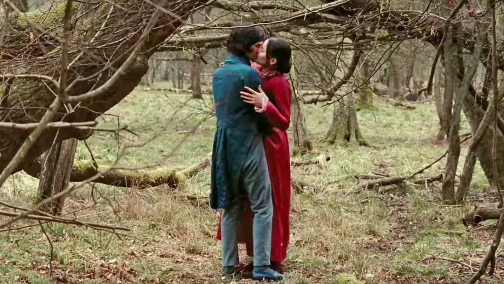  Ben Whishaw and Abbie Cornish in “Bright Star.”Apparition](https://www.nytimes.com/watching/recommendations/bright-star)

Movie

## [Bright Star](https://www.nytimes.com/watching/recommendations/bright-star)

The young poet John Keats and the free-spirited woman with whom he shared something like a romance during his final years are the focus of this drama from writer-director Jane Campion. As in her earlier film “The Piano,” Campion refuses to let the film’s period setting distance its story from a contemporary audience; she’s dealing with themes and ideas that are bigger than any particular time and place, and she keeps its characters and their conflicts universal and approachable. As a result, her film has more life and electricity than the typical drab literary biopic — it’s intelligent, involving and sexy. (For a sharply-drawn biopic with a different feel, we recommend **“**[**Milk**](https://www.nytimes.com/watching/recommendations/milk?auto=true)**,” **in which Sean Penn stars as the gay rights activist and politician Harvey Milk.)

- [Netflix](https://gowatchit.com/movies/1271/watch_now?category=online&modality=widget&origin_url=https%3A%2F%2Fwww.nytimes.com%2Fwatching%2Flists%2Fbest-movies-on-netflix&partner_id=20&provider_format_id=1&provider_id=1)
- [Amazon Video (Buy)](https://gowatchit.com/movies/1271/watch_now?category=online&modality=widget&origin_url=https%3A%2F%2Fwww.nytimes.com%2Fwatching%2Flists%2Fbest-movies-on-netflix&partner_id=20&provider_format_id=7&provider_id=11)
- [iTunes](https://gowatchit.com/movies/1271/watch_now?category=online&modality=widget&origin_url=https%3A%2F%2Fwww.nytimes.com%2Fwatching%2Flists%2Fbest-movies-on-netflix&partner_id=20&provider_format_id=3&provider_id=3)
- [+ 3 others](https://www.nytimes.com/watching/lists/best-movies-on-netflix?emc=edit_ne_20180102&nl=evening-briefing&nlid=72982178&te=1#)

* * *

[ 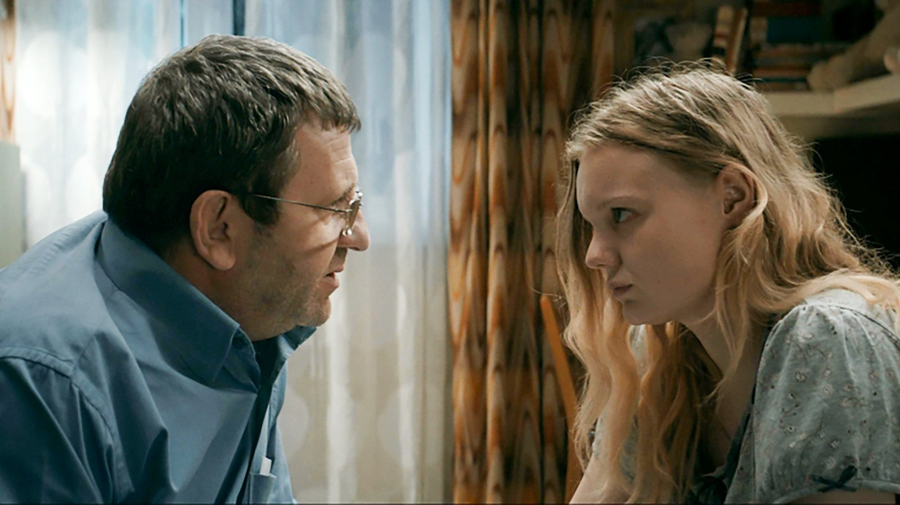  Adrian Titieni and Maria-Victoria Dragus in “Graduation.”Sundance Selects](https://www.nytimes.com/watching/titles/graduation)

Movie

## [Graduation](https://www.nytimes.com/watching/titles/graduation)

The films of the Romanian auteur Cristian Mungiu (which include “[4 Months, 3 Weeks and 2 Days”](https://www.nytimes.com/watching/recommendations/4-months-3-weeks-and-2-days) and “Beyond the Hills”) are in many ways morality plays, a practice he forcefully advances in his most recent effort, “Graduation.” Through a bleak and crumbling post-Soviet cityscape, the film follows a well-to-do doctor (Adrian Titieni) whose daughter (Maria Dragus) is assaulted just before her college-entrance exams; as he attempts to rescue her future, however, his efforts lead him down a darkening path that obscures his sense of right and wrong. As with the best of Mungiu’s work, “Graduation” builds slowly and deliberately — proposing that, with questions of morality, it’s rarely a single big decision that changes everything. It’s the slow accumulation of small compromises that eventually renders oneself unrecognizable.

- [Netflix](https://gowatchit.com/movies/417594/watch_now?category=online&modality=widget&origin_url=https%3A%2F%2Fwww.nytimes.com%2Fwatching%2Flists%2Fbest-movies-on-netflix&partner_id=20&provider_format_id=1&provider_id=1)

* * *

[   A scene from “Force Majeure.”Magnolia Pictures](https://www.nytimes.com/watching/recommendations/watching-film-force-majeure)

Movie

## [Force Majeure](https://www.nytimes.com/watching/recommendations/watching-film-force-majeure)

A split-second decision turns a marriage upside down in this stinging, pitch-black comedy of manners from director Ruben Ostlund (“The Square”). When a controlled avalanche near a ski resort seems to change its path, a husband and father named Tomas (Johannes Bah Kuhnke) instinctively runs for the hills instead of saving his loved ones — to the consternation of his wife, Ebba (Lisa Loven Kongsli). He attempts to laugh it off and to explain it away, but the repercussions of his decision are given excruciating room to breathe and fester, and his snap judgment exposes his flaws as a partner and the long-festering wounds in his marriage. It’s a thought-provoking and darkly funny movie, but it’s not an ideal choice for date night.

- [Netflix](https://gowatchit.com/movies/269312/watch_now?category=online&modality=widget&origin_url=https%3A%2F%2Fwww.nytimes.com%2Fwatching%2Flists%2Fbest-movies-on-netflix&partner_id=20&provider_format_id=1&provider_id=1)
- [Amazon Video (Buy)](https://gowatchit.com/movies/269312/watch_now?category=online&modality=widget&origin_url=https%3A%2F%2Fwww.nytimes.com%2Fwatching%2Flists%2Fbest-movies-on-netflix&partner_id=20&provider_format_id=7&provider_id=11)
- [iTunes](https://gowatchit.com/movies/269312/watch_now?category=online&modality=widget&origin_url=https%3A%2F%2Fwww.nytimes.com%2Fwatching%2Flists%2Fbest-movies-on-netflix&partner_id=20&provider_format_id=3&provider_id=3)
- [+ 3 others](https://www.nytimes.com/watching/lists/best-movies-on-netflix?emc=edit_ne_20180102&nl=evening-briefing&nlid=72982178&te=1#)

* * *

[ 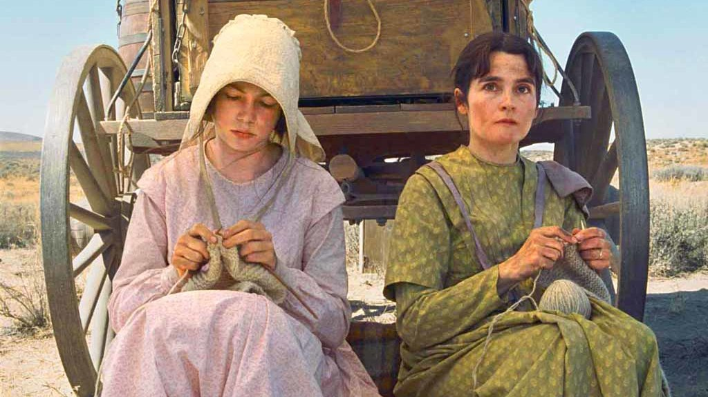  Michelle Williams, left, and Shirley Henderson in “Meek’s Cutoff.”Oscilloscope Laboratories](https://www.nytimes.com/watching/recommendations/meeks-cutoff)

Movie

## [Meek’s Cutoff](https://www.nytimes.com/watching/recommendations/meeks-cutoff)

Frontier tales have filled our books and movie screens for centuries, but few are as bleak and unforgiving as this one. Three pairs of settlers find themselves lost on the Oregon Trail, led by a guide (Bruce Greenwood) who doesn’t seem to have the foggiest idea what he’s doing. This is a sparse film, both in plotting and approach; director Kelly Reichardt[(“Wendy and Lucy,”](https://www.nytimes.com/watching/recommendations/wendy-and-lucy)[“Old Joy”](https://www.nytimes.com/watching/recommendations/old-joy)) lets her story play out in long, uninterrupted takes that may test the patience of some, but which force the viewer to ease into the rhythms of the period. And her frequent star Michelle Williams is remarkable as a wife who knows their guide is a fool, and can’t say or do a damned thing about it. (For another poetic drama filled with patient, elliptical suspense, try “**The Assassin**,” by the Taiwanese master Hou Hsiao-hsien.)

- [Netflix](https://gowatchit.com/movies/23839/watch_now?category=online&modality=widget&origin_url=https%3A%2F%2Fwww.nytimes.com%2Fwatching%2Flists%2Fbest-movies-on-netflix%3Femc%3Dedit_ne_20180102%26nl%3Devening-briefing%26nlid%3D71386779%26te%3D1&partner_id=20&provider_format_id=1&provider_id=1)
- [Amazon Video (Buy)](https://gowatchit.com/movies/23839/watch_now?category=online&modality=widget&origin_url=https%3A%2F%2Fwww.nytimes.com%2Fwatching%2Flists%2Fbest-movies-on-netflix%3Femc%3Dedit_ne_20180102%26nl%3Devening-briefing%26nlid%3D71386779%26te%3D1&partner_id=20&provider_format_id=7&provider_id=11)
- [iTunes](https://gowatchit.com/movies/23839/watch_now?category=online&modality=widget&origin_url=https%3A%2F%2Fwww.nytimes.com%2Fwatching%2Flists%2Fbest-movies-on-netflix%3Femc%3Dedit_ne_20180102%26nl%3Devening-briefing%26nlid%3D71386779%26te%3D1&partner_id=20&provider_format_id=3&provider_id=3)
- [+ 3 others](https://www.nytimes.com/watching/lists/best-movies-on-netflix?emc=edit_ne_20180102&nl=evening-briefing&nlid=72982178&te=1#)

* * *

[ 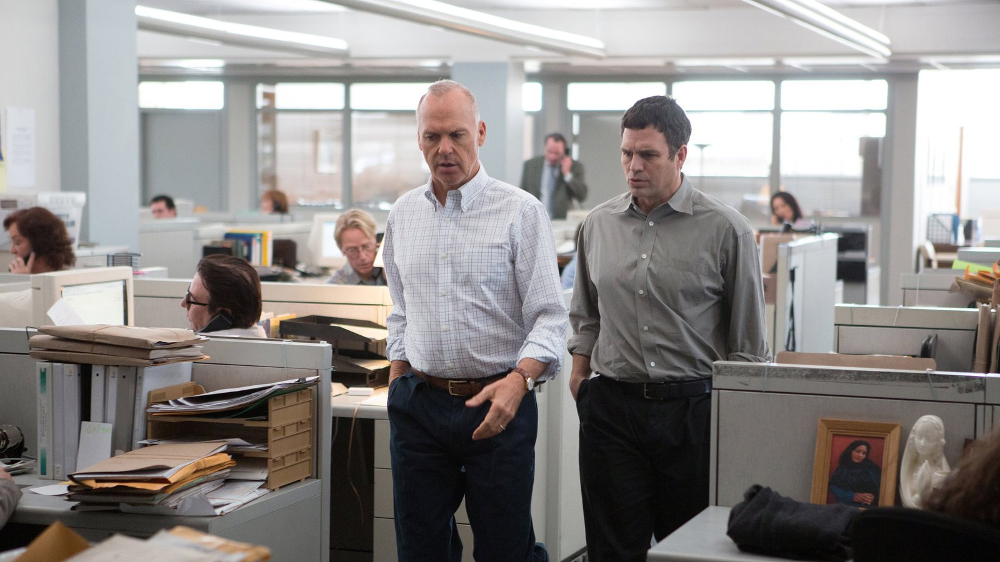  Michael Keaton, left, and Mark Ruffalo in “Spotlight.”Kerry Hayes/Open Road Films](https://www.nytimes.com/watching/recommendations/spotlight)

Movie

## [Spotlight](https://www.nytimes.com/watching/recommendations/spotlight)

Barely two years old and already regarded as one of the great newspaper pictures, this straight-shooting drama focuses on the Boston Globe’s investigation of child sex abuse in the Roman Catholic church, which culminated in a bombshell series that won the Pulitzer Prize. But the accolades are merely the payoff; as with[“All the President’s Men](https://www.nytimes.com/watching/recommendations/watching-film-all-the-presidents-men),” “Spotlight” is primarily interested in the unrelenting grunt work of shoe-leather reporting, of knocking on doors, digging through records, matching up names and praying for breakthroughs. Director Tom McCarthy (a sometimes actor, who himself played a newspaper reporter on[“The Wire](https://www.nytimes.com/watching/recommendations/watching-tv-the-wire)”) marshals a peerless ensemble cast — which includes Michael Keaton, Mark Ruffalo, Rachel McAdams, John Slattery and Liev Schreiber — to tell this vital story of the triumph of a free and fair press.

- [Netflix](https://gowatchit.com/movies/304740/watch_now?category=online&modality=widget&origin_url=https%3A%2F%2Fwww.nytimes.com%2Fwatching%2Flists%2Fbest-movies-on-netflix%3Femc%3Dedit_ne_20180102%26nl%3Devening-briefing%26nlid%3D71386779%26te%3D1&partner_id=20&provider_format_id=1&provider_id=1)
- [Amazon Video (Buy)](https://gowatchit.com/movies/304740/watch_now?category=online&modality=widget&origin_url=https%3A%2F%2Fwww.nytimes.com%2Fwatching%2Flists%2Fbest-movies-on-netflix%3Femc%3Dedit_ne_20180102%26nl%3Devening-briefing%26nlid%3D71386779%26te%3D1&partner_id=20&provider_format_id=7&provider_id=11)
- [iTunes](https://gowatchit.com/movies/304740/watch_now?category=online&modality=widget&origin_url=https%3A%2F%2Fwww.nytimes.com%2Fwatching%2Flists%2Fbest-movies-on-netflix%3Femc%3Dedit_ne_20180102%26nl%3Devening-briefing%26nlid%3D71386779%26te%3D1&partner_id=20&provider_format_id=3&provider_id=3)
- [+ 3 others](https://www.nytimes.com/watching/lists/best-movies-on-netflix?emc=edit_ne_20180102&nl=evening-briefing&nlid=72982178&te=1#)

* * *

[   Michael B. Jordan in “Fruitvale Station.”Cait Adkins/Weinstein Company](https://www.nytimes.com/watching/recommendations/watching-film-fruitvale-station)

Movie

## [Fruitvale Station](https://www.nytimes.com/watching/recommendations/watching-film-fruitvale-station)

Too many people only know Oscar Grant III because of the final moments of his life, in which he was shot to death by a Bay Area transit cop on a subway platform in the early hours of New Year’s Day, 2009 — a tragedy captured by the cameras of several passengers. But we too often reduce victims to their deaths, and this heartfelt drama seeks to restore Grant’s life to its full richness and complexity. Director Ryan Coogler and actor Michael B. Jordan (who would later collaborate on[“Creed”](https://www.nytimes.com/watching/recommendations/creed) and “Black Panther”) focus instead on Grant’s final day, and on the relationships he attempts to repair and cultivate, blissfully unaware of the fate that awaits him. It’s a wrenching, humanistic portrait of an average life, cut cruelly short by prejudice and circumstance.

- [Netflix](https://gowatchit.com/movies/266658/watch_now?category=online&modality=widget&origin_url=https%3A%2F%2Fwww.nytimes.com%2Fwatching%2Flists%2Fbest-movies-on-netflix&partner_id=20&provider_format_id=1&provider_id=1)
- [Amazon Video (Buy)](https://gowatchit.com/movies/266658/watch_now?category=online&modality=widget&origin_url=https%3A%2F%2Fwww.nytimes.com%2Fwatching%2Flists%2Fbest-movies-on-netflix&partner_id=20&provider_format_id=7&provider_id=11)
- [iTunes](https://gowatchit.com/movies/266658/watch_now?category=online&modality=widget&origin_url=https%3A%2F%2Fwww.nytimes.com%2Fwatching%2Flists%2Fbest-movies-on-netflix&partner_id=20&provider_format_id=3&provider_id=3)
- [+ 3 others](https://www.nytimes.com/watching/lists/best-movies-on-netflix?emc=edit_ne_20180102&nl=evening-briefing&nlid=72982178&te=1#)

* * *

[   Madina Nalwanga and David Oyelowo in “Queen of Katwe.”Edward Echwalu/Walt Disney Pictures](https://www.nytimes.com/watching/recommendations/queen-of-katwe)

Movie

## [Queen of Katwe](https://www.nytimes.com/watching/recommendations/queen-of-katwe)

The inspiring true story of Phiona Mutesi, a Ugandan slum girl who became a chess prodigy, is given the Disney treatment — but with a twist. Director Mira Nair, whose credits include the acclaimed and atmospheric international films “Salaam Bombay!” and “Monsoon Wedding,” cleverly sidesteps the clichés of the underdog sports movie, replacing them with a documentarian’s verisimilitude and a novelist’s attentiveness to detail. And her cast is flawless: David Oyelowo and Lupita Nyong’o are inspiring and heartbreaking as Phiona’s coach and teacher, while young Madina Nalwanga is astonishingly good as Phiona, sensitively conveying both the girl’s tentativeness and her pride.

- [Netflix](https://gowatchit.com/movies/417068/watch_now?category=online&modality=widget&origin_url=https%3A%2F%2Fwww.nytimes.com%2Fwatching%2Flists%2Fbest-movies-on-netflix%3Femc%3Dedit_ne_20180102%26nl%3Devening-briefing%26nlid%3D71386779%26te%3D1&partner_id=20&provider_format_id=1&provider_id=1)
- [Amazon Video (Buy)](https://gowatchit.com/movies/417068/watch_now?category=online&modality=widget&origin_url=https%3A%2F%2Fwww.nytimes.com%2Fwatching%2Flists%2Fbest-movies-on-netflix%3Femc%3Dedit_ne_20180102%26nl%3Devening-briefing%26nlid%3D71386779%26te%3D1&partner_id=20&provider_format_id=7&provider_id=11)
- [iTunes](https://gowatchit.com/movies/417068/watch_now?category=online&modality=widget&origin_url=https%3A%2F%2Fwww.nytimes.com%2Fwatching%2Flists%2Fbest-movies-on-netflix%3Femc%3Dedit_ne_20180102%26nl%3Devening-briefing%26nlid%3D71386779%26te%3D1&partner_id=20&provider_format_id=3&provider_id=3)
- [+ 3 others](https://www.nytimes.com/watching/lists/best-movies-on-netflix?emc=edit_ne_20180102&nl=evening-briefing&nlid=72982178&te=1#)

* * *

[   A scene from “Mudbound.”Steve Dietl/Netflix](https://www.nytimes.com/watching/titles/mudbound)

Movie

## [Mudbound](https://www.nytimes.com/watching/titles/mudbound)

The fates of two families — one white and one black, connected by a plot of land one owns and the other sharecrops — are inextricably intertwined in this forceful adaptation by director Dee Rees of the novel by Hillary Jordan. Jordan’s sprawling tale, set in rural Mississippi during and just after World War II, is an intensely personal story of friendships formed and familial bonds betrayed. But it is also the larger story of postwar America, in which black soldiers returned to a country that still treated them as less than human, and of an economic system that perpetuates poverty across generations. Rees gracefully tells both stories without veering into didacticism, and her ensemble cast brings every moment of text and subtext into sharp focus. (For more Dee Rees, queue up **“Pariah,” **her debut feature about a young black lesbian in Brooklyn.)

- [Netflix](https://gowatchit.com/movies/569048/watch_now?category=online&modality=widget&origin_url=https%3A%2F%2Fwww.nytimes.com%2Fwatching%2Flists%2Fbest-movies-on-netflix%3Femc%3Dedit_ne_20180102%26nl%3Devening-briefing%26nlid%3D71386779%26te%3D1&partner_id=20&provider_format_id=1&provider_id=1)

* * *

[ 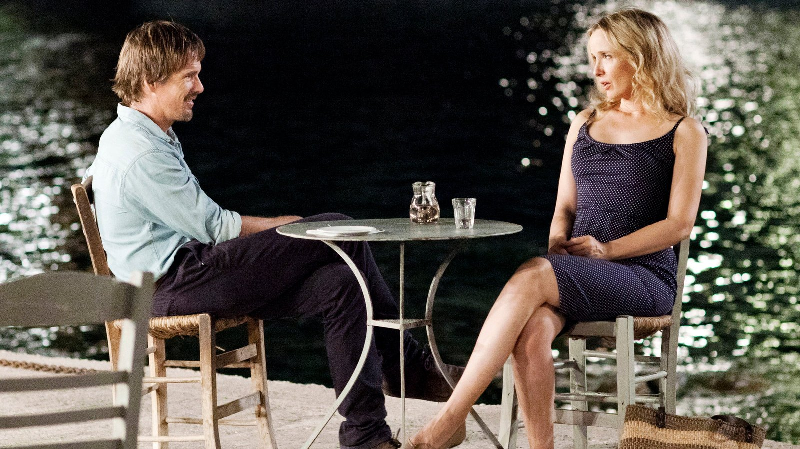  Ethan Hawke and Julie Delpy in "Before Midnight."Despina Spyrou/Sony Pictures Classics](https://www.nytimes.com/watching/recommendations/watching-film-before-midnight)

Movie

## [Before Midnight](https://www.nytimes.com/watching/recommendations/watching-film-before-midnight)

In 1995, director Richard Linklater and actors Ethan Hawke and Julie Delpy teamed up for “Before Sunrise,” which spent a single evening with two strangers who meet on a train and spend the night wandering around Vienna together and falling in love. The 2004 sequel, “Before Sunset,” caught up with them nine years later, as they reconnect in a Paris bookstore, and this 2013 follow-up finds them nine years later still, and in a very different place. The first two films weren’t on Netflix as of mid-December, but “Before Midnight” is a rare second sequel that delivers as a stand-alone work, disarmingly peering in on a long-term relationship that’s no longer romantic and effortless, as its protagonists continue to second-guess the choices they’ve made and notions they’ve held; Hawke and Delpy share screenwriting credits with Linklater, and their onscreen relationship conveys a rich, shared history, equal parts allure and exasperation. (For more from Richard Linklater, seek out **“**[**Boyhood**](https://www.nytimes.com/watching/recommendations/watching-film-boyhood?auto=true)**.”**)

- [Netflix](https://gowatchit.com/movies/266711/watch_now?category=online&modality=widget&origin_url=https%3A%2F%2Fwww.nytimes.com%2Fwatching%2Flists%2Fbest-movies-on-netflix%3Femc%3Dedit_ne_20180102%26nl%3Devening-briefing%26nlid%3D71386779%26te%3D1&partner_id=20&provider_format_id=1&provider_id=1)
- [Amazon Video (Buy)](https://gowatchit.com/movies/266711/watch_now?category=online&modality=widget&origin_url=https%3A%2F%2Fwww.nytimes.com%2Fwatching%2Flists%2Fbest-movies-on-netflix%3Femc%3Dedit_ne_20180102%26nl%3Devening-briefing%26nlid%3D71386779%26te%3D1&partner_id=20&provider_format_id=7&provider_id=11)
- [iTunes](https://gowatchit.com/movies/266711/watch_now?category=online&modality=widget&origin_url=https%3A%2F%2Fwww.nytimes.com%2Fwatching%2Flists%2Fbest-movies-on-netflix%3Femc%3Dedit_ne_20180102%26nl%3Devening-briefing%26nlid%3D71386779%26te%3D1&partner_id=20&provider_format_id=3&provider_id=3)
- [+ 3 others](https://www.nytimes.com/watching/lists/best-movies-on-netflix?emc=edit_ne_20180102&nl=evening-briefing&nlid=72982178&te=1#)

* * *

[   From left, Assa Sylla, Lindsay Karamoh, Karidja Touré and Mariétou Touré in “Girlhood.”Strand Releasing](https://www.nytimes.com/watching/titles/girlhood)

Movie

## [Girlhood](https://www.nytimes.com/watching/titles/girlhood)

Few films have captured the emotional intensity of adolescence as vividly and redolently as this evocative drama from the French filmmaker Céline Sciamma (2014, France). It concerns Marieme (Karidja Touré), who finds herself drawn to a group of brash, tough girls, only to find that their loyalties are fleeting and their bites leave a mark. But Sciamma also bracingly dramatizes the intoxicating draw of those friendships, and how surrounding yourself with like-minded schoolmates can make you feel nothing less than indestructible. (**“**[**Mustang**](https://www.nytimes.com/watching/recommendations/mustang?auto=true)**,” **about a group of girls in a small Turkish village, is another excellent foreign female-driven coming-of-age film on Netflix.)

- [Netflix](https://gowatchit.com/movies/270005/watch_now?category=online&modality=widget&origin_url=https%3A%2F%2Fwww.nytimes.com%2Fwatching%2Flists%2Fbest-movies-on-netflix%3Femc%3Dedit_ne_20180102%26nl%3Devening-briefing%26nlid%3D71386779%26te%3D1&partner_id=20&provider_format_id=1&provider_id=1)
- [Amazon Video (Buy)](https://gowatchit.com/movies/270005/watch_now?category=online&modality=widget&origin_url=https%3A%2F%2Fwww.nytimes.com%2Fwatching%2Flists%2Fbest-movies-on-netflix%3Femc%3Dedit_ne_20180102%26nl%3Devening-briefing%26nlid%3D71386779%26te%3D1&partner_id=20&provider_format_id=7&provider_id=11)
- [iTunes](https://gowatchit.com/movies/270005/watch_now?category=online&modality=widget&origin_url=https%3A%2F%2Fwww.nytimes.com%2Fwatching%2Flists%2Fbest-movies-on-netflix%3Femc%3Dedit_ne_20180102%26nl%3Devening-briefing%26nlid%3D71386779%26te%3D1&partner_id=20&provider_format_id=3&provider_id=3)
- [+ 3 others](https://www.nytimes.com/watching/lists/best-movies-on-netflix?emc=edit_ne_20180102&nl=evening-briefing&nlid=72982178&te=1#)

* * *

[   Tilda Swinton in “Michael Clayton.”Myles Aronowitz/Warner Bros. Pictures](https://www.nytimes.com/watching/recommendations/watching-film-michael-clayton)

Movie

## [Michael Clayton](https://www.nytimes.com/watching/recommendations/watching-film-michael-clayton)

George Clooney turns in a towering performance as the title character, a “fixer” for a powerful New York law firm who’s grown tired of cleaning up the messes of the morally reprehensible. But there are no easy exits in this world, and writer-director Tony Gilroy crafts a sleek and shrewd snapshot of corporate malfeasance. And he creates a showcase role for Tilda Swinton, who won an Oscar for her portrayal of a ruthless power-broker whose confidence is diminishing by the minute. (For more Swinton, queue up her shattering performance in **“We Need to Talk About Kevin” **and her quirky work in **“Burn After Reading.”**)

- [Netflix](https://gowatchit.com/movies/48258/watch_now?category=online&modality=widget&origin_url=https%3A%2F%2Fwww.nytimes.com%2Fwatching%2Flists%2Fbest-movies-on-netflix%3Femc%3Dedit_ne_20180102%26nl%3Devening-briefing%26nlid%3D71386779%26te%3D1&partner_id=20&provider_format_id=1&provider_id=1)
- [Amazon Video (Buy)](https://gowatchit.com/movies/48258/watch_now?category=online&modality=widget&origin_url=https%3A%2F%2Fwww.nytimes.com%2Fwatching%2Flists%2Fbest-movies-on-netflix%3Femc%3Dedit_ne_20180102%26nl%3Devening-briefing%26nlid%3D71386779%26te%3D1&partner_id=20&provider_format_id=7&provider_id=11)
- [iTunes](https://gowatchit.com/movies/48258/watch_now?category=online&modality=widget&origin_url=https%3A%2F%2Fwww.nytimes.com%2Fwatching%2Flists%2Fbest-movies-on-netflix%3Femc%3Dedit_ne_20180102%26nl%3Devening-briefing%26nlid%3D71386779%26te%3D1&partner_id=20&provider_format_id=3&provider_id=3)
- [+ 3 others](https://www.nytimes.com/watching/lists/best-movies-on-netflix?emc=edit_ne_20180102&nl=evening-briefing&nlid=72982178&te=1#)

* * *

[   Winona Ryder and Christian Slater in "Heathers."New World Pictures](https://www.nytimes.com/watching/recommendations/heathers)

Movie

## [Heathers](https://www.nytimes.com/watching/recommendations/heathers)

This unapologetically dark comedy changed the high-school movie forever, from the heartfelt and ultimately sunny chronicles of John Hughes to something with a bit more bite. Winona Ryder is tart and charming as Veronica, a popular teen who has come to hate the clique she runs with. Then she meets J.D. (Christian Slater), a Jack Nicholson clone who suggests bumping off their less tolerable classmates. Nearly 30 years on, the sheer riskiness and take-no-prisoners attitude of this delightfully demented picture still shocks.

- [Netflix](https://gowatchit.com/movies/35603/watch_now?category=online&modality=widget&origin_url=https%3A%2F%2Fwww.nytimes.com%2Fwatching%2Flists%2Fbest-movies-on-netflix%3Femc%3Dedit_ne_20180102%26nl%3Devening-briefing%26nlid%3D71386779%26te%3D1&partner_id=20&provider_format_id=1&provider_id=1)
- [Amazon Video (Buy)](https://gowatchit.com/movies/35603/watch_now?category=online&modality=widget&origin_url=https%3A%2F%2Fwww.nytimes.com%2Fwatching%2Flists%2Fbest-movies-on-netflix%3Femc%3Dedit_ne_20180102%26nl%3Devening-briefing%26nlid%3D71386779%26te%3D1&partner_id=20&provider_format_id=7&provider_id=11)
- [Hulu](https://gowatchit.com/movies/35603/watch_now?category=online&modality=widget&origin_url=https%3A%2F%2Fwww.nytimes.com%2Fwatching%2Flists%2Fbest-movies-on-netflix%3Femc%3Dedit_ne_20180102%26nl%3Devening-briefing%26nlid%3D71386779%26te%3D1&partner_id=20&provider_format_id=21&provider_id=15)
- [+ 4 others](https://www.nytimes.com/watching/lists/best-movies-on-netflix?emc=edit_ne_20180102&nl=evening-briefing&nlid=72982178&te=1#)

* * *

[   A scene from “Sing Street.”Weinstein Company](https://www.nytimes.com/watching/recommendations/sing-street)

Movie

## [Sing Street](https://www.nytimes.com/watching/recommendations/sing-street)

Netflix’s tilt toward streaming recent and original releases means there’s not much there in the way of big-screen musicals — Hollywood just doesn’t make many of those anymore. But this delightful 2016 picture from John Carney is a welcome addition to that canon, a sweetly nostalgic tale about a wistful Irish kid who imagines that his amateur rock band will get him out of his dingy hometown and into the arms of his dream girl. The performers are likable, and the ’80s nostalgia is well placed. Its centerpiece musical sequence — an imagined music video in which a great song solves everything — is sublime. (For more music-loving Irish fun, check out **“The Commitments”**; fans of joyful offshore musicals will also enjoy **“Strictly Ballroom,”** on Netflix starting Jan. 1.)

- [Netflix](https://gowatchit.com/movies/394785/watch_now?category=online&modality=widget&origin_url=https%3A%2F%2Fwww.nytimes.com%2Fwatching%2Flists%2Fbest-movies-on-netflix%3Femc%3Dedit_ne_20180102%26nl%3Devening-briefing%26nlid%3D71386779%26te%3D1&partner_id=20&provider_format_id=1&provider_id=1)
- [Amazon Video (Buy)](https://gowatchit.com/movies/394785/watch_now?category=online&modality=widget&origin_url=https%3A%2F%2Fwww.nytimes.com%2Fwatching%2Flists%2Fbest-movies-on-netflix%3Femc%3Dedit_ne_20180102%26nl%3Devening-briefing%26nlid%3D71386779%26te%3D1&partner_id=20&provider_format_id=7&provider_id=11)
- [iTunes](https://gowatchit.com/movies/394785/watch_now?category=online&modality=widget&origin_url=https%3A%2F%2Fwww.nytimes.com%2Fwatching%2Flists%2Fbest-movies-on-netflix%3Femc%3Dedit_ne_20180102%26nl%3Devening-briefing%26nlid%3D71386779%26te%3D1&partner_id=20&provider_format_id=3&provider_id=3)
- [+ 3 others](https://www.nytimes.com/watching/lists/best-movies-on-netflix?emc=edit_ne_20180102&nl=evening-briefing&nlid=72982178&te=1#)

* * *

[   Omari Hardwick and Emayatzy Corinealdi in “Middle of Nowhere.”Participant Media](https://www.nytimes.com/watching/titles/middle-of-nowhere)

Movie

## [Middle of Nowhere](https://www.nytimes.com/watching/titles/middle-of-nowhere)

Director Ava DuVernay (“Selma,” “A Wrinkle in Time”) made her indie-film breakthrough with this emotionally disarming and keenly observed story of bright young nurse (Emayatzy Corinealdi) who must decide whether or not to stand by her incarcerated husband (Omari Hardwick) when she’s romanced by a kind bus driver (David Oyelowo). DuVernay’s sharp eye and tuned ear sensitively present the kind of lives and decisions that are too often overlooked on the big screen; her characters as much more than types, and her appreciation of their complexity translates smoothly to the viewer. (For more from DuVernay, and a return to the subject of incarceration, see her documentary **“**[**13th**](https://www.nytimes.com/watching/recommendations/13th?auto=true)**.”**)

- [Netflix](https://gowatchit.com/movies/264695/watch_now?category=online&modality=widget&origin_url=https%3A%2F%2Fwww.nytimes.com%2Fwatching%2Flists%2Fbest-movies-on-netflix%3Femc%3Dedit_ne_20180102%26nl%3Devening-briefing%26nlid%3D71386779%26te%3D1&partner_id=20&provider_format_id=1&provider_id=1)
- [Amazon Video (Buy)](https://gowatchit.com/movies/264695/watch_now?category=online&modality=widget&origin_url=https%3A%2F%2Fwww.nytimes.com%2Fwatching%2Flists%2Fbest-movies-on-netflix%3Femc%3Dedit_ne_20180102%26nl%3Devening-briefing%26nlid%3D71386779%26te%3D1&partner_id=20&provider_format_id=7&provider_id=11)
- [iTunes](https://gowatchit.com/movies/264695/watch_now?category=online&modality=widget&origin_url=https%3A%2F%2Fwww.nytimes.com%2Fwatching%2Flists%2Fbest-movies-on-netflix%3Femc%3Dedit_ne_20180102%26nl%3Devening-briefing%26nlid%3D71386779%26te%3D1&partner_id=20&provider_format_id=3&provider_id=3)
- [+ 3 others](https://www.nytimes.com/watching/lists/best-movies-on-netflix?emc=edit_ne_20180102&nl=evening-briefing&nlid=72982178&te=1#)

* * *

[ 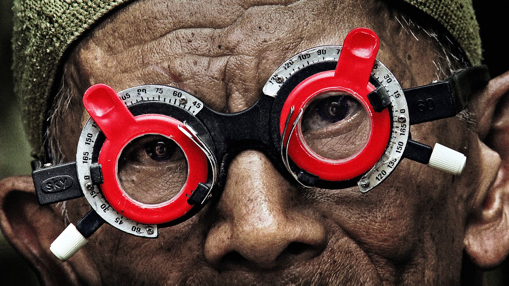  Inong in “The Look of Silence.”Lars Skree/Drafthouse Films](https://www.nytimes.com/watching/recommendations/the-look-of-silence)

Movie

## [The Look of Silence](https://www.nytimes.com/watching/recommendations/the-look-of-silence)

Director Joshua Oppenheimer followed his stunning documentary “The Act of Killing” with another investigation of the paramilitary death squads who terrorized Indonesia in mid-1960s, this time from the perspective of Adi Rukun, who was a young boy when his brother was murdered during the massacres. Decades later, Rukun makes the bold and brave decision to confront those responsible, as Oppenheimer’s camera looks on. It’s a profoundly upsetting but essential work of nonfiction, asking difficult questions about life, death, power, grief and (most of all) forgiveness. (For a much lighter but still powerful foreign-made documentary, queue up **“**[**Jiro Dreams of Sushi**](https://www.nytimes.com/watching/recommendations/jiro-dreams-of-sushi)**.”**)

- [Netflix](https://gowatchit.com/movies/269783/watch_now?category=online&modality=widget&origin_url=https%3A%2F%2Fwww.nytimes.com%2Fwatching%2Flists%2Fbest-movies-on-netflix%3Frecid%3D0yciTR8LyACwv1Ez20Zpz6YTtyi%26sl_rec%3Dmostpopular_sample_dedup_sticky%26contentCollection%3Dsmarter-living%26mData%3Darticles%25255B%25255D%253Dhttps%25253A%25252F%25252Fwww.nytimes.com%25252F2017%25252F12%25252F03%252&partner_id=20&provider_format_id=1&provider_id=1)
- [Amazon Video (Buy)](https://gowatchit.com/movies/269783/watch_now?category=online&modality=widget&origin_url=https%3A%2F%2Fwww.nytimes.com%2Fwatching%2Flists%2Fbest-movies-on-netflix%3Frecid%3D0yciTR8LyACwv1Ez20Zpz6YTtyi%26sl_rec%3Dmostpopular_sample_dedup_sticky%26contentCollection%3Dsmarter-living%26mData%3Darticles%25255B%25255D%253Dhttps%25253A%25252F%25252Fwww.nytimes.com%25252F2017%25252F12%25252F03%252&partner_id=20&provider_format_id=7&provider_id=11)
- [iTunes](https://gowatchit.com/movies/269783/watch_now?category=online&modality=widget&origin_url=https%3A%2F%2Fwww.nytimes.com%2Fwatching%2Flists%2Fbest-movies-on-netflix%3Frecid%3D0yciTR8LyACwv1Ez20Zpz6YTtyi%26sl_rec%3Dmostpopular_sample_dedup_sticky%26contentCollection%3Dsmarter-living%26mData%3Darticles%25255B%25255D%253Dhttps%25253A%25252F%25252Fwww.nytimes.com%25252F2017%25252F12%25252F03%252&partner_id=20&provider_format_id=3&provider_id=3)
- [+ 3 others](https://www.nytimes.com/watching/lists/best-movies-on-netflix?emc=edit_ne_20180102&nl=evening-briefing&nlid=72982178&te=1#)

* * *

[   Philippe Petit walking across a cable between towers of World Trade Center.Alan Welner/Associated Press](https://www.nytimes.com/watching/recommendations/watching-film-man-on-wire)

Movie

## [Man on Wire](https://www.nytimes.com/watching/recommendations/watching-film-man-on-wire)

Early one morning in August 1974, a French tightrope walker named Philippe Petit appeared balanced upon a cable that was slung between the Twin Towers of the World Trade Center — where for 45 minutes he performed among the clouds, dancing and gliding back and forth between the two buildings and leaving passers-by awe-struck a quarter-mile below. This energetic documentary from James Marsh lays out exactly how Petit pulled off his awesome stunt, using archival footage and photos, current interviews, and gripping re-enactments that borrow the visual language of a heist thriller. A fabulous story of reaching for the stars, and an affectionate valentine to a dearly missed piece of the New York skyline. (The film’s re-enactments owe much to the innovative true-crime documentary **“**[**The Thin Blue Line**](https://www.nytimes.com/watching/recommendations/watching-film-the-thin-blue-line)**,”** also streaming on Netflix.)

- [Netflix](https://gowatchit.com/movies/50313/watch_now?category=online&modality=widget&origin_url=https%3A%2F%2Fwww.nytimes.com%2Fwatching%2Flists%2Fbest-movies-on-netflix%3Femc%3Dedit_ne_20180102%26nl%3Devening-briefing%26nlid%3D71386779%26te%3D1&partner_id=20&provider_format_id=1&provider_id=1)
- [Amazon Video (Buy)](https://gowatchit.com/movies/50313/watch_now?category=online&modality=widget&origin_url=https%3A%2F%2Fwww.nytimes.com%2Fwatching%2Flists%2Fbest-movies-on-netflix%3Femc%3Dedit_ne_20180102%26nl%3Devening-briefing%26nlid%3D71386779%26te%3D1&partner_id=20&provider_format_id=7&provider_id=11)
- [Hulu](https://gowatchit.com/movies/50313/watch_now?category=online&modality=widget&origin_url=https%3A%2F%2Fwww.nytimes.com%2Fwatching%2Flists%2Fbest-movies-on-netflix%3Femc%3Dedit_ne_20180102%26nl%3Devening-briefing%26nlid%3D71386779%26te%3D1&partner_id=20&provider_format_id=21&provider_id=15)
- [+ 4 others](https://www.nytimes.com/watching/lists/best-movies-on-netflix?emc=edit_ne_20180102&nl=evening-briefing&nlid=72982178&te=1#)

* * *

[ 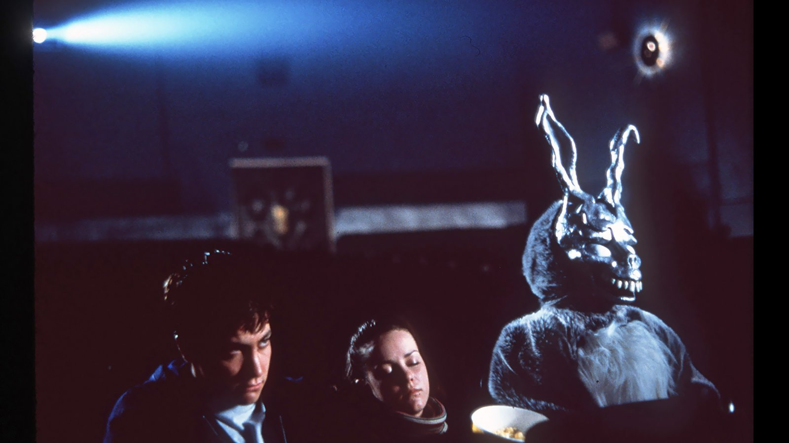  From left, Jake Gyllenhaal and Jena Malone in “Donnie Darko.”Dale Robinette/Newmarket Films](https://www.nytimes.com/watching/titles/donnie-darko)

Movie

## [Donnie Darko](https://www.nytimes.com/watching/titles/donnie-darko)

An exhilaratingly strange and hauntingly beautiful mixture of sci-fi, horror and high-school drama, this 2001 cult classic concerns a young outcast whose visions of plane crashes and giant rabbits hint at either an approaching suburban apocalypse or his own madness — or both. Filled with nightmarish images, dark humor and mind-bending time travel conundrums, “Darko” was a breakout role for the young star Jake Gyllenhaal, as well as a memorable late-period showcase for Patrick Swayze, playing boldly against type. (For more dark horror see **“**[**The Babadook**](https://www.nytimes.com/watching/recommendations/watching-film-the-babadook)**.”**)

- [Netflix](https://gowatchit.com/movies/35338/watch_now?category=online&modality=widget&origin_url=https%3A%2F%2Fwww.nytimes.com%2Fwatching%2Flists%2Fbest-movies-on-netflix%3Femc%3Dedit_ne_20180102%26nl%3Devening-briefing%26nlid%3D71386779%26te%3D1&partner_id=20&provider_format_id=1&provider_id=1)
- [iTunes](https://gowatchit.com/movies/35338/watch_now?category=online&modality=widget&origin_url=https%3A%2F%2Fwww.nytimes.com%2Fwatching%2Flists%2Fbest-movies-on-netflix%3Femc%3Dedit_ne_20180102%26nl%3Devening-briefing%26nlid%3D71386779%26te%3D1&partner_id=20&provider_format_id=3&provider_id=3)
- [Google Play](https://gowatchit.com/movies/35338/watch_now?category=online&modality=widget&origin_url=https%3A%2F%2Fwww.nytimes.com%2Fwatching%2Flists%2Fbest-movies-on-netflix%3Femc%3Dedit_ne_20180102%26nl%3Devening-briefing%26nlid%3D71386779%26te%3D1&partner_id=20&provider_format_id=18&provider_id=16)
- [YouTube](https://gowatchit.com/movies/35338/watch_now?category=online&modality=widget&origin_url=https%3A%2F%2Fwww.nytimes.com%2Fwatching%2Flists%2Fbest-movies-on-netflix%3Femc%3Dedit_ne_20180102%26nl%3Devening-briefing%26nlid%3D71386779%26te%3D1&partner_id=20&provider_format_id=12&provider_id=13)

* * *

[   Haley Joel Osment in “The Sixth Sense.”Spyglass Entertainment](https://www.nytimes.com/watching/titles/the-sixth-sense)

Movie

## [The Sixth Sense](https://www.nytimes.com/watching/titles/the-sixth-sense)

Bruce Willis mounted yet another comeback, and helped launch the career of writer-director M. Night Shyamalan, with this inventive ghost story. Willis stars as a child psychologist attempting to aid a young boy who believes not only that he can “see dead people” but also that he’s meant to help them settle their unfinished business. Willis is quietly excellent in the role, generating palpable warmth and trust with the young Haley Joel Osment, who’s in top form as his troubled patient. “The Sixth Sense” is best remembered for its twist ending, but there’s much more to the film than that; even viewers going in aware of its outcome are still likely to find it scary, moving and surprisingly poignant. (For more of Willis’ softer side, try **“**[**Moonrise Kingdom**](https://www.nytimes.com/watching/recommendations/watching-film-moonrise-kingdom)**.”**)

- [Netflix](https://gowatchit.com/movies/29039/watch_now?category=online&modality=widget&origin_url=https%3A%2F%2Fwww.nytimes.com%2Fwatching%2Flists%2Fbest-movies-on-netflix%3Femc%3Dedit_ne_20180102%26nl%3Devening-briefing%26nlid%3D71386779%26te%3D1&partner_id=20&provider_format_id=1&provider_id=1)
- [Amazon Video (Buy)](https://gowatchit.com/movies/29039/watch_now?category=online&modality=widget&origin_url=https%3A%2F%2Fwww.nytimes.com%2Fwatching%2Flists%2Fbest-movies-on-netflix%3Femc%3Dedit_ne_20180102%26nl%3Devening-briefing%26nlid%3D71386779%26te%3D1&partner_id=20&provider_format_id=7&provider_id=11)
- [iTunes](https://gowatchit.com/movies/29039/watch_now?category=online&modality=widget&origin_url=https%3A%2F%2Fwww.nytimes.com%2Fwatching%2Flists%2Fbest-movies-on-netflix%3Femc%3Dedit_ne_20180102%26nl%3Devening-briefing%26nlid%3D71386779%26te%3D1&partner_id=20&provider_format_id=3&provider_id=3)
- [+ 3 others](https://www.nytimes.com/watching/lists/best-movies-on-netflix?emc=edit_ne_20180102&nl=evening-briefing&nlid=72982178&te=1#)

* * *

[ 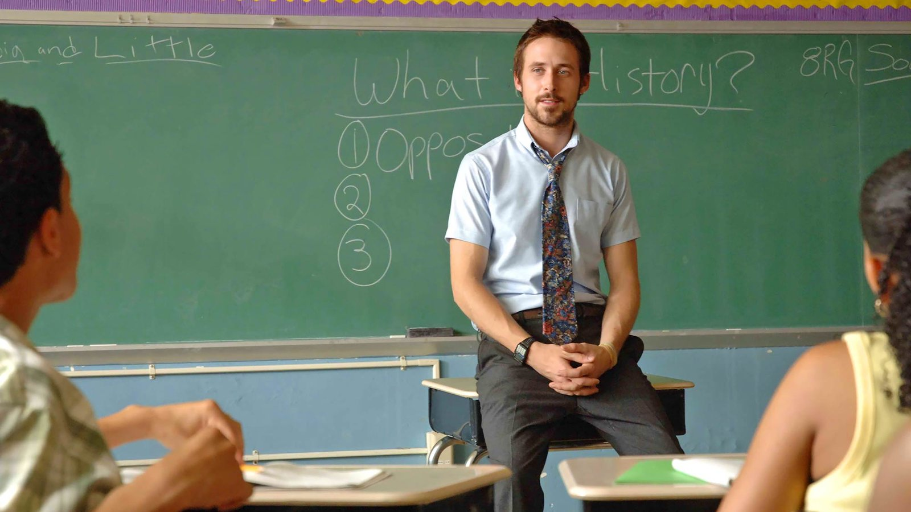  Ryan Gosling in ”Half Nelson.”ThinkFilm](https://www.nytimes.com/watching/recommendations/watching-film-half-nelson)

Movie

## [Half Nelson](https://www.nytimes.com/watching/recommendations/watching-film-half-nelson)

Ryan Gosling propelled himself onto Hollywood’s A-list with his raw, eccentric and unforgettable turn as a drug-addicted inner-city middle-school teacher in this 2006 stunner from Ryan Fleck and Anna Boden (“Mississippi Grind”). It carefully situates itself as a standard inspirational teacher drama as then slyly sidesteps all of them, as Gosling’s character is revealed to be as much of a mess outside the classroom as he is confident and brilliant inside it. This man is no one’s savior, and once that divergence from the usual formula becomes clear, the rest of the story is thrillingly free to go anywhere. (For a far more conventional but no less moving story of teachers and students, queue up **“Dead Poets Society.”**)

- [Netflix](https://gowatchit.com/movies/45915/watch_now?category=online&modality=widget&origin_url=https%3A%2F%2Fwww.nytimes.com%2Fwatching%2Flists%2Fbest-movies-on-netflix%3Fsmid%3Dtw-nytmovies%26smtyp%3Dcur&partner_id=20&provider_format_id=1&provider_id=1)

* * *

[ 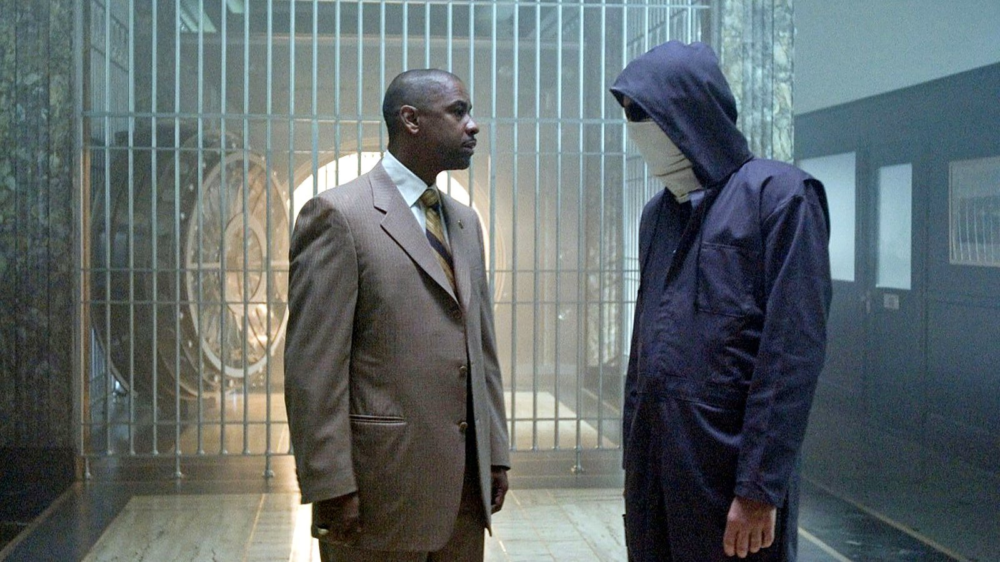  Denzel Washington, left, and Clive Owen in “Inside Man.”David Lee/Universal Pictures](https://www.nytimes.com/watching/titles/inside-man)

Movie

## [Inside Man](https://www.nytimes.com/watching/titles/inside-man)

Spike Lee is the heir apparent to Sidney Lumet as New York’s most reliable hometown filmmaker, so it only makes sense that he would eventually work his way around to an homage to Lumet’s sweaty-city classic “Dog Day Afternoon.” In Lee’s variation, Clive Owen is a cool and confident bank robber who’s interested in something much more valuable than money; Denzel Washington is at his smooth-talking movie-star best as the brilliant police hostage negotiator who’s trying to beat the criminal and the clock. (For more New York stories, check out **“Eyes Wide Shut”** and **“Gangs of New York.”**)

- [Netflix](https://gowatchit.com/movies/44352/watch_now?category=online&modality=widget&origin_url=https%3A%2F%2Fwww.nytimes.com%2Fwatching%2Flists%2Fbest-movies-on-netflix%3Fsmid%3Dtw-nytmovies%26smtyp%3Dcur&partner_id=20&provider_format_id=1&provider_id=1)
- [Amazon Video (Buy)](https://gowatchit.com/movies/44352/watch_now?category=online&modality=widget&origin_url=https%3A%2F%2Fwww.nytimes.com%2Fwatching%2Flists%2Fbest-movies-on-netflix%3Fsmid%3Dtw-nytmovies%26smtyp%3Dcur&partner_id=20&provider_format_id=7&provider_id=11)
- [Showtime](https://gowatchit.com/movies/44352/watch_now?category=online&modality=widget&origin_url=https%3A%2F%2Fwww.nytimes.com%2Fwatching%2Flists%2Fbest-movies-on-netflix%3Fsmid%3Dtw-nytmovies%26smtyp%3Dcur&partner_id=20&provider_format_id=144&provider_id=62)
- [+ 4 others](https://www.nytimes.com/watching/lists/best-movies-on-netflix?emc=edit_ne_20180102&nl=evening-briefing&nlid=72982178&te=1#)

* * *

[ 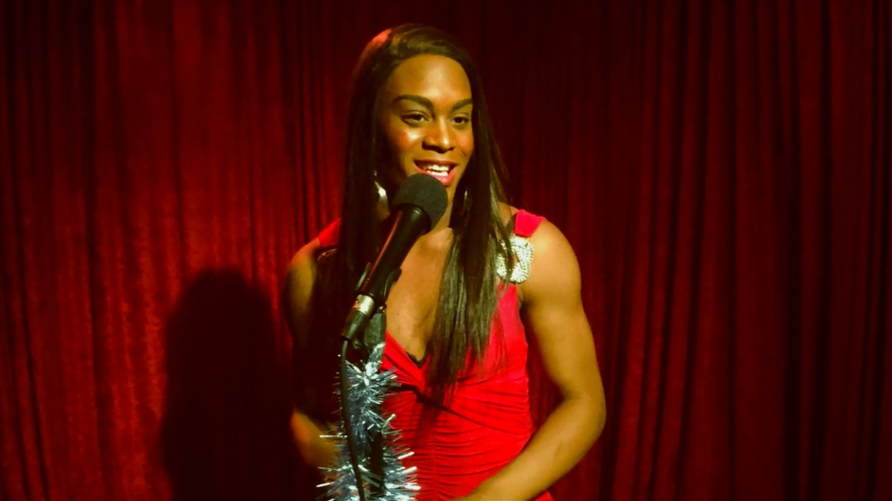  Mya Taylor in “Tangerine.”Magnolia Pictures](https://www.nytimes.com/watching/recommendations/tangerine)

Movie

## [Tangerine](https://www.nytimes.com/watching/recommendations/tangerine)

Shot on the fly in real locations with smartphones and a cast of mostly nonactors, this comedic drama from director Sean Baker (“The Florida Project”) is a vibrant, funny and heartfelt story of life on the fringe. His story concerns two transgender sex workers (Kitana Kiki Rodriguez and Mya Taylor) and their various misadventures over a 24-hour period in the sketchier stretches of Hollywood. Played differently, the material could have been sensationalistic, but it isn’t; Baker is, above all, a humanist, and he loves his characters no matter what kind of trouble they’re causing. (For more from the fringes of Los Angeles, queue up **“Training Day,”** on Netflix starting Jan. 1, and **“Matchstick Men,”** streaming now.)

- [Netflix](https://gowatchit.com/movies/283192/watch_now?category=online&modality=widget&origin_url=https%3A%2F%2Fwww.nytimes.com%2Fwatching%2Flists%2Fbest-movies-on-netflix%3Fsmid%3Dtw-nytmovies%26smtyp%3Dcur&partner_id=20&provider_format_id=1&provider_id=1)
- [Amazon Video (Buy)](https://gowatchit.com/movies/283192/watch_now?category=online&modality=widget&origin_url=https%3A%2F%2Fwww.nytimes.com%2Fwatching%2Flists%2Fbest-movies-on-netflix%3Fsmid%3Dtw-nytmovies%26smtyp%3Dcur&partner_id=20&provider_format_id=7&provider_id=11)
- [iTunes](https://gowatchit.com/movies/283192/watch_now?category=online&modality=widget&origin_url=https%3A%2F%2Fwww.nytimes.com%2Fwatching%2Flists%2Fbest-movies-on-netflix%3Fsmid%3Dtw-nytmovies%26smtyp%3Dcur&partner_id=20&provider_format_id=3&provider_id=3)
- [+ 3 others](https://www.nytimes.com/watching/lists/best-movies-on-netflix?emc=edit_ne_20180102&nl=evening-briefing&nlid=72982178&te=1#)

* * *

[ 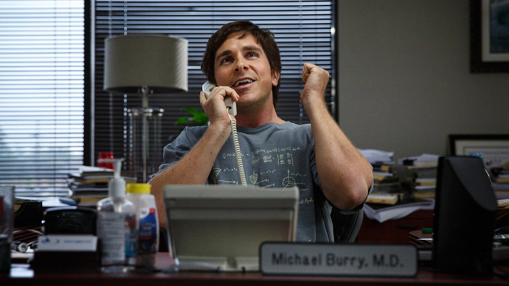  Christian Bale in “The Big Short.”Jaap Buitendijk/Paramount Pictures](https://www.nytimes.com/watching/recommendations/the-big-short)

Movie

## [The Big Short](https://www.nytimes.com/watching/recommendations/the-big-short)

The writer and director Adam McKay, best known for slapstick films like “Anchorman” and “Step Brothers,” was not the obvious choice to adapt Michael Lewis’s deeply reported and meticulously researched book about the 2008 financial crisis. But he turned out to be the right one; his entertainer’s approach proved invaluable for clarifying such dense material for a wide audience. Which is not to say the film softens the edges of Lewis’s exposé. McKay, who helped write the film, walks us through the myriad levels of law-bending and lawbreaking with due cynicism and outrage, but presents it in a wry, nihilistic way that could only come from a comic filmmaker. (Up for another energetic dramatization of recent history? Check out **“**[**The Queen.**](https://www.nytimes.com/watching/recommendations/watching-film-the-queen)**”**)

- [Netflix](https://gowatchit.com/movies/296677/watch_now?category=online&modality=widget&origin_url=https%3A%2F%2Fwww.nytimes.com%2Fwatching%2Flists%2Fbest-movies-on-netflix%3Fsmid%3Dtw-nytmovies%26smtyp%3Dcur&partner_id=20&provider_format_id=1&provider_id=1)
- [Amazon Video (Buy)](https://gowatchit.com/movies/296677/watch_now?category=online&modality=widget&origin_url=https%3A%2F%2Fwww.nytimes.com%2Fwatching%2Flists%2Fbest-movies-on-netflix%3Fsmid%3Dtw-nytmovies%26smtyp%3Dcur&partner_id=20&provider_format_id=7&provider_id=11)
- [iTunes](https://gowatchit.com/movies/296677/watch_now?category=online&modality=widget&origin_url=https%3A%2F%2Fwww.nytimes.com%2Fwatching%2Flists%2Fbest-movies-on-netflix%3Fsmid%3Dtw-nytmovies%26smtyp%3Dcur&partner_id=20&provider_format_id=3&provider_id=3)
- [+ 3 others](https://www.nytimes.com/watching/lists/best-movies-on-netflix?emc=edit_ne_20180102&nl=evening-briefing&nlid=72982178&te=1#)

* * *

[   Keisha Castle-Hughes in “Whale Rider.”Newmarket Films](https://www.nytimes.com/watching/titles/whale-rider)

Movie

## [Whale Rider](https://www.nytimes.com/watching/titles/whale-rider)

This New Zealand production from writer-director Niki Caro became a surprise international sensation after it debuted on the festival circuit in 2002, an inspiring and endlessly timely story of a young woman battling the limitations imposed by her patriarchal society. The young woman is Kahu (Keisha Castle-Hughes), a Maori girl who aims to be the chief of her tribe — a position that is traditionally only held by men. Castle-Hughes, only 12 years old at the time of the movie’s release, was nominated for an Academy Award for her high-spirited performance, and she deserved it; the entire film rests on her work, and transcends because of it.

- [Netflix](https://gowatchit.com/movies/38141/watch_now?category=online&modality=widget&origin_url=https%3A%2F%2Fwww.nytimes.com%2Fwatching%2Flists%2Fbest-movies-on-netflix%3Fsmid%3Dtw-nytmovies%26smtyp%3Dcur&partner_id=20&provider_format_id=1&provider_id=1)
- [Amazon Video (Buy)](https://gowatchit.com/movies/38141/watch_now?category=online&modality=widget&origin_url=https%3A%2F%2Fwww.nytimes.com%2Fwatching%2Flists%2Fbest-movies-on-netflix%3Fsmid%3Dtw-nytmovies%26smtyp%3Dcur&partner_id=20&provider_format_id=7&provider_id=11)
- [Google Play](https://gowatchit.com/movies/38141/watch_now?category=online&modality=widget&origin_url=https%3A%2F%2Fwww.nytimes.com%2Fwatching%2Flists%2Fbest-movies-on-netflix%3Fsmid%3Dtw-nytmovies%26smtyp%3Dcur&partner_id=20&provider_format_id=18&provider_id=16)
- [+ 2 others](https://www.nytimes.com/watching/lists/best-movies-on-netflix?emc=edit_ne_20180102&nl=evening-briefing&nlid=72982178&te=1#)

* * *

[   From left, Adam Rodriguez, Kevin Nash, Channing Tatum and Matt Bomer in "Magic Mike."Claudette Barius/Warner Bros. Pictures](https://www.nytimes.com/watching/recommendations/watching-film-magic-mike)

Movie

## [Magic Mike](https://www.nytimes.com/watching/recommendations/watching-film-magic-mike)

Channing Tatum stars in this cheerfully naughty 2012 comedy, based on his own early-career exploits as a stripper — or, as the film puts it, a “male entertainer.” Director Steven Soderbergh offers a fairly traditional story of a young performer learning the ropes of show business, but adds a few twists: a preoccupation with economic systems, for one, and a rare understanding of female gaze and lust for a mainstream movie. Tatum is, of course, a charmer, and Matthew McConaughey is hilarious as the ringleader of his bump-and-grind roadshow. (For more of McConaughey’s silly side, check out his supporting turn in Richard Linklater’s **“[Bernie](https://www.nytimes.com/watching/recommendations/watching-film-bernie?auto=true).”**)

- [Netflix](https://gowatchit.com/movies/265426/watch_now?category=online&modality=widget&origin_url=https%3A%2F%2Fwww.nytimes.com%2Fwatching%2Flists%2Fbest-movies-on-netflix%3Fsmid%3Dtw-share&partner_id=20&provider_format_id=1&provider_id=1)
- [Amazon Video (Buy)](https://gowatchit.com/movies/265426/watch_now?category=online&modality=widget&origin_url=https%3A%2F%2Fwww.nytimes.com%2Fwatching%2Flists%2Fbest-movies-on-netflix%3Fsmid%3Dtw-share&partner_id=20&provider_format_id=7&provider_id=11)
- [iTunes](https://gowatchit.com/movies/265426/watch_now?category=online&modality=widget&origin_url=https%3A%2F%2Fwww.nytimes.com%2Fwatching%2Flists%2Fbest-movies-on-netflix%3Fsmid%3Dtw-share&partner_id=20&provider_format_id=3&provider_id=3)
- [+ 3 others](https://www.nytimes.com/watching/lists/best-movies-on-netflix?emc=edit_ne_20180102&nl=evening-briefing&nlid=72982178&te=1#)

* * *

[   Audrey Hepburn in “Breakfast at Tiffany’s.”Paramount Pictures](https://www.nytimes.com/watching/titles/breakfast-at-tiffanys)

Movie

## [Breakfast at Tiffany’s (Starts Jan. 1)](https://www.nytimes.com/watching/titles/breakfast-at-tiffanys)

Audrey Hepburn became a fashion icon and created one of the cinema’s most memorable characters in this 1961 adaptation of the Truman Capote novella, directed by Blake Edwards. She stars as Holly Golightly, a chic and slightly kooky socialite who takes a shine to a handsome man in her building (George Peppard), against her better judgment. The film’s portraiture of New York in the early ’60s — and its snazzy social scene — makes it a fascinating time capsule, and Hepburn and Peppard generate enough electricity to power a city block. (Beware of those unfortunate Mickey Rooney scenes, however.)

- [Netflix](https://gowatchit.com/movies/28209/watch_now?category=online&modality=widget&origin_url=https%3A%2F%2Fwww.nytimes.com%2Fwatching%2Flists%2Fbest-movies-on-netflix&partner_id=20&provider_format_id=1&provider_id=1)
- [Amazon Video (Buy)](https://gowatchit.com/movies/28209/watch_now?category=online&modality=widget&origin_url=https%3A%2F%2Fwww.nytimes.com%2Fwatching%2Flists%2Fbest-movies-on-netflix&partner_id=20&provider_format_id=7&provider_id=11)
- [iTunes](https://gowatchit.com/movies/28209/watch_now?category=online&modality=widget&origin_url=https%3A%2F%2Fwww.nytimes.com%2Fwatching%2Flists%2Fbest-movies-on-netflix&partner_id=20&provider_format_id=3&provider_id=3)
- [+ 3 others](https://www.nytimes.com/watching/lists/best-movies-on-netflix?emc=edit_ne_20180102&nl=evening-briefing&nlid=72982178&te=1#)

* * *

[ 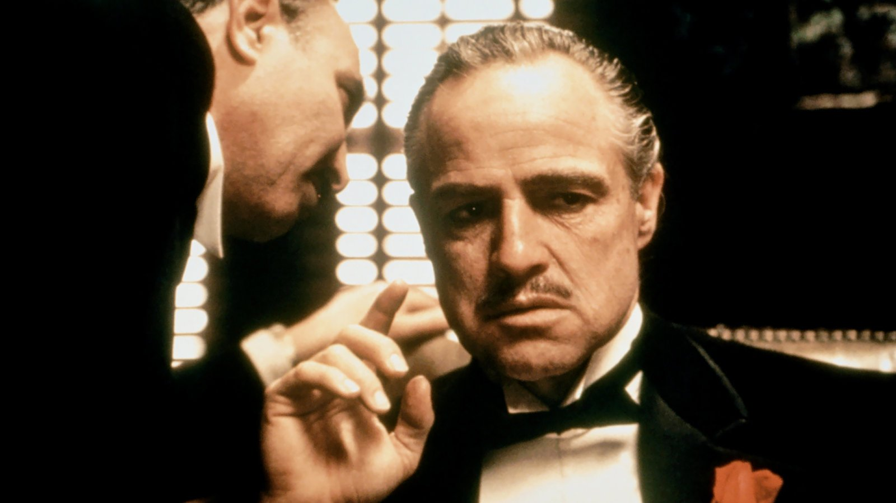  Marlon Brando in “The Godfather.”Paramount Pictures](https://www.nytimes.com/watching/recommendations/watching-film-the-godfather)

Movie

## [The Godfather (Starts Jan. 1)](https://www.nytimes.com/watching/recommendations/watching-film-the-godfather)

In 1972, Francis Ford Coppola took a fairly average best seller and, contrary to all expectation, turned it into the Great American Movie. In it, he tells the tale of the Corleones, a New York crime family, and of how its charismatic patriarch (an Oscar-winning Marlon Brando) watches his dreams of respectability sink when his most promising son (Al Pacino, in his breakout role) embraces the “family business.” But this is not your average gangster film. Coppola’s attention to detail and the richly realized performances turn it into the genre film equivalent of an F. Scott Fitzgerald novel, with an American Dream subtext that is pronounced but not preachy. This is quite simply one of the essential films of our time. (For more of the Corleone family saga, queue up **“The Godfather, Part II,”** on Netflix starting Jan. 1.)

- [Netflix](https://gowatchit.com/movies/1862/watch_now?category=online&modality=widget&origin_url=https%3A%2F%2Fwww.nytimes.com%2Fwatching%2Flists%2Fbest-movies-on-netflix&partner_id=20&provider_format_id=1&provider_id=1)
- [Amazon Video (Buy)](https://gowatchit.com/movies/1862/watch_now?category=online&modality=widget&origin_url=https%3A%2F%2Fwww.nytimes.com%2Fwatching%2Flists%2Fbest-movies-on-netflix&partner_id=20&provider_format_id=7&provider_id=11)
- [iTunes](https://gowatchit.com/movies/1862/watch_now?category=online&modality=widget&origin_url=https%3A%2F%2Fwww.nytimes.com%2Fwatching%2Flists%2Fbest-movies-on-netflix&partner_id=20&provider_format_id=3&provider_id=3)
- [+ 2 others](https://www.nytimes.com/watching/lists/best-movies-on-netflix?emc=edit_ne_20180102&nl=evening-briefing&nlid=72982178&te=1#)

* * *

[ 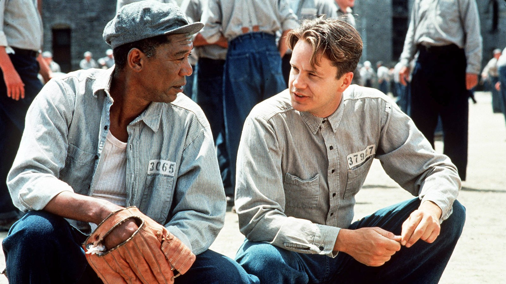  Morgan Freeman, left, and Tim Robbins in “The Shawshank Redemption.”Michael Weinstein/Castle Rock Entertainment](https://www.nytimes.com/watching/titles/the-shawshank-redemption)

Movie

## [The Shawshank Redemption (Starts Jan. 1)](https://www.nytimes.com/watching/titles/the-shawshank-redemption)

Two “lifers,” locked up together indefinitely in Shawshank prison, form a bond that transcends decades of their lives and, ultimately, their own incarcerations in this heart-wrenching adaptation of an atypically non-genre novella by Stephen King. Tim Robbins is in fine form as Andy Dufresne, convicted of a crime he didn’t commit and dedicated to proving it. As Red, the guy who can get anything for anybody, Morgan Freeman (who also narrates) crafts the quintessential Morgan Freeman performance: folksy and friendly, but with a layer of steel underneath. Frank Darabont’s direction is leisurely but efficient, building the world within these prison walls and conveying the joy of breaking free of them.

- [Netflix](https://gowatchit.com/movies/43211/watch_now?category=online&modality=widget&origin_url=https%3A%2F%2Fwww.nytimes.com%2Fwatching%2Flists%2Fbest-movies-on-netflix%3Femc%3Dedit_ne_20180102%26nl%3Devening-briefing%26nlid%3D71386779%26te%3D1&partner_id=20&provider_format_id=1&provider_id=1)
- [Amazon Video (Buy)](https://gowatchit.com/movies/43211/watch_now?category=online&modality=widget&origin_url=https%3A%2F%2Fwww.nytimes.com%2Fwatching%2Flists%2Fbest-movies-on-netflix%3Femc%3Dedit_ne_20180102%26nl%3Devening-briefing%26nlid%3D71386779%26te%3D1&partner_id=20&provider_format_id=7&provider_id=11)
- [iTunes](https://gowatchit.com/movies/43211/watch_now?category=online&modality=widget&origin_url=https%3A%2F%2Fwww.nytimes.com%2Fwatching%2Flists%2Fbest-movies-on-netflix%3Femc%3Dedit_ne_20180102%26nl%3Devening-briefing%26nlid%3D71386779%26te%3D1&partner_id=20&provider_format_id=3&provider_id=3)
- [+ 3 others](https://www.nytimes.com/watching/lists/best-movies-on-netflix?emc=edit_ne_20180102&nl=evening-briefing&nlid=72982178&te=1#)

* * *

[ 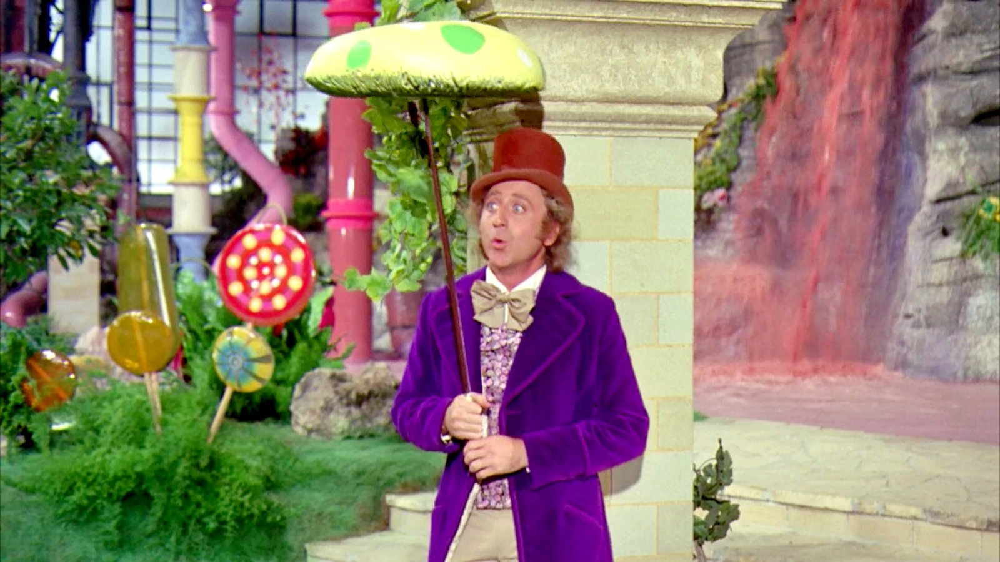  Gene Wilder in “Willy Wonka & the Chocolate Factory.”Wolper Pictures](https://www.nytimes.com/watching/titles/willy-wonka-and-the-chocolate-factory)

Movie

## [Willy Wonka & the Chocolate Factory (Starts Jan. 1)](https://www.nytimes.com/watching/titles/willy-wonka-and-the-chocolate-factory)

Gene Wilder created one of cinema’s most enduring characters in this 1971 adaptation of Roald Dahl’s classic novel “Charlie and the Chocolate Factory,” directed by Mel Stuart. As the gloriously eccentric owner of the best candy factory in all the land, Wilder invests the character with not only a sense of wonder and imagination, but also a surprising edginess — this is ultimately a morality tale, in which a guided tour of the factory becomes a lesson in the consequences of childish behavior. Innovatively crafted and filled with memorable songs and supporting characters, this is a family film with a welcome dash of darkness.

- [Netflix](https://gowatchit.com/movies/47854/watch_now?category=online&modality=widget&origin_url=https%3A%2F%2Fwww.nytimes.com%2Fwatching%2Flists%2Fbest-movies-on-netflix%3Femc%3Dedit_ne_20180102%26nl%3Devening-briefing%26nlid%3D71386779%26te%3D1&partner_id=20&provider_format_id=1&provider_id=1)
- [Amazon Video (Buy)](https://gowatchit.com/movies/47854/watch_now?category=online&modality=widget&origin_url=https%3A%2F%2Fwww.nytimes.com%2Fwatching%2Flists%2Fbest-movies-on-netflix%3Femc%3Dedit_ne_20180102%26nl%3Devening-briefing%26nlid%3D71386779%26te%3D1&partner_id=20&provider_format_id=7&provider_id=11)
- [iTunes](https://gowatchit.com/movies/47854/watch_now?category=online&modality=widget&origin_url=https%3A%2F%2Fwww.nytimes.com%2Fwatching%2Flists%2Fbest-movies-on-netflix%3Femc%3Dedit_ne_20180102%26nl%3Devening-briefing%26nlid%3D71386779%26te%3D1&partner_id=20&provider_format_id=3&provider_id=3)
- [+ 3 others](https://www.nytimes.com/watching/lists/best-movies-on-netflix?emc=edit_ne_20180102&nl=evening-briefing&nlid=72982178&te=1#)

* * *