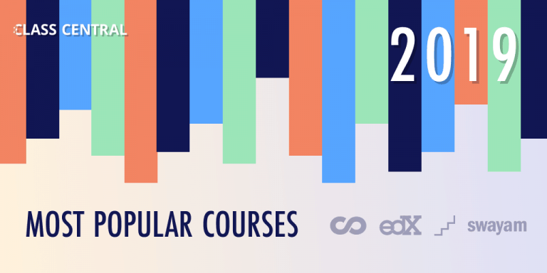

The 100 Most Popular Free Online Courses of 2019 — Class Central

# The 100 Most Popular Free Online Courses of 2019

 

 [Dhawal Shah](https://www.classcentral.com/report/author/dhawal/)   Dec 14th, 2019

- [Facebook](http://www.facebook.com/sharer.php?u=https%3A%2F%2Fwww.classcentral.com%2Freport%2F100-most-popular-online-courses-2019%2F&t=The%20100%20Most%20Popular%20Free%20Online%20Courses%20of%202019&s=100&p[url]=https%3A%2F%2Fwww.classcentral.com%2Freport%2F100-most-popular-online-courses-2019%2F&p[images][0]=https%3A%2F%2Fwww.classcentral.com%2Freport%2Fwp-content%2Fuploads%2F2019%2F12%2Fmost-popular-1024x512.png&p[title]=The%20100%20Most%20Popular%20Free%20Online%20Courses%20of%202019)

- [Twitter](https://twitter.com/intent/tweet?url=https%3A%2F%2Fwww.classcentral.com%2Freport%2F100-most-popular-online-courses-2019%2F&text=The%20100%20Most%20Popular%20Free%20Online%20Courses%20of%202019)

- [Envelope](https://www.classcentral.com/report/100-most-popular-online-courses-2019/?utm_medium=email&utm_source=other&utm_campaign=opencourse.GdeNrll1EeSROyIACtiVvg.announcements~opencourse.GdeNrll1EeSROyIACtiVvg.qTOaasuISNOe24PZrleSRwmailto:?subject=The%20100%20Most%20Popular%20Free%20Online%20Courses%20of%202019&body=Hey%20check%20this%20out:%20https%3A%2F%2Fwww.classcentral.com%2Freport%2F100-most-popular-online-courses-2019%2F)

- Url

- [0  *i*](https://www.classcentral.com/report/100-most-popular-online-courses-2019/#commentSection)

It’s been eight years since a few Stanford professors decided to offer their courses online for free. These courses are now known popularly as MOOCs or [Massive Open Online Courses](https://www.classcentral.com/help/moocs).

They are not as free as they used to be, but you can still [audit them for free](https://www.classcentral.com/help/moocs-cost). Since then over 900 universities have launched 13,500 [online courses](https://www.classcentral.com/). These courses have been taken by [110 million learners](https://www.classcentral.com/report/mooc-stats-2019/)!

I’ve been keeping track of these courses the entire time over at [Class Central](https://www.classcentral.com/), ever since they rose to prominence. We just completed our [eighth year](https://www.classcentral.com/report/class-central-8th-anniversary/), and have helped over 20 million learners decide which online course to take.

In the first step, we went through Class Central’s database and made a list of all the courses that were offered for the first time ever in 2019. We found out that 450 universities around the world have launched more than 2,500 courses.

Then [Suparn](https://www.linkedin.com/in/suparnpatra/) wrote scrapers to collect enrollment numbers for three different providers: Coursera, edX, and Swayam. Each of these providers show how many students are enrolled on their course pages. These providers alone registered around 5 million enrollments for courses launched in 2019!

Along with this we also had data from our users: how many times a course has been bookmarked on Class Central. Using the enrollment data and bookmarks data we came up with a list of [100 most popular courses of 2019](https://www.classcentral.com/list/2019-s-most-popular-online-courses-free-d1twvlv)  from 68 universities.

You can also find this [list on Class Central](https://www.classcentral.com/list/2019-s-most-popular-online-courses-free-d1twvlv) which I built using Class Central’s Custom List feature. Not all the courses on this list might be available, but if you bookmark a course on Class Central, then we will let you know when it is offered next.

## 2019’s Most Popular Online Courses

Here are the most popular free online university courses of 2019 (not ordered by popularity).

- [Understanding Multiple Sclerosis (MS)](https://www.classcentral.com/course/independent-understanding-multiple-sclerosis-ms-13338) from *University of Tasmania* ★★★★★(246)
- [Differential Equations for Engineers](https://www.classcentral.com/course/differential-equations-engineers-13258) from *The Hong Kong University of Science and Technology* ★★★★★(32)
- [Teaching English: How to Plan a Great Lesson](https://www.classcentral.com/course/teaching-english-great-lesson-13115) from *British Council* ★★★★★(125)
- [Understanding IELTS: Speaking](https://www.classcentral.com/course/understanding-ielts-speaking-17037) from *British Council* ★★★★★(26)
- [The Art of Structural Engineering: Vaults](https://www.classcentral.com/course/edx-the-art-of-structural-engineering-vaults-12040) from *Princeton University* ★★★★★(17)
- [Improving Your Study Techniques](https://www.classcentral.com/course/improving-study-techniques-13420) from *University of Groningen* ★★★★★(20)
- [Mathematical Economics](https://www.classcentral.com/course/swayam-mathematical-economics-14187) from *Doon University, Dehradun* ★★★★★(75)
- [Constitutional Interpretation](https://www.classcentral.com/course/edx-constitutional-interpretation-13427) from *Princeton University* ★★★★★(16)
- [Happier Employees and Return-On-Investment Course](https://www.classcentral.com/course/edx-happier-employees-and-return-on-investment-course-17121) from *The University of Texas at Austin* ★★★★★(10)
- [Gender and Sexuality: Applications in Society](https://www.classcentral.com/course/edx-gender-and-sexuality-applications-in-society-12333) from *The University of British Columbia* ★★★★★(48)
- [The IB Extended Essay: Managing your Research Project](https://www.classcentral.com/course/ib-extended-essay-12702) from *University of Leeds* ★★★★★(32)
- [Agile Leadership Principles](https://www.classcentral.com/course/edx-agile-leadership-principles-11920) from *University System of Maryland* ★★★★★(124)
- [ANIMATIONs](https://www.classcentral.com/course/swayam-animations-13880) from *Banaras Hindu University* ★★★★☆(61)
- [Python and Statistics for Financial Analysis](https://www.classcentral.com/course/python-statistics-financial-analysis-12648) from *The Hong Kong University of Science and Technology* ★★★★☆(58)
- [Unlocking Information Security: Part Ⅰ](https://www.classcentral.com/course/edx-unlocking-information-security-part-16964) from *Tel Aviv University* ★★★★★(2)
- [Digital Security and Human Rights](https://www.classcentral.com/course/edx-digital-security-and-human-rights-12842) from *Amnesty International* ★★★★★(1)
- [Fundamentals of Statistics](https://www.classcentral.com/course/edx-fundamentals-of-statistics-11482) from *Massachusetts Institute of Technology* ★★★★★(1)
- [Herbal Medicine](https://www.classcentral.com/course/herbalmedicine-12872) from *University of Minnesota* ★★★★★(1)
- [Ideas for a Better World: Leading Change Through Policymaking](https://www.classcentral.com/course/ideas-better-world-13689) from *British Council* ★★★★★(1)
- [Ethical Hacking](https://www.classcentral.com/course/swayam-ethical-hacking-14045) from *Indian Institute of Technology, Kharagpur* ★★★★★(1)
- [Data Analysis: A Practical Introduction for Absolute Beginners](https://www.classcentral.com/course/edx-data-analysis-a-practical-introduction-for-absolute-beginners-12635) from *Microsoft* ★★★★☆(1)
- [The Tudors](https://www.classcentral.com/course/the-tudors-12832) from *University of Roehampton* ★★★★☆(1)
- [C for Everyone: Programming Fundamentals](https://www.classcentral.com/course/c-for-everyone-16909) from *University of California, Santa Cruz* ★★★★☆(1)
- [Hacking Exercise For Health. The surprising new science of fitness.](https://www.classcentral.com/course/hacking-exercise-health-16911) from *McMaster University* ★★★★☆(2)
- [Python for Data Science and AI](https://www.classcentral.com/course/python-for-applied-data-science-ai-14403) from *IBM* ★★★☆☆(1)
- [Critical thinking: reasoned decision making](https://www.classcentral.com/course/edx-critical-thinking-reasoned-decision-making-17197) from *Tecnológico de Monterrey* ★★☆☆☆(1)
- [Brand Identity and Strategy](https://www.classcentral.com/course/brand-identity-strategy-13108) from *IE Business School*
- [Weight Management: Beyond Balancing Calories](https://www.classcentral.com/course/weight-management-beyond-balancing-calor-13200) from *Emory University*
- [Introduction to Artificial Intelligence (AI)](https://www.classcentral.com/course/introduction-to-ai-13848) from *IBM*
- [Introduction to TensorFlow for Artificial Intelligence, Machine Learning, and Deep Learning](https://www.classcentral.com/course/introduction-tensorflow-13287) from *deeplearning.ai*
- [Applying Data Analytics in Marketing](https://www.classcentral.com/course/applying-data-analytics-business-in-mark-16865) from *University of Illinois at Urbana-Champaign*
- [Getting Started with AWS Machine Learning](https://www.classcentral.com/course/aws-machine-learning-16924) from *Amazon Web Services*
- [The Language of Design: Form and Meaning](https://www.classcentral.com/course/design-language-16927) from *California Institute of the Arts*
- [Developing a Systems Mindset](https://www.classcentral.com/course/systems-mindset-17004) from *University of Colorado Boulder*
- [Introduction to Android graphics](https://www.classcentral.com/course/intro-android-graphics-16943) from *Imperial College London*
- [The Neuromarketing Toolbox](https://www.classcentral.com/course/neuromarketing-toolbox-17148) from *Copenhagen Business School*
- [Empowering Yourself in a Post-Truth World](https://www.classcentral.com/course/empowering-yourself-post-truth-world-15225) from *State University of New York*
- [Introduction to Self-Determination Theory: An approach to motivation, development and wellness](https://www.classcentral.com/course/self-determination-theory-13094) from *University of Rochester*
- [Counseling Practice and Research](https://www.classcentral.com/course/edx-counseling-practice-and-research-12756) from *Seoul National University*
- [China’s Political and Intellectual Foundations: From Sage Kings to Confucius](https://www.classcentral.com/course/edx-china-s-political-and-intellectual-foundations-from-sage-kings-to-confucius-13152) from *Harvard University*
- [Blockchain and FinTech: Basics, Applications, and Limitations](https://www.classcentral.com/course/edx-blockchain-and-fintech-basics-applications-and-limitations-11393) from *The University of Hong Kong*
- [English@Work: Basic Job Interview Skills](https://www.classcentral.com/course/edx-english-work-basic-job-interview-skills-14432) from *Hong Kong Polytechnic University*
- [Child Protection: Children’s Rights in Theory and Practice](https://www.classcentral.com/course/edx-child-protection-children-s-rights-in-theory-and-practice-12686) from *Harvard University*
- [Freedom of Expression and Information in the Time of Globalization: Foundational Course](https://www.classcentral.com/course/edx-freedom-of-expression-and-information-in-the-time-of-globalization-foundational-course-15198) from *Columbia University*
- [CS50 for Lawyers](https://www.classcentral.com/course/edx-cs50-for-lawyers-16857) from *Harvard University*
- [Women Making History: Ten Objects, Many Stories](https://www.classcentral.com/course/edx-women-making-history-ten-objects-many-stories-12269) from *Harvard University*
- [Advanced Android with Kotlin](https://www.classcentral.com/course/udacity-advanced-android-with-kotlin-17086) from *Google*
- [The New World of Arnold Schönberg’s Piano Music](https://www.classcentral.com/course/stanford-openedx-the-new-world-of-arnold-schonberg-s-piano-music-17139) from *Stanford University*
- [Exploring GraphQL: A Query Language for APIs](https://www.classcentral.com/course/edx-exploring-graphql-a-query-language-for-apis-17144) from *Linux Foundation*
- [Rhetoric: The Art of Persuasive Writing and Public Speaking](https://www.classcentral.com/course/edx-rhetoric-the-art-of-persuasive-writing-and-public-speaking-16993) from *Harvard University*
- [The Future of Work: Preparing for Disruption](https://www.classcentral.com/course/edx-the-future-of-work-preparing-for-disruption-13702) from *The World Bank*
- [Research and Development in Discrete Industries](https://www.classcentral.com/course/opensap-research-and-development-in-discrete-industries-15182)
- [Backyard Meteorology: The Science of Weather](https://www.classcentral.com/course/edx-backyard-meteorology-the-science-of-weather-12108) from *Harvard University*
- [Academic writing for clarity and meaning](https://www.classcentral.com/course/edx-academic-writing-for-clarity-and-meaning-15218) from *University of the Witwatersrand*
- [The Health Effects of Climate Change](https://www.classcentral.com/course/edx-the-health-effects-of-climate-change-12106) from *Harvard University*
- [Mindfulness and Resilience to Stress at Work](https://www.classcentral.com/course/edx-mindfulness-and-resilience-to-stress-at-work-10286) from *University of California, Berkeley*
- [Machine Learning with Python: from Linear Models to Deep Learning](https://www.classcentral.com/course/edx-machine-learning-with-python-from-linear-models-to-deep-learning-11483) from *Massachusetts Institute of Technology*
- [Inclusive Education: Essential Knowledge for Success](https://www.classcentral.com/course/inclusive-education-16951) from *Queensland University of Technology*
- [Data Analysis for Decision Making](https://www.classcentral.com/course/edx-data-analysis-for-decision-making-11673) from *University System of Maryland*
- [Introduction to Encryption and Cryptography](https://www.classcentral.com/course/encryption-and-cryptography-17172) from *Raspberry Pi Foundation*
- [Introduction to Self-Driving Cars](https://www.classcentral.com/course/intro-self-driving-cars-13140) from *University of Toronto*
- [Cannabis, Mental Health, and Brain Disorders](https://www.classcentral.com/course/mentalhealth-cannabis-cbd-thc-13819) from *University of Colorado Boulder*
- [Managing ADHD, Autism, Learning Disabilities, and Concussion in School](https://www.classcentral.com/course/managing-adhd-autism-learning-disabiliti-12821) from *University of Colorado System*
- [Applying Data Analytics in Finance](https://www.classcentral.com/course/applying-data-analytics-business-in-fina-15161) from *University of Illinois at Urbana-Champaign*
- [Introduction to Applied Machine Learning](https://www.classcentral.com/course/machine-learning-applied-15163) from *Alberta Machine Intelligence Institute*
- [Introduction to Climate Change and Health](https://www.classcentral.com/course/introduction-climate-change-health-16878) from *Yale University*
- [Python and Machine Learning for Asset Management ](https://www.classcentral.com/course/python-machine-learning-for-investment-m-16888)from *EDHEC Business School*
- [Negotiation skills: Negotiate and resolve conflict](https://www.classcentral.com/course/negotiation-skills-conflict-16974) from *Macquarie University*
- [Foundational Skills for Communicating About Health](https://www.classcentral.com/course/foundational-skills-communicating-health-16914) from *University of Michigan*
- [Hypothesis-Driven Development](https://www.classcentral.com/course/uva-darden-agile-testing-16940) from *University of Virginia*
- [Exploring Renewable Energy Schemes](https://www.classcentral.com/course/exploring-renewable-energy-17025) from *University of Pennsylvania*
- [Improving Your Statistical Questions](https://www.classcentral.com/course/improving-statistical-questions-17049) from *Eindhoven University of Technology*
- [Exploratory Data Analysis with MATLAB](https://www.classcentral.com/course/exploratory-data-analysis-matlab-17125) from *MathWorks*
- [Machine Learning](https://www.classcentral.com/course/edx-machine-learning-15170) from *The University of Texas at Austin*
- [Personal growth basics (for people with limited health abilities)](https://www.classcentral.com/course/edx-personal-growth-basics-for-people-with-limited-health-abilities-17068) from *Ural Federal University*
- [Financial Development and Financial Inclusion](https://www.classcentral.com/course/edx-financial-development-and-financial-inclusion-16971) from *International Monetary Fund*
- [Steps in Japanese for Beginners1 Part1](https://www.classcentral.com/course/edx-steps-in-japanese-for-beginners1-part1-16922) from *Waseda University*
- [GMBA824 Know your customers](https://www.classcentral.com/course/gmba824-17107) from *Macquarie University*
- [Nutrition: Eating to Live Well](https://www.classcentral.com/course/eating-while-enjoying-life-15172) from *Tapei Medical University*
- [Food and Mood: Improving Mental Health Through Diet and Nutrition](https://www.classcentral.com/course/food-and-mood-17020) from *Deakin University*
- [An Introduction to Programming through C++](https://www.classcentral.com/course/swayam-an-introduction-to-programming-through-c-13892) from *Indian Institute of Technology Bombay*
- [Artificial Intelligence Search Methods For Problem Solving](https://www.classcentral.com/course/swayam-artificial-intelligence-search-methods-for-problem-solving-13903) from *Indian Institute of Technology Madras*
- [Programming in Java](https://www.classcentral.com/course/swayam-programming-in-java-12930) from *Indian Institute of Technology, Kharagpur*
- [Joy of computing using Python](https://www.classcentral.com/course/swayam-the-joy-of-computing-using-python-12931) from *Indian Institute of Technology, Ropar*
- [Introduction to Machine Learning (IITM)](https://www.classcentral.com/course/swayam-introduction-to-machine-learning-iitkgp-14153) from *Indian Institute of Technology Madras*
- [Programming, Data Structures And Algorithms Using Python](https://www.classcentral.com/course/swayam-programming-data-structures-and-algorithms-using-python-14260) from *Chennai Mathematical Institute*
- [Python for Data Science](https://www.classcentral.com/course/swayam-python-for-data-science-14266) from *Indian Institute of Technology Madras*
- [Developing Soft Skills and Personality](https://www.classcentral.com/course/swayam-developing-soft-skills-and-personality-14001) from *Indian Institute of Technology Kanpur*
- [Caring for Children Moving Alone: Protecting Unaccompanied and Separated Children](https://www.classcentral.com/course/caring-for-children-moving-alone-13484) from *University of Strathclyde*
- [Managing People: Understanding Individual Differences](https://www.classcentral.com/course/managing-people-understanding-differences-12717) from *University of Reading*
- [Digital Transformation in the Classroom](https://www.classcentral.com/course/digital-transformation-classroom-15185) from *Norwegian University of Science and Technology*
- [From data base to big data](https://www.classcentral.com/course/france-universite-numerique-from-data-base-to-big-data-16958) from *Université Côte d’Azur*
- [Diplomacy in the 21st Century](https://www.classcentral.com/course/diplomacy-in-the-21st-century-12313) from *The Open University*
- [Understanding Gender Inequality](https://www.classcentral.com/course/understanding-gender-inequality-15219) from *University of Exeter*
- [Successful Negotiation: Essential Strategies and Skills](https://www.classcentral.com/course/successful-negotiation-16936) from *University of Michigan*
- [Science Communication and Public Engagement](https://www.classcentral.com/course/science-communication-for-researchers-15231) from *EIT Food*
- [English Pronunciation in a Global World](https://www.classcentral.com/course/english-pronunciation-12603) from *University of Amsterdam*
- [America’s Opioid Epidemic: From Evidence to Impact](https://www.classcentral.com/course/opioid-epidemic-america-17128) from *Johns Hopkins University*
- [Understanding ADHD: Current Research and Practice](https://www.classcentral.com/course/understanding-adhd-13328) from *King’s College London*
- [End of Life Care: Challenges and Innovation](https://www.classcentral.com/course/end-of-life-care-16932) from *University of Glasgow*

####  Category

- [Course Report](https://www.classcentral.com/report/category/mooc-course-report/)

####  Tags

 [MOOC Roundup 2019](https://www.classcentral.com/report/tag/mooc-roundup-2019/)

 

###   [Dhawal Shah](https://www.classcentral.com/report/author/dhawal/)

Dhawal is the founder and CEO of Class Central.

 [More articles from Dhawal Shah](https://www.classcentral.com/report/author/dhawal/)