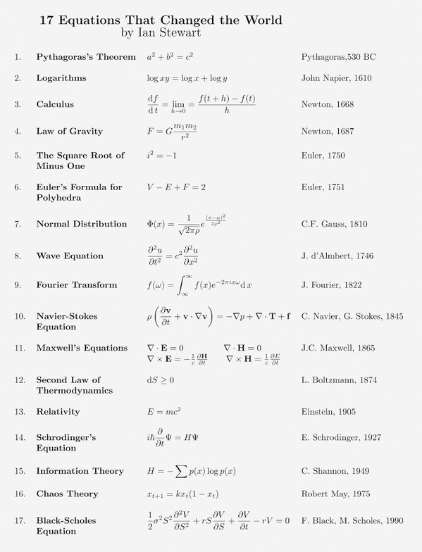
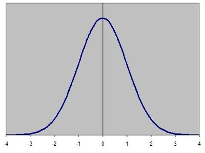

The 17 equations that changed the course of history

# The 17 equations that changed the course of history

 [Andy Kiersz](https://www.businessinsider.com.au/author/andy-kiersz)

 Mar 13, 2014, 6:34 AM    [**](https://www.businessinsider.com.au/17-equations-that-changed-the-world-2014-3#)

- [ **  facebook](http://www.facebook.com/sharer.php?u=https%3A%2F%2Fwww.businessinsider.com.au%2F17-equations-that-changed-the-world-2014-3&t=The+17+equations+that+changed+the+course+of+history)

- [ ** twitter](http://twitter.com/share?url=https%3A%2F%2Fwww.businessinsider.com.au%2F17-equations-that-changed-the-world-2014-3&text=The+17+equations+that+changed+the+course+of+history%20(via%20@BIAUS))

- [ ** reddit](http://www.reddit.com/submit?url=https%3A%2F%2Fwww.businessinsider.com.au%2F17-equations-that-changed-the-world-2014-3)

- [ ** linkedin](http://www.linkedin.com/shareArticle?mini=true&url=https%3A%2F%2Fwww.businessinsider.com.au%2F17-equations-that-changed-the-world-2014-3&title=The+17+equations+that+changed+the+course+of+history&summary=Mathematics+is+all+around+us%2C+and+it+has+shaped+our+understanding+of+the+world+in+countless+ways.)

- [ ** Email](https://www.businessinsider.com.au/17-equations-that-changed-the-world-2014-3mailto:?to=&body=I%20thought%20that%20you%27d%20be%20interested%20in%20this%20article%20from%20Business%20Insider%20Australia:%20https://www.businessinsider.com.au/17-equations-that-changed-the-world-2014-3&subject=The%2017%20equations%20that%20changed%20the%20course%20of%20history)

Mathematics is all around us, and it has shaped our understanding of the world in countless ways.

In 2013, mathematician and science author Ian Stewart published a book on [17 Equations That Changed The World](http://www.amazon.com/Pursuit-Equations-That-Changed-World/dp/0465085989/ref=sr_1_1?s=books&ie=UTF8&qid=1394573874&sr=1-1&keywords=17+equations+that+changed+the+world). We recently came across this convenient table on [Dr. Paul Coxon’s twitter account](https://twitter.com/paulcoxon/status/442706898370834432) by [mathematics tutor and blogger Larry Phillips](http://www.maththoughts.com/) that summarizes the equations. (Our explanation of each is below):

*Larry Phillips, via @paulcoxon on Twitter*

Here is a little bit more about these wonderful equations that have shaped mathematics and human history:

*Shutterstock/ igor.stevanovic*

1) **The Pythagorean Theorem**: This theorem is foundational to our understanding of geometry. It describes the relationship between the sides of a right triangle on a flat plane: square the lengths of the short sides, a and b, add those together, and you get the square of the length of the long side, c.

This relationship, in some ways, actually distinguishes our normal, flat, Euclidean geometry from curved, non-Euclidean geometry. For example, a right triangle drawn on the surface of a sphere need not follow the Pythagorean theorem.

2) **Logarithms**: Logarithms are the inverses, or opposites, of exponential functions. A logarithm for a particular base tells you what power you need to raise that base to to get a number. For example, the base 10 logarithm of 1 is log(1) = 0, since 1 = 100; log(10) = 1, since 10 = 101; and log(100) = 2, since 100 = 102.

The equation in the graphic, log(ab) = log(a) + log(b), shows one of the most useful applications of logarithms: they turn multiplication into addition.

Until the development of the digital computer, this was the most common way to quickly multiply together large numbers, greatly speeding up calculations in physics, astronomy, and engineering.

3) **Calculus**: The formula given here is the definition of the derivative in calculus. The derivative measures the rate at which a quantity is changing. For example, we can think of velocity, or speed, as being the derivative of position — if you are walking at 3 miles per hour, then every hour, you have changed your position by 3 miles.

Naturally, much of science is interested in understanding how things change, and the derivative and the integral — the other foundation of calculus — sit at the heart of how mathematicians and scientists understand change.

*Wikimedia Commons*Isaac Newton

4) **Law of Gravity**: Newton’s law of gravitation describes the force of gravity between two objects, F, in terms of a universal constant, G, the masses of the two objects, m1 and m2, and the distance between the objects, r. Newton’s law is a remarkable piece of scientific history — it explains, almost perfectly, why the planets move in the way they do. Also remarkable is its universal nature — this is not just how gravity works on Earth, or in our solar system, but anywhere in the universe.

Newton’s gravity held up very well for two hundred years, and it was not until Einstein’s theory of general relativity that it would be replaced.

5) **The square root of -1**: Mathematicians have [always been expanding the idea of what numbers actually are](http://www.businessinsider.com.au/numbers-you-need-to-do-math-2013-11), going from natural numbers, to negative numbers, to fractions, to the real numbers. The square root of -1, usually written *i*, completes this process, giving rise to the complex numbers.

Mathematically, the complex numbers are supremely elegant. Algebra works perfectly the way we want it to — any equation has a complex number solution, a situation that is not true for the real numbers : x2 + 4 = 0 has no real number solution, but it does have a complex solution: the square root of -2. Calculus can be extended to the complex numbers, and by doing so, we find some amazing symmetries and properties of these numbers. Those properties make the complex numbers essential in electronics and signal processing.

*Wikimedia Commons*A cube.

6) **Euler’s Polyhedra Formula**: Polyhedra are the three-dimensional versions of polygons, like the cube to the right. The corners of a polyhedron are called its vertices, the lines connecting the vertices are its edges, and the polygons covering it are its faces.

A cube has 8 vertices, 12 edges, and 6 faces. If I add the vertices and faces together, and subtract the edges, I get 8 + 6 – 12 = 2.

Euler’s formula states that, as long as your polyhedron is somewhat well behaved, if you add the vertices and faces together, and subtract the edges, you will always get 2. This will be true whether your polyhedron has 4, 8, 12, 20, or any number of faces.

Euler’s observation was one of the first examples of what is now called a [topological invariant](http://en.wikipedia.org/wiki/Topological_property) — some number or property shared by a class of shapes that are similar to each other. The entire class of “well-behaved” polyhedra will have V + F – E = 2. This observation, along with with Euler’s solution to [the Bridges of Konigsburg problem](http://www.businessinsider.com.au/euler-cross-nyc-bridges-once-2014-1), paved the way to the development of topology, a branch of maths essential to modern physics.

*economicshelp.org*The normal distribution.

7) **Normal distribution**: The normal probability distribution, which has the familiar bell curve graph to the left, is ubiquitous in statistics.

The normal curve is used in physics, biology, and the social sciences to model various properties. One of the reasons the normal curve shows up so often is that it [describes the behaviour of large groups of independent processes](http://en.wikipedia.org/wiki/Central_limit_theorem).

8) **Wave Equation**: This is a differential equation, or an equation that describes how a property is changing through time in terms of that property’s derivative, as above. The wave equation describes the behaviour of waves — a vibrating guitar string, ripples in a pond after a stone is thrown, or light coming out of an incandescent bulb. The wave equation was an early differential equation, and the techniques developed to solve the equation opened the door to understanding other differential equations as well.

9) **Fourier Transform**: The Fourier transform is essential to understanding more complex wave structures, like human speech. Given a complicated, messy wave function like a recording of a person talking, the Fourier transform allows us to break the messy function into a combination of a number of simple waves, greatly simplifying analysis.

The Fourier transform is at the heart of modern signal processing and analysis, and data compression.

10) **Navier-Stokes Equations**: Like the wave equation, this is a differential equation. The Navier-Stokes equations describes the behaviour of flowing fluids — water moving through a pipe, air flow over an aeroplane wing, or smoke rising from a cigarette. While we have approximate solutions of the Navier-Stokes equations that allow computers to simulate fluid motion fairly well, it is still an open question ([with a million dollar prize](http://www.claymath.org/millenium-problems/navier%E2%80%93stokes-equation)) whether it is possible to construct mathematically exact solutions to the equations.

11) **Maxwell’s Equations**: This set of four differential equations describes the behaviour of and relationship between electricity (E) and magnetism (H).

Maxwell’s equations are to classical electromagnetism as Newton’s laws of motion and law of universal gravitation are to classical mechanics — they are the foundation of our explanation of how electromagnetism works on a day to day scale. As we will see, however, modern physics relies on a quantum mechanical explanation of electromagnetism, and it is now clear that these elegant equations are just an approximation that works well on human scales.

12) **Second Law of Thermodynamics**: This states that, in a closed system, entropy (S) is always steady or increasing. Thermodynamic entropy is, roughly speaking, a measure of how disordered a system is. A system that starts out in an ordered, uneven state — say, a hot region next to a cold region — will always tend to even out, with heat flowing from the hot area to the cold area until evenly distributed.

The second law of thermodynamics is one of the few cases in physics where time matters in this way. Most physical processes are reversible — we can run the equations backwards without messing things up. The second law, however, only runs in this direction. If we put an ice cube in a cup of hot coffee, we always see the ice cube melt, and never see the coffee freeze.

*Associated Press*Albert Einstein

13) **Relativity**: Einstein radically altered the course of physics with his theories of special and general relativity. The classic equation E = mc2 states that matter and energy are equivalent to each other. Special relativity brought in ideas like the speed of light being a universal speed limit and the passage of time being different for people moving at different speeds.

General relativity describes gravity as a curving and folding of space and time themselves, and was the first major change to our understanding of gravity since Newton’s law. General relativity is essential to our understanding of the origins, structure, and ultimate fate of the universe.

14) **Schrodinger’s Equation**: This is the main equation in quantum mechanics. As general relativity explains our universe at its largest scales, this equation governs the behaviour of atoms and subatomic particles.

Modern quantum mechanics and general relativity are the two most successful scientific theories in history — all of the experimental observations we have made to date are entirely consistent with their predictions. Quantum mechanics is also necessary for most modern technology — nuclear power, semiconductor-based computers, and lasers are all built around quantum phenomena.

15) **Information Theory**: The equation given here is for [Shannon information entropy](http://en.wikipedia.org/wiki/Entropy_(information_theory)). As with the thermodynamic entropy given above, this is a measure of disorder. In this case, it measures the information content of a message — a book, a JPEG picture sent on the internet, or anything that can be represented symbolically. The Shannon entropy of a message represents a lower bound on how much that message can be compressed without losing some of its content.

Shannon’s entropy measure launched the mathematical study of information, and his results are central to how we communicate over networks today.

16) **Chaos Theory**: This equation is [May’s logistic map](http://en.wikipedia.org/wiki/Logistic_map). It describes a process evolving through time — xt+1, the level of some quantity x in the next time period — is given by the formula on the right, and it depends on xt, the level of x right now. k is a chosen constant. For certain values of k, the map shows chaotic behaviour: if we start at some particular initial value of x, the process will evolve one way, but if we start at another initial value, even one very very close to the first value, the process will evolve a completely different way.

We see chaotic behaviour — behaviour sensitive to initial conditions — like this in many areas. Weather is a classic example — a small change in atmospheric conditions on one day can lead to completely different weather systems a few days later, most commonly captured in the idea of [a butterfly flapping its wings on one continent causing a hurricane on another continent](http://en.wikipedia.org/wiki/Butterfly_effect).

17) **Black-Scholes Equation**: Another differential equation, Black-Scholes describes how finance experts and traders find prices for derivatives. Derivatives — financial products based on some underlying asset, like a stock — are a major part of the modern financial system.

The Black-Scholes equation allows financial professionals to calculate the value of these financial products, based on the properties of the derivative and the underlying asset.

Photo: Andrew Renneisen/Getty Images

**Follow Business Insider Australia on [Facebook](https://www.facebook.com/BusinessInsiderAustralia), [Twitter](https://twitter.com/BIAUS), [LinkedIn](http://www.linkedin.com/company/business-insider-au), and [Instagram](https://www.instagram.com/businessinsiderau/).**

* * *

### Tagged In

 [equations](https://www.businessinsider.com.au/category/equations)[history](https://www.businessinsider.com.au/category/history)[math](https://www.businessinsider.com.au/category/math)[science](https://www.businessinsider.com.au/category/science)

* * *

[  ](https://popup.taboola.com/en/?template=colorbox&utm_source=alluremedia-businessinsideraustralia&utm_medium=referral&utm_content=organic-thumbnails-a-feed-plus-sc:Below%20Article%20Thumbnails%20|%20Card%202:)

[by Taboola ](https://popup.taboola.com/en/?template=colorbox&utm_source=alluremedia-businessinsideraustralia&utm_medium=referral&utm_content=organic-thumbnails-a-feed-plus-sc:Below%20Article%20Thumbnails%20|%20Card%202:)

[Sponsored Links ](https://popup.taboola.com/en/?template=colorbox&utm_source=alluremedia-businessinsideraustralia&utm_medium=referral&utm_content=organic-thumbnails-a-feed-plus-sc:Below%20Article%20Thumbnails%20|%20Card%202:)

[(L)](https://om.grepolis.com/grepo/en/?ref=tab_en_gb_gods&&pid=alluremedia-businessinsideraustralia#gods)[Are you ready to conquer Ancient Greece? Already 35 million players!Grepolis - Online Free Game](https://om.grepolis.com/grepo/en/?ref=tab_en_gb_gods&&pid=alluremedia-businessinsideraustralia#gods)

Undo

[(L)](http://www.cio.co.uk/it-strategy/digital-transformation-are-you-investing-in-right-things-3657471/?utm_source=taboola&utm_medium=referral)[Digital transformation: Are you investing in the right things?CIO UK](http://www.cio.co.uk/it-strategy/digital-transformation-are-you-investing-in-right-things-3657471/?utm_source=taboola&utm_medium=referral)

Undo

[(L)](https://www.reuters.tv/v/TRs/2017/04/02/insight-russian-skiers-strip-for-world-record?utm_source=taboola_int&utm_medium=referral&utm_term=alluremedia-businessinsideraustralia)[Watch: Russian skiers strip for world recordReuters TV](https://www.reuters.tv/v/TRs/2017/04/02/insight-russian-skiers-strip-for-world-record?utm_source=taboola_int&utm_medium=referral&utm_term=alluremedia-businessinsideraustralia)

Undo

[(L)](http://trknx.com/path/lp.php?trvid=10046&trvx=82ed3095&cid=12&utm_term=alluremedia-businessinsideraustralia)[Now You Can Track Your Car Using Your SmartphoneTrackr Bravo](http://trknx.com/path/lp.php?trvid=10046&trvx=82ed3095&cid=12&utm_term=alluremedia-businessinsideraustralia)

Undo

[(L)](https://plarium.com/play/en/stormfall/043_pastoral_anim_g?publisherID=alluremedia-businessinsideraustralia&plid=85188&pxl=taboola_fr)[This is the Most Addicting Game of the Year!Stormfall: Free Online Game](https://plarium.com/play/en/stormfall/043_pastoral_anim_g?publisherID=alluremedia-businessinsideraustralia&plid=85188&pxl=taboola_fr)

Undo

[(L)](https://go.babbel.com/engmag-a248-beginwithbabbel-cd-xo-tb/1_eng_tab_cd?utm_source=taboola&utm_medium=CON&utm_campaign=cd_engall_gen_cxo_beginwithbabbel&utm_term=alluremedia-businessinsideraustralia&utm_content=How+a+TOTAL+beginner+can+speak+Spanish+in+just+3+weeks%21)[How a TOTAL beginner can speak Spanish in just 3 weeks!Babbel](https://go.babbel.com/engmag-a248-beginwithbabbel-cd-xo-tb/1_eng_tab_cd?utm_source=taboola&utm_medium=CON&utm_campaign=cd_engall_gen_cxo_beginwithbabbel&utm_term=alluremedia-businessinsideraustralia&utm_content=How+a+TOTAL+beginner+can+speak+Spanish+in+just+3+weeks%21)

Undo

[(L)](http://www.save70.com/?utm_source=taboola_flights_wl_2&utm_medium=alluremedia-businessinsideraustralia)[The Ultimate Cheap Flights Finder.Save70.com](http://www.save70.com/?utm_source=taboola_flights_wl_2&utm_medium=alluremedia-businessinsideraustralia)

Undo

[(L)](http://onlinehealth.wiki/body/a-new-theory-about-how-acid-reflux-is-a-lot-worse-than-you-think?utm_source=taboola&utm_campaign=108909&utm_medium=alluremedia-businessinsideraustralia)[Acid Reflux: The Every Day Problem That Can Turn Into A Life Threatening ConditionRapid Reflux Relief eBook](http://onlinehealth.wiki/body/a-new-theory-about-how-acid-reflux-is-a-lot-worse-than-you-think?utm_source=taboola&utm_campaign=108909&utm_medium=alluremedia-businessinsideraustralia)

Undo

[(L)](https://www.quiqup.com/how-it-works?utm_source=taboola&utm_medium=referral)[Need something delivered in London? Use Quiqup NowQuiqup](https://www.quiqup.com/how-it-works?utm_source=taboola&utm_medium=referral)

Undo

Medical marijuana grower Cann soars on ASX debut

[(L)](https://www.businessinsider.com.au/medical-marijuana-grower-cann-soars-on-asx-debut-2017-5)[Cann Group, the first company to get a licence to grow medical marijuana, more than doubled in value on its stock market debut.](https://www.businessinsider.com.au/medical-marijuana-grower-cann-soars-on-asx-debut-2017-5)

Undo

Iron ore futures are roaring ahead

[(L)](https://www.businessinsider.com.au/iron-ore-futures-are-roaring-ahead-2017-5)[Iron ore prices have stabilised over the past week, but if futures markets are anything to go by prices are set to rise again.](https://www.businessinsider.com.au/iron-ore-futures-are-roaring-ahead-2017-5)

Undo

[  ](https://popup.taboola.com/en/?template=colorbox&utm_source=alluremedia-businessinsideraustralia&utm_medium=referral&utm_content=thumbnails-fa-plus-sc:Below%20Article%20Thumbnails%20|%20Card%205:)

[by Taboola ](https://popup.taboola.com/en/?template=colorbox&utm_source=alluremedia-businessinsideraustralia&utm_medium=referral&utm_content=thumbnails-fa-plus-sc:Below%20Article%20Thumbnails%20|%20Card%205:)

[Sponsored Links ](https://popup.taboola.com/en/?template=colorbox&utm_source=alluremedia-businessinsideraustralia&utm_medium=referral&utm_content=thumbnails-fa-plus-sc:Below%20Article%20Thumbnails%20|%20Card%205:)

Trending on The Web

[(L)](http://www.cio.co.uk/it-strategy/security-digital-revolution-3657510/?utm_source=taboola&utm_medium=referral)[Building-in security from the start of your transformation journeyCIO UK](http://www.cio.co.uk/it-strategy/security-digital-revolution-3657510/?utm_source=taboola&utm_medium=referral)

Undo

[(L)](http://trknx.com/path/lp.php?trvid=10046&trvx=82ed3095&cid=55&utm_term=alluremedia-businessinsideraustralia)[Tiny Device Allows You To Track Anything (it's Genius!)Trackr Bravo](http://trknx.com/path/lp.php?trvid=10046&trvx=82ed3095&cid=55&utm_term=alluremedia-businessinsideraustralia)

Undo

[(L)](http://plarium.com/play/en/pirates/017_ships_hybrid_anim_g?publisherID=alluremedia-businessinsideraustralia&plid=91798&pxl=taboola_fr)[If You Own a Computer You Must Try This GamePirates: Free Online Game](http://plarium.com/play/en/pirates/017_ships_hybrid_anim_g?publisherID=alluremedia-businessinsideraustralia&plid=91798&pxl=taboola_fr)

Undo

[(L)](https://plarium.com/play/en/vikings/005_village_music_g?publisherID=alluremedia-businessinsideraustralia&plid=101498&pxl=taboola_fr)[Strategy Game Phenomenon of 2017Vikings: Free Online Game](https://plarium.com/play/en/vikings/005_village_music_g?publisherID=alluremedia-businessinsideraustralia&plid=101498&pxl=taboola_fr)

Undo

The Aussie dollar is slipping further below US74 cents

[(L)](https://www.businessinsider.com.au/the-aussie-dollar-just-broke-below-us74-cents-2017-5)[The Australian dollar fell through its latest support this morning, dipping below US74 cents.](https://www.businessinsider.com.au/the-aussie-dollar-just-broke-below-us74-cents-2017-5)

Undo

An Australian tea tree farm just received $1.49 million to develop 'medical cannabis honey'

[(L)](https://www.businessinsider.com.au/an-australian-tea-tree-farm-just-received-1-49-million-to-develop-medical-cannabis-honey-2017-5)[An organic tea tree farm in New South Wales has received a $1.49 million investment to help develop medical cannabis honey.](https://www.businessinsider.com.au/an-australian-tea-tree-farm-just-received-1-49-million-to-develop-medical-cannabis-honey-2017-5)

Undo

[  ](https://popup.taboola.com/en/?template=colorbox&utm_source=alluremedia-businessinsideraustralia&utm_medium=referral&utm_content=thumbnails-fa-plus-sc:Below%20Article%20Thumbnails%20|%20Card%208:)

[by Taboola ](https://popup.taboola.com/en/?template=colorbox&utm_source=alluremedia-businessinsideraustralia&utm_medium=referral&utm_content=thumbnails-fa-plus-sc:Below%20Article%20Thumbnails%20|%20Card%208:)

[Sponsored Links ](https://popup.taboola.com/en/?template=colorbox&utm_source=alluremedia-businessinsideraustralia&utm_medium=referral&utm_content=thumbnails-fa-plus-sc:Below%20Article%20Thumbnails%20|%20Card%208:)

Trending on The Web

[(L)](http://news.surveycompare.net/how-to-get-in-on-new-craze?cid=5735dbe66d341&campaign=5735dbe66d341-SC-UK-CAT-D&utm_campaign=UK-CAT-D&device=desktop&utm_source=taboola&utm_medium=alluremedia-businessinsideraustralia&utm_term=Born+Before+1981%3F+These+Paid+Surveys+Could+Change+Your+Life.&utm_content=https%3A%2F%2Fconsole.brax-cdn.com%2Fcreatives%2F44dd7285-cd6a-4a0f-9085-8137587509a3%2F5ed8f7515734ac6034b35c3092b210df_3b8ff62e2c42305f4bee955de8cf823b.600x500.png&source=taboola&network=alluremedia-businessinsideraustralia&title=Born+Before+1981%3F+These+Paid+Surveys+Could+Change+Your+Life.&thumbnail=https%3A%2F%2Fconsole.brax-cdn.com%2Fcreatives%2F44dd7285-cd6a-4a0f-9085-8137587509a3%2F5ed8f7515734ac6034b35c3092b210df_3b8ff62e2c42305f4bee955de8cf823b.600x500.png)[Born Before 1981? These Paid Surveys Could Change Your Life.Survey Compare](http://news.surveycompare.net/how-to-get-in-on-new-craze?cid=5735dbe66d341&campaign=5735dbe66d341-SC-UK-CAT-D&utm_campaign=UK-CAT-D&device=desktop&utm_source=taboola&utm_medium=alluremedia-businessinsideraustralia&utm_term=Born+Before+1981%3F+These+Paid+Surveys+Could+Change+Your+Life.&utm_content=https%3A%2F%2Fconsole.brax-cdn.com%2Fcreatives%2F44dd7285-cd6a-4a0f-9085-8137587509a3%2F5ed8f7515734ac6034b35c3092b210df_3b8ff62e2c42305f4bee955de8cf823b.600x500.png&source=taboola&network=alluremedia-businessinsideraustralia&title=Born+Before+1981%3F+These+Paid+Surveys+Could+Change+Your+Life.&thumbnail=https%3A%2F%2Fconsole.brax-cdn.com%2Fcreatives%2F44dd7285-cd6a-4a0f-9085-8137587509a3%2F5ed8f7515734ac6034b35c3092b210df_3b8ff62e2c42305f4bee955de8cf823b.600x500.png)

Undo

[(L)](http://trknx.com/path/lp.php?trvid=10046&trvx=82ed3095&cid=91&utm_term=alluremedia-businessinsideraustralia)[Now You Can Track Your Car Easily in CamdenTrackr Bravo](http://trknx.com/path/lp.php?trvid=10046&trvx=82ed3095&cid=91&utm_term=alluremedia-businessinsideraustralia)

Undo

[(L)](http://clknew.com/path/lp.php?trvid=10137&trvx=3ff86486&cid=8&utm_term=alluremedia-businessinsideraustralia)[Brilliant Device Turns Ordinary Phones into DSLR-like CameraHDZoom360](http://clknew.com/path/lp.php?trvid=10137&trvx=3ff86486&cid=8&utm_term=alluremedia-businessinsideraustralia)

Undo

[(L)](http://plarium.com/play/en/pirates/ships08_g?publisherID=alluremedia-businessinsideraustralia&plid=91798&pxl=taboola_fr)[This Is The Most Addicting Game Of The YearPirates: Free Online Game](http://plarium.com/play/en/pirates/ships08_g?publisherID=alluremedia-businessinsideraustralia&plid=91798&pxl=taboola_fr)

Undo

RANKED: What an iPhone 7 costs in 33 countries

[(L)](https://www.businessinsider.com.au/ranked-what-an-iphone-7-costs-in-33-countries-2017-5)[Deutsche Bank’s annual “Mapping the World’s Prices” report is out.](https://www.businessinsider.com.au/ranked-what-an-iphone-7-costs-in-33-countries-2017-5)

Undo

BREAKING: Staff have been called to an emergency meeting at Buckingham Palace

[(L)](https://www.businessinsider.com.au/breaking-staff-have-been-called-to-an-emergency-meeting-at-buckingham-palace-2017-5)[Reports are emerging from London that Queen Elizabeth II’s staff have been summoned to an emergency meeting at Buckingham Palace in the middle of the night.](https://www.businessinsider.com.au/breaking-staff-have-been-called-to-an-emergency-meeting-at-buckingham-palace-2017-5)

Undo

[  ](https://popup.taboola.com/en/?template=colorbox&utm_source=alluremedia-businessinsideraustralia&utm_medium=referral&utm_content=thumbnails-fa-plus-sc:Below%20Article%20Thumbnails%20|%20Card%2012:)

[by Taboola ](https://popup.taboola.com/en/?template=colorbox&utm_source=alluremedia-businessinsideraustralia&utm_medium=referral&utm_content=thumbnails-fa-plus-sc:Below%20Article%20Thumbnails%20|%20Card%2012:)

[Sponsored Links ](https://popup.taboola.com/en/?template=colorbox&utm_source=alluremedia-businessinsideraustralia&utm_medium=referral&utm_content=thumbnails-fa-plus-sc:Below%20Article%20Thumbnails%20|%20Card%2012:)

Trending on The Web

[(L)](http://www.readersdigest.co.uk/er10?source=TB&medium=3&term=DYN-IMG49T151&utm_source=taboola&utm_medium=referral&utm_campaign=500159)[Over 62? 10 Reasons You Should Release EquityReader's Digest Equity Release Quotes](http://www.readersdigest.co.uk/er10?source=TB&medium=3&term=DYN-IMG49T151&utm_source=taboola&utm_medium=referral&utm_campaign=500159)

Undo

[(L)](https://plarium.com/play/en/throne/002_pastoral_g?publisherID=alluremedia-businessinsideraustralia&plid=106785&pxl=taboola_fr)[If you own a computer you must try this game!Throne: Free Online Game](https://plarium.com/play/en/throne/002_pastoral_g?publisherID=alluremedia-businessinsideraustralia&plid=106785&pxl=taboola_fr)

Undo

[(L)](https://www.find-a-stairlift.co.uk/form/?utm_medium=dis_pn&meco=uk&utm_source=ttabool&utm_campaign=Treppenlift-kp-pn-taboola_uk&utm_content=20170505_best_rot_oben&plmt=alluremedia-businessinsideraustralia)[The Best Stairlifts of 2017www.find-a-stairlift.co.uk](https://www.find-a-stairlift.co.uk/form/?utm_medium=dis_pn&meco=uk&utm_source=ttabool&utm_campaign=Treppenlift-kp-pn-taboola_uk&utm_content=20170505_best_rot_oben&plmt=alluremedia-businessinsideraustralia)

Undo

[(L)](https://plarium.com/play/en/vikings/005_village_anim_g?publisherID=alluremedia-businessinsideraustralia&plid=101502&pxl=taboola_fr)[If you're over 25 and own a computer, this game is a must-haveVikings: Free Online Game](https://plarium.com/play/en/vikings/005_village_anim_g?publisherID=alluremedia-businessinsideraustralia&plid=101502&pxl=taboola_fr)

Undo

[Promoted Links](https://popup.taboola.com/en/?template=colorbox&utm_source=alluremedia-businessinsideraustralia&utm_medium=referral&utm_content=thumbnails-a:Below%20Article%20Thumbnails%202nd:)

[(L)](https://www.businessinsider.com.au/scientists-have-solved-the-100-year-old-mystery-of-why-the-blood-in-antarcticas-blood-falls-keeps-flowing-2017-4)[Scientists have solved the 100-year-old mystery of why the 'blood' in Antarctica's Blood Falls keeps flowing](https://www.businessinsider.com.au/scientists-have-solved-the-100-year-old-mystery-of-why-the-blood-in-antarcticas-blood-falls-keeps-flowing-2017-4)

Undo

[(L)](https://www.businessinsider.com.au/6-things-australian-traders-will-be-talking-about-this-morning-v5-2017-5)[6 things Australian traders will be talking about this morning](https://www.businessinsider.com.au/6-things-australian-traders-will-be-talking-about-this-morning-v5-2017-5)

Undo

[(L)](http://www.smh.com.au/business/markets/amazon-fiveminute-share-surge-worth-44-billion-for-jeff-bezos-20170427-gvuao9.html?utm_source=taboola&utm_medium=referral)[Amazon five-minute share surge worth $4.4 billion for Jeff BezosThe Sydney Morning Herald](http://www.smh.com.au/business/markets/amazon-fiveminute-share-surge-worth-44-billion-for-jeff-bezos-20170427-gvuao9.html?utm_source=taboola&utm_medium=referral)

Undo

[by Taboola](https://popup.taboola.com/en/?template=colorbox&utm_source=alluremedia-businessinsideraustralia&utm_medium=referral&utm_content=thumbnails-a:Below%20Article%20Thumbnails%202nd:)

* * *