The 2018 Sony World Photography Awards

# The 2018 Sony World Photography Awards

- [Alan Taylor](https://www.theatlantic.com/author/alan-taylor/)

- Mar 5, 2018

- 25 Photos

- In Focus

The [Sony World Photography Awards](http://www.worldphoto.org/), an annual competition hosted by the World Photography Organisation, just announced its shortlist of winners for 2018. This year's contest attracted nearly 320,000 entries from more than 200 countries. The organizers have again been kind enough to share some of their shortlisted and commended images with us, gathered below. Overall winners are scheduled to be announced on April 19. All captions below come from the photographers.

 [Read more](https://www.theatlantic.com/photo/2018/03/the-2018-sony-world-photography-awards/554864/?utm_source=nextdraft&utm_medium=email#)

 **Hints:** View this page [full screen](https://www.theatlantic.com/photo/2018/03/the-2018-sony-world-photography-awards/554864/?utm_source=nextdraft&utm_medium=email#). Skip to the next and previous photo by typing j/k or ←/→.

-
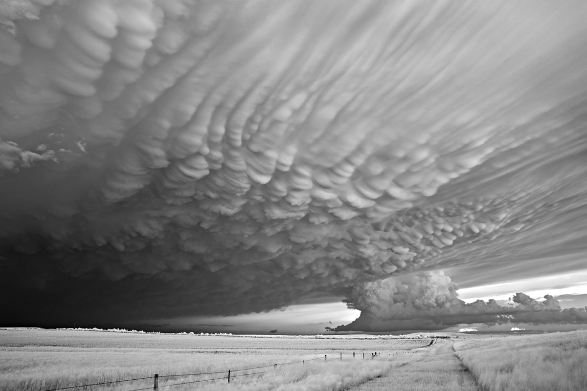

 *Mammatus.* "Bolton, Kansas." [#](https://www.theatlantic.com/photo/2018/03/the-2018-sony-world-photography-awards/554864/#img01)

© Mitch Dobrowner, USA, Shortlist, Professional, Natural World & Wildlife (2018 Professional competition), 2018 Sony World Photography Awards

 [Read more](https://www.theatlantic.com/photo/2018/03/the-2018-sony-world-photography-awards/554864/?utm_source=nextdraft&utm_medium=email#)

-
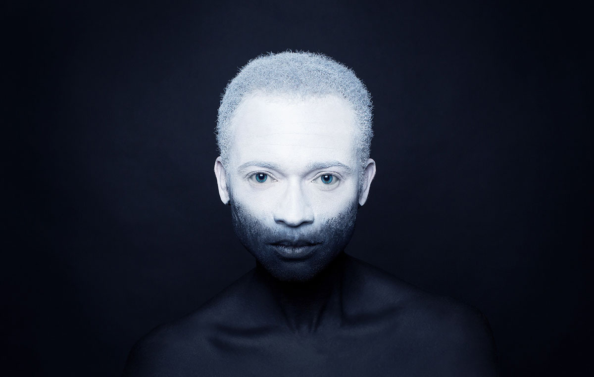

 *Black and White.* "This picture was taken in January of 2017 in a studio in Aathal, Switzerland, as part of a bodypainting session. Experimenting with color, different models were painted and then photographed. The aim of this portrait was to create a kind of still life with different levels and space for interpretation. What was important to me was the contrast between black and white and the reduction of the model (O'Neil Bürgi) to this contrast." [#](https://www.theatlantic.com/photo/2018/03/the-2018-sony-world-photography-awards/554864/#img02)

© Valentina Morrone, Italy, Shortlist, Open, Portraiture (Open competition), 2018 Sony World Photography Awards

 [Read more](https://www.theatlantic.com/photo/2018/03/the-2018-sony-world-photography-awards/554864/?utm_source=nextdraft&utm_medium=email#)

-
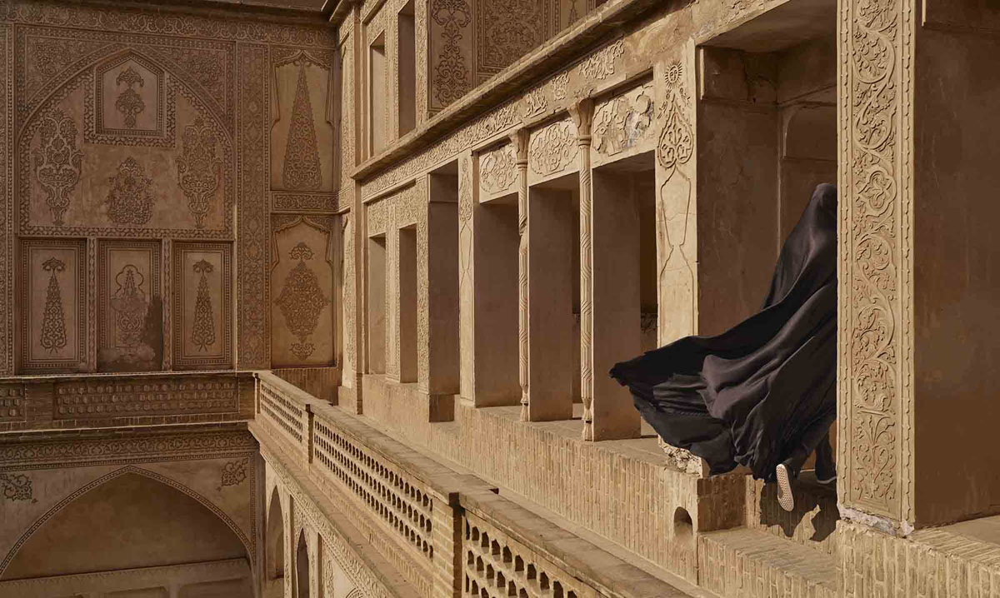

 *Iran - Kashan.* "Inside the traditional Abbāsi House (late 18th century)." [#](https://www.theatlantic.com/photo/2018/03/the-2018-sony-world-photography-awards/554864/#img03)

© Nicolas Boyer, France, Commended, Open, Travel (Open competition), 2018 Sony World Photography Awards

 [Read more](https://www.theatlantic.com/photo/2018/03/the-2018-sony-world-photography-awards/554864/?utm_source=nextdraft&utm_medium=email#)

-
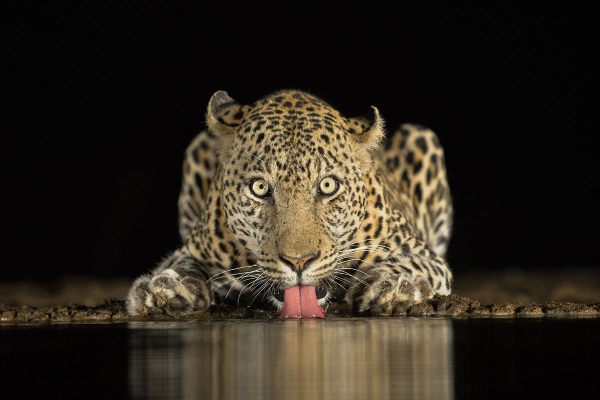

 *Eye to Eye.* "This image was made from an underground hide at Zimanga private game reserve in South Africa. I had spent about a month in total in this hide hoping for a big cat to come a drink, and only once was I privileged with the opportunity to capture this beautiful big male leopard cautiously coming to drink a mere three meters from me. Seeing and photographing these big cats is always so amazing, but being so close and at eye level with it is just on another level completely. [#](https://www.theatlantic.com/photo/2018/03/the-2018-sony-world-photography-awards/554864/#img04)

© Brendon Cremer, South Africa, Commended, Open, Wildlife (Open competition), 2018 Sony World Photography Awards

 [Read more](https://www.theatlantic.com/photo/2018/03/the-2018-sony-world-photography-awards/554864/?utm_source=nextdraft&utm_medium=email#)

-
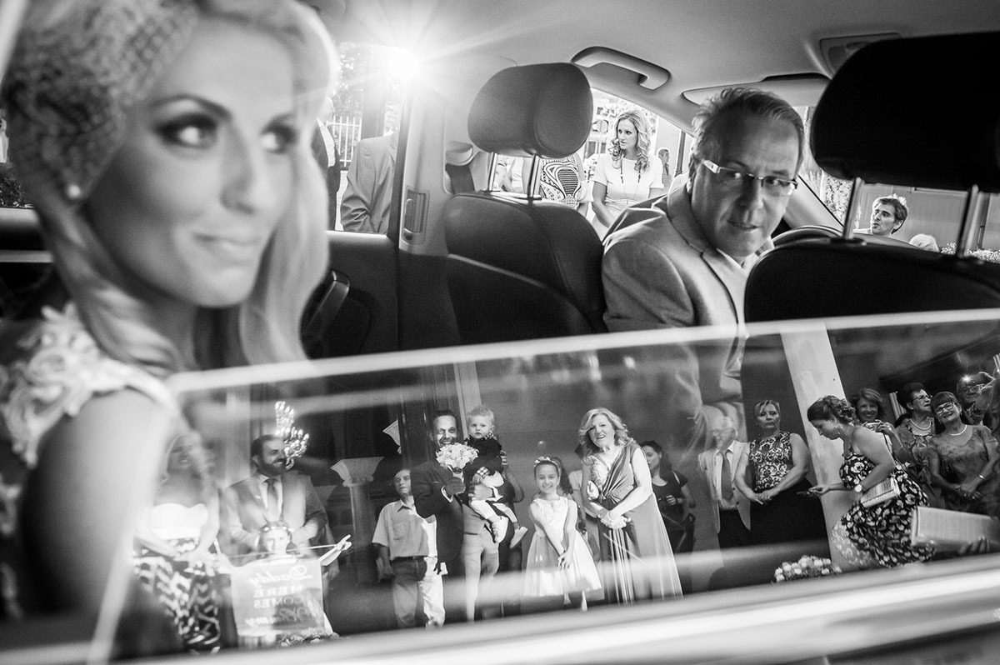

 *Vasiliki & Yiorgos.* "A multicomplex image created by one single capture in real time on a Greek wedding. If you can observe any scene in this image you can find different actions in time. All of them combine one emotion: the joy of that day." [#](https://www.theatlantic.com/photo/2018/03/the-2018-sony-world-photography-awards/554864/#img05)

© Marios Kourouniotis, Greece, Commended, Open, Culture (Open competition), 2018 Sony World Photography Awards

 [Read more](https://www.theatlantic.com/photo/2018/03/the-2018-sony-world-photography-awards/554864/?utm_source=nextdraft&utm_medium=email#)

-
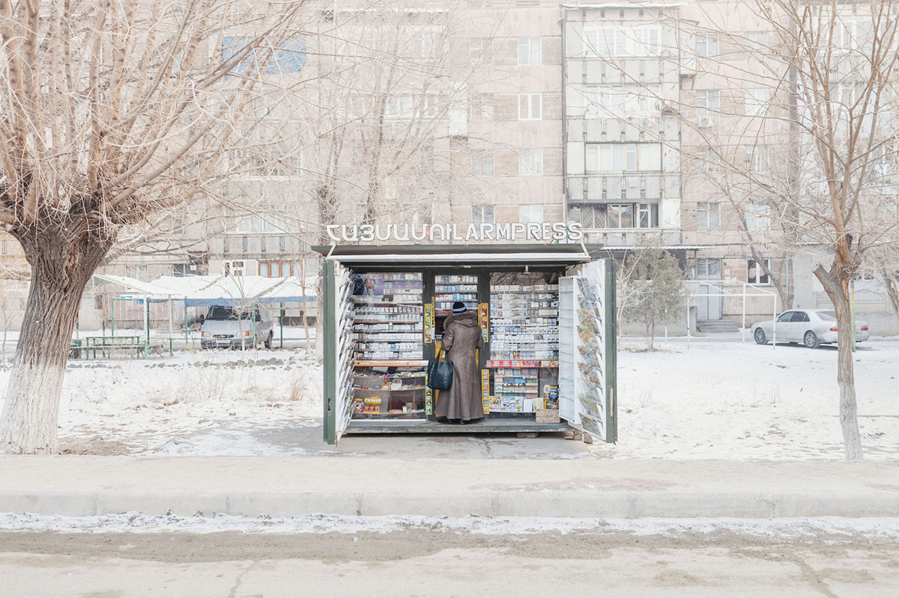

From the series *Suspension.* "About 20 miles from Armenia's capital city of Yerevan sits the antiquated Metsamor nuclear power plant. The plant (located in a town also called Metsamor) has long been a cause for concern for at least two reasons: It was built without containment vessels, and it sits in a seismic zone. In 2011, National Geographic even suggested that it might be the world’s most dangerous nuclear plant. I visited the town in January to document its way of life. What I found was 10,000 people (1,000 who still work at the plant) living in a town of old Soviet buildings, caught in suspension between doubts and fears, between poverty and survival, between life and death." [#](https://www.theatlantic.com/photo/2018/03/the-2018-sony-world-photography-awards/554864/#img06)

© Stefano Morelli, Italy, Shortlist, Professional, Contemporary Issues (Professional competition), 2018 Sony World Photography Awards

 [Read more](https://www.theatlantic.com/photo/2018/03/the-2018-sony-world-photography-awards/554864/?utm_source=nextdraft&utm_medium=email#)

-
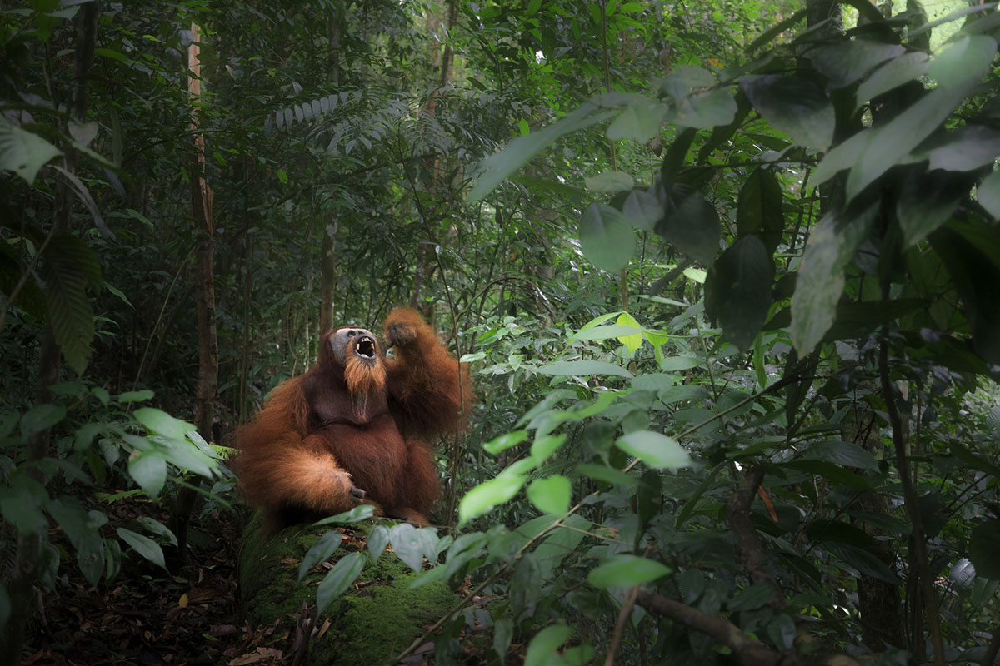

 *Sumatran orangutan.* "A wild Sumatran orangutan depicted in Gunung Leuser primary forest in Northern Sumatra in August of 2017. The image was taken during a five-day trek in the mountains, deep in the heart of the national park to encounter the population of wild orangutans that inhabits the area. Unlike the Bornean orangutan, the Sumatran orangutan rarely descends from trees, as tigers coexist in the same habitat. Unexpectedly, this big male was curious about us and decided to climb down its tree and stop a few meters away to investigate." [#](https://www.theatlantic.com/photo/2018/03/the-2018-sony-world-photography-awards/554864/#img07)

© Marco Gaiotti, Italy, Shortlist, Open, Wildlife (Open competition), 2018 Sony World Photography Awards

 [Read more](https://www.theatlantic.com/photo/2018/03/the-2018-sony-world-photography-awards/554864/?utm_source=nextdraft&utm_medium=email#)

-
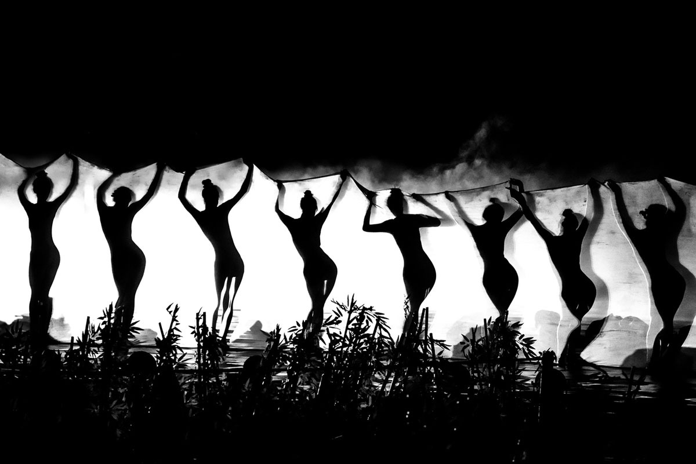

 *Silhouettes.* "On a trip to Libo County, located in the remote southeastern corner of Qiannan Buyei and Miao Autonomous Prefecture in southern China, a night performance along the Zhanjiang river was offered to visitors. This nice contra light scene with semi-transparent sheets is even better in monochromatic version." [#](https://www.theatlantic.com/photo/2018/03/the-2018-sony-world-photography-awards/554864/#img08)

© Stojan Gorup, Slovenia, Commended, Open, Travel (Open competition), 2018 Sony World Photography Awards

 [Read more](https://www.theatlantic.com/photo/2018/03/the-2018-sony-world-photography-awards/554864/?utm_source=nextdraft&utm_medium=email#)

-
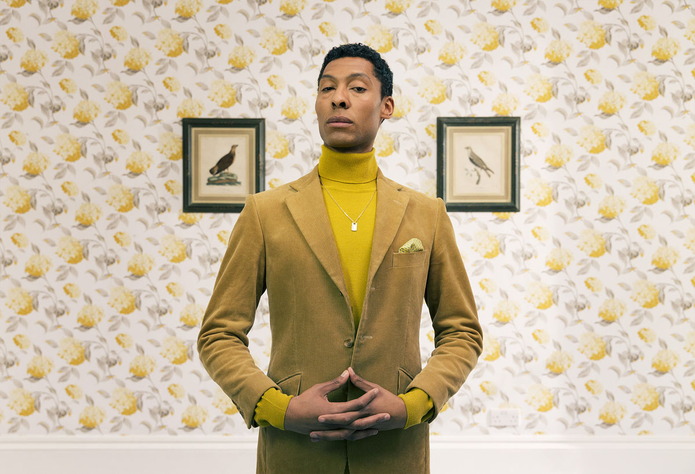

 *Drawers.* "The stylish Emile shot for Paypal looking suitably aloof and hoity on a set with just a little nod towards Wes Anderson." [#](https://www.theatlantic.com/photo/2018/03/the-2018-sony-world-photography-awards/554864/#img09)

© Nick Dolding, United Kingdom, Shortlist, Open, Portraiture (Open competition), 2018 Sony World Photography Awards

 [Read more](https://www.theatlantic.com/photo/2018/03/the-2018-sony-world-photography-awards/554864/?utm_source=nextdraft&utm_medium=email#)

-
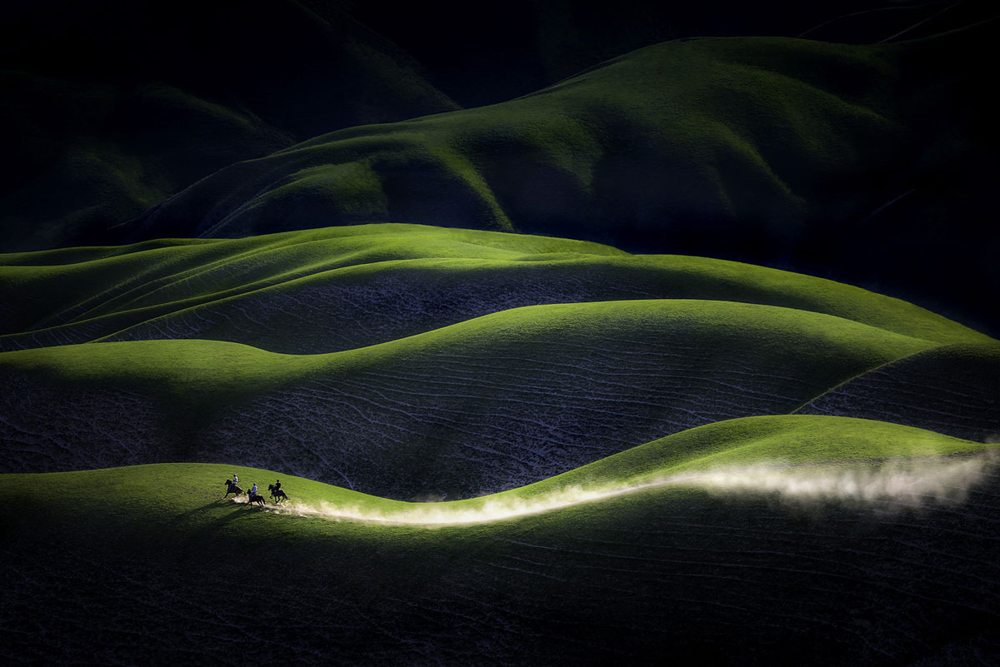

 * Human Grassland.* "Photo taken in Xinjiang, China." [#](https://www.theatlantic.com/photo/2018/03/the-2018-sony-world-photography-awards/554864/#img10)

© Kaan Yuan Chiam, Malaysia, Commended, Open, Landscape & Nature (2018 Open competition), 2018 Sony World Photography Awards

 [Read more](https://www.theatlantic.com/photo/2018/03/the-2018-sony-world-photography-awards/554864/?utm_source=nextdraft&utm_medium=email#)

-
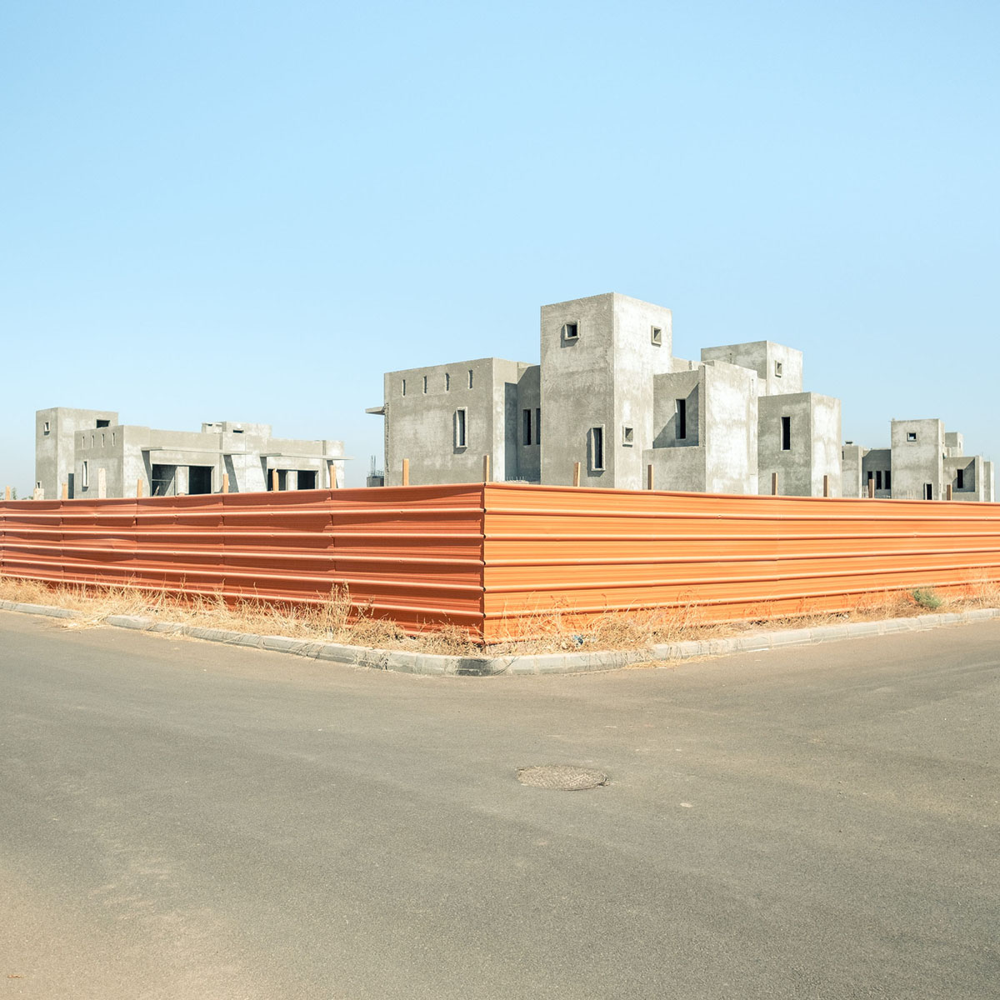

 *Tassoultante.* "Riad Mirage Club (Morocco, 2017) is the fifth volume of the long-term and ongoing documentary project 'Future Rust, Future Dust (2016 - ),' which aims to analyze the urban and architectural impact of the last world financial crisis and the burst of the real estate bubble. Through a 'concrete tsunami' exploration of ghost cities, aborted tourism projects, unused infrastructures, or roads leading to nowhere, this project plunges us into a post-apocalyptic atmosphere, vestige of this modern age mixing economic failures, corrupt elected officials, megalomaniac investors and dreams of home-ownership. Riad Mirage Club reports the impact of the 2008 financial crisis which directly affected Morocco. Marrakech, main touristic destination, experienced an outbreak of property programs, characterized by a strong demand and soaring prices, in an unregulated area where everyone could become a promoter. Today, these concrete skeletons continue to dot the semi-desert landscape around Marrakech." [#](https://www.theatlantic.com/photo/2018/03/the-2018-sony-world-photography-awards/554864/#img11)

© Loïc Vendrame, France, Shortlist, Professional, Architecture (Professional competition), 2018 Sony World Photography Awards

 [Read more](https://www.theatlantic.com/photo/2018/03/the-2018-sony-world-photography-awards/554864/?utm_source=nextdraft&utm_medium=email#)

-
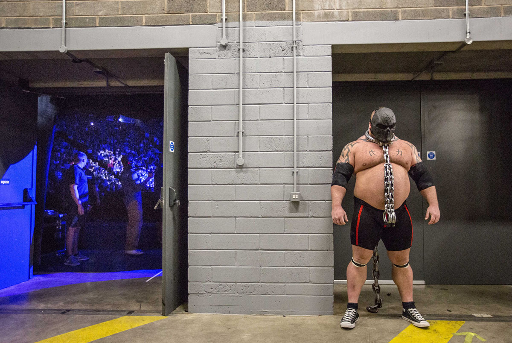

 *Eddie "The Beast" Hall.* "Eddie Hall is the strongest man in the world. He has won UK's Strongest Man six times in a row and this year became the first Brit to win World's Strongest Man since Geoff Capes in 1985. But winning these titles is certainly no easy task. The 30-stone (420 pound) athlete consumes an astonishing 12,500 calories a day and has to undergo excruciating physiotherapy on a regular basis. His training regime consists of four-hour gym sessions through to swimming and pulling cars. I followed Eddie on and off for three weeks, documenting what it takes to be the strongest man in the world." [#](https://www.theatlantic.com/photo/2018/03/the-2018-sony-world-photography-awards/554864/#img12)

© Rick Findler, United Kingdom, Shortlist, Professional, Sport (Professional competition), 2018 Sony World Photography Awards

 [Read more](https://www.theatlantic.com/photo/2018/03/the-2018-sony-world-photography-awards/554864/?utm_source=nextdraft&utm_medium=email#)

-

 *Mountain Road.* "Time of shooting: June 21, 2017. Location: Jingtai County, Baiyin City, Gansu Province, China. This is a section of mountain road leading to the Yellow Stone Forest. The terrain is steep and can only be seen from the sky. It also reflects the geological landscape in western China. It's the perfect manifestation of human beings in their natural existence." [#](https://www.theatlantic.com/photo/2018/03/the-2018-sony-world-photography-awards/554864/#img13)

© Li Wang, China, Commended, Open, Travel (Open competition), 2018 Sony World Photography Awards

 [Read more](https://www.theatlantic.com/photo/2018/03/the-2018-sony-world-photography-awards/554864/?utm_source=nextdraft&utm_medium=email#)

-
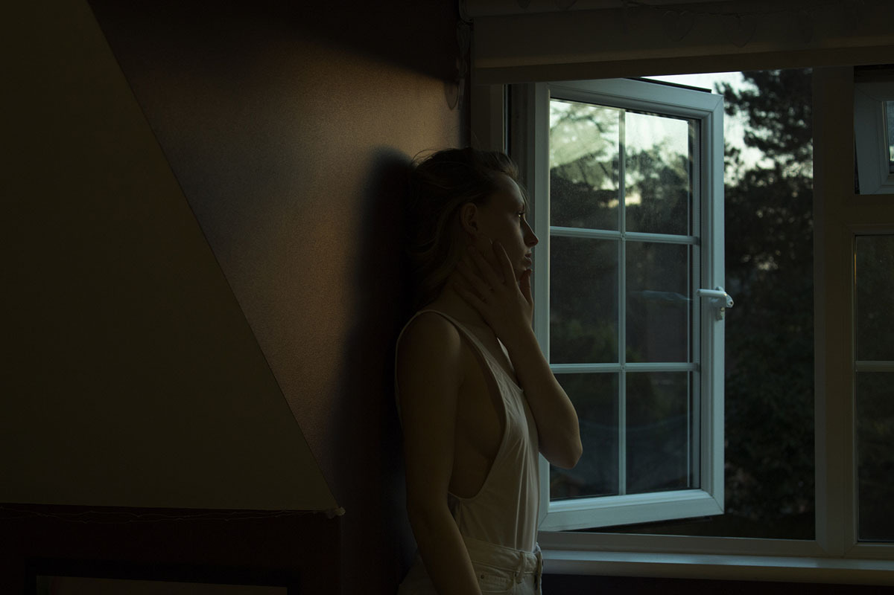

 *Window.* "This was taken on December 14, 2017, in my bedroom at sunset. It is a self portrait and was taken using a self-timer of 10 seconds. I used a tripod and some baking paper to soften the lighting. I took this to express the isolation and the need for room to breathe due to anxiety, a personal struggle for me." [#](https://www.theatlantic.com/photo/2018/03/the-2018-sony-world-photography-awards/554864/#img14)

© Mia Wignall, United Kingdom, Shortlist, Youth, Your Environment (2018 Youth competition), 2018 Sony World Photography Awards

 [Read more](https://www.theatlantic.com/photo/2018/03/the-2018-sony-world-photography-awards/554864/?utm_source=nextdraft&utm_medium=email#)

-
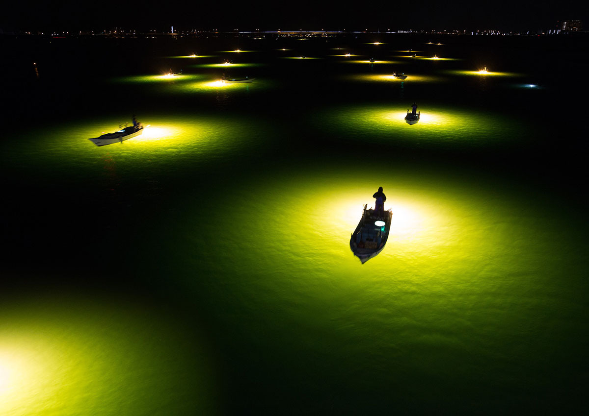

 *The Fisherman's Microcosm.* "Traditional Shirasu eel fishing in the river. Fisherman get the Shirasu eel gathered in the light of the boat." [#](https://www.theatlantic.com/photo/2018/03/the-2018-sony-world-photography-awards/554864/#img15)

© Nori Yuasa, Japan, Commended, Open, Culture (Open competition), 2018 Sony World Photography Awards

 [Read more](https://www.theatlantic.com/photo/2018/03/the-2018-sony-world-photography-awards/554864/?utm_source=nextdraft&utm_medium=email#)

-

 *Crinoid & Red Gorgonian.* "This photograph was captured during a fish survey at Manado, Indonesia, in November of 2017. Since Indonesia is located in the Coral Triangle, the sea life in this region is very abundant. This red gorgonian was so colorful and beautiful that it attracted my attention. The crinoid around it helps to provide a good focal point. To preserve the vibrant color at such depth, I needed to use an external strobe." [#](https://www.theatlantic.com/photo/2018/03/the-2018-sony-world-photography-awards/554864/#img16)

© Jet Long, USA, Commended, Open, Landscape & Nature (2018 Open competition), 2018 Sony World Photography Awards

 [Read more](https://www.theatlantic.com/photo/2018/03/the-2018-sony-world-photography-awards/554864/?utm_source=nextdraft&utm_medium=email#)

-
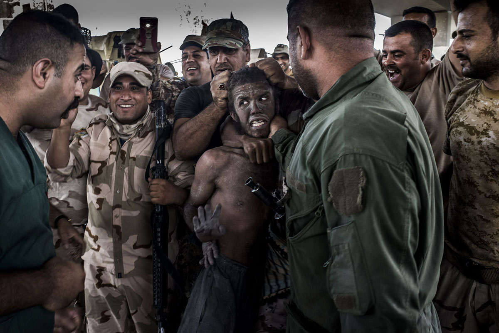

From the series *Near Dark - The Battle for Mosul.* "While the liberation of Mosul was complete, the war against ISIS continued. In the last months of the battle for control of the city, Iraqi forces clashed with Islamic State militants in the rubble of the narrow lanes of the Old City of west Mosul—fighting house to house. From the mass graves and burning oil fields of northern Iraq to the prisons and slave markets of Mosul, the shared testimony of Iraqis who have fled Islamic State occupation are unimaginable in their cruelty. Islamic State militants move among civilians planning future attacks. Even with the full liberation of Mosul, the threat Islamic State poses to the future stability of Iraq–and Syria and beyond–remains. It is not possible to bomb this fierce philosophy into submission–the fight is far from over." [#](https://www.theatlantic.com/photo/2018/03/the-2018-sony-world-photography-awards/554864/#img17)

© Martyn Aim, New Zealand, Shortlist, Professional, Current Affairs & News (Professional competition), 2018 Sony World Photography Awards

 [Read more](https://www.theatlantic.com/photo/2018/03/the-2018-sony-world-photography-awards/554864/?utm_source=nextdraft&utm_medium=email#)

-
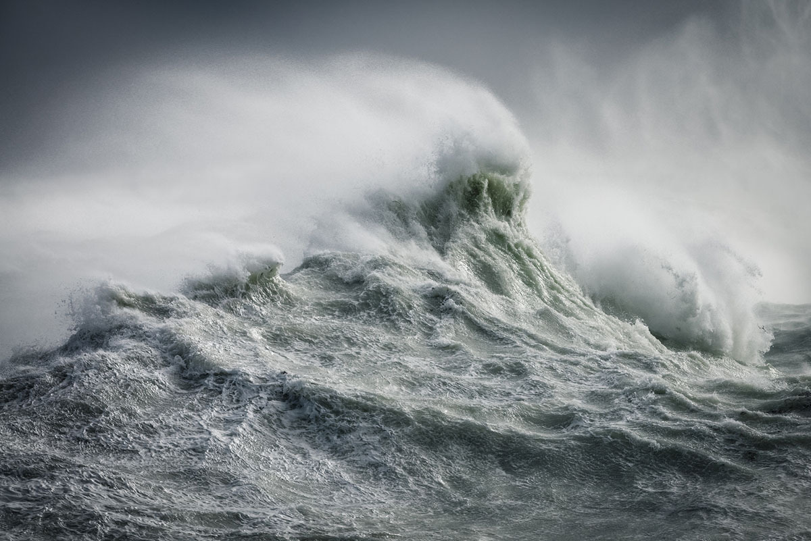

 *Niobe.* "A 'Siren' storm wave, part of a series of waves named after mythological beings. Niobe was captured during Storm Brian at Newhaven in East Sussex. 'Sirens' is an ongoing portfolio of storm waves captured on the UK’s south coast. A childhood afloat and a love of maritime mythology have come together in these portraits of monstrous waves named after mythological creatures. 'Niobe' was the Greek archetype of the mourning mother (I see children/wavelets on her 'shoulder')." [#](https://www.theatlantic.com/photo/2018/03/the-2018-sony-world-photography-awards/554864/#img18)

© Rachael Talibart, United Kingdom, Shortlist, Professional, Landscape (Professional competition), 2018 Sony World Photography Awards

 [Read more](https://www.theatlantic.com/photo/2018/03/the-2018-sony-world-photography-awards/554864/?utm_source=nextdraft&utm_medium=email#)

-
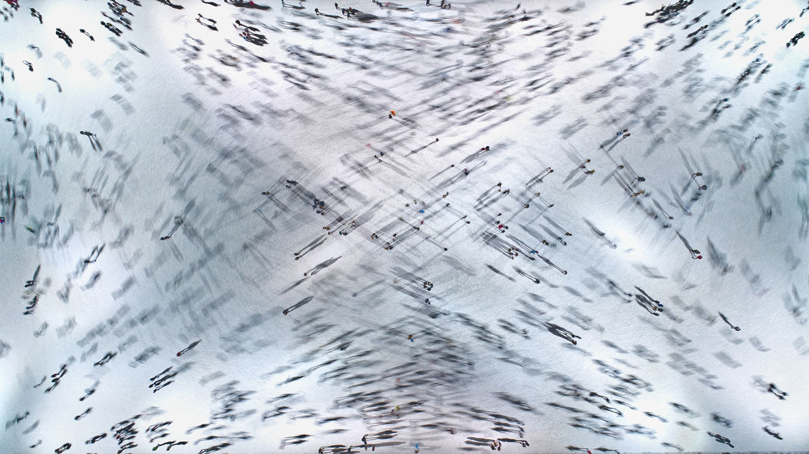

 *People Swirling on Ice Court.* "On Budapest's oldest ice court, the City Park Ice Rink, which is lit with four reflectors, some skaters stand and chat while others swirl around. Photographed on December 30, 2017, in Budapest, Hungary." [#](https://www.theatlantic.com/photo/2018/03/the-2018-sony-world-photography-awards/554864/#img19)

© Milan Radisics, Hungary, Shortlist, Open, Motion (Open competition), 2018 Sony World Photography Awards

 [Read more](https://www.theatlantic.com/photo/2018/03/the-2018-sony-world-photography-awards/554864/?utm_source=nextdraft&utm_medium=email#)

-
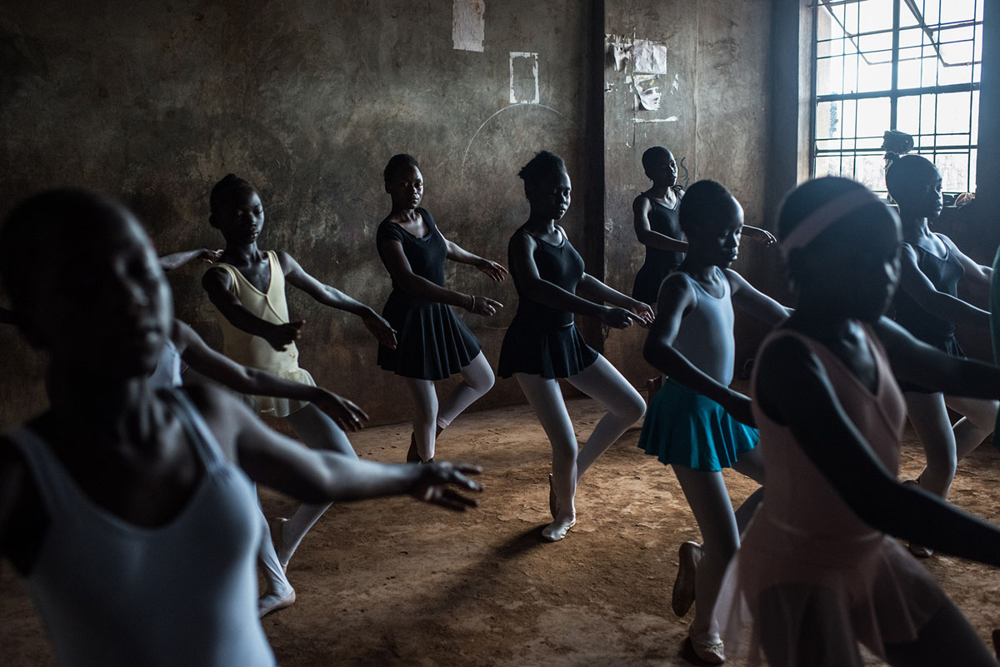

 *Ballet.* "Every Wednesday at Spurgeons Academy, a school in the middle of the indecipherable maze of Kibera's narrow streets and alleys, students take the chairs and benches out of a classroom and sweep the floor. The school uniforms are switched to bright-colored clothes. When teacher Mike Wamaya enters the classroom, the students get into position and place one hand on the concrete wall as though it were a ballet bar. Classical music plays out of a small portable speaker, and the class begins. The ballet class is part of Annos Africa and One Fine Day's charity activities in slum areas around Kenya. In Nairobi they work together with two schools in Kibera and one school in Mathare, another slum closer to the city center. The dance is a way for the children to express themselves and it strengthens [both] their confidence in life and a belief that they can become something great. Some of the children are now dancing several days a week in a studio called 'Dance Center Kenya' in a upper-class area of Nairobi and living in a boarding school, so thanks to their talent they have taken themselves away from the harsh conditions in the slum." [#](https://www.theatlantic.com/photo/2018/03/the-2018-sony-world-photography-awards/554864/#img20)

© Fredrik Lerneryd, Sweden, Shortlist, Professional, Contemporary Issues (Professional competition), 2018 Sony World Photography Awards

 [Read more](https://www.theatlantic.com/photo/2018/03/the-2018-sony-world-photography-awards/554864/?utm_source=nextdraft&utm_medium=email#)

-
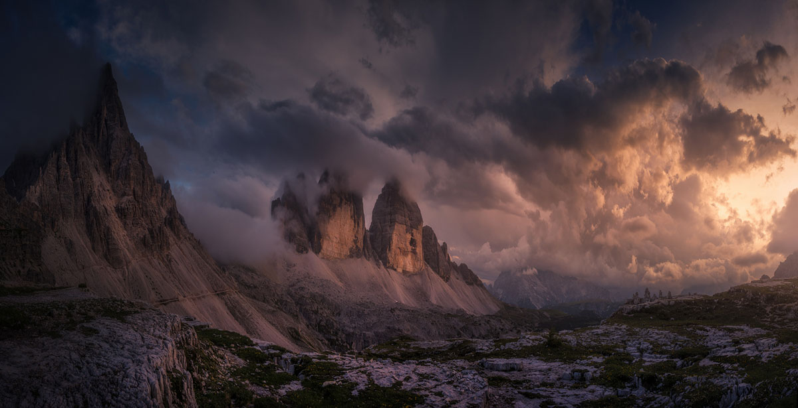

 *Crazy Sky.* "This panorama was taken last summer in the Italian Alps. It shows the Tre Cime di Lavaredo during a crazy sunset with some beautiful light and clouds." [#](https://www.theatlantic.com/photo/2018/03/the-2018-sony-world-photography-awards/554864/#img21)

© Carlos F. Turienzo, Spain, Commended, Open, Landscape & Nature (2018 Open competition), 2018 Sony World Photography Awards

 [Read more](https://www.theatlantic.com/photo/2018/03/the-2018-sony-world-photography-awards/554864/?utm_source=nextdraft&utm_medium=email#)

-
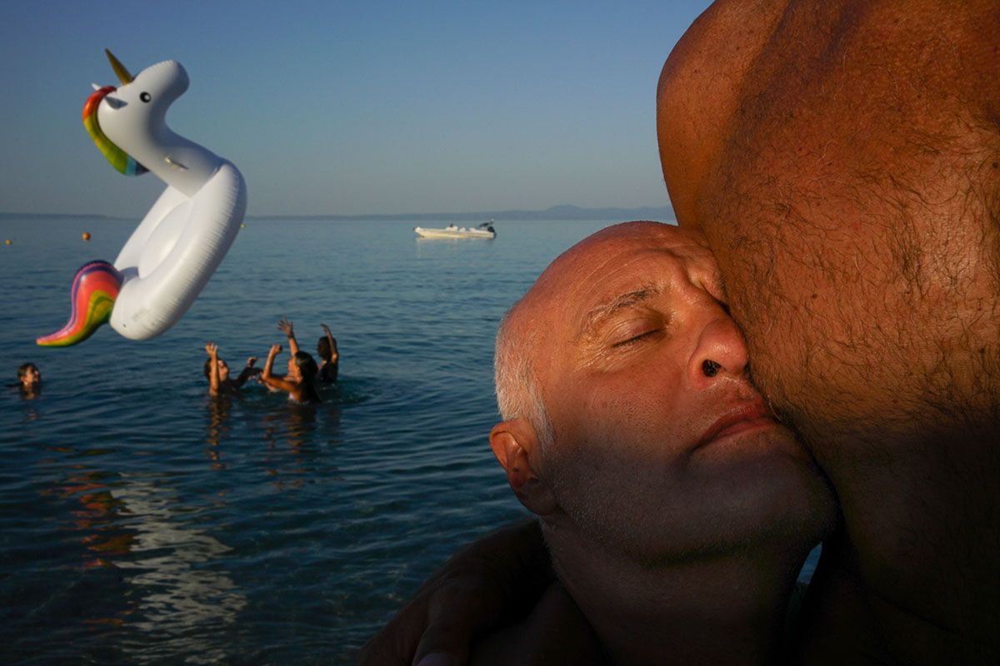

 *In a World of Unicorns.* "The ancient Greeks didn’t write obituaries. They only asked one question after someone died: 'Did he have passion?'" [#](https://www.theatlantic.com/photo/2018/03/the-2018-sony-world-photography-awards/554864/#img22)

© Niki Gleoudi, Greece, Shortlist, Open, Street Photography (Open competition), 2018 Sony World Photography Awards

 [Read more](https://www.theatlantic.com/photo/2018/03/the-2018-sony-world-photography-awards/554864/?utm_source=nextdraft&utm_medium=email#)

-
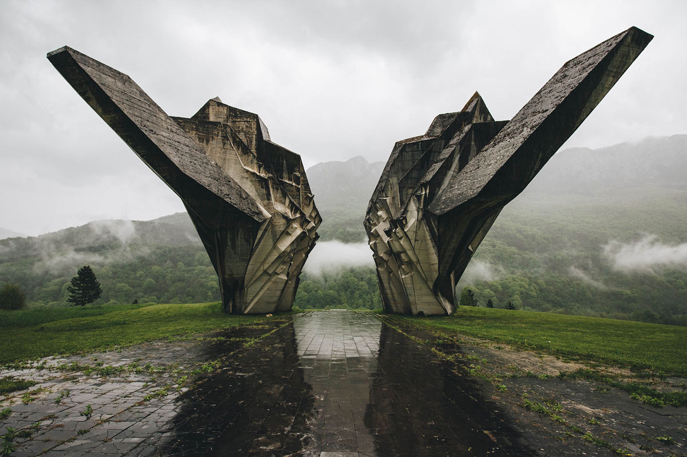

 *Tjentiste.* "Spomenik Tjentiste in Bosnia and Herzegovina is the monument of the Second World War. The photo was taken during a journey in May of 2017 in the territory of the former Yugoslavia." [#](https://www.theatlantic.com/photo/2018/03/the-2018-sony-world-photography-awards/554864/#img23)

© Anastasia Riakovskaia, Russian Federation, Shortlist, Professional, Architecture (Professional competition), 2018 Sony World Photography Awards

 [Read more](https://www.theatlantic.com/photo/2018/03/the-2018-sony-world-photography-awards/554864/?utm_source=nextdraft&utm_medium=email#)

-
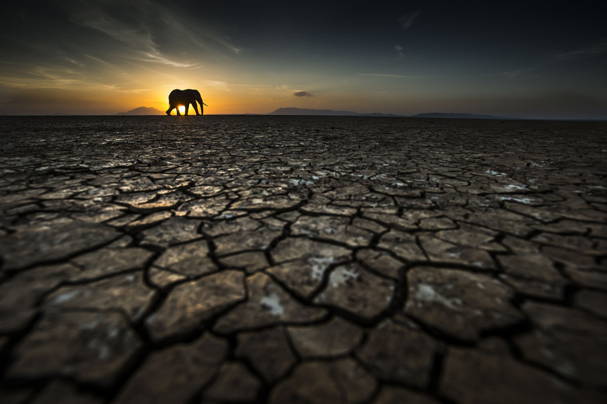

 *Thirst.* "Increasingly over the last few years, the rain seasons have become shorter and shorter and the droughts more prolonged. Elephants travel from afar to seek refuge under Mt. Kilimanjaro, whose snowmelt gives life to the lush swamps within Amboseli Park. Elephants traveling into the park from the North West have to cross Lake Amboseli, which is bone dry unless there are extended rains. In 2016, the early rains did not arrive and everyday throughout my stay I would base myself on this lakebed looking for large shapes to be crossing into the park. On this particular evening we spotted a lone bull making its way across the cracked earth. I wanted to include as much of the texture in the foreground as possible to emphasis the severe drought and to signify the reason these mammals are traveling so far to reach the foothills of the mountain." [#](https://www.theatlantic.com/photo/2018/03/the-2018-sony-world-photography-awards/554864/#img24)

© Tom Way, United Kingdom, Shortlist, Open, Wildlife (Open competition), 2018 Sony World Photography Awards

 [Read more](https://www.theatlantic.com/photo/2018/03/the-2018-sony-world-photography-awards/554864/?utm_source=nextdraft&utm_medium=email#)

-
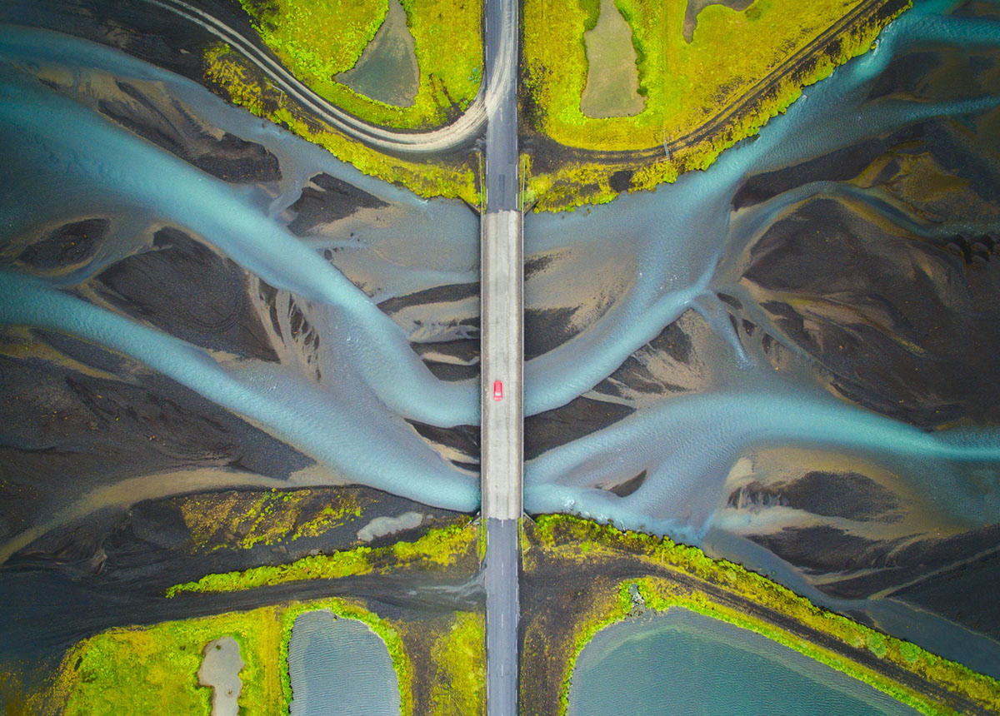

 *Patterns of Glacial River.* "Aerial view of a glacial river in Iceland. While crossing the bridge, I noticed some patterns in the water and wondered how it would look from the sky. I stopped the car at a turnout after crossing the bridge and flew my drone to capture this image. I included the bridge and the car to give an idea of the scale. This river flows to the ocean and becomes part of the sea." [#](https://www.theatlantic.com/photo/2018/03/the-2018-sony-world-photography-awards/554864/#img25)

© Manish Mamtani, India, Shortlist, Open, Travel (Open competition), 2018 Sony World Photography Awards

 [Read more](https://www.theatlantic.com/photo/2018/03/the-2018-sony-world-photography-awards/554864/?utm_source=nextdraft&utm_medium=email#)

Subscribe

Support 160 years of independent journalism.

 Name  Address 1  Address 2  City  Zip Code  Country  Email Address

 [Fraud Alert regarding The Atlantic](https://www.theatlantic.com/personal/archive/2013/10/fraud-alert-regarding-i-the-atlantic-i/280278/)

Newsletters+

 The Atlantic

   *The Atlantic* Daily

  This Week

  This Month

  New Photo Galleries

  Top Videos This Week

  Politics & Policy Daily

 CityLab
  Today’s Top Stories

  This Week's Most Popular Stories

   *I want to receive updates from partners and sponsors.*

 Email Address

TheAtlantic.com Copyright (c) 2018 by The Atlantic Monthly Group. All Rights Reserved.