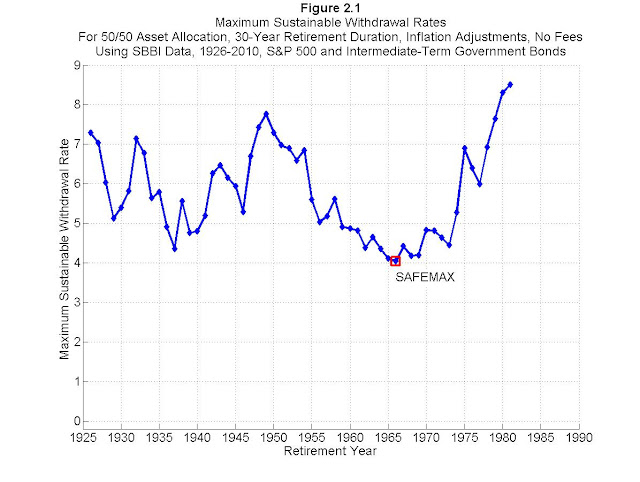

The 4% Rule: The Easy Answer to “How Much Do I Need for Retirement?”

 May 29, 2012[295 comments](https://www.mrmoneymustache.com/2012/05/29/how-much-do-i-need-for-retirement/#comments)

# The 4% Rule: The Easy Answer to “How Much Do I Need for Retirement?”

In the world of early retirees, we have a concept that goes by names like “The 4% rule”, or “The 4% Safe Withdrawal Rate”, or simply “The SWR.”

As with all things financial, it’s the subject of plenty of controversy, and we’ll get to that (and then punch it flat) later. But for now, for those new to the concept, let’s define the **Safe Withdrawal Rate:**

****

**The Safe Withdrawal Rate is the maximum rate at which you can spend your retirement savings, such that you don’t run out in your lifetime.**

That sounds nice and simple, but many people consider it an unpredictable thing to nail down.

After all, you don’t know what sort of rollercoaster rides the economy will take your retirement savings on, and you also don’t know what rate of inflation will persist through your lifetime. Will a box of eggs cost $6.00 a dozen when you’re 65, or will it be closer to $60? So how can we possibly know how much money we will need to live on in retirement?

The answers you get to this question vary widely.

Financial beginners (about 95% of the population) tend to randomly just throw out a number between 5-100 million dollars.

Financial advisers who aren’t Mustachians will tell you that it depends on your pre-retirement *income*, (with the implicit assumption that you are spending most of what you earn) and the end answer will be somewhere between 2 and 10 million.

Financial Independence enthusiasts will have the closest-to-correct answer: **Take your annual *****spending*****, and multiply it by somewhere between 20 and 30.** That’s your retirement number.

If you use the number 25, you’re implicitly using a 4% Safe Withdrawal Rate, which is my own personal favorite number.

So where does this magic number come from?

At the most basic level, you can think of it like this: imagine you have your ‘stash of retirement savings invested in stocks or other assets. They pay dividends and appreciate in price at a total rate of 7% per year, before inflation. Inflation eats 3% on average, leaving you with 4% to spend reliably, forever.

I can already hear a chorus of whines and rattling keyboards starting up, so let’s qualify that statement. I admit it: that is the idealized and simplified version.

In reality, stocks go up and down every year, and so does inflation. Over a long multi-decade period like the gigantic retirement you and I will be enjoying, enormous things have happened in the past. The Great Depression. The World Wars, Vietnam, and the Cold War. The abandonment of the gold standard for US currency and years of 10%+ inflation and 20%+ interest rates. More recently, the great financial crash and a slicing in half of of real estate and stock values.

If you happened to retire in 1921 on a mostly-stock nest egg, you would have experienced an enormous stock run-up for the first eight years of your retirement. You’d be so rich by the time the 1929 crash and the Great Depression hit, that you’d barely notice the trouble in the streets from your rosewood-paneled tea room.

On the other hand, if you retired in early 2000 while holding stocks, you saw an immediate and huge drop in your savings along with low dividend yields – and your ‘stash may be have had some scary times in the early days, and again around 2009. Would you still have any money left today?

In other words – the sequencing of booms and crashes matters. Ideally, you want to reach your magic retirement number in a time of nice, reasonable stock prices, just before the start of another long boom so that your retirement starts off on a good foot. But you can’t predict these things in advance. So again, how do we find the right answer?

Luckily, various Early Retirement Ninjas have done the work for us. They analyzed what *would have happened* for a hypothetical person who spent 30 years in retirement between the years 1925-1955. then 1926-1956, 1927-1957, and so on.

They gave this imaginary retiree a mixture of 50% stocks and 50% 5-year US government bonds, a fairly sensible [asset allocation](https://www.mrmoneymustache.com/2012/02/17/book-review-the-intelligent-asset-allocator/). Then they forced the retiree to spend an ever-increasing amount of his portfolio each year, starting with an initial percentage, then indexed automatically to inflation as defined by the Consumer Price Index (CPI).

This simple but important series of calculations was called the [Trinity Study](http://en.wikipedia.org/wiki/Trinity_study),  and since then it has been updated, tweaked, and reported on, and it’s still the subject of lots of debate today. [Wade Pfau](https://retirementresearcher.com/the-4-rule-and-the-search-for-a-safe-withdrawal-rate/) is one reasonable voice in the industry, and he created the following useful chart showing what the maximum safe withdrawal rate would have been for various retirement years:

As you can see, the 4% value is actually somewhat of a worst-case scenario in the 65 year period covered in the study. In many years, retirees could have spent 5% or more of their savings each year, and still ended up with a growing surplus.

This brings me to a critical point: this study defines “success” as not going broke during a 30-year test period. To people like you and me who will enjoy 60-year retirements, that would not be successful – we want our money to last much longer than 30 years.

Luckily, the math in this case is pretty interesting: there is very little difference between a 30-year period, and an *infinite year *period, when determining how long your money will last. It’s much like a 30-year mortgage, where almost all of your payment is interest. Drop your payment by just $199 per month, and suddenly you’ve got a thousand-year mortgage that will literally take you 1000 years to pay off. Increase the payment by a few hundred, and you have a fifteen year payoff!

In other words, ***above 30 years, the length of your retirement barely affects the safe withdrawal rate calculations.***

So far, we’re liking the 4% rule quite a bit, right? But yet whenever I mention it, I get complaints. Let’s review a few of them:

- The trinity study is based on a prosperity anomaly: the United States during its boom years. You can’t project good times like that into the future, because we’re just about to enter the Doom Years!
- Economic growth and stock appreciation was all based on cheap fossil fuels. How will this all look after [Peak Oil](https://www.mrmoneymustache.com/2012/11/05/mmm-interviews-ere-on-peak-oil/) hits us!?
- You can’t take a one-size-fits-all rule and apply it to something as varied as an economy and an individual’s life! My [health care](https://www.mrmoneymustache.com/2012/11/01/our-new-237-per-month-health-insurance-plan/) costs could go up! Hyperinflation could strike!
- Even at a 4% withdrawal rate, there’s still a chance of portfolio failure. That means I’ll be flat broke and out on the street in my old age. I recommend doubling your savings, and going for a 2% SWR instead because there’s never been a failure in that scenario!
- This is all wrong! Waaah, waaah!

That’s all well and good. While there are solid economic analyses that I believe can out-argue the points above, I’m not patient or clever enough to re-create them here. Pessimists are free to enjoy their pessimism and even write about it on their own blogs.

Instead of debating unprovable points like those above, we can completely squash them with our own much more powerful list of points:

The trinity study assumes a retiree will:

- never earn any more money through part-time work or self-employment projects
- never collect a single dollar from social security or any other pension plan
- never adjust spending to account for economic reality like a huge recession
- never substitute goods to compensate for inflation or price fluctuation (vacation in a closer place one year during  an oil price spike, or switch to almond milk in the event of a dairy milk embargo).
- never collect any inheritance from the passing of parents or other family members
- and never do what most old people tend to do according to studies – spend less as they age

In short, they are assuming a bunch of drooling Complete Antimustachians. You and I are Mustachians, meaning we have far more flexibility in our lifestyles. In short, we have designed a [Safety Margin](https://www.mrmoneymustache.com/2011/10/17/its-all-about-the-safety-margin/) into our lives that is wider than the average person’s entire retirement plan.

So now that we’re feeling good about the 4% rule again, let’s bring the point home:

Far from being a risky proposition, planning for 4% Safe Withdrawal rate is actually the most conservative method of retirement saving I could possibly recommend.

To apply it in real life, just take your annual spending level, and multiply it by 25. That’s how much you need to retire, at the most. A $25,000 spender like me needs $625,000. I’ve got more than that, plus various safety margins in the lifestyle, so all is good.

Without undue risk, and as long as you have skills that can be used to earn money eventually in the future (hint: you do), I can even advocate an SWR of 5%. In other words, get your expenses down to $25k, and you can quit your job on $500k or less. Then you can use the methods described in [First Retire, then Get Rich](https://www.mrmoneymustache.com/2012/05/14/first-retire-then-get-rich/)to gradually increase your safety margin (and effectively decrease your withdrawal rate) as you age.

So there’s no need to debate. 4% is a perfectly good answer, which means 25 times your annual expenses is a perfectly good goal to save for. Along the way, you might find your annual expenses melting away, which makes things ever-more-attainable (as shown in the [shockingly simple math behind early retirement](https://www.mrmoneymustache.com/2012/01/13/the-shockingly-simple-math-behind-early-retirement/) post). But worry, you must not.

And if you’re ready to play with the numbers even further, check out the [FIREcalc](http://www.firecalc.com/index.php?wdamt=25000&PortValue=500000&term=60&ss1=8000&ssy1=2043&ss2=0&ssy2=2027&signwd1=-&chwd1=5000&chyr1=2013&wd1infl=adj&signwd2=%2B&chwd2=0&chyr2=2017&wd2infl=adj&signwd3=%2B&chwd3=0&chyr3=2021&wd3infl=adj&holdyears=2012&preadd=0&inflpick=4&override_inflation_rate=3.0&SpendingModel=bernicke&age=37&pctlastyear=0&infltype=PPI&fixedinc=Commercial+Paper&user_bonds=4.0&InvExp=0.18&monte=history&StartYr=1871&fixedchoice=LongInterest&pctEquity=75&mix1=10&mix2=10&mix3=10&mix4=40&mix5=40&mix6=10&mix7=15&mix8=5&user_growth=10&user_inflation=3.0&monte_growth=10&monte_sd=10&monte_inflation=3.00&signlump1=%2B&cashin1=0&cashyr1=2015&signlump2=%2B&cashin2=0&cashyr2=2025&signlump3=%2B&cashin3=0&cashyr3=2030&process=survival&showyear=1960&delay=10&goal=95&portfloor=0&callprocess=Submit&FIRECalcVersion=3.0&) website. It’s basically like owning your own Trinity Study machine, except you can tweak variables (look at the tabs at the top of the page). In the link provided, I used this data:

- 500,000 portfolio
- 25,000 annual spending (5% withdrawal rate).

All alone, a plan like that over 60 years of retirement only has a 45% success rate, historically speaking.

But if you make adjustments which include:

- $8,000 per year of social security starting about 25 years from now
- “Bernicke’s Reality Retirement plan” of dropping spending slightly with age
- Just $3,000 per year in fooling-around income

You’re already at an over 90% success rate. Another hundred or two dollars per month and you have a 100% chance of success, even without invoking many of my other bullet points above.

So that, at last is the long-awaited Safe Withdrawal Rate article.

In the hands of financial infants, the rule is dangerous and scary. But in the hands of Mustachians, nothing is scary. Planning for a 4% withdrawal rate is a shiny, bulletproof limousine of a retirement plan and you can ride it all the way to the party at Mr. Money Mustache’s house.

Previous Post: [Guest Posting: Financial Independence … 23 Years Later](https://www.mrmoneymustache.com/2012/05/26/guest-posting-financial-independence-23-years-later/)Next Post: [My Deprived Life: Raising a Family on Under $27,000 per Year](https://www.mrmoneymustache.com/2012/06/01/raising-a-family-on-under-2000-per-year/)

### You might also like:

- 

[What I’m Teaching my Son about Money](https://www.mrmoneymustache.com/2015/05/20/what-im-teaching-my-son-about-money/)

- 

[Are You Cleaning Out Your Own Wallet?](https://www.mrmoneymustache.com/2013/12/30/are-you-cleaning-out-your-own-wallet/)

- 

[Wealth Advice that Should Be Obvious](https://www.mrmoneymustache.com/2013/09/20/wealth-advice-that-should-be-obvious/)

- 

[What if Everyone Became Frugal?](https://www.mrmoneymustache.com/2012/04/09/what-if-everyone-became-frugal/)

### Want More?

### Very Nice…

  0    0

### Get MMM Automatically By Email

[!Random Article!](https://www.mrmoneymustache.com/?random&post_type=post&post_status=publish)

- 

BeyondtheWrapMay 29, 2012, 6:33 am

Played around a bit with the FIRECalc, and was surprised to find out that 4% had a 100% success rate even over 100-year periods, because Jacob from ERE always said that 4% lasts several decades while 3% lasts forever. Looks like 4% is just as good.

[Reply](https://www.mrmoneymustache.com/2012/05/29/how-much-do-i-need-for-retirement/?replytocom=36491#commentform)

    - 

BeyondtheWrapMay 30, 2012, 9:07 am

Hold the float, that conclusion was based on receiving a pension as well. Without that, I seem to be finding that ~30 times annual expenses is what you need for 100% success rate for a 60-year retirement.

[Reply](https://www.mrmoneymustache.com/2012/05/29/how-much-do-i-need-for-retirement/?replytocom=37237#commentform)

        - 

[Mr. Money Mustache](http://mrmoneymustache.com/)May 30, 2012, 9:54 am

Remember also that planning based on a 100% success rate can be pretty inefficient. Since the performance of stocks is statistical in nature, you’re shifting your savings rate so far upwards that you can cover even the worst possible case in history. If we insisted on 100% safety in air or car travel, or even walking, we could never do any of those things. I’d probably think of 80-90% as not overly risky myself. Or 100% success rate, but put some hefty adjustments into Firecalc such as always decreasing spending in the event of a down market.

[Reply](https://www.mrmoneymustache.com/2012/05/29/how-much-do-i-need-for-retirement/?replytocom=37257#commentform)

            - 

[jlcollinsnh](http://jlcollinsnh.wordpress.com/)May 30, 2012, 2:13 pm
This is an incredibly important point.

Risk cannot be completely eliminated and trying is a fool’s mission. Focusing on eliminating it in one area pushes it into another.

I can completely eliminate the risk of flying by never getting on an aircraft. Unless one then falls on my head.

But that elimination shifts the risk to train, boat, car or bicycle risk.

Eliminate all of those and I’m stuck at home, statistically the place most accidents happen.

Life is not certain. Ying and yang are the norm.

Understanding the risk inherent in anything and that of the alternatives can then inform our choices. that’s about all you can do.

[Reply](https://www.mrmoneymustache.com/2012/05/29/how-much-do-i-need-for-retirement/?replytocom=37399#commentform)

                - 

jayMay 31, 2012, 4:11 am

Yes Yes Yes! I love this – risk is always there, so manage it. This is what helicopter parents are missing (different discussion but same idea) – trying to stop all risk makes it worse – or at least as bad in a different area. Manage the risk. Teach your children to manage the risk and not be afraid of it.

[Reply](https://www.mrmoneymustache.com/2012/05/29/how-much-do-i-need-for-retirement/?replytocom=37686#commentform)

            - 

DaveMarch 13, 2015, 4:13 pm

I just don’t see how any of this is possible without accounting for taxes. Doesn’t Uncle Sam take half of the interest earned from your investments? Does this mean that I’m back to the $2,000,000 that I knew “I’d” need to be able to retire early (or over 60x yearly expenses by your calculations) ? ? ? What am I missing here?

[Reply](https://www.mrmoneymustache.com/2012/05/29/how-much-do-i-need-for-retirement/?replytocom=1123280#commentform)

                - 

[Mr. Money Mustache](http://mrmoneymustache.com/)March 13, 2015, 7:00 pm

Hey Dave, you might be surprised at how low tax rates here are in the US: http://www.mrmoneymustache.com/2012/06/04/the-lovely-low-taxes-of-early-retirement/

[Reply](https://www.mrmoneymustache.com/2012/05/29/how-much-do-i-need-for-retirement/?replytocom=1123346#commentform)

                - 

JBJuly 17, 2015, 8:40 am

Unless you have $300K in income from your investments, you won’t be in the 40% tax bracket.

[Reply](https://www.mrmoneymustache.com/2012/05/29/how-much-do-i-need-for-retirement/?replytocom=1186815#commentform)

                    - 

[Will](http://lai5.com/)January 19, 2016, 11:56 am

Once you are retired, most if not all your income is from investments, my index investment is capital gain which taxed at 15%

[Reply](https://www.mrmoneymustache.com/2012/05/29/how-much-do-i-need-for-retirement/?replytocom=1281345#commentform)

                        - 

Mark BramletteSeptember 13, 2016, 6:43 pm

I retired in 1993 at age 53. Retirement has been sweet these 26 years except for the deaths of people I loved and my own deteriorating health. Responding to what you said: a quarter of my retirement income is dividends on stocks, mostly index funds, in a taxable account. Another quarter is my corporate pension and social security, together. The final half is mandatory minimal withdrawals from my IRA. IRS requires those withdrawals but not does not require spending that money. I have chosen to spend it. Not interested in being the richest man in the graveyard. (VA cemetery, actually) None of this income receives capital gains treatment. With the exception of a small part of the social security income, all my income is subject to federal income taxes as ordinary income. My state income tax rate here in Nevada is zero.

                        - 

TNukeApril 16, 2017, 8:30 am

It’s even lower than 15%, in a way, because you are only taxed on gain. Suppose at some time in the past you invested $100,000 in stocks and that those stocks are currently worth $200,000. And now you want to spend $100 and so sell that amount of stock. You would have $50 of “basis” in stocks you sold, meaning only $50 of tax gain. You would pay 15% (or whatever the rate is) on the gain but you would recover your basis tax-free. If we stick with 15%, then you would pay $7.5 on the $100 of cash that you get.

            - 

michaelMay 16, 2018, 10:57 am

47 and debt free. I have $600,000 in investable assets. I want to call it quits and the end of the year. I can reduce my living needs to $2000 no problem. Probably will make about $30K on the side going forward. Think I can do this and get out of the rat race?

[Reply](https://www.mrmoneymustache.com/2012/05/29/how-much-do-i-need-for-retirement/?replytocom=1659815#commentform)

                - 

[Mr. Money Mustache](http://mrmoneymustache.com/)May 17, 2018, 10:48 am
If those are your numbers – DEFINITELY!

Your side income already exceeds your monthly needs by a huge margin. So your $600k will just sit in the market and continue to grow rapidly, with monthly additions from your ongoing surplus. Congratulations!

[Reply](https://www.mrmoneymustache.com/2012/05/29/how-much-do-i-need-for-retirement/?replytocom=1660223#commentform)

    - 

CLJune 5, 2012, 8:44 pm

Jacob at ERE says that because he used Monte Carlo simulations. The FIRECalc uses actual stock data – so Jacob and MMM are right. It’s just if you want to be covered in ALL cases of DIRE disaster, you want to go for a 3% withdrawal rate.

[Reply](https://www.mrmoneymustache.com/2012/05/29/how-much-do-i-need-for-retirement/?replytocom=41765#commentform)

    - 

CanyonGuyDecember 10, 2012, 3:33 pm

I just stumbled onto this website and wow, I am impressed not only with the posted material, but also with the readers’ comments, observations and suggestions. (And how many websites can you say THAT about?!) I have been looking for a tool like FIRECalc for years. Thanks for mentioning it in your post!

[Reply](https://www.mrmoneymustache.com/2012/05/29/how-much-do-i-need-for-retirement/?replytocom=237385#commentform)

    - 

ArtApril 6, 2015, 8:06 pm

4% is the old rule. This is a good read for an update for future planning purposes (yup, Wade Pfau and pals at it again):

Retiring in a Low-Return Environment http://www.advisorperspectives.com/newsletters15/Retiring_in_a_Low-Return_Environment.php

http://retirementresearcher.com/retiring-low-return-environment/

By crackey, some of us oldies can tell you tales about 18% interest rates waaaay back when. Them were the good ol’ days. Going forward, doesn’t look quite as appealing — but being a stoic I have no complaints since the sun is still shining, I keep active and occupied and I have food on the table. My ancient Bible for FI: Your Money or Your Life. Times change, paths alter….

[Reply](https://www.mrmoneymustache.com/2012/05/29/how-much-do-i-need-for-retirement/?replytocom=1146505#commentform)

        - 

JasonOctober 13, 2015, 5:40 pm

Nothing has changed the 4% rule is as rock solid as ever! If you have just a little bit of flexibility or have a tiny inkling of being a true mustachian you have no worries. None of his research allows for flexibility. The 4% rule even worked in the worst year ever to retire if you had the slightest flexibility . This is a good blog post by go curry cracker that paints the picture . http://www.gocurrycracker.com/the-worst-retirement-ever/

[Reply](https://www.mrmoneymustache.com/2012/05/29/how-much-do-i-need-for-retirement/?replytocom=1232439#commentform)

            - 

[Chris Jungmann](https://sandiachris.wordpress.com/)November 16, 2015, 12:45 pm

Let’s not fall for the greatest shortcoming of the human race. Any set, non adaptable number you choose (3, 4% or whatever) is risky. This is because net of inflation, it assumes growth of something like the economy, or a business that cannot grow in the long-run at ANY RATE above zero, sustainably. No ifs, ands or buts. How do I know this without question? I’m a former FA, an engineer, and I’ve checked the math. But don’t take my word for it, just check the math from the late Professor emeritus Al Bartlett from UC Boulder, in his lecture on Arithmetic, Population and Energy. http://www.albartlett.org/presentations/arithmetic_population_energy.html

[Reply](https://www.mrmoneymustache.com/2012/05/29/how-much-do-i-need-for-retirement/?replytocom=1248238#commentform)

                - 

jonNovember 27, 2016, 2:34 pm

Just looked at Barlett’s page and don’t understand something. His first lecture is listed as having been given in 1969 and it was based upon his paper “The Forgotten Fundamentals of the Energy Crisis”. It’s odd that the first Energy Crisis took place in 1973 — 4 years AFTER his first speech. ????

[Reply](https://www.mrmoneymustache.com/2012/05/29/how-much-do-i-need-for-retirement/?replytocom=1462832#commentform)

                    - 

[Chris Jungmann](https://sandiachris.wordpress.com/)October 21, 2019, 7:15 pm

The lecture title from 1969 was “Arithmetic, Population and Energy: Sustainability 101”. Then watch the lectures.

[Reply](https://www.mrmoneymustache.com/2012/05/29/how-much-do-i-need-for-retirement/?replytocom=2720486#commentform)

    - 

JoeMarch 26, 2016, 8:22 pm

Careful. In Firecalc you’re much better off modeling two 30 year periods rather than one 60 year period. The reason is that the data set gets smaller for longer time periods.

[Reply](https://www.mrmoneymustache.com/2012/05/29/how-much-do-i-need-for-retirement/?replytocom=1315524#commentform)

        - 

BrianSeptember 28, 2016, 11:51 pm
That’s the right idea. There’s more data to simulate shorter periods of time.

[Reply](https://www.mrmoneymustache.com/2012/05/29/how-much-do-i-need-for-retirement/?replytocom=1424416#commentform)

- 

[Mr RiskyStartup.com](http://www.riskystartup.com/)May 29, 2012, 6:49 am

I hate the term “how much do you need to retire”. This is what financial advisors propagate. My road to FI started when I realized that real question is ” how LITTLE do I need to retire”.

This tiny wordplay has led my wife and me on a path that left consumerism behind and ushered a new era – in which we spend less, but in fact have more fun as we also work less because money is not as important anymore.

Since I plan to keep working (less), and live in Canada where we have better social programs, my goal is saving 10-15x annual spending and then augmenting that with income, social security and if necessary, cutting expenses down from 40k to 24k.

[Reply](https://www.mrmoneymustache.com/2012/05/29/how-much-do-i-need-for-retirement/?replytocom=36499#commentform)

    - 

[RetiredToWin Alex](http://retiredtowin.com/)March 8, 2015, 12:37 pm

Mr. Risky Startup’s “tiny wordplay” made a huge difference for me, too. It led me to reduce my annual basic living expenses from $26,000 to $15,000. That reduced the size of the stash I needed to retire by $275,000. And that got me to earlier retirement 9 years sooner.

[Reply](https://www.mrmoneymustache.com/2012/05/29/how-much-do-i-need-for-retirement/?replytocom=1118627#commentform)

        - 

MattMarch 8, 2015, 7:13 pm

That’s Ok if you want to live off society but MMM doesn’t live off social programs. Anyone can say they will cut to the bare bones but life may get a little boring if u have to watch every penny. I believe that you can live below your means and still enjoy luxury items. It’s letting your money do the work for you. At $15000 i question if that’s winning? if everyone relies on others to pay their way the country fails.

[Reply](https://www.mrmoneymustache.com/2012/05/29/how-much-do-i-need-for-retirement/?replytocom=1118778#commentform)

            - 

[RetiredToWin Alex](http://retiredtowin.com/)March 8, 2015, 10:04 pm

(A) I am not relying on any social programs to cover my $15,000 annual basic living expenses. I am carrying my own weight.

(B) My passive income is 3 times that $15,000 amount, so it’s not a question of having to watch pennies. It’s a mindset to practice frugality without sacrifice. And trust me, my day-to-day life is anything but boring.

[Reply](https://www.mrmoneymustache.com/2012/05/29/how-much-do-i-need-for-retirement/?replytocom=1118895#commentform)

                - 

MattMarch 9, 2015, 5:23 pm

Just wondering where passive income comes from? If it’s rental properties or some other investment other than the $275k. I assume you are retired at this time. Mr risky startup.com talks about the social programs support which is who I was addressing about that. I understand living simply I just think once you have a surplus of income and passive income why not enjoy it. I invested and saved 50% plus of my income for the past 29 years (portfolio will support me at full time income level past 100 years old) and along with 2 rental properties that are paid for. ($30k /yr) I believe now at 47 I worked for it and I’m spending it on what I want. I just can NOT stand when people think that living off social programs is OK. I guess I just don’t understand why u only want to live off $15k when you could experience more in life travel etc. Unless you want your kids (if you have them) to spend the money? Questions like housing, health insurance, car, etc. How are all those expenses paid for or rent? I just need a lot more info how a fulfilling life can be gotten with $15k? Basic needs may be covered but the extras cost money and that would interested in see more detail on how u do it.

[Reply](https://www.mrmoneymustache.com/2012/05/29/how-much-do-i-need-for-retirement/?replytocom=1119608#commentform)

                    - 

[RetiredToWin Alex](http://retiredtowin.com/)March 11, 2015, 9:48 pm
Matt…

I am not going to hijack this comment thread to lay out my entire financial picture. If you want all the gory details, you’ll find them all laid out on posts in my blog.

[Reply](https://www.mrmoneymustache.com/2012/05/29/how-much-do-i-need-for-retirement/?replytocom=1121562#commentform)

                        - 

MattMarch 12, 2015, 4:16 pm

Didn’t realize u had a website. Checked it out and it answered some of the questions. I also believe that a lot is in keeping daily expenses in check leaving the rest of passive cash flow for all the extras. makes perfect sense that way.

- 

rjackMay 29, 2012, 7:15 am

I have used FireCalc extensively to calm my pre-retirement jitters. It is the only tool that really makes sense to me and gives me a very high level of confidence.

Does anybody know of a better tool?

[Reply](https://www.mrmoneymustache.com/2012/05/29/how-much-do-i-need-for-retirement/?replytocom=36511#commentform)

    - 

[Kablamo](http://networthify.com/)June 4, 2012, 9:19 am

Just for fun I’ve been working on a tool that is a retirement calculator of sorts:

[http://networthify.com](http://networthify.com/)

I made it after reading MMM’s ‘The Shockingly Simple Math Behind Early Retirement’ article which blew my mind.

Its a slightly different animal from FireCalc though as it doesn’t attempt to deal with the issues of risk and probability. FireCalc is just awesome for that. I’ve been thinking for a while I would like to do my own version of it.

[Reply](https://www.mrmoneymustache.com/2012/05/29/how-much-do-i-need-for-retirement/?replytocom=40480#commentform)

        - 

DrewJune 11, 2012, 2:44 pm
@Kablamo
Great site/app. I love the Networthify (http://networthify.com/fi)

[Reply](https://www.mrmoneymustache.com/2012/05/29/how-much-do-i-need-for-retirement/?replytocom=46522#commentform)

        - 

howieJune 24, 2012, 7:12 am
I like that calculator. Very easy to use .

[Reply](https://www.mrmoneymustache.com/2012/05/29/how-much-do-i-need-for-retirement/?replytocom=53994#commentform)

    - 

Ralph ParkerApril 28, 2014, 4:12 pm

I like the Flexible Retirement Planner, I wouldn’t call it better, it takes on a different approach you input an average an distribution of the growth rates and it gives you about the same numbers. What I like about the FRP, is that you can download an evaluation copy for nonprofit applications and it runs off your hard drive but it lets you save your inputs and put in different scenarios. like when is the best time to get social (in)security? I used it in terms of which path gives the highest annual safe withdrawal/spending rate.

[Reply](https://www.mrmoneymustache.com/2012/05/29/how-much-do-i-need-for-retirement/?replytocom=692883#commentform)

    - 

Diane HayesMay 8, 2014, 11:42 am

There is a fee based retirement calculator by Jim Otar which seems to claim to do what FireCalc does. I haven’t had a chance to try the Otar calculator yet, but I would like to know how they compare. When I googled it for this post, I noticed that there was a link for a comparison of the two. They offer a free sample to try first.

[Reply](https://www.mrmoneymustache.com/2012/05/29/how-much-do-i-need-for-retirement/?replytocom=709163#commentform)

- 

[investlike1percent](http://investlike1percent.com/)May 29, 2012, 7:38 am

For the trinity study, does anyone know what is the rate of return of the 50/50 stock – bond portfolio?

the greater the return on the portfolio the larger withdrawl rate no?

[Reply](https://www.mrmoneymustache.com/2012/05/29/how-much-do-i-need-for-retirement/?replytocom=36523#commentform)

- 

HeatherMay 29, 2012, 7:40 am

Do you count your savings in non-RRSP dollars? I guess the amount it matters depends on what you expect your post-retirement income to be.

[Reply](https://www.mrmoneymustache.com/2012/05/29/how-much-do-i-need-for-retirement/?replytocom=36525#commentform)

    - 

jdMay 29, 2012, 11:08 am

Yes, your expected post-retirement income is important, but so is a bit of tax planning. There is no age restriction for RRSP withdrawals, so in years of lower income, you could withdraw from your RRSP and pay little or no tax (depending on how much and the type of other income you have).

I think the main thing to avoid is turning 71 with a large portion of your savings in your RRSP, as the government will force you to withdraw (and pay tax on) a certain percentage each year.

There is also some discussion in the forum here:
http://www.mrmoneymustache.com/forum/investor-alley/tfsarrsp/

[Reply](https://www.mrmoneymustache.com/2012/05/29/how-much-do-i-need-for-retirement/?replytocom=36645#commentform)

    - 

BullseyeMay 29, 2012, 12:00 pm

For fellow Canadians there is this similar program that all the gurus at Financial Webring seem to approve of;

http://www.fimetrics.com/

It factors in things like taxes and all of the various goodies/entitlements you get in Canada, especially is if you have kids or are seniors.

[Reply](https://www.mrmoneymustache.com/2012/05/29/how-much-do-i-need-for-retirement/?replytocom=36683#commentform)

    - 

VikFebruary 19, 2015, 8:16 am
RRSPs are great if:
1. your tax rate when you retire is less than when you contributed.

2. you don’t get to 71 and find your forced withdrawal rates shoot you up into a really high tax bracket

It’s easy to say to yourself I’m only going to need $40K/yr in retirement so I’ll be taxed at a low marginal rate for my RRSP withdrawals and then 71 rolls around and that successful $1.2M RRSP account means you have to take out ~$84K + CPP + OAS + any pension or other income you have and you are suddenly over $100K/yr and paying a lot more tax than expected.

This can be avoided by strategic early withdrawal from your RRSP account. Just don’t live off of your non-registered and TFSA accounts until 71 and then get a shock with how your RRSP withdrawals are taxed.

— Vik

[Reply](https://www.mrmoneymustache.com/2012/05/29/how-much-do-i-need-for-retirement/?replytocom=1103911#commentform)

- 

[saoili](http://saoili.blogspot.com/)May 29, 2012, 7:47 am

What about tax? I understand that your point of view is fairly US centric, and I don’t know that the US tax on capital gains or the like is. But I do know that my Government are trying to tax their way out of a recession (because we all know that works *rolls eyes*) and are following the previous Government’s strategy of making decisions that mean I’m going to be paying for other people’s mistakes for a long time into the future. So what happens if I set myself up for a 4% withdrawal rate and my Government decide they want 2 of those 4%? For example.

[Reply](https://www.mrmoneymustache.com/2012/05/29/how-much-do-i-need-for-retirement/?replytocom=36527#commentform)

    - 

[Mr. Money Mustache](http://mrmoneymustache.com/)May 29, 2012, 8:21 am

Heather: to be precise about it, I guess you’d need to consider your annual spending to be “how many dollars would I need to take out of my RRSP, to have my needs covered after tax”.

In practice, I find that the tax rate is negligible for Mustache-level retirement incomes. Plus, it all gets confused anyway if you have a lumpy post-retirement income: some years I’ve had to pay quite a bit, other years I earned so little that the tax rate was negative.

Saoili: it sounds like you have a similar question. It all depends on how high your planned retirement spending is, relative to the national average in your country. It seems unlikely that your government would decide to institute a 50% tax rate on people living in the lowest quartile of income.. on the other hand, if you’ve planned a very high-spending retirement, there is more risk from rising taxes.

In the worst case, the answer is of course simply: “you’d spend less and/or you’d decide to earn a bit more.” With a good understanding of life, this shouldn’t affect your happiness one bit, as long as you haven’t planned an extremely barebones retirement that depends on cardboard-box-living and dumpster-diving to meet all shelter and food needs.

[Reply](https://www.mrmoneymustache.com/2012/05/29/how-much-do-i-need-for-retirement/?replytocom=36543#commentform)

        - 

[Mr. Risky Startup](http://www.riskystartup.com/)May 29, 2012, 3:27 pm

Totally agree. Only real benefit of RRSP (versus regular investment accounts) is that you DEFER the taxes from the years where you presumably make more money, to the lean years. And as MMM says, if you are living the MMM lifestyle, your withdrawals may not be very high (although, gov’t is pushing to increase minimum you must draw from your RRSP/RRIF after you turn 70). So, you basically have to add your expected CPP, OAS and RRIF withdrawals for both you and your spouse, and you will see your taxable income. Then, use one of the easy calculators to see how much tax you are going to be paying.

Also, don’t forget that maximum RRSP deposit is limited to 18% of your income each year (accumulated over the years if you do not max) – so, if you retire early, and your income drops, so is your ability to deposit into the RRSP.

One thing I was sceptical about was our TFSA’s (Tax Free Savings Accounts – for US peeps – gov’t allows you to stick some of your post-tax money into these accounts each year, but any money you make with that money, presuming increase in investment value, is yours to keep – tax free) – but I am now very much on board! It started with $5K per year, but looks like they may push the limit to 10K – which in turn means that between my wife and me, we could be decking $20K per year – and since this money will not be taxed again (even if I take it on top of my regular income or pension).

Couple that is say 30 years old could have $550K (3% apr investment gains) over 20 years and have $28K (at 5%) coming to them each year tax free.

Still, for most people making over 50K per year, best thing would be to first maximize RRSP and then do everything else.

[Reply](https://www.mrmoneymustache.com/2012/05/29/how-much-do-i-need-for-retirement/?replytocom=36806#commentform)

    - 

winMay 29, 2012, 8:25 am
Yes, please add taxes to your calculations.
4% x $625,000 = $25,000
That’s pretax. What tax rate are you using for federal, state and local taxes?
Property taxes on house and autos?

[Reply](https://www.mrmoneymustache.com/2012/05/29/how-much-do-i-need-for-retirement/?replytocom=36545#commentform)

        - 

[Mr. Money Mustache](http://mrmoneymustache.com/)May 29, 2012, 8:31 am

I count the property taxes and car-related expenses as part of my annual spending. Taxes on the house are by far the biggest tax item in my budget.

You can fiddle with a tax calculator to see how much tax you’d pay with a retirement income exactly equal to your spending. I’ll detail this in an article for my own situation soon – I’ll just re-open Turbotax, delete all my “extra” income, and see how it turns out.

[Reply](https://www.mrmoneymustache.com/2012/05/29/how-much-do-i-need-for-retirement/?replytocom=36550#commentform)

        - 

BaughmanMay 29, 2012, 12:03 pm

MMM nailed it. Most government tax systems are progressive, meaning that the less taxable income you have, the lower RATE at which you are taxed (in addition to the obvious lower amount of taxes which you owe even if we were to assume a flat tax). Most readers here can easily retire below the poverty line given their intelligent consumption. Clearly, there will be no federal (or state…for that matter) tax liabilities for such individuals (remember close to half of American’s pay no federal income taxes). Similar generalizations could be made of sales tax. Many states don’t tax “necessary” purchases, such as food, in an attempt to augment the progressivity of the tax code.

For those not content to retire at/below the poverty line, you can exploit the use of a Roth IRA. This income will not be taxed on withdrawal. This, of course, is contingent on the government not reneging. 10k contribution limit per year, though you can get a huge bump if you roll over a 401k while transitioning between jobs.

For me, I think a mixed strategy which draws 50% of income from 401k-type funding (or alternatively traditional IRA), with 50% of income being drawn from Roth IRAs is dominant. This will keep taxable income at 50% of withdrawn income, helping to pad the standard of living above the poverty line without being nailed with the progressive taxes.

[Reply](https://www.mrmoneymustache.com/2012/05/29/how-much-do-i-need-for-retirement/?replytocom=36686#commentform)

            - 

R GearhardtAugust 3, 2014, 5:21 am

Plus taxable tranactions can be avoided by buying 2nd hand, barter, making your own, and so forth.

[Reply](https://www.mrmoneymustache.com/2012/05/29/how-much-do-i-need-for-retirement/?replytocom=815144#commentform)

                - 

gpisabelaJanuary 8, 2015, 12:47 pm

So the rule of (Canadian) thumb here is: you are at the store with the intent to buy something. You have to pay PST – think twice. You have to pay PST and GST – put it back :)

[Reply](https://www.mrmoneymustache.com/2012/05/29/how-much-do-i-need-for-retirement/?replytocom=1055855#commentform)

        - 

RobMarch 6, 2017, 5:00 am

$25k/year income married couple would have close to or at zero federal income tax and likely zero state income tax liability. You’d get $12,600 standard deduction plus $8,100 in personal exemptions. That would leave you with $4,300 in tax liability @ 10% would yield $430 in fed taxes (1.7%). If you have *any* tax credits, you’d be at 0 % fed income tax at that level. Property taxes will vary wildly but I assume that is in the $25k annual spend # already.

[Reply](https://www.mrmoneymustache.com/2012/05/29/how-much-do-i-need-for-retirement/?replytocom=1512261#commentform)

- 

[jlcollinsnh](http://jlcollinsnh.wordpress.com/)May 29, 2012, 8:18 am

Damn. Another brilliant MMM post. Far and away the best explanation/defense of the 4% rule I’ve yet to read.

How I wish you’d been writing when I was young and just sorting thru this stuff.

4% is the guiding rule I use. Nothing, of course, is guaranteed. That why we all need to remain flexible, alert and, well, Mustachian.

I just dealt with a lengthy comment http://jlcollinsnh.wordpress.com/2012/05/12/stocks-part-vi-portfolio-ideas-to-build-and-keep-your-wealth/

on my own blog describing the disastrous position the world is in today and calling into question my portfolio recommendations accordingly.

Not only will we muddle thru, it is my belief we are on the verge of another great bull market. For lots of reasons, not the least of which is simply these things go in cycles.

People always seem to believe the world will end on their watch. But it never does. It is the dark that sets the stage for the dawn.

If I’m wrong and the dawn is still a ways off, that’s OK too. There are lots of adjustments I can make and options to explore.

[Reply](https://www.mrmoneymustache.com/2012/05/29/how-much-do-i-need-for-retirement/?replytocom=36540#commentform)

    - 

[Mr. Money Mustache](http://mrmoneymustache.com/)May 29, 2012, 8:27 am

That’s right folks – the world is going to do Just Fine, and you heard it here and on JLCollins first!

I know it is shocking news that you don’t hear everywhere. And we have to put up with a lot of shit for delivering such heretical statements. But we will persist in documenting it even as we continue to prosper ourselves. Stay tuned!

[Reply](https://www.mrmoneymustache.com/2012/05/29/how-much-do-i-need-for-retirement/?replytocom=36547#commentform)

        - 

ShawnMay 29, 2012, 8:46 am
You are probably right.

Often I find myself asking how can the machine keep functioning?? Peak oil on the horizon etc??? Were some of our elders thinking in the same vein years ago??

The world keeps adapting and it always has. There may be some bumps here and there. What we are dealing with these days IS different. But it was different then too!

[Reply](https://www.mrmoneymustache.com/2012/05/29/how-much-do-i-need-for-retirement/?replytocom=36556#commentform)

            - 

[mike crosby](http://uncommonlybrilliant.blogspot.com/)May 29, 2012, 1:55 pm

My favorite saying from The Rational Optimist, comes from the first sentence in Chapter 1:

On what principle is it, that when we see nothing but improvement behind us, we are to expect nothing but deterioration before us?

Thomas Macaulay 1800-1859

[Reply](https://www.mrmoneymustache.com/2012/05/29/how-much-do-i-need-for-retirement/?replytocom=36753#commentform)

                - 

BeyondtheWrapMay 30, 2012, 10:45 pm

Perhaps the principle that things tend to return to equilibrium if they are out of balance. Contrary to that quote, people tend to believe that things will stay the same, and that’s why we get things like the housing bubble. People think, “Housing prices can only go up!” but then it crashes.

So here’s a counter-quote! From the Tao Te Ching, chapter 77: “The Tao of heaven / Reduces the excessive / And adds to the lacking”

[Reply](https://www.mrmoneymustache.com/2012/05/29/how-much-do-i-need-for-retirement/?replytocom=37581#commentform)

                - 

cksurfdudeMay 16, 2014, 1:02 pm
Excellent! Gonna have to read that book (someday)!

[Reply](https://www.mrmoneymustache.com/2012/05/29/how-much-do-i-need-for-retirement/?replytocom=727072#commentform)

    - 

[investlike1percent](http://investlike1percent.com/)May 29, 2012, 8:34 am
jim,

you feel that bullish about the stock market? feel like to many unknowns. the one thing i like, is that its an election year. correlation doesnt mean causation, but a trend is a trend

[Reply](https://www.mrmoneymustache.com/2012/05/29/how-much-do-i-need-for-retirement/?replytocom=36551#commentform)

        - 

GuitaristMay 29, 2012, 8:51 am

I only hope everyone is as pessimistic about the market. Be a contrarian. And at my age, I have plenty of time to buy low if we aren’t at the edge of a bull run. The market gaining steam actually hurts more then helps in my case.

[Reply](https://www.mrmoneymustache.com/2012/05/29/how-much-do-i-need-for-retirement/?replytocom=36557#commentform)

        - 

[jlcollinsnh](http://jlcollinsnh.wordpress.com/)May 29, 2012, 8:53 am
I do, but to clarify I’m talking about the next decade or so.

Short term predictions, like the balance of this year, are far more difficult and no one really knows.

Although if you want to make a name for yourself as a stock guru and get interviewed on MSNBC:

Step 1: Make a prediction for a huge short-term swing. Up or down doesn’t matter.

Spet 2: Document the time and date you made it.
Step 3: When it doesn’t happen wait a bit.
Step 4: Repeat Steps 1-3 until one day you’re right.

Step 5: Issue Press Release: Market Plunges!!!, just as jlcollinsnh recently predicted.

Step 6: Clear your schedule for media interviews.
Step 7: Send me my 15% agent’s fee of your new found wealth.

[Reply](https://www.mrmoneymustache.com/2012/05/29/how-much-do-i-need-for-retirement/?replytocom=36558#commentform)

            - 

[Shilpan](http://www.streetsmartfinance.org/)May 29, 2012, 8:51 pm

That’s funny but true. Most pundits know nothing more than average Joe when it comes to future market swings.

[Reply](https://www.mrmoneymustache.com/2012/05/29/how-much-do-i-need-for-retirement/?replytocom=36935#commentform)

- 

krisMay 29, 2012, 10:02 am
Cool, I always wondered where 4% came from. Thanks for clearing that up.

[Reply](https://www.mrmoneymustache.com/2012/05/29/how-much-do-i-need-for-retirement/?replytocom=36603#commentform)

- 

Dodging Chicken WingsMay 29, 2012, 11:00 am

I’d love to read about how dividend generating investments alter the SWR calculation. If investments are throwing off dividends at the rate of 4% annually would that mean that a SWR could be increased to 8%? Alternatively, if one continued to use the 4% SWR, never touching the principle would leave a nice nest egg for heirs. Thoughts?

[Reply](https://www.mrmoneymustache.com/2012/05/29/how-much-do-i-need-for-retirement/?replytocom=36641#commentform)

    - 

MattMay 29, 2012, 2:01 pm

@Dodging Chicken Wings – from being a lurker on the Bogleheads forums, my understanding is that “dividends don’t matter”. That’s grossly oversimplified, but the idea is that the TOTAL rate of return for stocks (and likewise index funds, or any investment for that matter) is capital appreciation PLUS dividends.

Say you own 1 share of each of two stocks, A and B. You buy them at the start of the year for $100 each. At the end of the year, stock A paid $0 in dividends, but appreciated to $110/share. Stock B paid $10 in dividends, but did not appreciate, and is still worth $100. The total rate of return is the same for both stocks.

It doesn’t matter if you’re still accumulating or drawing on the returns. If you’re drawing off of your portfolio, then with stock A you’d sell some shares and with stock B you’d use the dividends.

Tax consequences are the *real* difference between capital appreciation returns versus dividend returns.

Generally speaking, top-paying dividend investments typically show little capital appreciation, and the most rapidly-appreciating stocks don’t often pay much (if any) dividend. There are of course exceptions to this idea, but it’s fair to say that as a *class* (e.g. total domestic equity) most investments have roughly the same *total* return. So when people say that, historically, over sufficiently long periods of time, the US stock market has returned 7 or 8 percent, that 7 or 8 *includes* dividend payments.

Dividends are nice in that you get regular payments without having to sell anything (similar to holding a bond or a rental property). But from a Boglehead perspective, there really isn’t any difference (besides taxes of course) between receiving dividend payments and selling shares of your investment.

[Reply](https://www.mrmoneymustache.com/2012/05/29/how-much-do-i-need-for-retirement/?replytocom=36757#commentform)

        - 

[jlcollinsnh](http://jlcollinsnh.wordpress.com/)May 29, 2012, 7:39 pm
plus 1 on what Matt just said. that’s it exactly.

This was also a topic here on MMM awhile back. That inspired me to write this on it:

http://jlcollinsnh.wordpress.com/2011/12/27/dividend-growth-investing/

[Reply](https://www.mrmoneymustache.com/2012/05/29/how-much-do-i-need-for-retirement/?replytocom=36914#commentform)

- 

JoeMay 29, 2012, 11:10 am

I’m new to your blog, but have made the rounds of many of the personal finance blogs. My main struggle with these ideas is having to invest all my money now in taxable investments rather than in tax-advantaged 401k’s/IRA’s.

I’ve calculated (roughly) that I could retire in 14 years with my current expenses and savings rate, but this requires I stop contributing to any tax-advantaged accounts. I can’t quite swallow this, since it seems like a bad idea to forego tax-advantaged vehicles.

[Reply](https://www.mrmoneymustache.com/2012/05/29/how-much-do-i-need-for-retirement/?replytocom=36646#commentform)

    - 

Mr. Frugal ToqueMay 29, 2012, 12:46 pm
That’s interesting.
So you’ve done the math and you’ve figured out exactly how to retire early.

But your emotional attachment to tax-free savings methods will keep you working until you’re much older? And then you’ll have way more money than you need?

Hm.
[I’m stroking my mustache thoughtfully.]

[Reply](https://www.mrmoneymustache.com/2012/05/29/how-much-do-i-need-for-retirement/?replytocom=36710#commentform)

        - 

LilyAugust 9, 2017, 5:58 pm

With health insurance quite up in the air, especially for people with pre-existing conditions, it is wise to research the protections for your assets in the case of a medical-bill-caused bankruptcy. It seems that 401ks have greater legal protections than IRAs from creditors, and, at least in the state of California, house equity is not sufficiently protected in a bankruptcy for those of us that own our homes outright. (which is partly what permitted me to retire at age 57.5) This is compounded by the high property values here. Also, when I had a recent bout of cancer and had to apply to be a charity patient at the hospital, my retirement accounts did not count as assets that were available to pay my medical bills. Another consideration: When you fill out FAFSA for financial aid for your children to get grants for college, your retirement accounts will not be considered as assets to be used for college, but savings and brokerage accounts will be counted, and you will receive less financial aid.

[Reply](https://www.mrmoneymustache.com/2012/05/29/how-much-do-i-need-for-retirement/?replytocom=1560187#commentform)

    - 

MattMay 29, 2012, 2:17 pm

@Joe: I’ve noticed a similar concept, though I’ve never framed it quite like you did. The way I’ve looked at it is a “two-tier” retirement: phase 1, FIRE based on taxable accounts, and phase 2: traditional retirement with remnants of taxable monies plus new access to tax-advantaged investments (401k, IRA, etc).

To be honest, not contributing to some kind of tax-advantaged account never crossed my mind—it’s just something you do! So I basically had an emotional attachment but never realized it.

I will say, there is a rational argument for keeping with the tax-advantaged contributions: if your employer offers any kind of matching (e.g. matched 401k funds are fairly common), you ought to stick with it, since that’s “free” money. E.g., my employer matches dollar-for-dollar on up to 4% of my pay; that’s basically an immediate 100% return (and thankfully it is immediately vested). When I resign, I’ll roll it over to my IRA. But, I’m not sure what the early withdrawal penalties are, but as long as it’s less than 50% (i.e. doesn’t fully take away the employer match), I would come out ahead even if I rolled it into a taxable account.

Without an employer match, maybe it’s a wash… did you factor different tax scenarios into your calculations?

Actually, I’d like to see why not contributing to a tax-advantaged account allows you to retire earlier. I think your *total* portfolio should be the basis of your FIRE plan. Unless you have a hugely disproportionate amount of your portfolio in the tax-advantaged accounts (e.g. 90/10 ira/taxable), you should have enough to live on in your taxable account until you need the wealth in the IRA.

[Reply](https://www.mrmoneymustache.com/2012/05/29/how-much-do-i-need-for-retirement/?replytocom=36768#commentform)

    - 

MikeMay 30, 2012, 2:06 pm

You can withdraw from a retirement account without penalty if you are taking “substantially equal periodic payments” The IRS has the rules and while they seem like difficult equations, it gives you a reasonable range to work with. If you are actually retired at 40, you don’t need to worry about getting penalized by the IRS.

In any event, when you retire, you can roll your 401K into a Traditional IRA and have full control over it.

[Reply](https://www.mrmoneymustache.com/2012/05/29/how-much-do-i-need-for-retirement/?replytocom=37392#commentform)

    - 

KenMay 3, 2014, 2:51 pm

Mike is mostly correct about ‘substantially equal payments’, however you need to be careful to follow the rules since breaking them can get you a 10% penalty and retroactively at that. For example, you must set up this withdrawal system and use it for a full 5 years or until 59 1/2, which ever is later, or pay 10% penalty on all distributions.

Additionally, however, I think that the rule applies to each account separately, so one might be able to tune their income if one had multiple “qualified” accounts to deal with, e.g. IRA, Roth IRA, 401(k), etc.

( http://www.irs.gov/Retirement-Plans/Retirement-Plans-FAQs-regarding-Substantially-Equal-Periodic-Payments#1 )

[Reply](https://www.mrmoneymustache.com/2012/05/29/how-much-do-i-need-for-retirement/?replytocom=700885#commentform)

- 

DraglineMay 29, 2012, 11:35 am

Here are a couple interesting papers on this topic that delve into the mortality-related math:

http://www.ifid.ca/pdf_workingpapers/Spending_Retirement_Vulcan_14MAR2010.pdf
http://www.davidmblanchett.com/JointLifeExpectancyvJoFP.pdf?attredirects=0

The basic conclusions of the foregoing are that the 4% rule is probably overly conservative for a “standard” retirement. But I would agree that once you are looking at a longer time horizon that an early retiree faces, it probably is the most reasonable way to go, at least until you get closer to a “standard retirement” age..

[Reply](https://www.mrmoneymustache.com/2012/05/29/how-much-do-i-need-for-retirement/?replytocom=36664#commentform)

- 

JamesqfMay 29, 2012, 11:47 am

The 4% rule is far from new. See for instance Jane Austin “Pride and Prejudice” (IIRC) where an heiress has her money safely invested in “the four percents” – government bonds that paid a 4% interest rate.

[Reply](https://www.mrmoneymustache.com/2012/05/29/how-much-do-i-need-for-retirement/?replytocom=36675#commentform)

- 

TylerMay 29, 2012, 12:00 pm

Hmm… Playing with Firecalc, there’s a much bigger difference between a 30 year retirement and 60 year than MMM indicates. With a 50/50 stock/5-year treasury split from the Pfau study and a 4% SWR, there’s a 95% success rate at 30 years but only 55% at 60 years.

However, I agree totally on how someone in real life will adjust their life accordingly with the economy and beat most any retirement calculator projection.

[Reply](https://www.mrmoneymustache.com/2012/05/29/how-much-do-i-need-for-retirement/?replytocom=36684#commentform)

    - 

[Mr. Money Mustache](http://mrmoneymustache.com/)May 29, 2012, 9:58 pm

Tyler – don’t go by the “probability of success”, as that is just testing the binary condition of “does the person run out of money”. Instead, take a failing 60-year portfolio, and see how many dollars per month of extra income (or reduced spending – same thing), until its probability of success equals that of the 30-year portfolio.

Also, note that there is some funny business in there – the range of stock market data available to Firecalc is limited, so there is a much smaller number of testable 60 year periods – the most recent one beginning in 1952 or so.

What I said still holds true – when amortizing away any chunk of money, the difference between 30 years and infinity is pretty small.

[Reply](https://www.mrmoneymustache.com/2012/05/29/how-much-do-i-need-for-retirement/?replytocom=36969#commentform)

        - 

TylerMay 30, 2012, 1:05 pm

If you reduce spending (assuming the same 50/50 portfolio) with a 60-year portfolio until you get the same success rate as 4% of a 30-year portfolio, you get a SWR of 3.3%. That’s a substantial difference, IMO.

Granted, that may just show that a 50/50 stocks / cash split isn’t the best for the long run. Or it could be an artifact of the Firecalc sample size. I agree with you in principle on long-term amortization, but I can see how some people may think 4% is maybe not a sure-thing in the long run. I’m glad that you feel so secure — Everyone should do their own research and be just as comfortable with their own decision.

[Reply](https://www.mrmoneymustache.com/2012/05/29/how-much-do-i-need-for-retirement/?replytocom=37360#commentform)

- 

KristiMay 29, 2012, 12:11 pm

Wow, what a lot of outside the box thinking you and your readers are doing. Makes me wish I were thirty something again. (Just kidding!) We are lucky enough to have salvaged a conventionally-aged retirement and are using a system that I haven’t seen mentioned here. We use a 6% withdrawal rate but have some guidelines including getting a 10% reduction in our yearly draw in a year that the market drops. Here is a link to the article by Jonathan Guyton that we first saw in the Journal of financial planning, March 2006. http://www.flexibleretirementplanner.com/wp/documentation/further-reading/. I’d really be interested in a Mustachian take on it.

[Reply](https://www.mrmoneymustache.com/2012/05/29/how-much-do-i-need-for-retirement/?replytocom=36688#commentform)

- 

mgmMay 29, 2012, 12:15 pm
The following are a few excerpts from additional Pfau research.

One must be careful of using specific data sets that lead them to confirmation bias. I understand we have a number of readers from countries other than the US.

For additional information and links to studies check out

http://financialmentor.com/free-articles/retirement-planning/how-much-to-retire/are-safe-withdrawal-rates-really-safe

“More recently, Wade Pfau created a robust model using regression analysis and 3 valuation metrics – PE 10 (price divided by average real earnings for previous 10 years), dividend yield (dividends divided by stock price), and interest rates (on 10 year government bonds) – to explain variation in safe withdrawal rates across time periods reasonably well. It wasn’t perfect, but most of the results were within 1% of being accurate (which is far more accurate and informative than blindly following historical averages).

For example, our theoretical retiree in 1921 enjoyed an astounding 10.42% safe withdrawal rate largely because of historically low market valuations when he retired. Our 1966 retiree faced a difficult future with high valuations and rising inflation causing a 3.53% safe withdrawal rate. This is a difference of 3 times the spending capacity from the same nest egg simply because of the date you retired!

And if that isn’t shocking enough, the 2010 retiree is looking at a 1.8% safe withdrawal rate according to Pfau’s research. No, that is not a misprint – 1.8% – far below the conventional wisdom of 4% based on historical research. It is caused by persistently overvalued markets and razor thin interest rates that simply don’t exist in the historical data.

What this means is 2010 retirees have serious cause for concern when you consider a healthy couple at 65 has decent odds of one spouse outliving the 30 year lifespan assumption and none of the models thus far include administrative or transaction fees (both of these issues are explained in detail below, and they both lower the safe withdrawal rate even further).

Suffice it to say, 2010 is a tough year to begin retirement. The conventional “wisdom” could dangerously mislead you to overspend which would put you at risk of running out of money long before you run out of life.

Lesson Learned:Safe withdrawal rates vary with market valuations, interest rates, and inflation at the time your begin retirement. This connects to the previous lesson because valuations are a strong indicator of subsequent 10-15 year investment performance. When you put these two facts together you have a dynamic model that is more accurate and can be adjusted based on your actual retirement situation.”

“Wade Pfau (source for much of the data cited above) was the first to put this idea to the test. He applied a research methodology similar to Bengen but with the critical change of using historical international data instead of U.S. data. The results were alarmingly different.

In other words, similar methodology as 2nd Generation models + different data = dramatically different conclusions.

Using 109 years of data for each of 17 different developed countries Pfau determined that a 4% withdrawal rate with a fixed 50/50 asset allocation would have failed in all 17 countries. Yes, a 100% failure rate. You could have run out of money before you ran out of life using the conventional assumptions on foreign country data.

Ouch!

Lesson Learned:The 2nd Generation models used to prove the 4% Rule showed a surprising failure rate when applied to international data. Basing your retirement expectation on results from U.S. data alone is the economic equivalent of basing your expectations for the High School Prom on the prior 10 years prom queen’s experience. It is overoptimistic. This can be proven either by comparing U.S. economic statistics to the rest of the world or by actually running the models on the actual asset price data. They both point to the same conclusion – if you bet your retirement on becoming the prom queen you stand a good chance of being disappointed.”

Hope some of this info is helpful

With the above stated, I believe one of the key requirements as MMM has referred to in earlier posts is flexibility. One can always take a paid position for short periods of time or cut back on expenditures during terms of market turmoil (large downturns that may happen early on in retirement), this will insure that your capital with be sufficient over long periods of time.

MGM

[Reply](https://www.mrmoneymustache.com/2012/05/29/how-much-do-i-need-for-retirement/?replytocom=36691#commentform)

    - 

DraglineMay 29, 2012, 1:36 pm
Looking at the source material

–http://www.fpanet.org/journal/CurrentIssue/TableofContents/AnInternationalPerspectiveonSafeWithdrawalRates/

I think would draw some different conclusions.

The first is that if you live in a country that gets defeated in a devastating war, you are probably going to have some tough times. The two countries at the bottom of Table 3 — Germany and Japan — would seem to exemplify this. Italy is right there with them.

The second is that the countries that have the best safety margins almost all have a low correlations between the proposed investments (stocks and bonds here).

The lessons I would draw from this are that an uncorrelated portfolio is probably the safest way to avoid ruin while allowing for a higher withdrawal rate. And in particular, never buy bonds that are correlated with your stocks if you can avoid it.

IMO, the Financial Mentor site suffers from the problem that is endemic to almost all retirement advisory services who are trying to sell something — namely, that part of the sales pitch invariably involves sounding big alarm bells. (The links for variable annuities are another warning sign — that’s a heavy fee zone.) There is good info there, but you are almost always better off reading the source material yourself and coming to your own conclusions.

[Reply](https://www.mrmoneymustache.com/2012/05/29/how-much-do-i-need-for-retirement/?replytocom=36744#commentform)

        - 

mgmMay 29, 2012, 2:08 pm

Excellent Points. I agree with you on the wariness towards the promotion of specific investment. BTW, I apologize I didn’t mean to insinuate or infer any specific conclusions, it was just meant as further information to be read and interpreted. As mentioned at the beginning the link, it was merely included to find the authors so one could research the independent authors of the studies and see their work in aggregate to make rational determinations, not a promotion of the author.

What I found interesting is that MMM referenced a Pfau work that essentially confirmed the 4%, when there are other pieces by Pfau that would not confirm the conclusion in the same way. To your point about correlations, it is a valid one. It is very difficult to predict specific correlations in advance(who will win wars, etc., etc.) and when markets suffer stress, correlations tend to converge. It is always best to look at data sets in the most unbiased way possible (since be completely unbaised can never really be achieved) and draw valid conclusions from the data.

Great link and again Pfau references on several occasions that his SWR chart assumes perfect foresight assumption, which is of course not possible.

The future of the developed world and SWR will be very interesting as countries reach specific levels of debt to GDP as well as unsustainable aggregate fiscal gaps that lead to slower overall GDP growth (Rogoff, Reinhart and others).

Thanks again for the link.
MGM

[Reply](https://www.mrmoneymustache.com/2012/05/29/how-much-do-i-need-for-retirement/?replytocom=36763#commentform)

            - 

[Mr. Risky Startup](http://www.riskystartup.com/)May 29, 2012, 3:50 pm

As someone who lived through one of the worst wars in the last 50 years (Sarajevo, 90’s), I can tell you that money and stocks mean a little in the world where box of cigarettes costs $500, same price as a brand new Mercedes, same price as 3 cans of spam… Every value calculation is turned upside down.

If you are worried about war, here is what to do:
1. Move to less-likely-to-fight country (I did, few years too late).
2. Invest in social portfolio (friends, family – your support system)
3. Be flexible with living standard expectations
4. Stop killing dandelions (yummy when hungry)

5. Store some seeds, rice, cooking oil – but not too much – being too well-off in the war can kill you.

6. Avoid having children (worst thing that can happen to any human being is not dying, or getting sick – it is watching your kids go through the war).

7. Don’t get too attached to your things (only thing you cannot replace is life and memories – pictures, videos etc. – everything else is unimportant).

8. Buy a bike (MMM will like this one). My war bike saved my life more than once – from avoiding snipers, to finding food and water – and when I got home, it was used to turn the alternator (from my useless car that got bombed first day of war) which in turned charged my battery, which in turn powered the radio.

On another point, when calculating your retirement needs and SW rates, while it is good to plan ahead, but then revisit your plans every 3-4 years – things change.

[Reply](https://www.mrmoneymustache.com/2012/05/29/how-much-do-i-need-for-retirement/?replytocom=36820#commentform)

                - 

JimboMay 29, 2012, 8:47 pm
Wow.
BADASS, sir.
These life stories amaze me.
I live such a cushioned life.

[Reply](https://www.mrmoneymustache.com/2012/05/29/how-much-do-i-need-for-retirement/?replytocom=36932#commentform)

                - 

ETJune 4, 2012, 8:12 pm
Mr. Risky Startup,
Thank you for writing this.

[Reply](https://www.mrmoneymustache.com/2012/05/29/how-much-do-i-need-for-retirement/?replytocom=40966#commentform)

            - 

ChadMay 29, 2012, 6:50 pm

“What I found interesting is that MMM referenced a Pfau work that essentially confirmed the 4%, when there are other pieces by Pfau that would not confirm the conclusion in the same way.”

Having previously read posts by Mr. Pfau I had similar thoughts as I was reading MMM’s post. I also appreciated the comment regarding the impact time had when using firecalc to move from a 30 year timeline to a 60 year timeline (~100% to 55% chance of success). I’m surprised MMM didn’t refer to some of the conflicting posts Mr. Pfau has shown since his earlier 4% posts.

I think the best things to come out of this MMM post is spreading the word about firecalc. The ability for the layman to have access to montecarlo simulations is fantastic rather than the plain old excel average rate of return simulations.

[Reply](https://www.mrmoneymustache.com/2012/05/29/how-much-do-i-need-for-retirement/?replytocom=36897#commentform)

- 

vwDavidMay 29, 2012, 1:12 pm

Why focus on SW rates anyway. Why not build a dividend yielding portfolio, live off a 3-5% yield and maintain the capital (as another safety margin)?

[Reply](https://www.mrmoneymustache.com/2012/05/29/how-much-do-i-need-for-retirement/?replytocom=36725#commentform)

- 

JacksonMay 29, 2012, 1:44 pm

Thank you for writing this article. I can point financial beginners to it who have never before heard the term “safe withdrawal rate.”

[Reply](https://www.mrmoneymustache.com/2012/05/29/how-much-do-i-need-for-retirement/?replytocom=36747#commentform)

- 

[RichUncle EL](http://moneywatch101.com/)May 29, 2012, 1:46 pm

Great explanation to the 4% rule and how easy it is for somebody to make their money last longer than what most pundits suggest. This is the first time I hear of the trinity study and I will read up more on that just because. On top of being able to withdraw 4% successfully does the study actually explain what kind of investments yielded these results and if the success rates get better when a portion of you’re money is in dividend stocks.

[Reply](https://www.mrmoneymustache.com/2012/05/29/how-much-do-i-need-for-retirement/?replytocom=36748#commentform)

- 

GusMay 29, 2012, 1:52 pm
It appears as though investing fees are not accounted for in the data.

These can easily gobble up 1-2% of your investments if one is not careful. This would mean that your SWR is more like 2-3% than 4%.

I think this underlines the importance of keeping investing expenses as low as possible.

[Reply](https://www.mrmoneymustache.com/2012/05/29/how-much-do-i-need-for-retirement/?replytocom=36751#commentform)

    - 

DianeMay 30, 2012, 11:15 pm

I’m not enough of a math whiz to concisely explain why, but your numbers are faulty here. The 1-2% is on the total. It does not reduce your 4% SWR to 2-3% SWR. Perhaps a bigger mustachian can explain it better.

Also, sometimes it is WORTH paying someone to manage your money. I gladly pay a financial advisor and a CPA. Both of them are important to my success. I just try to make sure I don’t over pay for their services.

[Reply](https://www.mrmoneymustache.com/2012/05/29/how-much-do-i-need-for-retirement/?replytocom=37593#commentform)

        - 

GusMay 31, 2012, 3:27 pm
From Wikipedia:

“The expense ratio of a stock or asset fund is the total percentage of fund assets used for administrative, management, advertising (12b-1), and all other expenses. An expense ratio of 1% per annum means that each year 1% of the fund’s total assets will be used to cover expenses. The expense ratio does not include sales loads or brokerage commissions.”

The study does not include fees into the SWR calculations. Every additional 1% of fees that you pay per year is an additional 1% of return that you have to get in order to break even vis-a-vis a comparable investment without fees. At the lower end of the return spectrum, a 1% fee can have a big impact on the bottom line (SWR).

Say the average return is 7%, inflation is 2% and the calculated SWR is 5%. With a MER of 2%, you need a return of 9% to match the SWR. If you only get a 7% return over the same period(meaning 3%, after inflation, after fees), you will likely have a SWR lower than 3% since the growth of your money is exponential while the expenses are constant (in inflation adjusted dollars). Remember, we are comparing the same scenario side by side and the only difference are the fees.

[Reply](https://www.mrmoneymustache.com/2012/05/29/how-much-do-i-need-for-retirement/?replytocom=37970#commentform)

            - 

[Mr. Money Mustache](http://mrmoneymustache.com/)June 1, 2012, 12:38 am

Good point about expense ratios: a 1% MER or even higher would be RIDICULOUS, since it’s effectively eating 25% of your after-inflation gains if you are earning 4% above inflation!

I try to stick to funds that have fees at least ten times lower than that – for example, Vanguard 500 Index (Admiral shares) have an expense ratio of 0.08%. Zero. Point Zero. Eight.

See how insanely high a 1% expense ratio would be? It’s so high, it shouldn’t even be on any investor’s radar screen.

[Reply](https://www.mrmoneymustache.com/2012/05/29/how-much-do-i-need-for-retirement/?replytocom=38188#commentform)

                - 

GusJune 1, 2012, 7:07 am

Vanguard have some of the lowest MERs that I have seen. I would highly recommend them.

Up here, in the Great white North, I routinely see mutual funds with MERs between 1 and 2%.

A good alternative for Canadians is the TD-e series investments with their MERs between 0.1-0.5%. They especially make sense when you don’t have enough money to jump to ETFs or other low cost, high volume investments.

[Reply](https://www.mrmoneymustache.com/2012/05/29/how-much-do-i-need-for-retirement/?replytocom=38411#commentform)

- 

TylerMay 29, 2012, 2:17 pm

And taxes. For example, if the Bush tax cuts are allowed to expire in January as scheduled, the dividend tax rate will jump from 0-15% to 28%. If the majority of your income is from dividends, that difference is substantial.

[Reply](https://www.mrmoneymustache.com/2012/05/29/how-much-do-i-need-for-retirement/?replytocom=36769#commentform)

    - 

BaughmanMay 29, 2012, 3:26 pm

Which is precisely why I am so adamant that the payment of dividends (as opposed to share repurchases) destroys the value of the firm (i.e. the present value of AFTER-TAX cash flows. When the Bush tax cuts expire, a distribution made via share repurchase will be taxed at 20%, whereas a distribution made via dividends will be taxed at 40% for top earners. If the marginal investor (the person setting prices) is a top earner, then two identical firms would have differences in equity values of 25% (value of distributions via dividends / value of distributions via repurchases = .6/.8 = .75). When you consider the ability to defer realization of capital gains, which you can’t do with dividends, the disparity only grows.

[Reply](https://www.mrmoneymustache.com/2012/05/29/how-much-do-i-need-for-retirement/?replytocom=36805#commentform)

- 

KennethMay 29, 2012, 2:25 pm

OK, here’s the pessimist viewpoint. If you read some of the pessimist work, such as Dr. Chris Martenson’s Crash Course, you will understand that this time is different. Oh sure, you say, that’s what they all say. However, we have been on exponential growth curves in population, resource usage, debt and practically everything you can think of. One thing has hit a ceiling and that is oil, as in Peak Oil. If you look, you see that we have been at an undulating plateau for nearly 8 years now at about 85MM barrels a day (of crude, excluding NGLs). Oil is the life blood of it all, and without cheap oil, we cannot exponentially grow population, debt, car use, jet airplane use, power production etc. In other words, the economy cannot grow any more (not in real terms, in government massaged data terms maybe).

No growth in economy = zero or negative returns on investments.

But that’s all right for me, as I am 62 YO already, and so a 4 percent withdrawal rate of CASH should get me to 87 YO with NO return.

[Reply](https://www.mrmoneymustache.com/2012/05/29/how-much-do-i-need-for-retirement/?replytocom=36775#commentform)

    - 

DraglineMay 29, 2012, 3:06 pm

Ah, but there is always an investment that will do well in any given environment. In a no-growth or deflationary environment you would want to own long-term government bonds (e.g., TLT) or better yet, zero coupons (e.g., Vanguard’s EDV). These both make good uncorrelated investments to hold with a stock portfolio — they are actually negatively correlated –, but can be very volatile and dangerous by themselves.

[Reply](https://www.mrmoneymustache.com/2012/05/29/how-much-do-i-need-for-retirement/?replytocom=36796#commentform)

    - 

[jlcollinsnh](http://jlcollinsnh.wordpress.com/)May 29, 2012, 7:46 pm
Kenneth…
unless we have hyperinflation.

[Reply](https://www.mrmoneymustache.com/2012/05/29/how-much-do-i-need-for-retirement/?replytocom=36915#commentform)

        - 

DraglineMay 29, 2012, 8:40 pm

Read “When Money Dies” for how that works out. Basically, anything with hard asset value will maintain it, although there can be wide swings in short periods of time. Gold, stocks in companies like Alcoa, real estate, commodities, etc. are all good. Bonds and stocks in financial services companies are dead meat, though.

All pre-existing debts are essentially wiped away. It’s a debtor’s salvation and a creditor’s or pensioner’s nightmare.

[Reply](https://www.mrmoneymustache.com/2012/05/29/how-much-do-i-need-for-retirement/?replytocom=36929#commentform)

    - 

Mr. MarkMay 29, 2012, 8:08 pm

But that’s patently untrue. A good solid 4 plex in a great area throwing an unleveraged 9%pa is purchasable now. If there’s no growth, you’ll still get that yield, inflation adjusted with rents. If the economy tanks, your yield goes up, if it booms, you make capital gains.

This is why I do like how MMM has his core expenses covered with quality rental income and the rest of the stash grows away, some of it tax free.

The sky is not falling folks.

[Reply](https://www.mrmoneymustache.com/2012/05/29/how-much-do-i-need-for-retirement/?replytocom=36921#commentform)

    - 

DillonMay 30, 2012, 8:11 am

Exponential growth curves is too much of a global blanket statement. Yes, the global population is exponential and will appear that way for a bit (less and less with each passing year though). France has had near replacement fertility rates (around 2.1 children per woman) for 150 years. Japan, Italy, Hungary, Germany, Spain, United Kingdom, Russia, Greece, etc etc all have below replacement. Any gains in population for most of the wealthier countries are mostly from net positive migration. I’m not really disagreeing with sky-is-falling or the opposite of that, just stating that most modern societies (which I’m assuming most of this website holds the most water in advanced countries) are NOT growing exponentially.

[Reply](https://www.mrmoneymustache.com/2012/05/29/how-much-do-i-need-for-retirement/?replytocom=37211#commentform)

- 

Mr. MarkMay 29, 2012, 7:59 pm

Thanks for a great post. Totally true. As usual. The breakthrough is on outgoings. 4% is fine, and other details are second or third order.

Thanks to the power of capitalism, a reasonable stash will last forever.

[Reply](https://www.mrmoneymustache.com/2012/05/29/how-much-do-i-need-for-retirement/?replytocom=36919#commentform)

- 

EdMay 29, 2012, 11:19 pm
This article has reinforced what I have ‘gathered’ from many blogs and forums.
1) Start from the bottom up with expenses not from current income.

2) I noticed from reading Early Retirement.org (firecalc forum) that majority of early retirees cut back on the budget during the 2008-2009 Bull years instead of the continuous 4%+inflation withdrawal that is usually suggested. Their portfolio values are now as high or higher to pre-2008. I can do that too.

My goal is to have enough of a portfolio to cover my expenses and maybe a 10% fudge factor and then have a dividend portfolio or something similar that will through off that amount each year. Having it in a ROTH IRA would be even better, but once that sweet spot is achieved – -Financial Independence!! And theoretically a perpetual money machine.

[Reply](https://www.mrmoneymustache.com/2012/05/29/how-much-do-i-need-for-retirement/?replytocom=36995#commentform)

- 

lurkerMay 30, 2012, 6:19 am

Permanent portfolio anyone? stocks and bonds may be too limited a portfolio for political as well as economic reasons…it seems to make well more than 4% a year in returns for the longest periods I can find on the web…the hard part is probably rebalancing in a panic situation when everything seems nutty. though that is probably also the most important time to rebalance.

[Reply](https://www.mrmoneymustache.com/2012/05/29/how-much-do-i-need-for-retirement/?replytocom=37150#commentform)

- 

[Joe @ Retire By 40](http://retireby40.org/)May 30, 2012, 7:45 am

I like the FirCalc a lot too. It gives you a good idea if your portfolio will stand up over the long term. I think part time work is the key to early retirement. I just need to earn a little money and my bills will be covered. I’m not planning to withdraw from my retirement fund until much later.

[Reply](https://www.mrmoneymustache.com/2012/05/29/how-much-do-i-need-for-retirement/?replytocom=37195#commentform)

- 

KennethMay 30, 2012, 8:22 am

In the end, it can’t hurt to get used to as low a monthly expense nut as possible. The lower your nut, the better off you are. We can take walks, bike, sit on our deck, read a book etc. for free or very minimal expense. Do I need any more stuff? No I don’t. Do I need any vacation experiences? No I don’t. Am I good with living on a very low budget? Yes I am. Bakhari is my hero, I’m guessing he lives on under $1,000 a month.

[Reply](https://www.mrmoneymustache.com/2012/05/29/how-much-do-i-need-for-retirement/?replytocom=37214#commentform)

- 

Another ReaderMay 30, 2012, 11:10 am

All the SWR math and ensuing arguments just make my head spin. If anyone knew “the answer” we would all agree. Instead, I rely on my father’s approach. It worked very well for him, although he did not start down the FI path as a young man. His approach was to accumulate assets over time. He believed you could spend some or all of the income your assets produce, depending on the markets and your circumstances. Any “unused” income would be reinvested and become part of the principal. His most important rule was you could NEVER, EVER touch the principal accumulated.

His investment vehicles of choice at the time were stocks, treasury bills, and treasury bonds. My approach is to accumulate dividend paying equities and rental real estate. Also TIPS and other treasury bonds and bills when the yield is favorable. Collect the small pensions due me (and later Social Security) and use them to pay as much as possible of my expenses so I can continue to invest anything “leftover.” Have a strong cash position (saved from income, not part of the principal) to cover bad years.

With this approach, I might at some point have to adjust my expenditures down to match my net income. With pensions, Social Security, and cash savings, the pain should be minimized. If the pensions or Social Security disappear at some time in the future, the by then paid off real estate and the increased paper portfolio cash flow should see me through.

So for me, the “safe” rate of withdrawal maxes out at the net income my assets produce. And less than that is even safer.

[Reply](https://www.mrmoneymustache.com/2012/05/29/how-much-do-i-need-for-retirement/?replytocom=37294#commentform)

- 

GlennMay 30, 2012, 12:30 pm

Loved this article, as I am now in the process of mounting what might be a huge change in my family’s life…moving back down South from NYC in order to semi retire into a cheaper spending way of life and to be closer to family.

I’ve got it all spreadsheated out with a lot of different assumptions and I think I have our life designed pretty well, but the question of proper assumptions is a real potential problem in my equations.

My question though, (and it may have been already covered by others, I don’t know…didn’t read all the comments so far) is this: do you count as your monetary assumption to key off on your full net worth, or do you start with investable assets? For most good Mustachians then the question is “do you count your paid-for home into the equation for SWR”?

I’m currently designing our new life with the safer non inclusion of residence assumption. My wife will be employed full time with benefits. Not a big salary but sort of average for the region. But at some point I’d like for her to join me in early (at least semi) retirement. If I get to count full net worth, it’s a shorter trip, of course.

[Reply](https://www.mrmoneymustache.com/2012/05/29/how-much-do-i-need-for-retirement/?replytocom=37338#commentform)

    - 

DraglineMay 30, 2012, 1:30 pm

I think the “paid for home” is essentially accounted for on the cost of living side, unless you planned on borrowing against that and investing the proceeds. But then your cost of living would go up accordingly — along with your leverage.

At least that is the way I would look at it. Of course if you move to a less expensive dwelling or decide to rent and then those assets would be freed up.

[Reply](https://www.mrmoneymustache.com/2012/05/29/how-much-do-i-need-for-retirement/?replytocom=37370#commentform)

    - 

BeyondtheWrapMay 30, 2012, 10:54 pm

I’m pretty you can’t sell off 4% of your house each year, since it has zero growth. So no, the house is not counted in your net worth for the purposes of the SWR calculations.

[Reply](https://www.mrmoneymustache.com/2012/05/29/how-much-do-i-need-for-retirement/?replytocom=37586#commentform)

- 

JMay 30, 2012, 1:16 pm

If I can use some value investing techniques to select a portfolio of sound businesses yielding on average 4%, or preferable a little more, the 4% withdrawal rate seems perfectly reasonable.

Tax can complicate matters, but in the UK, if the majority of this portfolio can be assembled inside a (almost) tax free ISA, then that is not a problem.

[Reply](https://www.mrmoneymustache.com/2012/05/29/how-much-do-i-need-for-retirement/?replytocom=37362#commentform)

- 

Rich BergerMay 30, 2012, 1:53 pm

Another nice thing about the 4% rule is that it allows you to measure the cost of a major purchase in terms of reduced future income (say if I buy a motorhome for $50K, I am reducing future income by $2k per year- inflation adjusted). On the flip side, it gives me a measure of asset need changes for expense changes. if I reduce monthly expenses by $1K, I reduce my needed assets by $300K.

[Reply](https://www.mrmoneymustache.com/2012/05/29/how-much-do-i-need-for-retirement/?replytocom=37384#commentform)

- 

MargieJune 1, 2012, 4:50 am
I’ve always liked this retirement calculator:
http://cgi.money.cnn.com/tools/retirementplanner/retirementplanner.jsp

[Reply](https://www.mrmoneymustache.com/2012/05/29/how-much-do-i-need-for-retirement/?replytocom=38327#commentform)

    - 

SethApril 28, 2014, 10:31 am

That calculator does not allow you to specify a savings rate of anything greater than 25%.

[Reply](https://www.mrmoneymustache.com/2012/05/29/how-much-do-i-need-for-retirement/?replytocom=692496#commentform)

        - 

[Mr. Money Mustache](http://mrmoneymustache.com/)April 28, 2014, 11:52 am
Haha, that is a pretty funny limitation.

If I were making the calculator, I’d make the LOWER end of the slider at least 25%, and the upper end would become more granular as you got above 90% and 99%, since a Mustachian might easily save 99.9% or more of take-home pay if faced with a $20M income!

[Reply](https://www.mrmoneymustache.com/2012/05/29/how-much-do-i-need-for-retirement/?replytocom=692619#commentform)

- 

MayankSeptember 3, 2012, 9:27 pm

A good analysis of the 4% rule. Another fantastic piece I found on it is – http://financialmentor.com/free-articles/retirement-planning/how-much-to-retire/are-safe-withdrawal-rates-really-safe

The author has given a brilliant analysis of the Trinity study and the various factors affecting how long your retirement funds last. Although at first glance it may seem he is vehemently against the 4% rule, if you read it carefully, it becomes apparent that the Mustachian lifestyle would be fine with it.

[Reply](https://www.mrmoneymustache.com/2012/05/29/how-much-do-i-need-for-retirement/?replytocom=108930#commentform)

    - 

[kablamo](http://networthify.com/)September 5, 2012, 2:52 am

Thanks for this link Mayank! To anyone browsing the comments: This was a really really good article. I’d say its required reading if you are nearing retirement.

[Reply](https://www.mrmoneymustache.com/2012/05/29/how-much-do-i-need-for-retirement/?replytocom=110220#commentform)

- 

getagripOctober 19, 2012, 11:31 am

You must withdraw 4% of your savings. NOT $25K of your savings or some set amount, for the rule to work. The set amount is a goal to shoot for but needs to be understood in context of only withdrawing 4% of the balance and not a set amount. Everyone keeps screwing with this fundamental concept by saying “oh I need X dollars so I have to have Y dollars in my account”. But the problem is the Y amount is in a volitale market and changes each and every day let alone year to year! Some years the balance goes up, other years down, and this is where people screw themselves by thinking the up years are what they should expect the next year. The rule only works if you withdraw no more than 4% each and every year. So if you had a good year and your $625K went to $700K, you withdraw $28K and bank $3K. If you have a bad year and your balance drops to $400K like it could have in 2008-2009, you only take out $16K, and use the money saved from the good years to bolster to your needed $25K or make other adjustments as necessary. Your money only lasts if you understand this realistic principle when talking about the rule and plan for the downside accordingly.

[Reply](https://www.mrmoneymustache.com/2012/05/29/how-much-do-i-need-for-retirement/?replytocom=161803#commentform)

- 

AndreNovember 16, 2012, 12:38 pm

Doesn’t the 4% SWR leave a lot of money behind at time of death? If so, then how does one calculate a SWR that plans to spend the nest egg down to $0?

[Reply](https://www.mrmoneymustache.com/2012/05/29/how-much-do-i-need-for-retirement/?replytocom=203506#commentform)

    - 

[Mr. Risky Startup](http://www.riskystartup.com/)November 16, 2012, 1:07 pm
@Andre

You can use the simple loan calculator. Use number of years you estimate to live as a loan term, 4% interest (which is your estimated annual return on the money) and your nestegg as a loan amount and see what you get.

Or, in reverse, use one of those “how much house I can afford” calculators, enter your monthly requirements, interest at 4%, expected lifetime as a term, and you will see how much you need to save.

If you do this, do not include your primary residence value in your net worth (unless you use reverse mortgage ;)

[Reply](https://www.mrmoneymustache.com/2012/05/29/how-much-do-i-need-for-retirement/?replytocom=203536#commentform)

        - 

AndreNovember 16, 2012, 1:31 pm
Yep. That works perfectly! Thanks!

[Reply](https://www.mrmoneymustache.com/2012/05/29/how-much-do-i-need-for-retirement/?replytocom=203559#commentform)

    - 

[Mr. Money Mustache](http://mrmoneymustache.com/)November 16, 2012, 6:35 pm

That’s probably impossible to predict in advance.. until you get to within 15-20 years of kicking the bucket. The reason is that the level of spending that maintains a portfolio forever, and the one that depletes it over 50+ years, is barely different.

And that’s tough to predict even your death date until you’re at least 70. Once you are sure you have less than 20 years to live, you can probably double the withdrawal rate to spend down the rest of the principle.

If you want an exact figure, you can use a mortgage calculator with the interest rate set at 5% or so. Find the payment on a 20-year mortgage with “X” value, and that’s the equivalent monthly amount you could spend to deplete a 5%-yielding portfolio over 20 years.

It’s a fun group of numbers to play around with, but with very early retirement, so much will be subject to change over the rest of your lifetime.. so it’s best to just shoot for a general safe goal initially.

[Reply](https://www.mrmoneymustache.com/2012/05/29/how-much-do-i-need-for-retirement/?replytocom=203778#commentform)

        - 

JBSeptember 2, 2014, 9:05 am
Life would be easier if we actually knew when we would die.

[Reply](https://www.mrmoneymustache.com/2012/05/29/how-much-do-i-need-for-retirement/?replytocom=846344#commentform)

    - 

partgypsyJuly 31, 2014, 10:58 am

I would never “plan” to get my nest egg down to 0, because i have known more than one person who have had astronomical health costs in the last years of their life. My husband’s grandmother spend $1 million in home health care the last 10 years of her life. So it is better to have a cushion that will generate dollars for you (hopefully indefinitely) than plan to spend to 0. If you cut it too close and get to 0 before your demise, not so great. If you don’t get to 0 after your demise, no harm done and in fact can help people after you die.

[Reply](https://www.mrmoneymustache.com/2012/05/29/how-much-do-i-need-for-retirement/?replytocom=812592#commentform)

        - 

R GearhardtAugust 3, 2014, 5:28 am

Most of my patients with assets the costs were so high that whatever assets they had were consumed by hospital bills. Then Medicare/Medicaid took over. Quite a few of them wish they spent it on things like trips with the Grandkids instead of the nursing home.

[Reply](https://www.mrmoneymustache.com/2012/05/29/how-much-do-i-need-for-retirement/?replytocom=815147#commentform)

            - 

[Mr. Money Mustache](http://mrmoneymustache.com/)August 3, 2014, 7:34 am

Sounds like a pretty sad story. Then again, it sounds like you are a practitioner of something (medicine?) which means you’d have a biased sample (sick people). This blog is partly about staying healthy (bikes instead of cars, for example), which would greatly reduce the chance of spending much on medical bills before the youthful age of Medicare eligibility.

[Reply](https://www.mrmoneymustache.com/2012/05/29/how-much-do-i-need-for-retirement/?replytocom=815197#commentform)

- 

[John Mark Schofield](http://schof.org/)January 17, 2013, 8:36 pm

There’s a lot of evidence that in times of significantly lower returns (especially bond returns) the 4% rule is not as safe as it used to be. Remember, the 4% came from a study of historical results — and you can’t use past performance to predict the future.

I’ve written about this further on my blog at http://schof.org/2013/01/17/investment-returns-the-four-percent-rule-and-your-personal-pucker-factor/

[Reply](https://www.mrmoneymustache.com/2012/05/29/how-much-do-i-need-for-retirement/?replytocom=298261#commentform)

    - 

[Mr. Money Mustache](http://mrmoneymustache.com/)January 17, 2013, 9:09 pm

Sigh.. are people still debating this, even after Mr. Money Mustache has delivered such a definitive flattening of the critics?

Tell you what.. analysts and bloggers can continue debating the 4% rule in my absence, and I will continue being retired :-)

If anyone is concerned about future returns in stocks in bonds, just learn about alternatives like REITs, rental houses, or other passive (or semi-active) income sources.

But first, before wasting any time debating, everyone should start by saving 25 times their annual spending and see where that leads them. Life changes quite a bit along the road to financial independence, such that early concerns are replaced by completely different life situations by the time you get there.

[Reply](https://www.mrmoneymustache.com/2012/05/29/how-much-do-i-need-for-retirement/?replytocom=298300#commentform)

        - 

[John Mark Schofield](http://schof.org/)January 17, 2013, 9:17 pm

While the Mr. Money Mustache definition of the 4% rule may still be standing, the conventional one put forward originally by William Bengen and then expanded by Wade Pfau is in serious jeopardy. Note that one of the authors of the “4% rule is not safe…” paper is Wade Pfau.

This article should be of concern, even to MMM, not because it means “abandon hope all is lost” but because it means the erosion of one of your margins of safety. You still have other margins of safety, so you’re probably still OK — but it’s something to be watched, not ignored.

[Reply](https://www.mrmoneymustache.com/2012/05/29/how-much-do-i-need-for-retirement/?replytocom=298315#commentform)

            - 

[David ATL](http://www.this-page-intentionally-left-blank.org/)January 31, 2013, 5:47 am

Continuing this for those of us who like to read old posts…

Subsequent studies have shown that by not increasing spending as fast as inflation (specifically the CPI metric) you could start at a higher than 4% annual withdrawal and still have the same success rate as Berger. Implicitly doing this you can start at 4% with even greater safety.

MMM addressed this within the post above, as well as in “First Retire…Then Get Rich”. And also with this great quote:

“*Like me, they were not overly worried about inflation – that measures changes in the Consumer Price Index, which is an approximation of the blind spending patterns of Sucka Consumers rather than flexible and conscious purchasers.” http://www.mrmoneymustache.com/2012/12/18/your-money-or-your-life/

I think the point is that one doesn’t have to obsess over the math. 4% is a good enough rule, if you practice mustachianism, don’t panic and carry a towel.

[Reply](https://www.mrmoneymustache.com/2012/05/29/how-much-do-i-need-for-retirement/?replytocom=318776#commentform)

            - 

MattOctober 9, 2014, 5:53 pm

I think MMM is right to have passive income. Cashflow from rentals and also to be flexible with the $% rule. Bad years in investments means reducing withdrawals the next year. Also if you have enough passive income from property and mutual funds maybe you wouldn’t need to sell shares of stock or mutual funds. Use common sense when living off investments.

[Reply](https://www.mrmoneymustache.com/2012/05/29/how-much-do-i-need-for-retirement/?replytocom=924868#commentform)

- 

[Mr 1500](http://1500days.com/)January 26, 2013, 8:21 am

I am slowly (and randomly) making my way through all of your posts and this is the best one yet.

I read articles on the 4% rule all the time, but they’re all bullshit, fear mongering drivel on ‘why you’ll actually need a lot more than 4% to retire.’ This is the first one I read that cuts through the BS.

One of my favorite things about your posts is that you back up your ideas with real numbers and studies. Its not just stupid fluff. This information is pure gold.

[Reply](https://www.mrmoneymustache.com/2012/05/29/how-much-do-i-need-for-retirement/?replytocom=311062#commentform)

- 

DanJune 19, 2013, 10:47 am

So does that magic number you multiply by 25 apply to today’s money? Say for example I calculate that I’d need 600k for the retirement following the 4% rule, but what if it would take me 10 years to save that? Does that mean my goal would be basically 600k adjusted for inflation? (600×1.03^10) assuming my expenses stayed the same (in real money, not nominal)?

Thanks! Great info!

[Reply](https://www.mrmoneymustache.com/2012/05/29/how-much-do-i-need-for-retirement/?replytocom=524863#commentform)

    - 

[Mr. Money Mustache](http://mrmoneymustache.com/)June 19, 2013, 10:27 pm

Yes, you can pretty much ignore inflation with this way of calculating things. Because your rate of spending will automatically rise with inflation (and of course drop with optimization).

So in general, if you take your most recent year’s spending, make any adjustments to cover things like health insurance, travel, transportation or other things in your future budget, and multiply that by 25, that’s your retirement nest egg guideline.

[Reply](https://www.mrmoneymustache.com/2012/05/29/how-much-do-i-need-for-retirement/?replytocom=525442#commentform)

        - 

BeatTheSeasonsJune 20, 2013, 3:21 am

True, although it does depend on the ability of companies to raise their prices in times of higher inflation to maintain profits. I believe Benjamin Graham found that equities didn’t always keep up, hence the need to diversify into other areas like property.

Something that does concern me about inflation from a UK perspective is that essentials like food and heating fuel are rising at between 5%-10%, i.e well above the CPI. (This may be due to the weakened pound and our need to import these things, although rising world population, weird weather and depleting resources may also be playing a part).

That’s not a conspiracy theory by the way, it’s in the official government data. The reason our CPI is so low (2.7% latest) is that the average rate gets reduced by the weighting of consumer goods like clothes and digital cameras in the calculation – these are either rising more slowly or reducing in price.

A mustachian lifestyle spends more on essentials than luxuries so at first glance we’re in a bit of trouble.

But of course that ignores two things:

1. the ability of mankind to keep making things better, e.g by developing new agricultural techniques or alternatives to oil

2. the principle of constant optimisation of spending levels as described a recent MMM post…. perhaps we need a further MMM article on why inflation shouldn’t concern us….

And MMM is right – the ability to adjust to future problems by spending a bit less or working part-time is an enormous safety cushion.

[Reply](https://www.mrmoneymustache.com/2012/05/29/how-much-do-i-need-for-retirement/?replytocom=525713#commentform)

- 

khalestormAugust 14, 2013, 2:54 pm

I understand the 4% rule, however, I do not understand how someone can withdraw 4% from their investments, mainly a 401k to retire early without a penalty. I understand you have a rental property that nets approx $25k a year, which covers your yearly expenditures, but how do you recommend others ‘stash their money so they can become early retirees and live off 4% of their investments? What investment vehicle are you referring to that still makes gains but you do not receive a penalty from withdrawing those yearly gains?

[Reply](https://www.mrmoneymustache.com/2012/05/29/how-much-do-i-need-for-retirement/?replytocom=572638#commentform)

    - 

[Mr. Money Mustache](http://mrmoneymustache.com/)August 15, 2013, 2:34 pm

Hey Khalestorm – here’s the answer to your 401k question:http://www.mrmoneymustache.com/2011/11/11/how-much-is-too-much-in-your-401k/

If your investments are in standard taxable accounts, then of course you can withdraw (and receive dividend checks) at any time.

[Reply](https://www.mrmoneymustache.com/2012/05/29/how-much-do-i-need-for-retirement/?replytocom=572813#commentform)

    - 

JBSeptember 2, 2014, 8:51 am

You can withdrawl money from the 401K and just put it back into a brokerage account. Yes, you will eventually pay taxes again, but just because you make withdrawls doesn’t mean you have to spend it.

[Reply](https://www.mrmoneymustache.com/2012/05/29/how-much-do-i-need-for-retirement/?replytocom=846330#commentform)

- 

[Robert Birnie](http://uberobert.com/)September 6, 2013, 9:55 am

“They pay dividends and appreciate in price at a total rate of 7% per year, before inflation. Inflation eats 3% on average, leaving you with 4% to spend reliably, forever.”

To be more precise, the 7% average long term investment growth rate already takes into account inflation. So if inflation is 2% per year then long term growth rate is 9%.

The 3% inflation eats is principal growth to ensure that your principal (and stream of income) grow slightly faster than inflation and is the buffer that lets you weather ups and downs in your portfolio.

http://en.wikipedia.org/wiki/Stocks_for_the_Long_Run

“Siegel argues that stocks have returned an average of 6.5 percent to 7 percent per year after inflation over the last 200 years.”

I’m sure you already knew that, but thought it helpful for others. =D

[Reply](https://www.mrmoneymustache.com/2012/05/29/how-much-do-i-need-for-retirement/?replytocom=576332#commentform)

    - 

[Mr. Money Mustache](http://mrmoneymustache.com/)August 3, 2014, 7:21 am

Actually I did mean 7% before inflation even though the long-term average has been more like 7% after inflation. This is another one of those safety margins.

Why? Because calculations like the Trinity study are designed to protect you in almost the worst case (retiring at a stock market peak, then getting hit by a bear market immediately), whereas the average is just the typical case.

If you were willing to take higher risk, you could thus withdraw at a higher rate like 6-7% instead of 4%. But if you did it blindly with no adjustments for reality, you’d have at least a 50% chance of running out of money in less than 30 years.

Then again, I would argue that a person with a Mustachian ethos has almost 100% chance of earning some money and/or finding more life optimizations in the 30-70 year period after their official Early Retirement begins.

[Reply](https://www.mrmoneymustache.com/2012/05/29/how-much-do-i-need-for-retirement/?replytocom=815194#commentform)

- 

RalphNovember 12, 2013, 5:27 pm

The 4% rule is great what is missing is a Safe Plan. When the assumptions don’t add up when do we recoup, reduce our spending and set up a new safe withdrawal rate. The 4% rule is the 1/35 worst case rate. 34/35 rates are better. Would it not be more prudent to have a safe plan if things don’t go as planned and not worry about the accuracy of the 4% SWR? If I catch that my withdrawal rate plan is in trouble, I can fix it with minimal repercussions to my lifestyle. And if things go much better, what about a promotion plan? When do I give myself a raise? My investments have grown at 20% for 12 years. Can I get a raise? Of course! The person who would of had to survive on the 4% rate is the one who retired the year (or two) before a big stock market crash/major dip.

[Reply](https://www.mrmoneymustache.com/2012/05/29/how-much-do-i-need-for-retirement/?replytocom=587046#commentform)

- 

Frank PressonJanuary 19, 2014, 7:47 pm

Bill Bengen published an article in the Journal of Financial planning that detailed the research leading to the 4% rule. He was answering the question of How much can I take out and never run out of money whether it was wars, depression of whatever. Bill has published a couple of books on the topic that Wayne and others have commented upon. His book “Conserving Client portfolios during retirement” by the FPA press has all of the details not given in the Journal articles.

[Reply](https://www.mrmoneymustache.com/2012/05/29/how-much-do-i-need-for-retirement/?replytocom=607213#commentform)

    - 

[Robert Birnie](http://uberobert.com/)January 19, 2014, 11:27 pm
Go go gadget google! http://www.retailinvestor.org/pdf/Bengen1.pdf
Great article, thanks Frank Presson.

[Reply](https://www.mrmoneymustache.com/2012/05/29/how-much-do-i-need-for-retirement/?replytocom=607237#commentform)

- 

LorenzoFebruary 9, 2014, 11:44 pm
Hello MMM!

Love your blog I’ve read quite a few articles. My brand new wife and i started planning for our retirement and I’m wondering if the 4% rule is too conservative because it basically preserves our principle over our lifetimes.

For example if I wanted $40K of income per year the 4% rule says I need $1m, but this $1m will continue to grow nominally at least throughout our retirement.

However if I assume I want a 40K annuity, with a 4% rate of return, I only need $791K if I want to die with zero dollars after 40 years of retirement.

Does this logic make any sense? In true warren buffet style I don’t see the point of leaving my children with a huge nest egg that they can live off of at 4% in perpetuity.

[Reply](https://www.mrmoneymustache.com/2012/05/29/how-much-do-i-need-for-retirement/?replytocom=611319#commentform)

    - 

[kablamo](http://networthify.com/)February 10, 2014, 8:15 am
I wrote a short blog post about this topic:
http://blog.networthify.com/but-i-want-to-spend-down-my-nest-egg-to-zero/

I don’t disagree with your philosophy, but the hard part is predicting when you will die. I recommend not worrying about having too much money when you die. That is a good problem to have. As you get closer to the end you will better be able to predict things and deal with the situation then.

Also you are going to spend 40 years in a retirement. Thats not a small amount of time. Thats an entire second life. I like to think about it more like a B list celeb who makes all their money in their 20s and needs to survive the rest of their life on that income. There are a lot of ups and downs that could happen in that time. To think that I can predict all of that accurately 60 years in advance is unrealistic. All these retirement numbers are just educated guesses.

Good luck to you and your wife!

[Reply](https://www.mrmoneymustache.com/2012/05/29/how-much-do-i-need-for-retirement/?replytocom=611395#commentform)

    - 

cksurfdudeMay 20, 2014, 11:12 am
People *don’t* understand annuities….

If you do not want to ‘leave a nest egg’ (fine, that is each person’s personal choice, but…) then give your money .. at “the end” .. to your favorite charities and *not* to a for-profit insurance company (represented by the sales person who sold you that annuity and earned a big sales commission).

If you’re so stuck on the idea of “annuity” then combine having one with charitable giving(!): many larger charities offer Charitable Annuities – with the added advantage that the $$ you annuitize are a current tax-deduction (i.e. a gift to the charity).

[Reply](https://www.mrmoneymustache.com/2012/05/29/how-much-do-i-need-for-retirement/?replytocom=734431#commentform)

    - 

defenestrateJuly 11, 2014, 8:10 pm

The 4% rule essentially protects you from volatility in the market in which other forms of planning will not. Certainly, you could get an annuity, but the price you pay for this service will certainly exceed the benefit.

I will argue with the Warren Buffet style comment. Warren Buffet would never spend down his nest egg to 0 (and he gave his children millions–just not billions). Warren Buffet respects badassity and you should too. Badassity Warren Buffet style is assessing the value of every monetary decision you make, and make the decision that has the greatest upside–don’t leave your “nest egg” to your children; put it into the place you think it will have the greatest impact.

Now, if you were to take $791K, and want a 4% annuity–I am happy to take your money and promise you the 4% in perpetuity, as I can find commercial paper that pays better than this. But on the 41st year I get to keep your capital–I promise you that Warren Buffet would also take that deal from you–he is an insurance guy at heart, and sees the statistical error you have made.

Dont worry about the size of your nest egg when you die–think only of the freedom you can attain by creating a perpetuity for yourself–live forever.

[Reply](https://www.mrmoneymustache.com/2012/05/29/how-much-do-i-need-for-retirement/?replytocom=797723#commentform)

        - 

JBSeptember 2, 2014, 8:48 am
WB can give away 20B and still have a few billion left over.

[Reply](https://www.mrmoneymustache.com/2012/05/29/how-much-do-i-need-for-retirement/?replytocom=846327#commentform)

- 

Soldi per tuttiFebruary 27, 2014, 1:44 pm
Just saw this online today. 3% is the new 4%.

http://money.cnn.com/2014/02/26/retirement/retirement-income.moneymag/index.html?iid=s_mpm

[Reply](https://www.mrmoneymustache.com/2012/05/29/how-much-do-i-need-for-retirement/?replytocom=615233#commentform)

- 

Early retiree in LAApril 3, 2014, 8:12 pm

Check out those 2 early retirement calculators sites.. Really helpful I thought.. ..and yes! they validate the 4% rule..! :-)

https://retirementplans.vanguard.com/VGApp/pe/pubeducation/calculators/RetirementNestEggCalc.jsf

http://financialmentor.com/calculator/best-retirement-calculator

[Reply](https://www.mrmoneymustache.com/2012/05/29/how-much-do-i-need-for-retirement/?replytocom=624766#commentform)

- 

CApril 5, 2014, 2:35 pm
MMM,

I’m 38 and have completed the savings part of the equation. (saved approx. $440K) my question is this, how do I generate passive income off this amount? Do I simply put the entire $440K in a dividend etf or equivalent investment? My fear at this point is market risk.

I estimate my annual spending to be about $15-18K a year. I would appreciate any thoughts.

Thanks

[Reply](https://www.mrmoneymustache.com/2012/05/29/how-much-do-i-need-for-retirement/?replytocom=625325#commentform)

    - 

[Robert Birnie](http://uberobert.com/)April 7, 2014, 3:11 pm
C,
Check out here: http://www.bogleheads.org/wiki/Lazy_portfolios
I’d also recommend reading “a random walk down wall street”

[Reply](https://www.mrmoneymustache.com/2012/05/29/how-much-do-i-need-for-retirement/?replytocom=626067#commentform)

- 

CraigMay 14, 2014, 8:37 pm

I think minimizing dependence on money should be part of your philosophy. The Nearings did it back in the 30s in “The Good Life.”. You already do it in essence, by living frugally throughout your life earning a wage and then continue the same practice in retirement to the very end with this 4% rule. But inflation is a monster and it’s much more than what they have been reporting in recent years.

[Reply](https://www.mrmoneymustache.com/2012/05/29/how-much-do-i-need-for-retirement/?replytocom=723316#commentform)

- 

KennethMay 28, 2014, 8:07 am

I’m not afraid of inflation. Hyper inflation would be game over for all of us – but this is very unlikely in the US because of our reserve currency status. We do, however, have to pay attention to getting the budget closer to in balance, and reducing our dependence on foreign oil, thus getting our balance of trade deficit smaller.

In the classic book your money or your life, they have a very good section on inflation. They show that thinking people can deal with inflation. Buy used. If orange juice has spiked way up, drink apple juice. Bike around instead of driving. Etc. Mustachians will adapt and improvise, as Gunny Sergeant Thomas Highway says in the classic movie Heartbreak Ridge.

[Reply](https://www.mrmoneymustache.com/2012/05/29/how-much-do-i-need-for-retirement/?replytocom=748995#commentform)

    - 

marcusJune 2, 2014, 8:17 am

One of my favorite researchers in the field of retirement planning gave an interview to cnn on his findings.

according to dr pfau the old 4% rule may be a thing of the past with only 3% going to be the new rule going forward. that is no small difference and could result in a 25% pay cut in potential retirement income .

high stock valuations,low interest rates , and low dividend yields will be with us for the next decade.

here is a summary of what dr pfau had to say.

” Without strong stock and bond returns to help refresh your nest egg as you spend from it, those old numbers can’t be relied on, argues Pfau.

[Reply](https://www.mrmoneymustache.com/2012/05/29/how-much-do-i-need-for-retirement/?replytocom=756513#commentform)

- 

chrisJune 4, 2014, 6:49 am

You need to concentrate on the fact that £1m or $1m isn’t what it used to be even 5 years ago for 3 reasons

– high inflation in prices (esp housing)
– rock bottom asset yields
– rising longevity

If you are in your 40s and you want to retire you are looking at a 50 year retirement horizon being entirely feasible

As a minimum you need the flat or house wholly owned plus £2m with a rock solid safe 2% withdrawal rate

That will buy you £20k a year each (I’m assuming a couple here) gross with most it hitting your bottom line to spend. Net you’d have about £350 a week to include holidays, car running costs, local taxes, home repairs etc which seems enough

The reason for the 2% withdrawal rate is you will be encountering all sorts of ebbs and flows in 50 years

Not to mention in one of these very fashionable “global cities” £1m doesn’t actually buy you very much

So all told I reckon £3m/$5m as a maximum for the gold plated early retirement ticket

If you are willing to work part-time during your retirement, give up your car/holidays/eating out or just live in a cheap place obviously you can take chunks out of that

[Reply](https://www.mrmoneymustache.com/2012/05/29/how-much-do-i-need-for-retirement/?replytocom=759076#commentform)

- 

kenJune 4, 2014, 6:53 am
IMHO there is one key but obvious point here.

There is so much uncertainty around retirement planning that it doesn’t make sense to plan a single strategy to last for (perhaps) 30 years. Flexibility is vital.

A second thought that gets lost in all the ‘can’t wait to give up my job’ talk is that being completely idle (as well as being very expensive) may not be good for you psychologically. Unless you have a very absorbing hobby or intellectual interest idleness very commonly leads to boredom and social isolation.

The third thought is that quite a few people never live long enough to enjoy their retirement. For every above-average-longevity-good health 85 year-old there will be someone who didn’t make it and another person in such a poor state of health they possibly wish they hadn’t. (Sorry to be depressing).

On the narrow question of the SWR, having read Wade Pfau and others I think 4 % is far too optimistic. So my ideal strategy is based on maximum flexibility.

– Start off slowly at 2.5 – 3% withdrawal AFTER expenses.

– If possible keep a part-time side income – every £5,000 a year earned is worth £200 K of capital (assuming SWR 2.5%)

– if you are lucky with good returns in the early years then increase withdrawal a bit

– depending on personal circumstances and prevailing rates it may even be worth annuitising some of the capital. By guaranteeing a minimum income you are basically insuring yourself against living too long. This will allow you to have a higher withdrawal rate in the early years of retirement when you are more able to enjoy it.

[Reply](https://www.mrmoneymustache.com/2012/05/29/how-much-do-i-need-for-retirement/?replytocom=759078#commentform)

- 

vanessaJune 4, 2014, 11:48 am

Simply it is ludicrous to expect todays 20 (and 30) somethings to clear their 50k’s worth of student debt, scrabble to pull together a property deposit, pay their mortgage off and amass 2, or even 1 million in income generating assets in what is realistically a 20 year window (35-55) while you’re in your peak earnings band. Unless you are in the top 1-2% of earners, or create and sell a valuable business. Or inherit a pile of cash. Giving up iphones and lattes is not going to be enough.

But that shouldn’t put people off aiming for some degree of financial freedom. Pay off the mortgage, build up assets of 500k-750k (and at least become a paper millionaire in total net worth inc home!), and work part time or run a side business to cover the shortfall in income. Much more realistic.

Plus I’ll be far too “cantankerous and intolerant of authority” to be working fulltime into my 60s, even if thats possible.

[Reply](https://www.mrmoneymustache.com/2012/05/29/how-much-do-i-need-for-retirement/?replytocom=759302#commentform)

    - 

Jack DanielsJune 6, 2014, 8:50 am

Believe it or not, some (not many) people are smart enough at age 18 to make the decision not take on a ton of college debt. Don’t treat it like a daycamp party, get your a$$ a job, and pay your way through college like I did. Once you get a 2 yr degree, get a better job at a better company that will pay for at least half of the remaining 2 years, rinse, repeat. I am 29, and I believe the problem with anyone around my age or younger (and even most of our parents now that I think about it) is that they blame everyone else for their own stupid decisions. (Mortgage crisis, credit card debt, and now student debt? No one ever held a gun to your head saying you need a half a million dollar house, morons. The people are to blame for that, not the banks.) It is up to YOU to gather info, and make the best decisions based on that info. (Internet has been popular for 20 years now, get with the program). It is no ones job to spoon feed you beyond age 2. I didn’t need college to teach me that, all I needed was 8 years making minimum wage in a sweat shop restaurant, and auto shop (5 something an hour at the time) since age 14 to realize that debt is bad and so is working at a crap job. So what did I do? Went to school, on money I saved myself. Got an Associate degree, a job, then a better job, then they paid for some of my Bachelor’s degree. And now I just landed another even better job. Yea I had debt, plenty of it. But I managed it through working and paying off the highest interest ones first, and not running up a ton in the first place. Financing a car was such a foreign idea to me 10 years ago (age 19)that I didn’t even know what the word meant. And now it’s somehow considered normal? Ugh. And let’s face it, most successful people had parents pay for their school and living expenses well into their 20’s, and even 30’s. My point is, yea sh!t is expense… but it IS possible to get a degree and a good career without being in debt well into your 30’s, you just gotta work harder than the rich kids ever had to or ever will have to, and party less (or more creatively, aka Natty lite, cheap vodka, iced tea mix.. and drive a 10 year old car).

I do agree with you on the latte’s and iphones tho. Those things matter when you are making less than 20k a year, but not nearly as much as your most major expenses, in any income bracket. Those are your living expenses, and transportation. Keep cars for 10+ years, don’t spend more than 1/3 of your income on one in the first place, and make sure it is fuel efficient and reliable. Maintain it well. Spend less than 25% take home on your living expenses (PITI and utilities) (maybe 30% in some cases). Those will make the most difference in your life.. and always invest, even if you “can’t afford to” Truth is, you can’t afford NOT to.

[Reply](https://www.mrmoneymustache.com/2012/05/29/how-much-do-i-need-for-retirement/?replytocom=762018#commentform)

        - 

JBSeptember 2, 2014, 8:45 am
Amen….but never skimp on good beer. :)

[Reply](https://www.mrmoneymustache.com/2012/05/29/how-much-do-i-need-for-retirement/?replytocom=846322#commentform)

        - 

AlexJanuary 23, 2019, 9:32 am

Destroyed haha, what an awesome response! I’d recommend Vanessa read all 500 articles on this blog, and then come back and tell us how impossible it is to retire early ^^

[Reply](https://www.mrmoneymustache.com/2012/05/29/how-much-do-i-need-for-retirement/?replytocom=1794015#commentform)

    - 

JBSeptember 2, 2014, 8:46 am

If they live with roommates and don’t buy a new car or take a vacation for 4 years, it is easy to clear the debt. I can’t remember many vacations when I was making $8.00 an hour and I had zero debt. I had to get married to get out of 13K in credit card debt, but I did it in one year.

[Reply](https://www.mrmoneymustache.com/2012/05/29/how-much-do-i-need-for-retirement/?replytocom=846324#commentform)

[Next Comments >](https://www.mrmoneymustache.com/2012/05/29/how-much-do-i-need-for-retirement/comment-page-2/#comments)

#### Leave a Reply

To keep things non-promotional, please use a real name or nickname
(not Blogger @ My Blog Name)

The most useful comments are those written with the goal of learning from or helping out other readers – after reading the whole article and all the earlier comments. Complaints and insults generally won’t make the cut here, but by all means write them on your own blog!

Name *
Email *
Website