The 50 Best Documentaries on Netflix (January 2017)

# The 50 Best Documentaries on Netflix (January 2017)

By [Dom Sinacola](https://www.pastemagazine.com/writers?name=dom+sinacola)  |  January 9, 2017  |  5:00pm

 **  [Movies>](https://www.pastemagazine.com/movies)  [Lists>](https://www.pastemagazine.com/articles/movies/lists/)  [NETFLIX>](https://www.pastemagazine.com/search?t=NETFLIX)**

 **  [Share](#)  [Tweet](#)  [Submit](#)  [Pin](#)  **

 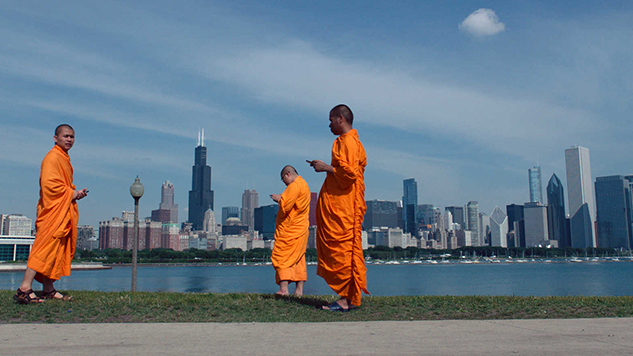

Here, we’ll point it out before you can: The best [documentaries](https://www.pastemagazine.com/tag/documentaries) on Netflix are mostly assembled from movies released after 2000. Whether due to licensing fees, a lack of interest or both, Netflix continues to substantially scale back on its pre-Y2K catalog, featuring only 25 documentaries from before the turn of the Millennium, and a whopping six docs to be released before 1990. Perhaps unsurprisingly, the service has also within the past year purged both its once-thick *30 for 30* cache, as well as its Ken Burns bounty. It may not be the selection many of us want, but this apparently is the selection we deserve.

One thing [Netflix](https://www.pastemagazine.com/tag/Netflix) does well is bring the latest and most groundbreaking in critically lauded documentary films to the service, be it Oscar shortlist choices like *The Witness* and [Netflix](https://www.pastemagazine.com/tag/Netflix)’s own must-see *13th*, the seemingly oneiric appearance of the Ross brothers’ *Western*, or their championing of such semi-obscure essentials as *The Epic of Everest*, *Biggie & Tupac* and *Pumping Iron*. One would be remiss in ignoring the many titles by [Werner Herzog](https://www.pastemagazine.com/tag/Werner+Herzog) Netflix has made available too. There is still plenty to see here.

For other genres and types, check out *Paste*’s many, many [Best Movies](https://www.pastemagazine.com/tag/best+movies) lists, and then make your way through the following. Can you handle the truth? Find out with the 50 Best [Documentaries](https://www.pastemagazine.com/tag/Documentaries) currently streaming on Netflix:

* * *

 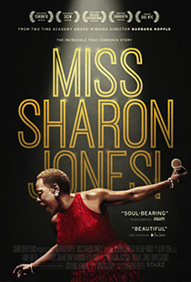  **50. [Miss Sharon Jones!](https://www.netflix.com/title/80079428)**

 ** Year:** 2016
** Director:** Barbara Kopple

In 2013, [Sharon Jones](https://www.pastemagazine.com/tag/Sharon+Jones) was diagnosed with Stage 2 pancreatic cancer—in itself a depressing development, but not without a lot of optimism attached to the prognosis. Except for a by-the-book opening segment, in which director Barbara Kopple seems to grind through all of her blandest tendencies to make room for the grist of what’s important, the film filters Jones’s life and career through her illness. We meet Jones’s band, the Dap-Kings, through that lens, getting to know each musician in light of how their friend’s illness has unfortunately affected their livelihoods. They have mortgages and alimony to pay, children to support, a record label to run. That all of this, already precariously balanced due to the nature of the music-making business, is so dependent on Jones’s health becomes a shadow hanging over every interview. When band practices are occupied by 10+ people sitting patiently in a room waiting for Jones to get back into her groove or helping the singer remember the lyrics to her songs, Kopple’s film is heartbreaking, walking that tragic line between hopelessness and optimism, encapsulating so clearly what it’s like to be close to someone who’s so sick.

But the real thrill of *Miss [Sharon Jones](https://www.pastemagazine.com/tag/Sharon+Jones)!* is in its concert footage, Kopple letting Jones’s performances, old and new, suffice as the best testament to the singer’s power and—unbeknonwst to anyone at the time, though the thought must have crossed their minds incessantly—the most immediate eulogy we’ve got. If you ever had the chance to behold her on stage, then you know how exhilarating she can be. If you hadn’t? Despite recent tragedy, Kopple has some seriously life-affirming stuff you need to see. *—Dom Sinacola*

* * *

Advertisement

   **49. [The Queen of Versailles](http://www.netflix.com/title/70229267)**

 ** Year:** 2012
** Director:** Lauren Greenfield

Lauren Greenfield only meant to take a few pictures of a very wealthy family in the midst of all their opulence. Her subjects were the Siegels—the self-made billionaire, the trophy wife, the eight not-as-maladjusted-as-you-might-think children, the monochromatic menagerie of animals. But once the family began opening up about their lives, the woman behind the camera decided to stick around a little while longer, positing that there might be more to this story than just infinity symbols for account balances. Her perseverance resulted in an alternately hilarious and heart-wrenchingly cautionary tale about the excesses of the American dream. *—Tyler Chase*

* * *

 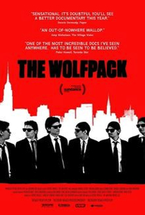  **48. [The Wolfpack](https://www.netflix.com/title/80038206)**

 ** Year:** 2015
** Director:** Crystal Moselle

Imagine a small, dingy Manhattan apartment; imagine you can’t leave; and imagine: The only contact you have with the outside world is through movies. Growing up like this, anyone could imagine that things could get pretty weird—and the Angulo family, a literal band of brothers raised in isolation by their paranoid parents, are indeed an interesting bunch. Their only outlet for creativity, undertaken as a way to basically stave off boredom, is to recreate their favorite films (like *[Reservoir Dogs](https://www.pastemagazine.com/tag/Reservoir+Dogs)*, *The Dark Knight* and *The Grand Budapest Hotel*), crafting costumes out of cereal boxes, yoga mats and whatever other resources they can get their pale hands on. In *The Wolfpack*, director Crystal Moselle has nearly unlimited access to the Angulo brothers; at one point they inform her that she is the only person who has ever been invited over to their home, and is the only guest they’ve ever had. Sad and strange, funny and touching, powerful and unsettling, it is so wholly unusual, *The Wolfpack* may be like no truth you’ve ever seen before. *—Brent McKnight*

* * *

 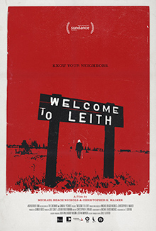  **47. [Welcome to Leith](https://www.netflix.com/title/80039643)**

 ** Year:** 2015
** Directors:** Michael Beach Nichols, Christopher K. Walker

In a nondescript corner of America, members of a community of 24 know well and look out for one another. Welcome to the small town of Leith. A nice-enough stranger takes an interest in their town. He quickly buys up tracts of land and becomes one of the biggest stakeholders in the area. But Craig Cobb is not just a dowdy loner—he’s a white supremacist instigating an Aryan coup in the American heartland. What recourse do the locals have to oust the interloper? The answer: shockingly, not much. *Welcome to Leith* poses the question of where tolerance and intolerance begin. How quiet do we get when the Dutton family espouses their beliefs as “white separatists” around their young children? How do we feel about individual rights when the will of that individual is essentially to terrorize a community and repurpose their homes for hatred? With an eerie sense of timeliness and excellent storytelling to match its ambitious themes, *Welcome to Leith* is a must-watch document of the unfettered feelings coursing through the veins of America right now that might just, someday soon, pull it apart from the inside. *—Monica Castillo*

* * *

 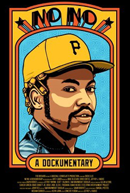  **46. [No No: A Dockumentary](http://www.netflix.com/title/70299291)**

 ** Year:** 2014
** Director:** Jeffrey Radice

If you’ve ever heard of Dock Ellis, then you know the story: in 1970, pitching professional ball for the Pittsburgh Pirates, he threw a no hitter (a “no no”) while high on LSD. It’s a great story, especially told from Dock’s point of view—replete with crucial tidbits about how the catcher wore tape on his fingers so that the tripping Dock could see the signals, or how the level of Dock’s intoxication wasn’t exactly a rarity—but that story is only one page in the much broader account of Dock Ellis’s iconic tenure on this earth. A true-blue weirdo with an admirable proclivity to give practically zero fucks (not to mention becoming, in retrospect, an unheralded civil rights firebrand), Dock was a man of both radical shallowness and progressive steadfastness—one of addiction, salvation, dedication and devotion. And the story went: In 1970, pitching professional ball for the Pittsburgh Pirates, Dock Ellis threw a no hitter while high on LSD—it was a sad reminder of how far out of control his life had swerved. *—D.S.*

Advertisement

* * *

 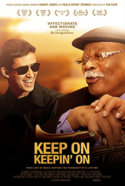  **45. [Keep On Keepin’ On](http://www.netflix.com/title/80011709)**

 ** Year:** 2014
** Director:** Alan Hicks

Shot over the course of almost five years by debut director Alan Hicks, *Keep On Keepin’ On* pitches a genuinely heartwarming tale about positivity in the face of adversity, and the many divides—racial, cultural, generational—that music can help bridge. It’s ostensibly a biopic of legendary, 93-year-old jazz trumpeter Clark Terry told via his mentorship of an affable, mid-20s piano prodigy stricken with debilitating nerves and near-complete blindness, but it quietly reveals itself to be so much more: an affectionate valentine to the tenacity of the human spirit which never once dips over into the maudlin. *—Brent Simon*

* * *

 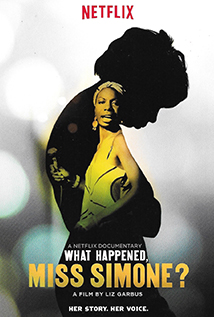  **44. [What Happened, Miss Simone?](http://www.netflix.com/title/70308063)**

 ** Year:** 2015
** Director:** Liz Garbus

Liz Garbus’s *What Happened, Miss Simone?* probably errs too far towards a thesis that [Nina Simone](https://www.pastemagazine.com/tag/Nina+Simone)’s mental health was the cause of her genius, rather than a factor that complicated it. But what saves the film, and what makes it engaging, is that I’m not sure Garbus wholly believes that thesis, because many moments in the film betray it. So even though there are times where Garbus elides aspects of Simone’s life and career to represent her decline as inevitable and linear (and even though she problematically chooses to use interviews with Simone’s abusive ex-husband to narrate Simone’s life), the parts of the film where Simone is allowed to speak for herself—from her diary, from interviews, while performing onstage—are utterly compelling. They portray an artist in the late-1960s at the height of her powers and skill, in complete control of her piano and her voice, and brashly embracing radical politics and Black Power in a way that most contemporary popular musicians were far too scared to do. Sure they *also* portray an artist who was clearly struggling with fame, responsibility, politics, anger, and self-worth—but, especially in performance, the sheer scope of Simone’s technical skill and artistic sensibilities often escape the imposed rise-and-fall narrative. Even footage from late in Simone’s career provides evidence of her insane musical skill: her reinterpretation of early hit “My Baby Just Cares for Me” over a piano arrangement that sounds like one of Bach’s Inventions is astounding in about 30 different ways at once. Though I can only recommend this film with the caveat that it feels overly storyboarded to exploit a tired old idea of the tortured artist in order to answer its titular question—as in, “Q. What happened?; A. The very qualities that made her great also haunted her”—the concert footage alone makes this documentary worth digging into. *—Mark Abraham*

* * *

 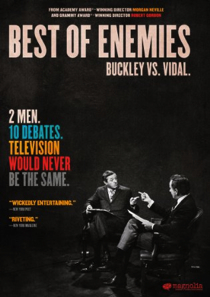  **43. [Best of Enemies](https://www.netflix.com/title/80038199)**

 ** Year:** 2015
** Directors:** Robert Gordon, Morgan Neville

William F. Buckley and Gore Vidal’s infamously grueling rhetorical slugfest is the subject of Robert Gordon and Morgan Neville’s *Best of Enemies*. Neville won the hearts and minds of arthouse audiences (as well as of the AMPAS voting body) in 2013 with *20 Feet from Stardom*, a film that peers behind curtains in show biz to showcase the unsung performers responsible for buttressing the careers of our favorite singers. In *Best of Enemies*, Neville has teamed with Gordon to pull back a different curtain, one concealing the very real ugliness bubbling and boiling off-camera for the length of ABC’s attempt at spicing up the otherwise staid world of political commentary. *Best of Enemies* deftly contextualizes the debates within the framework of their era, but the film is more concerned about how much they’ve echoed through the years. The tenor of Buckley’s meetings with Vidal is felt in every inch of our society’s contemporary political machine, from the speech of our crop of wannabe commanders-in-chief to the language used by our televised cognoscenti. Our ability to speak the same language has long been fractured, and *Best of Enemies* tracks the faultlines of that social temblor with remarkable precision. *—Andy Crump*

* * *

 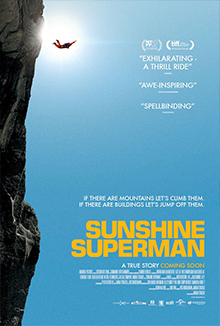  **42. [Sunshine Superman](https://www.netflix.com/title/80018863)**

 ** Year:** 2015
** Director:** Marah Strauch

* Sunshine Superman* can be a problematic film to love. A thorough, intimate and often beautiful documentary about Carl Boenish and the BASE jumping movement that practically sprang single-mindedly from the endless font of his surreal enthusiasm, *Sunshine Superman* still can’t grasp the full splendor at the hearts of both the person and the extreme sport that serve as the film’s most plangent concern. And that isn’t necessarily the film’s fault—there is only so much excitement that can be conveyed regarding the freezing of a full-body rush into a small, albeit panoramic and easily gorgeous, picture—but it is something the film can’t get over. First-time filmmaker Marah Strauch spent years crafting something of a perfect eulogy to Carl Boenish—and her dedication to investigating his outsized life is palpable. It’s no real spoiler he dies, because although you don’t discover the details of Carl’s fate until the film’s final 20-minute stretch, his absence is heavy. His ghost is present everywhere else, though—in home recordings, in reel to reel recordings and even in answering machine messages, Boenish’s ebullient voice lives on righteously throughout the film. The way in which Strauch is able to weave the choicest moments from Boenish’s recordings into a larger narrative that neither betrays the freedom of what he was doing nor feels too formless speaks to a film that seems well-crafted beyond its years, despite the ghost that haunts it. *—D.S.*

Advertisement

* * *

 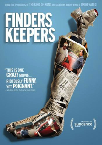  **41. [Finders Keepers](https://www.netflix.com/title/80039530)**

 ** Year:** 2015
** Directors:** Bryan Carberry, Clay Tweel, Alexander Yellen

* Finders Keepers* can boast of having one of the better single-sentence synopses of recent memory when it comes to documentaries: “After a man loses a leg in a plane crash and mummifies it himself, an errant storage locker sale deposits it into the hands of an entrepreneur who refuses to return the body part even after the leg’s original owner demands it back.” That’s the “meat” of *Finders Keepers*, if you will—a custody battle over a severed body part that really took place between leg-loser John Wood and leg-finder Shannon Whisnant in the years following 2007, when the discovery of the leg and resulting feud made national news. The document of this détente is an absurd, rambling, he-said/he-said story that reveals two fascinating personalities residing in rural [North Carolina](https://www.pastemagazine.com/tag/North+Carolina). At times, just as the story seems headed toward an expected conclusion, just as it feels like things should be wrapping up—some new hurdle arises to be overcome, making for a ever-tragic comedy of real life errors. *—Jim Vorel*

* * *

 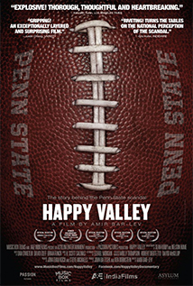  **40. [Happy Valley](http://www.netflix.com/title/70299907)**

 ** Year:** 2014
** Director:** Amir Bar-Lev

Why do we pledge allegiance to institutions? Why do we assign positive attributes to unfeeling organizations like sports teams, telling ourselves that our virtue is reflected in their greatness? Amir Bar-Lev’s *Happy Valley* examines the scandal that engulfed the Penn State Nittany Lions after it was determined that assistant football coach Jerry Sandusky had molested children for years—and that the university (and beloved head coach Joe Paterno) had covered it up. Less a portrait of a sick soul than a chronicling of its repercussions among the Penn State faithful, *Happy Valley* starkly illustrates what happens when people simply refuse to acknowledge the moral rot in their midst. *—Tim Grierson*

* * *

 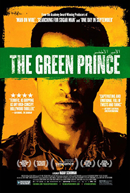  **39. [The Green Prince](http://www.netflix.com/title/70299790)**

 ** Year:** 2014
** Director:** Nadav Schirman

Director Nadav Schirman took a gamble when making his third feature: He assumed that his subjects and their intertwining stories were fascinating enough to sustain 90 minutes of what is essentially a documentary about two men talking. He assumed correctly, because *The Green Prince* builds to the same levels of psychological tension one could find in any spy thriller, all the while offering a rare look into the Israeli-Palestinian conflict. It is informative without being didactic, confident without bias—through only two viewpoints presented clearly, Schirman illustrates a magnificently bigger picture. *—Jeremy Mathews*

* * *

   **38. [For Grace](https://www.netflix.com/title/80058979)**

 ** Year:** 2015
** Director:** Mark Helenowski, Kevin Pang

Those going into *For Grace* unfamiliar with chef Curtis Duffy might think it another on-trend slice of foodie porn about the latest culinary rockstar—and they’d be right, kind of. *Chicago Tribune* dining reporter/filmmaker Kevin Pang and filmmaker Mark Helenowski introduce Duffy as a two-Michelin-starred hotshot who sharpened his knives under Charlie Trotter and Grant Achatz before leaving his latest venture (Avenues) to open labor-of-love restaurant Grace. And that’s where the devastating backstory comes into focus. As the even-keeled, hyper-disciplined Duffy describes a troubled upbringing that involves the murder-suicide of his parents, viewers glimpse the moments that shaped the recently divorced father of two young girls. He frets over $1,000-a-pop dining room chairs, but he frets arguably more about an opening night visit from his middle school home-ec teacher, who took on a motherly role following his own mom’s death. Throughout, Duffy holds himself with a quiet dignity and, yes, grace that resonates on the elegant plates he crafts. So too does his staff, helmed by a GM/business partner who understands how important it is to make each diner feel special—Googling and social media searches of that night’s reservations are par for the course. At now $235 per tasting menu, such a personalized experience should go without saying, but the sincerity and gratitude is obvious. And, of course, the food looks nothing short of exquisite. *—Amanda Schurr*

Advertisement

* * *

   **37. [Man vs Snake](https://www.netflix.com/title/80083235)**

 ** Year:** 2016
** Directors:** Andrew Seklir; Tim Kinzy

Like a companion piece to *The King of Kong*, *Man vs Snake* patiently tells the story of one mild-mannered man on a relentless quest to utterly dominate one specific classic arcade game. In this case, that means Nibbler, the original “Snake” (whattup, old school Nokia cell phone users) in that the whole point is to grow your snake as much as possible without running into your own ever-lengthening torso. This time, the seemingly insurmountable feat is to reach 1 billion points on Nibbler, accomplishable only through a multi-day “marathon” session, a record first set by a fella named Tim McVey (it is quickly noted that he is not *that* McVeigh) in 1984. When, 25 years later, Tim learns that an Italian teen named Enrico Zanetti apparently beat his record decades before, he decides to claim back the title, though he is now much older and markedly out of shape. With help from “bad boy” gamer Dwayne Richard and classic gaming stalwarts Walter Day and Billy Mitchell—who people may recognize from *King of Kong* as the obsessive owner of Twin Galaxies and ersatz villain, respectively—Tim begins to question everything he is, everything he’s ever done, as he tries to regain old glory. With pomp and flair, *Man vs Snake* does more than make watching a guy play video games exciting, it makes one seriously consider—I shit you not—what immortality really means. *—D.S.*

* * *

   **36. [Girlhood](http://www.netflix.com/title/60032551)**

 ** Year:** 2003
** Director:** Liz Garbus

Prepared for the worst, especially given the typical tenor most [documentaries](https://www.pastemagazine.com/tag/documentaries) of *Girlhood*’s ilk would adopt, anyone approaching Liz Garbus’s third feature might be surprised by the levity—the richness of it, even—at the heart of the film’s story. In closely following two Baltimore girls who each wound up in juvenile detention, *Girlhood* briskly passes through barely two years of life inside and then, more importantly, out, offering a significantly empathetic glimpse into both a social justice system beyond repair, as well as the people who do their best to keep it patched together. Garbus has forged a prolific body of film since—especially in documenting famously troubled American icons—but with *Girlhood* she may have made something she’ll never be able to top: a totally self-contained testament to American resilience. *—D.S.*

* * *

 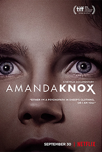  **35. [Amanda Knox](https://www.netflix.com/title/80081155)**

 ** Year:** 2016
** Directors:** Rod Blackhurst, Brian McGinn

With the Amanda Knox saga (seemingly) done for good, [Netflix](https://www.pastemagazine.com/tag/Netflix) recently released a definitive documentary covering it from beginning to end—the murder of Meredith Kercher and subsequent arrest, trials and appeals of Knox and Raffaele Sollecito; the ensuing media frenzy; the quiet, fast-track trial of Rudy Guede, the only party upon whose guilt everyone seems to agree. The film relies mainly on talking head interviews with Knox, Sollecito and two highly entertaining “villains”: boorish prosecutor Giuliano Mignini and smarmy *Daily Mail* journalist Nick Pisa, the latter wearing a Hugh-Grant-caddishness and a shit-eating grin. While Knox herself is probably the least interesting interview in the film—more fascinating by half are pre-arrest home recordings depicting her as a naïve, giggly teen—Blackhurst and McGinn are clear about where their sympathies lie, and contrasted with the ghastly Mignini and Pisa, it’s hard not to side with these two kids. But still the film feels thoughtful and relatively well-balanced: The media is its true target, and the filmmakers nail the insidious ways that its sensationalism and greed can derail justice and irrevocably ruin lives. *—Maura McAndrew*

* * *

 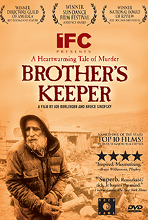  **34. [Brother’s Keeper](http://www.netflix.com/title/60029558)**

 ** Year:** 1992
** Directors:** Joe Berlinger, Bruce Sinofsky

There’s an alleged crime at the center of *Brother’s Keeper*: whether or not Delbert Ward, a 59-year-old farmer from Munnsville, New York, is guilty of murdering his older brother William. But that’s not really what *Brother’s Keeper* is about. Filmmakers Joe Berlinger and Bruce Sinofsky instead focus on the wide fissure between urban and rural American cultures in the late-1980s and early-1990s, examining the way the three remaining Ward brothers, essentially outcasts in their community prior to William’s death, are increasingly embraced by Munnsville as the media descends upon the town to report on Delbert’s trial. The mystery here is not about whether or not William was murdered; the mystery is what lies at the heart of community bonds and national identity, and how allegiances change as communities grow larger. *—M.A.*

Advertisement

* * *

 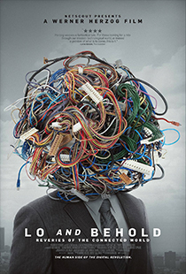  **33. [Lo and Behold: Reveries of the Connected World](https://www.netflix.com/title/80097363)**

 ** Year:** 2016

** Director:** [Werner Herzog](https://www.pastemagazine.com/tag/Werner+Herzog)

You didn’t expect a Werner Herzog documentary about the significance of the internet in our daily lives, and how it might alter our future, to fall in the ballpark of “cheerful,” did you? It’s probably too much to hope for the film to be playful, or cheeky, though it is both of these things when not engaged with bleaker affairs, like internet addiction, embodied via obsessive [World of Warcraft](https://www.pastemagazine.com/tag/World+of+Warcraft) play, or the incident around [Nikki Catsouras’s death](https://en.wikipedia.org/wiki/Nikki_Catsouras_photographs_controversy). “But who is going to be liable in case of an accident?” Herzog muses on the topic of self-driving cars. “The onboard computer? Its designer? The GPS system? The internet? Or the driver, who eats his breakfast?” *Classic Herzog*.

 *Lo and Behold* wants you to feel unsafe in your digital habitat, or at least it wants you to reconsider the status of your relative safety. The film suggests terrors on a sliding scale that goes from “no sweat” to “apocalypse” for the purpose of curing us of said terrors. Think of Herzog not as Biblical prophet, hoisting a sign proclaiming the end times, but as the family cat, presenting you with the lifeless form of a slain household pest as a trophy. He’s trying to reassure us, but his reassurances aren’t all that reassuring. But by confronting with his trademark curiosity and intellectual rigor the uncomfortable truths of what disasters might befall a global society grown so accustomed to occupying virtual space, Herzog’s observations are more factual than alarmist. *—A.C.*

* * *

 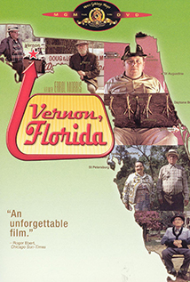  **32. [Vernon, Florida](http://www.netflix.com/title/70035018)**

 ** Year:** 1981
** Director:** [Errol Morris](https://www.pastemagazine.com/tag/Errol+Morris)

[Errol Morris](https://www.pastemagazine.com/tag/Errol+Morris)’s purpose in *Vernon, Florida* is to let his subjects speak for themselves. The residents of the titular town have a variety of obsessions—turkey hunting, policing, sand growing, philosophizing—and part of the appeal of the film is the way these snapshots of American life feed into one another. But the greater part, I think, is how these specific, precise stories suggest that everyone of us, American or not, construct narratives to explain our interests and identities, and how our enthusiasms for specific things can end up sounding exotic and strange when explained in any detail. In other words, the point of the documentary isn’t that these specific people are strange; the point is to explore, depending on one’s perspective, how *all* human beings are strange. *—M.A.*

* * *

   **31. [Under the Sun](https://www.netflix.com/title/80100869)**

 ** Year:** 2015
** Director:** Vitaly Mansky

For as long as there have been [documentaries](https://www.pastemagazine.com/tag/documentaries), there have been debates about what exactly constitutes “reality” in those films. Labeling these movies as nonfiction has always been misleading—just because you’re capturing “real” people doing “real” things doesn’t mean you’re necessarily presenting an unfiltered representation of real life. The terrific documentary *Under the Sun* doesn’t just bring these questions to light but makes them part of the film’s central focus. Daring and thought-provoking, director Vitaly Mansky’s film uses one North Korean family to examine how everyone—moviemakers, governments, even individuals—contorts reality to fit specific purposes. And *Under the Sun* keeps forcing us to ponder why we watch representations of real life and what we think we’re learning about reality in the process—especially when, like in this film, much of it has been scripted for the purpose of advancing a specific agenda. *—T.G.*

* * *

 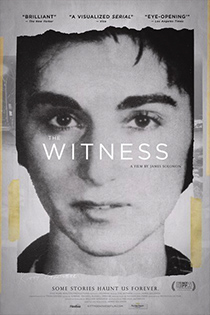  **30. [The Witness](https://www.netflix.com/title/80096897)**

 ** Year:** 2016
** Director:** James D. Solomon

* The Witness* begins with a well-known story: that of Kitty Genovese, famous for her 1964 murder in Kew Gardens, Queens, allegedly witnessed by 38 neighbors who stood by and did nothing—one that’s become something of a tall tale, often cited as a tragic indication of selfish urban America at its worst. But Kitty’s brother Bill was never quite satisfied with the story, so he decided to get to the bottom of it. Solomon’s films follows him as he conducts a series of uncomfortable interviews with former Kew Gardens residents and friends of Kitty’s, most of whom vehemently dispute the “38” theory. Armed with their testimony, Genovese plunges deeper into the now-hazy logistics of the story, even tracing its origins to *[The New York Times](https://www.pastemagazine.com/tag/The+New+York+Times)*. It may all seem too little too late, but *The Witness* isn’t really about the case so much as it is about Bill Genovese himself, a tenacious Vietnam vet whose entire life was shaped by his sister’s murder. As Bill attempts to understand his obsession, he learns more and more about Kitty, the sister he idolized but never really knew. *—M.M.*

Advertisement

* * *

 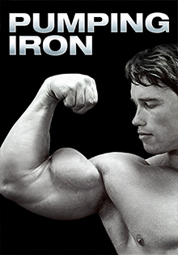  **29. [Pumping Iron](http://www.netflix.com/title/60031683)**

 ** Year:** 1977
** Directors:** Robert Fiore, George Butler

Behold arrogance anthropomorphized: A 28-year-old [Arnold Schwarzenegger](https://www.pastemagazine.com/tag/Arnold+Schwarzenegger), competing for his sixth Mr. Olympia title, effortlessly waxes poetic about his overall excellence, his litanies regarding the similarities between orgasming and lifting weights merely fodder between bouts of pumping the titular iron and/or flirting with women he can roll up into his biceps like little flesh burritos. He is both the epitome of the human form and almost tragically inhuman, so corporeally perfect that his physique seems unattainable, his status as a weightlifting wunderkind one of a kind. And yet, in the other corner, a young, nervous Lou Ferrigno primes his equally large body to usurp Arnold’s title, but without the magnanimous bluster and dick-wagging swagger the soon-to-be Hollywood icon makes no attempt to hide. Schwarzenegger understands that weightlifting is a mind game (like in any sport), buttressed best by a healthy sense of vanity and privilege, and directors Fiore and Butler mine Arnold’s past enough to divine where he inherited such self-absorption. Contrast this attitude against Ferrigno’s almost morbid shyness, and *Pumping Iron* becomes a fascinating glimpse at the kind of sociopathy required of living gods. *—D.S. *

* * *

   **28. [Ballet 422](http://www.netflix.com/title/80007395)**

 ** Year:** 2015
** Director:** Jody Lee Lipes

In *Ballet 422*, director Jody Lee Lipes (who recently served as DP on *Manchester by the Sea*) does something remarkable: He cuts himself out of the equation entirely. He’s barely a fly on the wall in his own documentary, which chronicles New York City Ballet soloist and choreographer Justin Peck’s attempt to architect the company’s 422nd production. Lipes’s approach to capturing his subjects is about as modest as humanly possible, though describing his results as “modest” would be totally unfair. *Ballet 422* lacks the traditional hallmarks of most standard documentary films, eschewing talking head interviews and recurring streams of title cards crafted to hand-hold the audience through learning, and that’s what makes it such a gem. *—A.C.*

* * *

   **27. [The Epic of Everest](http://www.netflix.com/title/80041160)**

 ** Year:** 1924
** Director:** John Noel

Restored in 2012 and 2013 by the British Film Institute, which recorded an intoxicating—sometimes even eviscerating—score and returned many segments to their original, alien color tint, *The Epic of Everest* is an unassailable landmark of documentary filmmaking, both a testament to and an unfortunate product of the colonialist spirit. Chronicling the third attempt to reach the summit of Mount Everest, which led to the deaths of two seasoned climbers, the film, like an early Herzogian experiment in naturalistic cinema, breathes with the same tension, endurance and shocking beauty of its subject. Also like a Herzogian epic, the documentary’s attitude toward the native Tibetans living at the foot of the mountain is sometimes dubious, at one point (almost hilariously) going to great lengths to describe the filthiness of a town’s inhabitants. (The title cards are a word or two from calling them “dirt people”…which: c’mon.) Yet, the documentary is astounding despite its length, and by the time we reach its closing shots—an exquisite time-lapse of a stark sunset over the Himalayas—we feel as if we’ve been given the privilege of witnessing human kind at its most empirically ambitious. *—D.S.*

* * *

   **26. [The Black Power Mixtape, 1967-1975](http://www.netflix.com/title/70166238)**

 ** Year:** 2011
** Director:** Göran Olsson

There are numerous layers to Göran Olsson’s *The Black Power Mixtape, 1967-1975*. There are his rich, captivating edits of period source material, filmed by Swedish television crews in the late 1960s and early 1970s, that focus on various Black Power activists, including Stokely Carmichael and the Black Panthers. There is the apparent period tension between black American interviewees and white Swedish film crews. There is Olsson’s attempt to complicate those tensions and continue those conversations by, over 30 years later, employing people like Talib Kweli and [Erykah Badu](https://www.pastemagazine.com/tag/Erykah+Badu) to provide commentary on the original footage. The resulting film is impressionistic—too impressionistic, perhaps, for somebody looking for an introduction to Black Power, since there’s no real attempt to provide comprehensive context or history here. But as a deliberate meditation on race and race relations in the United States in a specific historical period, *Mixtape* is incredibly evocative. *—M.A.*

Advertisement

* * *

 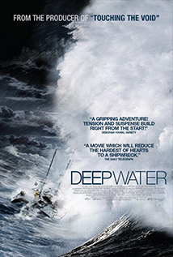  **25. [Deep Water](http://www.netflix.com/title/70075820)**

 ** Year:** 2006
** Directors:** Jerry Rothwell, Louise Osmond

Louise Osmond and Jerry Rothwell’s 2006 documentary *Deep Water* feels like an homage: to sailing, to the sea, to adventure, to vindaloo paste, but mostly to the unknown. In it, Osmond and Rothwell, with narrative help from friends and then—sure—Tilda Swinton, chronicle the 1968 round-the-world *Sunday Times Golden Globe* yacht race, wherein nine of the world’s best sailors, plus one large-hearted electronics engineer named Donald Crowhurst, pretty much the definition of a “weekend sailor,” set out to circumnavigate the globe. They started in the UK, went south and around the Cape of Good Hope, across the Indian Ocean, around Cape Horn, and then back across the Atlantic to complete the loop. It was supposed to take about nine months. Instead, Crowhurst’s story found incomprehensible tragedy—and weirdness. While *Deep Water* often trumps melodramatic musical cues and interstitial vignettes even [Errol Morris](https://www.pastemagazine.com/tag/Errol+Morris) would call cheesy, pushing the narrative into heartrending territory the story itself could easily attain on its own, long passages of screen time are devoted, just as simply, to staring at the sea. Like Herzog’s seemingly interminable shots of whitewater on the Amazon in *Aguirre*, the viewer is expected to hold her gaze. It’s a hypnotic sight; it’s also simultaneously overwhelming and calm, vicious and passive, loud and susurrate to the point of silence. In that middle ground, between poles (or, rather, where two ends meet, at both the end and the beginning), there is the terror of the unknown. There is this ocean and that ocean and thousands of miles of incomprehensible vista between. *—D.S.*

* * *

   **24. [Room 237](http://www.netflix.com/title/70229061)**

 ** Year:** 2013
** Director:** Rodney Ascher

There exists a rare species of obsessive cinephile: the hyper-fan who focuses on one film, mentally and emotionally ingesting it dozens, maybe hundreds, of times. Along a certain parallel, there is also a serious breed of conspiracy theorist, compulsive in his or her beliefs, taking things far beyond just watching *Doomsday Preppers* for fun. Push these two types inextricably together, you get *Room 237*, the confounding, eye-opening and often hilarious documentary about individuals whose over-wired brains are devoted to one cinematic masterpiece, [Stanley Kubrick](https://www.pastemagazine.com/tag/Stanley+Kubrick)’s *The Shining*. The most outlandish—and perplexing—theories in *Room 237* posit *The Shining* either as a vehicle meant to comment on dark, oppressive periods in history, or as a massive, cryptic revelation. As a cinema sociologist, director Rodney Ascher acts as non-participant observer, letting his *Room 237* subjects sell themselves, leaving us to jump on, laugh or stare in amazement. As a documentary filmmaker, Ascher voraciously digs into the stories, freezing frames from the 1980 classic, adding explanatory graphics and complex maps of the hotel’s physical layout. As the subjects analyze Kubrick, Ascher analyzes their analyses, which in turn inspires an analysis of *Room 237* itself, making for a documentary film that twists in on its own guts so thoroughly one can’t help but feel similarly obsessed by film’s end. *—N.S.*

* * *

 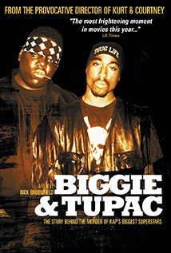  **23. [Biggie & Tupac](http://www.netflix.com/title/60024962)**

 ** Year:** 2002
** Director:** Nick Broomfield

From its very first moments, *Biggie & Tupac*—a sort of truther’s glimpse into the murders of rappers Notorious BIG and 2Pac—is an exceptionally strange film. Director and narrator Nick Broomfield speaks in a clipped cadence, as if English isn’t his first language, and Earth isn’t his home planet. That he is somehow able to waddle his way into the most exclusive (and sometimes terrifying) situations is nearly incomprehensible, until one realizes that, to some extent, all his weirdness probably makes him seem so non-threatening that the folks who spill deeply incriminating confessions probably never figure his footage will ever see the light of day. And yet, *Biggie & Tupac* is endlessly compelling, far from an actually competent procedural but still ringing with enough sincerity that, buried beneath Broomfield’s weirdness and his very dubious journalistic intentions, there must be *something* true he’s tapping into. I’ve heard Broomfield referred to, among other epithets, as a “bottom-feeding creep,” and it’s not a stretch to see how his methods and results could be construed as the work of such. Yet, the access the man gets … when it comes to documentary film, do the ends justify the means? Because: the last 10 minutes of the film alone are worth the journey, in which an interview with Suge Knight (whom the film pretty clearly portrays as the orchestrator of both murders) reveals unnerving opinions on socioeconomic and racial realities. *—D.S.*

Advertisement

* * *

 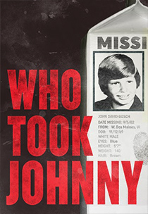  **22. [Who Took Johnny](https://www.netflix.com/title/80057280)**

 ** Year:** 2014
** Directors:** David Beilinson, Michael Galinsky, Suki Hawley

At first, *Who Took Johnny* seems like a rather unassuming little documentary, looking back at the case of Johnny Gosch, the twelve-year-old paperboy who disappeared in 1982 without a trace, never to be found. It follows Johnny’s mother, Noreen Gosch, whose efforts after her son’s disappearance contributed to the founding of the National Center for Missing and Exploited Children. Noreen is an eccentric woman, but it’s only about a half hour into the film that it becomes apparent she could be a less-than-reliable narrator. The filmmakers follow Noreen down rabbit holes, pursuing horrifying-yet-surprisingly-plausible theories about what happened to Johnny, told in part by another strange character, convicted sex offender Paul Bonacci, who claims to have been present during the kidnapping. A full 35 years later, Johnny’s case remains staggering in its mystery: How could a boy go missing in a split second on a busy morning, with witnesses present? And how could he never be found? *Who Took Johnny* can’t find answers, but what it does find is deeply unsettling. *—M.M.*

* * *

 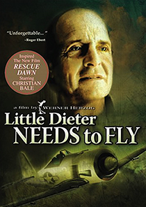  **21. [Little Dieter Needs to Fly](https://www.netflix.com/title/60024255)**

 ** Year:** 1998

** Director:** [Werner Herzog](https://www.pastemagazine.com/tag/Werner+Herzog)

The story of former fighter pilot Dieter Dengler, told in his own words, is one that, while pretty unbelievable, best illustrates the mastery manipulation of the man helping tell it. [Werner Herzog](https://www.pastemagazine.com/tag/Werner+Herzog) makes no apologies for the way he so often bends truth to more snugly serve the grandeur he finds in the subjects he chooses for his documentaries—but he’s never been interested in unadulterated truth anyway. Instead, he’s in the documentary game for the exultation of truth, conveying it in such a way as to focus on the overpowering emotions at its core. And so, in *Little Dieter Needs to Fly*, Herzog takes Dengler back to Southeast Asia, where, in the early days of the Vietnam War, he was shot down and taken prisoner, tortured and starved—but then, somewhere within him, found the will to escape. Dengler leads us step by step through this harrowing experience, accompanied by locals who Herzog hired to help Dengler “reenact” the events, and in a sense help him remember. That Herzog later went on to make a narrative feature based on Dengler’s story isn’t at all surprising—*Rescue Dawn*, starring [Christian Bale](https://www.pastemagazine.com/tag/Christian+Bale) in the lead role, walks a fine line between harsh reality and patriotic melodrama. Because, as Herzog told Paste more than eight years ago: “*Rescue Dawn* is not a war movie. It’s a film about the test and trial of men … And survival.” It doesn’t necessarily matter how Dengler escaped, but that he was able to at all. Whatever you want to call it, it was that titular “need” that propelled him onward—and that’s the truth Herzog wants to discover. *—D.S.*

* * *

 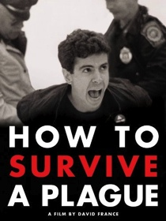  **20. [How to Survive a Plague](http://www.netflix.com/title/70229270)**

 ** Year:** 2012
** Directors:** David France

A New York journalist who has covered the AIDS epidemic for 30 years, first-time filmmaker David France has assembled both a superbly researched record of the decade-long fight for a viable treatment protocol and an intimate portrait of the personalities leading the charge. Serendipitously, the arrival of HIV coincided with the availability of consumer-grade camcorders, and as a result, much of this developing story—from private conversations to public protests—was recorded for posterity. France combines this historic footage, courtesy of more than 30 videographers, with archival news reports and present-day interviews to craft a complete picture of the founding, mission, strategies, in-fighting, splintering, failures and successes of ACT UP, a Greenwich Village-based protest group that forced government agencies and health organizations to take AIDS seriously and invest in finding a cure. Yet, by the time this story ends in 1996, with the development of a combination drug therapy that actually works, 8.2 million people had died. *How to Survive* is indeed a tale of survival, but the AIDS community didn’t get there without a fight—and a steep personal toll. *—Annlee Ellingson*

* * *

 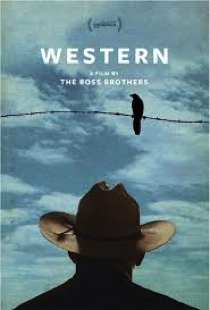  **19. [Western](https://www.netflix.com/title/80037639)**

 ** Year:** 2015
** Directors:** Bill Ross IV, Turner Ross

With *45365*, *Tchoupitoulas* and now *Western*, the Ross Brothers, Bill and Turner, are quietly developing a distinctive voice: one that seeks the beauty in the everyday, shunning [talking heads](https://www.pastemagazine.com/tag/talking+heads) and polemical point-making in favor of intimate observation and an eye for expressive imagery. Broadly speaking, *Western* tackles the hot-button issue of security along the U.S.-Mexican border, especially in light of the increasingly violent drug wars south of the border. But instead of bringing us into the terrifying heart of the U.S.’s ineffectual war on drugs à la dramas like *Sicario*, the Rosses explore this subject by examining a Texas town, Eagle Pass, which is right across from the Mexican Piedras Negras. Somewhat unusually for a Ross Brothers film, a dramatic arc of sorts develops: Thanks to a bout of gangland violence, the U.S. government orders cattle passage between Eagle Pass and Piedras Negras indefinitely halted, which puts a strain on the leaders and citizens of both towns. But while other, more activist filmmakers might have used these developments as an opportunity to score larger political points, the Rosses never break from their impressionistic, observational gaze. As a result, *Western* represents the best distillation of political filmmaking—it bursts with the kind of empathetic artistry that makes the political deeply personal…and lyrical. *—Kenji Fujishima*

Advertisement

* * *

 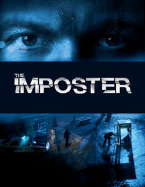  **18. [The Imposter](http://www.netflix.com/title/70228012)**

 ** Year:** 2013
** Director:** Burt Layton

The short version is this: In 1994, thirteen-year-old Nicholas Barclay goes missing in Texas, and then, in 1997, Nicholas pops up in Spain, speaking French and claiming to have suffered unspeakable trauma. Overjoyed, the Barclays fly him to San Antonio to rejoin his old life. Nicholas is obviously different—his eyes, his ears, his accent—but the family, damaged with a troubled history, doesn’t doubt him until five months later, when a persistent P.I. discovers the truth: This is not Nicholas Barclay at all, but a twenty-three-year-old “serial imposter” named Frederic Bourdin. Layton’s film delivers a stellar telling of an already-great story, with a creeping sense of foreboding throughout. We know Bourdin is the bad guy, but what about Nicholas’s family? Did they really not know this was an imposter, or was Bourdin’s charade mutually beneficial? The Imposter explores these mysteries carefully, using fragmented reenactments and interviews with the peculiar, fascinating characters on both sides to show that no true story is ever exactly what it seems. *—M.M.*

* * *

 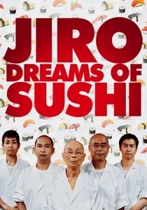  **17. [Jiro Dreams of Sushi](https://www.netflix.com/title/70181716)**

 ** Year:** 2012
** Directors:** David Gelb

* Jiro Dreams of Sushi* is about one of the greatest masters of the culinary world, one of whom casual foodies have never even heard. Although Jiro’s work—literally, the dishes he so effortlessly prepares, and then the act of watching him as he watches his customers eating the dishes—is ostensibly the film’s focus, the story is truly propelled by the chef’s relationship with his two sons: the youngest started his own restaurant, and the oldest, at the age of 50, continues to work with his father, training to one day take over Jiro’s infamous restaurant. Devoid of the typical familial jealousy you may expect (and so devoid, arguably, of much conflict at all), *Jiro Dreams of Sushi* is only a beautifully filmed documentary about three men who have devoted their lives to the pursuit of perfection. Which in itself is conflict enough, as the film airily asks: Where do style, artistry, practice and perfection meet? *—Emily Kirkpatrick*

* * *

 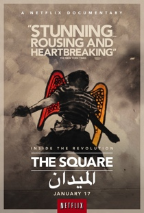  **16. [The Square](http://www.netflix.com/title/70268449)**

 ** Year:** 2013
** Director:** Jehane Noujaim

Bringing calm insight to an impassioned, still-developing historic event, *The Square* looks at the 2011 Egyptian Revolution from the perspective of those who were on the frontlines from the very beginning, personalizing the dramatic developments without losing a sense of greater stakes. Director Jehane Noujaim, who previously helmed *Control Room* and co-directed *Startup.com*, has delivered a snapshot of a grassroots political movement over its bumpy two-year history, embracing the emotional complexity and logistical obstacles that have made Egyptians’ road to democracy so difficult. Using no voiceover narration and only a handful of intertitles that inform the viewer about the exact time period of events, *The Square* seeks to create an urgent, immediate experience that tells its story through the reactions of its main participants. In the West, the scenes of peaceful, joyous protest at Tahrir Square were warmly greeted as hopeful signs of a new Middle East. *The Square* doesn’t throw cold water on those hopes as much as it meticulously demonstrates that systemic change does not come easily. That’s why you care so deeply about the people you see in this movie—it’s not that their quest is easy but that it’s so very hard. *—T.G.*

* * *

 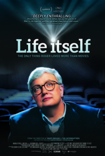  **15. [Life Itself](http://www.netflix.com/title/70299909)**

 ** Year:** 2014
** Director:** Steve James

* Life Itself* may tell the story of a remarkable life, but it’s at its most enlightening when dealing with death. Steve James’s documentary on [Roger Ebert](https://www.pastemagazine.com/tag/Roger+Ebert) naturally chronicles its subject’s exploits, trials and triumphs as he became the most recognizable film critic in the United States. But it weaves his life story around footage shot during the last months of his life, as we see the effect his impairments and mortality have on him and his loved ones. While the director’s best-known works like *[Hoop Dreams](https://www.pastemagazine.com/tag/Hoop+Dreams)* and *The Interrupters* mainly use location footage and naturalistic interviews shot by James James himself, the historical segments of *Life Itself* take on a slick production quality that would be more closely associated with Ken Burns—complete with old photos and archival footage. While the movie jumps around chronologically, its contemporary footage is the pivot on which it all turns. But James is most at home while working with his own footage, and that’s where the movie really shines. Shooting began a few months before Ebert’s death, but no one knew that the end would come so soon. Ebert had been publicly battling cancer for several years, after all; surgeries and subsequent complications in 2006 left him with no jaw, nearly unrecognizable and unable to eat without tubes or speak without a computer. When James joins him, Ebert is doing even worse after breaking his hip. It’s fitting that Ebert often professed his love for [documentaries](https://www.pastemagazine.com/tag/documentaries) that unfold in a way the filmmakers couldn’t have predicted when production began. He would have loved this one. *—J.M.*

Advertisement

* * *

 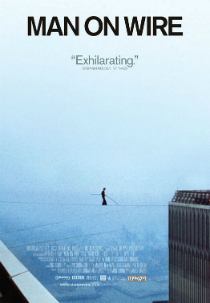  **14. [Man on Wire](http://www.netflix.com/title/70084167)**

 ** Year:** 2008
** Directors:** James Marsh

In 1974, high-wire walker Philippe Petit fulfilled a longstanding dream by sneaking into New York’s World Trade Center, stringing a cable between the tops of the two towers, and (with almost unfathomable guts and without a net) walking across it, back and forth, for almost an hour. The man is clearly a nut, but he’s also a great storyteller with a heck of a story, and *Man on Wire* gives him a chance to tell it. Petit’s stunt was both an engineering challenge and a test of, well, a test of something that most of us don’t possess in this much quantity. Filmmaker James Marsh uses standard documentary techniques, combining new interviews, as well as a satisfying pile of footage and photographs, with re-enactments that both build the kind of suspense more suitable to a caper movie and shade the film’s climactic moment with all due respect for (yet, thankfully, no literal mention of) the visceral symbolism of the two buildings that are no longer there. The title comes from the report written by a police officer on the scene; he was more than a little uncertain about how to respond to the audacity on display. *—Robert Davis*

* * *

 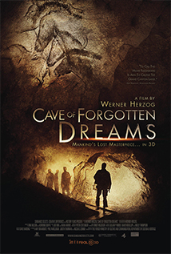  **13. [Cave of Forgotten Dreams](http://www.netflix.com/title/70145740)**

 ** Year:** 2010

** Director:** [Werner Herzog](https://www.pastemagazine.com/tag/Werner+Herzog)

[Werner Herzog](https://www.pastemagazine.com/tag/Werner+Herzog)’s *Cave of Forgotten Dreams* is the story of humanity’s oldest surviving pieces of artwork: everything they can teach us about ourselves and how we got here. It’s yet another one of those seemingly random yet functionally primordial bits of human minutia that the German director’s imagination so often keys upon, and in this case it yielded one of his most placidly beautiful, intimate films. As Herzog provides minimal narration, drifting with his camera through Chauvet Cave in southern France, the film unfolds rather like an educational movie that one might watch at a museum or informational kiosk at a historical site, except infused with the director’s personal, unflagging sense of wonder. Here, we learn the stories and historical perspective behind the oldest cave paintings on record, estimated at 32,000 years old, the product of some of the first modern human beings in Europe. The walls depict vivid impressions of their surroundings—and in some sense breaches the fabric of their imaginations. The film has that same sleepy, oneiric quality; it’s never in any hurry, and it feels remarkably self-sufficient, thanks to the three-person crew that filmed the entire thing due to French law regarding access to the caves. Herzog himself even worked the lights, in what is also his only 3D film, offering moving, unprecedented, tactile access to a piece of our biological history which the majority of us will never be able to see in even our wildest dreams. *—J.V.*

* * *

 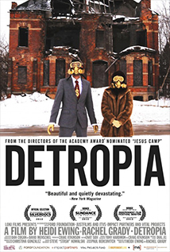  **12. [Detropia](http://www.netflix.com/title/70229260)**

 ** Year:** 2012
** Directors:** Heidi Ewing, Rachel Grady

* Detropia* paints a modern likeness of the City of [Detroit](https://www.pastemagazine.com/tag/Detroit) as the United States’ greatest failure, and perhaps its most representative example of the untenable nature of the so-called American Dream. But the film is rarely as big as it’d like to be. Though there’s something there to dissect about the dissolution of the middle class—how that doesn’t really mean much of anything anymore—directors Heidi Ewing and Rachel Grady can’t seem to get past a melancholic tone and make a serious case about American exceptionalism dooming the rest of the country in the same way. And yet, basic facts are brutal: How in 1955, 1.86 million people lived in the city, but by the time the film was made, there were less than 800,000 people; how there are currently 40 square miles of vacant land within city limits. Detroit is simply too big, and the film struggles underneath that weight. Ewing is from Detroit suburb Farmington Hills, and as someone who also grew up in the area, I recognize sincerity and possessiveness in the way the film chronicles the city’s current plight. Which is maybe why, despite all of the despair and slow-burning nightmares and wreckage it portrays, *Detropia* ends on a hopeful beat, more of a lullaby than a soundless death throe. It’s quite beautiful. *—D.S.*

* * *

   **11. [Iris](https://www.netflix.com/title/80027120)**

 ** Year:** 2015
** Director:** Albert Maysles

It’s tempting to view *Iris* as a vanity project. Iris and director Albert Maysles were chums, and the outside sense one gets when either watching or merely reading about the film is that the latter decided to make a movie about the former for fun. If we accept this perspective then it’s very, very hard to earnestly hold Maysles’ indulgence against him. You would make a movie about Iris Apfel if you were buddy-buddy with her, too. She’s one of a kind. But *Iris* is about a lot more than one person making a flattering commemoration to another. It’s about observing a life lived (and still being lived) fully, and even that nifty summation doesn’t quite manage to dig out the alternatingly droll and piquant wisdom Iris has to offer every single person with whom she interacts. In one scene, an interviewer praises Iris for stepping outside of the box with her eclectic style. Iris’s reply feels like the lede of her personal manifesto: “If you’re just going to sit there and do the same damn thing all the time, you might as well jump into the box yourself.” *—A.C.*

Advertisement

* * *

 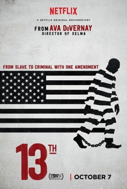  **10. [13th](https://www.netflix.com/title/80091741)**

 ** Year:** 2016
** Director:** Ava DuVernay

Director Ava DuVernay has successfully made a documentary that challenges and even dismantles our collective understanding of one of the most dangerous notions of our time: “progress.” How do we define progress, and who precisely gets to define it? *13th* is a captivating argument against those who measure progress with laws that pretend to protect American citizens and amendments, and even to uphold the Constitution. It is a deftly woven and defiant look at how clauses within those amendments (specifically the lauded 13th) and the language of our political system both veil and reveal a profound and devastating truth about America: Slavery was never abolished here, DuVernay and the participants in the film argue. It was simply amended, and it continues to be amended in 2016, with the constant evolution of the criminal justice system. It’s a bold and terrifying statement to make, but in using a documentary instead of, say, a narrative film, DuVernay is able to point directly to that history and to those people who have defined “progress” for black Americans. In doing so, she draws a line directly from the 13th amendment, to today’s America, which has the highest rate of incarceration in the world. *—Shannon M. Houston*

* * *

 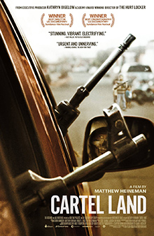  **9. [Cartel Land](https://www.netflix.com/title/80039606)**

 ** Year:** 2015
** Director:** Matthew Heineman

Twenty minutes into *Cartel Land*, I leaned over to my filmmaker friend and whispered, “We have *got* to get the rights to turn this into a scripted feature.” Half an hour after that, I leaned over again: “Never mind.” She nodded, knowing exactly what I meant—a scripted feature would be superfluous after the incredible storytelling already present here, plus we’d never be able to find actors as compelling as these genuinely real figures. *Cartel Land* is incredibly gripping from the very first scene, in which director Matthew Heineman interviews cartel members as they are cooking meth under cover of darkness. The tension actually escalates from there: Heineman begins to follow two vigilante groups—one in Arizona, one in the south of Mexico—who are fighting a grassroots war against the cartels. The results are astounding. *Cartel Land* is staggering, stunning. The best documentary I’ve seen in a very long time. *—Michael Dunaway*

* * *

 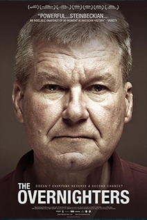  **8. [The Overnighters](http://www.netflix.com/title/70299292)**

 ** Year:** 2014
** Director:** Jesse Moss

The bulk of *The Overnighters* is about Williston, ND. It may not be the most happening city in the United States, but it is one of the fastest growing thanks to the controversial fracking boom and subsequent influx of jobs. Thankfully, Moss leaves the fracking debate for other [documentaries](https://www.pastemagazine.com/tag/documentaries) to handle. In turn, he focuses on the economically challenged men who seek work in the area, and the harsh realities they find instead. Rather than the instant riches and six-figure salaries afforded a lucky few, scores of job seekers are left to fend for themselves, living out of cars and alienated by a less-than-welcoming community. The notable exception is Lutheran pastor Jay Reinke, who happily throws open the doors of his Williston church with a housing program dubbed “The Overnighters.” Without the consent of his congregation, Reinke invites these desperate pilgrims to make the building their temporary (or semi-permanent) residence. For Reinke, this radical act of charity is simply the Christian thing to do. For many of his parishioners, it’s an uncomfortable intrusion on their spiritual sanctuary—especially when the local paper prints a list of registered sex offenders in the area and a few of those names are Overnighters. One even lives in Reinke’s own home, with the approval of Reinke’s wife and three children. The experience of *The Overnighters* is about so much more than just what does or doesn’t drive Reinke. It’s about what’s happening in America right now, how we can have as many abstract discussions about economics, the environment, crime and punishment, and religion as we want, but that these abstract ideas have real impacts on real people. *—Geoff Berkshire*

* * *

 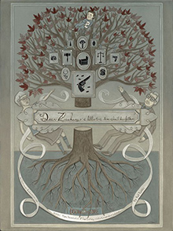  **7. [Dear Zachary: A Letter to a Son About His Father](https://www.netflix.com/title/70095159)**

 ** Year:** 2008
** Director:** Kurt Kuenne

Kurt Kuenne was childhood friends with a man named Andrew Bagby, who, in late 2001, was murdered by ex-girlfriend Shirley Turner. Relieved he’d finally put an end to a turbulent relationship, he had no idea Turner was pregnant. So she killed him, then fled to Newfoundland, where she gave birth to Bagby’s son, Zachary. This is how *Dear Zachary* begins: a visual testament to both Andrew Bagby’s life, as well as the enduring hearts of his parents, who, as Kuenne chronicles, moved to Newfoundland after their son’s murder to begin proceedings to gain custody of Zachary. Kuenne only meant the film to be a gift, a love letter to his friend postmarked to Zachary, to allow the baby to one day get to know his father via the many, many people who loved him most. Told in interviews, photos, phone calls, seemingly every piece of detritus from one man’s life, Kuenne’s eulogy is an achingly sad portrait of someone who, in only 28 years, deeply affected the lives of so many people around him. And then *Dear Zachary* transforms into something profoundly *else*. It begins to take on the visual language and tone of an infuriating true-crime account, painstakingly detailing the process by which Bagby’s parents gained custody and then—just as they were beginning to find some semblance of consolation—faced their worst nightmares. The film at times becomes exquisitely painful, but Kuenne has a natural gift for tension and pacing that neither exploits the material nor drags the audience through melodramatic mud. In retrospect, *Dear Zachary*’s expositional approach may seem a bit cloying, but that’s only because Kuenne is willing to tell a story with all the disconsolate surprise of the tragedy itself. You’re gonna bawl your guts out. *—D.S.*

Advertisement

* * *

 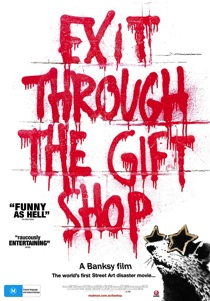  **6. [Exit Through the Gift Shop](http://www.netflix.com/title/70132200)**

 ** Year:** 2010
** Director:** [Banksy](https://www.pastemagazine.com/tag/Banksy)

When renowned graffiti artist [Banksy](https://www.pastemagazine.com/tag/Banksy) took the camera away from Thierry Guetta, the man shooting his biopic, and decided that the subject would become the documentarian (and the documentarian, the subject), an incomparably zany (and very, very funny) documentary was born. Against all odds, Mr. Brainwash, as Guetta christens himself, puts on the largest and most profitable street art exhibition in history. The film never quite takes a side on the Warholian question of whether Guetta/Mr. Brainwash is actually a legitimate artist or has merely convinced enough people that he is—or whether those are one and the same, or whether it even matters. But the most compelling theme of the film is its cinematic exploration of Heisenberg’s Uncertainty Principle: That a phenomenon cannot be observed or measured without simultaneously changing it. Guetta never puts spray can to wood until he’s being documented by Banksy. Does that mean Banksy made him what he is? Destroyed, in some sense, what he was? And is that good or bad, or neither? Banksy’s not saying. *—M.D.*

* * *

 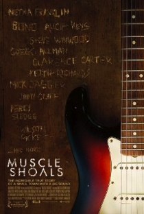  **5. [Muscle Shoals](http://www.netflix.com/title/70267584)**

 ** Year:** 2013
** Director:** Greg “Freddy” Camalier

Freddy Camalier’s masterly *[Muscle Shoals](https://www.pastemagazine.com/tag/Muscle+Shoals)* is about the beginnings and then the heyday of the recording scene in [Muscle Shoals](https://www.pastemagazine.com/tag/Muscle+Shoals), Alabama, a tiny town that improbably changed the face of rock’n’roll forever. First-timer Camalier is obviously a natural storyteller, but there’s so much more to the doc than promise—the cinematography is lush and beautiful, the editing is crisp and precise, and it’s in turns heartbreaking, inspiring, wry, thought-provoking, nostalgic and genuinely funny. It’s simply a stunning debut film. It helps that Camalier and his producing partner Stephen Badger are after more than just a lesson in musical history: They delve into the Civil Rights Movement and its effect specifically on Alabama, especially as it relates to a Muscle Shoals music scene that was, shockingly enough, lacking in any racial tension. They return again and again to the ancient Native American legend about the river that flows through the town, and the water spirit who lived there, sang songs and protected the town. Not to mention that the personal life of Fame Records founder Rick Hall, the protagonist of the film, is itself worthy of a Faulkner novel. *[Muscle Shoals](https://www.pastemagazine.com/tag/Muscle+Shoals)* is thrilling, it’s engaging, it’s fascinating, it’s stirring, it’s epic—whether you’re a music lover or not. *—M.D.*

* * *

 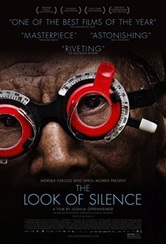  **4. [The Look of Silence](https://www.netflix.com/title/80016401)**

 ** Year:** 2015
** Director:** Joshua Oppenheimer

Like *The Act of Killing*, Joshua Oppenheimer’s companion film—the syntactically similar *The Look of Silence*—asks you to contemplate the literal meaning behind its title. Again returning to Indonesia, a country languishing in the anti-communist genocides of the 1960s, Oppenheimer this time sets his eye on Adi, a middle-aged optician whose brother was murdered by the men who were the focus of the first film, people today treated as local celebrities. Without question, the film is an interrogation of what it means to watch—as those who led the genocides; as those who are loved ones of those who led the genocides; as those who must repress the anger and humiliation of living beside such people every day; and, most palpably of all, as those of us who are distant observers, left with little choice but to witness such horror in the abstract. As in its predecessor, Oppenheimer’s patience and ability to acquaint himself intimately with the film’s subjects make for one gut-scraping scene after another—the sight of Adi’s 100+ year-old father, especially, is harrowing: blind and senile, the man is abjectly terrified as he scoots around on the floor, flailing and screaming that he’s trapped, having no idea where, or when, he is. Yet, moreso than in *The Act of Killing*, Oppenheimer here demands our undivided attention, forcing us to confront his quiet, sad documentary with the notion that seeing is more than believing—to see is to bear responsibility for the lives we watch. *—D.S.*

* * *

 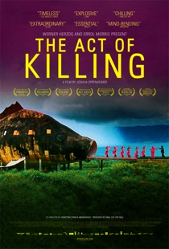  **3. [The Act of Killing](https://www.netflix.com/title/80005702)**

 ** Year:** 2013
** Director:** Joshua Oppenheimer

Joshua Oppenheimer’s *The Act of Killing* focuses on one of the darkest chapters of the 20th century, speaking to some members of the Indonesian death squads who slaughtered hundreds of thousands of their countrymen and women in 1965 and ’66. These people don’t live in the shadows, though—instead they’re treated like royalty in their native land, celebrated as heroes who helped “save” Indonesia from communism. The film is so shocking and depressing that its subjects’ utter disconnection from morality would almost be funny if it wasn’t so frightening. Oppenheimer amplifies those conflicting reactions further by introducing a daring gambit: In the process of interviewing these butchers—who brag about raping and killing their victims (including the occasional beheading)—the director asked if they would be interested in re-creating their murders through fictionalized, filmed scenes. The men—most notably a gentleman named Anwar Congo, who was one of the death squad leaders—leapt at the chance. What follows is a literally nauseous glimpse into the minds of men who have spent decades mentally escaping the inescapable. *—T.G.*

Advertisement

* * *

 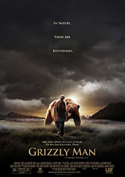  **2. [Grizzly Man](http://www.netflix.com/title/70024093)**

 ** Year:** 2005

** Director:** [Werner Herzog](https://www.pastemagazine.com/tag/Werner+Herzog)

Leave it to [Werner Herzog](https://www.pastemagazine.com/tag/Werner+Herzog) to take on a subject as peculiar and tragic as that of Timothy Treadwell, the bear enthusiast who, along with his girlfriend, was killed by his wild obsession in 2003. A sing-songy, pleasant, dangerously deluded man who believed his beloved grizzly companions knew and trusted him, Treadwell, over the course of 13 summers spent in Alaskan national parks, approached bears with both a religious reverence and folksy casualness—the latter of which arguably cost him his life. Treadwell self-anoints himself “kind warrior” and, alternately, “samurai,” and at one point tellingly declares that animals rule, but “Timothy conquered.” Rooted in Treadwell’s own footage, *Grizzly Man* will divide camps between those who find him a reckless idiot and those who enjoy him as a kooky nature lover, or both. For his part, Herzog is a sympathetic yet level-headed narrator, his even voice and expositional asides setting the tone for a restrained, expertly crafted film. Far from exploitative—existing audio footage of the couple’s death is not heard onscreen, just reacted to and discussed—*Grizzly Man* is a sensitive, supremely fascinating glimpse of the primal forces within us and apart from us, and what happens when they can’t be reconciled. *—A.S.*

* * *

 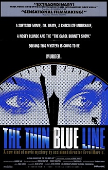  **1. [The Thin Blue Line](http://www.netflix.com/title/60034937)**

 ** Year:** 1988
** Director:** [Errol Morris](https://www.pastemagazine.com/tag/Errol+Morris)

A little after midnight on Nov. 28, 1976, Dallas police officers Robert Wood and Teresa Turko made a routine traffic stop for a car driving without headlights. When Wood approached the vehicle, the driver pulled a handgun and shot him five times. The car sped off into the night while Turko fired hopelessly in its wake and Wood died at her feet. A cop killer was on the loose in Dallas. Turko’s recollections of the driver were meager, and 50 investigators worked through the sparse clues without a single witness. But less than a month later, on Dec. 21, Dallas police arrested Randall Dale Adams, a 28-year-old itinerant laborer from Ohio. Though Adams claimed his innocence, a jury found him guilty and the judge handed him the death sentence. The man once branded in court as “Charles Manson” was safely locked away. Dallas breathed again. Nine years later, in 1985, a documentarian named [Errol Morris](https://www.pastemagazine.com/tag/Errol+Morris) drifted into town from New York. Morris had never heard of Randall Dale Adams; he was in Dallas to speak to a doctor. By the time Morris left three years later, he had freed an innocent man, identified a murderer, uncovered widespread corruption and earned death threats, law suits and debt. He had also made one of the finest documentary films of all time—a nimbly stylized and obsessive pursuit of truth; a study in and a shrug to the pitfalls of myopia; the *Serial* podcast before podcasts ever existed; an epic story of life, death and the misuse of power that has repercussions to this day. He called it *The Thin Blue Line*. *—Neil Forsyth*

**[Share](#)[Tweet](#)[Submit](#)[Pin](#)[More](https://www.pastemagazine.com/articles/2017/01/the-50-best-documentaries-on-netflix-december-2016.html?a=1#)**

**Tags**

- [documentaries](https://www.pastemagazine.com/tag/documentaries)
- [netflix](https://www.pastemagazine.com/tag/netflix)
- [werner herzog](https://www.pastemagazine.com/tag/werner+herzog)