The 50 Best Movies on Netflix Right Now

# The 50 Best Movies

on Netflix Right Now

  By JASON BAILEY    UPDATED March 6, 2019

*[Sign up for our Watching Newsletter](https://www.nytimes.com/newsletters/watching)* to get recommendations on the best films and TV shows to stream and watch, delivered to your inbox. **

*  *
*  *
*  *
**

The sheer volume of films on Netflix — and the site’s less than ideal interface — can make finding a genuinely great movie there a difficult task. To help, we’ve plucked out the 50 best films currently streaming on the service in the United States, updated regularly as titles come and go. And as a bonus, we mention 50 more great movies on Netflix within many of our writeups below. (Note: Streaming services sometimes remove titles or change starting dates without giving notice.)

**Our list of the best movies on Amazon Prime Video is *[here](https://www.nytimes.com/interactive/2019/arts/television/best-movies-on-amazon-prime.html)*.**

*  *
*  *
*  *
**

 

 The Globes will not offer much guidance on the Oscar fortunes of “Roma,” Alfonso Cuarón’s latest movie.  Carlos Somonte/Netflix

## ‘Roma’ (2018)

This vivid, evocative memory play from Alfonso Cuarón is a story of two Mexican women in the early 1970s: Sofía (Marina de Tavira), a mother of four whose husband (and provider) is on his way out the door, and Cleo (Yalitza Aparicio), the family’s nanny, maid and support system. His scenes are occasionally stressful, often heart-wrenching, and they unfailingly bursting with life and emotion. Our critic called it “[an expansive, emotional portrait of life buffeted by violent forces, and a masterpiece](https://nyti.ms/2zkxhyh).” (Fans of challenging drama should also seek out “**[The Master](https://www.netflix.com/title/70244163)**” and “[**A Serious Man**](https://www.netflix.com/title/70114021).”)

 [Watch](https://www.netflix.com/title/80240715)

 

 From left, Hector (voiced by Gael García Bernal) and Miguel (Anthony Gonzalez) in “Coco.”  Disney/Pixar

## ‘Coco’ (2017)

A young boy’s search for his mysterious heritage and his musical voice takes him, quite literally, beyond this world in this charming, touching and joyful treat from Disney and Pixar. Set in Mexico on the Day of the Dead, the screenplay (by co-director Adrian Molina and Matthew Aldrich) cheerfully interweaves the traditions of the holiday and culture with its own rules of death and afterlife. Our critic wrote, “[it plays a time-tested tune with captivating originality and flair](https://nyti.ms/2hSx5Bb).” (Movie musical fans should also queue up “**[West Side Story](https://www.netflix.com/title/1111583)**” on Netflix.)

 [Watch](https://www.netflix.com/title/80189213)

 
 Daisy Ridley in “The Last Jedi.”  Lucasfilm

## ‘Star Wars: The Last Jedi’ (2017)

In this, the eighth installment of the “Star Wars” saga, the writer-director Rian Johnson (“Looper”) bends the boundaries of the series in fascinating ways — tinkering with iconography, exploding expectations and taking the universe in unexpected directions. “The Last Jedi” delivers the blockbuster goods, with chases, dogfights and lightsaber battles galore. But it is also a subtle and thoughtful meditation on the franchise itself, and the necessity of storytellers who are willing to take big risks. Daisy Ridley, Oscar Isaac, and John Boyega all shine, but the powerhouse performer is Mark Hamill, who brings a lifetime of hope and disappointment to his long-awaited revival of Luke Skywalker. Our critic called it “[a satisfying, at times transporting entertainment](https://nyti.ms/2jV3eWz).” (Johnson’s first feature film, the scorching neo-noir “[Brick](https://www.netflix.com/title/70024088),” is also streaming on Netflix.)

 [Watch](https://www.netflix.com/title/80192018)

 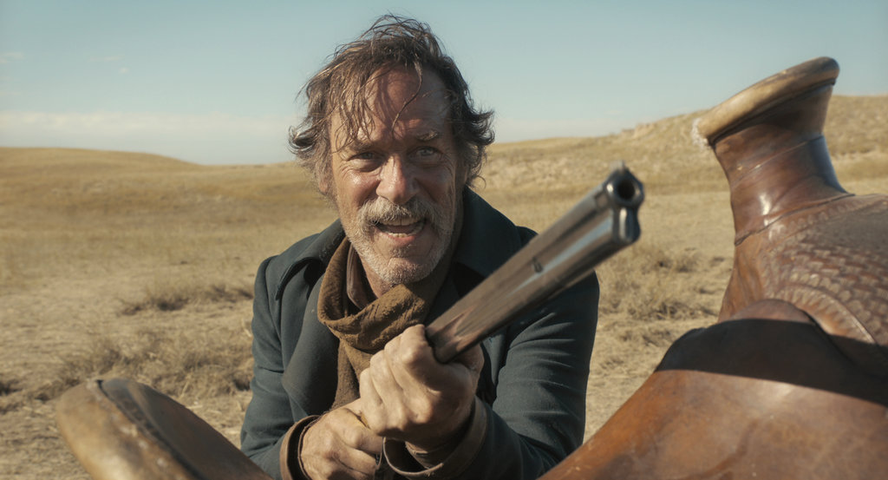

 Grainger Hines in “The Ballad of Buster Scruggs.”  Netflix

## ‘The Ballad of Buster Scruggs’ (2018)

The latest from Joel and Ethan Coen is an anthology film set in the Old West, a series of stories of varying length and style, some as short and simple as jokes, others with the richness and depth of a great short story. Our critic wrote, “[It swerves from goofy to ghastly so deftly and so often that you can’t always tell which is which](https://nyti.ms/2yXtCqd)," and what seems at first like a filmed notebook of ideas and orphans instead becomes something of a workshop; it’s a place for the Coens to try things, experimenting with new styles and moods, while also delivering the kind of dark humor and deliciously ornate dialogue that we’ve come to expect. (Admirers of this post-modern Western may also enjoy Sam Peckinpah’s classic “**[The Wild Bunch](https://www.netflix.com/title/70043348)**,” also on Netflix.)

 [Watch](https://www.netflix.com/title/80200267)

 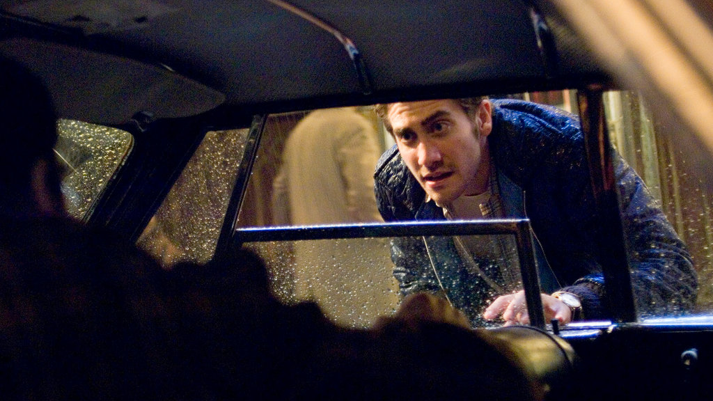
 Jake Gyllenhaal in “Zodiac.”  Merrick Morton/Paramount Pictures

## ‘Zodiac’ (2007)

Director David Fincher’s breakthrough film was the serial-killer thriller “Seven,” but he had no intention of repeating himself with this 2007 mystery. Because the real-life Zodiac killer was never apprehended or tried for his crime, Fincher sidestepped the big payoff of most true crime stories, crafting instead a film that focuses on the kind of obsessiveness it takes to follow that trail, year after year, without a satisfactory conclusion. Our critic called it “[at once sprawling and tightly constructed, opaque and meticulously detailed](https://nyti.ms/2upq8vB).”

 [Watch](https://www.netflix.com/title/70044686)

 

 Sam Sparks (voiced by Anna Faris) and Flint Lockwood (Bill Hader) in “Cloudy With a Chance of Meatballs.”  Sony Pictures Animation/Columbia Pictures

## ‘Cloudy With a Chance

of Meatballs’ (2009)

Flint Lockwood (energetically voiced by Bill Hader) creates a satellite that can turn water into food, transforming his forgotten fishing island into a gourmet destination and a tourist hot spot. But when the portions start to mutate into oversized super-foods, Flint has to find the courage to finish what he started. Anna Farris, James Caan, Mr. T and Bruce Campbell are the standouts in the voice cast, and while the little ones will love the images of hot dogs and spaghetti falling from the sky, there’s also a lesson to learn about being yourself and doing what’s right. Our critic called it “[a single serving of inspired lunacy](https://nyti.ms/2kZED66).” (For more family fun, queue up “[Happy Feet](https://www.netflix.com/title/70043941).”)

 [Watch](https://www.netflix.com/title/70113007)

 

 Kate Winslet and Jim Carrey in "Eternal Sunshine of the Spotless Mind.”  David Lee/Focus Features

## ‘Eternal Sunshine of the

Spotless Mind’ (2004)

This 2004 breakthrough film by Michel Gondry is a miraculous combination of science fiction ideas, romantic-comedy meet-cutes and lovelorn drama, somehow delivering on all counts. Working from a typically clever screenplay by Charlie Kaufman (“Being John Malkovich”), he tells the story of a perpetual sad sack (Jim Carrey) who subjects himself to an experimental procedure in hopes of erasing all memory of his ex-girlfriend (Kate Winslet). Our critics called it “[a wintry pop song of a film, one you want to play on repeat](https://nyti.ms/2t1IgqR)”; achingly melancholy yet riotously funny, it's one of the great romances of our scrambled age. (Kaufman's “**[Synecdoche, New York](https://www.netflix.com/title/70100407)**” is also on Netflix; for more of Carrey’s serious side, try “[The Truman Show](https://www.netflix.com/title/11819086).”)

 [Watch](https://www.netflix.com/title/60034545)

 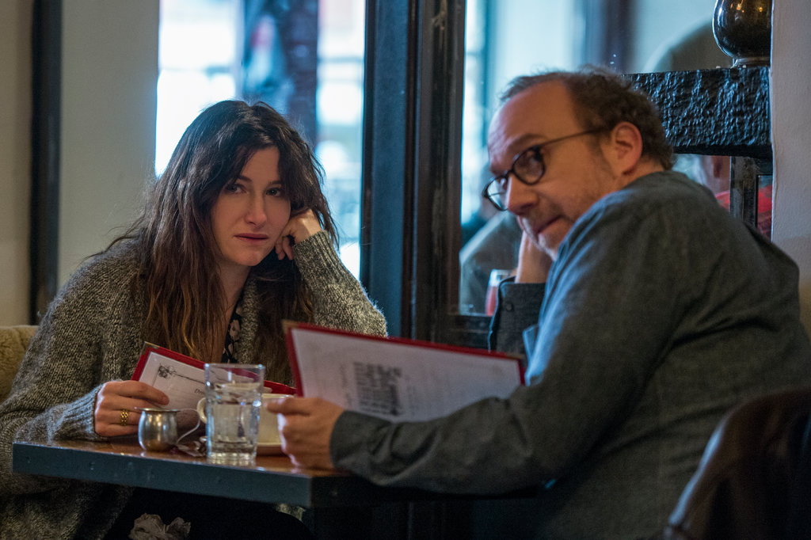

 Kathryn Hahn and Paul Giamatti in “Private Life.”  Jojo Whilden/Netflix

## ‘Private Life’ (2018)

Kathryn Hahn and Paul Giamatti shine as two New York creative types whose attempts to start a family — by adoption, by fertilization, by whatever it takes — test the mettle of their relationships and sanity. The wise script by the director Tamara Jenkins is not only funny and truthful but also sharply tuned to their specific world: Few films have better captured the very public nature of marital trouble in New York, when every meltdown is interrupted by passers-by and looky-loos. “Private Life,” which our critic called “[piquant and perfect](https://nyti.ms/2OznfCo),” is a marvelous balancing act of sympathy and cynicism, both caring for its subjects and knowing them and their flaws well enough to wink and chuckle.

 [Watch](https://www.netflix.com/title/80168222)

 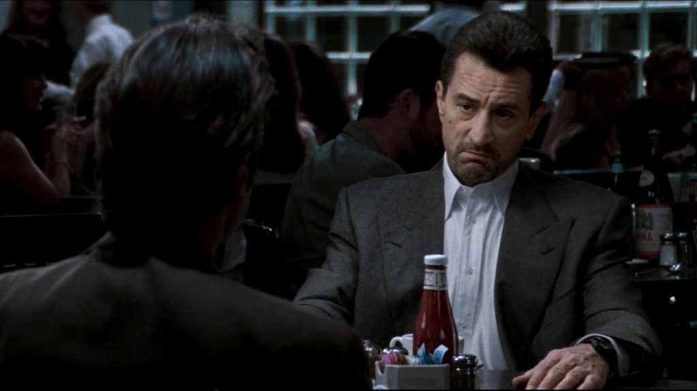
 Al Pacino, left, and Robert De Niro in "Heat."  Warner Bros.

## ‘Heat' (1995)

Al Pacino and Robert De Niro, twin titans of their acting generation, had [never shared the screen](https://www.nytimes.com/1995/07/27/movies/de-niro-and-pacino-star-in-a-film-together.html) before the writer and director [Michael Mann](https://www.nytimes.com/1995/12/24/movies/film-michael-mann-hot-again-with-la-vice.html) put them on opposite sides of the law in this moody, thrilling cops-and-robbers story from 1995 . But the best surprise is that there’s so much more to “Heat” than their Big Scene — it features a cool-as-a-cucumber heist scene, a heart-stopping shootout on the streets of Los Angeles, multiple meditations on the nature of obsession, stylish cinematography, and a jaw-dropping deep bench of supporting players. (Check out De Niro in another crime epic, “[**Once Upon a Time in America**](https://www.netflix.com/title/60028306),”** **on Netflix.)

 [Watch](https://www.netflix.com/title/70020509)

[      The truth is worth it.         See the stories](https://adclick.g.doubleclick.net/pcs/click?xai=AKAOjsuzD0fjjUgSX6BKS3L-5K1iz8B5akVJq-O-MsVSsyBoO6CBeHiehEAmkexgo-WeaOJ2shesHUoZpYLIaKwVaowYTmO2vG98u3AmPiQIFwkRiFJHa-PIlyireINlzPSY0RbJ5-5IvHqMv1fy5KbbxY3p8j_NQKB7G6Lq8lilUefHF8qy8gIVN5anw3PR_mBXcPN8Bd8HMX8R6vqmUZpglEiCGpW12YDxkkAXLjyI--c2ipzkjply5Yysl1ZKZi6HsYZBT7IhGfU&sig=Cg0ArKJSzDR7V5ssSRhKEAE&urlfix=1&adurl=https://ad.doubleclick.net/ddm/trackclk/N296811.6440THENEWYORKTIMESCOMPA/B22187340.237970964%3Bdc_trk_aid%3D435228218%3Bdc_trk_cid%3D111025435%3Bdc_lat%3D%3Bdc_rdid%3D%3Btag_for_child_directed_treatment%3D%3Btfua%3D)

 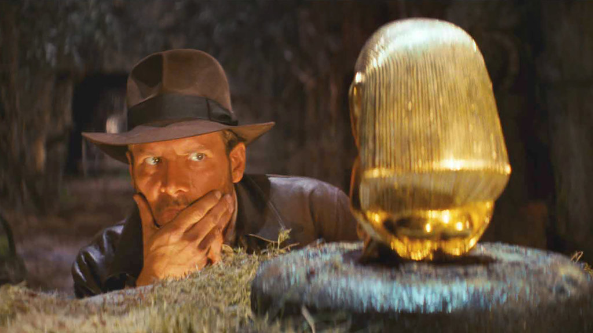

 Harrison Ford in “Raiders of the Lost Ark.”  Lucasfilm

## ‘Raiders of the Lost Ark’ (1981)

So much of this 1981 Steven Spielberg adventure has entered the realm of pop culture immortality — the rolling boulder, the melting Nazi face, the truck chase — that it’s easy to forget how fleet-footed, fresh and funny it is. Riffing on the Saturday afternoon serials that thrilled them as children, director Spielberg and producer George Lucas packed a full series of heroes, villains, cliffhangers and fisticuffs into a single crowd-pleasing feature. Our critic called it “[one of the most deliriously funny, ingenious and stylish American adventure movies ever made](https://www.nytimes.com/1981/06/12/movies/moviesspecial/raiders-of-the-lost-ark.html).” (For more of Dr. Jones, check out “**[Indiana Jones and the Temple of Doom](https://www.netflix.com/title/60010488)**” on Netflix.)

 [Watch](https://www.netflix.com/title/60011649)

 

 A scene from ”City of God.”  Miramax

## ‘City of God’ (2003)

This 2003 Oscar nominee from the director Fernando Meirelles renders its oft-told tale of neighborhood crime with such brash energy and intoxicating exuberance that it feels brand new. Meirelles and his co-director, Kátia Lund, construct their film as a slum-kids “Goodfellas”; like that film, “City of God” is based on true events, capturing the awful seductiveness of the criminal life and the dire consequences for those who choose it. Our critic called it a “[scorching anecdotal history of violence](https://www.nytimes.com/2003/01/17/movies/film-review-boys-soldiering-in-an-army-of-crime.html).”

 [Watch](https://www.netflix.com/title/60026106)

 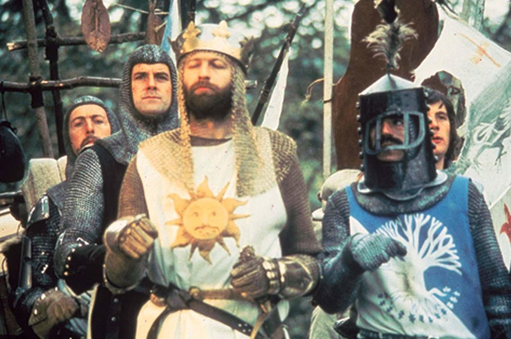

 From left, Eric Idle, John Cleese, Graham Chapman, Terry Jones and Michael Palin in “Monty Python and the Holy Grail.”  Sony Pictures Home Entertainment

## ‘Monty Python and the Holy Grail’ (1975)

The British comedy troupe Monty Python created its funniest, wildest and cult-friendliest feature-length comedy with this 1975 send-up of the legend of King Arthur — and of medieval literature in general, and of big-screen epics. Graham Chapman is the ostensible lead as Arthur, leading his Knights of the Round Table on a quest for the Grail, but the plot is merely a clothesline on which to hang blackout sketches and self-aware gags, and there are many. Our critic called it [“a marvelously particular kind of lunatic endeavor.”](https://www.nytimes.com/1975/04/28/archives/monty-python-and-the-holy-grail.html)(For more fun with Python, queue up the button-pushing 1979 Biblical spoof “**[Life of Brian](https://www.netflix.com/title/699257)**.”)

 [Watch](https://www.netflix.com/title/771476)

 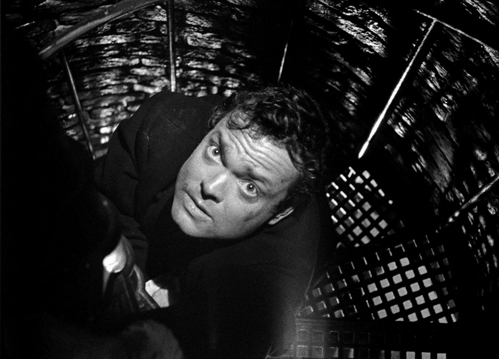

 Orson Welles in “The Third Man.”  Rialto Pictures

## ‘The Third Man’ (1950)

The director Carol Reed’s adaptation of the novel by Graham Greene depicts a struggling novelist (Joseph Cotton) who travels to Vienna to investigate the death of his old pal Harry Lime (Orson Welles), only to discover that there’s much more to the story than he’s been told. The stylish cinematography and unforgettable score help make this one of the finest of all noir films; [our critic](https://www.nytimes.com/1950/02/03/archives/the-screen-in-review-the-third-man-carol-reeds.html)called it “a bang-up melodrama.”(Fans of classic thrillers were also want to watch Hitchcock's “**[Strangers on a Train](https://www.netflix.com/title/70002912)**”; the Welles-directed “**[The Magnificent Ambersons](https://www.netflix.com/title/70001262)**” is also streaming on Netflix.)

 [Watch](https://www.netflix.com/title/1039377)

 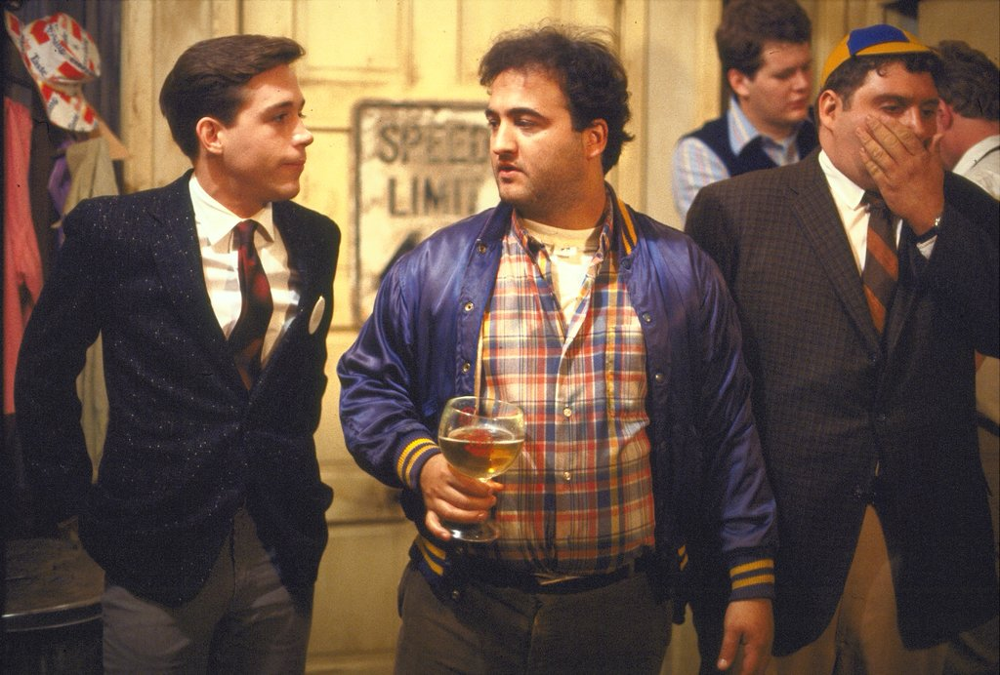

 From left, Tom Hulce, John Belushi and Stephen Furst in “National Lampoon’s Animal House.”  Universal Pictures

## ‘Animal House’ (1978)

This wild 1978 [blockbuster](https://www.nytimes.com/2018/05/01/movies/animal-house-oral-history.html)launched the film career of John Belushi, the “slobs vs. snobs” comedy subgenre and the mainstream aspirations of the subversive humor magazine National Lampoon. A deliriously funny rampage of food fights, toga parties, horse abductions and wrecked parades on a college campus circa 1962, with the director John Landis engagingly orchestrating the chaos and Belushi stealing every possible scene as the frat’s resident party animal. Our critic called it “[very funny, with gags that are effective in a dependable, all-purpose way](https://www.nytimes.com/1978/07/28/archives/screen-animal-housedaffy-deltas.html).”

 [Watch](https://www.netflix.com/title/60029400)

 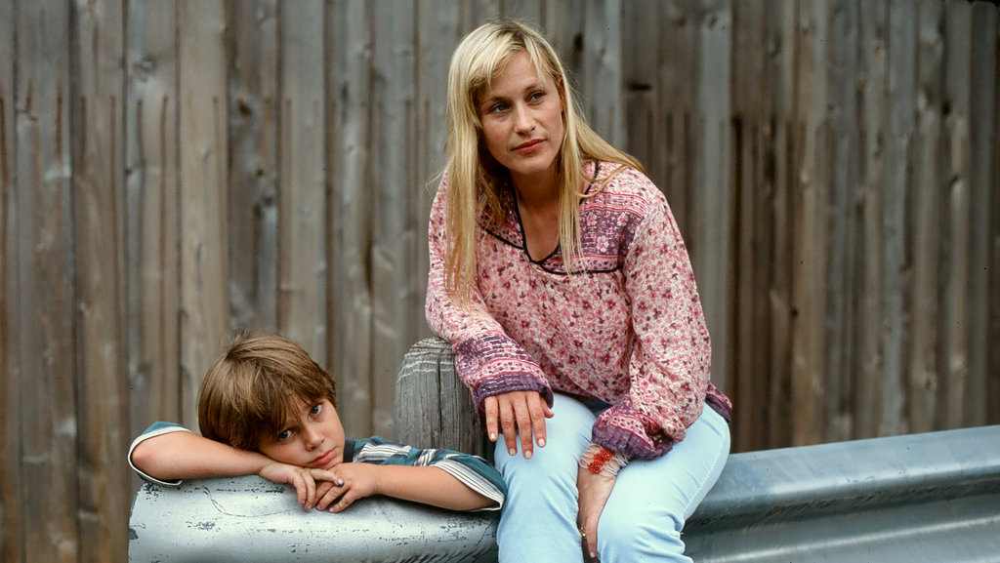
 Ellar Coltrane and Patricia Arquette in “Boyhood.”  Deana Newcomb/IFC FIlms

## ‘Boyhood’ (2014)

Over a 12-year period, the director Richard Linklater surreptitiously constructed “Boyhood” around the non-actor Ellar Coltrane, folding that boy’s development from age 6 to 18 into a fictional narrative about growing up under a devoted single mother (Patricia Arquette) and a father (Ethan Hawke) whose presence in his life is much less consistent. Watching Coltrane age is a uniquely powerful experience by itself, but Linklater keeps the frame open to larger developments in culture and politics, too, as well as to the particulars of family life in Texas. Manohla Dargis called it “[Mr. Linklater’s masterpiece](https://www.nytimes.com/2014/07/11/movies/movie-review-linklaters-boyhood-is-a-model-of-cinematic-realism.html).”(Love coming-of-age dramas? Try “**[Good Will Hunting](https://www.netflix.com/title/17405997)**” or “**[Mustang](https://www.netflix.com/title/80058482)**.”)

 [Watch](https://www.netflix.com/title/70301281)

 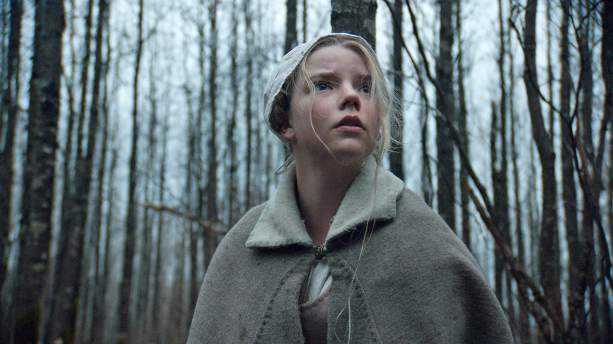

 Anya Taylor-Joy in “The Witch.”  A24

## ‘The Witch’ (2016)

A Puritan family, banished to the woods of New England by its community, encounters a frightening force of true evil in this potent mixture of art-house drama and supernatural thriller from the writer and director Robert Eggers. Resisting jump-scares and cheap thrills in favor of slow burns and discomforting dread, Eggers builds his story to a climax that seems both terrifying and inevitable. Our critic called it “[a finely calibrated shiver of a movie](https://www.nytimes.com/2016/02/19/movies/the-witch-review.html).” (For more arty horror, see “**[The Wailing](https://www.netflix.com/title/80108974)**;” if your tastes run more mainstream, try “**[Poltergeist](https://www.netflix.com/title/864808)**.”)

 [Watch](https://www.netflix.com/title/80037280)

 

 Uma Thurman in “Pulp Fiction.”  Linda R. Chen/Miramax Films

## ‘Pulp Fiction’ (1994)

Three crime stories — a hit man out to dinner with his boss’s wife, a boxer who decides not to throw the big fight and a contract killing gone awry — are shuffled like cards in a deck, told out of order and with delightful narrative curveballs in this 1994 hodgepodge from the writer-director Quentin Tarantino. He writes the kind of tasty, self-aware dialogue that actors love to devour, and he puts together an enviable ensemble cast of big names, fallen stars and rising talents to deliver it. Our critic calls it a work of “[depth, wit and blazing originality.](https://www.nytimes.com/1994/09/23/movies/film-festival-review-pulp-fiction-quentin-tarantino-s-wild-ride-life-s-dangerous.html)”

 [Watch](https://www.netflix.com/title/880640)

[      The truth is worth it.        See the stories](https://adclick.g.doubleclick.net/pcs/click?xai=AKAOjsvfDwI0z91kYly_oRwNAIOkjpw6MHnbtc2INDQarx2G9cr1T7av6Sbs5mj3aJjFCdT0RYqlwIdG-MuRJjMtKHjykBgsOS18eTirDOhv70DgU0qqj_7Fzqm8tZtP8BWuHeObvTIEuCtqfPLn3FFrFXIUnhDmrjZheafIRcAGYguT2eDFSUXE72weCV1fArCXOGI5RGlb4aJMED6jrtiA_m-YXEGris0mCEQPST-HkTnNvvcjICj2cBxgXs3ovRPr_6xADad85oQ&sig=Cg0ArKJSzFquSvJlrdw6EAE&urlfix=1&adurl=https://ad.doubleclick.net/ddm/trackclk/N296811.6440THENEWYORKTIMESCOMPA/B22187340.237970964%3Bdc_trk_aid%3D435228218%3Bdc_trk_cid%3D111025435%3Bdc_lat%3D%3Bdc_rdid%3D%3Btag_for_child_directed_treatment%3D%3Btfua%3D)

 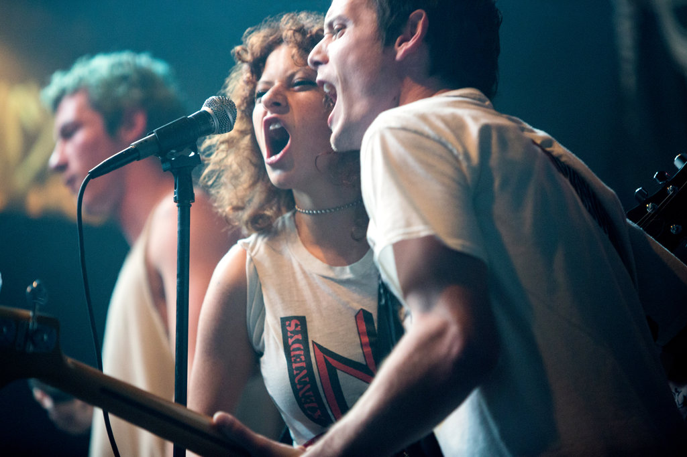

 From left, Callum Turner, Alia Shawkat and Anton Yelchin in “Green Room.”  Scott Patrick Green/A24

## ‘Green Room’ (2016)

A small-time punk band unknowingly books a gig at a white supremacist bar and quickly regrets the decision in this white-knuckle thriller. “Green Room” requires a strong stomach — the action leans grisly, and its portrayal of bigots pulls no punches — but the director [Jeremy Saulnier](https://www.nytimes.com/2016/04/10/movies/in-green-room-this-band-could-be-their-death.html) keeps the pace so taut and the filmmaking efficient, it leaves the viewer breathless. A.O. Scott called it “[a tense and nasty siege movie](https://www.nytimes.com/2016/04/15/movies/green-room-review.html).”

 [Watch](https://www.netflix.com/title/80060034)

 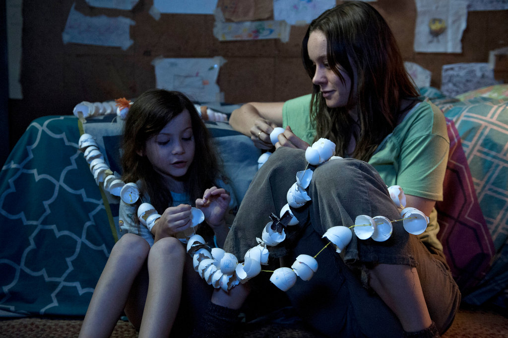
 Jacob Tremblay and Brie Larson in "Room."  George Kraychyk/A24

## ‘Room’ (2015)

Brie Larson won an Oscar for her powerful leading performance in this moving adaptation of the novel by Emma Donoghue, in which a woman held for years in captivity tries to escape from her kidnapper with the help of her young son. [Lenny Abrahamson’s intimate direction](https://www.nytimes.com/2015/10/30/movies/lenny-abrahamson-narrates-a-scene-from-room.html) emphasizes the claustrophobia of their surroundings, but tantalizes with the promise and possibility of escape. (For more Oscar-winning drama, stream “**[Milk](https://www.netflix.com/title/70100084)**,”**  **“**[The English Patient](https://www.netflix.com/title/477351)**” and “**[The King’s Speech](https://www.netflix.com/title/70135893)**.”)

 [Watch](https://www.netflix.com/title/80073823)

 

 Javier Bardem in “No Country For Old Men.”  Miramax Films

## ‘No Country For Old Men’ (2007)

Joel and Ethan Coen won their first Oscars for Best Picture and Best Director (and their second for Best Screenplay) for this gripping, moody, and darkly funny adaptation of Cormac McCarthy’s [dusty 2005 novel](https://www.nytimes.com/2005/07/20/arts/no-country-for-old-men.html). Telling the stories of a ruthless killer (Javier Bardem, who took home an Oscar for Best Supporting Actor), a morally flexible rancher (Josh Brolin) and a small-town sheriff (Tommy Lee Jones) whose paths cross when a border drug deal goes south, the Coens construct a Western contemporary in both its setting and style, setting the table for the standard stand-offs and shoot-outs, then turning those expectations inside out. Our critic called it “[bleak, scary and relentlessly violent](https://www.nytimes.com/2007/11/09/movies/09coun.html).”(For more crime with a whiff of Western, queue up “**[Hell or High Water](https://www.netflix.com/title/80108616)**.”)

 [Watch](https://www.netflix.com/title/70071613)

 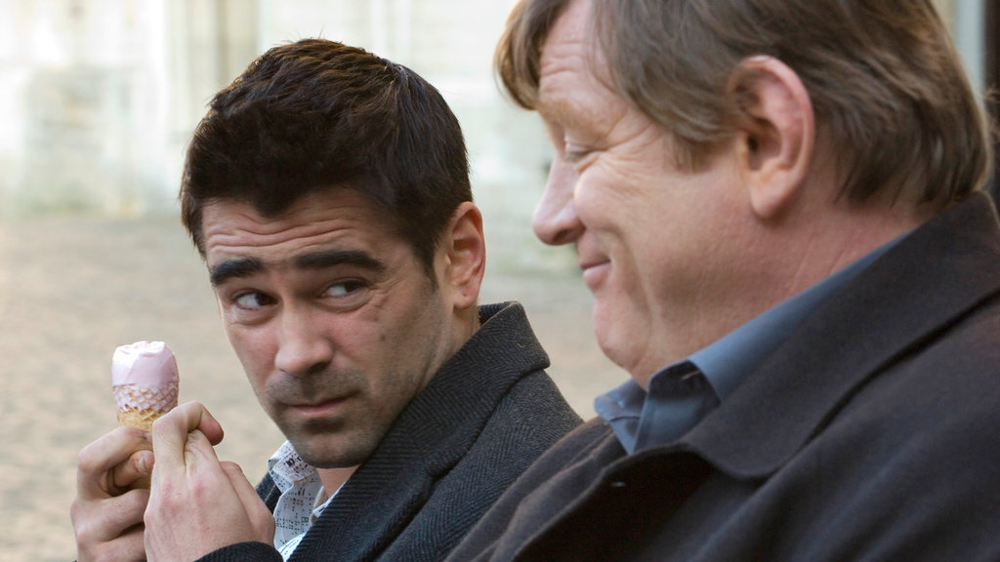

 Colin Farrell, left, and Brendan Gleeson in ”In Bruges.”  Jaap Buitendijk/Focus Features

## ‘In Bruges’ (2008)

Two contract killers are sent to the Belgian tourist town of Bruges to wait for their next mission in this sharp, witty cross between “Pulp Fiction” and “Waiting for Godot.” The writer-director [Martin McDonagh](https://www.nytimes.com/2008/01/13/movies/13gold.html) couches the existential dilemma of his hitmen characters in questions of Catholic guilt and redemption, and ends up with a picture far richer and more nuanced than the Tarantino rip-off promised by its ads. (For a somewhat sillier action/comedy with a similar setting, check out “**[Hot Fuzz](https://www.netflix.com/title/70056431)**.”)

 [Watch](https://www.netflix.com/title/70083111)

 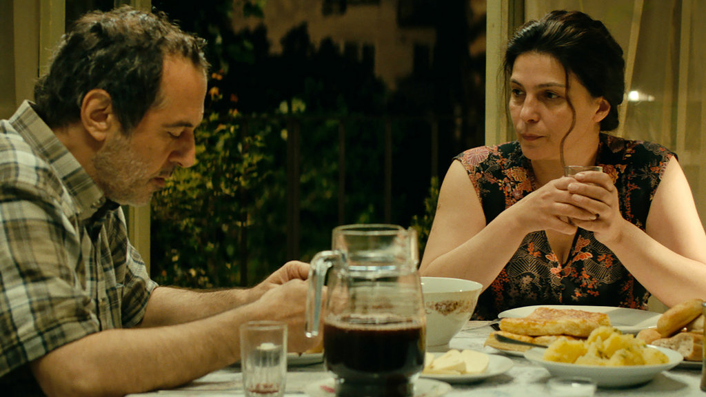

 Merab Ninidze and Ia Shugliashvili in “My Happy Family.”  Netflix

## ‘My Happy Family’ (2017)

A 52-year-old Georgian woman shocks her family, and her entire community, when she decides to move out of the cramped family apartment — leaving her husband, children and parents behind in order to finally begin a life of her own. “In this world, there are no families without problems,” she is told, and the conflicts of the script by Nana Ekvtimishvili (who also directed, with Simon Gross) are a sharp reminder that while the cultural specifics may vary, familial guilt and passive aggression are bound by no language. Manohla Dargis praised its “[sardonically funny, touching key](https://www.nytimes.com/2017/03/14/movies/the-9-new-directors-you-need-to-watch.html).” (For more critically acclaimed foreign drama, try the Oscar nominated Hungarian film “**[On Body and Soul](https://www.netflix.com/title/80177414)**” or Guillermo del Toro’s Spanish smash “**[Pan’s Labyrinth](https://www.netflix.com/title/70050507)**.”)

 [Watch](https://www.netflix.com/title/80171247)

 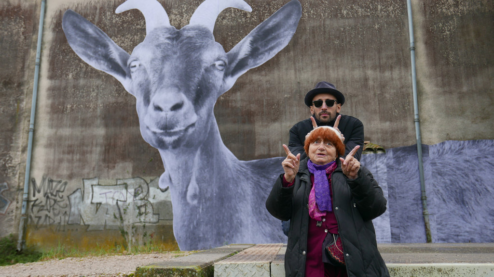
 Agnès Varda and JR in “Faces Places.”  Cohen Media Group

## ‘Faces Places’ (2017)

The legendary filmmaker [Agnès Varda](https://www.nytimes.com/2018/03/01/movies/agnes-varda-oscars.html) teamed with the French visual artist known only as J.R. for this charming 2017 documentary, capturing their journey across rural France, where they explore themes of artistic fulfillment, collaboration, small-town life and (inevitably) mortality and legacy. “Despite its unassuming, conversational ethos,” wrote A.O. Scott, “‘Faces Places’ reveals itself as [a powerful, complex and radical work](https://www.nytimes.com/2017/10/05/movies/review-faces-places-agnes-varda-jr-travel-in-the-present-glancing-at-the-past.html).”(Netflix is also streaming the acclaimed documentaries “**[13TH](https://www.netflix.com/title/80091741)**” and “**[Icarus](https://www.netflix.com/title/80168079)**.”)

 [Watch](https://www.netflix.com/title/80194288)

 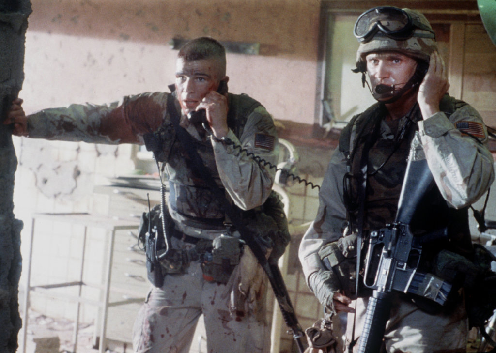

 Josh Hartnett, left, and Gregory Sporleder in “Black Hawk Down.”  Sidney Baldwin/Columbia Pictures

## ‘Black Hawk Down’ (2001)

The journalist Mark Bowden wrote about the 1993 United States military raid in Mogadishu, Somalia, in his [1999 non-fiction](http://movies2.nytimes.com/books/99/03/14/reviews/990314.14finnegt.html) book of the same name. That book took its title from the downing of two American helicopters that raised the stakes of the mission, and this [film adaptation](https://www.nytimes.com/2001/12/16/movies/film-war-without-any-answers.html) from the director Ridley Scott dramatizes that harrowing episode and the battle that followed with horrifying immediacy and visceral terror. Scott manages, as few filmmakers have, to capture the feeling of helplessness that armed conflict can provoke and the camaraderie that becomes the foot soldier’s last hope.

 [Watch](https://www.netflix.com/title/60022056)

 

 Russell Crowe, left and Guy Pearce in “L.A. Confidential.”  Warner Bros.

## ‘L.A. Confidential’ (1997)

Set in the razzle-dazzle of 1950s Los Angeles, this best picture nominee from 1997 is a cracklingly good mystery, featuring framed-up murders, dirty cops, shady tabloid reporters, and crooked politicos. But this isn’t just a good yarn; the director Curtis Hanson understands (as James Ellroy did in [the source novel](https://www.nytimes.com/1990/07/15/books/crime-302290.html)) that this is a story about the roots of corruption in the Los Angeles Police Department, and beyond. Our critic called it “[a tough, gorgeous, vastly entertaining throwback](https://www.nytimes.com/1997/09/19/movies/film-review-the-dark-underbelly-of-a-sunny-town.html).”(For another adaptation of first-rate crime fiction, try Ben Affleck’s take on Dennis Lehane’s “**[Gone Baby Gone](https://www.netflix.com/title/70065115)**.”)

 [Watch](https://www.netflix.com/title/1154856)

 

 Justin Timberlake in “Justin Timberlake and the Tennessee Kids.”  Netflix

## ‘Justin Timberlake + the

Tennessee Kids’ (2016)

Jonathan Demme’s final feature film was shot on the last two nights of Justin Timberlake’s “20/20 Experience” world tour, at the MGM Grand in Las Vegas. The pairing of director and subject is unexpected, but Demme is up to the job; as in his Talking Heads film “[Stop Making Sense](https://www.nytimes.com/1984/10/19/movies/movies-talking-heads-in-stop-making-sense.html),” he [deftly captures](https://www.nytimes.com/2017/04/26/arts/music/jonathan-demme-music-moments.html) the energy, electricity and playfulness of a live concert performance, a directorial feat that is harder than it looks. (For a grittier music documentary, check out “**[Metallica: Some Kind of Monster](https://www.netflix.com/title/80174429)**” or “**[Anvil! The Story of Anvil](https://www.netflix.com/title/70084229).**”)

 [Watch](https://www.netflix.com/title/80127559)

 
 A scene from “The Little Prince.”  Netflix

## ‘The Little Prince’ (2016)

Director Mark Osborne (“Kung Fu Panda”) took an unconventional approach to adapting the [classic children’s book](https://www.nytimes.com/1943/04/11/archives/a-prince-of-lonely-space-the-little-prince-written-and-drawn-by.html) by Antoine de Saint-Exupéry for the screen, placing its story of an aviator’s encounters with a magical little boy inside a contemporary tale of a little girl’s friendship with that aviator (now a grizzled old man). It sounds like a recipe for disaster, fixing a book that isn’t broken, but “The Little Prince” is a small miracle, maintaining the magic and sweetness of the original while contextualizing it for a new generation. Our critic called it “[unusually forceful and imaginative](https://www.nytimes.com/2016/08/05/movies/the-little-prince-review.html).” (Viewers looking for more offbeat family fun should try “***[Coraline](https://www.netflix.com/title/70105599)***” or **“[Billy Elliot](https://www.netflix.com/title/60003378)**.”)

 [Watch](https://www.netflix.com/title/80057578)

 

 A depiction of Police Officer Houston McCoy (voiced by actor Blair Jackson) in “Tower.”  Kino Lorber

## ‘Tower’ (2016)

This unconventional and mesmerizing documentary by director Keith Maitland re-enacts and animates eyewitness testimony of the [harrowing afternoon in 1966](https://timesmachine.nytimes.com/timesmachine/1966/08/02/82498772.html?zoom=16) when Charles Whitman opened fire from the University of Texas clock tower. The approach jolts this half-century-old story into the urgent present: Without the distance created by scratchy, old black-and-white news clips, this story of a terrifying school shooting feels uncomfortably of-the-moment. Our critic called it “[haunting](https://www.nytimes.com/2016/10/12/movies/tower-review-mass-shootings.html).” (Documentary fans should also seek out “**[Blackfish](https://www.netflix.com/title/70267802)**,” “**[The Look of Silence](https://www.netflix.com/title/80016401)**,” and “**[Jiro Dreams of Sushi](https://www.netflix.com/title/70181716)**.”)

 [Watch](https://www.netflix.com/title/80103666)

 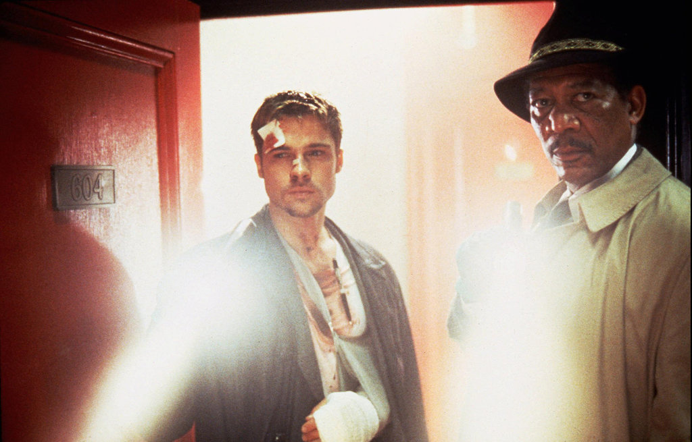
 Brad Pitt, left, and Morgan Freeman in “Seven.”  Peter Sorel/New Line Cinema

## ‘Seven’ (1995)

A serial killer is terrorizing a grim metropolis and playing a bit of a game in the process: Each of his victims is, by his reckoning, guilty of one of the Seven Deadly Sins and dies in a corresponding manner. What could have been a gimmicky thrill-ride or a businesslike police procedural is instead rendered a skin-crawling portrait of urban ennui by director David Fincher (his breakthrough feature), whose potent images of a perpetually gray and rainy cityscape are all of a piece with the hopelessness at the story’s center.

 [Watch](https://www.netflix.com/title/950149)

[      The truth is worth it.         See the stories](https://adclick.g.doubleclick.net/pcs/click?xai=AKAOjstuluWdf4QIJR-3MTAEDIF8y3XPQroxa43u2rlqIKwy8B9OitL66TG5OXfJhVp0HeZQvttD0R_XO7XtxVTwsRr_eY983_uCZFyMoRji-0uLdsUMe7Hq9Ux2dZNLnaRGqkejbpjNLe30ntoGzrUokMFUU-Hb3dXfqs4Y9Xm0-LXR85l_AS_qCc05NcWGJPYHpDiRIxCqQ8ZPMeSOeP6xGHcO3a0yICUQunx2CBvUyMLSZj2CffBTMoH8PwTsA2E21hWLK-AxXWE&sig=Cg0ArKJSzCbbEGIqNfylEAE&urlfix=1&adurl=https://ad.doubleclick.net/ddm/trackclk/N296811.6440THENEWYORKTIMESCOMPA/B22187340.237970964%3Bdc_trk_aid%3D435228218%3Bdc_trk_cid%3D111025435%3Bdc_lat%3D%3Bdc_rdid%3D%3Btag_for_child_directed_treatment%3D%3Btfua%3D)

 

 A scene from “Moon.”  Sony Pictures Classics

## ‘Moon’ (2009)

This brainy sci-fi story from director [Duncan Jones](https://www.nytimes.com/2009/06/07/movies/07itzk.html) (“Mute”) is almost entirely a one-man show, and Sam Rockwell, as a working-class astronaut on a solo mission, is the man for the job — he’s alternately tragic, funny, driven and bitter, often in the same scene, frequently playing to himself. “Moon” is thrilling and thought-provoking, with a stunning finale. Our critic called it a “[modest, haunting first feature](https://www.nytimes.com/2009/06/12/movies/12moon.html).”(For more science fiction, check out “**[Ex Machina](https://www.netflix.com/title/80023689)**”; for science non-fiction, try “**[Apollo 13](https://www.netflix.com/title/262866)**.”)

 [Watch](https://www.netflix.com/title/70112500)

 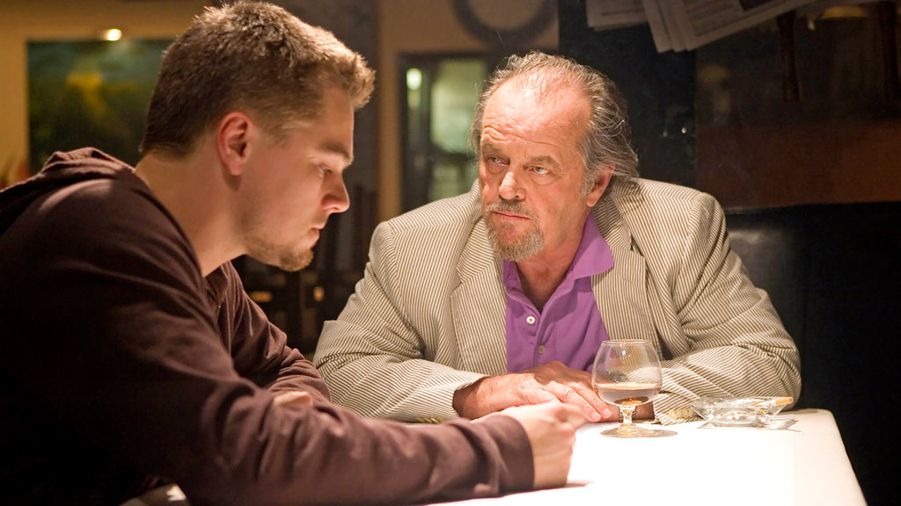

 Leonardo DiCaprio, left, and Jack Nicholson in “The Departed.”  Andrew Cooper/Warner Bros. Pictures

## ‘The Departed’ (2006)

Relocating the 2002 international hit “[Infernal Affairs](https://www.nytimes.com/2004/09/24/movies/loyalty-and-betrayal-with-detectives-caught-in-a-web.html)” from Hong Kong to Boston, this 2006 Best Picture winner tells the intertwining stories of a tough young cop (Leonardo DiCaprio) who goes undercover to infiltrate the crew of a local Mob boss (Jack Nicholson), just as his surrogate son (Matt Damon) goes undercover in the Boston Police Department. The possibilities for deception and unmasking are endless, and the director Martin Scorsese mines the tension from every angle while investing the central predicaments with psychological nuance and dark humor. Our critic praised “[the speed and Mr. Scorsese’s sureness of touch](https://www.nytimes.com/2006/10/06/movies/06depa.html).” (For more superb late-period Scorsese, we recommend “**[The Aviator](https://www.netflix.com/title/70011213)**”; co-star Mark Wahlberg also shines in another Boston-set drama, “**[The Fighter](https://www.netflix.com/title/70113534)**.”)

 [Watch](https://www.netflix.com/title/70044689)

 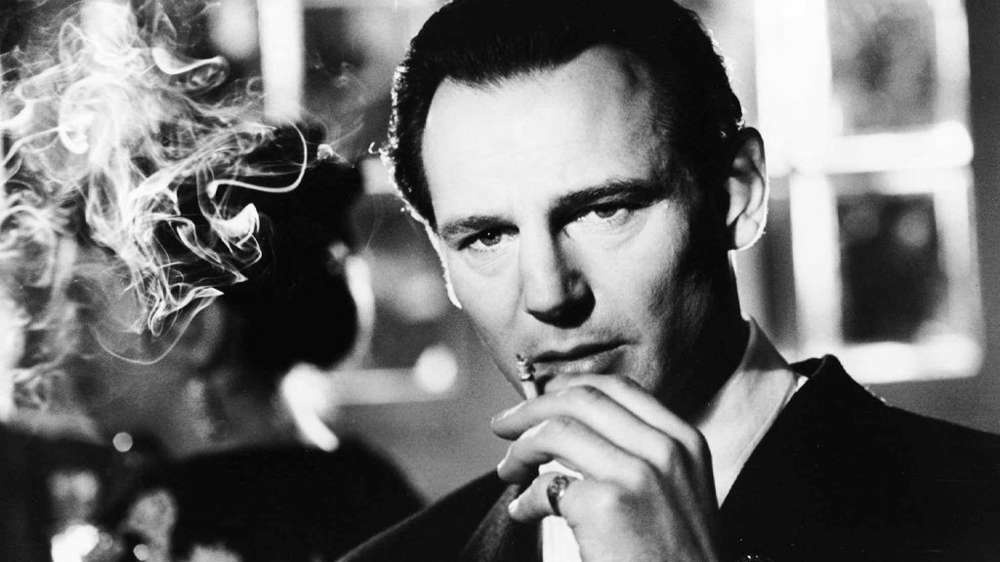

 Liam Neeson in “Schindler’s List.”  David James/Universal Pictures

## ‘Schindler’s List’ (1993)

After almost 20 years of popcorn moviemaking, Steven Spielberg [proved himself](https://archive.nytimes.com/www.nytimes.com/packages/html/movies/bestpictures/schindler-ar1.html) to be not only a serious dramatist but also one of our most gifted historical chroniclers with this 1993 film. In it, he tells the true story of Oskar Schindler (Liam Neeson), a German businessman and member of the Nazi party who became the unlikely savior of more than 1,000 Jewish workers in his factories. Our critic wrote that Spielberg directed the film “[with fury and immediacy](https://www.nytimes.com/1993/12/15/movies/review-film-schindler-s-list-imagining-the-holocaust-to-remember-it.html).” (For more historical drama from Spielberg, queue up “***[Lincoln](https://www.netflix.com/title/70251896)***.”)

 [Watch](https://www.netflix.com/title/60036359)

 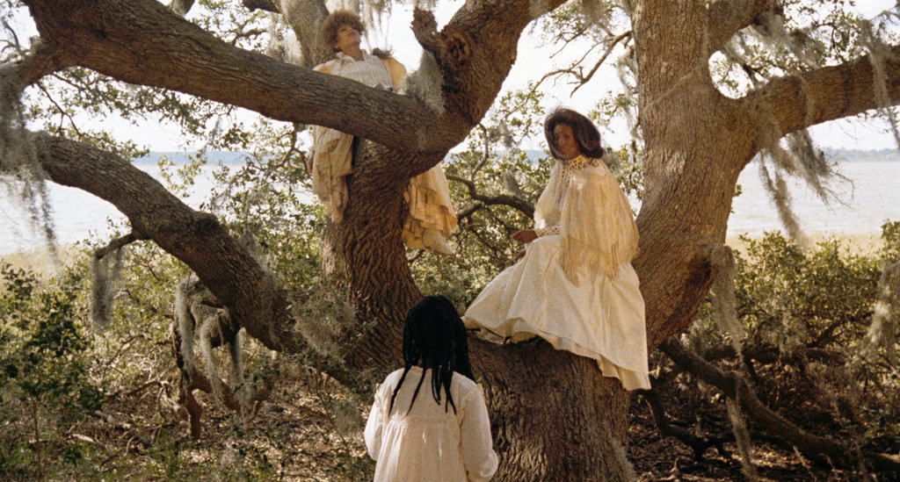

 Clockwise from top, Trula Hoosier, Barbara-O and Alva Rogers in “Daughters of the Dust.”  Cohen Film Collection

## ‘Daughters of the Dust’ (1992)

This historical drama from writer-director Julie Dash proved something of a challenge for general audiences when it was originally released in 1991. But its reputation has grown in the years since (thanks, in no small part, to the [explicit homage](https://www.nytimes.com/2016/11/20/movies/julie-dash-daughters-of-the-dust.html) paid to it by Beyoncé’s “Lemonade”), elevating it to its proper place among the most important independent films of its era. Our critic called it “[a film of spellbinding visual beauty](https://www.nytimes.com/1992/01/16/movies/review-film-daughters-of-the-dust-the-demise-of-a-tradition.html).” (If you like gorgeous period pieces, try “**[The Immigrant](https://www.netflix.com/title/70275521)**.)

 [Watch](https://www.netflix.com/title/60001104)

**X**
ADCHOICES IDENTIFIED

 

 

One gift. Endless insight.

Give The New York Times for up to 40% less.

see my options

[(L)](https://adclick.g.doubleclick.net/pcs/click%253Fxai%253DAKAOjsshDtM1P-2ac-jpFoy4HPWfeq_SBqb1e-qEk6D92sBY1124N06w61mbO_F6sDdMIchws_-v7O7_KkzygGgVNzZxx-z645sjmapT7Px216h9xz0CFVUKZ8fStPxelv-XDMwrZ7tpC2ARTpp91s7gJo-ujOgiZz2ESp3Ds4OaMkrpz3CrQzb9uDqUApBBaK70ZVkOlSlF661H6Kjbm6zWYeUMzSHvUMBDr2LIZIijjUXkFEC5B-rSFBsoPZAh8yakabM5sfq3sVs%2526sig%253DCg0ArKJSzIhHyKd-2tk_EAE%2526urlfix%253D1%2526adurl%253Dhttps://ad.doubleclick.net/ddm/trackclk/N296811.6440THENEWYORKTIMESCOMPA/B22283637.240432619%3Bdc_trk_aid%3D437400224%3Bdc_trk_cid%3D112366959%3Bdc_lat%3D%3Bdc_rdid%3D%3Btag_for_child_directed_treatment%3D%3Btfua%3D)

 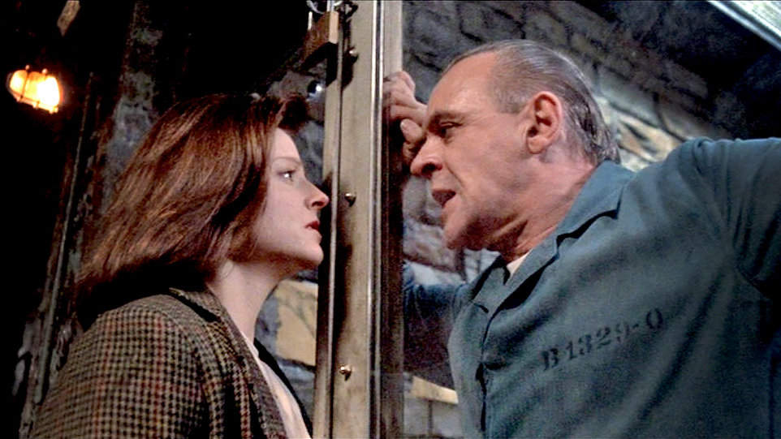

 Jodie Foster and Anthony Hopkins in “The Silence of the Lambs.”  Orion Pictures

## ‘The Silence of the Lambs’ (1991)

Few fictional characters have embedded themselves in the pop culture consciousness as firmly as Dr. Hannibal Lecter, the brilliant monster brought to bone-chilling life by an Oscar-winning Anthony Hopkins in [Jonathan Demme’s 1991 adaptation](https://archive.nytimes.com/www.nytimes.com/packages/html/movies/bestpictures/lambs-ar3.html)of [Thomas Harris’ bestseller](https://www.nytimes.com/1988/08/15/books/books-of-the-times-the-return-of-hannibal-the-cannibal.html). The film also won awards for Best Picture, Best Director, Best Screenplay, and Best Actress – a quintuple play only matched two other times in film history – all deserving, none perhaps more so than Jodie Foster, whose indelible portrayal of the rookie F.B.I. investigator Clarice Starling sharply combines small-town naiveté with quick-witted strength. Our critic called it “[pop film making of a high order](https://www.nytimes.com/1991/02/14/movies/review-film-methods-of-madness-in-silence-of-the-lambs.html).”

 [Watch](https://www.netflix.com/title/14546747)

 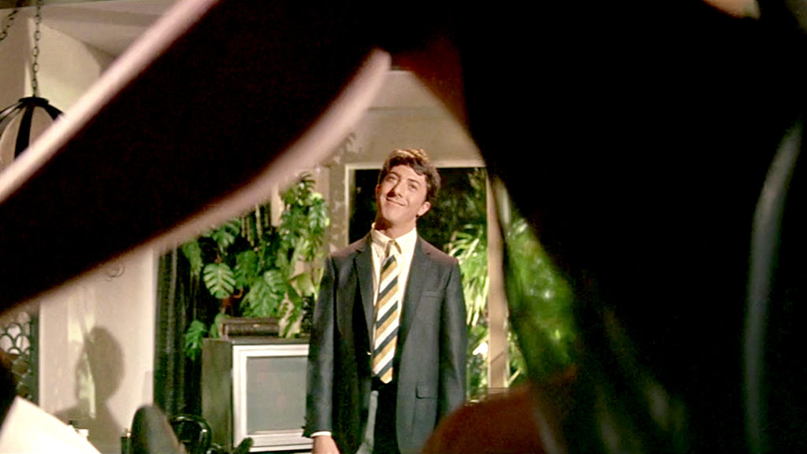

 Dustin Hoffman in “The Graduate.”  MGM

## ‘The Graduate’ (1968)

This wryly funny drama from Mike Nichols, adapted from the novel by Charles Webb, has become such an entrenched piece of popular culture (50-plus years later, you still don’t have to explain what “Mrs. Robinson” means), it is easy to lose track of what a great *entertainment* it is. But it is: Using Dustin Hoffman as his marvelously dry-witted vessel, Nichols dramatizes youthful ennui with a skill rarely seen in American cinema. Our critic called it “[funny, outrageous, and touching](https://books.google.com/books?id=55qlWjbs14sC&lpg=PA403&dq=%22Funny%2C%20outrageous%2C%20and%20touching%2C%22&pg=PA404#v=onepage&q=%22Funny,%20outrageous,%20and%20touching,%22&f=false).” (Another classic coming-of-age movie, Elia Kaznan’s “**[East of Eden](https://www.netflix.com/title/60010310)**,” is also streaming on Netflix.)

 [Watch](https://www.netflix.com/title/555221)

 

 A scene from “Jaws.”  Universal Studios

## ‘Jaws’ (1975)

Steven Spielberg had only a single feature and a handful of TV credits to his name when he was handed the task of adapting a pulpy best seller about a killer shark. The famously troubled production, which went weeks over schedule and millions over budget, forced the director to rely more on suspense and characterization than on special effects. The rest is [cinema history](https://www.nytimes.com/2013/08/04/magazine/stop-blaming-jaws.html). The scary moments are breathlessly executed, but our attachment to the three protagonists (wonderfully brought to life by Richard Dreyfuss, Roy Scheider and Robert Shaw) renders the stakes far higher than in your standard blockbuster. (For more classic action, try “**[The Terminator](https://www.netflix.com/title/1032625)**.”)

 [Watch](https://www.netflix.com/title/60001220)

 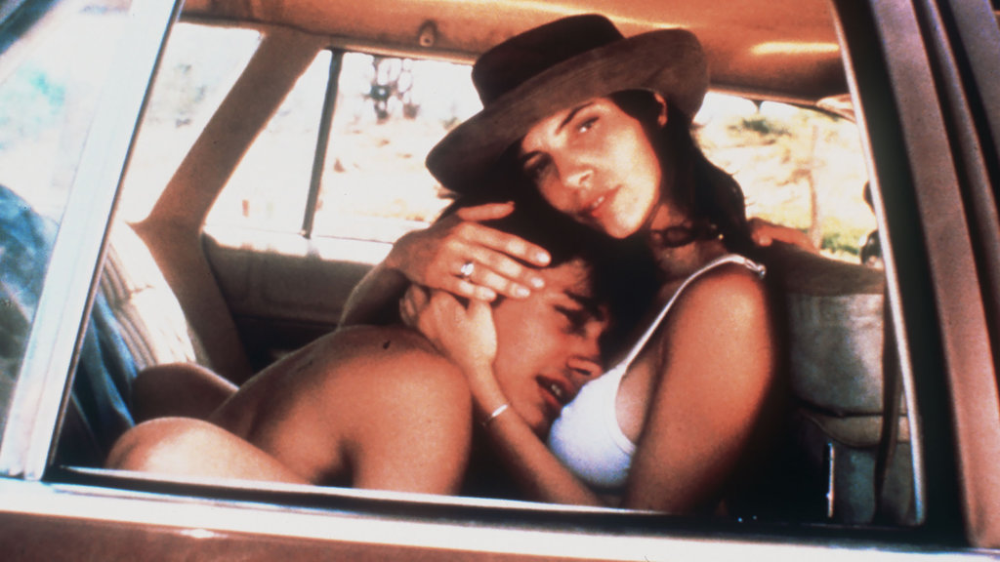

 Gael García Bernal and Maribel Verdu in the film “Y Tu Mamá También.”  Daniel Daza/IFC Films

## ‘Y Tu Mamá También’ (2002)

It sounds like the setup for an ’80s sex comedy: Two horny teenage boys take an impromptu road trip and talk a seductive older woman into coming along. But director [Alfonso Cuarón](https://www.nytimes.com/2002/03/17/movies/film-comedy-of-a-sexual-provocateur.html)(“Gravity,” “Children of Men”), “Y Tu Mamá También” frames their story partly through the unexpected but effective lens of class and political struggle, constructing a delicate film with much to say about masculinity, poverty and mortality. And *then* it’s sexy, on top of that. Our critic called it “[fast, funny, unafraid of sexuality and finally devastating](https://www.nytimes.com/2002/03/15/movies/film-review-the-empty-ambitions-of-macho-teenagers.html).”(For more adventurous foreign cinema, check out “[**Happy as Lazarro**](https://www.netflix.com/title/81004245)” or “**[Incendies](https://www.netflix.com/title/70152488)**.”)

 [Watch](https://www.netflix.com/title/60023237)

 
 Rooney Mara in “Carol.”  Weinstein Company

## ‘Carol’ (2015)

Patricia Highsmith’s lesbian romance novel “[The Price of Salt](https://www.nytimes.com/2015/11/15/movies/solving-the-many-mysteries-of-what-became-carol.html),” originally written under the pseudonym Claire Morgan, is sensitively and intelligently adapted by director Todd Haynes into this companion to his earlier masterpiece “Far From Heaven.” Cate Blanchett is smashing as a suburban ‘50s housewife who finds herself so intoxicated by a bohemian shopgirl (an enchanting [Rooney Mara](https://www.nytimes.com/2015/11/01/movies/rooney-mara-wears-her-provocative-part-well-in-carol.html)) that she’s willing to risk her entire comfortable existence in order, just once, to follow her heart. Our critic said it’s “[at once ardent and analytical, cerebral and swooning](https://www.nytimes.com/2015/11/20/movies/review-carol-explores-the-sweet-science-of-magnetism.html).” (**“**[**Quiz Show**](https://www.netflix.com/title/885825)**”** is another must-see drama set in the 1950s; Mara also does stellar work in “[**Her**](https://www.netflix.com/title/70278933).”)

 [Watch](https://www.netflix.com/title/80058700)

 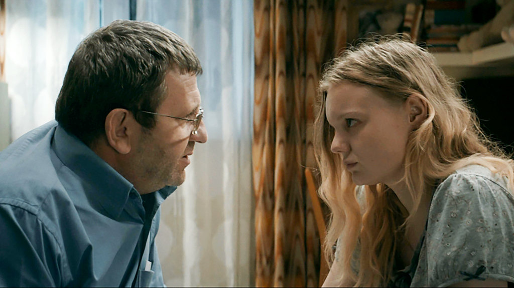
 Adrian Titieni and Maria-Victoria Dragus in “Graduation.”  Sundance Selects

## ‘Graduation’ (2017)

The films of the Romanian auteur Cristian Mungiu (which include “[4 Months, 3 Weeks and 2 Days”](https://www.nytimes.com/watching/recommendations/4-months-3-weeks-and-2-days) and “Beyond the Hills”) are in many ways morality plays, a practice he forcefully advances in his most recent effort. Through a bleak and crumbling post-Soviet cityscape, the film follows a well-to-do doctor (Adrian Titieni) whose daughter (Maria Dragus) is assaulted just before her college-entrance exams; as he attempts to rescue her future, however, his efforts lead him down a darkening path that obscures his sense of right and wrong. A.O. Scott called the film “[nerve-racking and humane](https://www.nytimes.com/2017/04/06/movies/graduation-review.html).”

 [Watch](https://www.netflix.com/title/80107018)

 
 A scene from “Mudbound.”  Steve Dietl/Netflix

## ‘Mudbound’ (2017)

The fates of two families — one white and one black, connected by a plot of land one owns and the other sharecrops — are inextricably intertwined in this [powerful adaptation](https://www.nytimes.com/2017/11/03/movies/mudbound-mary-j-blige-dee-rees-carey-mulligan-garrett-hedlund.html)by director Dee Rees of [the novel](https://www.nytimes.com/2008/03/20/books/20newly.html)by Hillary Jordan. Rees gracefully tells both stories (and the larger tale of postwar America) without veering into didacticism, and her ensemble cast brings every moment of text and subtext into sharp focus. Our critic called it a work of “[disquieting, illuminating force](https://www.nytimes.com/2017/11/16/movies/mudbound-review-dee-rees.html).” (Co-star Carey Mulligan also impresses in another period drama, “**[An Education](https://www.netflix.com/title/70113948)**.”)

 [Watch](https://www.netflix.com/title/80175694)

 

 Uma Thurman in “Kill Bill: Vol. 1.”  Andrew Cooper/Miramax Films

## ‘Kill Bill, Vol. 1’ (2003)

/ ‘Kill Bill, Vol. 2’ (2004)

Paying loving tribute to the exploitation movies of multiple eras and cultures, this double-feature dabbles in kung fu, anime, spaghetti Western and blaxploitation, its writer/director Quentin Tarantino deliriously hopping styles like a movie-crazy kid swapping out VHS tapes. But in all the pyrotechnics, he maintains his gift for quotable dialogue and charismatic characters, ending his blood-soaked saga with on a surprisingly warm and human note. Our critics praised the “[odd, feverish integrity](https://www.nytimes.com/2003/10/10/movies/film-review-blood-bath-beyond.html)” of “Vol. 1,” and called “Vol. 2” “[the most voluptuous comic-book movie ever made](https://www.nytimes.com/2004/04/16/movies/film-review-vengeance-still-mine-saieth-the-lethal-bride.html).”(Fans of high-intensity action should also queue up “[**Train to Busan**](https://www.netflix.com/title/80117824)” and “**[The Dirty Dozen](https://www.netflix.com/title/445422)**.”)

 [Watch](https://www.netflix.com/title/60031236)

[](https://adclick.g.doubleclick.net/pcs/click?xai=AKAOjss3j0JevauiZJaY7tE-zD9IA1vT6RVUH8OQ0WAMjj-B1FMieQMKcWu96wuKzwEf4_M1ppTwESygqUnwmS4tGwDnGgHNFKywrHjPdZg4AM3ggywEBeMN7VzzPd-DGFkTKCqW2g9n13B6dmeC3Z1GZQpK-ilEWFECHFUgxYF5AcCQMA17Uo7FaGN8Eh0RLLvJhxZKx4ZFEBnDzWR9AmS6j-SMpyO27BQm-J6nQco5Hg8TngmLJRVAqTW5BtrR5103DrPdrMdAD18J&sig=Cg0ArKJSzHlbv0eiG0i0EAE&urlfix=1&adurl=https://servedby.flashtalking.com/click/8/103871;3607516;2517715;210;0/?ft_impID=9A9775E2-E7B8-05E3-6FCD-F993604A3A65&g=36904446545107&random=643335654&ft_width=970&ft_height=250&url=https://www.phillips.com/art-unbound-signup?utm_source=nyt&utm_medium=banner&utm_campaign=sp19_corporate_brand)

 

 Jeremy Renner in “The Hurt Locker.”  Summit Entertainment

## ‘The Hurt Locker’ (2009)

Winner of the Oscar for best picture of 2009 (and for best director for Kathryn Bigelow), this harrowing war drama concerns a team of specialists trained in on-the-ground bomb diffusion in Iraq — with a particular focus on Staff Sgt. William James (Jeremy Renner), who’s a bit of a loose cannon. Bigelow mines palpable, sweaty tension from this terrifying work, but she doesn’t settle for cheap thrills; the film is most intense when dealing with James’s internal conflicts and his psychological battles with his team. Manohla Dargis called it “[a viscerally exciting, adrenaline-soaked tour de force](https://www.nytimes.com/2009/06/26/movies/26hurt.html).”

 [Watch](https://www.netflix.com/title/70105601)

 

 Jennifer Lawrence in “Winter’s Bone.”  Sebastian Mlynarski/Roadside Attractions

## ‘Winter’s Bone’ (2010)

A young sitcom actress named Jennifer Lawrence burst into the moviemaking mainstream with her tough, memorable performance in this 2010 indie drama from the director [Debra Granik](https://www.nytimes.com/2010/05/02/movies/02granik.html). Lawrence is startlingly good as a 17-year-old who’s in way over her head, trying desperately to save her family home and track down her father in the meth-ravaged rural Ozarks of Missouri. Our critic called it “[straightforward and suspenseful but also surprising and subtle](https://www.nytimes.com/2010/06/11/movies/11winter.html).” (Indie drama lovers may also enjoy “**[Personal Shopper](https://www.netflix.com/title/80106984)**.”)

 [Watch](https://www.netflix.com/title/70129374)

 

 Elizabeth Banks and Steve Carell in “The 40-Year-Old Virgin.”  Suzanne Hanover/Universal Pictures

## ‘The 40-Year-Old Virgin’ (2005)

Steve Carell’s wide-eyed leading work in the title role of this 2005 romantic comedy made him a star; it also turned the writer-director [Judd Apatow](https://www.nytimes.com/2007/05/27/magazine/27apatow-t.html)from a TV talent to a movie-making machine. His eye for new faces is remarkable (Seth Rogen, Paul Rudd, Mindy Kaling, Elizabeth Banks, Jane Lynch, Kat Dennings and Jonah Hill all turn up in early roles), but the film’s tone is its masterstroke: Apatow somehow manages to find a balance that indulges the ribald possibilities of the premise with the sweet romance at the story’s center. Manohla Dargis called it “[sidesplitting](https://www.nytimes.com/2005/08/19/movies/losing-his-innocence-not-a-minute-too-soon.html).”

 [Watch](https://www.netflix.com/title/70028904)

 

 Martin Sheen in “Apocalypse Now.”  American Zoetrope/Miramax Films

## ‘Apocalypse Now’ (1979)

Francis Ford Coppola’s loose, Vietnam-era adaptation of Joseph Conrad’s “Heart of Darkness” was a notoriously troubled production, harassed by weather woes, political struggles, budget and schedule overages, and problems with actors. Considering how much drama occurred offscreen, it’s somewhat miraculous that the final product is so singular and powerful — an awe-inspiring fusion of ’60s psychedelic film, ’70s genre reimagining and classic wide-screen epic. Our critic called it “[a stunning work](https://www.nytimes.com/1979/08/15/archives/the-screen-apocalypse-nowfaces-of-war.html).”

 [Watch](https://www.netflix.com/title/262839)

[](https://adclick.g.doubleclick.net/pcs/click?xai=AKAOjssTqEwmQR0cnaiYCRPERLXZzgF4LyA-GdWKaLfSZWx1p5yw1aj4VhCuSJcB4M8Ejpcn3E6M4RxGao80qLdsJOqTwdUBeljrA3LIVMvQVjTzb0OqmgqjrlTOi7WMfN2AFAw5YNwRiEzb34Arydl93RTCjA2TfyaQnqY4Kx82sttQb1EwtcW7-0e82RpWkSKHbp103GrB9xp4OexX6pfxrlJ80SX2HJZrcq-SAnLH2ZwhMta9w4Op49rltrAuNKWMVLDTm6LYE4w0&sig=Cg0ArKJSzP3B2pQJTia5EAE&urlfix=1&adurl=https://servedby.flashtalking.com/click/8/103871;3607517;2517715;210;0/?ft_impID=8F5771A4-5DF3-E02F-1673-18C8202E8327&g=36904446545107&random=108490956&ft_width=970&ft_height=250&url=https://www.phillips.com/art-unbound-signup?utm_source=nyt&utm_medium=banner&utm_campaign=sp19_corporate_brand)

 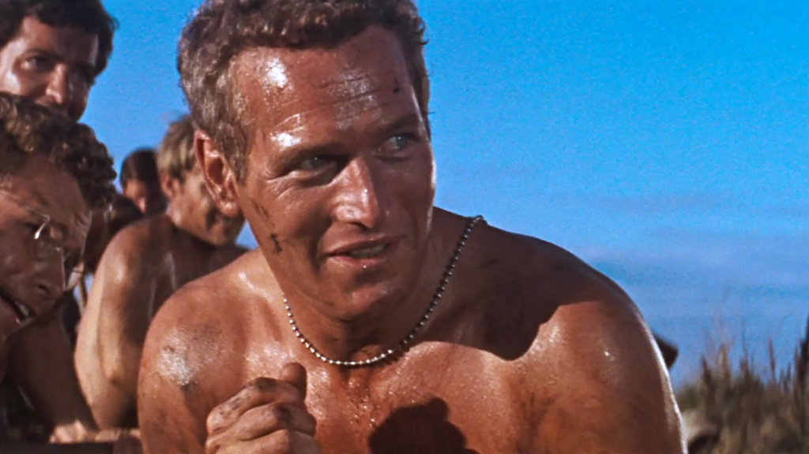

 Paul Newman in “Cool Hand Luke.”  Warner Bros.

## ‘Cool Hand Luke’ (1967)

Paul Newman turns in one of his most iconic performances as the former war hero Lucas Jackson, whose tenacious, rascally free spirit and refusal to kowtow to authority maddens his keepers on a Florida chain gang — and inspires his fellow prisoners. The director Stuart Rosenberg cranks up the sweaty atmosphere and high intensity, placing the viewer right alongside Luke as he fights, runs and bets his way through his sentence, and Newman calls upon all of his considerable charisma to give the character life. Our critic praised its “[intelligent contemplation of the ironies of life](https://www.nytimes.com/1967/11/02/archives/screen-forceful-portrait-of-a-man-born-to-losepaul-newman-superb-as.html).”

 [Watch](https://www.netflix.com/title/397323)

 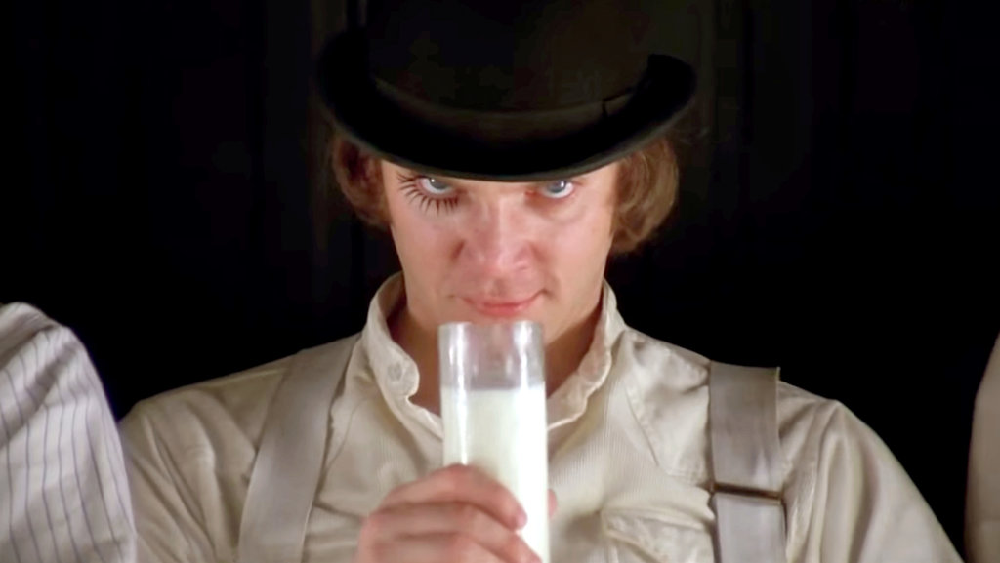

 Malcolm McDowell in “A Clockwork Orange.”  Warner Bros.

## ‘A Clockwork Orange’ (1971)

Stanley Kubrick’s [most controversial](https://archive.nytimes.com/www.nytimes.com/library/film/010972kubrick-orange.html?scp=9&sq=devotchka&st=cse) film, and perhaps his most disturbing (neither a small claim), was this 1971 adaptation of the cult novel by Anthony Burgess. It is Kubrick at his [most stylized](https://www.nytimes.com/1972/01/04/archives/kubrick-tells-what-makes-clockwork-orange-tick.html), with the narrative’s hyper-violence cushioned by the striking cinematography, futuristic production design and jet-black humor. Our critic wrote that it “[dazzles the senses and mind](https://www.nytimes.com/1971/12/20/archives/a-clockwork-orange-dazzles-the-senses-and-mind.html).”

 [Watch](https://www.netflix.com/title/383466)

 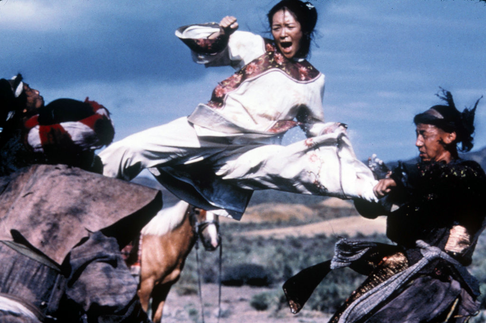

 Zhang Ziyi in “Crouching Tiger, Hidden Dragon.”  Chan Kam Chuen/Sony Pictures Classics

## ‘Crouching Tiger, Hidden Dragon’ (2000)

Ang Lee won the academy award for best director for this enthralling mixture of martial arts adventure and heartfelt romance. His narrative is a busy hive of deception, betrayal, loyalty and pride, and while the personal and emotional stakes are high, “Crouching Tiger” is most memorable for its awe-inspiring action sequences — bone-crunching and balletic, thrilling and lyrical, as heroes and villains alike transcend gravity itself. Our critic called it “[a heady and delirious brew](https://www.nytimes.com/2000/12/08/movies/film-review-master-the-fire-of-flashing-steel-the-grace-of-autumn-leaves.html).”

 [Watch](https://www.netflix.com/title/60002907)

 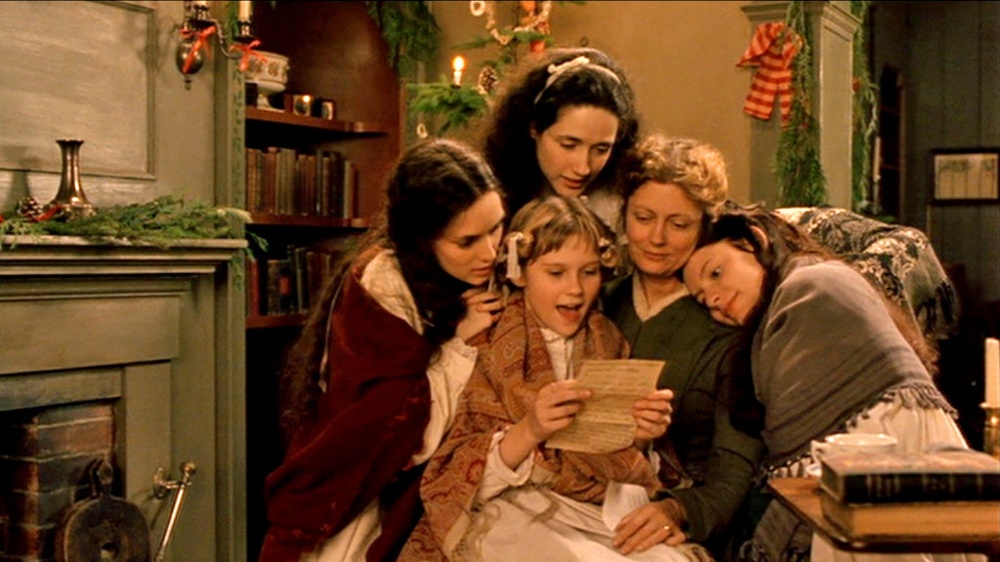

 A scene from “Little Women.”  Columbia Pictures

## ‘Little Women’ (1994)

Louisa May Alcott’s [classic novel](https://www.nytimes.com/2018/09/13/books/little-women-alcott-anniversary.html)“Little Women” isn’t a stranger to film adaptation — earlier movie versions date clear back to the silent era — but this 1994 take from the director Gillian Armstrong (“My Brilliant Career”) adroitly pitches the film to modern audiences without condescending to its old-fashioned sentimentality. Handsomely staged and marvelously acted, this is a first-rate introduction to one of the [great works](https://www.nytimes.com/1994/12/25/books/amy-had-golden-curls-jo-had-a-rat-who-would-you-rather-be.html)of young adult literature. Our critic called it “[the loveliest ‘Little Women’ ever on screen](https://www.nytimes.com/1994/12/21/movies/film-review-the-gold-standard-for-girlhood-across-america.html).”

 [Watch](https://www.netflix.com/title/707114)

**X**
ADCHOICES IDENTIFIED

[                        China Takes Lead in Promoting  Clean-Energy Vehicles    Technology and scale are set to push greener cars.    LEARN MORE](https://adclick.g.doubleclick.net/pcs/click?xai=AKAOjsvFqxzLev30IIgFQL1mlboEZa31yqpFf_vuLtu-wKGus-HlPkMSa9WKdsI-opAowOgfBcTMtZ5-V-y1v0R14-4Vr5YhRX_-r59Fp4QNtfBQdUF7BfQ6ifetQKqbUlKqf1mJUJnbAo4PdU1IyFPLbev7RC9XoPcxzljf1H1-zWkeDm1xQ2LoswOMIeiHn-N5txYWhucRhvhKH9IHUUL9-2U2L7RXOFiiV-P3YzUI5arygBXRFqNVFy4xW8rMeVCAm1Cagsbx23Om&sig=Cg0ArKJSzNLTxTA3WX5lEAE&urlfix=1&adurl=https://www.nytimes.com/paidpost/china-daily/methanol-automobiles-promoted-as-china-steps-up-development-of-new-energy.html)

[(L)](https://adclick.g.doubleclick.net/pcs/click?xai=AKAOjsvFqxzLev30IIgFQL1mlboEZa31yqpFf_vuLtu-wKGus-HlPkMSa9WKdsI-opAowOgfBcTMtZ5-V-y1v0R14-4Vr5YhRX_-r59Fp4QNtfBQdUF7BfQ6ifetQKqbUlKqf1mJUJnbAo4PdU1IyFPLbev7RC9XoPcxzljf1H1-zWkeDm1xQ2LoswOMIeiHn-N5txYWhucRhvhKH9IHUUL9-2U2L7RXOFiiV-P3YzUI5arygBXRFqNVFy4xW8rMeVCAm1Cagsbx23Om&sig=Cg0ArKJSzNLTxTA3WX5lEAE&urlfix=1&adurl=https://www.nytimes.com/paidpost/china-daily/methanol-automobiles-promoted-as-china-steps-up-development-of-new-energy.html)

## More on NYTimes.com

- [  ## Ethiopian Airlines Flight Crashes Near Addis Ababa, Killing at Least 150 Mar. 10, 2019](https://www.nytimes.com/2019/03/10/world/africa/ethiopian-airlines-plane-crash.html)
- [  ## After a Lion Air 737 Max Crashed in October, Questions About the Plane Arose Mar. 10, 2019](https://www.nytimes.com/2019/02/03/world/asia/lion-air-plane-crash-pilots.html)
- [  ## Trump Budget to Request Additional Wall Funding Mar. 10, 2019](https://www.nytimes.com/2019/03/10/business/economy/trump-budget-wall.html)
- [  ## After Week of Infighting, Democrats Wonder Where to Draw Line on Speech Mar. 10, 2019](https://www.nytimes.com/2019/03/10/us/politics/ilhan-omar-democrats-free-speech.html)
- [  ### Political Memo  ## For Female Candidates, the Era of Family Dynasties Fades Away Mar. 10, 2019](https://www.nytimes.com/2019/03/10/us/politics/female-candidates-2020-election.html)