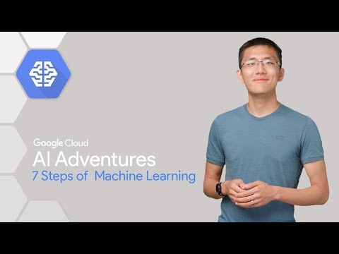

The 7 Steps of Machine Learning - YouTube

The 7 Steps of Machine Learning
https://www.youtube.com/watch?v=nKW8Ndu7Mjw
[Google Cloud](https://www.youtube.com/channel/UCJS9pqu9BzkAMNTmzNMNhvg)
415,092 views views
Published on Aug 31, 2017

|     |
| --- |
| [(L)](https://www.youtube.com/watch?v=nKW8Ndu7Mjw) |

Description

How can we tell if a drink is beer or wine? Machine learning, of course! In this episode of Cloud AI Adventures, Yufeng walks through the 7 steps involved in applied machine learning. The 7 Steps of Machine Learning article: [https://goo.gl/XEo6i2](https://www.youtube.com/redirect?q=https%3A%2F%2Fgoo.gl%2FXEo6i2&v=nKW8Ndu7Mjw&redir_token=hrTOkR_-6lvAyM5qSkX8SE4iiS18MTUxNTM1MTU1MUAxNTE1MjY1MTUx&event=video_description)Watch more episodes of AI Adventures here: [https://goo.gl/UC5usG](https://www.youtube.com/redirect?q=https%3A%2F%2Fgoo.gl%2FUC5usG&v=nKW8Ndu7Mjw&redir_token=hrTOkR_-6lvAyM5qSkX8SE4iiS18MTUxNTM1MTU1MUAxNTE1MjY1MTUx&event=video_description)TensorFlow Playground: [http://playground.tensorflow.org](https://www.youtube.com/redirect?q=http%3A%2F%2Fplayground.tensorflow.org&v=nKW8Ndu7Mjw&redir_token=hrTOkR_-6lvAyM5qSkX8SE4iiS18MTUxNTM1MTU1MUAxNTE1MjY1MTUx&event=video_description)Machine Learning Workflow: [https://goo.gl/SwLnSz](https://www.youtube.com/redirect?q=https%3A%2F%2Fgoo.gl%2FSwLnSz&v=nKW8Ndu7Mjw&redir_token=hrTOkR_-6lvAyM5qSkX8SE4iiS18MTUxNTM1MTU1MUAxNTE1MjY1MTUx&event=video_description)Want more machine learning? Subscribe to the channel: [https://goo.gl/S0AS51](https://www.youtube.com/redirect?q=https%3A%2F%2Fgoo.gl%2FS0AS51&v=nKW8Ndu7Mjw&redir_token=hrTOkR_-6lvAyM5qSkX8SE4iiS18MTUxNTM1MTU1MUAxNTE1MjY1MTUx&event=video_description)