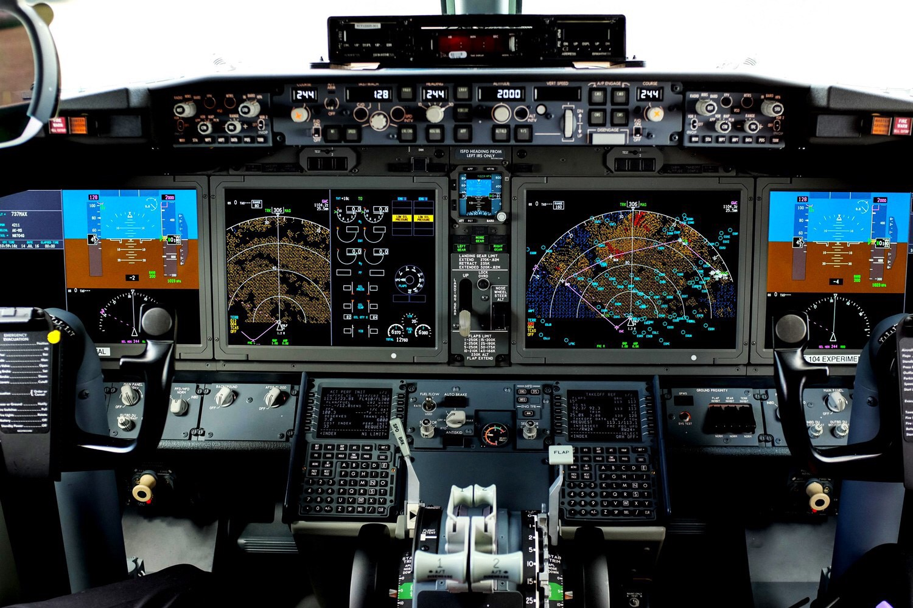

The 737Max and Why Software Engineers Might Want to Pay Attention

The 737Max and Why Software Engineers Might Want to Pay Attention

As someone with a [bit](https://twitter.com/editingemily/status/1037789647449935872) of a [reputation](https://twitter.com/richburroughs/status/1094051526035660801) for talking about [aviation and software development and operations](https://vimeo.com/69081899), I’ve been asked about the [737Max](https://en.wikipedia.org/wiki/Boeing_737_MAX) repeatedly over the past week. I’ve been watching this story develop since November of last year, when the Lion Air 737Max crashed. Given recent developments, if you want a pure-aviation take on what’s going, there are [better people](https://twitter.com/jonostrower/) to ask.

But that’s not what we’re here to ponder. This is more about the facts we know right now and what it means for our industry.

The situation with the 737Max has a few notable aspects that are relevant to engineers developing and operating software in complex socio-technical systems:

- •First, it’s important to have some understanding of the history of the 737Max: while it is classified as the same aircraft *type* by regulatory authorities, and is based on the same design as the tried and true 737, it has some important differences: while the 737 design is pushing 55 years old, the 737 Max design first took flight only two years ago. This is relevant because the business goal of the 737Max was to compete with new Airbus A320 models, with promised fuel efficiency and more passenger-carrying capacity. This makes the 737Max a longer aircraft, with different handling characteristics from its older brethren. *This*, in turn, necessitated changes in engine design and mounting and because of these changes, engineers changed some of the flight control systems.
- •A system under scrutiny is the 737Max’s Maneuvering Characteristics Augmentation System or [MCAS](https://en.wikipedia.org/wiki/Maneuvering_Characteristics_Augmentation_System); this is an automation system intended to keep the plane from stalling. One of the things it measures is the angle-of-attack: if the plane exceeds a particular flight angle, it will fall out of the sky. The MCAS, in the default configuration, uses a *single* sensor as input to measure this critical metric.
- •When this system detects a dangerous flight condition, it trims the aircraft, attempting to prevent a stall by pushing the nose down. Trim is not a fancy, new fangled technology: the Cessnas I fly have trim wheels, and autopilots manipulate trim to fly aircraft in an automated way. What *is* different here is: the MCAS commands the trim in this condition **without notifying the pilots**  ***AND*** to override the input, the pilots must deactivate the system via a switch on a console, NOT by retrimming the aircraft via the yoke, which is a more common way to manage the airplane’s trim.
- •Also of note: the MCAS system directs the 737Max’s stabilizer; this is part of the horizontal tail-fin on the 737, but it is located in the front; pilot input, however, affects the elevator, which is located on the opposite edge of the tail-fin. The important part here is: given continued input into the stabilizer, it’s been reported that a pilot can be applying full *opposite* input into the stabilizer, and the physics are such that the stabilizer — the part under control of the automatic system — can override the inputs of the pilot.
- •An important aspect of both accidents is how quickly they unfolded: the New York Times has [a very good interactive piece](https://www.nytimes.com/interactive/2018/12/26/world/asia/lion-air-crash-12-minutes.html) illustrating this. We’re talking about minutes — about as long as it’s taken you to read this far — *at low altitudes right after takeoff*, asking pilots to realize, understand, and respond to why their aircraft was silently fighting their inputs, in a context of being told that the “system” they were operating was pretty much like every other 737 they’d been likely to operate in their careers, ever.
- •Finally, it’s been reported that Boeing was going to issue a software update to help address at least some of these issues… but from a larger socio-technical system perspective, these updates were [delayed for five weeks by the government shutdown](https://www.wsj.com/articles/boeing-to-make-key-change-in-max-cockpit-software-11552413489), an assuredly unintended consequence of that political maneuver, but a costly consequence none-the-less.

So why would we, as software professionals, care about how this particular investigation and remediation unfolds?

If you stand back and replace “737" with “system” and “pilot” with “ops engineer,” the situation with the 737Max is a case of new, market-driven business requirements prompting a redesign to a widely-considered stable and reliable production system.

Those requirements necessitated engineers to change fundamental handling characteristics of the system.

To cope, they added additional monitoring and control systems. One of these systems was added “for safety,” but it was also capable of overriding operator input during critical operational phases, where activity is high tempo *and* high consequence.

This new safety automation is capable of overriding operator input in silence and in ways that were poorly documented by designers, unclear to operators, and promised by developers that nobody had to get new training on —* a selling point* — and this safety automation proved to cause the system to become critically unrecoverable in, at least, one case.

Furthermore, from an organizational and societal-systems perspective, this issue *had been reported* via official channels to organizational leaders; and a massive, costly “incident” had prompted an update to the safety system, but the deployment of the update was delayed because of business and political requirements.

**NOW:** As a software developer, operations engineer, or security engineer, does ***any*** of that sound familiar?

If it does, that’s why you should pay attention to what happens with the case of the 737Max.

*Corrections: Initial versions of this article claimed the MCAS system used a single sensor input for angle-of-attack information; two sensors are available on the aircraft, but the two are not, by default, connected to the MCAS system.*