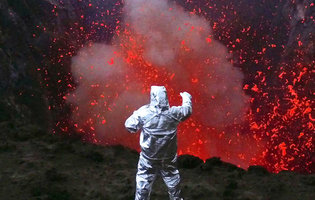
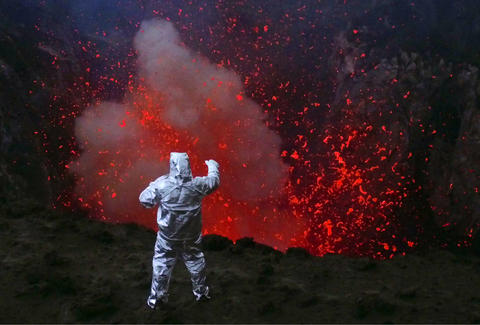
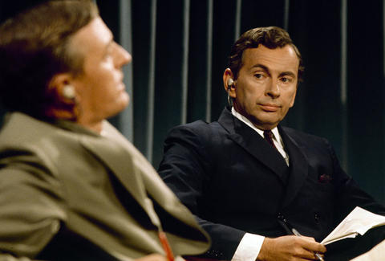
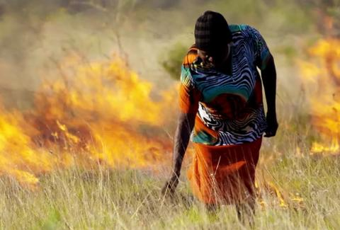
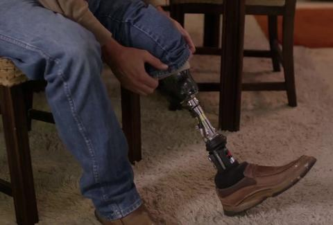
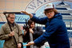
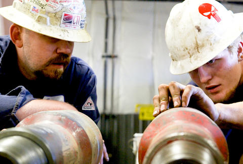
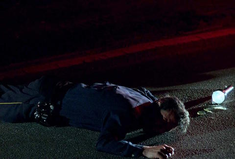
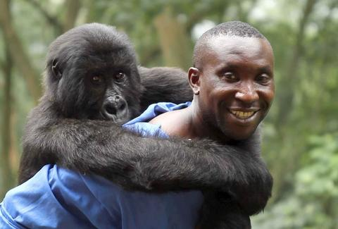

The Absolute Best Documentaries on Netflix

 

Entertainment

#   The Absolute Best Documentaries on Netflix

    By [Thrillist Entertainment](https://www.thrillist.com/authors/thrillist-entertainment)    Updated On 01/09/2017 at 06:08PM EST

- [](http://www.facebook.com/sharer.php?u=https%3A%2F%2Fwww.thrillist.com%2Fentertainment%2Fnation%2Fbest-documentaries-on-netflix-streaming%3Futm_content%3DThe%2BAbsolute%2BBest%2BDocumentaries%2Bon%2BNetflix%26utm_source%3Dfacebook%26utm_medium%3Dsocial-media)

 

       

 Into the Inferno | Netflix

Netflix is the great equalizer. When you're sifting through zillions of movie options, the traditionally niche art of documentary can go toe to toe with Hollywood blockbusters. Whether fiction or nonfiction, anything that's moving/crazy/hilarious is worth streaming. Here is an array of documentaries that fit the bill.

##   ***Aileen: Life and Death of a Serial Killer*** (2003)

Nick Broomfield, the original faux-naïve first-person investigative filmmaker, made (with co-director Joan Churchill) this documentary on death-row inmate Aileen Wuornos after being subpoenaed as a witness because of his 1992 feature about her, ***Aileen Wuornos: The Selling of a Serial Killer***. It's a deeply fascinating follow-up because of how much of Wuornos' story is changed from one film to the next, as well as for its moving consideration of the complex and often unbalanced relationship between documentarian and subject.

##   ***Amanda Knox ***(2016)

In 2007, [Amanda Knox](https://www.thrillist.com/entertainment/nation/amanda-knox-documentary-netflix-review), then a 20-year-old college student, sought a study abroad experience in Italy. There, the Seattle native was accused of murdering her British housemate, and spent the better part of four years caught in Italy's penal and judicial systems. Thanks to cooperation from Knox and many of the case's key figures, the documentary blows out the case's salacious details, as well as focuses on the long-term damage inflicted on its title subject by the sensationalistic media coverage of her trial.

##   ***Backstreet Boys: Show 'Em What You're Made Of ***(2015)

Pop music operates in cycles: no one stays at the top forever. For boy bands, which make music specifically engineered for adolescents, the shelf life is even shorter. No one knows this quite like the Backstreet Boys, the five young men who ushered in a new generation of megastardom at the turn of the millennium. ***Show 'Em What You're Made Of*** explores that growth, from each singer's humble childhood to fame and fortune to complicated adulthood. What do you do when you're a full-grown man in a boy band? Watch and learn.

##   ***The Battered Bastards of Baseball*** (2014)

 [Kurt Russell](https://www.thrillist.com/entertainment/nation/kurt-russell-movies-hateful-eight-and-other-badass-roles), who interrupted his acting career to play baseball professionally in the 1970s, is one of the highlights of this documentary about his father’s legendary minor league team, the Portland Mavericks. But he’s just one piece of a highly entertaining true story that chronicles the independent baseball club and its ragtag team of rejects, who seem more tailor-made for an underdog sports comedy than reality -- no surprise, there’s a Hollywood remake in the works.

       

- [](http://www.facebook.com/sharer.php?u=https%3A%2F%2Fwww.thrillist.com%2Fentertainment%2Fnation%2Fbest-documentaries-on-netflix-streaming%3Futm_content%3DThe%2BAbsolute%2BBest%2BDocumentaries%2Bon%2BNetflix%26utm_source%3Dfacebook%26utm_medium%3Dsocial-media)
- [](https://www.thrillist.com/entertainment/nation/best-documentaries-on-netflix-streaming#)

Magnolia Pictures

##   ***Best of Enemies ***(2015)

What sounds like a mere montage of old TV clips is actually a riveting and relevant work of cinema in the hands of directors Morgan Neville (a recent Oscar winner for ***20 Feet from Stardom***) and Robert Gordon. This documentary revisits the political debates -- though they were more like oral sparring matches -- between William F. Buckley and Gore Vidal, which were broadcast nightly during the 1968 Republican and Democratic National Conventions.

##   ***Brother's Keeper*** (1992)

Before breaking out with their more famous courtroom documentary [***Paradise Lost: The Child Murders at Robin Hood Hills***](https://www.thrillist.com/entertainment/nation/best-hbo-documentaries-streaming), Joe Berlinger and Bruce Sinofsky made another true crime film about four elderly brothers, one of whom may have been murdered by another. It’s as compelling a legal drama as any, strengthened by the access the filmmakers earned through their respectful treatment of the three remaining siblings and their farming community.

##   ***Cartel Land ***(2015)

Produced by ***The Hurt Locker ***and*** Zero Dark Thirty ***director Kathryn Bigelow, this cinematic documentary is like a real-life ***Sicario***. Documentarian Matthew Heineman embedded himself in both a group of Arizona border-control vigilantes and a band of Mexican "Autodefensas," armed with only a camera and his instincts. The run-and-gun style and Heineman's jaw-dropping access will keep your heart pounding through this examination of the current War on Drugs.

##   ***Cave of Forgotten Dreams ***(2010)

Although best appreciated in 3-D, Werner Herzog’s exclusive field trip into the depths of the Chauvet Cave is, in any format, a transcendent exploration of the “proto-cinema” of its ancient drawings. Without the extradimensional sense that we’re moving through the physical space onscreen, Herzog’s narration is suggestive enough to make us perceive eons of history at once, as if we’re watching the documentary and viewing its cave art in all-time-inclusive 4-D.

##   ***Chasing Ice*** (2012)

 ***Chasing Ice*** is one of many climate-change-focused documentaries that probably isn't going to save the world but at least has recorded the earth’s physical transitions for posterity. In this case, that’s some gorgeous posterity, as the film shows us the results of photographer James Balog’s year-long time-lapse coverage of dwindling glaciers and melting ice caps.

       

- [](http://www.facebook.com/sharer.php?u=https%3A%2F%2Fwww.thrillist.com%2Fentertainment%2Fnation%2Fbest-documentaries-on-netflix-streaming%3Futm_content%3DThe%2BAbsolute%2BBest%2BDocumentaries%2Bon%2BNetflix%26utm_source%3Dfacebook%26utm_medium%3Dsocial-media)
- [](https://www.thrillist.com/entertainment/nation/best-documentaries-on-netflix-streaming#)

Netflix

##   ***Cooked*** (2016)

In four one-hour segments, this project is the story of humanity through cooking, and cooking through humanity. It introduces us to cheese-making nuns, grandmas in the Australian outback who club giant lizards, and avant-garde theories of how cooked food has influenced human evolution. Oh, and James Taylor singing to his dead pig. Every serious food lover owes it to themselves to binge this masterfully shot, fact-heavy documentary that aims to change the way we think about food, and its impact on our world.

##   ***Cropsey*** (2009)

One of the creepiest documentaries ever made, Joshua Zeman and Barbara Brancaccio’s film shows how some urban legends are based on true stories even more unsettling than the myths. Because the directors grew up on lore rather than facts, their discoveries are as fresh as our own as we learn about a Staten Island boogeyman who was very real, indeed.

##   ***Detropia*** (2012)

Through their portrait of Detroit, Rachel Grady and Heidi Ewing have also created a snapshot of America at the time of its making, when the nation was coming out of the great recession. But it needn’t be looked at as a big historical statement documentary, as the individual human-interest stories at hand are even more compelling. As always, the filmmakers are best appreciated for their selection and showcase of captivating real-life characters.

##   ***Encounters at the End of the World*** (2007)

Documentaries often take us to places we could never go, and this film is no exception -- but it’s also no travelogue. Werner Herzog’s sole Oscar-nominated feature doc takes us to Antarctica as we witness the filmmaker encountering sea life, microscopic life, a penguin doing his own thing, and scientists of all kinds, including the volcanologist who’ll later star in*** Into the Inferno***. It’s one of the funniest and most visually stunning of Herzog’s works.

##   ***Exit Through the Gift Shop*** (2010)

The mysterious Banksy earned an Oscar nomination for his documentary about fellow street artist Thierry Guetta, a.k.a. Mr. Brainwash, and to this day it’s still debated whether or not the whole thing was made up. Either way, ***Exit Through the Gift Shop*** is still an important and quite hilarious peek behind the curtain of the art establishment and what a sham it is.

       

- [](http://www.facebook.com/sharer.php?u=https%3A%2F%2Fwww.thrillist.com%2Fentertainment%2Fnation%2Fbest-documentaries-on-netflix-streaming%3Futm_content%3DThe%2BAbsolute%2BBest%2BDocumentaries%2Bon%2BNetflix%26utm_source%3Dfacebook%26utm_medium%3Dsocial-media)
- [](https://www.thrillist.com/entertainment/nation/best-documentaries-on-netflix-streaming#)

The Orchard

##   ***Finders Keepers*** (2015)

Clay Tweel is a master of balancing comedy and tragedy in documentary, and that’s especially evident in this film co-directed by Bryan Carberry. ***Finders Keepers ***is about the battle over an amputated leg -- between the man it originated with and the man who found it inside a used grill. But it’s a much deeper and more sensitive portrait of its subjects than you could possibly imagine.

##   ***Finding Vivian Maier******  ***(2013)

John Maloof stumbled upon a gold mine when he found a box of photo negatives taken by a little-known nanny and wallflower, Vivian Maier, at a yard sale in 2007. The shots -- many of nameless characters she spotted on the street -- are striking and unique in their own right, and Maloof's quest to find out more about the woman behind the camera is engrossing. The resulting documentary, which was [funded by Kickstarter](https://www.kickstarter.com/projects/800508197/finding-vivian-maier-a-feature-length-documentary) and earned an Oscar nomination in 2015, cobbles together a narrative of Maier's life with a deep dive through her photographic archive -- over 100,000 images in total -- and interviews with those who knew little about her and even less about her prolific hobby. Maier died in 2009, so we'll never know for sure why she hid her talents from the world, but Maloof raises provocative questions about the relationship between art, artist, and audience.

##   ***Grizzly Man*** (2005)

Werner Herzog's best feature-length doc is a sort of forensic character study, an exploration into the mind and actions of bear lover Timothy Treadwell through his own footage, leading up to his and his girlfriend's deaths at the hands (paws?) of grizzlies. This stunning multi-tiered work, featuring running voice-over commentary from the director, turns nature documentaries on their head.

##   ***How to Survive a Plague*** (2012)

A history of the AIDS epidemic through the mid-1990s is obviously one of the most gut-wrenching films of all time, but this is a documentary that elicits as many tears of joy as tears of heartbreak because it chronicles a story of hope, determination, and ultimate victory. Comprised mostly of footage shot during the early years of the crisis, much of it by camerapeople who didn't live to see the film, the quest of organizations ACT UP and TAG to find better treatment for HIV and AIDS is experienced up close and personal through David France's archival-vérité approach.

##   ***I'll Sleep When I'm Dead*** (2016)

Every generation gets its own musical moment, a genre or subgenre that serves to completely bewilder the one that preceded it. For today's youth, it's all about EDM and the few successful players who've become millionaires from the explosive popularity of DJs.*** I'll Sleep When I'm Dead*** follows Steve Aoki -- a man best known for throwing cakes onto the faces of his audience and being the son of the founder of Benihana -- on his rise to fame. It's surprisingly poignant, shedding strobe lights on the movement that dominates music today.

##   ***Indie Game: The Movie ***(2012)

You don’t have to care about --  let alone play -- [video games](https://www.thrillist.com/entertainment/nation/best-video-games-2016) to appreciate and enjoy this informative and affecting spotlight on independent game developers and designers. Funded through Kickstarter, Lisanne Pajot and James Swirsky’s documentary is quite accessible to a broad audience, given its primary focus on universally relatable characters and their struggles and triumphs, rather than just the products they’re working on.

       

- [](http://www.facebook.com/sharer.php?u=https%3A%2F%2Fwww.thrillist.com%2Fentertainment%2Fnation%2Fbest-documentaries-on-netflix-streaming%3Futm_content%3DThe%2BAbsolute%2BBest%2BDocumentaries%2Bon%2BNetflix%26utm_source%3Dfacebook%26utm_medium%3Dsocial-media)
- [](https://www.thrillist.com/entertainment/nation/best-documentaries-on-netflix-streaming#)

Netflix

##   ***Into the Inferno ***(2016)

Werner Herzog’s illuminating semi-sequel to ***Encounters at the End of the World*** reunites him with volcanologist Clive Oppenheimer for encounters with volcanoes all over the world. This time, Herzog stays offscreen and lets Oppenheimer have most of the spotlight, though there is plenty of the filmmaker’s signature narration: some of it to revisit the making of another of his films, the 1977 short ***La Soufrière***; or to present other interesting stories of volcanoes and the people who worship them.

##   ***Into the Abyss ***(2011)

There is no attempt to exonerate anybody in this rare look at death row inmates who wound up there in accordance with Texas law. Werner Herzog, who does admit to being against capital punishment, offers little compassion as he interviews young murderers about their crimes, trying to understand their motives. There’s a bit of ***In Cold Blood*** in the filmmaker’s detached approach, though what we realize about the community that spawned the killers is far more intriguing than Herzog's specific inquiry.

##   ***Janis: Little Girl Blue*** (2015)

By and large, rock 'n' roll was considered a boys club through the '60s and '70s, comprised of music for men, by men, where women were allowed to play the role of groupie if they wanted to play at all. Until Janis Joplin came along. Her scratchy, whiskey-bruised voice arrested a generation and, however accidentally, carved a place for those without a Y chromosome. ***Little Girl Blue*** tracks her rock takeover to the very end, up to her tragic death.

##   ***Jiro Dreams of Sushi*** (2011)

85-year-old Jiro Ono is one of the greatest sushi chefs in the world, serving up immaculate slices of individually sourced uni, ebi, and toro at his 10-seat, $240-a-meal Tokyo restaurant (which, after seeing this, you will want to visit ASAP). ***Jiro Dreams of Sushi*** is many things: a sublime portrait of a master craftsman at work, an affectionate ode to Japan’s culinary heritage, and a story about the rewards and costs of perfectionism, as Jiro’s son and successor struggles to match his father’s impossibly high expectations. It’s also full of the most mouthwatering shots of sushi you’ve ever seen -- food porn at its most highbrow.

##   ***Joan Rivers: A Piece of Work ***(2010)

Even legends have to hustle, and Rivers proved it in this documentary, completed a few years before her untimely death. Ricki Stern and Anne Sundberg follow the sharp-tongued comedienne, then well into her 70s, on the road as she has to compete with the performers she paved the way for (like Kathy Griffin, who acknowledges her debt to Rivers on camera). The film follows Rivers from the makeup chair to the stage and every place in between, painting a deeply human portrait of the hardest-working woman in comedy -- with some of her all-time funniest bits thrown in for good measure.

#### related

 [              ##### The 33 Best Documentaries of All Time](https://www.thrillist.com/entertainment/nation/best-documentaries-of-all-time)

       

- [](http://www.facebook.com/sharer.php?u=https%3A%2F%2Fwww.thrillist.com%2Fentertainment%2Fnation%2Fbest-documentaries-on-netflix-streaming%3Futm_content%3DThe%2BAbsolute%2BBest%2BDocumentaries%2Bon%2BNetflix%26utm_source%3Dfacebook%26utm_medium%3Dsocial-media)
- [](https://www.thrillist.com/entertainment/nation/best-documentaries-on-netflix-streaming#)

Scooter Braun Films

##   ***Justin Bieber's Believe*** (2013)

A documentary on the object of affection of young women everywhere was inevitable, even despite the subject's young age. Like most [half-concert performance, half-music doc](https://www.thrillist.com/entertainment/nation/best-music-documentaries-netflix) films, this one follows the Biebs' journey from kid to internet celeb to megastar. Bieber was among the first to make that very internetty transformation, so watching it unfold in real time illuminates the recent past and the probable future.

##   ***Lemmy*** (2010)

 ***Lemmy*** was released half a decade before the iconic Mötörhead frontman died, so watching it now feels equal parts eerie and celebratory. The famous metal musician melded the genre with punk in a way that had never been done before, all the while staying true to his over-the-top personality. The result is a film that perfectly documents Lemmy the person and Lemmy the icon -- the surprise is that they're one and the same.

##   ***The Look of Silence*** (2014)

The stronger one of Joshua Oppenheimer's films confronting the mid-1960s genocide in Indonesia (the other is ***The Act of Killing***) follows an optometrist as he meets and interviews the individuals responsible for the death of his brother, none of whom have been held accountable before. It sounds so simplistic, and at first it plays so serenely, then gradually, it builds into a powerful record of the candid confessions of men still considered heroes in their country. This documentary focuses on the legacy of events that will soon only be in the hands and minds of a generation detached from and mistaken about the events of 50 years ago.

##   ***Man on Wire*** (2008)

James Marsh is the master of the well-planned documentary, and his greatest film is about the master of well-planned high-wire stunts. An impeccably polished portrait of Philippe Petit that chronicles his 1974 tightrope walk between the Twin Towers, it's also a thrilling tribute to those since-fallen structures and an era lost to the terrorist attacks of 9/11. With all its pre-production work, heavily directed interviews, dramatized reenactments, and surplus of illustrative archival footage, this is a documentary as far from the observational style as can be, yet it's one of the most marvelous examples of experiential nonfiction there is.

##   ***Marley*** (2012)

There's no shortage of films about Bob Marley. Or books, essays, and a bunch of student projects probably created by inventive stoners. But to get to the heart of the Rastafarian icon, you need to go to the source: his family. ***Marley*** was produced by the singer's kin and features a collection of intimate interviews and moments, making for a truly unique, grounded tribute.

##   ***My Beautiful Broken Brain ***(2016)

In 2011, Lotje Sodderland suffered a hemorrhagic stroke in her sleep and woke up not knowing who she was or how to communicate. Within days, though, she began to document her situation and her recovery, recording selfie videos that are now a devastatingly personal part of ***My Beautiful Broken Brain***, one of the [best documentaries of the year](https://www.thrillist.com/entertainment/nation/best-documentaries-2016). The film, which also involves David Lynch, puts us in Sodderland's mind to the best of nonfiction cinema's capabilities. In addition to candidly sharing the struggles and insights of its subject, ***Brain*** also represents her newly enhanced sensory perception through augmented POV shots, using visual effects that could have been cheesy in a lesser work.

       

- [](http://www.facebook.com/sharer.php?u=https%3A%2F%2Fwww.thrillist.com%2Fentertainment%2Fnation%2Fbest-documentaries-on-netflix-streaming%3Futm_content%3DThe%2BAbsolute%2BBest%2BDocumentaries%2Bon%2BNetflix%26utm_source%3Dfacebook%26utm_medium%3Dsocial-media)
- [](https://www.thrillist.com/entertainment/nation/best-documentaries-on-netflix-streaming#)

Drafthouse Films

##   ***The Overnighters*** (2014)

Pastor Jay Reinke is the sort of real-life character whom documentary filmmakers dream of, conflicted emotions and all. As he plays a part in the film’s observation of the oil and jobs boom of a North Dakota town, the twists that come about through his story are just too tragically perfect. As it builds tension and inches toward bursting, there are so many unforgettable moments in ***The Overnighters***, but it’s the human drama that sticks with you the most.

##   ***Pervert Park ***(2014)

One of the most shocking, harrowing [documentaries](https://www.thrillist.com/entertainment/nation/best-documentaries-of-all-time) of all time (and without trying too hard), ***Pervert Park ***embeds documentarians in Florida Justice Transitions trailer park, home to 120 sex offenders whose living requirements force them to commune.

##   ***Pussy Riot: A Punk Prayer*** (2013)

The members of this radical feminist punk band were imprisoned in their native Russia after doing guerrilla performances in Moscow churches and beyond to voice their opposition of Vladimir Putin's conservative regime. ***A Punk Prayer*** walks us through Pussy Riot's quest to stir up their community [through their music](https://www.thrillist.com/entertainment/nation/best-music-documentaries-netflix) -- heavy chords, imprisonment, worldwide media coverage, and all.

##   ***Rats*** (2016)

Morgan Spurlock brings new meaning to the phrase “Netflix and chill” with this eerie film about rats and the people passionately drawn to them, most in the pursuit of killing the oft-vilified rodents. Brilliantly stylized as a work of horror with manipulative editing and sound design, ***Rats*** may give you nightmares, but it also gnaws at some of the misconceptions about the animals while showing you just how nasty -- and delicious -- they really can be.

##   ***Restrepo*** (2010)

Photojournalist Tim Hetherington and writer Sebastian Junger spent a year embedded within the US Army's 173rd Airborne Brigade Combat Team, deployed to the Korengal Valley, one of the most dangerous areas of Afghanistan. It takes little interference to dramatize the situation; ***Restrepo*** depicts seasoned soldiers putting their lives on the line. When Hetherington and Junger follow them into battle, many don't survive the runtime. It's the most raw look at America's invasion of Afghanistan, and an achievement that would come at a price for the duo: a few months after attending the Academy Awards, where the film was nominated for Best Documentary, Hetherington was killed while covering the Libyan Civil War.

       

- [](http://www.facebook.com/sharer.php?u=https%3A%2F%2Fwww.thrillist.com%2Fentertainment%2Fnation%2Fbest-documentaries-on-netflix-streaming%3Futm_content%3DThe%2BAbsolute%2BBest%2BDocumentaries%2Bon%2BNetflix%26utm_source%3Dfacebook%26utm_medium%3Dsocial-media)
- [](https://www.thrillist.com/entertainment/nation/best-documentaries-on-netflix-streaming#)

IFC Films

##   ***Room 237 ***(2012)

Stanley Kubrick's 1980 adaptation of ***The Shining*** is one of [the best horror movies of all time](https://www.thrillist.com/entertainment/nation/best-horror-movies-ever) -- and part of what makes it so terrifying is how hard it is to make sense of its iconic sequences. Rodney Ascher puzzled over several of its conflicting mysteries in this doc. Is it actually about Native American genocide? The moon landing? The Holocaust? ***Room 237 ***raises more questions than it answers, making it required viewing for any movie buffs searching for meaty subtext.

##   ***Seymour: An Introduction*** (2014)

Actor Ethan Hawke directs this loving portrait of and tribute to his mentor Seymour Bernstein, a brilliant classical pianist and composer who hasn’t played in public for decades but taught many who went on to professional careers. Although Bernstein is the film’s subject, with his great wisdom, he constantly diverts the focus to be more about the art and craftsmanship of the music and its performance than about Bernstein himself.

       

- [](http://www.facebook.com/sharer.php?u=https%3A%2F%2Fwww.thrillist.com%2Fentertainment%2Fnation%2Fbest-documentaries-on-netflix-streaming%3Futm_content%3DThe%2BAbsolute%2BBest%2BDocumentaries%2Bon%2BNetflix%26utm_source%3Dfacebook%26utm_medium%3Dsocial-media)
- [](https://www.thrillist.com/entertainment/nation/best-documentaries-on-netflix-streaming#)

Miramax Films

##   ***The Thin Blue Line*** (1988)

Errol Morris’ true-crime tale combines reenactment and voiceover to unravel the story of Randall Dale Adams, a man convicted, and sentenced to life in prison, for a of a murder he did not commit. ***The Thin Blue Line ***is the gold standard that successors like ***Making a Murderer***, ***Serial***, and ***The Jinx*** could only hope to match. Morris’ interviews, arid and frank, and the noir-tailored visuals, make the film more than a document of events. ***Thin Blue Line*** is engrossing drama that transcends its revelations with story.

##   ***Tig*** (2015)

Tig Notaro had one heck of a year. After suffering a serious bacterial infection, losing her mother, and then being diagnosed with breast cancer in quick succession, the comedian took to the stage at LA’s Largo and performed a now-legendary stand-up set that begun: “Hello, I have cancer.” This Netflix documentary chronicles Tig's life leading up to her career-changing set, and its aftermath: grappling with her overnight fame and trying to forge a way forward with marriage and motherhood. A frank, sweet snapshot of one woman's life and art and where they intersect, ***Tig*** is a testament to grace and good humor in the ugliest of circumstances.

##   ***Under the Sun ***(2016)

Director Vitaly Mansky was permitted to shoot a feature in North Korea about a young girl and her family as she prepares to join the Young Pioneer Corps of the Korean Children's Union. However, the state insisted on approving everything he did, and wound up casting and staging the whole thing, with multiple takes for every shot. Mansky managed to record each setup and scene on two memory cards, so one would be turned over and censored while the other was smuggled out and employed for his feature. The result is a close observation of the propagandic process, as well as a spotlight on the Communist country's indoctrination practices.

#### related

 [              ##### 9 True-Crime Documentaries That Changed Their Cases' Verdicts](https://www.thrillist.com/entertainment/nation/true-crime-documentaries-serial-jinx-making-a-murder-changed-verdicts)

       

- [](http://www.facebook.com/sharer.php?u=https%3A%2F%2Fwww.thrillist.com%2Fentertainment%2Fnation%2Fbest-documentaries-on-netflix-streaming%3Futm_content%3DThe%2BAbsolute%2BBest%2BDocumentaries%2Bon%2BNetflix%26utm_source%3Dfacebook%26utm_medium%3Dsocial-media)
- [](https://www.thrillist.com/entertainment/nation/best-documentaries-on-netflix-streaming#)

Netflix

##   ***Virunga*** (2014)

How do you stop a billion-dollar business from laying waste to an oil-rich national park? Make a movie. Part nature doc, part eco-thriller, ***Virunga*** catapults viewers into a struggle to protect Congolese mountain gorillas from poachers who may or may not be tied to SOCO International, a British conglomerate eying the lush lands. With a style akin to Hollywood action movies, ***Virunga*** sets out to investigate and muckrake, firing off accusations between actual firefights and appreciating the beauty of Virunga National Park, a place no viewer could imagine losing.

##   ***Welcome to Leith*** (2015)

If you’re at all surprised by the sudden prevalence of white nationalist groups in America today, their gradual rise is briefly explained in this complex and compelling documentary about a political leader who tried to turn an entire town in North Dakota into a hub for neo-Nazis and their families. With relative neutrality, directors Michael Beach Nichols and Christopher K. Walker cover the attempted takeover firsthand, humanizing the hate groups while exposing the hypocrisy of their hostile new neighbors.

##   ***What Happened, Miss Simone?*** (2015)

How do you convey the richness of a career as complex, contradiction-filled, and exuberant as Nina Simone’s? The answer turns out to be relatively simple: by focusing on her performances. Through elegant editing of archival footage and selective talking-head interviews, director Liz Garbus depicts the North Carolina-born singer, composer, and activist with little fanfare.

##   ***13th*** (2016)

 ***Selma*** director Ava DuVernay snuck away from the Hollywood spotlight to direct this sweeping documentary on the state of race in America. DuVernay's focus is the country's growing incarceration rates and an imbalance in the way black men and women are sentenced based on their crimes. Throughout the exploration, ***13th*** dives into post-Emancipation migration, systemic racism that built in the early 20th century, and moments of modern political history that continue to spin a broken gear in our well-oiled national machine. It's not the greatest documentary ever made, but you'll be blown away by what DuVernay uncovers in her interview-heavy research.

##   ***The Witness ***(2016)

For half a century, Bill Genovese has been struggling with the death of his sister, Kitty, who was notoriously murdered outside her apartment building while a reported 38 witnesses did nothing. This increasingly intriguing film follows his personal investigation into what happened, uncovering new truths along the way. In part, the project is merely for his own closure on the tragedy, but the documentary also brings insight into a case that’s felt incomplete for decades.

 ***[**Sign up here**](https://signup.thrillist.com/) for our daily Thrillist email, and get your fix of the best in food/drink/fun.***

 ***Follow the Thrillist Entertainment editors on Twitter: [@ThrillistEnt](https://twitter.com/thrillistent).***

Our best stories, delivered daily

The best decision you'll make all day.

 I confirm I am at least 21 years old✔