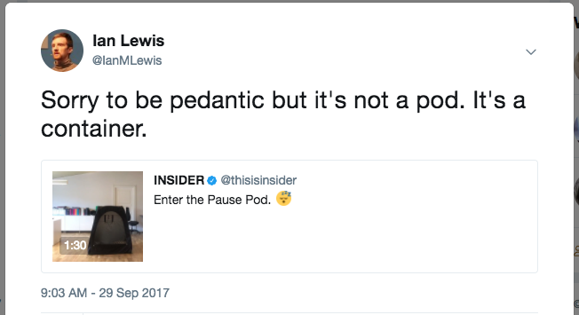

The Almighty Pause Container - Ian Lewis

# The Almighty Pause Container

*Oct. 10, 2017*

[(L)](https://plus.google.com/share?app=110&url=https%3A%2F%2Fwww.ianlewis.org%2Fen%2Falmighty-pause-container)

[**Tweet](https://twitter.com/intent/tweet?original_referer=https%3A%2F%2Fwww.ianlewis.org%2Fen%2Falmighty-pause-container&ref_src=twsrc%5Etfw&related=IanMLewis&text=The%20Almighty%20Pause%20Container&tw_p=tweetbutton&url=https%3A%2F%2Fwww.ianlewis.org%2Fen%2Falmighty-pause-container&via=IanMLewis)

 [docker](https://www.ianlewis.org/en/tag/docker)  [kubernetes](https://www.ianlewis.org/en/tag/kubernetes)

When checking out the nodes of your Kubernetes cluster, you may have noticed some containers called "pause" running when you do a `docker ps` on the node.

$ docker ps
CONTAINER ID IMAGE COMMAND ...
...
3b45e983c859 gcr.io/google_containers/pause-amd64:3.0 "/pause" ...
...
dbfc35b00062 gcr.io/google_containers/pause-amd64:3.0 "/pause" ...
...
c4e998ec4d5d gcr.io/google_containers/pause-amd64:3.0 "/pause" ...
...
508102acf1e7 gcr.io/google_containers/pause-amd64:3.0 "/pause" ...

What are these "pause" containers and why are there so many of them? What's going on?

In order to answer these questions, we need to take a step back and look at how pods in Kubernetes are implemented, particularly with the Docker/containerd runtime. If you haven't already done so, please read my [previous post](https://www.ianlewis.org/en/what-are-kubernetes-pods-anyway) on Kubernetes pods.

Docker supports containers, which are great for deploying single units of software. However, this model can become a bit cumbersome when you want to run multiple pieces of software together. You often see this when developers create Docker images that use supervisord as an entrypoint to start and manage multiple processes. For production systems, many have found that it is instead more useful to deploy those applications in groups of containers that are partially isolated and partially share an environment.

Kubernetes provides a clean abstraction called pods for just this use case. It hides the complexity of Docker flags and the need to babysit the containers, shared volumes, and the like. It also hides differences between container runtimes. For example, [rkt supports pods natively](https://coreos.com/rkt/docs/latest/app-container.html#pods) so there is less work for Kubernetes to do but you as the user of Kubernetes don't have to worry about it.

In principle, anyone can configure Docker to control the level of sharing between groups of containers -- you just have to create a parent container, know exactly the right flag setting to use to create new containers that share the same environment, and then manage the lifetime of those containers. Managing the lifetimes of all of these pieces can get pretty complex.

In Kubernetes, the pause container serves as the "parent container" for all of the containers in your pod. The pause container has two core responsibilities. First, it serves as the basis of Linux namespace sharing in the pod. And second, with PID (process ID) namespace sharing enabled, it serves as PID 1 for each pod and reaps zombie processes.

## Sharing namespaces

In Linux, when you run a new process, the process inherits its namespaces from the parent process. The way that you run a process in a new namespace is by "unsharing" the namespace with the parent process thus creating a new namespace. Here is an example using the `unshare` tool to run a shell in new PID, UTS, IPC, and mount namespaces.

sudo unshare --pid --uts --ipc --mount -f chroot rootfs /bin/sh

Once the process is running, you can add other processes to the process' namespace to form a pod. New processes can be added to an existing namespace using the `setns` system call.

Containers in a pod share namespaces among them. Docker lets you automate the process a bit so let's look at an example of how to create a pod from scratch by using the pause container and sharing namespaces. First we will need to start the pause container with Docker so that we can add our containers to the pod.

docker run -d --name pause gcr.io/google_containers/pause-amd64:3.0

Then we can run the containers for our pod. First we will run nginx. This will set up nginx to proxy requests to its localhost on port 2368.

$ cat <<EOF >> nginx.conf> error_log stderr;> events { worker_connections 1024; }> http {> access_log /dev/stdout combined;> server {> listen 80 default_server;> server_name example.com www.example.com;> location / {> proxy_pass http://127.0.0.1:2368;> }> }> }> EOF$ docker run -d --name nginx -v `pwd`/nginx.conf:/etc/nginx/nginx.conf -p 8080:80 --net=container:pause --ipc=container:pause --pid=container:pause --net=container:pause nginx

And then we will create another container for the [ghost](https://github.com/TryGhost/Ghost) blog application which serves as our application server.

$ docker run -d --name ghost --net=container:pause --ipc=container:pause --pid=container:pause --net=container:pause ghost

In both cases we specify the pause container as the container whose namespaces we want to join. This will effectively create our pod. If you access `http://localhost:8080/` you should be able to see ghost running through an nginx proxy because the network namespace is shared among the pause, nginx, and ghost containers.

If you think all of this is complex, you're right; it is. And we haven't even gotten into how to monitor and manage the lifetimes of these containers. The nice thing about Kubernetes is that through pods, Kubernetes manages all of this for you.

## Reaping Zombies

In Linux, processes in a PID namespace form a tree with each process having a parent process. Only one process at the root of the tree doesn't really have a parent. This is the "init" process, which has PID 1.

Processes can start other processes using the `fork` or `exec` syscall. When they do this, the new process' parent is the process that called the `fork` or `exec` syscall. `fork` is used to start another copy of the running process and `exec` is used to start different process. Each process has an entry in the OS process table. This records info about the process' state and exit code. When a child process has finished running, its process table entry remains until the parent process has retrieved its exit code using the `wait` syscall. This is called "reaping" zombie processes.

**

> [> CC0 Creative Commons](https://creativecommons.org/publicdomain/zero/1.0/deed.en)>  https://pixabay.com/en/zombie-warning-road-sign-roadsign-147945/

**

Zombie processes are processes that have stopped running but their process table entry still exists because the parent process hasn't retrieved it via the `wait` syscall. Technically each process that terminates is a zombie for a very short period of time but they could live for longer.

Longer lived zombie processes occur when parent processes don't call the `wait` syscall after the child process has finished. One situation where this occurs is when the parent process is poorly written and simply omits the `wait` call or when the parent process dies before the child and the new parent process does not call `wait` on it. When a process' parent dies before the child, the OS assigns the child process to the "init" process or PID 1. i.e. The init process "adopts" the child process and becomes its parent. This means that now when the child process exits the new parent (init) must call `wait`to get its exit code or its process table entry remains forever and it becomes a zombie.

In containers, one process must be the init process for each PID namespace. With Docker, each container usually has its own PID namespace and the ENTRYPOINT process is the init process. However, as I noted in my [previous post](https://www.ianlewis.org/en/what-are-kubernetes-pods-anyway) on Kubernetes pods, a container can be made to run in another container's namespace. In this case, one container must assume the role of the init process, while others are added to the namespace as children of the init process.

In the post on Kubernetes pods, I ran nginx in a container, and added ghost to the PID namespace of the nginx container.

$ docker run -d --name nginx -v `pwd`/nginx.conf:/etc/nginx/nginx.conf -p 8080:80 nginx

$ docker run -d --name ghost --net=container:nginx --ipc=container:nginx --pid=container:nginx --net=container:nginx ghost

In this case, nginx is assuming the role of PID 1 and ghost is added as a child process of nginx. This is mostly fine, but technically nginx is now responsible for any children that ghost orphans. If, for example, ghost forks itself or runs child processes using `exec`, and crashes before the child finishes, then those children will be adopted by nginx. However, nginx is not designed to be able to run as an init process and reap zombies. That means we could potentially have lots of them and they will last for the life of that container.

In Kubernetes pods, containers are run in much the same way as above, but there is a special pause container that is created for each pod. This pause container runs a very simple process that performs no function but essentially sleeps forever (see the `pause()` call below). It's so simple that I can include the full source code as of this writing here:

*/***Copyright 2016 The Kubernetes Authors.**Licensed under the Apache License, Version 2.0 (the "License");**you may not use this file except in compliance with the License.**You may obtain a copy of the License at** http://www.apache.org/licenses/LICENSE-2.0**Unless required by applicable law or agreed to in writing, software**distributed under the License is distributed on an "AS IS" BASIS,**WITHOUT WARRANTIES OR CONDITIONS OF ANY KIND, either express or implied.**See the License for the specific language governing permissions and**limitations under the License.***/*#include  <signal.h>#include  <stdio.h>#include  <stdlib.h>#include  <sys/types.h>#include  <sys/wait.h>#include  <unistd.h>static  void  sigdown(int  signo)  {  psignal(signo,  "Shutting down, got signal");  exit(0);}static  void  sigreap(int  signo)  {  while  (waitpid(-1,  NULL,  WNOHANG)  >  0);}int  main()  {  if  (getpid()  !=  1)  */* Not an error because pause sees use outside of infra containers. */*  fprintf(stderr,  "Warning: pause should be the first process\n");  if  (sigaction(SIGINT,  &(struct  sigaction){.sa_handler  =  sigdown},  NULL)  <  0)  return  1;  if  (sigaction(SIGTERM,  &(struct  sigaction){.sa_handler  =  sigdown},  NULL)  <  0)  return  2;  if  (sigaction(SIGCHLD,  &(struct  sigaction){.sa_handler  =  sigreap,  .sa_flags  =  SA_NOCLDSTOP},  NULL)  <  0)  return  3;  for  (;;)  pause();  fprintf(stderr,  "Error: infinite loop terminated\n");  return  42;}

As you can see, it doesn't simply sleep. It performs one other important function. It assumes the role of PID 1 and will reap any zombies by calling `wait` on them when they are orphaned by their parent process (see `sigreap`). This way we don't get zombies piling up in the PID namespaces of our Kubernetes pods.

## Some Context on PID Namespace Sharing

It's useful to note that there has been a lot of back-and-forth on PID namespace sharing. Reaping zombies is only done by the pause container if you have PID namespace sharing enabled, and currently it is only available in Kubernetes 1.7+. It is enabled by default if running Kubernetes 1.7 with Docker 1.13.1+ unless disabled with a [kubelet flag](https://kubernetes.io/docs/admin/kubelet/) (`--docker-disable-shared-pid=true`). This was [reverted](https://github.com/kubernetes/kubernetes/pull/51634) in Kubernetes 1.8 and now it's disabled by default unless enabled by a kubelet flag (`--docker-disable-shared-pid=false`). See the discussion on adding support for PID namespace sharing in [this GitHub issue](https://github.com/kubernetes/kubernetes/issues/1615).

If PID namespace sharing is not enabled then each container in a Kubernetes pod will have its own PID 1 and each one will need to reap zombie processes itself. Many times it isn't a problem because the application doesn't spawn other processes, but zombie processes using up memory is an often overlooked issue. Because of this, and because PID namespace sharing enables you to send signals between containers in the same pod, I really hope that PID namespace sharing becomes the default in Kubernetes.

## Join us in the Community

Hopefully this post helped in illuminating a core part of Kubernetes. Let me know if this post was helpful in the comments below or on [Twitter](https://twitter.com/IanMLewis). If you are interested in Kubernetes and want to join us in the community, you can do that in a number of ways:

- Post and answer questions on [Stack Overflow](http://stackoverflow.com/questions/tagged/kubernetes)
- Follow [@Kubernetesio](https://twitter.com/kubernetesio) on Twitter (While you're at it follow [me](https://twitter.com/IanMLewis) too!)
- Join the Kubernetes[Slack](http://slack.k8s.io/) and chat with us. (I'm ianlewis so say Hi!)
- Contribute to the Kubernetes project on[GitHub](https://github.com/kubernetes/kubernetes)

Hope to see you soon!

* * *

- [5 comments]()
- [**Ian Lewis' Blog**](https://disqus.com/home/forums/ianlewisblog/)
- [(L)](https://disqus.com/embed/comments/?base=default&f=ianlewisblog&t_u=https%3A%2F%2Fwww.ianlewis.org%2Fen%2Falmighty-pause-container&t_d=The%20Almighty%20Pause%20Container&t_t=The%20Almighty%20Pause%20Container&s_o=default#)
- [](https://disqus.com/home/inbox/)
- [ Recommend  1](https://disqus.com/embed/comments/?base=default&f=ianlewisblog&t_u=https%3A%2F%2Fwww.ianlewis.org%2Fen%2Falmighty-pause-container&t_d=The%20Almighty%20Pause%20Container&t_t=The%20Almighty%20Pause%20Container&s_o=default#)
- [⤤  Share](https://disqus.com/embed/comments/?base=default&f=ianlewisblog&t_u=https%3A%2F%2Fwww.ianlewis.org%2Fen%2Falmighty-pause-container&t_d=The%20Almighty%20Pause%20Container&t_t=The%20Almighty%20Pause%20Container&s_o=default#)
- [Sort by Best](https://disqus.com/embed/comments/?base=default&f=ianlewisblog&t_u=https%3A%2F%2Fwww.ianlewis.org%2Fen%2Falmighty-pause-container&t_d=The%20Almighty%20Pause%20Container&t_t=The%20Almighty%20Pause%20Container&s_o=default#)

Join the discussion…

- [Attach](https://disqus.com/embed/comments/?base=default&f=ianlewisblog&t_u=https%3A%2F%2Fwww.ianlewis.org%2Fen%2Falmighty-pause-container&t_d=The%20Almighty%20Pause%20Container&t_t=The%20Almighty%20Pause%20Container&s_o=default#)

-

 [Rory McCune](https://disqus.com/by/rorymccune/)    •  [2 days ago](https://www.ianlewis.org/en/almighty-pause-container#comment-3562586984)

This is a really awesome post, thanks for making it :)

One quick question, in the `docker run` examples where --net is there twice is that needed or just a typo?

    - [−](https://disqus.com/embed/comments/?base=default&f=ianlewisblog&t_u=https%3A%2F%2Fwww.ianlewis.org%2Fen%2Falmighty-pause-container&t_d=The%20Almighty%20Pause%20Container&t_t=The%20Almighty%20Pause%20Container&s_o=default#)
    - [****](https://disqus.com/embed/comments/?base=default&f=ianlewisblog&t_u=https%3A%2F%2Fwww.ianlewis.org%2Fen%2Falmighty-pause-container&t_d=The%20Almighty%20Pause%20Container&t_t=The%20Almighty%20Pause%20Container&s_o=default#)

-

 [bradurani](https://disqus.com/by/bradurani/)    •  [2 days ago](https://www.ianlewis.org/en/almighty-pause-container#comment-3561756056)

How does this affect logging? Typically Docker only logs stdout of PID 1, but then against k8s doesn't use the Docker runtime, does it

    - [−](https://disqus.com/embed/comments/?base=default&f=ianlewisblog&t_u=https%3A%2F%2Fwww.ianlewis.org%2Fen%2Falmighty-pause-container&t_d=The%20Almighty%20Pause%20Container&t_t=The%20Almighty%20Pause%20Container&s_o=default#)
    - [****](https://disqus.com/embed/comments/?base=default&f=ianlewisblog&t_u=https%3A%2F%2Fwww.ianlewis.org%2Fen%2Falmighty-pause-container&t_d=The%20Almighty%20Pause%20Container&t_t=The%20Almighty%20Pause%20Container&s_o=default#)

    -

 [cpuguy83](https://disqus.com/by/cpuguy83/)    [*>* bradurani](https://www.ianlewis.org/en/almighty-pause-container#comment-3561756056)  •  [2 days ago](https://www.ianlewis.org/en/almighty-pause-container#comment-3562077670)

Docker logs the stdout/stderr of the process it started. This is true even if containers share a pid namespace.

The I/O streams can also be inherited by children of the process that Docker started, if the children are started that way.

        - [−](https://disqus.com/embed/comments/?base=default&f=ianlewisblog&t_u=https%3A%2F%2Fwww.ianlewis.org%2Fen%2Falmighty-pause-container&t_d=The%20Almighty%20Pause%20Container&t_t=The%20Almighty%20Pause%20Container&s_o=default#)
        - [****](https://disqus.com/embed/comments/?base=default&f=ianlewisblog&t_u=https%3A%2F%2Fwww.ianlewis.org%2Fen%2Falmighty-pause-container&t_d=The%20Almighty%20Pause%20Container&t_t=The%20Almighty%20Pause%20Container&s_o=default#)

    -

harry zhang  [*>* bradurani](https://www.ianlewis.org/en/almighty-pause-container#comment-3561756056)  •  [2 days ago](https://www.ianlewis.org/en/almighty-pause-container#comment-3561765442)

Kubernetes use Docker as default runtime of course. The only difference is Kubernetes use CRI as a abstract layer to call docker API, so nothing changed indeed.

        - [−](https://disqus.com/embed/comments/?base=default&f=ianlewisblog&t_u=https%3A%2F%2Fwww.ianlewis.org%2Fen%2Falmighty-pause-container&t_d=The%20Almighty%20Pause%20Container&t_t=The%20Almighty%20Pause%20Container&s_o=default#)
        - [****](https://disqus.com/embed/comments/?base=default&f=ianlewisblog&t_u=https%3A%2F%2Fwww.ianlewis.org%2Fen%2Falmighty-pause-container&t_d=The%20Almighty%20Pause%20Container&t_t=The%20Almighty%20Pause%20Container&s_o=default#)

## Also on **Ian Lewis' Blog**

- [

### A Japanese Python Community Who's Who

    - 1 comment •

    - 5 years ago

[scoria—How to become a member of this community?](http://disq.us/?url=http%3A%2F%2Fwww.ianlewis.org%2Fen%2Fjapanese-python-community-whos-who&key=yxhPTfDewsda7T9HPQzpJg)](http://disq.us/?url=http%3A%2F%2Fwww.ianlewis.org%2Fen%2Fjapanese-python-community-whos-who&key=yxhPTfDewsda7T9HPQzpJg)

- [

### Creating Smaller Docker Images Part #3: Alpine Linux

    - 1 comment •

    - 4 months ago

[Vincent De Smet—ideally use `--no-cache` instead of `--update ... rm -rf...` Also have a look at https://github.com/jessfraz...](https://disq.us/?url=https%3A%2F%2Fwww.ianlewis.org%2Fen%2Fcreating-smaller-docker-images-part-3-alpine-linux&key=zUHC3Kz_fT7ylna2zCG0vA)](https://disq.us/?url=https%3A%2F%2Fwww.ianlewis.org%2Fen%2Fcreating-smaller-docker-images-part-3-alpine-linux&key=zUHC3Kz_fT7ylna2zCG0vA)

- [

### Kubernetes Health Checks in Django

    - 4 comments •

    - 5 months ago

[Ian Lewis—Grad it was useful!](https://disq.us/?url=https%3A%2F%2Fwww.ianlewis.org%2Fen%2Fkubernetes-health-checks-django&key=DtEGEE2cnZO9WwSL-XnmEQ)](https://disq.us/?url=https%3A%2F%2Fwww.ianlewis.org%2Fen%2Fkubernetes-health-checks-django&key=DtEGEE2cnZO9WwSL-XnmEQ)

- [

### How kubeadm Initializes Your Kubernetes Master

    - 13 comments •

    - a year ago

[Ian Lewis—kubeadm doesn't support multiple masters at the moment. See the limitations in the doc: https://kubernetes.io/docs/...](https://disq.us/?url=https%3A%2F%2Fwww.ianlewis.org%2Fen%2Fhow-kubeadm-initializes-your-kubernetes-master&key=jmG8avLWX71niYGFcdUkwg)](https://disq.us/?url=https%3A%2F%2Fwww.ianlewis.org%2Fen%2Fhow-kubeadm-initializes-your-kubernetes-master&key=jmG8avLWX71niYGFcdUkwg)

- [Powered by Disqus](https://disqus.com/)
- [*✉*Subscribe*✔*](https://disqus.com/embed/comments/?base=default&f=ianlewisblog&t_u=https%3A%2F%2Fwww.ianlewis.org%2Fen%2Falmighty-pause-container&t_d=The%20Almighty%20Pause%20Container&t_t=The%20Almighty%20Pause%20Container&s_o=default#)
- [*d*Add Disqus to your site](https://publishers.disqus.com/engage?utm_source=ianlewisblog&utm_medium=Disqus-Footer)
- [*🔒*Privacy](https://help.disqus.com/customer/portal/articles/466259-privacy-policy)