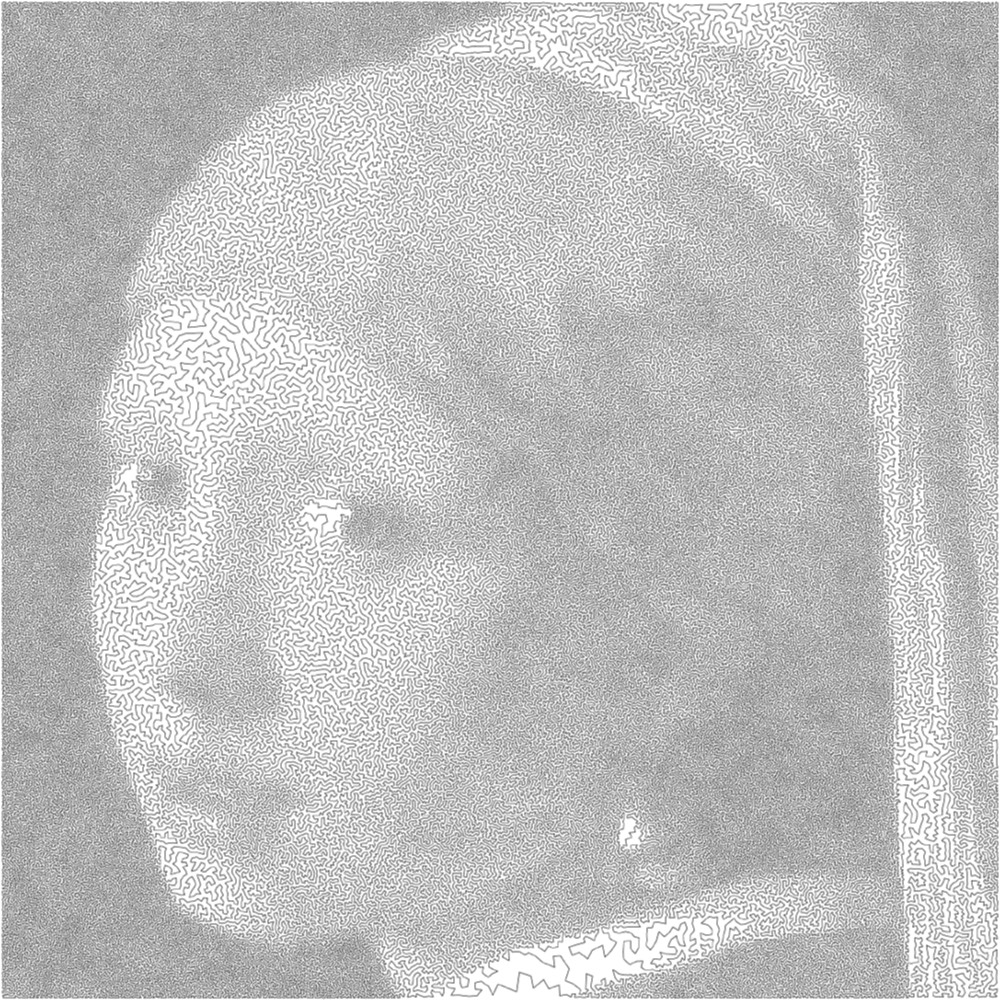

The Art of the Travelling Salesman Problem

## The Art of the Travelling Salesman Problem

posted by [Jason Kottke](http://www.kottke.org/)  **  Nov 21, 2019

All art is bounded by one constraint or another. Mathematician [Robert Bosch](http://www2.oberlin.edu/math/faculty/bosch.html) makes what he calls “optimization art”, which is best embodied by [these](http://www.math.uwaterloo.ca/tsp/data/art/)  [images](http://www2.oberlin.edu/math/faculty/bosch/tspart-page.html) produced as solutions to the travelling salesman problem. Each image is made up of a continuous line that is the shortest possible route through a series of points without revisiting any single point, much like [the optimal route of a travelling salesperson visiting cities](https://en.wikipedia.org/wiki/Travelling_salesman_problem). The rendition of a van Gogh self-portrait uses a solution for 120,000 “cities” while the single line forming the Girl with the Pearl Earring visits 200,000 cities.

I would love to see an [Observable](https://observablehq.com/) notebook where you could upload any photo to make images like these. (via [@Ianmurren](https://twitter.com/Ianmurren))

More about...

- [art](https://kottke.org/tag/art)/
- [mathematics](https://kottke.org/tag/mathematics)/
- [remix](https://kottke.org/tag/remix)/
- [Robert Bosch](https://kottke.org/tag/Robert%20Bosch)

[ads via Carbon](https://carbonads.net/)

[The industry’s leading email marketing platform.](https://srv.carbonads.net/ads/click/x/GTND42QUCEBD627JCVY4YKQMCABDTKQMCTYDCZ3JCWSIVK3LFTAIVK3KC6BI523WC67I6K3EHJNCLSIZ?segment=placement:kottkeorg;)