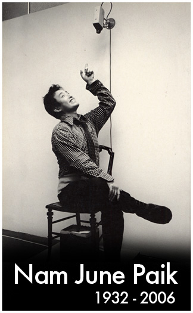
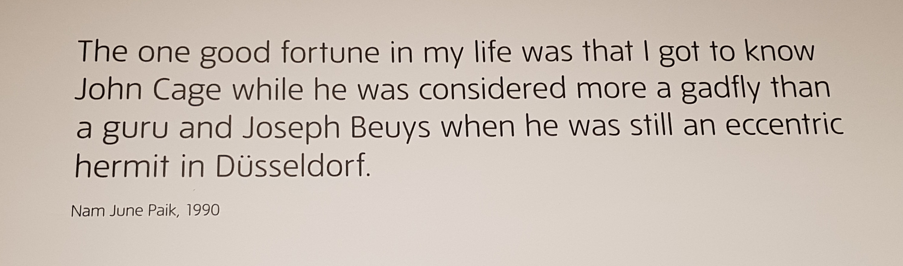
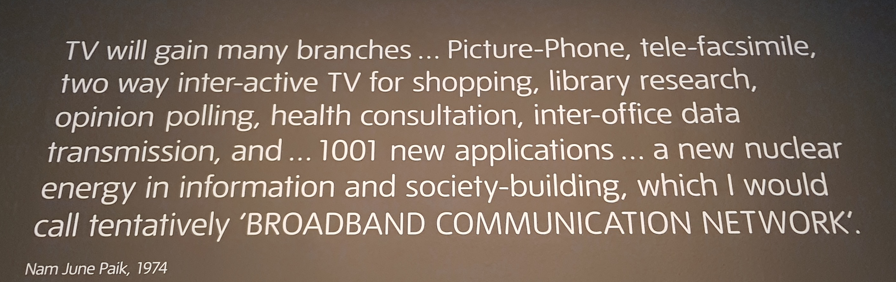
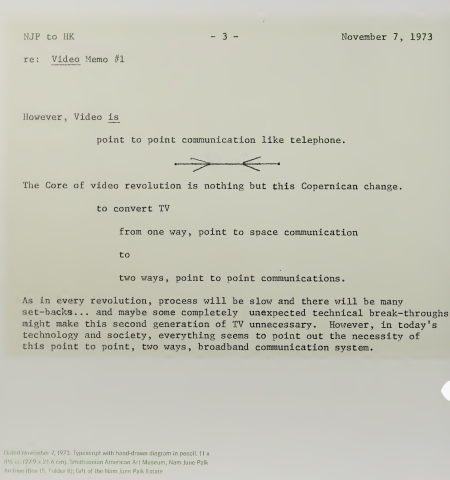
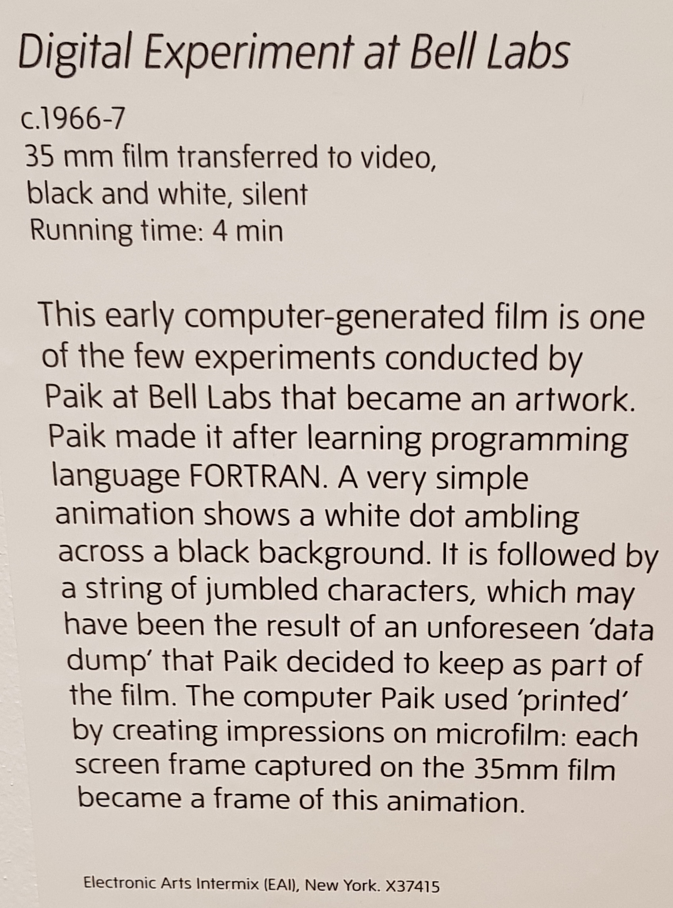
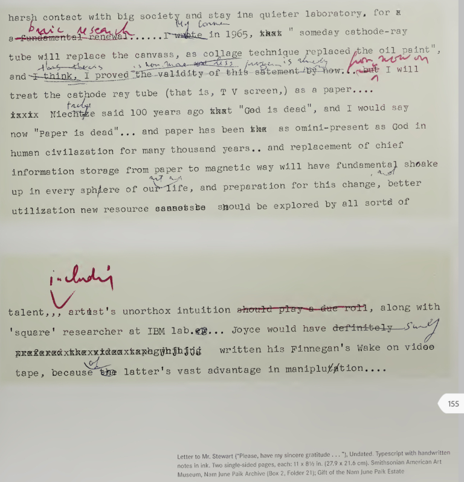
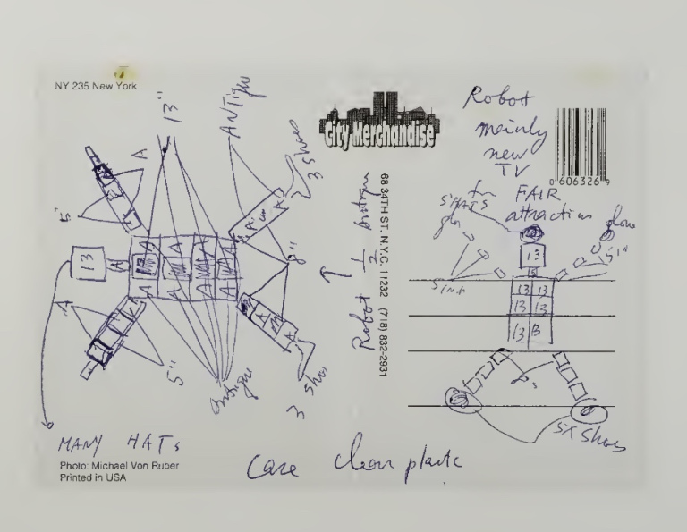
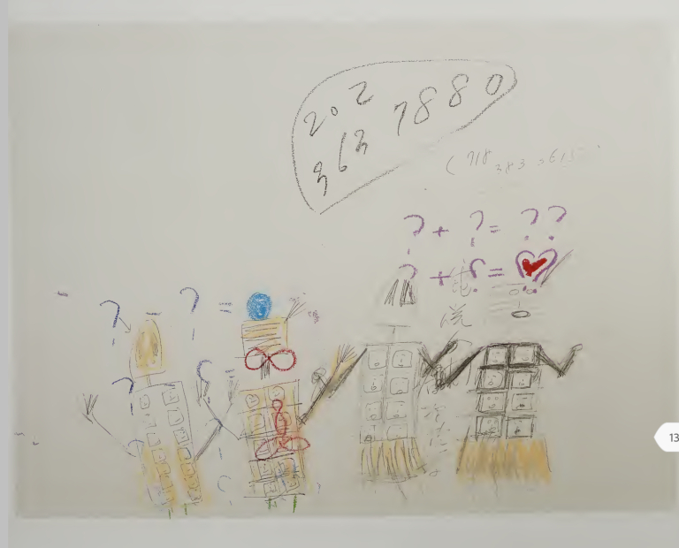
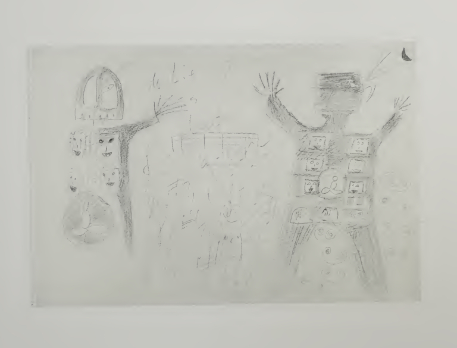
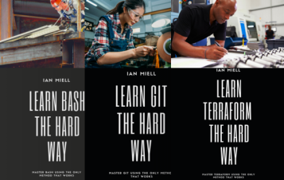

The Astonishing Prescience of Nam June Paik – zwischenzugs

# The Astonishing Prescience of Nam June Paik

[zwischenzugs](https://zwischenzugs.com/author/zwischenzugs/)[Uncategorized](https://zwischenzugs.com/category/uncategorized/)January 4, 20204 Minutes

I hadn’t heard of [Nam June Paik](https://en.wikipedia.org/wiki/Nam_June_Paik) until I went to his exhibition at Tate Modern a few weeks ago.

I left feeling sheepish that I hadn’t heard of him before I went. I knew a bit about Warhol and Duchamp, but had no idea there was another artist so far ahead of his time working in the US during the 60s and 70s.

Not only was his work moving, thoughtful, and provocative, it was breathtakingly far-sighted. He seems to have understood the implications of the technical changes happening in the last century far more clearly than any other science fiction writer or artist I’m aware of.

Here’s some examples of how he saw further than others.

### 1) He Might Have Invented Music Sampling

In 1959, several decades before Grandmaster Flash, Paik spliced together different sounds to create a fresh musical work.

He originally studied music history, and gave up on it after meeting John Cage around this time, as he figured Cage already had avant-garde music covered.

*EDIT: But see: [Musique Concrete](https://en.wikipedia.org/wiki/Musique_concr%C3%A8te)*

### 2) He Invented Video Art

An early adopter of all technology, he bought a [Portapak](https://en.wikipedia.org/wiki/Portapak) as soon as it was released in 1964, and presented the first [Video Art](https://en.wikipedia.org/wiki/Video_art)on the same day, at the Cafe Au Go Go in Greenwich Village, New York.

### 3) He predicted the Internet… in the early 70s

Just read how he struggles to find the language in 1974 to get across his vision:

> “TV will gain many branches… Picture-Phone, tele-facsimilie, two way inter-active TV for shopping, library research, opinion polling, health consultation, inter-office data transmission and … 1001 new applications … a new nuclear energy in information and society-building, which I would call tenatively

> ‘BROADBAND COMMUNICATION NETWORK’.
> Nam June Paik, 1974

and in 1973, saw that ‘point to point communication’ was a ‘Copernican change’:

And he coined the phrase ‘Electronic Super-Highway’ in 1974…

> “The building of new electronic super highways will become an even huger enterprise. Assuming we connect New York with Los Angeles by means of an electronic telecommunication network that operates in strong transmission ranges, as well as with continental satellites, wave guides, bundled coaxial cable, and later also via laser beam fiber optics: the expenditure would be about the same as for a > [> Moon landing](https://en.wikipedia.org/wiki/Moon_landing)> , except that the benefits in term of by-products would be greater.

*> —**> Nam June Paik, Media Planning for the Postindustrial Society – The 21st Century is now only 26 years away (1974)*

### 4) He Might Have Invented Digital Film at Bell Labs

Paik spent time with the engineering elite at [Bell Labs](https://en.wikipedia.org/wiki/Bell_Labs) in 1966 and learned FORTRAN to produce a small animation of a dot moving around the screen. It’s not exactly a Pixar feature film, but quite staggering to think that this was the state of the art just 50 years ago.

### 5) He predicted YouTube

Paik put all these insights together and worked out that video would be freely exchanged across the world.

He called it the ‘Video Common Market’. Again, you can see how his insights outstrip the language available to him in a wonderfully quaint way.

He produced works like [Global Groove](https://www.eai.org/titles/3287) to explore these ideas of cultural exchange:

‘This is a glimpse of a video landscape of tomorrow when you will be able to switch on any TV station on the earth and TV guides will be as fat as the Manhattan telephone book.’

and kept pace with technology as it developed, overseeing [‘Wrap Around the World’](http://www.medienkunstnetz.de/works/wrap-around-the-world/) where David Bowie performed a song before handing over live in real time to [Ryuichi Sakamoto](https://en.wikipedia.org/wiki/Ryuichi_Sakamoto) to play another (an exquisite Japanese piece I can’t find) while an estimated 50 million people watched, followed by a car race in Ireland, some Kung Fu, and a few other musical performances. To add to the surreality, [Al Franken](https://en.wikipedia.org/wiki/Al_Franken) was the compere.

### 6) He Predicted eBooks

Well before their advent, he talked about the implications of ‘paperless books’, and declared that ‘paper is dead’. He saw that magnetic storage was a radical historical shift, and an opportunity to use resources more effectively. I guess he didn’t anticipate how many cat gifs it would be deemed necessary to store and distribute.

> ‘Nietzsche said “God is dead” and I would say now “Paper is dead”… and paper has been as omni-present as God in human civilization for many thousand [sic] years.. and replacement of chief information storage from paper to magnetic way will have fundamental shake up in every sphere of our life, and preparation for this change, better utilization new resource should be explored by all sorts of talent’

*> —*> Letter from Paik to Mr Stewart, undated

I think it’s fair to say that paper is as dead as God was 50 years after Nietzsche wrote those words.

### 6) He Did The Artwork For ‘OK Computer’

**OK, well that one’s a lie.**
But I think he could have:

* * *

You can see more about the exhibition here:

### A Call For Artworks

I felt quite sad that I don’t know whether or not similar interesting work is going on now. I’ve struggled to find anything similar using the tools that Paik perceived would exist. What would he be doing today?

Who is creating art with blockchain, or manipulating social media to create happenings of significance instead of manipulating elections? The last really interesting thing I remember hearing about was the [Luther Blissett](https://en.wikipedia.org/wiki/Luther_Blissett_%28nom_de_plume%29) mob in the 1990s, though that says more about my vintage than anything about the cutting edge.

Tell me about the interesting experiments with media going on now, please!

* * *

***If you like this, you might like one of my books:
[Learn Bash the Hard Way](https://leanpub.com/learnbashthehardway?p=4369)***
***[Learn Git the Hard Way](https://leanpub.com/learngitthehardway?p=4369)***

***[Learn Terraform the Hard Way](https://leanpub.com/learnterraformthehardway)***

***[Get 39% off Docker in Practice with the code: 39miell2](https://www.manning.com/books/docker-in-practice-second-edition?a_aid=zwischenzugs&a_bid=550032fc)***

* * *

### Share this:

- [Email](https://zwischenzugs.com/2020/01/04/the-astonishing-prescience-of-nam-june-paik/?share=email&nb=1)

-

- [reddit](https://www.reddit.com/submit?url=https%3A%2F%2Fzwischenzugs.com%2F2020%2F01%2F04%2Fthe-astonishing-prescience-of-nam-june-paik%2F&title=The%20Astonishing%20Prescience%20of%20Nam%20June%20Paik)

[Upvote](https://www.reddit.com/submit?url=https%3A%2F%2Fzwischenzugs.com%2F2020%2F01%2F04%2Fthe-astonishing-prescience-of-nam-june-paik%2F&title=The%20Astonishing%20Prescience%20of%20Nam%20June%20Paik)[Downvote](https://www.reddit.com/submit?url=https%3A%2F%2Fzwischenzugs.com%2F2020%2F01%2F04%2Fthe-astonishing-prescience-of-nam-june-paik%2F&title=The%20Astonishing%20Prescience%20of%20Nam%20June%20Paik)[(L)](https://www.reddit.com/submit?url=https%3A%2F%2Fzwischenzugs.com%2F2020%2F01%2F04%2Fthe-astonishing-prescience-of-nam-june-paik%2F&title=The%20Astonishing%20Prescience%20of%20Nam%20June%20Paik)

- [**Tweet](https://twitter.com/intent/tweet?original_referer=https%3A%2F%2Fzwischenzugs.com%2F2020%2F01%2F04%2Fthe-astonishing-prescience-of-nam-june-paik%2F&ref_src=twsrc%5Etfw&related=wordpressdotcom&text=The%20Astonishing%20Prescience%20of%20Nam%20June%20Paik&tw_p=tweetbutton&url=https%3A%2F%2Fzwischenzugs.com%2F2020%2F01%2F04%2Fthe-astonishing-prescience-of-nam-june-paik%2F&via=ianmiell)
- [ Post]()
- [*28*****  ****]()
- [(L)](https://www.facebook.com/sharer/sharer.php?kid_directed_site=0&sdk=joey&u=https%3A%2F%2Fzwischenzugs.com%2F2020%2F01%2F04%2Fthe-astonishing-prescience-of-nam-june-paik%2F&display=popup&ref=plugin&src=share_button)

-
.

[Like](https://widgets.wp.com/likes/index.html?ver=20190321#)
Be the first to like this.

### *Related*

[The First Non-Bullshit Book About Culture I've Read](https://zwischenzugs.com/2019/11/27/the-first-non-bullshit-book-about-culture-ive-read/)With 20 comments

[Shakespeare's Vocabulary Considered Unexceptional](https://zwischenzugs.com/2011/03/06/shakespeare_unexceptional_vocabulary/)In "Technical"

[Why Everyone Working in DevOps Should Read The Toyota Way](https://zwischenzugs.com/2019/11/06/why-everyone-working-in-devops-should-read-the-toyota-way/)With 13 comments

## Published by zwischenzugs

[View all posts by zwischenzugs](https://zwischenzugs.com/author/zwischenzugs/)

**Published**January 4, 2020