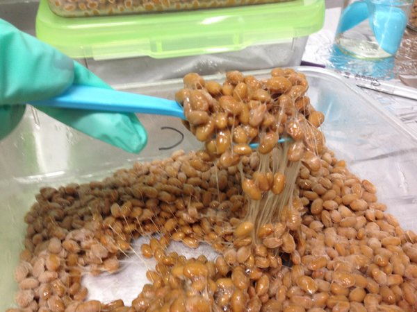

The Benefits of Intermittent Fasting - The New York Times

Personal Health

# The Benefits of Intermittent FastingThe Benefits of Intermittent Fasting

I was skeptical, but it turns out there is something to be said for a daily fast, preferably one lasting at least 16 hours.

Credit...Gracia Lam

By [Jane E. Brody](https://www.nytimes.com/by/jane-e-brody)

- Feb. 17, 2020Updated 10:15 a.m. ET

-

    - 
    - 
    - [](https://www.nytimes.com/2020/02/17/well/eat/the-benefits-of-intermittent-fasting.html?algo=identity&fellback=false&imp_id=964721362&imp_id=178712384&action=click&module=Science%20%20Technology&pgtype=Homepagemailto:?subject=NYTimes.com%3A%20The%20Benefits%20of%20Intermittent%20Fasting&body=From%20The%20New%20York%20Times%3A%0A%0AThe%20Benefits%20of%20Intermittent%20Fasting%0A%0AI%20was%20skeptical%2C%20but%20it%20turns%20out%20there%20is%20something%20to%20be%20said%20for%20a%20daily%20fast%2C%20preferably%20one%20lasting%20at%20least%2016%20hours.%0A%0Ahttps%3A%2F%2Fwww.nytimes.com%2F2020%2F02%2F17%2Fwell%2Feat%2Fthe-benefits-of-intermittent-fasting.html)

    -
    -
    -

I’ve long thought the human body was not meant to run on empty, that fasting was done primarily for religious reasons or political protest. Otherwise we needed a reliably renewed source of fuel to function optimally, mentally and emotionally as well as physically.

Personal experience reinforced that concept; I’m not pleasant to be around when I’m hungry. There’s even [an official name for that state of mind](https://www.oed.com/view/Entry/62919984?redirectedFrom=hangry), confirmed by research: Hangry!

But prompted by recent enthusiasm for fasting among people concerned about their health, weight or longevity, I looked into the evidence for possible benefits — and risks — of what researchers call intermittent fasting. Popular regimens range from ingesting few if any calories all day every other day or several times a week to fasting for 16 hours or more every day.

A man I know in his early 50s said he had lost 12 pounds in about two months on what he calls the 7-11 diet: He eats nothing from 7 p.m. until 11 a.m. the next morning, every day.

I was skeptical, but it turns out there is something to be said for practicing a rather prolonged diurnal fast, preferably one lasting at least 16 hours. Mark P. Mattson, neuroscientist at the National Institute on Aging and Johns Hopkins University School of Medicine, explained that the liver stores glucose, which the body uses preferentially for energy before it turns to burning body fat.

“It takes 10 to 12 hours to use up the calories in the liver before a metabolic shift occurs to using stored fat,” Dr. Mattson told me. After meals, glucose is used for energy and fat is stored in fat tissue, but during fasts, once glucose is depleted, fat is broken down and used for energy.

Most people trying to lose weight should strive for 16 calorie-free hours, he said, adding that “the easiest way to do this is to stop eating by 8 p.m., skip breakfast the next morning and then eat again at noon the next day.” (Caffeine-dependent people can have sugar- free black coffee or tea before lunch.) But don’t expect to see results immediately; it can take up to four weeks to notice an effect, he said.

Dr. Mattson and his colleague Rafael de Cabo at the aging institute [recently reviewed the effects of intermittent fasting](https://www.nejm.org/doi/full/10.1056/NEJMra1905136) on health, aging and disease in The New England Journal of Medicine.

Their article was prompted by frequent questions patients are asking their doctors about the health effects of fasting. Given their limited knowledge of nutrition, doctors are often unable to advise their patients, Dr. Mattson said.

## Editors’ Picks

[### How Cooking Dinner Can Change Your Life](https://www.nytimes.com/2020/02/12/magazine/family-dinner-beef-stroganoff.html?algo=bandit-story_desk_filter&fellback=false&imp_id=58005761&imp_id=73737987)

[### Never Mind the Internet. Here’s What’s Killing Malls.](https://www.nytimes.com/2020/02/13/business/not-internet-really-killing-malls.html?algo=bandit-story_desk_filter&fellback=false&imp_id=727144870&imp_id=365290340)

[### Your Cheatin’ Wallet](https://www.nytimes.com/2020/02/14/parenting/financial-infidelity.html?algo=bandit-story_desk_filter&fellback=false&imp_id=565909922&imp_id=149488855)

[Continue reading the main story](https://www.nytimes.com/2020/02/17/well/eat/the-benefits-of-intermittent-fasting.html?algo=identity&fellback=false&imp_id=964721362&imp_id=178712384&action=click&module=Science%20%20Technology&pgtype=Homepage&action=click&module=editorContent&pgtype=Article&region=CompanionColumn&contentCollection=Trending#after-pp_edpick)

 [ PAID POST: The Macallan](https://adclick.g.doubleclick.net/pcs/click?xai=AKAOjssNyNJJWNJihJvVGF2un5xi9ICl61FaqUT3TgF912XPO6W3YMRSn9_ASc5Fg1gReMnYllY2s29lb89Yzmre3tlvvOVpvNCT9Y86CxOyYNekzfG5x9C3kHODUL3qMOokDxyudnt7lB8LVgPeWqyDF_C5LDUXPhJ4-3npqHHnoasTzdQerz2ff1StuCDKzwo8K_sypMFgQ-G7Z9A0c548tQ1sZmhvM4O5AqpPMGom6RBWutARuxlbLqY1J3tI8ddd92bTJw&sig=Cg0ArKJSzFd16yRs9dfNEAE&urlfix=1&adurl=https://www.nytimes.com/paidpost/the-macallan/a-recipe-for-bold-decision-making.html%3Fcpv_ap_id%3D50031612%26sr_source%3Dlift_ed%26tbs_nyt%3D2020-Feb-nytnative_ed)[ From Wall Street to Iron Chef U.K.: Meet Chef Judy Joo](https://adclick.g.doubleclick.net/pcs/click?xai=AKAOjssNyNJJWNJihJvVGF2un5xi9ICl61FaqUT3TgF912XPO6W3YMRSn9_ASc5Fg1gReMnYllY2s29lb89Yzmre3tlvvOVpvNCT9Y86CxOyYNekzfG5x9C3kHODUL3qMOokDxyudnt7lB8LVgPeWqyDF_C5LDUXPhJ4-3npqHHnoasTzdQerz2ff1StuCDKzwo8K_sypMFgQ-G7Z9A0c548tQ1sZmhvM4O5AqpPMGom6RBWutARuxlbLqY1J3tI8ddd92bTJw&sig=Cg0ArKJSzFd16yRs9dfNEAE&urlfix=1&adurl=https://www.nytimes.com/paidpost/the-macallan/a-recipe-for-bold-decision-making.html%3Fcpv_ap_id%3D50031612%26sr_source%3Dlift_ed%26tbs_nyt%3D2020-Feb-nytnative_ed)

Although there have been a number of recent studies assessing the effects of intermittent fasting on people, none are long term, and the vast majority of disease-related findings stem from research on laboratory animals. For example, in an animal model of stroke, those fed only intermittently suffered less brain damage because they were better able to resist the stress of oxygen and energy deprivation.

Other animal studies have shown a “robust disease-modifying” benefit of intermittent fasting on “a wide range of chronic disorders, including obesity, diabetes, cardiovascular disease, cancers and neurodegenerative brain diseases,” the researchers reported. Their review of both animal and human studies found improvements in a variety of health indicators and a slowing or reversing of aging and disease processes.

For example, human studies of intermittent fasting found that it improved such disease indicators as insulin resistance, blood fat abnormalities, high blood pressure and inflammation, even independently of weight loss. In patients with multiple sclerosis, [intermittent fasting reduced symptoms](https://www.ncbi.nlm.nih.gov/pubmed/29753994)in just two months, a research team in Baltimore reported in 2018.

If you think evolutionarily, Dr. Mattson said, predators in the wild fight for prey in the fasting state and are better at recovering from inevitable injuries. The human counterpart — people who evolved in feast-or-famine environments — would not have survived unless somehow protected by fasting.

“Our human ancestors did not consume three regularly spaced large meals, plus snacks, every day, nor did they live a sedentary life,” the researchers wrote. The studies they analyzed showed that “most if not all organ systems respond to intermittent fasting in ways that enable the organism to tolerate or overcome the challenge” and then return to normal.

Dr. Mattson explained that during a fast, the body produces few new proteins, prompting cells to take protein from nonessential sources, break them down and use the amino acids to make new proteins that are essential for survival. Then, after eating, a lot of new proteins are produced in the brain and elsewhere.

A reasonable question might be “How safe is intermittent fasting?” When fats are used for energy, they produce substances called ketone bodies that “regulate the expression and activity of many proteins and molecules that are known to influence health and aging,” the researchers reported. Ketosis, a build-up of acidic ketones in the blood, is a state that the Atkins diet, the ketogenic diet and other carbohydrate-restricted diets aim to achieve. Taken to extremes, however, ketosis can damage the liver, kidneys and brain and is especially dangerous to people with various chronic disorders like diabetes and heart disease.

Another important question: “How practical is intermittent fasting?” Not very, especially in its early weeks or for people with limited control over their mealtimes.

“Many people will experience hunger, irritability and a reduced ability to concentrate during periods of food restrictions,” the researchers wrote. They added, however, that these side effects usually disappear within a month.

Socially, eating restrictions like intermittent fasting can be very limiting. How do you respond to a 7 p.m. dinner invitation if that’s the start of your fasting window?

For people with a known or hidden tendency to develop an eating disorder, fasting can be the perfect trigger, which I discovered in my early 20s. In trying to control my weight, I consumed little or nothing all day, but once I ate in the evening, I couldn’t stop and ended up with a binge eating disorder.

How well this diet might work for you may depend largely on your usual pre-diet snacking and drinking habits and the kinds and amounts of foods you consume during the non-fasting hours. Knowing you cannot eat at all for a prescribed period may prompt some people to cram in whatever they want during the eating window, regardless of its nutritional value.

Dr. Mattson cautioned that intermittent dieters should “eat healthy foods, including whole grains, healthy fats and protein, limit saturated fats and avoid sugar and refined carbohydrates. And on fasting days, be sure to stay well-hydrated.” He also suggested a gradual decrease over a period of four months in the hours and days of restricted eating and in the amount of calories consumed on fasting days.

More on the science behind intermittent fasting

[ What Is Intermittent Fasting and Does It Really Work?  Yes — but fasting offers weight loss similar to any reduction in calories. The best diet is the one where you are healthy, hydrated and living your best life. If fasting works for you, go for it. Nov. 23, 2019  ](https://www.nytimes.com/2019/11/23/style/self-care/intermittent-fasting-benefits.html?action=click&module=RelatedLinks&pgtype=Article)

Jane Brody is the Personal Health columnist, a position she has held since 1976. She has written more than a dozen books including the best sellers “Jane Brody’s Nutrition Book” and “Jane Brody’s Good Food Book.”

- 
- 
- [](https://www.nytimes.com/2020/02/17/well/eat/the-benefits-of-intermittent-fasting.html?algo=identity&fellback=false&imp_id=964721362&imp_id=178712384&action=click&module=Science%20%20Technology&pgtype=Homepagemailto:?subject=NYTimes.com%3A%20The%20Benefits%20of%20Intermittent%20Fasting&body=From%20The%20New%20York%20Times%3A%0A%0AThe%20Benefits%20of%20Intermittent%20Fasting%0A%0AI%20was%20skeptical%2C%20but%20it%20turns%20out%20there%20is%20something%20to%20be%20said%20for%20a%20daily%20fast%2C%20preferably%20one%20lasting%20at%20least%2016%20hours.%0A%0Ahttps%3A%2F%2Fwww.nytimes.com%2F2020%2F02%2F17%2Fwell%2Feat%2Fthe-benefits-of-intermittent-fasting.html)

-

## [Personal Health](https://www.nytimes.com/column/personal-health)

[### Half of Us Face Obesity, Dire Projections Show](https://www.nytimes.com/2020/02/10/well/live/half-of-us-face-obesity-dire-projections-show.html)Feb. 10

[### Looking on the Bright Side May Be Good for Your Health](https://www.nytimes.com/2020/01/27/well/mind/optimism-health-longevity.html)Jan. 27

[### When Life Throws You Curveballs, Embrace the ‘New Normal’](https://www.nytimes.com/2020/01/20/well/live/when-life-throws-you-curveballs-embrace-the-new-normal.html)Jan. 20

## [More in Eat](https://www.nytimes.com/section/well/eat?action=click&module=MoreInSection&pgtype=Article&region=Footer&contentCollection=Personal%20Health)

[   Tony Cenicola/The New York Times](https://www.nytimes.com/2020/02/03/well/eat/meat-increases-heart-risks-latest-study-concludes.html?action=click&module=moreIn&pgtype=Article&region=Footer&action=click&module=MoreInSection&pgtype=Article&region=Footer&contentCollection=Personal%20Health)

[### Meat Increases Heart Risks, Latest Study Concludes](https://www.nytimes.com/2020/02/03/well/eat/meat-increases-heart-risks-latest-study-concludes.html?action=click&module=moreIn&pgtype=Article&region=Footer&action=click&module=MoreInSection&pgtype=Article&region=Footer&contentCollection=Personal%20Health)Feb. 3

[   Ann Yonetani](https://www.nytimes.com/2020/01/29/well/eat/eat-natto-live-longer.html?action=click&module=moreIn&pgtype=Article&region=Footer&action=click&module=MoreInSection&pgtype=Article&region=Footer&contentCollection=Personal%20Health)

[### Eat Natto, Live Longer?](https://www.nytimes.com/2020/01/29/well/eat/eat-natto-live-longer.html?action=click&module=moreIn&pgtype=Article&region=Footer&action=click&module=MoreInSection&pgtype=Article&region=Footer&contentCollection=Personal%20Health)Jan. 29

[Continue reading the main story](https://www.nytimes.com/2020/02/17/well/eat/the-benefits-of-intermittent-fasting.html?algo=identity&fellback=false&imp_id=964721362&imp_id=178712384&action=click&module=Science%20%20Technology&pgtype=Homepage&action=click&module=MoreInSection&pgtype=Article&region=Footer&contentCollection=Personal%20Health#after-pp_morein)

 [   PAID POST: Singapore Airlines](https://adclick.g.doubleclick.net/pcs/click?xai=AKAOjss75OAdsxCzAM_ujk0A3J9hmZioUHYxkUqzh1h-zoXl9GGVB5f-Ty18ZO3zQ0S4f6oIIyivd-Zjjychi5JXMXrvgqjfiJj8NhlzkBDLmSuUKd1ORTX33f2avbddxvhhPeBpyprbN1NM06tjqO5DIgieGPBRt7W_E8owT5jmFgs8fmfX-TnCeEmH08L57SOJ7guc2G0jWqfvIgBueChQesRn1zYyCaUMZwx3eTCSAXjbLWlx9wWmpG1JrKmq-taE0TM9ng&sig=Cg0ArKJSzJgZE03D_tLTEAE&urlfix=1&adurl=https://www.nytimes.com/paidpost/singapore-airlines/a-contemporary-portrait-of-a-singapore-icon.html%3Fcpv_ap_id%3D50034739%26sr_source%3Dlift_morein%26tbs_nyt%3D2019-Dec-nytnative_morein)  [Singapore Airlines’ Service Is Renowned. Meet 3 Crew Members Embodying the Ethos](https://adclick.g.doubleclick.net/pcs/click?xai=AKAOjss75OAdsxCzAM_ujk0A3J9hmZioUHYxkUqzh1h-zoXl9GGVB5f-Ty18ZO3zQ0S4f6oIIyivd-Zjjychi5JXMXrvgqjfiJj8NhlzkBDLmSuUKd1ORTX33f2avbddxvhhPeBpyprbN1NM06tjqO5DIgieGPBRt7W_E8owT5jmFgs8fmfX-TnCeEmH08L57SOJ7guc2G0jWqfvIgBueChQesRn1zYyCaUMZwx3eTCSAXjbLWlx9wWmpG1JrKmq-taE0TM9ng&sig=Cg0ArKJSzJgZE03D_tLTEAE&urlfix=1&adurl=https://www.nytimes.com/paidpost/singapore-airlines/a-contemporary-portrait-of-a-singapore-icon.html%3Fcpv_ap_id%3D50034739%26sr_source%3Dlift_morein%26tbs_nyt%3D2019-Dec-nytnative_morein)

[](https://adclick.g.doubleclick.net/pcs/click?xai=AKAOjss75OAdsxCzAM_ujk0A3J9hmZioUHYxkUqzh1h-zoXl9GGVB5f-Ty18ZO3zQ0S4f6oIIyivd-Zjjychi5JXMXrvgqjfiJj8NhlzkBDLmSuUKd1ORTX33f2avbddxvhhPeBpyprbN1NM06tjqO5DIgieGPBRt7W_E8owT5jmFgs8fmfX-TnCeEmH08L57SOJ7guc2G0jWqfvIgBueChQesRn1zYyCaUMZwx3eTCSAXjbLWlx9wWmpG1JrKmq-taE0TM9ng&sig=Cg0ArKJSzJgZE03D_tLTEAE&urlfix=1&adurl=https://www.nytimes.com/paidpost/singapore-airlines/a-contemporary-portrait-of-a-singapore-icon.html%3Fcpv_ap_id%3D50034739%26sr_source%3Dlift_morein%26tbs_nyt%3D2019-Dec-nytnative_morein)

[   Reina Takahashi](https://www.nytimes.com/2020/01/08/well/eat/diet-sugar-nutrition-foods-health.html?action=click&module=moreIn&pgtype=Article&region=Footer&action=click&module=MoreInSection&pgtype=Article&region=Footer&contentCollection=Personal%20Health)

[### Dried Fruit, Oats and Coffee: Answers to Your Sugar Questions](https://www.nytimes.com/2020/01/08/well/eat/diet-sugar-nutrition-foods-health.html?action=click&module=moreIn&pgtype=Article&region=Footer&action=click&module=MoreInSection&pgtype=Article&region=Footer&contentCollection=Personal%20Health)Jan. 8

[   Mike Lemanski](https://www.nytimes.com/2020/01/01/well/eat/eat-better-feel-better-food-advice-from-the-year-in-well.html?action=click&module=moreIn&pgtype=Article&region=Footer&action=click&module=MoreInSection&pgtype=Article&region=Footer&contentCollection=Personal%20Health)

[### Eat Better, Feel Better? Food Advice From the Year in Well](https://www.nytimes.com/2020/01/01/well/eat/eat-better-feel-better-food-advice-from-the-year-in-well.html?action=click&module=moreIn&pgtype=Article&region=Footer&action=click&module=MoreInSection&pgtype=Article&region=Footer&contentCollection=Personal%20Health)Jan. 1

[### Drinking Tea Tied to Better Heart Health](https://www.nytimes.com/2020/01/13/well/eat/drinking-tea-tied-to-better-heart-health.html?action=click&module=moreIn&pgtype=Article&region=Footer&action=click&module=MoreInSection&pgtype=Article&region=Footer&contentCollection=Personal%20Health)Jan. 13

## Editors’ Picks

[### ‘When She Leaned Onto Me a Third Time, I Gave Her My Shoulder’](https://www.nytimes.com/2020/02/09/nyregion/metropolitan-diary.html?algo=bandit-story_desk_filter&fellback=false&imp_id=119167024&imp_id=554813022&action=click&module=editorsPicks&pgtype=Article&region=Footer)Feb. 9

[   From Jeffrey Brown](https://www.nytimes.com/2020/02/13/magazine/army-doctor-vietnam-war.html?algo=bandit-story_desk_filter&fellback=false&imp_id=403516065&imp_id=921022327&action=click&module=editorsPicks&pgtype=Article&region=Footer)

[### An Army Doctor’s First Loss of the Vietnam War: The Woman He Loved](https://www.nytimes.com/2020/02/13/magazine/army-doctor-vietnam-war.html?algo=bandit-story_desk_filter&fellback=false&imp_id=403516065&imp_id=921022327&action=click&module=editorsPicks&pgtype=Article&region=Footer)Feb. 13

[   Noa Denmon](https://www.nytimes.com/2020/02/15/fashion/weddings/unmarried-happily-ever-after.html?algo=bandit-story_desk_filter&fellback=false&imp_id=773739259&imp_id=342687987&action=click&module=editorsPicks&pgtype=Article&region=Footer)

[### Unmarried, Happily Ever After](https://www.nytimes.com/2020/02/15/fashion/weddings/unmarried-happily-ever-after.html?algo=bandit-story_desk_filter&fellback=false&imp_id=773739259&imp_id=342687987&action=click&module=editorsPicks&pgtype=Article&region=Footer)Feb. 15

## Most Popular

### [Ink Rx? Welcome to the World of Paramedical Tattoos](https://www.nytimes.com/2020/02/17/style/paramedical-tattoos.html?algo=top_conversion&fellback=false&imp_id=195511875&imp_id=412017802&action=click&module=trending&pgtype=Article&region=Footer)

### [Dragons, Apes, Mantas and Birds](https://www.nytimes.com/2020/02/17/travel/indonesia-wildlife-tourism.html?algo=top_conversion&fellback=false&imp_id=394961727&imp_id=417327800&action=click&module=trending&pgtype=Article&region=Footer)

### [Unmarried, Happily Ever After](https://www.nytimes.com/2020/02/15/fashion/weddings/unmarried-happily-ever-after.html?algo=top_conversion&fellback=false&imp_id=15107005&imp_id=888674601&action=click&module=trending&pgtype=Article&region=Footer)

### [The Benefits of Intermittent Fasting](https://www.nytimes.com/2020/02/17/well/eat/the-benefits-of-intermittent-fasting.html?algo=top_conversion&fellback=false&imp_id=863345301&imp_id=415382014&action=click&module=trending&pgtype=Article&region=Footer)

### [Coronavirus Infection Found After Cruise Ship Passengers Disperse](https://www.nytimes.com/2020/02/16/world/asia/coronavirus-cruise-americans.html?algo=top_conversion&fellback=false&imp_id=512758438&imp_id=60003343&action=click&module=trending&pgtype=Article&region=Footer)

### [A TV Star’s Suicide Prompts a Blame Game in Britain](https://www.nytimes.com/2020/02/17/arts/television/caroline-flack-suicide.html?algo=top_conversion&fellback=false&imp_id=249598275&imp_id=40358237&action=click&module=trending&pgtype=Article&region=Footer)

### [Black Families Came to Chicago by the Thousands. Why Are They Leaving?](https://www.nytimes.com/2020/02/16/us/black-families-leaving-chicago.html?algo=top_conversion&fellback=false&imp_id=269078575&imp_id=100043310&action=click&module=trending&pgtype=Article&region=Footer)

### [Unloved by Trump, NPR Carries On](https://www.nytimes.com/2020/02/16/business/npr-trump-budget.html?algo=top_conversion&fellback=false&imp_id=647764480&imp_id=852602337&action=click&module=trending&pgtype=Article&region=Footer)

### [Nikita Pearl Waligwa, Star of ‘Queen of Katwe,’ Dies at 15](https://www.nytimes.com/2020/02/16/arts/nikita-pearl-waligwa-dead.html?algo=top_conversion&fellback=false&imp_id=568185996&imp_id=284071152&action=click&module=trending&pgtype=Article&region=Footer)

### [This Garlicky, Spicy Chickpea Stew Is Exactly What You Need](https://www.nytimes.com/2020/02/14/dining/lablabi-chickpea-stew.html?algo=top_conversion&fellback=false&imp_id=813842134&imp_id=597733026&action=click&module=trending&pgtype=Article&region=Footer)

Advertisement

[Continue reading the main story](https://www.nytimes.com/2020/02/17/well/eat/the-benefits-of-intermittent-fasting.html?algo=identity&fellback=false&imp_id=964721362&imp_id=178712384&action=click&module=Science%20%20Technology&pgtype=Homepage#after-bottom)