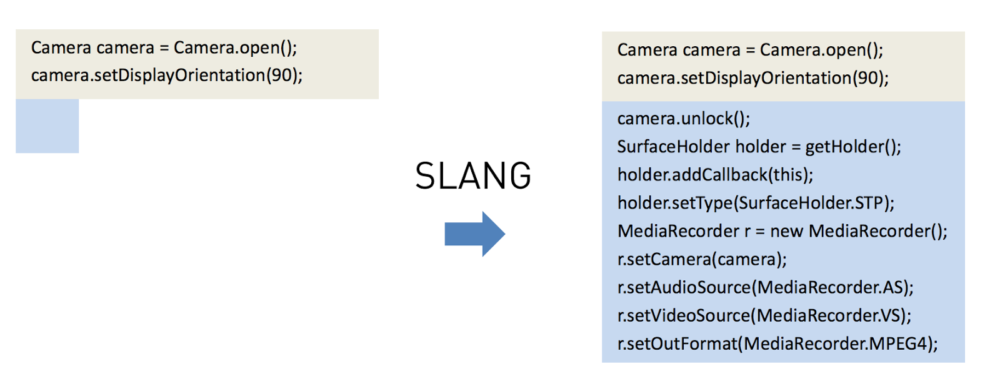

The Benjamin Franklin Method of Reading Programming Books

# The Benjamin Franklin Method of Reading Programming Books

[technical](http://www.pathsensitive.com/search/label/technical?max-results=6)January 22, 2018

Let’s face it, programming books suck. Those general books on distributed systems or data science or whatever can be tomes for a lifetime, but, with few exceptions, there’s something about the books on how to write code in a language/framework/database/cupcake-maker, the ones with the animal covers and the cutesy sample apps, they just tend to be so forgettable, so trite, so….uneducational.

I think I’ve figured out why I don’t like them, and it’s not just that they teach skills rapidly approaching expiration. It’s their pedagogical approach. The teaching algorithm seems to be: write these programs where we’ve told you everything to do, and you’ll come out knowing this language/framework/database/cupcake-maker. Central to these books are the long code listings for the reader to reproduce. Here’s an example, from [one of the better books in this category](https://www.railstutorial.org/book/advanced_login#sec-forgetting_users)

class User < ApplicationRecord
attr_accessor :remember_token
before_save { self.email = email.downcase }
validates :name, presence: true, length: { maximum: 50 }
VALID_EMAIL_REGEX = /\A[\w+\-.]+@[a-z\d\-.]+\.[a-z]+\z/i
validates :email, presence: true, length: { maximum: 255 },
format: { with: VALID_EMAIL_REGEX },
uniqueness: { case_sensitive: false }
has_secure_password
validates :password, presence: true, length: { minimum: 6 }

# …another 30 lines follows...

end
Traditionally, there are two ways to study a page like this:
1. Type out every line of code

2. Copy+paste the code from their website, maybe play around and make small changes

Approach #1 is a method that, [like a lecture](https://www.blogger.com/), causes the code to go from the author’s page to the reader’s screen without passing through the heads of either. The second is like trying to learn how to make a car by taking apart a seatbelt and stereo: you’re just toying with small pieces. Neither is a sound way to learn.

If you had an expert tutor, they wouldn’t teach you by handing you a page of code. Still, these books are what we have. How can we read them in a way that follows the principles of learning? Read on.

## Mental Representations

According to K. Anders Ericsson in his book Peak, expertise is a process of building mental representations. We can see this because expert minds store knowledge in a compressed fashion. Musicians can memorize a page of music far faster than a page of random notes. Expert chess players told to memorize a board position will do much better than amateurs, but, when they make a mistake, they’ll misplace whole groups of pieces.

This is possible because music and chess positions have structure that makes them look very different from a page of random notes or a random permutation of pieces. Technically speaking, they have lower [perplexity](https://en.wikipedia.org/wiki/Perplexity) than random noise. So, even though there are 26 letters in the English alphabet, Claude Shannon showed that the information content of English is about 1 bit per letter: given a random prefix of a paragraph, people can guess the next letter about half the time.

This is why a programmer skilled in a technology can look at code using it and read through it like fiction, only pausing at the surprising bits, while the novice is laboring line-by-line. This is also why a s[mart code-completion tool ](http://www.cs.technion.ac.il/~yahave/papers/pldi14-statistical.pdf)can guess a long sequence of code from the first couple lines. With a better mental representation, understanding code is simply less work.

(How do these mental representations work? My officemate Zenna Tavares argues they are [distribution-sensitive data structures](https://openreview.net/pdf?id=BJVEEF9lx).)

This is exactly what’s missing from the “just type out the code” approach: there’s nothing forcing your mind to represent the program as anything better than a sequence of characters. Yet being able to force your mind to do this would mean being able to learn concepts more rapidly. Here’s a 200 year-old idea for doing so.

## The Benjamin Franklin Method

I don’t know what’s more impressive: that Benjamin Franklin became a luminary in everything from politics to physics, or that he did this without modern educational techniques such as schools, teachers, or StackOverflow. As part of this, he discovered a powerful method of self-study. I’ll let him speak for himself (or go read [someone else’s summary](https://medium.com/personal-growth/the-benjamin-franklin-method-how-to-actually-learn-to-write-1ac4ebc7c3a7)).

> About this time I met with an odd volume of the Spectator. It was the third. I had never before seen any of them. I bought it, read it over and over, and was much delighted with it. I thought the writing excellent, and wished, if possible, to imitate it. With this view I took some of the papers, and, making short hints of the sentiment in each sentence, laid them by a few days, and then, without looking at the book, try'd to compleat the papers again, by expressing each hinted sentiment at length, and as fully as it had been expressed before, in any suitable words that should come to hand. Then I compared my Spectator with the original, discovered some of my faults, and corrected them.

> —Benjamin Franklin, Autobiography

This process is a little bit like being a human autoencoder. An autoencoder is a neural network that tries to produce output the same as its input, but passing through an intermediate layer which is too small to fully represent the data. In doing so, it’s forced to learn a more compact representation. Here, the neural net in question is that den of dendrons in your head.

K. Anders Ericsson likens it to how artists practice by trying to imitate some famous work. Mathematicians are taught to attempt to prove most theorems themselves when reading a book or paper --- even if they can’t, they’ll have an easier time compressing the proof to its basic insight. I used this process to get a better eye for graphical design; it was like LASIK.

But the basic version idea applied to programming books is particularly simple yet effective.

## Here’s how it works:

Read your programming book as normal. When you get to a code sample, read it over

Then close the book.
Then try to type it up.

Simple, right? But try it and watch as you’re forced to learn some of the structure of the code.

It’s a lot like the way you may have already been doing it, just with more learning.

## Acknowledgments

Thanks to Andrew Sheng and [Billy Moses](http://wsmoses.com/) for comments on previous drafts of this post.