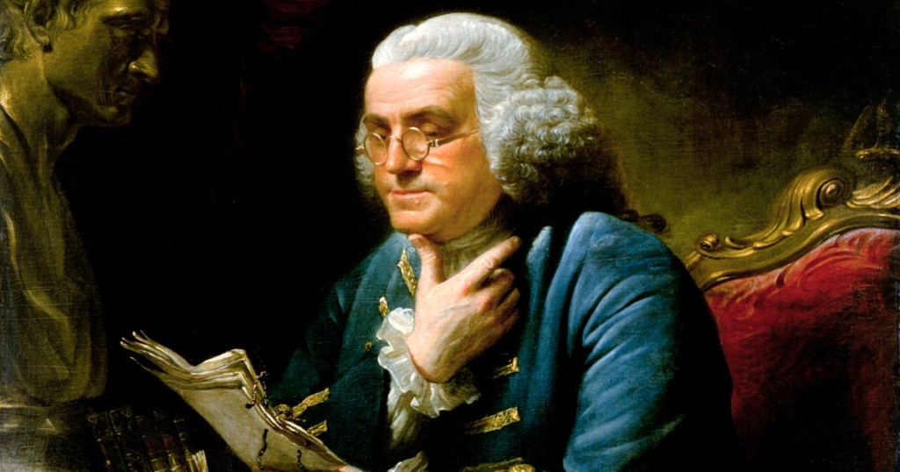

The Benjamin Franklin Method: How to (Actually) Learn to Write

# The Benjamin Franklin Method: How to (Actually) Learn to Write

Benjamin Franklin may be the most prolific man in all of American history.

In his NYT bestselling [Benjamin Franklin: An American Life](https://www.amazon.com/gp/product/074325807X?ie=UTF8), Walter Isaacson writes of Franklin —

> “[He was] the most accomplished American of his age and the most influential in inventing the type of society America would become.”

Franklin’s literal rags to riches story is jam-packed with insights on writing and a better life.

Born into poverty with 16 siblings, Franklin dropped out of school at age 10. How did Benjamin Franklin go from primary school dropout to the most accomplished American in all of history?

I wanted to find out.

In my own quest to teach myself how to write, I dug into Franklin’s autobiography. Guess what? **He wasn’t born with it.**

By his late twenties, Franklin had become independently wealthy through his publications of the *Pennsylvania Gazette* and his famed *Poor Richard’s Almanack*.

Yet, as a teenager, Franklin was *not* a good at writing. Determined to improve but with no teachers and no money, he decided to teach himself.

**His autobiography tells *exactly* how he did it.**

Most writing advice today sucks. It’s palm-in-face bad. Internet forums are infected with impractical advice like “just read more” or “keep trying kiddo!”.

Franklin’s advice, written almost 200 years ago, is the cure. He offers specific, actionable and immediate steps you can use to start improving your writing *today*.

Let’s dig in…

### 1. DISSECT AND RECONSTRUCT

At age 16, Ben finds out he’s bad at writing. His spelling and grammar are good, but…

> “I fell far short in elegance of expression, in method and in perspicuity…”
*(Perspicuity means “clarity”. I didn’t know it either.)*

Determined to improve, Ben takes up one of his favorite magazines, The Spectator…

> “I took some of the papers, and, making short hints of the sentiment in each sentence, laid them by a few days, and then, without looking at the book, try’d to compleat the papers again, by expressing each hinted sentiment at length, and as fully as it had been expressed before, in any suitable words that should come to hand. Then **> I compared my Spectator with the original, discovered some of my faults, and corrected them.**> ”

Wow, that’s some practical advice.
Here it is again:

- Take good writing and jot short notes for each sentence.
- Put the notes aside and come back in a few days.
- Try to “rewrite” the piece using only the notes (and in your own words).
- Compare with the original and correct your faults.

### 2. CONVERT TO POETRY (AND BACK AGAIN)

Next, Franklin tackles his mastery of the English vocabulary.

He uses a technique that all master learners — be they soccer players, mathematicians or wall street traders — understand. **To accelerate learning, add artificial constraints.** Lose your hands and you shall learn to type with your feet.

Franklin recognizes writing poetry can accelerate his development as a writer —

> But I found I wanted a stock of words, or a readiness in recollecting and using them, which I thought I should have acquired before that time if I had gone on making verses; since the continual occasion for words of the same import, but of different length, to suit the measure, or of different sound for the rhyme, **> would have laid me under a constant necessity of searching for variety, and also have tended to fix that variety in my mind, and make me master of it.**

But not satisfied with just an idea (something I always stress here), he *makes it into an actionable exercise* —

> Therefore I took some of the tales and turned them into verse; and, after a time, when I had pretty well forgotten the prose, turned them back again.

Here it is again:

- Take a story and convert it to poetry
- Wait a few days
- Convert your poem back to a story

Repeat regularly (and vary the limitations) to see impressive gains in writing ability.

### UNDERSTAND STRUCTURE

Now proficient in crafting sentences and selecting words, Franklin turns to the overall structure of his writing —

> I also sometimes jumbled my collections of hints into confusion, and after some weeks endeavored to reduce them into the best order, before I began to form the full sentences and compleat the paper. **> This was to teach me method in the arrangement of thoughts.**

Here it is again:

- Take your notes from EXERCISE #1 and jumble them up
- Wait a few weeks
- Reassemble the sentences as best as you can
- Get feedback by comparing to the original

This exercise teaches writers (1) to see and understand structure and (2) how to create it.

### 4. THE SECRET SAUCE

That’s plenty to work on already, but there’s one last ingredient to the Benjamin Franklin’s success formula .

Franklin’s secret sauce —

> My time for these exercises and for reading was at night, after work or before it began in the morning, or on Sundays, when I contrived to be in the printing-house alone, evading as much as I could the common attendance on public worship…

Franklin would surely tell you this: all his advice is useless without the secret sauce.

And the secret sauce is **obsession.**

**Want more? **Join 6000+ readers getting [**The Open Circle**](http://bit.ly/2g31cn2)**,** a weekly newsletter where I deconstruct great minds. I’ll also send you 200+ pages from my private notebooks, 15 must-use apps and tools, and 24 books that changed my life. [**Get it here**](http://bit.ly/2g31cn2)**.**

> Heart. Share. Help your friends. Thanks.