The Bit Player

    CLAUDE SHANNON : PROPHET OF INFORMATION

- Table of Contents

- [Introduction](https://thebitplayer.com/#introduction)

- [Claude Shannon](https://thebitplayer.com/#claude-shannon)

- [The Bit Players](https://thebitplayer.com/#the-bit-players)

- [Screenings](https://thebitplayer.com/#screenings)

- [Mailing List](https://thebitplayer.com/#mailing-list)

- [More Information](https://thebitplayer.com/#more-information)

- [**](https://twitter.com/BitPlayerMovie)

- [Contact](https://thebitplayer.com/mailto:info@thebitplayer.com?Subject=Website%20Enquiry)

 
A film

 

 

02:14

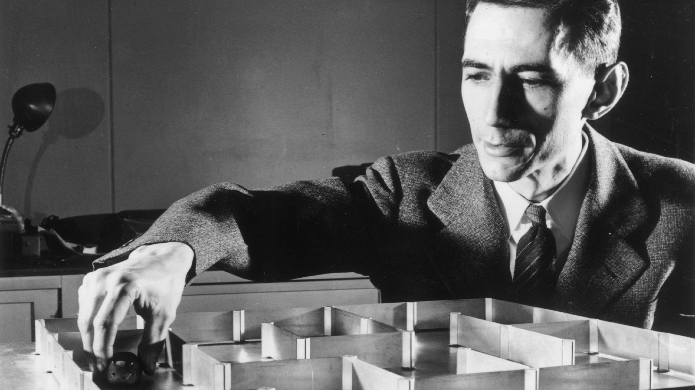

 

by

 

Mark A. Levinson

Director of the Award-Winning Film  

## [Latest In⨍ormation](https://thebitplayer.com/latest-information)

 

10.9.2019

### [Union College Screening Thursday Oct 10, 2019](http://thebitplayer.com/latest-information#union-college-screening-thursday-oct-9-2019)

[READ MORE](http://thebitplayer.com/latest-information#union-college-screening-thursday-oct-9-2019)

10.7.2019

### [Science on Screen showing 10/15/19 at Cameo Cinema in St. Helena CA](http://thebitplayer.com/latest-information#science-on-screen-showing-101519-at-cameo-cinema-in-st-helena-ca)

[READ MORE](http://thebitplayer.com/latest-information#science-on-screen-showing-101519-at-cameo-cinema-in-st-helena-ca)

9.23.2019

### [The Bit Player comes to Boston on Nov 3, 2019!](http://thebitplayer.com/latest-information#the-bit-player-comes-to-boston-on-nov-3-2019)

[READ MORE](http://thebitplayer.com/latest-information#the-bit-player-comes-to-boston-on-nov-3-2019)

9.8.2019

### [Alamo Drafthouse screening in S.F. on Sept 17!](http://thebitplayer.com/latest-information#alamo-drafthouse-screening-in-sf-on-sept-17)

[READ MORE](http://thebitplayer.com/latest-information#alamo-drafthouse-screening-in-sf-on-sept-17)

7.19.2019

### [Physics Today Review of The Bit Player](http://thebitplayer.com/latest-information#physics-today-review-of-the-bit-player)

[READ MORE](http://thebitplayer.com/latest-information#physics-today-review-of-the-bit-player)

 [More News     ](https://thebitplayer.com/latest-information)

01001001 01101110 01100110 01101111 01110010 01101101 01100001 01110100 01101001 01101111 01101110 01101001 01110011 01110100 01101000 01100101 01110010 01100101 01110011 01101111 01101100 01110101 01110100 01101001 01101111 01101110 01101111 01100110 01110101 01101110 01100011 01100101 01110010 01110100 01100001 01101001 01101110 01110100 0111100101001001 01101110 01100110 01101111 01110010 01101101 01100001 01110100 01101001 01101111 01101110 01101001 01110011 01110100 01101000 01100101 01110010 01100101 01110011 01101111 01101100 01110101 01110100 01101001 01101111 01101110 01101111 01100110 01110101 01101110 01100011 01100101 01110010 01110100 01100001 01101001 01101110 01110100 01111001

## I: Introduction

01001001 01101110 01100110 01101111 01110010 01101101 01100001 01110100 01101001 01101111 01101110 01101001 01110011 01110100 01101000 01100101 01110010 01100101 01110011 01101111 01101100 01110101 01110100 01101001 01101111 01101110 01101111 01100110 01110101 01101110 01100011 01100101 01110010 01110100 01100001 01101001 01101110 01110100 0111100101001001 01101110 01100110 01101111 01110010 01101101 01100001 01110100 01101001 01101111 01101110 01101001 01110011 01110100 01101000 01100101 01110010 01100101 01110011 01101111 01101100 01110101 01110100 01101001 01101111 01101110 01101111 01100110 01110101 01101110 01100011 01100101 01110010 01110100 01100001 01101001 01101110 01110100 01111001

%3b' data-evernote-id='268'%3e%3cline fill='none' stroke-width='10' x1='5' x2='5' y1='0' y2='100' class='stroke-current js-evernote-checked' data-evernote-id='269'%3e%3c/line%3e%3c/svg%3e)  

### Synopsis

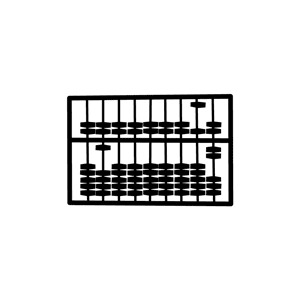  

In a blockbuster paper in 1948, Claude Shannon introduced the notion of a "bit" and laid the foundation for the information age. His ideas ripple through nearly every aspect of modern life, influencing such diverse fields as communication, computing, cryptography, neuroscience, artificial intelligence, cosmology, linguistics, and genetics. But when interviewed in the 1980s, Shannon was more interested in showing off the gadgets he’d constructed — juggling robots, a Rubik’s Cube solving machine, a wearable computer to win at roulette, a unicycle without pedals, a flame-throwing trumpet — than rehashing the past. Mixing contemporary interviews, archival film, animation and dialogue drawn from interviews conducted with Shannon himself, *The Bit Player* tells the story of an overlooked genius who revolutionized the world, but never lost his childlike curiosity.

  

  

TRANSMITTER
TRANSMITTER
TRANSMITTER
TRANSMITTER
TRANSMITTER
TRANSMITTER
TRANSMITTER
TRANSMITTER
TRANSMITTER

TRANSMITTER
TRANSMITTER
TRANSMITTER
TRANSMITTER
TRANSMITTER
TRANSMITTER
TRANSMITTER
TRANSMITTER
TRANSMITTER

010010010110111001100110011011110111001001101101011000010111010001101001011011110110111001101001011100110111010001101000011001010111001001100101011100110110111101101100011101010111010001101001011011110110111001101111011001100111010101101110011000110110010101110010011101000110000101101001011011100111010001111001  010010010110111001100110011011110111001001101101011000010111010001101001011011110110111001101001011100110111010001101000011001010111001001100101011100110110111101101100011101010111010001101001011011110110111001101111011001100111010101101110011000110110010101110010011101000110000101101001011011100111010001111001

RECEIVER
RECEIVER
RECEIVER
RECEIVER
RECEIVER
RECEIVER
RECEIVER
RECEIVER
RECEIVER

RECEIVER
RECEIVER
RECEIVER
RECEIVER
RECEIVER
RECEIVER
RECEIVER
RECEIVER
RECEIVER

  

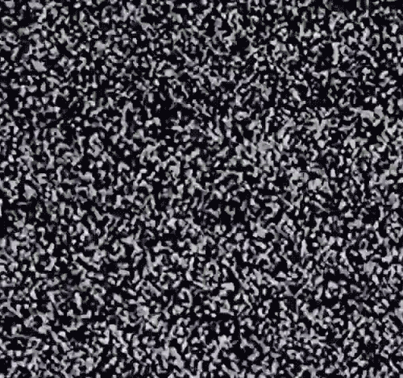    

Fig. 1—A universal communication system from Shannon's 1948 paper *A Mathematical Theory of Communication*.

01001001 01101110 01100110 01101111 01110010 01101101 01100001 01110100 01101001 01101111 01101110 01101001 01110011 01110100 01101000 01100101 01110010 01100101 01110011 01101111 01101100 01110101 01110100 01101001 01101111 01101110 01101111 01100110 01110101 01101110 01100011 01100101 01110010 01110100 01100001 01101001 01101110 01110100 0111100101001001 01101110 01100110 01101111 01110010 01101101 01100001 01110100 01101001 01101111 01101110 01101001 01110011 01110100 01101000 01100101 01110010 01100101 01110011 01101111 01101100 01110101 01110100 01101001 01101111 01101110 01101111 01100110 01110101 01101110 01100011 01100101 01110010 01110100 01100001 01101001 01101110 01110100 01111001

## II: Claude Shannon

01001001 01101110 01100110 01101111 01110010 01101101 01100001 01110100 01101001 01101111 01101110 01101001 01110011 01110100 01101000 01100101 01110010 01100101 01110011 01101111 01101100 01110101 01110100 01101001 01101111 01101110 01101111 01100110 01110101 01101110 01100011 01100101 01110010 01110100 01100001 01101001 01101110 01110100 0111100101001001 01101110 01100110 01101111 01110010 01101101 01100001 01110100 01101001 01101111 01101110 01101001 01110011 01110100 01101000 01100101 01110010 01100101 01110011 01101111 01101100 01110101 01110100 01101001 01101111 01101110 01101111 01100110 01110101 01101110 01100011 01100101 01110010 01110100 01100001 01101001 01101110 01110100 01111001

“

Von Neumann, Turing and other visionaries gave us computers that could *process* information.

But Shannon gave us the modern *concept* of information.

The debate was not whether he was ahead of contemporaries—
the debate was if it was 20, 30, or 50 years ahead.

One of those rare moments in history where somebody founded a field, stated all the major results, and proved most of them all pretty much at once.

Just about anything that has to do with communication, storage and compression follows in some way directly from the contribution that Shannon made.

### A Timeline

 

- 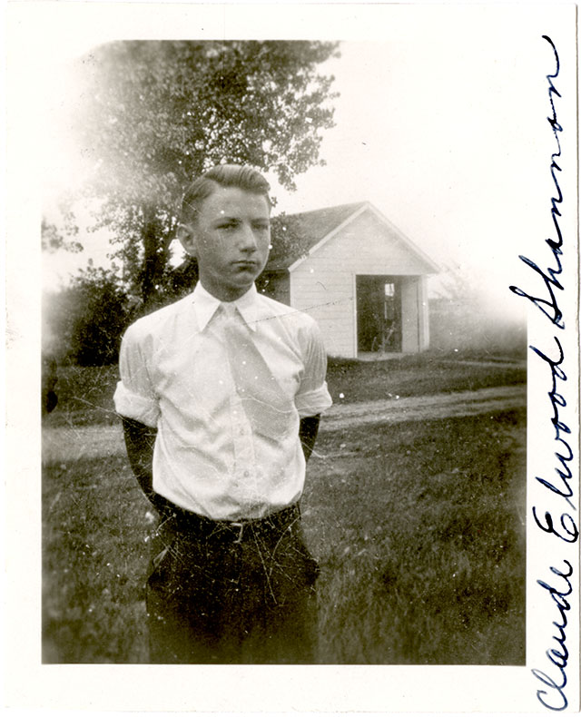

Born in Gaylord, Michigan on April 30, 1916

#### 1916

-   

####

- University of Michigan, double major in mathematics and electrical engineering

#### 1936

-   

####

- 

#### MIT Master’s Thesis "A Symbolic Analysis of Relay and Switching Circuits"

Relates electric circuits and their on/off character to Boolean Algebra, the "Mathematics of Logical Thought," laying the foundation for machines to make decisions — "to think."

#### 1938

-   

####

- Noble Engineering Society Prize

#### 1939

-   

####

- Summer at Cold Spring Harbor lab in NY

#### 1939

-   

####

- Marries Norma Barzman

#### 1940

-   

####

-

#### MIT PhD in Mathematics "An Algebra For Theoretical Genetics"

Invented an algebra to study genetic populations

#### 1940

-   

####

- 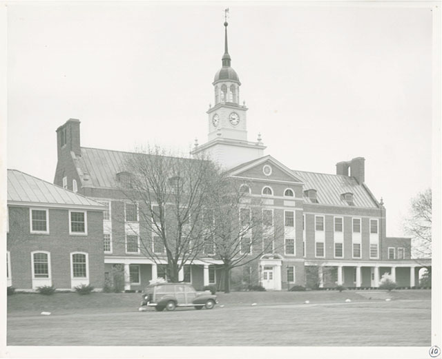

Sept—Oct, 1940 Institute for Advanced Study, Princeton

#### 1940

-   

####

- 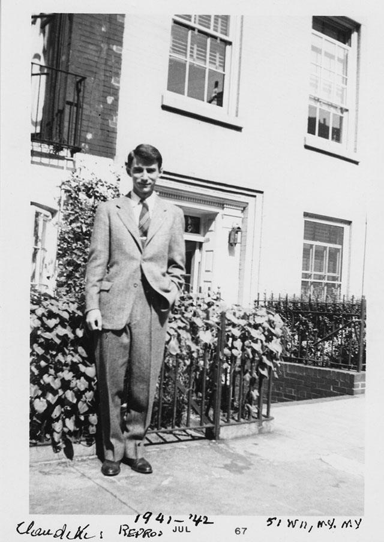

25-year-old Shannon in NYC

#### 1941

-   

####

- 

Begins work at Bell Labs

#### 1941

-   

####

- 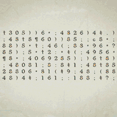

#### A Mathematical Theory of Cryptography

Created field of theoretical cryptography

#### 1945

-   

####

- 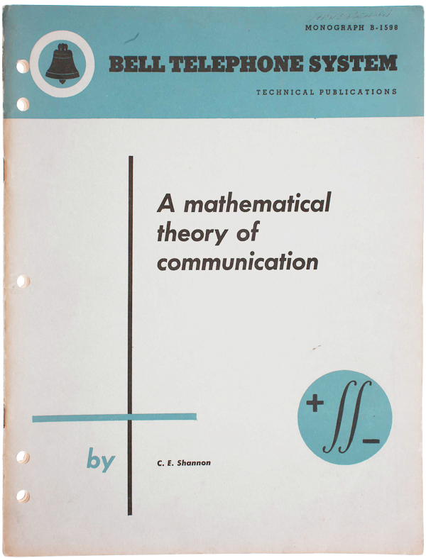

#### A Mathematical Theory of Communication

Created field of Information Theory

#### 1948

-   

####

- 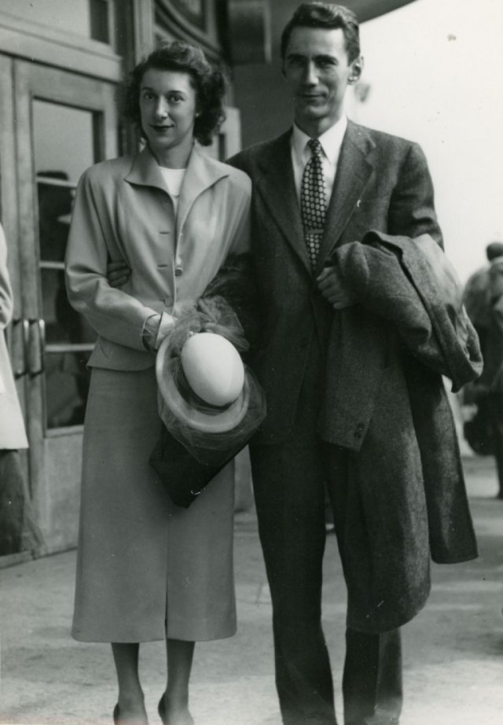

Marries Mary Elizabeth (Betty) Moore

#### 1949

-   

####

- 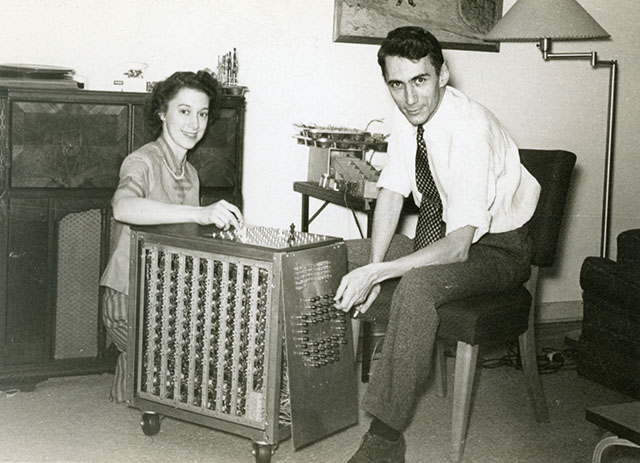

First paper outlining how a computer could play chess

#### 1950

-   

####

- 

Presents "Theseus" a maze-solving mouse

#### 1951

-   

####

- Fellowship at the Center for Advanced Study in Behavioral Sciences at Stanford

#### 1957

-   

####

- Returns to MIT

#### 1958

-   

####

- 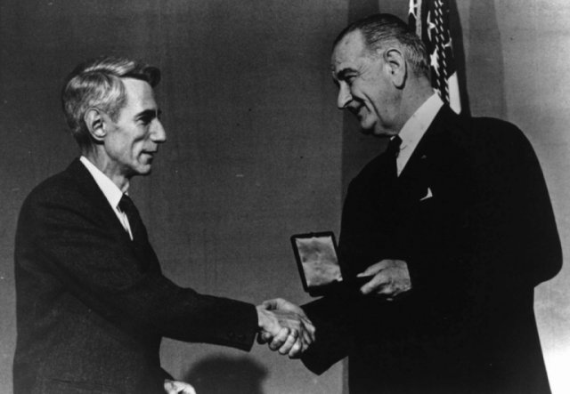

Awarded National Medal of Science

#### 1966

-   

####

- Formally retires

#### 1978

-   

####

- "Scientific Aspects of Juggling," paper

#### 1980

-   

####

- 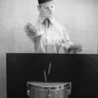

Builds W.C. Fields drop juggling machine

#### 1983

-   

####

- 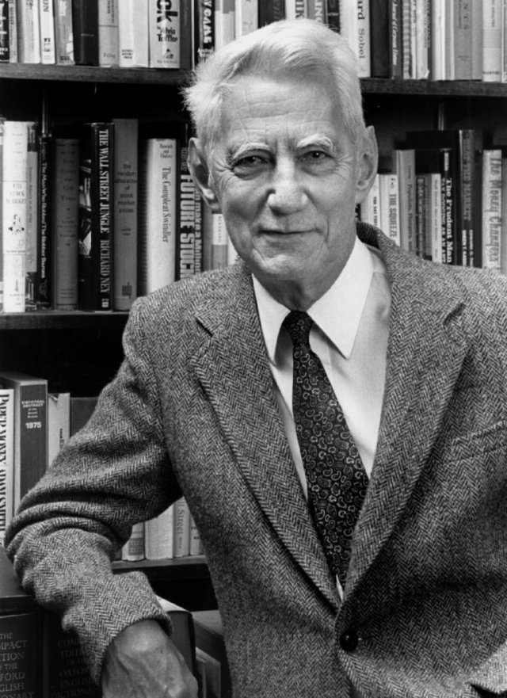

First Kyoto Prize in Mathematics

#### 1985

-   

####

- Enters nursing home

#### 1993

-   

####

- Died February 24, 2001

#### 2001

 

01001001 01101110 01100110 01101111 01110010 01101101 01100001 01110100 01101001 01101111 01101110 01101001 01110011 01110100 01101000 01100101 01110010 01100101 01110011 01101111 01101100 01110101 01110100 01101001 01101111 01101110 01101111 01100110 01110101 01101110 01100011 01100101 01110010 01110100 01100001 01101001 01101110 01110100 0111100101001001 01101110 01100110 01101111 01110010 01101101 01100001 01110100 01101001 01101111 01101110 01101001 01110011 01110100 01101000 01100101 01110010 01100101 01110011 01101111 01101100 01110101 01110100 01101001 01101111 01101110 01101111 01100110 01110101 01101110 01100011 01100101 01110010 01110100 01100001 01101001 01101110 01110100 01111001

## III: The βit Players

01001001 01101110 01100110 01101111 01110010 01101101 01100001 01110100 01101001 01101111 01101110 01101001 01110011 01110100 01101000 01100101 01110010 01100101 01110011 01101111 01101100 01110101 01110100 01101001 01101111 01101110 01101111 01100110 01110101 01101110 01100011 01100101 01110010 01110100 01100001 01101001 01101110 01110100 0111100101001001 01101110 01100110 01101111 01110010 01101101 01100001 01110100 01101001 01101111 01101110 01101001 01110011 01110100 01101000 01100101 01110010 01100101 01110011 01101111 01101100 01110101 01110100 01101001 01101111 01101110 01101111 01100110 01110101 01101110 01100011 01100101 01110010 01110100 01100001 01101001 01101110 01110100 01111001

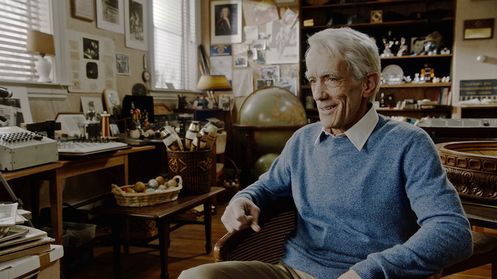

#### John Hutton

 *Claude Shannon*

A consummate theater actor, John Hutton was a core member of the Denver Center Theater Company for over twenty-five years, playing a diverse range of roles that ranged from Shakespeare (*Othello*, *King Lear*, *Measure for Measure*) to David Hare (*Racing Demon*). In 2014 he returned to the East Coast to stretch his muscles on the New York stage. On film, he has played Charles Sumner in Steven Spielberg’s *Lincoln*, and has appeared in television roles in series that include Murder of a *President* and *Power*.

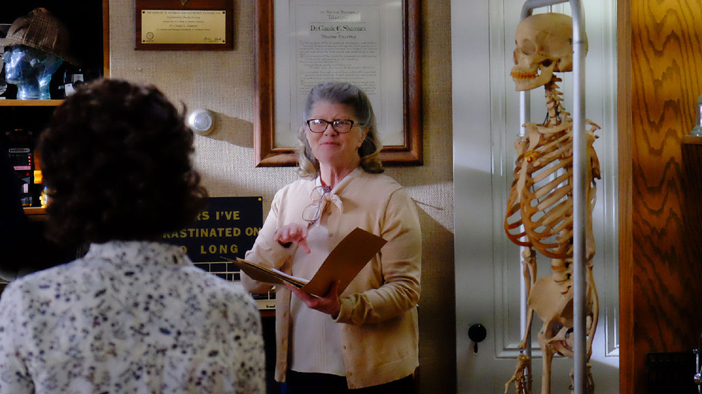

#### Judith Ivey

 *Betty Shannon*

A versatile actress on both stage, screen and television, Judith Ivey won two Tony Awards (*Steaming*, *Hurly Burly*) and was nominated for two more (*Park Your Car in Harvard Yard*, *The Heiress*). Other Broadway and theater credits include *Piaf*, *Bedroom Farce*, *Blithe Spirit*, *Follies*, *The Glass Menagerie*, and *The Audience* (with Helen Mirren). Her film roles include *Brighton Beach Memoirs*, *Miles from Home*, *Compromising Positions*, *Harry & Son*, *The Woman in Red*, *Sister, Sister*, *In Country*, *Hello Again*, *The Lonely Guy*, *There Goes the Neighborhood*, *The Devil's Advocate*, *What Alice Found*, and *Flags of Our Fathers*. Among her many television roles she is most often associated with her one-year run as B.J. Poteet in *Designing Women*.

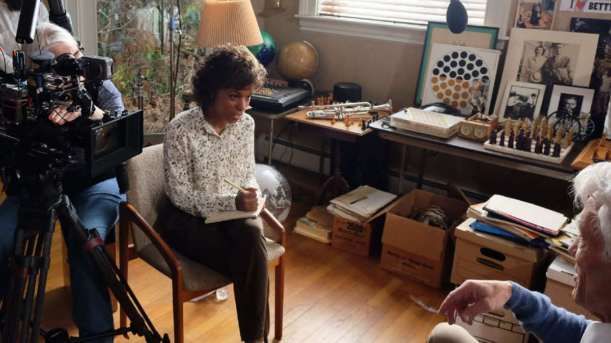

#### Kaliswa Brewster

 *The Interviewer*

A classically trained actor who studied at the prestigious American Conservatory Theater and the London Academy of Music and Dramatic Art, Kaliswa Brewster has worked onstage at The Signature Theatre, Ensemble Studio Theatre, Hartford Stage (Juliet in Tony Award-winning Darko Tresniak’s *Romeo and Juliet*), The Williamstown Theater Festival, American Conservatory Theater, The Guthrie Theater, Geva Theatre Center, Ma-Yi Theater Company, and The Contemporary American Theater Festival. On television, she has a recurring role in Showtime's acclaimed show, *Billions*, starring Damian Lewis & Paul Giamatti, and can be seen in 2017 as a recurring Guest Star on ABC's upcoming new series *Time After Time*. She also Guest Starred in Season 7 of CBS's hit show, *Blue Bloods*, and  appeared on *The Inspectors*, Netflix's *Daredevil* and A&E's *Unforgettable*.

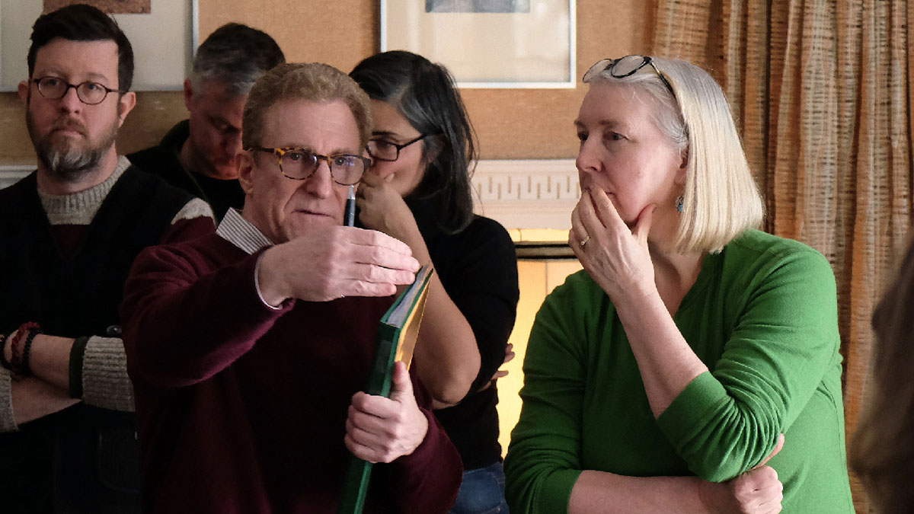

#### Mark A. Levinson

 *Writer | Producer | Director*

Before embarking on his film career, Mark earned a doctoral degree in theoretical particle physics from the University of California at Berkeley. In the film world, Mark has worked as a writer, director, producer, editor and sound supervisor on over 40 feature films. He has worked on such films as *The English Patient*, *The Talented Mr. Ripley*, *Cold Mountain*, *Goya’s Ghosts*, *The Pledge*, *Seven*, and *The Social Network*. He is the writer/producer/director of the narrative feature film, *Prisoner of Time*, about two former Russian dissident artists in the aftermath of the Soviet Union. Most recently, he directed and produced the award-winning documentary feature, *Particle Fever*, about the discovery of the Higgs boson, the so-called “God Particle,” at the CERN Large Hadron Collider outside of Geneva.

01001001 01101110 01100110 01101111 01110010 01101101 01100001 01110100 01101001 01101111 01101110 01101001 01110011 01110100 01101000 01100101 01110010 01100101 01110011 01101111 01101100 01110101 01110100 01101001 01101111 01101110 01101111 01100110 01110101 01101110 01100011 01100101 01110010 01110100 01100001 01101001 01101110 01110100 0111100101001001 01101110 01100110 01101111 01110010 01101101 01100001 01110100 01101001 01101111 01101110 01101001 01110011 01110100 01101000 01100101 01110010 01100101 01110011 01101111 01101100 01110101 01110100 01101001 01101111 01101110 01101111 01100110 01110101 01101110 01100011 01100101 01110010 01110100 01100001 01101001 01101110 01110100 01111001

## IV: Screenings

01001001 01101110 01100110 01101111 01110010 01101101 01100001 01110100 01101001 01101111 01101110 01101001 01110011 01110100 01101000 01100101 01110010 01100101 01110011 01101111 01101100 01110101 01110100 01101001 01101111 01101110 01101111 01100110 01110101 01101110 01100011 01100101 01110010 01110100 01100001 01101001 01101110 01110100 0111100101001001 01101110 01100110 01101111 01110010 01101101 01100001 01110100 01101001 01101111 01101110 01101001 01110011 01110100 01101000 01100101 01110010 01100101 01110011 01101111 01101100 01110101 01110100 01101001 01101111 01101110 01101111 01100110 01110101 01101110 01100011 01100101 01110010 01110100 01100001 01101001 01101110 01110100 01111001

 [Request a Screening](https://thebitplayer.com/request-a-screening)

October 10, 2019

..........................................................................................................

Union College

Reamer Campus Center Auditorium, Schenectady, NY, United States

Screening at 6:30 pm open to all, first come, first serve! Director Mark Levinson will be available for Q&A after screening.

★  *Napa Valley Premiere!*

October 15, 2019

..........................................................................................................

Cameo Cinema

St. Helena, CA, United States

Director Mark Levinson will participate in a Q&A via Skype

[Get Tickets](https://www.cameocinema.com/movie/the-bit-player)

★  *S.F. Premiere*

September 17, 2019

..........................................................................................................

Alamo Drafthouse, S.F.

San Francisco, CA, United States

Food, drinks, gifts, raffle and Q&A with director Mark Levinson and Jimmy Soni, co-author of A Mind At Play!

August 2, 2019

..........................................................................................................

Computer History Museum

Mountain View, CA, United States

Q&A after screening with director Mark Levinson

★  *Open air screening under the stars in the wonderful Elysée gardens*

July 2, 2019

..........................................................................................................

World Congress of Science Journalists 2019

Musée de l’Elysée, Lausanne, Switzerland

Director Mark Levinson will attend and participate in a Q&A

★  *World Premiere*

May 29, 2019

..........................................................................................................

World Science Festival

Museum of the Moving Image, New York, NY, United States

Followed by a conversation discussing Claude Shannon’s legacy and the impact of his work with MIT professor Robert Gallager and director Mark A. Levinson

01001001 01101110 01100110 01101111 01110010 01101101 01100001 01110100 01101001 01101111 01101110 01101001 01110011 01110100 01101000 01100101 01110010 01100101 01110011 01101111 01101100 01110101 01110100 01101001 01101111 01101110 01101111 01100110 01110101 01101110 01100011 01100101 01110010 01110100 01100001 01101001 01101110 01110100 0111100101001001 01101110 01100110 01101111 01110010 01101101 01100001 01110100 01101001 01101111 01101110 01101001 01110011 01110100 01101000 01100101 01110010 01100101 01110011 01101111 01101100 01110101 01110100 01101001 01101111 01101110 01101111 01100110 01110101 01101110 01100011 01100101 01110010 01110100 01100001 01101001 01101110 01110100 01111001

## V: Mailing List

01001001 01101110 01100110 01101111 01110010 01101101 01100001 01110100 01101001 01101111 01101110 01101001 01110011 01110100 01101000 01100101 01110010 01100101 01110011 01101111 01101100 01110101 01110100 01101001 01101111 01101110 01101111 01100110 01110101 01101110 01100011 01100101 01110010 01110100 01100001 01101001 01101110 01110100 0111100101001001 01101110 01100110 01101111 01110010 01101101 01100001 01110100 01101001 01101111 01101110 01101001 01110011 01110100 01101000 01100101 01110010 01100101 01110011 01101111 01101100 01110101 01110100 01101001 01101111 01101110 01101111 01100110 01110101 01101110 01100011 01100101 01110010 01110100 01100001 01101001 01101110 01110100 01111001

### Receive In⨍ormation

Join *The Bit Player* mailing list to receive information and updates. Enter your email address below.

**

  

 I accept the [terms of service](https://thebitplayer.com/terms-of-service) and [privacy policy](https://thebitplayer.com/privacy-policy)*

01001001 01101110 01100110 01101111 01110010 01101101 01100001 01110100 01101001 01101111 01101110 01101001 01110011 01110100 01101000 01100101 01110010 01100101 01110011 01101111 01101100 01110101 01110100 01101001 01101111 01101110 01101111 01100110 01110101 01101110 01100011 01100101 01110010 01110100 01100001 01101001 01101110 01110100 0111100101001001 01101110 01100110 01101111 01110010 01101101 01100001 01110100 01101001 01101111 01101110 01101001 01110011 01110100 01101000 01100101 01110010 01100101 01110011 01101111 01101100 01110101 01110100 01101001 01101111 01101110 01101111 01100110 01110101 01101110 01100011 01100101 01110010 01110100 01100001 01101001 01101110 01110100 01111001

## VI: More In⨍ormation

01001001 01101110 01100110 01101111 01110010 01101101 01100001 01110100 01101001 01101111 01101110 01101001 01110011 01110100 01101000 01100101 01110010 01100101 01110011 01101111 01101100 01110101 01110100 01101001 01101111 01101110 01101111 01100110 01110101 01101110 01100011 01100101 01110010 01110100 01100001 01101001 01101110 01110100 0111100101001001 01101110 01100110 01101111 01110010 01101101 01100001 01110100 01101001 01101111 01101110 01101001 01110011 01110100 01101000 01100101 01110010 01100101 01110011 01101111 01101100 01110101 01110100 01101001 01101111 01101110 01101111 01100110 01110101 01101110 01100011 01100101 01110010 01110100 01100001 01101001 01101110 01110100 01111001

[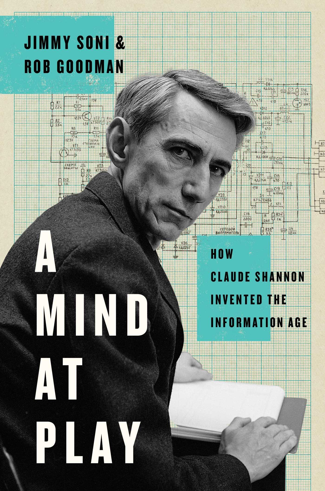](https://www.amazon.com/Mind-Play-Shannon-Invented-Information/dp/147676669X/)

#### A Mind at Play

by Jimmy Soni, Rob Goodman

[**](https://www.amazon.com/Mind-Play-Shannon-Invented-Information/dp/147676669X/)  [**](https://www.goodreads.com/book/show/32919530-a-mind-at-play)

[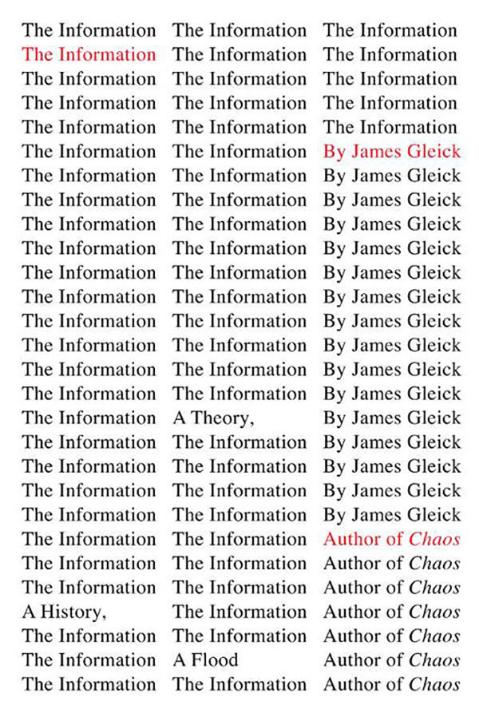](https://www.amazon.com/gp/product/0375423729/)

#### The Information: A History, A Theory, A Flood

by James Gleick

[**](https://www.amazon.com/gp/product/0375423729/)  [**](https://www.goodreads.com/book/show/8701960-the-information)

#### A Man for All Markets

by Edward O. Thorp

[**](https://www.amazon.com/Man-All-Markets-Street-Dealer/dp/1400067960)  [**](https://www.goodreads.com/book/show/25733505-a-man-for-all-markets)

[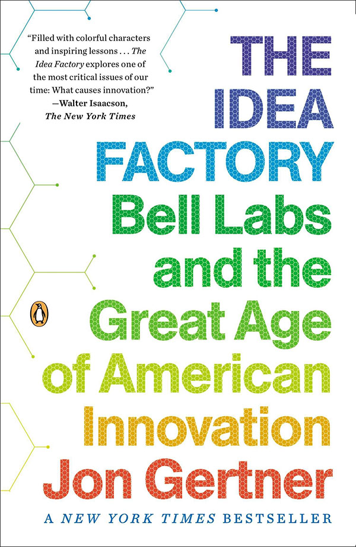](https://www.amazon.com/gp/product/1594203288/)

#### The Idea Factory: Bell Labs and the Great Age of American Innovation

by Jon Gertner

[**](https://www.amazon.com/gp/product/1594203288/)  [**](https://www.goodreads.com/book/show/11797471-the-idea-factory)

#### Fortune's Formula: The Untold Story of the Scientific Betting System That Beat the Casinos and Wall Street

by William Poundstone

[**](https://www.amazon.com/gp/product/0809045990/)  [**](https://www.goodreads.com/book/show/186124.Fortune_s_Formula)

[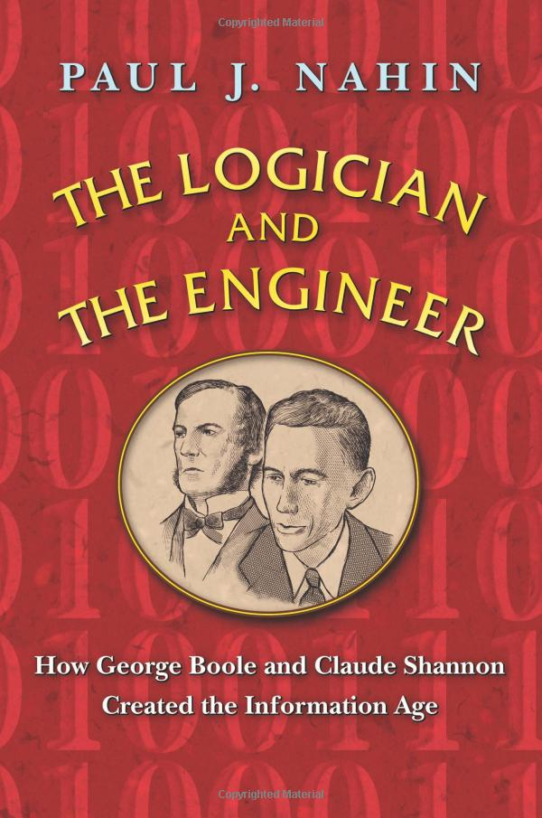](https://www.amazon.com/Logician-Engineer-Shannon-Created-Information-dp-0691176000/dp/0691176000/)

#### The Logician and the Engineer: How George Boole and Claude Shannon Created the Information Age

by Paul J. Nahin

[**](https://www.amazon.com/Logician-Engineer-Shannon-Created-Information-dp-0691176000/dp/0691176000/)  [**](https://www.goodreads.com/book/show/14891844-the-logician-and-the-engineer)

[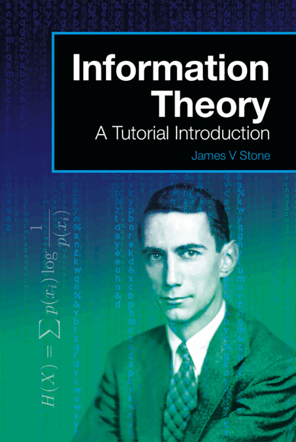](https://www.amazon.com/gp/product/0956372856)

#### Information Theory: A Tutorial Introduction

by James V. Stone

[**](https://www.amazon.com/gp/product/0956372856)  [**](https://www.goodreads.com/book/show/23057894-information-theory)

#### Claude Shannon and Theseus

 Bell Labs Video of Shannon demonstrating his mouse "Theseus" in a maze

[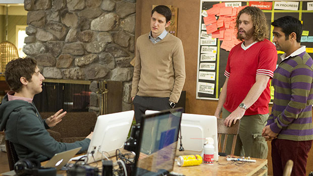](https://spectrum.ieee.org/view-from-the-valley/computing/software/a-madefortv-compression-algorithm)

Isabella Vosmikova/HBO

#### [A Made-For-TV Compression Algorithm](https://spectrum.ieee.org/view-from-the-valley/computing/software/a-madefortv-compression-algorithm)

 Claude Shannon and HBO's *Silicon Valley*

#### [IEEE Information Theory Society](https://www.itsoc.org/)

*The Bit Player* was commissioned by the [IEEE Information Theory Society [?]](https://www.itsoc.org/), a community of over three thousand academic and industrial researchers and engineers working to further understand the role of information and its impact on modern science and technology.

- [**](https://twitter.com/BitPlayerMovie)

- [Contact](https://thebitplayer.com/mailto:info@thebitplayer.com?Subject=Website%20Enquiry)

Use of this site consitutes acceptance of our [Terms of Service](https://thebitplayer.com/terms-of-service) and [Privacy Policy](https://thebitplayer.com/privacy-policy)

©2019 IEEE