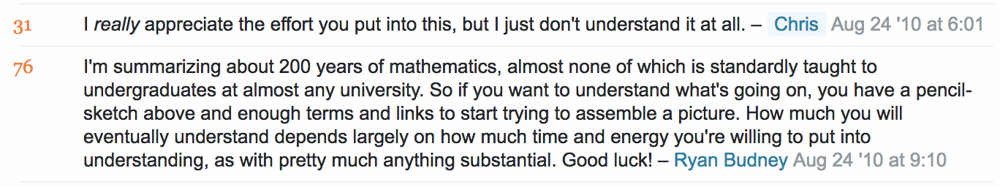

The Bitter Truth of Learning: it’s Tough, Unpleasant, and Often Pointless

# it’s Tough, Unpleasant, and Often Pointless

Sometimes an insignificant interaction, or an excerpt from a book, is capable of provoking a life-changing insight. It might be an obvious lesson, but it feels epiphanic because it fits differently into my understanding of things. For instance, [both](http://blog.pieratt.com/post/977179815/in-praise-of-quitting-your-job)  [these](https://www.nytimes.com/2015/11/22/jobs/bored-to-tears-by-a-do-nothing-dream-job.html) articles shaped my ideas around the importance of work not just as necessary evil, but as a tool for a fulfilling life.

A few years ago, I came across one such interaction on [Math.SE](https://math.stackexchange.com/). Curious about turning T-shirt inside-out through a single hole, Chris asked what made it mathematically possible. It’s an inquisitive question that deals with a branch of Mathematics called General Topology.

There were several answers of varying depth, but Ryan Budney’s [response](https://math.stackexchange.com/a/2992/35086) (actually there were two; one being more accessible) was the most comprehensive, which goes to great lengths explaining the underlying mathematics. Chris’ response to it was slightly dismissive.

What I grasped from Ryan’s response was a simple, inescapable truth: *If you want to learn, you have to try harder*.

Learning is fun, but often as it happens, the fun parts start drying up as you delve deep. Knowing few astronomical facts is fun, but things aren’t that simple when dealing with all the advanced physics involved. Getting few programs done in Python is fun, but the path to building real software is thorny and messy.

The question about T-shirt turning is simple enough and could be very well be explained with analogies, giving the basic idea. However, actual learning doesn’t happen before going deep; deep enough to have a completely different mental representation of the problem. It’s the difference between seeing piano notes as a bunch of symbols vs. seeing them as real music.

When learning something notably challenging, some paths would lead to cul-de-sacs, sometimes you would be left scratching your head, and sometimes it’ll be maddening. The picture doesn’t begin to emerge until you have spent significant time assembling disparate clues. Only then, a faint model starts to appear. And it takes time until that happens.

Learning new things can be exhilarating, but it can get tough, and unpleasant, too. Explanations can be dumbed down, but the effort involved to grow further is unavoidable.

But, what’s the point of learning the complex mathematics behind T-shirt turning? There might be none. There is no immediate benefit, and there’s a slight possibility there won’t be any. However, it will still serve a purpose in an unseen way.

- As Junaid Mubeen highlights in his article, [I no longer understand my Ph.D. dissertation,](https://medium.com/@fjmubeen/ai-no-longer-understand-my-phd-dissertation-and-what-this-means-for-mathematics-education-1d40708f61c) solving complex mathematical problems might aid in becoming a better problem solver in general.
- Learning more things is a great tool to generate more ideas. Issac Asimov in his essay, [How do People Get New Ideas?](https://www.technologyreview.com/s/531911/isaac-asimov-asks-how-do-people-get-new-ideas/), suggests that many ideas have been thought of when someone connected two seemingly different things.

Real learning is about going deep and a long, laborious struggle that comes with it. Everything else is just scratching the surface.