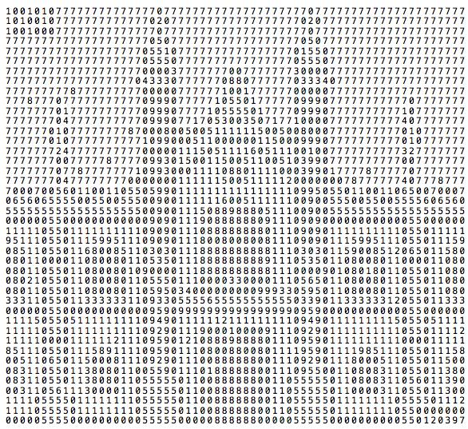
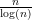
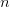
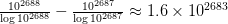

The Corpus Christi Prime

# The Corpus Christi Prime

jrhodkinson
6 days ago

This number is a prime, with 2688 digits. It also looks rather a lot like [Corpus Christi College, Cambridge](https://upload.wikimedia.org/wikipedia/commons/0/0f/Corpus_Christi_College_New_Court%2C_Cambridge%2C_UK_-_Diliff.jpg). The top left corner encodes my initials, JRH, in ASCII. The bottom right corner is my date of birth.

I was inspired by Numberphile’s [most recent video](https://www.youtube.com/watch?v=fQQ8IiTWHhg), which demonstrates a prime number of 1350 digits, which looks like the coat of arms of Trinity Hall College, Cambridge.

### How Was This Done?

I created some pixel art, which looks a bit like the College, but slightly squished since pixels are square, but characters are rectangles.

Next, I selected a font (Menlo) and counted the number of pixels used for each digit. I chose Menlo because it has very heavy zeros, which I thought might come in useful.

Then I wrote a program which generated an “ideal” number, based on these two pieces of information. I then manually made the two required modifications (which were not completely narcissistic – the number had to end with an odd digit, and numbers starting with 1 are ever so slightly more likely to be prime).

Finally, I generated random fluctuations in the number and tested each with the [Miller-Rabin primality test](https://en.wikipedia.org/wiki/Miller%E2%80%93Rabin_primality_test). This produced a shortlist of numbers which were very very likely to be prime. I used Dario Alpern’s [fantastic tool](https://www.alpertron.com.ar/ECM.HTM) to determine whether any of them actually were prime. Of the 8 candidates I had generated overnight, all of them were prime, so I selected the nicest looking one, which you see above.

### Why Was I Confident That This Would Work?

The prime number theorem tells us that there are approximately  primes less than . So there are approximately

2688-digit primes. So approximately one in every 6200 2688-digit numbers is prime. Now, I wasn’t looking at even numbers, so that reduces that number by half, so things are looking quite good.

I set my program running for a little bit and determined that on my hardware (a MacBook Air with a 1.7 GHz processor and 8GB of RAM) my program could determine whether about 30 2688-digit numbers are probably prime per minute. So I thought that it would take about 100 minutes to find a candidate. I had slightly overestimated this time: overnight (9 hours), I checked 25750 numbers and found 8 probable primes. This lines up pretty well with the back of the envelope calculation above.

### The Number

Feel free to check whether it is prime:

100101077777777777777077777777777777777777077777777777777777777710100107777777777777020777777777777777777020777777777777777777771001000777777777777770777777777777777777770777777777777777777777777777777777777777770507777777777777777770507777777777777777777777777777777777777770551077777777777777770155077777777777777777777777777777777777777055507777777777777777055507777777777777777777777777777777777777700003777777700777777730000777777777777777777777777777777777777704333077777708807777770333407777777777777777777777777778777777777000007777771001777777000007777777777777777777777877707777777777709990777771055017777709990777777777770777777777777770177777777770999077771055550177770999077777777771077777777777777047777777777099907717053003507177100007777777777407777777777777010777777778700080050051111115005008000777777777701077777777777701077777777771099000511000000115000999077777777770107777777777777247777777777000001115051111605111001007777777777327777777777777700777778777709930150011500511005103990777777777700777777777777770778777777710993000111108801111000399017777877777077777777777777047777777700000001111115005111112000000078777777407778777700070056011001105505990111111111111111109950550110011065007000706560655550055005550090011111160051111110090055500550055556065605555555555555555555009001115088988805111009005555555555555555555000000550000000000009090111908888880911109090000000000005500000011111055011111111110909011108888888801110909011111111110550111119511105501115995111090901118008008008111090901115995111055011159085110550116800851103030111888888888811103030115900851206501158008011000011080080110535011188888888891110535011080080110000110800801105501108008010900001118888888888111000090108018011055011080080210550110800801105550111000033000011105650110800801105501108008011055011080080110595034000000000999330595011080080110550110803331105501133333311093305555655555555555033901133333312055011333000000550000000000009590999999999999999909590000000000005500000011115055051111111110949011111121111111110949011111111150550511111111105501111111111092901119000100009111092901111111111055011112111110000111111211109590121088898888011109590111111111100001111185111055011158911110959011108008800801111959011119851110550111580051106501150008111092901110088888800111092901118000511055011500083110550113808011005590111018888880011109550011080831105501138008311055011380801105555501100888888001105555501108083110560113900031105611130000110555550110088888800110555550110000311055011300111105555011111111055555011008888880011055555011111111055550111211110555501111111105555501100888888001105555501111111105500000000000055550000000000555550000088888800000555550000000000550120397

Categories: [Mathematics](https://friendlyfieldsandopenmaps.com/category/mathematics/)

Tags: [corpus christi](https://friendlyfieldsandopenmaps.com/tag/corpus-christi/), [number theory](https://friendlyfieldsandopenmaps.com/tag/number-theory/), [prime numbers](https://friendlyfieldsandopenmaps.com/tag/prime-numbers/), [visualisation](https://friendlyfieldsandopenmaps.com/tag/visualisation/)

[Leave a Comment](https://friendlyfieldsandopenmaps.com/2017/09/08/the-corpus-christi-prime/#comments)