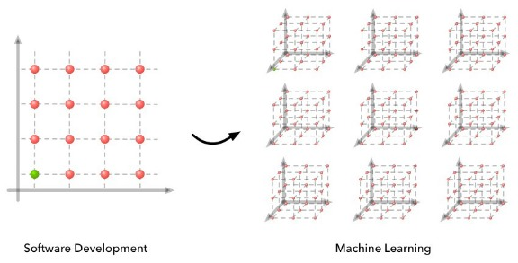
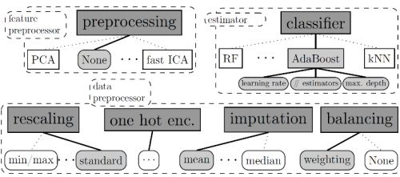

The Current State of Automated Machine Learning

# The Current State of Automated Machine Learning

What is automated machine learning (AutoML)? Why do we need it? What are some of the AutoML tools that are available? What does its future hold? Read this article for answers to these and other AutoML questions.

* * *

**By [Matthew Mayo](https://www.kdnuggets.com/author/matt-mayo), KDnuggets.**

Automated Machine Learning (AutoML) has become a topic of considerable interest over the past year. A [recent KDnuggets blog competition](https://www.kdnuggets.com/2016/06/kdnuggets-blog-contest-automated-data-science.html) focused on this topic, resulting in a handful of interesting ideas and projects. Several AutoML tools have been generating notable interest and gaining respect and notoriety in this time frame as well.

This post will provide a brief explanation of AutoML, argue for its justification and adoption, present a pair of contemporary tools for its pursuit, and discuss AutoML's anticipated future and direction.

### What is Automated Machine Learning?

We can talk about what automated machine learning is, and we can talk about what automated machine learning is **not**.

AutoML is **not** automated data science. While there is undoubtedly overlap, machine learning is but one of many tools in the data science toolkit, and its use does not actually factor in to all data science tasks. For example, if prediction will be part of a given data science task, machine learning will be a useful component; however, machine learning may not play in to a descriptive analytics task at all.

Even for predictive tasks, data science encompasses much more than the actual predictive modeling. Data scientist [Sandro Saitta](https://www.linkedin.com/in/datamining), when discussing the potential confusion between AutoML and automated data science, [had this to say](https://www.kdnuggets.com/2016/08/data-science-automation-debunking-misconceptions.html):

> The misconception comes from the confusion between the whole Data Science process (see for example CRISP-DM) and the sub-tasks of data preparation (feature extraction, etc.) and modeling (algorithm selection, hyper-parameters tuning, etc.) which I call Machine Learning.

> [...]

> When you read news about tools that automate Data Science and Data Science competitions, people with no industry experience may be confused and think that Data Science is only modeling and can be fully automated.

He is absolutely correct, and it's not just a matter of semantics. If you want (need?) more clarification on the relationship between machine learning and data science (and several other related concepts), [read this](https://www.kdnuggets.com/2016/03/data-science-puzzle-explained.html).

Further, data scientist and leading automated machine learning proponent [Randy Olson](http://www.randalolson.com/) states that [effective machine learning design requires us to](https://www.kdnuggets.com/2016/05/tpot-python-automating-data-science.html/2):

1. > Always tune the hyperparameters for our models
2. > Always try out many different models
3. > Always explore numerous feature representations for our data

Taking all of the above into account, if we consider AutoML to be the tasks of algorithm selection, hyperparameter tuning, iterative modeling, and model assessment, we can start to define what AutoML actually **is**. There will not be total agreement on this definition (for comparison, ask 10 people to define "data science," and then compare the 11 answers you get), but it arguably starts us off on the right foot.

### Why Do We Need It?

While we are done with defining concepts, as an exercise in considering why AutoML may be beneficial, let's have a look at why machine learning is hard.

*Credit: [S. Zayd Enam](https://twitter.com/zaydenam)*

AI Researcher and Stanford University PhD candidate [S. Zayd Enam](https://twitter.com/zaydenam), in a fantastic blog post titled "[Why is machine learning 'hard'?](http://ai.stanford.edu/~zayd/why-is-machine-learning-hard.html)," recently wrote the following (emphasis added):

> [M]achine learning remains a relatively ‘hard’ problem. There is no doubt the science of advancing machine learning algorithms through research is difficult. It requires creativity, experimentation and tenacity. **> Machine learning remains a hard problem when implementing existing algorithms and models to work well for your new application.**

Note that, while Enam is primarily referring to machine learning research, he also touches on the implementation of existing algorithms in use cases (see emphasis).

Enam goes on to elaborate on the difficulties of machine learning, and focuses on the nature of algorithms (again, emphasis added):

> An aspect of this difficulty involves building an intuition for what tool should be leveraged to solve a problem. **> This requires being aware of available algorithms and models and the trade-offs and constraints of each one.**

> [...]

> The difficulty is that machine learning is a fundamentally hard debugging problem. Debugging for machine learning happens in two cases: 1) your algorithm doesn't work or 2) your algorithm doesn't work well enough.[...] **> Very rarely does an algorithm work the first time and so this ends up being where the majority of time is spent in building algorithms.**

Enam then eloquantly elaborates this framed problem from the algorithm research point of view. Again, however, what he says applies to... well, **applying** algorithms. If an algorithm does not work, or does not do so well enough, and the process of choosing and refinining becomes iterative, this exposes an opportunity for automation, hence **automated** machine learning.

I have [previously attempted to capture](https://www.linkedin.com/pulse/case-machine-learning-business-matthew-mayo) AutoML's essence as follows:

> If, as > [> Sebastian Raschka has described it](https://www.kdnuggets.com/2016/05/explain-machine-learning-software-engineer.html)> , computer programming is about automation, and machine learning is "all about automating automation," then automated machine learning is "the automation of automating automation." Follow me, here: programming relieves us by managing rote tasks; machine learning allows computers to learn how to best perform these rote tasks; automated machine learning allows for computers to learn how to optimize the outcome of learning how to perform these rote actions.

> This is a very powerful idea; while we previously have had to worry about tuning parameters and hyperparameters, automated machine learning systems can learn the best way to tune these for optimal outcomes by a number of different possible methods.

The rationale for AutoML stems from this idea: if numerous machine learning models must be built, using a variety of algorithms and a number of differing hyperparameter configurations, then this model building can be automated, as can the comparison of model performance and accuracy.

Simple, right?

### A Comparison of Select Automated Machine Learning Tools

Now that we know what AutoML is, and why we would use it... how do we **do** it? The following is an overview and comparison of a pair of contemporary Python AutoML tools which take different approaches in an attempt to achieve more or less the same goal, that of automating the machine learning process.

**Auto-sklearn**

[Auto-sklearn](https://www.kdnuggets.com/2016/08/winning-automl-challenge-auto-sklearn.html) is "an automated machine learning toolkit and a drop-in replacement for a scikit-learn estimator." It also happens to be [the winner](https://www.kdnuggets.com/2016/08/winning-automl-challenge-auto-sklearn.html) of KDnuggets' recent automated data science and machine learning blog contest.

> auto-sklearn frees a machine learning user from algorithm selection and hyperparameter tuning. It leverages recent advantages in Bayesian optimization, meta-learning and ensemble construction. Learn more about the technology behind auto-sklearn by reading this paper published at the > [> NIPS 2015](http://papers.nips.cc/paper/5872-efficient-and-robust-automated-machine-learning.pdf)> .

As the above excerpt from the project's documentation notes, Auto-sklearn performs hyperparameter optimization by way of [Bayesian optimization](https://en.wikipedia.org/wiki/Bayesian_optimization), which proceeds by iterating [the following steps](https://www.kdnuggets.com/2016/08/winning-automl-challenge-auto-sklearn.html):

1. > Build a probabilistic model to capture the relationship between hyperparameter settings and their performance

2. > Use the model to select useful hyperparameter settings to try next by trading off exploration (searching in parts of the space where the model is uncertain) and exploitation (focussing on parts of the space predicted to perform well)

3. > Run the machine learning algorithm with those hyperparameter settings
Further explanation of how this process plays out follows:

> This process can be generalized to jointly select algorithms, preprocessing methods, and their hyperparameters as follows: the choices of classifier / regressor and preprocessing methods are top-level, categorical hyperparameters, and based on their settings the hyperparameters of the selected methods become active. The combined space can then be searched with Bayesian optimization methods that handle such high-dimensional, conditional spaces; we use the random-forest-based > [> SMAC](http://www.cs.ubc.ca/labs/beta/Projects/SMAC/)> , which has been shown to work best for such cases.

As far as practicality goes, since Auto-sklearn is a drop-in replacement for a scikit-learn estimator, one will need a functioning installation of [scikit-learn](http://scikit-learn.org/stable/) to take advantage of it. Auto-sklearn also [supports parallel execution](https://automl.github.io/auto-sklearn/stable/manual.html#manual) by data sharing on a shared file system, and can harness scikit-learn's [model persistence](https://automl.github.io/auto-sklearn/stable/manual.html#manual) ability. Effectively using the Auto-sklearn replacement estimator requires but the following 4 lines of code, in order to obtain a machine learning pipeline, as per the authors:

|     |     |
| --- | --- |
|     | import autosklearn.classification |
|     | cls = autosklearn.classification.AutoSklearnClassifier() |
|     | cls.fit(X_train, y_train) |
|     | y_hat = cls.predict(X_test) |

A more robust sample, for using Auto-sklearn with the MNIST dataset, follows:

|     |     |
| --- | --- |
|     | import autosklearn.classification |
|     | import sklearn.cross_validation |
|     | import sklearn.datasets |
|     | import sklearn.metrics |
|     | digits = sklearn.datasets.load_digits() |
|     | X = digits.data |
|     | y = digits.target |
|     | X_train, X_test, y_train, y_test = sklearn.cross_validation.train_test_split(X, y, random_state=1) |
|     | automl = autosklearn.classification.AutoSklearnClassifier() |
|     | automl.fit(X_train, y_train) |
|     | y_hat = automl.predict(X_test) |
|     | print("Accuracy score", sklearn.metrics.accuracy_score(y_test, y_hat)) |

Of additional note, Auto-sklearn won both the *auto* and the *tweakathon* tracks of the [ChaLearn AutoML challenge](https://competitions.codalab.org/competitions/2321).

You can read the Auto-sklearn development team's winning blog submission to the recent KDnuggets automated data science and machine learning blog contest [here](https://www.kdnuggets.com/2016/08/winning-automl-challenge-auto-sklearn.html), as well as a follow-up interview with the developers [here](https://www.kdnuggets.com/2016/10/interview-auto-sklearn-automated-data-science-machine-learning-team.html). Auto-sklearn is the result of research conducted at the [University of Freiburg](http://aad.informatik.uni-freiburg.de/).

Auto-sklearn is available at its [official GitHub repository](https://github.com/automl/auto-sklearn). Auto-sklearn's documentation can be found [here](http://automl.github.io/auto-sklearn/stable/), while its API is available [here](https://automl.github.io/auto-sklearn/stable/api.html#api).

**TPOT**

[TPOT](https://www.kdnuggets.com/2016/05/tpot-python-automating-data-science.html) is "marketed" as "your Data Science Assistant" (note that it is not "your Data Science *Replacement*"). It is a Python tool which "automatically creates and optimizes machine learning pipelines using genetic programming." TPOT, like Auto-sklearn, works in tandem with scikit-learn, describing itself as a scikit-learn wrapper.

As mentioned earlier in this post, the 2 projects highlighted within use different means to achieve a similar goal. Though both projects are open source, written in Python, and aimed at simplifying a machine learning process by way of AutoML, in contrast to Auto-sklearn using Bayesian optimization, TPOT's approach is based on [genetic programming](https://en.wikipedia.org/wiki/Genetic_programming).

While the approach is different, however, the outcome is the same: automated hyperparameter selection, modeling with a variety of algorithms, and exploration of numerous feature representations, all leading to iterative model building and model evaluation.

One of the real benefits of TPOT is that it produces ready-to-run, standalone Python code for the best-performing model, in the form of a scikit-learn pipeline. This code, representing the best performing of all candidate models, can then be modified or inspected for additional insight, effectively being able to serve as a *starting point* as opposed to solely as an *end product*.

An example TPOT run on MNIST data is as follows:

|     |     |
| --- | --- |
|     | from tpot import TPOTClassifier |
|     | from sklearn.datasets import load_digits |
|     | from sklearn.model_selection import train_test_split |
|     | digits = load_digits() |
|     | X_train, X_test, y_train, y_test = train_test_split(digits.data, digits.target, train_size=0.75, test_size=0.25) |
|     | tpot = TPOTClassifier(generations=5, population_size=20, verbosity=2) |
|     | tpot.fit(X_train, y_train) |
|     | print(tpot.score(X_test, y_test)) |
|     | tpot.export('tpot-mnist-pipeline.py') |

The result of this run is a pipeline that achieves 98% testing accuracy, along with the Python code for said pipeline being exported to the `tpot-mnist-pipeline.py` file, shown below:

|     |     |
| --- | --- |
|     | import numpy as np |
|     | from sklearn.model_selection import train_test_split |
|     | from sklearn.neighbors import KNeighborsClassifier |
|     | from sklearn.pipeline import make_pipeline |
|     | # NOTE: Make sure that the class is labeled 'class' in the data file |
|     | tpot_data = np.recfromcsv('PATH/TO/DATA/FILE', delimiter='COLUMN_SEPARATOR') |
|     | features = tpot_data.view((np.float64, len(tpot_data.dtype.names))) |
|     | features = np.delete(features, tpot_data.dtype.names.index('class'), axis=1) |
|     | training_features, testing_features, training_classes, testing_classes = train_test_split(features, tpot_data['class'], random_state=42) |
|     | exported_pipeline = make_pipeline( |
|     | KNeighborsClassifier(n_neighbors=3, weights="uniform") |
|     | )   |
|     | exported_pipeline.fit(training_features, training_classes) |
|     | results = exported_pipeline.predict(testing_features) |

TPOT can be obtained via its [official Github repo](https://github.com/rhiever/tpot), while its documentation is available [here.](https://rhiever.github.io/tpot/using/)

A KDnuggets article, providing an overview of both TPOT and AutoML, written by TPOT lead developer Randy Olson, can be found [here](https://www.kdnuggets.com/2016/05/tpot-python-automating-data-science.html). A followup interview with Randy is available [here](https://www.kdnuggets.com/2016/11/autoamted-machine-learning-interview-randy-olson-tpot.html).

TPOT is developed at the [University of Pennsylvania Institute for Biomedical Informatics](http://upibi.org/), with funding from NIH grant R01 AI117694.

Of course, these are not the only AutoML tools available. Others include include Hyperopt (Hyperopt-sklearn), Auto-WEKA, and Spearmint. I would wager that a number of additional projects become available over the next few years, both of the research and industrial-strength varieties.

### The Future of Automated Machine Learning

Where does AutoML go from here?

I recently went on the record -- regarding my [2017 machine learning predictions](https://www.kdnuggets.com/2016/12/machine-learning-artificial-intelligence-main-developments-2016-key-trends-2017.html) -- stating:

> [A]utomated machine learning will quietly become an important event in its own right. Perhaps not as sexy to outsiders as deep neural networks, automated machine learning will begin to have far-reaching consequences in ML, AI, and data science, and 2017 will likely be the year this becomes apparent.

In that same article, Randy Olson also expressed his expectations of AutoML in 2017. In more detail, however, Randy also stated the following [in a recent interview](https://www.kdnuggets.com/2016/11/autoamted-machine-learning-interview-randy-olson-tpot.html):

> In the near future, I see automated machine learning (AutoML) taking over the machine learning model-building process: once a data set is in a (relatively) clean format, the AutoML system will be able to design and optimize a machine learning pipeline faster than 99% of the humans out there.

> [...]

> One long-term trend in AutoML that I can confidently comment on, however, is that AutoML systems will become mainstream in the machine learning world...

But will AutoML replace data scientists? Randy continues:

> I don't see the purpose of AutoML as replacing data scientists, just the same as intelligent code autocompletion tools aren't intended to replace computer programmers. Rather, to me the purpose of AutoML is to free data scientists from the burden of repetitive and time-consuming tasks (e.g., machine learning pipeline design and hyperparameter optimization) so they can better spend their time on tasks that are much more difficult to automate.

Great points. His sentiment is [shared by the developers of Auto-sklearn](https://www.kdnuggets.com/2016/10/interview-auto-sklearn-automated-data-science-machine-learning-team.html):

> All the methods of automated machine learning are developed to support data scientists, not to replace them. Such methods can free the data scientist from nasty, complicated tasks (like hyperparameter optimization) that can be solved better by machines. But analysing and drawing conclusions still has to be done by human experts -- and in particular data scientists who know the application domain will remain extremely important.

So this all sounds encouraging: data scientists won't be replaced en masse, and AutoML should help them perform their jobs. That's not to say that AutoML has already been perfected. When questioned as to whether there are any improvements that can be made, [the Auto-sklearn team said](https://www.kdnuggets.com/2016/10/interview-auto-sklearn-automated-data-science-machine-learning-team.html):

> While there are several approaches for tuning the hyperparameters of machine learning pipelines, so far there is only little work on discovering new pipeline building blocks. Auto-sklearn uses a predefined set of preprocessors and classifiers in a fixed order. An efficient way to also come up with new pipelines would be helpful. One can of course continue this line of thinking and try to automate the discovery of new algorithms as done in several recent papers, such as ​Learning to learn by gradient descent by gradient descent.

Where exactly is AutoML going? It's hard to say with certainty. There is little doubt that it is going *somewhere*, however, and likely sooner than later. While the concept of automated machine learning may not be one that all data scientists are currently familiar with, it seems like this would be a good time to get better acquainted. After all, if you can start reaping the benefits of AutoML before the masses do, and ride the wave of technology, you won't just be working to secure your job in an uncertain future, you will be learning to harness the same technology to potentially help do your job better *right now*. I don't think I could come up with better reasons to suggest learning AutoML today.

**Related**: