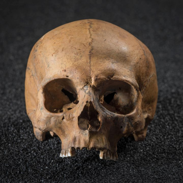

The Dead Beneath London's Streets

The Dead Beneath London's Streets

https://www.smithsonianmag.com/history/dead-beneath-londons-streets-180970385/

Human remains dating back to the Roman Empire populate the grounds below the surface, representing a burden for developers but a boon for archaeologists