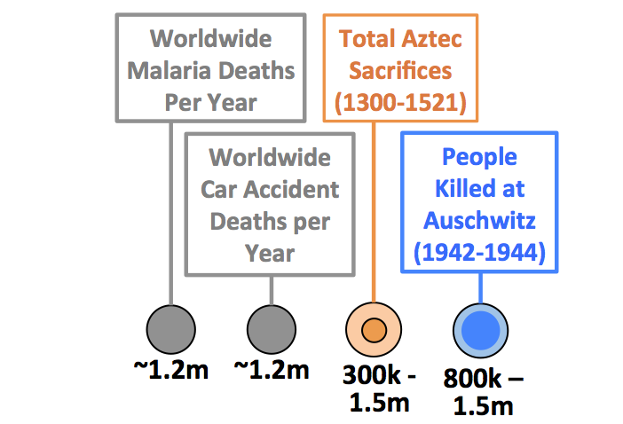
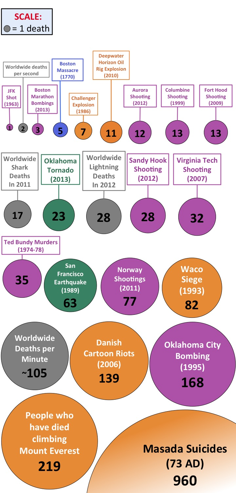
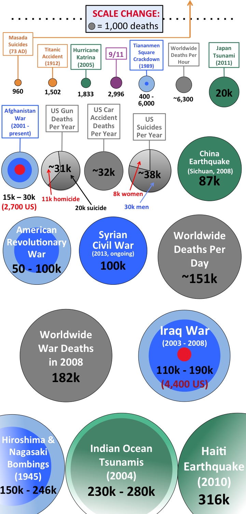
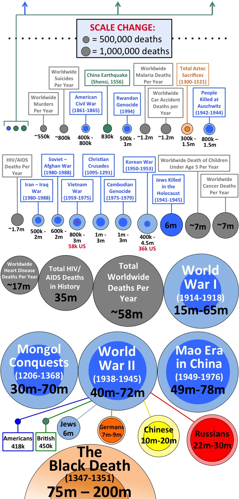

The Death Toll Comparison Breakdown - Wait But Why

# The Death Toll Comparison Breakdown

One of the things about humans is that they die sometimes, and one of the things humans pay a lot of attention to is other people dying. We do a pretty good job of distracting ourselves from the whole “I’m gonna die one day” thing, but the fixation is there, underneath the surface, and one way it shows through is how *riveted* we are by other people’s deaths.

The news is an obvious example—just open up CNN.com and typically, at least half of the headlines are about people dying. Entertainment is another—nothing locks eyes on a screen like the death of a character.

History is a less obvious example, but it’s the parts of history that involve a lot of people dying that usually compel us the most. That’s why there are so many war movies and so few movies about critical legislation being passed.

But for a crowd so interested in death, humans know surprisingly little about the actual numbers of people that died in key moments throughout history. Most of us know that 3,000 people died on 9/11, but how many Americans know how many Katrina victims there were, or how many people died in the American Revolution. Did the Christian Crusades kill 100 times as many people as the Vietnam War? Or were they identical in their death tolls? Given how much we talk about historical human tragedies, it seems like something we should have a better handle on. So let’s take a look.

Some quick notes:

- The area of each circle in the graphic is exactly proportional to the number it’s representing and to the other circles in the graphic. Note the scale, and how it changes as the numbers grow. I chose circles and area because a one-dimensional scale like a bar graph doesn’t work when numbers are growing 1,000-fold over each other—you need two dimensions to be able to handle such a wide range. But keep in mind that with the way area works, a circle with double the diameter of another circle represents *four* times the deaths, not two.
- I focused on human tragedies of various kinds, but sprinkled normal death statistics (the gray circles) throughout as comparison points to help put things in perspective.
- I tried to maintain integrity in my research. There are many “sources” citing various death tolls online—so I made sure there was a reasonable consensus for all the numbers below. When there were too many differing opinions (like Howard Zinn saying European Colonialism killed 100 million people, with other sources saying it was 2 million), I left it out. Sometimes, there is genuine uncertainty to the exact death toll in an event, but a consensus about the lower and upper bound that the death toll might be. In those cases, I made the upper bound a big, faded circle, and the lower bound a smaller, brighter circle inside. For example, the total number of lucky people who had their hearts cut out and sacrificed by the Aztecs is unknown. But historians are pretty sure that the number is somewhere between 300,000 and 1,500,000. So I represented that like this, with two circles:

[(L)](https://28oa9i1t08037ue3m1l0i861-wpengine.netdna-ssl.com/wp-content/uploads/2013/08/Aztec1.png)

Alright, on with it. The Death Toll Comparison Breakdown:

## KEY

[(L)](https://28oa9i1t08037ue3m1l0i861-wpengine.netdna-ssl.com/wp-content/uploads/2013/08/Deaths-Key.jpg)

[(L)](https://28oa9i1t08037ue3m1l0i861-wpengine.netdna-ssl.com/wp-content/uploads/2013/08/DEATH1.jpg)

**______**

If you’re into Wait But Why, sign up for the **[Wait But Why email list](https://waitbutwhy.com/2013/08/the-death-toll-comparison-breakdown.html#)** and we’ll send you the new posts right when they come out.

If you’d like to support Wait But Why, **[here’s our Patreon](https://www.patreon.com/waitbutwhy)**.

**______**
**More Wait But Why history brush-ups:**

**[From Muhammad to ISIS: Iraq’s Full Story](https://waitbutwhy.com/2014/09/muhammad-isis-iraqs-full-story.html)**

**[The American Presidents—Washington to Lincoln](https://waitbutwhy.com/2014/02/american-presidents-washington-lincoln.html)**

And another one in infographic form:**  [Putting Time in Perspective](https://waitbutwhy.com/2013/08/putting-time-in-perspective.html)**

6Save