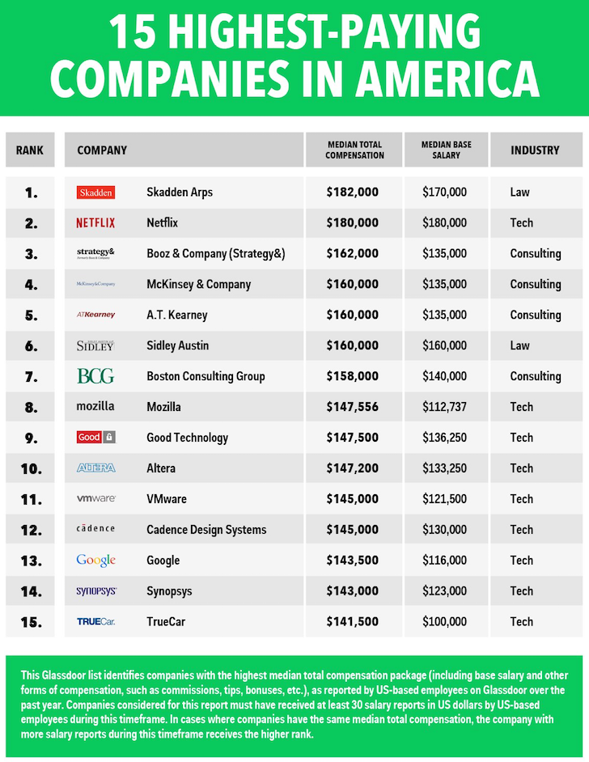

The Desire For Prestige Is Ruining Your Life: Chase Purpose Instead

# The Unhealthy Desire For Prestige Is Ruining Your Life

Posted by [Financial Samurai](https://www.financialsamurai.com/author/admin/)  —[92 Comments](https://www.financialsamurai.com/the-unhealthy-desire-for-prestige-is-ruining-your-life/#comments)

Theory: The desire for prestige is why we: 1) spend an outrageous sum of money on education, 2) kill ourselves at jobs we don’t like, 3) put up with colleagues and bosses we despise, 4) never pursue our dreams, and 5) eventually fill our hearts with regret. If we can figure out how to rid ourselves of the desire for prestige, we will become much happier in the process!

About a year and a half ago when I was attending Finovate, a financial innovation conference, I met a fintech entrepreneur named John. He told me his revolutionary idea was to simplify the documentation gathering process for people looking to refinance or get a new mortgage. As anybody who’s ever taken out a mortgage can attest, [it’s a real pain in the ass](https://www.financialsamurai.com/what-it-took-to-successfully-refinance-my-mortgage/).

I was intrigued since I’ve done about 10 refinances on four properties since 2003 and planned to refinance one last time when I met him. But when John showed me his product, it still required the user to upload all of the docs the bank wanted onto his website. Further, there are always additional document requests from the bank to upload on his platform after that. What’s the point?

Creating an unnecessary barrier between consumer and lender didn’t seem like a good business idea. At least John was trying to solve a problem. I thanked him for his time and wished him well.

Then just last month I ran into John at another fintech conference. I tend to go once a quarter with a free media pass. Otherwise, I’d go less often because these tickets cost anywhere from $300 – $2,000 each! Running conferences during the internet boom is akin to being a landlord. It’s one of the best ways to profit.

I asked John how his product was doing, and he said that he’s looking to hire a CEO with more product experience. One guy slipped away thanks to an offer from Google, but another guy was close to joining.

Fantastic! I told him. In order to get someone with CEO-level experience to quit his/her job to join his startup must mean his product is doing pretty well. But when I talked to him further, he said he was still looking to launch his MVP, or minimum viable product.

Huh? If an entrepreneur hasn’t launched his MVP, there are no customers or revenue. All an entrepreneur has is an idea. So after 1.5 years, John basically spent $10,000+ attending financial conferences, collected no revenue, and hasn’t even launched a working website. Totally illogical, right?

Wrong.

John mentioned that he was bored back home in Seattle with his wife and daughter. Same old stuff, every single day. Ever since he left the mortgage industry after it imploded in 2010, he’s felt lost. He decided to attend business school part-time, and from there he discovered his passion for fintech.

When I asked him whether he felt that flying down to San Francisco to attend conferences for 2-3 days at a time was costly, he mentioned, “not at all!”

“I feel so alive coming to all these conferences. I get to pass out my business card that says ‘Founder & CEO’! Before, I was just one of many mortgage officers trying to make a buck. Now, I get to meet so many aspiring entrepreneurs looking to do something new with their lives. They treat me as an equal. It’s wonderful!”

He went on, “Also, I’ve been able to meet plenty of interesting women. I always tell them I’m looking to hire a VP of Marketing or whatever role they are currently doing to keep their interest. As soon as I tell them this, their eyes light up as I’m suddenly the man of their dreams! I’ve been seeing this one woman for over a year now in the Bay Area. Even though she lives 45 minutes south of San Francisco, she always makes time to drive up and have dinner and drinks with me. I don’t know how long I can keep stringing her along about the VP of Marketing role, but she likes the attention and the idea of potentially working for me, so why not enjoy it while it lasts?”

It’s always about a girl isn’t it? Revenue, product, helping others with their financial problems be damned. On the one hand, it’s bad of John to string this woman along for so long as a married man. On the other hand, she’s an adult who makes her own decisions. Sadly, I have a feeling John is heading towards some difficult times both financially and personally as this fintech startup is his only gig.

## The Unhealthy Desire For Prestige

Do you remember the kid in high school who was pretty goofy looking and tried a little too hard to fit in? I think that’s John. Now that John has the prestige of being the CEO of his own startup, he’s loving every minute of it. It doesn’t matter whether his startup ever becomes a success or not. Having attractive women give him attention is the best sort of validation a man could ever have.

I venture to guess we’ve all desired prestige at some point in our lives. As a kid, I enjoyed the prestige of owning a pair of Air Jordans and Armani jeans. As a college graduate in my 20s, I enjoyed the prestige of working in finance before the 2008 financial crisis hit. After that, working in finance felt like an embarrassment, even if you had nothing to do with people not paying their mortgages.

As a soon to be 40-year-old man, I don’t give a rat’s ass about prestige anymore! In fact, I don’t think I’ve cared about prestige since 2010, right about the time when I was seriously contemplating doing something else with my life. If I cared about prestige, I wouldn’t have driven an old car named Moose for 10 years. If I cared about prestige, I wouldn’t have left my job to make little money as a blogger. If I cared about prestige, I wouldn’t have rented out my house in the expensive north side of San Francisco to live in a much cheaper part of town that nobody has ever heard of.

There is zero prestige in being a personal finance blogger, but I love being one 95% of the time. It’s only about 5% of the time I get annoyed due to some callous remarks from strangers with no intellectual backing. I’m sure most people have no idea [how lucrative being your own independent publisher](https://www.financialsamurai.com/blogging-for-a-living-how-much-can-you-really-make-online/) can be either, which is just fine by me. Every day is a joy to come up with new topics to write about or solidify new business ventures based on the brand I’ve built online.

I’ve got very little power either. Let’s give it a try. All readers who’ve been reading Financial Samurai since January 1, 2014 please send me at least $100 via Paypal to my e-mail address at the end of my [About page](https://www.financialsamurai.com/about/). It takes a lot of work writing these posts and responding to comments! Are you not at least entertained? Alas, I don’t expect anybody to follow through because we live in the world of free.

Source: Glassdoor. I guess some of these companies are prestigious. But who cares after a while?

## How To Let Go

**1) Find your purpose.** Is working at Facebook really that prestigious if your role is to try and bring in more advertisers for fake news feeds? Is working at McKinsey really that prestigious if your role is to provide reasons for why your client should fire more people? Is working at Uber that prestigious if your mission is to figure out how to manipulate drivers with ridiculous requirements in order to keep them driving before your fleet of driverless cars take over? Is working at Goldman Sachs really that prestigious if your main goal is to analyze how to make more money for a billionaire who continues to hoard his wealth when there are hungry people in his hometown?

Come on guys. There’s NOTHING really prestigious about any of these companies, only the fact that you get to make a lot more money than most people. If you can get in, great. Make and save as much money as possible so you can get out and do something more meaningful as soon as possible. If you love your job then fantastic. But if you don’t, it’s not worth staying.

Our purpose often gets lost because we’re tied up doing what society tells us we should do. The best places to work are those that have a mission driven purpose to help solve real problems: hunger, child abuse, homelessness, disease, mental illness, financial calamities, domestic violence, poverty, etc. Having our “best and brightest” join firms to design new picture filters for selfies is ridiculous!

*Note: I recognize these companies have some great positives as well e.g. connecting the world, lowering the cost of transportation for folks who can’t afford to live close to work, providing capital for small businesses, etc.*

Related: [Overcoming The “One More Year Syndrome” To Do Something New](https://www.financialsamurai.com/overcoming-the-one-more-year-syndrome/)

**2) Create something of your own.** If the hardest part about life is getting into a prestigious university or company, then the path of least resistance is to coast thereafter. When you coast, you rely on the prestige of the institution to justify your self worth. Over time, you’ll be filled with self-doubt whether your accomplishments are your own or because of your company. Why do you think some people never leave? They’re afraid that without their company, they aren’t anything! To counteract this self-doubt, you must produce something original. Do it while you’re working so you can iterate without incredible pressure.

Before I press publish, I wonder how each article I’ve written will be received. Sometimes I’m scared to publish, but I publish anyway because I know that if I don’t, I’ll never grow. You will find extreme satisfaction putting new things out to the world. The satisfaction of building something from the ground up is more satisfying than anything you could ever accomplish under the umbrella of another.

Take some risks and create something on your own, no matter how small. You’ll feel embarrassed or hurt in the beginning. But it just gets better over time. Nobody can ever take away something you’ve created.

**3) Practice gratitude.** It’s easy to think our success is 100% due to our own merits. The reality is that anything good was created with the help of many people. There’s a weird amount of self-delusional narcissism that’s happening in Silicon Valley thanks to so many overnight successes. As a result, the majority of people who have not succeeded at the same level or time period feel an intense level of dissatisfaction, even though in relation to millions of other people, they are great successes!

Wake up every day and recognize the people who helped you get to where you are. Keep a gratitude journal. For me, I’m grateful for my father who helped give me the idea of starting a personal finance site back in 2006, my wife who’s been my CFO and COO since the beginning, and my mother who is always supportive in whatever I’ve wanted to pursue. And of course, I’m grateful to every reader who shares some insightful comment and shares my work around the web. Thank you!

Reading a note of thanks is more valuable than any prestige I could ever want.

Related: [Life After Financial Independence](https://www.financialsamurai.com/life-after-financial-independence/)

## Who Are You Trying To Impress?

The unhealthy desire for prestige and money is making people depressed

For John, he might be trying to impress his wife, his daughter and other random women to prove he can reinvent himself after the mortgage industry collapsed. For me, I’m mainly trying to impress myself for not quitting for as long as possible. Each day I get up, I ask myself whether I want to grind or relax. Inevitably, I decide to grind for at least a couple hours even when the ocean beckons.

At the end of your life, nobody is going to care about your prestige and power. All they’ll care about is whether you were a kind enough person who touched their lives and wanted to help other people. I strongly believe that if you can figure out how to let go of your desire for prestige, money, power, fame, and all that other silly stuff, life will get better because you’ll stop caring so much about what other people think and start focusing on what matters most to you.

## Recommendation

Screw prestige! What you want is the freedom to do whatever you want, whenever you want. If you truly believe in yourself, then you should start your own website and build your brand online. Don’t let Facebook, LinkedIn, and Twitter get rich off you. Get rich off yourself! There’s nothing more rewarding that making your own money from nothing.

I started Financial Samurai in 2009, and three years later, I was able to leave my banking job because this site was making enough money. Now, this site earns way more than I ever made as an Executive Director with much less work and much more fun.

Here’s [my step-by-step guide for starting your own website](https://www.financialsamurai.com/how-to-start-a-profitable-blog/) today.

Regards,
Sam, (Chairman, Founder & CEO of Financial Samurai )Writer

[initialinitial*s*initial Tweetinitial6](https://twitter.com/share?original_referer=/&text=The+Unhealthy+Desire+For+Prestige+Is+Ruining+Your+Life&url=https://www.financialsamurai.com/the-unhealthy-desire-for-prestige-is-ruining-your-life/&via=financialsamura)

[initialinitial*j*initial Shareinitial335](https://www.facebook.com/share.php?u=https%3A%2F%2Fwww.financialsamurai.com%2Fthe-unhealthy-desire-for-prestige-is-ruining-your-life%2F)

[initialinitial*h*initial +1initial1](https://plus.google.com/share?url=https%3A%2F%2Fwww.financialsamurai.com%2Fthe-unhealthy-desire-for-prestige-is-ruining-your-life%2F)

[initialinitial*q*initial Stumbleinitial14](http://www.stumbleupon.com/submit?url=https://www.financialsamurai.com/the-unhealthy-desire-for-prestige-is-ruining-your-life/&title=The+Unhealthy+Desire+For+Prestige+Is+Ruining+Your+Life)

[initialinitial*f*initial Shareinitial131](https://www.linkedin.com/cws/share?url=https%3A%2F%2Fwww.financialsamurai.com%2Fthe-unhealthy-desire-for-prestige-is-ruining-your-life%2F)

[initialinitial*b*initial Pininitial5]()

[initialinitialinitial*k*initial Email](https://www.financialsamurai.com/the-unhealthy-desire-for-prestige-is-ruining-your-life/mailto:?subject=The%20Unhealthy%20Desire%20For%20Prestige%20Is%20Ruining%20Your%20Life&body=Theory%3A%C2%A0The%20desire%20for%20prestige%20is%20why%20we%3A%201%29%20spend%20an%20outrageous%20sum%20of%20money%20on%20education%2C%202%29%20kill%20ourselves%20at%20jobs%C2%A0we%20don%27t%20like%2C%203%29%20put%20up%20with%20colleagues%20and%20bosses%20we%20despise%2C%204%29%20never%20pursue%20our%20dreams%2C%20and%205%29%20eventually%20fill%20our%20hearts%20with%20regret.%20If%20we%20can%20figure%20out%20how%20to%20rid%20ourselves%20of%20the%20desire%20for%20prestige%2C%20we%20will%20become%20much%20happier%20in%20the%20process%21%20About%20a%20year%20and%20a%20half%20ago%20when%20I%20was%20attending%20Finovate%2C%20a%20financial%20innovation%20conference%2C%20I%20met%20a%20fintech%20entrepreneur%20named%20John.%20He%C2%A0told%20me%20his%20revolutionary%20idea%20was%20to%20simplify%20the%20documentation%20%20Read%20Here%3A%20https%3A%2F%2Fwww.financialsamurai.com%2Fthe-unhealthy-desire-for-prestige-is-ruining-your-life%2F)

oinitialinitialShares 492

Filed Under: [Career & Employment](https://www.financialsamurai.com/category/career/), [Motivation](https://www.financialsamurai.com/category/motivation/)

**Author Bio:** Sam started Financial Samurai in 2009 to help people achieve financial freedom sooner, rather than later. He spent 13 years working in investment banking, earned his MBA from UC Berkeley, and retired at age 34 in San Francisco. Everything Sam writes is based on first-hand experience because money is too important to be left up to pontification.

His favorite free financial tool he’s been using since 2012 to manage his net worth is **[Personal Capital](https://www.financialsamurai.com/PC)**. Every quarter, Sam runs his investments through their free Retirement Planner and Investment Checkup tool to make sure he stays financially free, forever.

For 2018, he’s most interested in arbitraging the lower property valuations and higher net rental yields in the heartland of America through **[RealtyShares](https://www.financialsamurai.com/RS)**, one of the largest real estate crowdfunding platforms based in SF. He sold his SF rental home for 30X annual gross rent in 2017 and reinvested $500,000 of the proceeds in real estate crowdfunding for potentially higher returns.

#### Subscribe To Private Newsletter

Enter your email address...