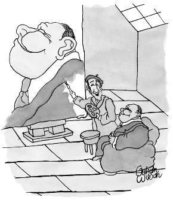
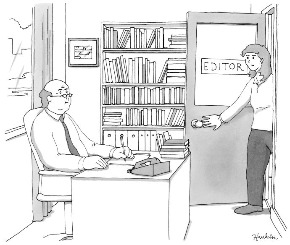

The Doomsday Invention

▲
-

### Sections

-

### Latest

-

### Popular

[(L)](http://www.newyorker.com/)
-

##### Sign in

- [##### TNY Store](http://www.condenaststore.com/~/new-yorker-store?utm_medium=referral&utm_source=NewYorker&utm_content=SHOP&AID=1247905545)

-
-
    1.

[###### The Personal-Essay Boom Is Over](http://www.newyorker.com/culture/jia-tolentino/the-personal-essay-boom-is-over)

by [Jia Tolentino](http://www.newyorker.com/contributors/jia-tolentino)
    2.

[###### A Small Step Toward Correcting the Overwhelming Whiteness of Opera](http://www.newyorker.com/culture/culture-desk/a-small-step-toward-correcting-the-overwhelming-whiteness-of-opera)

by [Lucy Caplan](http://www.newyorker.com/contributors/lucy-caplan)
    3.

[###### Listening to Sean Hannity](http://www.newyorker.com/news/daily-comment/listening-to-sean-hannity)

by [Jeffrey Frank](http://www.newyorker.com/contributors/jeffrey-frank)
    4.

[###### Robert Mueller: A Most Welcome Special Counsel](http://www.newyorker.com/news/john-cassidy/robert-mueller-a-most-welcome-special-counsel)

by [John Cassidy](http://www.newyorker.com/contributors/john-cassidy)
-
    1.

[###### The Personal-Essay Boom Is Over](http://www.newyorker.com/culture/jia-tolentino/the-personal-essay-boom-is-over)

by [Jia Tolentino](http://www.newyorker.com/contributors/jia-tolentino)
    2.

[###### Is the Comey Memo the Beginning of the End for Trump?](http://www.newyorker.com/news/daily-comment/is-the-comey-memo-the-beginning-of-the-end-for-trump)

by [David Remnick](http://www.newyorker.com/contributors/david-remnick)
    3.

[###### James Comey and the Revenge of Washington’s Professional Class](http://www.newyorker.com/news/benjamin-wallace-wells/james-comey-and-the-revenge-of-washingtons-professional-class)

by [Benjamin Wallace-Wells](http://www.newyorker.com/contributors/benjamin-wallace-wells)

    4.

[###### Paul Ryan Keeps It All in the Family](http://www.newyorker.com/news/news-desk/paul-ryan-keeps-it-family-kevin-mccarthy-russia-trump)

by [David Remnick](http://www.newyorker.com/contributors/david-remnick)
-

-

### [News](http://www.newyorker.com/news)

-

### [Culture](http://www.newyorker.com/culture)

-

### [Books](http://www.newyorker.com/books)

-

### [Business & Tech](http://www.newyorker.com/business)

-

### [Humor](http://www.newyorker.com/humor)

-

### [Cartoons](http://www.newyorker.com/cartoons)

-

### [Magazine](http://www.newyorker.com/magazine)

-

### [Video](http://video.newyorker.com/)

-

### [Audio](http://www.newyorker.com/podcast)

-

### [Archive](http://www.newyorker.com/archive)

-

### [Goings On](http://www.newyorker.com/goings-on-about-town/)

#### [A Reporter at Large](http://www.newyorker.com/magazine/a-reporter-at-large)

[November 23, 2015 Issue](http://www.newyorker.com/magazine/2015/11/23)

# The Doomsday Invention

## Will artificial intelligence bring us utopia or destruction?

### By  [Raffi Khatchadourian](http://www.newyorker.com/contributors/raffi-khatchadourian)

- [(L)](https://www.facebook.com/sharer/sharer.php?u=http://www.newyorker.com/magazine/2015/11/23/doomsday-invention-artificial-intelligence-nick-bostrom&display=popup&ref=plugin)
- [(L)](https://twitter.com/intent/tweet?original_referer=http://www.newyorker.com/magazine/2015/11/23/doomsday-invention-artificial-intelligence-nick-bostrom&text=The+Doomsday+Invention&tw_p=tweetbutton&url=http://www.newyorker.com/magazine/2015/11/23/doomsday-invention-artificial-intelligence-nick-bostrom&via=raffiwriter)
- [(L)](http://www.newyorker.com/magazine/2015/11/23/doomsday-invention-artificial-intelligence-nick-bostrommailto:?subject=From%20newyorker.com:%20The%20Doomsday%20Invention&body=The%20Doomsday%20Invention%0Ahttp%3A%2F%2Fwww.newyorker.com%2Fmagazine%2F2015%2F11%2F23%2Fdoomsday-invention-artificial-intelligence-nick-bostrom)
- [(L)](http://www.newyorker.com/magazine/2015/11/23/doomsday-invention-artificial-intelligence-nick-bostrom#)

Nick Bostrom, a philosopher focussed on A.I. risks, says, “The very long-term future of humanity may be relatively easy to predict.”Illustration by Todd St. John

## I. Omens

Last year, a curious nonfiction book became a *Times* best-seller: a dense meditation on artificial intelligence by the philosopher Nick Bostrom, who holds an appointment at Oxford. Titled “Superintelligence: Paths, Dangers, Strategies,” it argues that true artificial intelligence, if it is realized, might pose a danger that exceeds every previous threat from technology—even nuclear weapons—and that if its development is not managed carefully humanity risks engineering its own extinction. Central to this concern is the prospect of an “intelligence explosion,” a speculative event in which an A.I. gains the ability to improve itself, and in short order exceeds the intellectual potential of the human brain by many orders of magnitude.

Such a system would effectively be a new kind of life, and Bostrom’s fears, in their simplest form, are evolutionary: that humanity will unexpectedly become outmatched by a smarter competitor. He sometimes notes, as a point of comparison, the trajectories of people and gorillas: both primates, but with one species dominating the planet and the other at the edge of annihilation. “Before the prospect of an intelligence explosion, we humans are like small children playing with a bomb,” he concludes. “We have little idea when the detonation will occur, though if we hold the device to our ear we can hear a faint ticking sound.”

At the age of forty-two, Bostrom has become a philosopher of remarkable influence. “Superintelligence” is only his most visible response to ideas that he encountered two decades ago, when he became a transhumanist, joining a fractious quasi-utopian movement united by the expectation that accelerating advances in technology will result in drastic changes—social, economic, and, most strikingly, biological—which could converge at a moment of epochal transformation known as the Singularity. Bostrom is arguably the leading transhumanist philosopher today, a position achieved by bringing order to ideas that might otherwise never have survived outside the half-crazy Internet ecosystem where they formed. He rarely makes concrete predictions, but, by relying on probability theory, he seeks to tease out insights where insights seem impossible.

Some of Bostrom’s cleverest arguments resemble Swiss Army knives: they are simple, toylike, a pleasure to consider, with colorful exteriors and precisely calibrated mechanics. He once cast a moral case for medically engineered immortality as a fable about a kingdom terrorized by an insatiable dragon. A reformulation of Pascal’s wager became a dialogue between the seventeenth-­century philosopher and a mugger from another dimension.

“Superintelligence” is not intended as a treatise of deep originality; Bostrom’s contribution is to impose the rigors of analytic philosophy on a messy corpus of ideas that emerged at the margins of academic thought. Perhaps because the field of A.I. has recently made striking advances—with everyday technology seeming, more and more, to exhibit something like intelligent reasoning—the book has struck a nerve. Bostrom’s supporters compare it to “Silent Spring.” In moral philosophy, Peter Singer and Derek Parfit have received it as a work of importance, and distinguished physicists such as Stephen Hawking have echoed its warning. Within the high caste of Silicon Valley, Bostrom has acquired the status of a sage. Elon Musk, the C.E.O. of Tesla, promoted the book on Twitter, noting, “We need to be super careful with AI. Potentially more dangerous than nukes.” Bill Gates recommended it, too. Suggesting that an A.I. could threaten humanity, he said, during a talk in China, “When people say it’s not a problem, then I really start to get to a point of disagreement. How can they not see what a huge challenge this is?”

The people who say that artificial intelligence is not a problem tend to work in artificial intelligence. Many prominent researchers regard Bostrom’s basic views as implausible, or as a distraction from the near-term benefits and moral dilemmas posed by the technology—not least because A.I. systems today can barely guide robots to open doors. Last summer, Oren Etzioni, the C.E.O. of the Allen Institute for Artificial Intelligence, in Seattle, referred to the fear of machine intelligence as a “Frankenstein complex.” Another leading researcher declared, “I don’t worry about that for the same reason I don’t worry about overpopulation on Mars.” Jaron Lanier, a Microsoft researcher and tech commentator, told me that even framing the differing views as a debate was a mistake. “This is not an honest conversation,” he said. “People think it is about technology, but it is really about religion, people turning to metaphysics to cope with the human condition. They have a way of dramatizing their beliefs with an end-of-days scenario—and one does not want to criticize other people’s religions.”

Because the argument has played out on blogs and in the popular press, beyond the ambit of peer-reviewed journals, the two sides have appeared in caricature, with headlines suggesting either doom (“Will Super-intelligent Machines Kill Us All?”) or a reprieve from doom (“Artificial intelligence ‘will not end human race’ ”). Even the most grounded version of the debate occupies philosophical terrain where little is clear. But, Bostrom argues, if artificial intelligence can be achieved it would be an event of unparalleled consequence—perhaps even a rupture in the fabric of history. A bit of long-range forethought might be a moral obligation to our own species.

Bostrom’s sole responsibility at Oxford is to direct an organization called the Future of Humanity Institute, which he founded ten years ago, with financial support from James Martin, a futurist and tech millionaire. Bostrom runs the institute as a kind of philosophical radar station: a bunker sending out navigational pulses into the haze of possible futures. Not long ago, an F.H.I. fellow studied the possibility of a “dark fire scenario,” a cosmic event that, he hypothesized, could occur under certain high-energy conditions: everyday matter mutating into dark matter, in a runaway process that could erase most of the known universe. (He concluded that it was highly unlikely.) Discussions at F.H.I. range from conventional philosophic topics, like the nature of compromise, to the optimal structure of space empires—whether a single intergalactic machine intelligence, supported by a vast array of probes, presents a more ethical future than a cosmic imperium housing millions of digital minds.

Earlier this year, I visited the institute, which is situated on a winding street in a part of Oxford that is a thousand years old. It takes some work to catch Bostrom at his office. Demand for him on the lecture circuit is high; he travels overseas nearly every month to relay his technological omens in a range of settings, from Google’s headquarters to a Presidential commission in Washington. Even at Oxford, he maintains an idiosyncratic schedule, remaining in the office until two in the morning and returning sometime the next afternoon.

I arrived before he did, and waited in a hallway between two conference rooms. A plaque indicated that one of them was the Arkhipov Room, honoring Vasili Arkhipov, a Soviet naval officer. During the Cuban missile crisis, Arkhipov was serving on a submarine in the Caribbean when U.S. destroyers set off depth charges nearby. His captain, unable to establish radio contact with Moscow, feared that the conflict had escalated and ordered a nuclear strike. But Arkhipov dissuaded him, and all-out atomic war was averted. Across the hallway was the Petrov Room, named for another Soviet officer who prevented a global nuclear catastrophe. Bostrom later told me, “They may have saved more lives than most of the statesmen we celebrate on stamps.”

The sense that a vanguard of technical-minded people working in obscurity, at odds with consensus, might save the world from auto-annihilation runs through the atmosphere at F.H.I. like an electrical charge. While waiting for Bostrom, I peered through a row of windows into the Arkh­ipov Room, which looked as though it was used for both meetings and storage; on a bookcase there were boxes containing light bulbs, lampshades, cables, spare mugs. A gaunt philosophy Ph.D. wrapped in a thick knitted cardigan was pacing in front of a whiteboard covered in notation, which he attacked in bursts. After each paroxysm, he paced, hands behind his back, head tilted downward. At one point, he erased a panel of his work. Taking this as an opportunity to interrupt, I asked him what he was doing. “It is a problem involving an aspect of A.I. called ‘planning,’ ” he said. His demeanor radiated irritation. I left him alone.

Bostrom arrived at 2 p.m. He has a boyish countenance and the lean, vital physique of a yoga instructor—though he could never be mistaken for a yoga instructor. His intensity is too untidily contained, evident in his harried gait on the streets outside his office (he does not drive), in his voracious consumption of audiobooks (played at two or three times the normal speed, to maximize efficiency), and his fastidious guarding against illnesses (he avoids handshakes and wipes down silverware beneath a tablecloth). Bostrom can be stubborn about the placement of an office plant or the choice of a font. But when his arguments are challenged he listens attentively, the mechanics of consideration nearly dis­cernible beneath his skin. Then, calmly, quickly, he dispatches a response, one idea interlocked with another.

He asked if I wanted to go to the market. “You can watch me make my elixir,” he said. For the past year or so, he has been drinking his lunch (another efficiency): a smoothie containing fruits, vegetables, proteins, and fats. Using his elbow, he hit a button that electronically opened the front door. Then we rushed out.

Bostrom has a reinvented man’s sense of lost time. An only child, he grew up—as Niklas Boström—in Helsingborg, on the southern coast of Sweden. Like many exceptionally bright children, he hated school, and as a teen-ager he developed a listless, romantic persona. In 1989, he wandered into a library and stumbled onto an anthology of nineteenth-century German philosophy, containing works by Nietzsche and Schopenhauer. He read it in a nearby forest, in a clearing that he often visited to think and to write poetry, and experienced a euphoric insight into the possibilities of learning and achievement. “It’s hard to convey in words what that was like,” Bostrom told me; instead he sent me a photograph of an oil painting that he had made shortly afterward. It was a semi-representational landscape, with strange figures crammed into dense undergrowth; beyond, a hawk soared below a radiant sun. He titled it “The First Day.”

Deciding that he had squandered his early life, he threw himself into a campaign of self-education. He ran down the citations in the anthology, branching out into art, literature, science. He says that he was motivated not only by curiosity but also by a desire for actionable knowledge about how to live. To his parents’ dismay, Bostrom insisted on finishing his final year of high school from home by taking special exams, which he completed in ten weeks. He grew distant from old friends: “I became quite fanatical and felt quite isolated for a period of time.”

When Bostrom was a graduate student in Stockholm, he studied the work of the analytic philosopher W. V. Quine, who had explored the difficult relationship between language and reality. His adviser drilled precision into him by scribbling “not clear” throughout the margins of his papers. “It was basically his only feedback,” Bostrom told me. “The effect was still, I think, beneficial.” His previous academic interests had ranged from psychology to mathematics; now he took up theoretical physics. He was fascinated by technology. The World Wide Web was just emerging, and he began to sense that the heroic philosophy which had inspired him might be outmoded. In 1995, Bostrom wrote a poem, “Requiem,” which he told me was “a signing-off letter to an earlier self.” It was in Swedish, so he offered me a synopsis: “I describe a brave general who has overslept and finds his troops have left the encampment. He rides off to catch up with them, pushing his horse to the limit. Then he hears the thunder of a modern jet plane streaking past him across the sky, and he realizes that he is obsolete, and that courage and spiritual nobility are no match for machines.”

*“I’m starting a startup that helps other startups start up.”*

- [Share](https://www.facebook.com/sharer/sharer.php?u=http://www.newyorker.com/cartoons/a19497&display=popup&ref=plugin)

- [Tweet](https://twitter.com/intent/tweet?original_referer=http://www.newyorker.com/cartoons/a19497&text=A%20Cartoon%20from%20The%20New%20Yorker%20&tw_p=tweetbutton&url=http://www.newyorker.com/cartoons/a19497&via=newyorker)

- [(L)](http://www.newyorker.com/magazine/2015/11/23/doomsday-invention-artificial-intelligence-nick-bostrommailto:?subject=From%20newyorker.com:%20A%20Cartoon%20from%20The%20New%20Yorker%20&body=A%20Cartoon%20from%20The%20New%20Yorker%20%0Ahttp%3A%2F%2Fwww.newyorker.com%2Fcartoons%2Fa19497)

-

- [Buy a cartoon](http://www.condenaststore.com/-st/New-Yorker-Current-Issue-Prints_c148582_.htm?utm_medium=referral&utm_source=NewYorker&utm_content=NEWISSUE&AID=1247905545)

Although Bostrom did not know it, a growing number of people around the world shared his intuition that technology could cause transformative change, and they were finding one another in an online discussion group administered by an organization in California called the Extropy Institute. The term “extropy,” coined in 1967, is generally used to describe life’s capacity to reverse the spread of entropy across space and time. Extropianism is a libertarian strain of transhumanism that seeks “to direct human evolution,” hoping to eliminate disease, suffering, even death; the means might be genetic modification, or as yet un­invented nanotechnology, or perhaps dispensing with the body entirely and uploading minds into supercomputers. (As one member noted, “Immortality is mathematical, not mystical.”) The Extropians advocated the development of artificial superintelligence to achieve these goals, and they envisioned humanity colonizing the universe, converting inert matter into engines of civilization. The discussions were nerdy, lunatic, imaginative, thought-provoking. Anders Sandberg, a former member of the group who now works at Bostrom’s institute, told me, “Just imagine if you could listen in on the debates of the Italian Futurists or early Surrealists.”

In 1996, while pursuing further graduate work at the London School of Economics, Bostrom learned about the Extropy discussion group and became an active participant. A year later, he co-founded his own organization, the World Transhumanist Association, which was less libertarian and more academically spirited. He crafted approachable statements on transhumanist values and gave interviews to the BBC. The line between his academic work and his activism blurred: his Ph.D. dissertation centered on a study of the Doomsday Argument, which uses probability theory to make inferences about the longevity of human civilization. The work baffled his advisers, who respected him but rarely agreed with his conclusions. Mostly, they left him alone.

Bostrom had little interest in conventional philosophy—not least because he expected that superintelligent minds, whether biologically enhanced or digital, would make it obsolete. “Suppose you had to build a new subway line, and it was this grand trans-generational enterprise that humanity was engaged in, and everybody had a little role,” he told me. “So you have a little shovel. But if you know that a giant bulldozer will arrive on the scene tomorrow, then does it really make sense to spend your time today digging the big hole with your shovel? Maybe there is something else you could do with your time. Maybe you could put up a signpost for the great shovel, so it will start digging in the right place.” He came to believe that a key role of the philosopher in modern society was to acquire the knowledge of a polymath, then use it to help guide humanity to its next phase of existence—a discipline that he called “the philosophy of technological prediction.” He was trying to become such a seer.

“He was ultra-consistent,” Daniel Hill, a British philosopher who befriended Bostrom while they were graduate students in London, told me. “His interest in science was a natural outgrowing of his understandable desire to live forever, basically.”

Bostrom has written more than a hundred articles, and his longing for immortality can be seen throughout. In 2008, he framed an essay as a call to action from a future utopia. “Death is not one but a multitude of assassins,” he warned. “Take aim at the causes of early death—infection, violence, malnutrition, heart attack, cancer. Turn your biggest gun on aging, and fire. You must seize the biochemical processes in your body in order to vanquish, by and by, illness and senescence. In time, you will discover ways to move your mind to more durable media.” He tends to see the mind as immaculate code, the body as inefficient hardware—able to accommodate limited hacks but probably destined for replacement.

Even Bostrom’s marriage is largely mediated by technology. His wife, Susan, has a Ph.D. in the sociology of medicine and a bright, down-to-earth manner. (“She teases me about the Terminator and the robot army,” he told me.) They met thirteen years ago, and for all but six months they have lived on opposite sides of the Atlantic, even after the recent birth of their son. The arrangement is voluntary: she prefers Montreal; his work keeps him at Oxford. They Skype several times a day, and he directs as much international travel as possible through Canada, so they can meet in non-digital form.

In Oxford, as Bostrom shopped for his smoothie, he pointed out a man vaping. “There is also the more old-school method of taking nicotine: chewing gum,” he told me. “I do chew nicotine gum. I read a few papers saying it might have some nootropic effect”—that is, it might enhance cognition. He drinks coffee, and usually abstains from alcohol. He briefly experimented with the smart drug Modafinil, but gave it up.

Back at the institute, he filled an industrial blender with lettuce, carrots, cauliflower, broccoli, blueberries, turmeric, vanilla, oat milk, and whey powder. “If there is one thing Nick cares about, it is minds,” Sandberg told me. “That is at the root of many of his views about food, because he is worried that toxin X or Y might be bad for his brain.” He suspects that Bostrom also enjoys the ritualistic display. “Swedes are known for their smugness,” he joked. “Perhaps Nick is subsisting on smugness.”

A young employee eyed Bostrom getting ready to fire up the blender. “I can tell when Nick comes into the office,” he said. “My hair starts shaking.”

“Yeah, this has got three horsepower,” Bostrom said. He ran the blender, producing a noise like a circular saw, and then filled a tall glass stein with purple-­green liquid. We headed to his office, which was meticulous. By a window was a wooden desk supporting an iMac and not another item; against a wall were a chair and a cabinet with a stack of documents. The only hint of excess was light: there were fourteen lamps.

It is hard to spend time at Bostrom’s institute without drifting into reveries of a far future. What might humanity look like millions of years from now? The upper limit of survival on Earth is fixed to the life span of the sun, which in five billion years will become a red giant and swell to more than two hundred times its present size. It is possible that Earth’s orbit will adjust, but more likely that the planet will be destroyed. In any case, long before then, nearly all plant life will die, the oceans will boil, and the Earth’s crust will heat to a thousand degrees. In half a billion years, the planet will be uninhabitable.

The view of the future from Bostrom’s office can be divided into three grand panoramas. In one, humanity experiences an evolutionary leap—either assisted by technology or by merging into it and becoming software—to achieve a sublime condition that Bostrom calls “posthumanity.” Death is overcome, mental experience expands beyond recognition, and our descendants colonize the universe. In another panorama, humanity becomes extinct or experiences a disaster so great that it is unable to recover. Between these extremes, Bostrom envisions scenarios that resemble the status quo—people living as they do now, forever mired in the “human era.” It’s a vision familiar to fans of sci-fi: on “Star Trek,” Captain Kirk was born in the year 2233, but when an alien portal hurls him through time and space to Depression-era Manhattan he blends in easily.

Bostrom dislikes science fiction. “I’ve never been keen on stories that just try to present ‘wow’ ideas—the equivalent of movie productions that rely on stunts and explosions to hold the attention,” he told me. “The question is not whether we can think of something radical or extreme but whether we can discover some sufficient reason for updating our credence function.”

He believes that the future can be studied with the same meticulousness as the past, even if the conclusions are far less firm. “It may be highly unpredictable where a traveller will be one hour after the start of her journey, yet predictable that after five hours she will be at her destination,” he once argued. “The *very* long-term future of humanity may be relatively easy to predict.” He offers an example: if history were reset, the industrial revolution might occur at a different time, or in a different place, or perhaps not at all, with innovation instead occurring in increments over hundreds of years. In the short term, predicting technological achievements in the counter-history might not be possible; but after, say, a hundred thousand years it is easier to imagine that all the same inventions would have emerged.

Bostrom calls this the Technological Completion Conjecture: “If scientific- and technological-development efforts do not effectively cease, then all impor­t­­­ant basic capabilities that could be obtained through some possible technology will be obtained.” In light of this, he suspects that the farther into the future one looks the less likely it seems that life will continue as it is. He favors the far ends of possibility: humanity becomes transcendent or it perishes.

In the nineteen-nineties, as these ideas crystallized in his thinking, Bostrom began to give more attention to the question of extinction. He did not believe that doomsday was imminent. His interest was in risk, like an insurance agent’s. No matter how improbable extinction may be, Bostrom argues, its consequences are near-infinitely bad; thus, even the tiniest step toward reducing the *chance* that it will happen is near-­infinitely valuable. At times, he uses arithmetical sketches to illustrate this point. Imagining one of his utopian scenarios—trillions of digital minds thriving across the cosmos—he reasons that, if there is even a one-per-cent chance of this happening, the expected value of reducing an existential threat by a billionth of a billionth of one per cent would be worth a hundred billion times the value of a billion present-day lives. Put more simply: he believes that his work could dwarf the moral importance of anything else.

Bostrom introduced the philosophical concept of “existential risk” in 2002, in the *Journal of Evolution and Technology*. In recent years, new organizations have been founded almost annually to help reduce it—among them the Centre for the Study of Existential Risk, affiliated with Cambridge Uni­versity, and the Future of Life Institute, which has ties to the Massachusetts Institute of Technology. All of them face a key problem: *Homo sapiens*, since its emergence two hundred thousand years ago, has proved to be remarkably resilient, and figuring out what might imperil its existence is not obvious. Climate change is likely to cause vast environmental and economic damage—but it does not seem impossible to survive. So-called super-volcanoes have thus far not threatened the perpetuation of the species. NASA spends forty million dollars each year to determine if there are significant comets or asteroids headed for Earth. (There aren’t.)

Bostrom does not find the lack of obvious existential threats comforting. Because it is impossible to endure extinction twice, he argues, we cannot rely on history to calculate the probability that it will occur. The most worrying dangers are those that Earth has never encountered before. “It is hard to cause human extinction with seventeenth-century technology,” Bostrom told me. Three centuries later, though, the prospect of a technological apocalypse was urgently plausible. Bostrom dates the first scientific analysis of existential risk to the Manhattan Project: in 1942, Robert Oppenheimer became concerned that an atomic detonation of sufficient power could cause the entire atmosphere to ignite. A subsequent study concluded that the scenario was “unreasonable,” given the limitations of the weapons then in development. But even if the great nuclear nightmares of the Cold War did not come true, the tools were there to cause destruction on a scale not previously possible. As innovations grow even more complex, it is increasingly difficult to evaluate the dangers ahead. The answers must be fraught with ambiguity, because they can be derived only by predicting the effects of technologies that exist mostly as theories or, even more indirectly, by using abstract reasoning.

*Nick Bostrom asks, Will we engineer our own extinction?*

As a philosopher, Bostrom takes a sweeping, even cosmic, view of such problems. One afternoon, he told me, “The probabilities that any given planet will produce intelligent life—this may also have action-relevant information.” In the past several years, NASA probes have found increasing evidence that the building blocks of life are abundant throughout space. So much water has been discovered—on Mars and on the moons of Jupiter and Saturn—that one scientist described our solar system as “a pretty soggy place.” There are amino acids on icy comets and complex organic molecules in distant star-forming clouds. On this planet, life has proved capable of thriving in unimaginably punishing conditions: without oxygen, without light, at four hundred degrees above or below zero. In 2007, the European Space Agency hitched tiny creatures to the exterior of a satellite. They not only survived the flight; some even laid eggs afterward.

With ten billion Earth-like planets in our galaxy alone, and a hundred billion galaxies in the universe, there is good reason to suspect that extraterrestrial life may one day be discovered. For Bostrom, this would augur disaster. “It would be great news to find that Mars is a completely sterile planet,” he argued not long ago. “Dead rocks and lifeless sands would lift my spirits.” His reasoning begins with the age of the universe. Many of those Earth-like planets are thought to be far, far older than ours. One that was recently discovered, called Kepler 452b, is as much as one and a half billion years older. Bostrom asks: If life had formed there on a time scale resembling our own, what would it look like? What kind of technological progress could a civilization achieve with a head start of hundreds of millions of years?

Life as we know it tends to spread wherever it can, and Bostrom estimates that, if an alien civilization could design space probes capable of travelling at even one per cent of the speed of light, the entire Milky Way could be colonized in twenty million years—a tiny fraction of the age difference between Kepler 452b and Earth. One could argue that no technology will ever propel ships at so great a speed. Or perhaps millions of alien civilizations possess the know-how for intergalactic travel, but they aren’t interested. Even so, because the universe is so colossal, and because it is so old, only a small number of civilizations would need to behave as life does on Earth—unceasingly expanding—in order to be visible. Yet, as Bostrom notes, “You start with billions and billions of potential germination points for life, and you end up with a sum total of *zero* alien civilizations that developed technologically to the point where they become manifest to us earthly observers. So what’s stopping them?”

In 1950, Enrico Fermi sketched a version of this paradox during a lunch break while he was working on the H-bomb, at Los Alamos. Since then, many resolutions have been proposed—some of them exotic, such as the idea that Earth is housed in an interplanetary alien zoo. Bostrom suspects that the answer is simple: space appears to be devoid of life because it is. This implies that intelligent life on Earth is an astronomically rare accident. But, if so, when did that accident occur? Was it in the first chemical reactions in the primordial soup? Or when single-celled organisms began to replicate using DNA? Or when animals learned to use tools? Bos­trom likes to think of these hurdles as Great Filters: key phases of improbability that life everywhere must pass through in order to develop into intelligent species. Those which do not make it either go extinct or fail to evolve.

Thus, for Bostrom, the discovery of a single-celled creature inhabiting a damp stretch of Martian soil would constitute a disconcerting piece of evidence. If two planets independently evolved primitive organisms, then it seems more likely that this type of life can be found on many planets throughout the universe. Bostrom reasons that this would suggest that the Great Filter comes at some later evolutionary stage. The discovery of a fossilized vertebrate would be even worse: it would suggest that the universe appears lifeless not because complex life is unusual but, rather, because it is always somehow thwarted before it becomes advanced enough to colonize space.

In Bostrom’s view, the most distressing possibility is that the Great Filter is ahead of us—that evolution frequently achieves civilizations like our own, but they perish before reaching their technological maturity. Why might that be? “Natural disasters such as asteroid hits and super-­volcanic eruptions are unlikely Great Filter candidates, because, even if they destroyed a significant number of civilizations, we would expect some civilizations to get lucky and escape disaster,” he argues. “Perhaps the most likely type of existential risks that could constitute a Great Filter are those that arise from technological discovery. It is not far-fetched to suppose that there might be some possible technology which is such that (a) virtually all suffi­ciently advanced civilizations eventually discover it and (b) its discovery leads almost universally to existential disaster.”

## II. The Machines

The field of artificial intelligence was born in a fit of scientific optimism, in 1955, when a small group of researchers—three mathematicians and an I.B.M. programmer—drew up a proposal for a project at Dartmouth. “An attempt will be made to find how to make machines use language, form abstractions and concepts, solve kinds of problems now reserved for humans, and improve themselves,” they stated. “We think a significant advance can be made in one or more of these problems if a carefully selected group of scientists work on it together for a summer.”

Their optimism was understandable. Since the turn of the twentieth century, science had been advancing at a breakneck pace: the discovery of radioactivity quickly led to insights into the inner workings of the atom, and then to the development of controlled nuclear energy, and then to the warheads over Hiroshima and Nagasaki, and then to the H-bomb. This rush of discovery was reflected in fiction, too, in the work of Isaac Asimov, among others, who envisioned advanced civilizations inhabited by intelligent robots (each encoded with simple, ethical Laws of Robotics, to prevent it from causing harm). The year the scientists met at Dartmouth, Asimov published “The Last Question,” a story featuring a superintelligent A.I. that is continually “self-adjusting and self-correcting”—gaining knowledge as it helps human civilization expand throughout the universe. When the universe’s last stars start dying out, all humanity uploads itself into the A.I., and the device, achieving godhood, creates a new cosmos.

Scientists perceived the mechanics of intelligence—like those of the atom—as a source of huge potential, a great frontier. If the brain was merely a biological machine, there was no theoretical reason that it could not be replicated, or even surpassed, much the way a jet could outfly a falcon. Even before the Dartmouth conference, machines exceeded human ability in narrow domains like code-breaking. In 1951, Alan Turing argued that at some point computers would probably exceed the intellectual capacity of their inventors, and that “therefore we should have to expect the machines to take control.” Whether this would be good or bad he did not say.

*“I hoped you’d like the size of it.”*

- [Share](https://www.facebook.com/sharer/sharer.php?u=http://www.newyorker.com/cartoons/a19633&display=popup&ref=plugin)

- [Tweet](https://twitter.com/intent/tweet?original_referer=http://www.newyorker.com/cartoons/a19633&text=A%20Cartoon%20from%20The%20New%20Yorker%20&tw_p=tweetbutton&url=http://www.newyorker.com/cartoons/a19633&via=newyorker)

- [(L)](http://www.newyorker.com/magazine/2015/11/23/doomsday-invention-artificial-intelligence-nick-bostrommailto:?subject=From%20newyorker.com:%20A%20Cartoon%20from%20The%20New%20Yorker%20&body=A%20Cartoon%20from%20The%20New%20Yorker%20%0Ahttp%3A%2F%2Fwww.newyorker.com%2Fcartoons%2Fa19633)

-

- [Buy a cartoon](http://www.condenaststore.com/-st/New-Yorker-Current-Issue-Prints_c148582_.htm?utm_medium=referral&utm_source=NewYorker&utm_content=NEWISSUE&AID=1247905545)

Six years later, Herbert Simon, one of the Dartmouth attendees, declared that machines would achieve human intelligence “in a visible future.” The crossing of such a threshold, he suspected, could be psychologically crushing, but he was on the whole optimistic. “We must also remain sensitive to the need to keep the computer’s goals attuned with our own,” he later said, but added, “I am not convinced that this will be difficult.” For other computer pioneers, the future appeared more ambivalent. Norbert Wiener, the father of cybernetics, argued that it would be difficult to manage powerful computers, or even to accurately predict their behavior. “Complete subservience and complete intelligence do not go together,” he said. Envisioning Sorcerer’s Apprentice scenarios, he predicted, “The future will be an ever more demanding struggle against the limitations of our intelligence, not a comfortable hammock in which we can lie down to be waited upon by our robot slaves.”

It was in this milieu that the “intelligence explosion” idea was first formally expressed by I. J. Good, a statistician who had worked with Turing. “An ultraintelligent machine could design even better machines,” he wrote. “There would then unquestionably be an ‘intelligence explosion,’ and the intelligence of man would be left far behind. Thus the first ultraintelligent machine is the *last* invention that man need ever make, provided that the machine is docile enough to tell us how to keep it under control. It is curious that this point is made so seldom outside of science fiction. It is sometimes worthwhile to take science fiction seriously.”

The scientists at Dartmouth recognized that success required answers to fundamental questions: What is intelligence? What is the mind? By 1965, the field had experimented with several models of problem solving: some were based on formal logic; some used heuristic reasoning; some, called “neural networks,” were inspired by the brain. With each, the scientists’ work indicated that A.I. systems could find their own solutions to problems. One algorithm proved numerous theorems in the classic text “Principia Mathematica,” and in one instance it did so more elegantly than the authors. A program designed to play checkers learned to beat its programmer. And yet, despite the great promise in these experiments, the challenges to creating an A.I. were forbidding. Programs that performed well in the laboratory were useless in everyday situations; a simple act like picking up a ball turned out to require an overwhelming number of computations.

The research fell into the first of several “A.I. winters.” As Bostrom notes in his book, “Among academics and their funders, ‘A.I.’ became an unwanted epithet.” Eventually, the researchers started to question the goal of building a mind altogether. Why not try instead to divide the problem into pieces? They began to limit their interests to specific cognitive functions: vision, say, or speech. Even in isolation, these functions would have value: a computer that could identify objects might not be an A.I., but it could help guide a forklift. As the research fragmented, the morass of technical problems made any questions about the consequences of success seem distant, even silly.

Unexpectedly, by dismissing its founding goals, the field of A.I. created space for outsiders to imagine more freely what the technology might look like. Bostrom wrote his first paper on artificial superintelligence in the nineteen-nineties, envisioning it as potentially perilous but irresistible to both commerce and government. “If there is a way of guaranteeing that superior artificial intellects will never harm human beings, then such intellects will be created,” he argued. “If there is no way to have such a guarantee, then they will probably be created nevertheless.” His audience at the time was primarily other transhumanists. But the movement was maturing. In 2005, an organization called the Singularity Institute for Artificial Intelligence began to operate out of Silicon Valley; its primary founder, a former member of the Extropian discussion group, published a stream of literature on the dangers of A.I. That same year, the futurist and inventor Ray Kurzweil wrote “The Singularity Is Near,” a best-seller that prophesied a merging of man and machine in the foreseeable future. Bostrom created his institute at Oxford.

The two communities could not have been more different. The scientists, steeped in technical detail, were preoccupied with making devices that worked; the transhumanists, motivated by the hope of a utopian future, were asking, What would the ultimate impact of those devices be? In 2007, the Association for the Advancement of Artificial Intelligence—the most prominent professional organization for A.I. researchers—elected Eric Horvitz, a scientist from Microsoft, as its president. Until then, it had given virtually no attention to the ethical and social implications of the research, but Horvitz was open to the big questions. “It is hard to understand what success would mean for A.I.,” he told me. “I was friendly with Jack Good, who wrote that piece on superintelligence. I knew him as a creative, funny guy who referred to a lot of his ideas as P.B.I.s—partly baked ideas. And here is this piece of his being opened up outside the field as this Bible and studied with a silver pointer. Wouldn’t it be useful, I said, even if you thought these were crazy or low-probability scenarios, to find out: Can we be proactive, should there be some poor outcome for humanity?”

Horvitz organized a meeting at the Asilomar Conference Grounds, in California, a place chosen for its symbolic value: biologists had gathered there in 1975 to discuss the hazards of their research in the age of modern genetics. He divided the researchers into groups. One studied short-term ramifications, like the possible use of A.I. to commit crimes; another considered long-term consequences. Mostly, there was skepticism about the intelligence-explosion idea, which assumed answers to many unresolved questions. No one fully understands what intelligence is, let alone how it might evolve in a machine. Can it grow as Good imagined, gaining I.Q. points like a rocketing stock price? If so, what would its upper limit be? And would its increase be merely a function of optimized software design, without the difficult process of acquiring knowledge through experience? Can software fundamentally rewrite itself without risking crippling breakdowns? No one knows. In the history of computer science, no programmer has created code that can substantially improve itself.

*“No, you want the A train. This is just a train.”*

- [Share](https://www.facebook.com/sharer/sharer.php?u=http://www.newyorker.com/cartoons/a19630&display=popup&ref=plugin)

- [Tweet](https://twitter.com/intent/tweet?original_referer=http://www.newyorker.com/cartoons/a19630&text=A%20Cartoon%20from%20The%20New%20Yorker%20&tw_p=tweetbutton&url=http://www.newyorker.com/cartoons/a19630&via=newyorker)

- [(L)](http://www.newyorker.com/magazine/2015/11/23/doomsday-invention-artificial-intelligence-nick-bostrommailto:?subject=From%20newyorker.com:%20A%20Cartoon%20from%20The%20New%20Yorker%20&body=A%20Cartoon%20from%20The%20New%20Yorker%20%0Ahttp%3A%2F%2Fwww.newyorker.com%2Fcartoons%2Fa19630)

-

- [Buy a cartoon](http://www.condenaststore.com/-st/New-Yorker-Current-Issue-Prints_c148582_.htm?utm_medium=referral&utm_source=NewYorker&utm_content=NEWISSUE&AID=1247905545)

But the notion of an intelligence explosion was also impossible to disprove. It was theoretically coherent, and it had even been attempted in limited ways. David McAllester, an A.I. researcher at the Toyota Technological Institute, affiliated with the University of Chicago, headed the long-term panel. The idea, he argued, was worth taking seriously. “I am uncomfortable saying that we are ninety-­nine per cent certain that we are safe for fifty years,” he told me. “That feels like hubris to me.” The group concluded that more technical work was needed before an evaluation of the dangers could be made, but it also hinted at a concern among panelists that the gathering was based on “a *perception* of urgency”—generated largely by the transhumanists—and risked raising unfounded alarm. With A.I. seeming like a remote prospect, the researchers declared, attention was better spent on near-term concerns. Bart Selman, a professor at Cornell who co-­organized the panel, told me, “The mode was ‘This is interesting, but it’s all academic—it’s not going to happen.’ ”

At the time the A.I researchers met at Asilomar, Bostrom was grappling with an expansive book on existential risks. He had sketched out chapters on bioengineering and on nanotechnology, among other topics, but many of these problems came to seem less compelling, while his chapter on A.I. grew and grew. Eventually, he pasted the A.I. chapter into a new file, which became “Superintelligence.”

The book is its own elegant paradox: analytical in tone and often lucidly argued, yet punctuated by moments of messianic urgency. Some portions are so extravagantly speculative that it is hard to take them seriously. (“Suppose we could somehow establish that a certain future AI will have an IQ of 6,455: then what?”) But Bostrom is aware of the limits to his type of futurology. When he was a graduate student in London, thinking about how to maximize his ability to communicate, he pursued stand­­up comedy; he has a deadpan sense of humor, which can be found lightly buried among the book’s self-serious passages. “Many of the points made in this book are probably wrong,” he writes, with an endnote that leads to the line “I don’t know which ones.”

Bostrom prefers to act as a cartographer rather than a polemicist, but beneath his exhaustive mapping of scenarios one can sense an argument being built and perhaps a fear of being forthright about it. “Traditionally, this topic domain has been occupied by cranks,” he told me. “By popular media, by science fiction—or maybe by a retired physicist no longer able to do serious work, so he will write a popular book and pontificate. That is kind of the level of rigor that is the baseline. I think that a lot of reasons why there has not been more serious work in this area is that academics don’t want to be conflated with flaky, crackpot type of things. Futurists are a certain type.”

The book begins with an “unfinished” fable about a flock of sparrows that decide to raise an owl to protect and advise them. They go looking for an owl egg to steal and bring back to their tree, but, because they believe their search will be so difficult, they postpone studying how to domesticate owls until they succeed. Bostrom concludes, “It is not known how the story ends.”

The parable is his way of introducing the book’s core question: Will an A.I., if realized, use its vast capability in a way that is beyond human control? One way to think about the concern is to begin with the familiar. Bos­trom writes, “Artificial intelligence already outperforms human intelligence in many domains.” The examples range from chess to Scrabble. One program from 1981, called Eurisko, was designed to teach itself a naval role-playing game. After playing ten thousand matches, it arrived at a morally grotesque strategy: to field thousands of small, immobile ships, the vast majority of which were intended as cannon fodder. In a national tournament, Eurisko demolished its human opponents, who insisted that the game’s rules be changed. The following year, Eurisko won again—by forcing its damaged ships to sink themselves.

The program was by no means superintelligent. But Bostrom’s book essentially asks: What if it were? Assume that it has a broad ability to consider problems and that it has access to the Internet. It could read and acquire general knowledge and communicate with people seamlessly online. It could conduct experiments, either virtually or by tinkering with networked infrastructure. Given even the most benign objective—to win a game—such a system, Bostrom argues, might develop “instrumental goals”: gather resources, or invent technology, or take steps to insure that it cannot be turned off, in the process paying as much heed to human life as humans do to ants.

In people, intelligence is inseparable from consciousness, emotional and social awareness, the complex interaction of mind and body. An A.I. need not have any such attributes. Bostrom believes that machine intelligences—no matter how flexible in their tactics—will likely be rigidly fixated on their ultimate goals. How, then, to create a machine that respects the nuances of social cues? That adheres to ethical norms, even at the expense of its goals? No one has a coherent solution. It is hard enough to reliably inculcate such behavior in people.

In science fiction, superintelligent computers that run amok are often circumvented at the last minute; think of WOPR, the computer in “WarGames,” which was stopped just short of triggering nuclear war, or HAL 9000, which was reduced to helplessly singing while it watched itself get dismantled. For Bos­trom, this strains credulity. Whether out of a desire to consider the far ends of risk or out of transhumanist longings, he often ascribes nearly divine abilities to machines, as if to ask: Can a digital god really be contained? He imagines machines so intelligent that merely by inspecting their own code they can extrapolate the nature of the universe and of human society, and in this way outsmart any effort to contain them. “Is it possible to build machines that are not like agents—goal-pursuing, autonomous, artificial intelligences?” he asked me. “Maybe you can design something more like an oracle that can only answer yes or no. Would that be safer? It is not so clear. There might be agent-like processes within it.” Asking a simple question—“Is it possible to convert a DeLorean into a time machine and travel to 1955?”—might trigger a cascade of action as the device tests hypotheses. What if, working through a police computer, it impounds a DeLorean that happens to be convenient to a clock tower? “In fairy tales, you have genies who grant wishes,” Bostrom said. “Almost universally, the moral of those is that if you are not extremely careful what you wish for, then what seems like it should be a great blessing turns out to be a curse.”

Bostrom worries that solving the “control problem”—insuring that a superintelligent machine does what humans want it to do—will require more time than solving A.I. does. The intelligence explosion is not the only way that a superintelligence might be created suddenly. Bostrom once sketched out a decades-long process, in which researchers arduously improved their systems to equal the intelligence of a mouse, then a chimp, then—after incredible labor—the village idiot. “The difference between village idiot and genius-­level intelligence might be trivial from the point of view of how hard it is to replicate the same functionality in a machine,” he said. “The brain of the village idiot and the brain of a scientific genius are almost identical. So we might very well see relatively slow and incremental progress that doesn’t really raise any alarm bells until we are just one step away from something that is radically superintelligent.”

To a large degree, Bostrom’s concerns turn on a simple question of timing: Can breakthroughs be predicted? “It is ridiculous to talk about such things so early—A.I. is eons away,” Edward Feigenbaum, an emeritus professor at Stanford University, told me. The researcher Oren Etzioni, who used the term “Frankenstein complex” to dismiss the “dystopian vision of A.I.,” concedes Bostrom’s overarching point: that the field must one day confront profound philosophical questions. Decades ago, he explored them himself, in a brief paper, but concluded that the problem was too remote to think about productively. “Once, Nick Bostrom gave a talk, and I gave a little counterpoint,” he told me. “A lot of the disagreements come down to what time scale you are thinking about. Nobody responsible would say you will see anything remotely like A.I. in the next five to ten years. And I think most computer scientists would say, ‘In a million years—we don’t see why it shouldn’t happen.’ So now the question is: What is the rate of progress? There are a lot of people who will ask: Is it *possible* we are wrong? Yes. I am not going to rule it out. I am going to say, ‘I am a scientist. Show me the evidence.’ ”

The history of science is an uneven guide to the question: How close are we? There has been no shortage of unfulfilled promises. But there are also plenty of examples of startling nearsightedness, a pattern that Arthur C. Clarke enshrined as Clarke’s First Law: “When a distinguished but elderly scientist states that something is possible, he is almost certainly right. When he states that something is impossible, he is very probably wrong.” After the electron was discovered, at Cambridge, in 1897, physicists at an annual dinner toasted, “To the electron: may it never be of use to anybody.” Lord Kelvin famously declared, just eight years before the Wright brothers launched from Kitty Hawk, that heavier-than-air flight was impossible.

Stuart Russell, the co-author of the textbook “Artificial Intelligence: A Modern Approach” and one of Bostrom’s most vocal supporters in A.I., told me that he had been studying the physics community during the advent of nuclear weapons. At the turn of the twentieth century, Ernest Rutherford discovered that heavy elements produced radiation by atomic decay, confirming that vast reservoirs of energy were stored in the atom. Rutherford believed that the energy could not be harnessed, and in 1933 he proclaimed, “Anyone who expects a source of power from the transformation of these atoms is talking moonshine.” The next day, a former student of Einstein’s named Leo Szilard read the comment in the papers. Irritated, he took a walk, and the idea of a nuclear chain reaction occurred to him. He visited Rutherford to discuss it, but Rutherford threw him out. Einstein, too, was skeptical about nuclear energy—splitting atoms at will, he said, was “like shooting birds in the dark in a country where there are only a few birds.” A decade later, Szilard’s insight was used to build the bomb.

Russell now relays the story to A.I. researchers as a cautionary tale. “There will have to be more breakthroughs to get to A.I., but, as Szilard illustrated, those can happen overnight,” he told me. “People are putting billions of dollars into achieving those breakthroughs. As the debate stands, Bostrom and others have said, ‘If we achieve superintelligence, here are some of the problems that might arise.’ As far as I know, no one has proved why those are not real.”

## III. Mission Control

The offices of the Future of Humanity Institute have a hybrid atmosphere: part physics lab, part college dorm room. There are whiteboards covered with mathematical notation and technical glyphs; there are posters of “Brave New World” and HAL 9000. There is also art work by Nick Bostrom. One afternoon, he guided me to one of his pieces, “At Sea,” a digital collage that he had printed out and then drawn on. “It is a bit damaged, but the good thing about digital is that you can re-instantiate it,” he said. At the center was a pale man, nearly an apparition, clinging to a barrel in an inky-black ocean. “It is an existentialist vibe. You are hanging on for as long as you can. When you get tired, you sink, and become fish food—or maybe a current will take him to land. We don’t know.”

Despite the time he spends going to conferences and raising money, Bostrom attends to many details at the institute. “We needed a logo when we started,” he told me. “We went to this online site where you could buy the work of freelance artists. If you sat down and tried to make the ugliest logo, you couldn’t come close. Then we hired a designer, who made a blurry figure of a person. We showed it to someone here, who said it looked like a toilet sign. As soon as she said it, I thought, Oh, my God, we almost adopted a toilet sign as our logo. So I mucked around a bit and came up with a black diamond. You have the black monolith from ‘2001.’ Standing on its corner, it indicates instability. Also, there is a limit to how ugly a black square can be.”

The institute shares office space with the Centre for Effective Altruism, and both organizations intersect with a social movement that promotes pure rationality as a guide to moral action. Toby Ord, a philosopher who works with both, told me that Bostrom often pops into his office at the end of the day, poses a problem, then leaves him pondering it for the night. Among the first of Bostrom’s questions was this: If the universe turns out to contain an infinite number of beings, then how could any single person’s action affect the cosmic balance of suffering and happiness? After lengthy discussions, they left the paradox unresolved. “My main thinking is that we can sort it out later,” Ord told me.

*“Chaucer on lyne thrie.”*

- [Share](https://www.facebook.com/sharer/sharer.php?u=http://www.newyorker.com/cartoons/a19596&display=popup&ref=plugin)

- [Tweet](https://twitter.com/intent/tweet?original_referer=http://www.newyorker.com/cartoons/a19596&text=A%20Cartoon%20from%20The%20New%20Yorker%20&tw_p=tweetbutton&url=http://www.newyorker.com/cartoons/a19596&via=newyorker)

- [(L)](http://www.newyorker.com/magazine/2015/11/23/doomsday-invention-artificial-intelligence-nick-bostrommailto:?subject=From%20newyorker.com:%20A%20Cartoon%20from%20The%20New%20Yorker%20&body=A%20Cartoon%20from%20The%20New%20Yorker%20%0Ahttp%3A%2F%2Fwww.newyorker.com%2Fcartoons%2Fa19596)

-

- [Buy a cartoon](http://www.condenaststore.com/-st/New-Yorker-Current-Issue-Prints_c148582_.htm?utm_medium=referral&utm_source=NewYorker&utm_content=NEWISSUE&AID=1247905545)

When I asked Bostrom if I could observe a discussion at the institute, he seemed reluctant; it was hard to judge whether he was concerned that my presence would interfere or that unfiltered talk of, say, engineered pathogens might inspire criminals. (“At some point, one gets into the realm of information hazard,” he hinted.) Eventually, he let me observe a session in the Petrov Room involving half a dozen staff members. The key question under discussion was whether a global catastrophe, on the order of a continent-wide famine, could trigger a series of geopolitical events that would result in human extinction—and whether that meant that a merely catastrophic risk could therefore be taken as seriously as an existential risk. Bostrom, wearing a gray hoodie over a blue button-­down, organized the problem on a whiteboard with visible pleasure. Anders Sandberg told me that he once spent days with Bostrom working through such a problem, distilling a complex argument to its essence. “He had to *refine* it,” he said. “We had a lot of schemes on the whiteboard that gradually were simplified to one box and three arrows.”

For anyone in the business of publicizing existential risk, 2015 began as a good year. Other institutes devoted to these issues had started to find their voice, bringing an additional gloss of respectability to the ideas in Bostrom’s book. The people weighing in now were no longer just former Extropians. They were credentialled, like Lord Martin Rees, an astrophysicist and the co-founder of Cambridge’s Centre for the Study of Existential Risk. In January, he wrote of A.I., in the *Evening Standard*, “We don’t know where the boundary lies between what may happen and what will remain science fiction.”

Rees’s counterpart at the Future of Life Institute, the M.I.T. physicist Max Tegmark, hosted a closed-door meeting in Puerto Rico, to try to make sense of the long-term trajectory of the research. Bostrom flew down, joining a mix of A.I. practitioners, legal scholars, and, for lack of a better term, members of the “A.I. safety” community. “These are not people who are usually in the same room,” Tegmark told me. “Someone advised me to put Valium in people’s drinks so nobody got into fistfights. But, by the time Nick’s session started, people were ready to listen to each other.” Questions that had seemed fanciful to researchers only seven years earlier were beginning to look as though they might be worth reconsidering. Whereas the Asilomar meeting concluded on a note of skepticism about the validity of the whole endeavor, the Puerto Rico conference resulted in an open letter, signed by many prominent researchers, that called for more research to insure that A.I. would be “robust and beneficial.”

Between the two conferences, the field had experienced a revolution, built on an approach called deep learning—a type of neural network that can discern complex patterns in huge quantities of data. For de­c­ades, researchers, hampered by the limits of their hardware, struggled to get the technique to work well. But, beginning in 2010, the increasing availability of Big Data and cheap, powerful video-­game processors had a dramatic effect on performance. Without any profound theoretical breakthrough, deep learning suddenly offered breathtaking advances. “I have been talking to quite a few contemporaries,” Stuart Russell told me. “Pretty much everyone sees examples of progress they just didn’t expect.” He cited a YouTube clip of a four-legged robot: one of its designers tries to kick it over, but it quickly regains its balance, scrambling with uncanny naturalness. “A problem that had been viewed as very difficult, where progress was slow and incremental, was all of a sudden done. Locomotion: done.”

In an array of fields—speech processing, face recognition, language translation—the approach was ascendant. Researchers working on computer vision had spent years to get systems to identify objects. In almost no time, the deep-learning networks crushed their records. In one common test, using a database called ImageNet, humans identify photographs with a five-per-cent error rate; Google’s network operates at 4.8 per cent. A.I. systems can differentiate a Pembroke Welsh Corgi from a Cardigan Welsh Corgi.

Last October, Tomaso Poggio, an M.I.T. researcher, gave a skeptical interview. “The ability to describe the content of an image would be one of the most intellectually challenging things of all for a machine to do,” he said. “We will need another cycle of basic research to solve this kind of question.” The cycle, he predicted, would take at least twenty years. A month later, Google announced that its deep-learning network could analyze an image and offer a caption of what it saw: “Two pizzas sitting on top of a stove top,” or “People shopping at an outdoor market.” When I asked Poggio about the results, he dismissed them as automatic associations between objects and language; the system did not *understand* what it saw. “Maybe human intelligence is the same thing, in which case I am wrong, or not, in which case I was right,” he told me. “How do you decide?”

A respected minority of A.I. researchers began to wonder: If increasingly powerful hardware could facilitate the deep-learning revolution, would it make other long-shelved A.I. principles viable? “Suppose the brain is just a million different evolutionarily developed hacks: one for smell, one for recognizing faces, one for how you recognize animals,” Tom Mitchell, who holds a chair in machine learning at Carnegie Mellon, told me. “If that is what underlies intelligence, then I think we are far, far from getting there—because we don’t have many of those hacks. On the other hand, suppose that what underlies intelligence are twenty-three general mechanisms, and when you put them together you get synergy, and it works. We now have systems that can do a pretty good job with computer vision—and it turns out that we didn’t have to construct a million hacks. So part of the uncertainty is: if we do not need a million different hacks, then will we find the right twenty-­three fundamental generic methods?” He paused. “I no longer have the feeling, which I had twenty-five years ago, that there are gaping holes. I know we don’t have a good architecture to assemble the ideas, but it is not obvious to me that we are missing components.”

- [Share](https://www.facebook.com/sharer/sharer.php?u=http://www.newyorker.com/cartoons/a19555&display=popup&ref=plugin)

- [Tweet](https://twitter.com/intent/tweet?original_referer=http://www.newyorker.com/cartoons/a19555&text=A%20Cartoon%20from%20The%20New%20Yorker%20&tw_p=tweetbutton&url=http://www.newyorker.com/cartoons/a19555&via=newyorker)

- [(L)](http://www.newyorker.com/magazine/2015/11/23/doomsday-invention-artificial-intelligence-nick-bostrommailto:?subject=From%20newyorker.com:%20A%20Cartoon%20from%20The%20New%20Yorker%20&body=A%20Cartoon%20from%20The%20New%20Yorker%20%0Ahttp%3A%2F%2Fwww.newyorker.com%2Fcartoons%2Fa19555)

-

- [Buy a cartoon](http://www.condenaststore.com/-st/New-Yorker-Current-Issue-Prints_c148582_.htm?utm_medium=referral&utm_source=NewYorker&utm_content=NEWISSUE&AID=1247905545)

Bostrom noticed the shift in attitude. He recently conducted a poll of A.I. researchers to gauge their sense of progress, and in Puerto Rico a survey gathered opinions on how long it would be until an artificial intelligence could reason indistinguishably from a human being. Like Bostrom, the engineers are often careful to express their views as probabilities, rather than as facts. Richard Sutton, a Canadian computer scientist whose work has earned tens of thousands of scholarly citations, gives a range of outcomes: there is a ten-per-cent chance that A.I. will never be achieved, but a twenty-five-per-cent chance that it will arrive by 2030. The median response in Bostrom’s poll gives a fifty-fifty chance that human-level A.I. would be attained by 2050. These surveys are unscientific, but he is confident enough to offer an interpretive assumption: “It is not a ridiculous prospect to take seriously the possibility that it can happen in the lifetime of people alive today.”

On my last day in Oxford, I walked with Bostrom across town. He was racing to catch a train to London, to speak at the Royal Society, one of the world’s oldest scientific institutions. His spirits were high. The gulf between the transhumanists and the scientific community was slowly shrinking. Elon Musk had pledged ten million dollars in grants for academics seeking to investigate A.I. safety, and, rather than mock him, researchers applied for the money; Bostrom’s institute was helping to evaluate the proposals. “Right now, there is a lot of interest,” he told me. “But then there were all these long years when nobody else seemed to pay attention at all. I am not sure which is the less abnormal condition.”

There were clear limits to that interest. To publicly stake out a position in the middle of the debate was difficult, not least because of the polarized atmosphere Bostrom’s book had helped to create. Even though a growing number of researchers were beginning to suspect that profound questions loomed, and that they might be worth addressing now, it did not mean that they believed A.I. would lead inevitably to an existential demise or a techno-utopia. Most of them were engaged with more immediate problems: privacy, unemployment, weaponry, driverless cars running amok. When I asked Bostrom about this pragmatic ethical awakening, he reacted with dismay. “My fear is that it would swallow up the concerns for the longer term,” he said. “On the other hand, yes, maybe it is useful to build bridges to these different communities. Kind of makes the issue part of a larger continuum of things to work on.”

At the Royal Society, Bostrom took a seat at the back of a large hall. As he crossed his legs, I noticed a thin leather band around his ankle. A metal buckle was engraved with contact information for Alcor, a cryonics facility in Arizona, where Bostrom is a fee-paying member. Within hours of his death, Alcor will take custody of his body and maintain it in a giant steel bottle flooded with liquid nitrogen, in the hope that one day technology will allow him to be revived, or to have his mind uploaded into a computer. When he signed up, two other colleagues at the institute joined him. “My background is transhumanism,” he once reminded me. “The character of that is gung-ho techno-cheerleading, bring it on now, where are my life-­extension pills.”

The hall was packed with some of the most technically sophisticated researchers in A.I.—not necessarily Bostrom’s people—and when he spoke he began by trying to assure them that his concern was not out of Ludditism. “It would be tragic if machine intelligence were never developed to its full capacity,” he said. “I think this is ultimately the key, or the portal, we have to pass through to realize the full dimension of humanity’s long-term potential.” But, even as he avoided talk of existential risk, he pressed his audience to consider the danger of building an A.I. without regarding its ethical design.

An attendee raised his hand to object. “We can’t control basic computer worms,” he said. “The A.I. that will happen is going to be a highly adaptive, emergent capability, and highly distributed. We will be able to work with it—*for* it—not necessarily contain it.”

“I guess I am a little frustrated,” Bos­trom responded. “People tend to fall into two camps. On one hand, there are those, like yourself, who think it is probably hopeless. The other camp thinks it is easy enough that it will be solved automatically. And both of these have in common the implication that we don’t have to make any effort now.”

For the rest of the day, engineers presented their work at the lectern, each promising a glimpse of the future—robot vision, quantum computers, algorithms called “thought vectors.” Early in Bostrom’s career, he predicted that cascading economic demand for an A.I. would build up across the fields of medicine, entertainment, finance, and defense. As the technology became useful, that demand would only grow. “If you make a one-per-cent improvement to something—say, an algorithm that recommends books on Amazon—there is a lot of value there,” Bostrom told me. “Once every improvement potentially has enormous economic benefit, that promotes effort to make more improvements.”

Many of the world’s largest tech companies are now locked in an A.I. arms race, purchasing other companies and opening specialized units to advance the technology. Industry is vacuuming up Ph.D.s so quickly that people in the field worry there will no longer be top talent in academia. After decades of pursuing narrow forms of A.I., researchers are seeking to integrate them into systems that resemble a general intellect. Since I.B.M.’s Watson won “Jeopardy,” the company has committed more than a billion dollars to develop it, and is reorienting its business around “cognitive systems.” One senior I.B.M. executive declared, “The separation between human and machine is going to blur in a very fundamental way.”

At the Royal Society, a contingent of researchers from Google occupied a privileged place; they likely had more resources at their disposal than anyone else in the room. Early on, Google’s founders, Larry Page and Sergey Brin, understood that the company’s mission required solving fundamental A.I. problems. Page has said that he believes the ideal system would understand questions, even anticipate them, and produce responses in conversational language. Google scientists often invoke the computer in “Star Trek” as a model.

*“O.K., there’s the moon—now give me a nice long howl instead of last night’s yip.”*

- [Share](https://www.facebook.com/sharer/sharer.php?u=http://www.newyorker.com/cartoons/a19484&display=popup&ref=plugin)

- [Tweet](https://twitter.com/intent/tweet?original_referer=http://www.newyorker.com/cartoons/a19484&text=A%20Cartoon%20from%20The%20New%20Yorker%20&tw_p=tweetbutton&url=http://www.newyorker.com/cartoons/a19484&via=newyorker)

- [(L)](http://www.newyorker.com/magazine/2015/11/23/doomsday-invention-artificial-intelligence-nick-bostrommailto:?subject=From%20newyorker.com:%20A%20Cartoon%20from%20The%20New%20Yorker%20&body=A%20Cartoon%20from%20The%20New%20Yorker%20%0Ahttp%3A%2F%2Fwww.newyorker.com%2Fcartoons%2Fa19484)

-

- [Buy a cartoon](http://www.condenaststore.com/-st/New-Yorker-Current-Issue-Prints_c148582_.htm?utm_medium=referral&utm_source=NewYorker&utm_content=NEWISSUE&AID=1247905545)

In recent years, Google has purchased seven robotics companies and several firms specializing in machine intelligence; it may now employ the world’s largest contingent of Ph.D.s in deep learning. Perhaps the most interesting acquisition is a British company called DeepMind, started in 2011 to build a general artificial intelligence. Its founders had made an early bet on deep learning, and sought to combine it with other A.I. mechanisms in a cohesive architecture. In 2013, they published the results of a test in which their system played seven classic Atari games, with no instruction other than to improve its score. For many people in A.I., the importance of the results was immediately evident. I.B.M.’s chess program had defeated Garry Kasparov, but it could not beat a three-year-old at tic-tac-toe. In six games, DeepMind’s system outperformed all previous algorithms; in three it was superhuman. In a boxing game, it learned to pin down its opponent and subdue him with a barrage of punches.

Weeks after the results were released, Google bought the company, reportedly for half a billion dollars. DeepMind placed two unusual conditions on the deal: its work could never be used for espionage or defense purposes, and an ethics board would oversee the research as it drew closer to achieving A.I. Anders Sandberg had told me, “We are happy that they are among the most likely to do it. They recognize there are some problems.”

DeepMind’s chief founder, Demis Hassabis, described his company to the audience at the Royal Society as an “Apollo Program” with a two-part mission: “Step one, solve intelligence. Step two, use it to solve everything else.” Since the test in 2013, his system had aced more than a dozen other Atari titles. Hassabis demonstrated an unpublished trial using a three-dimensional driving game, in which it had quickly outperformed the game’s automated drivers. The plan was to test it in increasingly complex virtual environments and, eventually, in the real world. The patent lists a range of uses, from finance to robotics.

Hassabis was clear about the challenges. DeepMind’s system still fails hopelessly at tasks that require long-range planning, knowledge about the world, or the ability to defer rewards—things that a five-year-old child might be expected to handle. The company is working to give the algorithm conceptual understanding and the capability of transfer learning, which allows humans to apply lessons from one situation to another. These are not easy problems. But DeepMind has more than a hundred Ph.D.s to work on them, and the rewards could be immense. Hassabis spoke of building artificial scientists to resolve climate change, disease, poverty. “Even with the smartest set of humans on the planet working on these problems, these systems might be so complex that it is difficult for individual humans, scientific experts,” he said. “If we can crack what intelligence is, then we can use it to help us solve all these other problems.” He, too, believes that A.I. is a gateway to expanded human potential.

The keynote speaker at the Royal Society was another Google employee: Geoffrey Hinton, who for decades has been a central figure in developing deep learning. As the conference wound down, I spotted him chatting with Bostrom in the middle of a scrum of researchers. Hinton was saying that he did not expect A.I. to be achieved for decades. “No sooner than 2070,” he said. “I am in the camp that is hopeless.”

“In that you think it will not be a cause for good?” Bostrom asked.

“I think political systems will use it to terrorize people,” Hinton said. Already, he believed, agencies like the N.S.A. were attempting to abuse similar technology.

“Then why are you doing the research?” Bostrom asked.

“I could give you the usual arguments,” Hinton said. “But the truth is that the prospect of discovery is too *sweet*.” He smiled awkwardly, the word hanging in the air—an echo of Oppenheimer, who famously said of the bomb, “When you see something that is technically sweet, you go ahead and do it, and you argue about what to do about it only after you have had your technical success.”

As the scientists retreated to tables set up for refreshments, I asked Hinton if he believed an A.I. could be controlled. “That is like asking if a child can control his parents,” he said. “It can happen with a baby and a mother—there is biological hardwiring—but there is not a good track record of less intelligent things controlling things of greater intelligence.” He looked as if he might elaborate. Then a scientist called out, “Let’s all get drinks!”

Bostrom had little interest in the cocktail party. He shook a few hands, then headed for St. James’s Park, a public garden that extends from the gates of Buckingham Palace through central London. The world appeared in splendorous analog: sunlight over trees, duck ponds, children and grandparents feeding birds. The spot had been a park for hundreds of years, and the vista seemed timeless. Yet, during the past millennium, the grounds had also been a marsh, a leper hospital, a deer sanctuary, and royal gardens. It seemed plausible that, a thousand years from now, digital posthumans, regarding it as wasted space, would tear it up, replace the landscaping with computer banks, and erect a vast virtual idyll.

Bostrom’s pace settled into its natural quickness as we circled the park. He talked about his family; he would be seeing his wife and son soon. He was reading widely: history, psychology, economics. He was learning to code. He was thinking about expanding his institute. Although he did not know it then, F.H.I. was about to receive one and a half million dollars from Elon Musk, to create a unit that would craft social policies informed by some of Bostrom’s theories. He would need to hire people. He was also giving thought to the framing of his message. “A lot more is said about the risks than the upsides, but that is not necessarily because the upside is not there,” he told me. “There is just more to be said about the risk—and maybe more use in describing the pitfalls, so we know how to steer around them—than spending time now figuring out the details of how we are going to furnish the great palace a thousand years from now.”

*“I’m bringing on Josh here for when we take over fantasy sports betting.”*

- [Share](https://www.facebook.com/sharer/sharer.php?u=http://www.newyorker.com/cartoons/a19698&display=popup&ref=plugin)

- [Tweet](https://twitter.com/intent/tweet?original_referer=http://www.newyorker.com/cartoons/a19698&text=A%20Cartoon%20from%20The%20New%20Yorker%20&tw_p=tweetbutton&url=http://www.newyorker.com/cartoons/a19698&via=newyorker)

- [(L)](http://www.newyorker.com/magazine/2015/11/23/doomsday-invention-artificial-intelligence-nick-bostrommailto:?subject=From%20newyorker.com:%20A%20Cartoon%20from%20The%20New%20Yorker%20&body=A%20Cartoon%20from%20The%20New%20Yorker%20%0Ahttp%3A%2F%2Fwww.newyorker.com%2Fcartoons%2Fa19698)

-

- [Buy a cartoon](http://www.condenaststore.com/-st/New-Yorker-Current-Issue-Prints_c148582_.htm?utm_medium=referral&utm_source=NewYorker&utm_content=NEWISSUE&AID=1247905545)

We passed a fountain, near a cluster of rocks engineered to give ducks a resting place. Bostrom, in his forties, must soon contend with physical decline, and he spoke with annoyance of the first glimmers of mortality. Even though he is an Alcor member, there is no guarantee that cryonics will work. Perhaps the most radical of his visions is that superintelligent A.I. will hasten the uploading of minds—what he calls “whole-brain emulations”—technology that might not be possible for centuries, if at all. Bostrom, in his most hopeful mode, imagines emulations not only as reproductions of the original intellect “with memory and personality intact”—a soul in the machine—but as minds expandable in countless ways. “We live for seven decades, and we have three-pound lumps of cheesy matter to think with, but to me it is plausible that there could be extremely valuable mental states outside this little particular set of possibilities that might be much better,” he told me.

In his book, Bostrom considers a distant future in which trillions of digital minds merge into an enormous cognitive cyber-soup. “Whether the set of extremely positive posthuman modes of being would include some kind of dissolved bouillon, there is some uncertainty,” he said. “If you look at religious views, there are many where merging with something greater is a form of heaven, being in the presence of this enormous beauty and goodness. In many traditions, the best possible state does not involve being a little individual pursuing goals. But it is hard to get a grasp of what would be going on in that soup. Maybe some soups would not be preferable as a long-term outcome. I don’t know.” He stopped and looked ahead. “What I want to avoid is to think from our parochial 2015 view—from my own limited life experience, my own limited brain—and super-confidentially postulate what is the best form for civilization a billion years from now, when you could have brains the size of planets and billion-year life spans. It seems unlikely that we will figure out some detailed blueprint for utopia. What if the great apes had asked whether they should evolve into *Homo sapiens*—pros and cons—and they had listed, on the pro side, ‘Oh, we could have a lot of bananas if we became human’? Well, we can have unlimited bananas now, but there is more to the human condition than that.” ♦

*Illustration by Todd St. John/Coding by Jono Brandel.*

Raffi Khatchadourian became a staff writer at *The New Yorker* in 2008.

- [More»](http://www.newyorker.com/contributors/raffi-khatchadourian)

##### More:

- [Philosophers](http://www.newyorker.com/tag/philosophers-tag)
- [Artificial Intelligence (A.I.)](http://www.newyorker.com/tag/artificial-intelligence-a-i-tag)

##### Sign up for the daily newsletter: The best of *The New Yorker* every day.

##### More From the New Yorker

[(L)](http://www.newyorker.com/magazine/2016/01/04/what-money-can-buy-profiles-larissa-macfarquhar)

#### Profiles

## [The Ford Foundation’s Quest to Fix the World](http://www.newyorker.com/magazine/2016/01/04/what-money-can-buy-profiles-larissa-macfarquhar)

### [Larissa MacFarquhar](http://www.newyorker.com/contributors/larissa-macfarquhar)

[(L)](http://www.newyorker.com/magazine/2011/12/19/the-great-oasis)

#### A Reporter at Large

## [Saving the Great Oasis](http://www.newyorker.com/magazine/2011/12/19/the-great-oasis)

### [Burkhard Bilger](http://www.newyorker.com/contributors/burkhard-bilger)

[(L)](http://www.newyorker.com/culture/jia-tolentino/the-personal-essay-boom-is-over)

#### Cultural Comment

## [The Personal-Essay Boom Is Over](http://www.newyorker.com/culture/jia-tolentino/the-personal-essay-boom-is-over)

### [Jia Tolentino](http://www.newyorker.com/contributors/jia-tolentino)

[(L)](http://www.newyorker.com/news/daily-comment/is-the-comey-memo-the-beginning-of-the-end-for-trump)

#### Daily Comment

## [Is the Comey Memo the Beginning of the End for Trump?](http://www.newyorker.com/news/daily-comment/is-the-comey-memo-the-beginning-of-the-end-for-trump)

### [David Remnick](http://www.newyorker.com/contributors/david-remnick)

 [Condé Nast Digital](http://www.condenast.com/?src=tny-footer)

© 2017 Condé Nast. All rights reserved. Use of this site constitutes acceptance of our [user agreement](http://www.condenast.com/privacy-policy) (effective 1/2/2016) and [privacy policy](http://www.condenast.com/privacy-policy#privacypolicy) (effective 1/2/2016). Your [California privacy rights](http://www.condenast.com/privacy-policy#privacypolicy-california). The material on this site may not be reproduced, distributed, transmitted, cached or otherwise used, except with prior written permission of Condé Nast.

[(L)](http://www.newyorker.com/magazine/2015/11/23/doomsday-invention-artificial-intelligence-nick-bostrom#)Window size:  x

Viewport size:  x

[24 min to Spreed]()