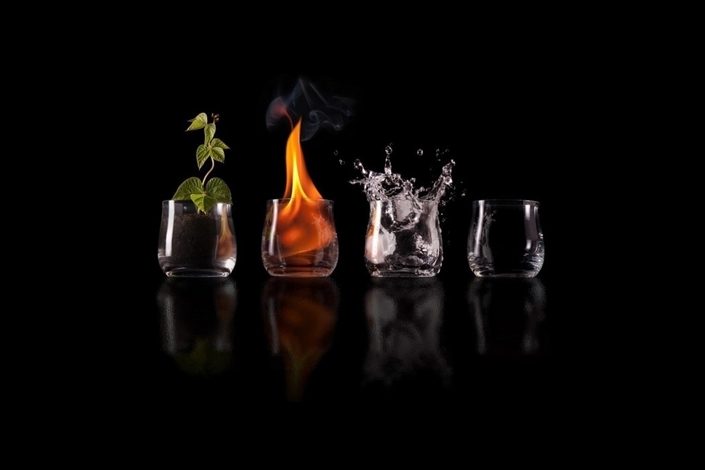

The Dopamine Economy – Eudaimonia and Co

# The Dopamine Economy

## The Mad Men Created Consumers. We’ve Created Algorithmic Addicts

What have we really built today, with all this technology? At the root, if we go down to the essence of what it is?

Every minute, every thirty seconds. Update, political scandal. Update, celebrity gossip. Update, outrage. Update, Black Friday sale starting early. Trigger. Surge. Release. Reward. Whoosh. High. Crash. Repeat. You’ve felt it and I’ve felt, so there’s no need to deny it. The little soaring adrenalin rush of finding a better deal, date, time, pleasure. We’ve built a dopamine economy. It’s profoundly addictive, deeply toxic for us as both people societies, and it’s high time to begin grappling with that.

**By dopamine economy, I mean this. ****We’ve gone beyond creating “consumers” — that was the mad men did: today, we’ve created addicts of the algorithm. **People who desperately check their smartphones hundreds of times a day, whose fixated eyes never leave screens, who obsessively-compulsively spend more time in fantasylands than with their families, chasing the breathtaking adrenalin high of dopaminergic release. It’s a model of what it means to human, an institutional form, where people desperately seek ever higher and quicker and sharper highs, and find lower and harsher and darker lows. But is it good for us, let alone them?

Now. I’ll resist the urge to go evo-bio, because the truth is very simple: dopamine triggers adrenalin, chasing too much depletes both, and thus imbalances the rest of your brain, causes serotonin etcetera to be dysregulated and thus pyschosis can result. I’ll also resist the urge to draw an easy answer like saying “we should then build a serotonin economy instead!”, full of uplifting things, a web made of Hallmark tears. You and I know it’s not so simple.

Let’s think about more how the dopamine economy was really built. A generation of marketers, technologists, venture capitalist, and entrepreneurs, quasi-scientifically, using behavioral economics, neurobiology, and technology, addicted people to excitement, whether it’s titillation, outrage, or burning desire, because they found that people, somehow, could be easily triggered this way. They had unwittingly stumbled on the fight-flight response, dopamine triggering adrenalin, which is what causes the breathtaking high of, say, the heroin addict, and we’ll come back to that.

So now we reward people, as if they were lab rats, with little tiny morsels of reward, whether they’re coupons, clickbait headlines, discounts, special offers, prizes, and so on, and somehow, they always come back for more. We don’t really know why — and so we don’t know what fire we’re really playing with, that we’re toying with the basics of human neurobiology itself, that every click’s effect is something like a heroin injection, dopamine triggering adrenalin surging through the system. This dopaminergic, which is to say, unidimensional approach to human potential, is a behaviourist approach to human potential, and it is a linear approach to human potential: the presumption is that through systematic rewards that trigger just one kind of experience, over and over again, fight-flight, adrenalin high, addictively, people can be trained to become…what, precisely? I’ll come back to that.

And yet the result even for us, the masters of this dopaminergic approach to human possibility is a vicious cycle. We have to offer ever more intense and more fleeting rewards than the next person. This is Amazon’s game, Facebook’s game, Tinder’s game, Instagram’s game more or less. Swipe. Don’t let it get away! There’s an endless universe of stuff out there, and you’d better click now, unless you want to wander lost in it forever. “You need your pretty little fix now, don't you?”, the algorithm whispers. You’ve heard it and I’ve heard it, and we’ve both responded desperately, too.

Let’s use Instagram and Facebook as a tiny case study. Now of course there are people who use them well, kindly, gently. But what really happens? You, the user, sees something impossibly glittering, an impossibly beautiful, rich, accomplished person. The dopamine crackles. You get your reward. Wow! How amazing and glamorous life can be! But now something dangerous has happened, too: your expectations have been set impossibly high, all the way to perfection.**  ****Because the truth is that even those perfect people struggle with despair and misery and longing, just like you.** Why the hell else would they be sharing their lives like that? They want your approval, respect, admiration, too. So you click like, heart, share, and now the dopamine crackles for *them, *too. Surges, They get their reward. And they have to be a little more perfect every time to get it, just as you have to end up a little more depressed each time to give it.

What have we really created? What psychology might call a double infantile narcissistic regression. On the one side lie people who need to be adored in perfect ways to feel loved at all, though we are all imperfect, and being loved that way is the real thing. On the other lie people who suppose that only if they are perfect will they every be worth much at all. Both are flipsides of the narcissistic stage of babyhood, where the little child must feel he is the center of the universe to develop a sense of self. Not just “self esteem”, but self: a sense that one exists, matters, hang together. The dopamine fix we get from the web now is precisely the excitement the baby feels at being fed.

So the dopamine economy is regressing us as people, to an infantile state, where we long to become the center of the universe, instead of maturing, accepting and seeing each other’s fragility, which is exactly where genuine sanity, *sanus*, health, a connected and whole relationship with being, the world, yourself, begins. Now you might think that’s overstating it, but just ask yourself when you are a kind, gentle, loving, compassionate person, who really feels true: is it when you’re crackling with dopamine? Nope. Or when you are calm, still, silent, strong? Your dopamine crackles when you’re fighting or fleeing, and what addicts are addicted to is usually fleeing, the pain and despair of living. But the adult must somehow learn that even in that pain and despair lies great beauty and happiness.

Is it any surprise then that societies are regressing, too, when tech is creating algorithmic addicts stuck in infantile states having counterfeit relationships, not, let’s say, vibrant citizens and neighbours and friends and institutions and trust between them all? Of course, I don’t wish to say that the dopamine economy is the only reason societies are going backwards: it’s not, bad economic policies and bad politics and toxic cultures all play their role. Yet by regressing us to fixated infants searching desperately for the next fix, a dopaminergic approach to human possibility makes us less capable of genuinely adult behaviour: really openly discussing, handling, managing, our many great problems, from inequality to climate change to predatory behaviour. **Dopaminergic regression, searching for the next quick fix, leaves us stuck in childlike behaviors, instead of letting, helping, encouraging us to grow up.**

Now here you might say: but capitalism! Now that you’ve pointed it out, Umair, isn’t capitalism always dopamine-seeking, writ large? Yes and no. **Capitalism will always prey upon our fears and insecurities and absences**. It will always evoke our greed and scorn and spite, because it’s easiest to sell things to people who are full of rage and terror. And yet that isn’t all capitalism can do, or even what it should do. Just as you resist your worst impulses, so can businesses and societies. And those that can are likely to make it — for the simple reason that this vicious circle of dopamine-seeking is already tiring us out, isn’t it? We already see growth stalling in the dopamine economy, because, frankly, nobody wants to be an algorithmic addict forever, no matter how much they think they do. And the danger is that instead of understanding we should leave it behind, we redouble it, with even sharper highs, that produce even more helpless infantile states.

**So what should we be doing? Giving people ways to express themselves. **Not their “better selves” or their “true selves” or any of the rest of it. Just themselves. Aren’t we doing that? No. Are you kidding? We’ve created a performative game, in which true self expression is mocked, scorned, thwarted, and stifled. This essay’s too long already, so I’ll leave that topic for the future. Suffice it to say that algorithmic addiction is one the gravest new problems of now.

Umair
November 2017