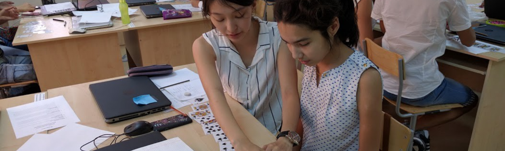

The Eliza Effect – Medium

[Homepage](https://medium.com/)

[Sign in / Sign up](https://medium.com/m/signin?redirect=https%3A%2F%2Fmedium.com%2Feliza-effect)

[# The Eliza Effect](https://medium.com/eliza-effect)

## AI, ML, and what it means to be human

[(L)](https://twitter.com/ffpaladin)[(L)](https://facebook.com/ffpaladin)

[Sherol Chen](https://medium.com/@sherol?source=collection_home---6------0-----------)

[May 25](https://medium.com/eliza-effect/procedural-thinking-how-procedurally-literate-are-you-241b50728eaa?source=collection_home---6------0-----------)·12 min read

[          ### Procedural Thinking: Understanding AI and ML amidst the next workforce revolution  #### How Procedurally…](https://medium.com/eliza-effect/procedural-thinking-how-procedurally-literate-are-you-241b50728eaa?source=collection_home---6------0-----------)

[Read more…](https://medium.com/eliza-effect/procedural-thinking-how-procedurally-literate-are-you-241b50728eaa?source=collection_home---6------0-----------)

[Sherol Chen](https://medium.com/@sherol?source=collection_home---6------1-----------)

[May 3](https://medium.com/eliza-effect/science-fiction-movie-trailers-and-youtube-videos-i-use-to-help-kids-understand-artificial-38a6c08d4652?source=collection_home---6------1-----------)·8 min read

[          ### How to Explain AI to Kids  #### Science Fiction, Movie Trailers, and Youtube Videos I Use to Help Kids…](https://medium.com/eliza-effect/science-fiction-movie-trailers-and-youtube-videos-i-use-to-help-kids-understand-artificial-38a6c08d4652?source=collection_home---6------1-----------)

[Read more…](https://medium.com/eliza-effect/science-fiction-movie-trailers-and-youtube-videos-i-use-to-help-kids-understand-artificial-38a6c08d4652?source=collection_home---6------1-----------)

[1 response](https://medium.com/eliza-effect/science-fiction-movie-trailers-and-youtube-videos-i-use-to-help-kids-understand-artificial-38a6c08d4652?source=collection_home---6------1-----------#--responses)

[Sherol Chen](https://medium.com/@sherol?source=collection_home---6------2-----------)

[Oct 25, 2016](https://medium.com/eliza-effect/trump-is-a-thermometer-not-a-thermostat-and-how-early-ai-systems-modeled-politics-76be58255db9?source=collection_home---6------2-----------)·5 min read

[          ### Trump is a Thermometer, not a Thermostat, and How Early AI Systems Modeled Politics](https://medium.com/eliza-effect/trump-is-a-thermometer-not-a-thermostat-and-how-early-ai-systems-modeled-politics-76be58255db9?source=collection_home---6------2-----------)

[Read more…](https://medium.com/eliza-effect/trump-is-a-thermometer-not-a-thermostat-and-how-early-ai-systems-modeled-politics-76be58255db9?source=collection_home---6------2-----------)

The Eliza Effect

ELIZA was a chatbot developed in 1966. The ELIZA Effect is the tendency to unconsciously assume computer behaviors are analogous to human behaviors. Here you’ll find articles on Artificial Intelligence, Machine Learning, Believability, and Procedural Thinking.

[More information](https://medium.com/eliza-effect/about)

Followers

6

Elsewhere

[(L)](https://medium.com/eliza-effectmailto:ffpaladin@gmail.com)[(L)](https://twitter.com/ffpaladin)[(L)](https://facebook.com/ffpaladin)

[About The Eliza Effect](https://medium.com/eliza-effect/about)·[Latest Stories](https://medium.com/eliza-effect/latest)·[Archive](https://medium.com/eliza-effect/archive)·[About Medium](https://about.medium.com/)·[Terms](https://medium.com/policy/9db0094a1e0f)·[Privacy](https://medium.com/policy/f03bf92035c9)