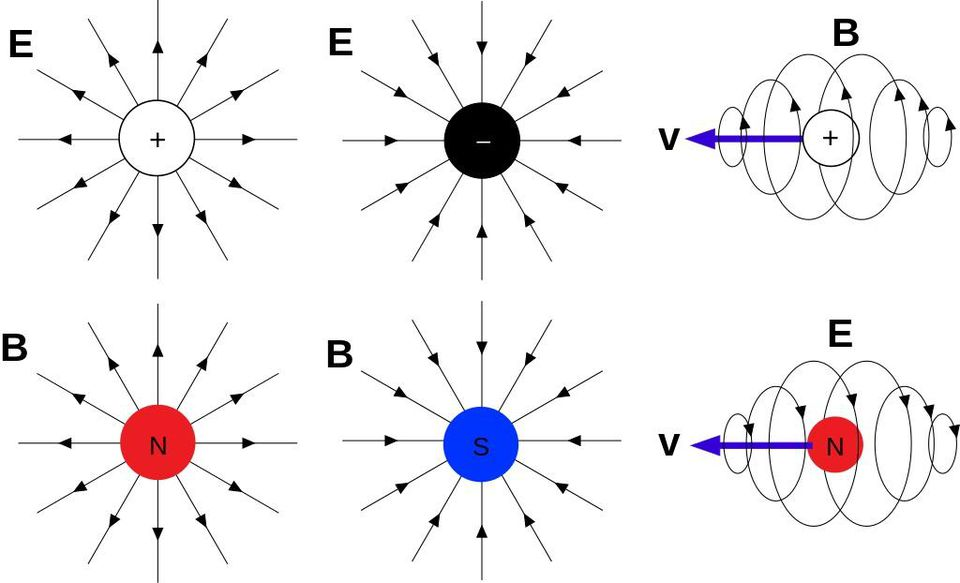
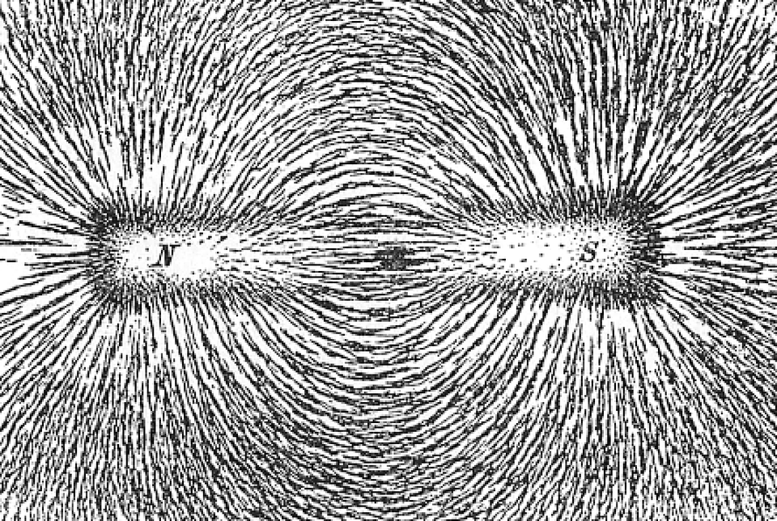
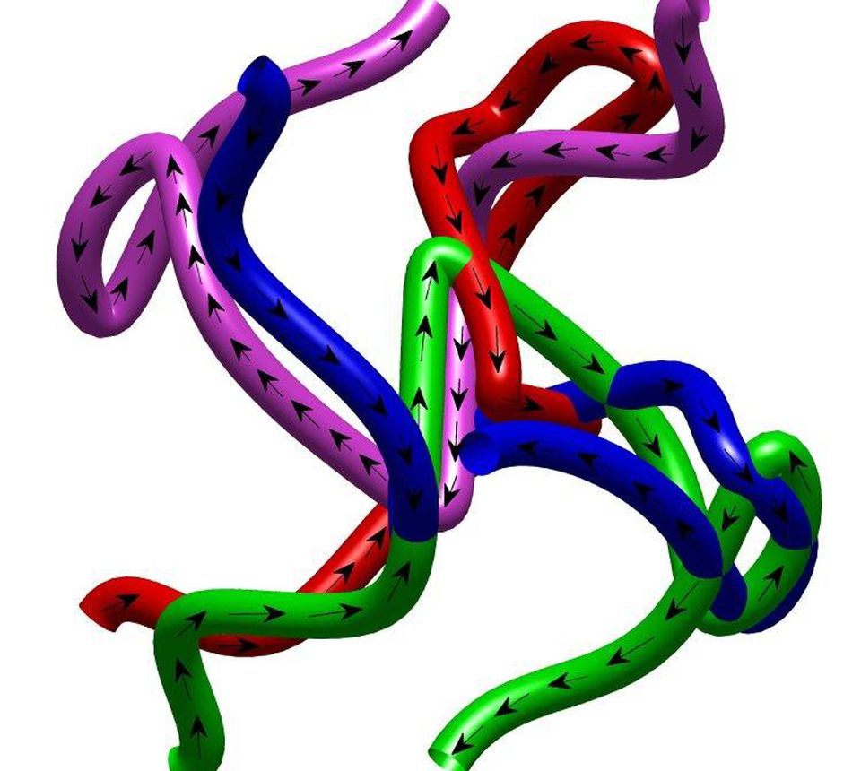
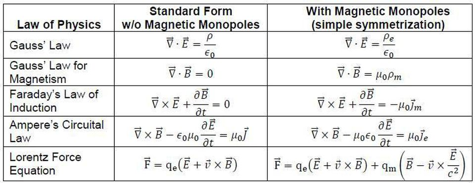
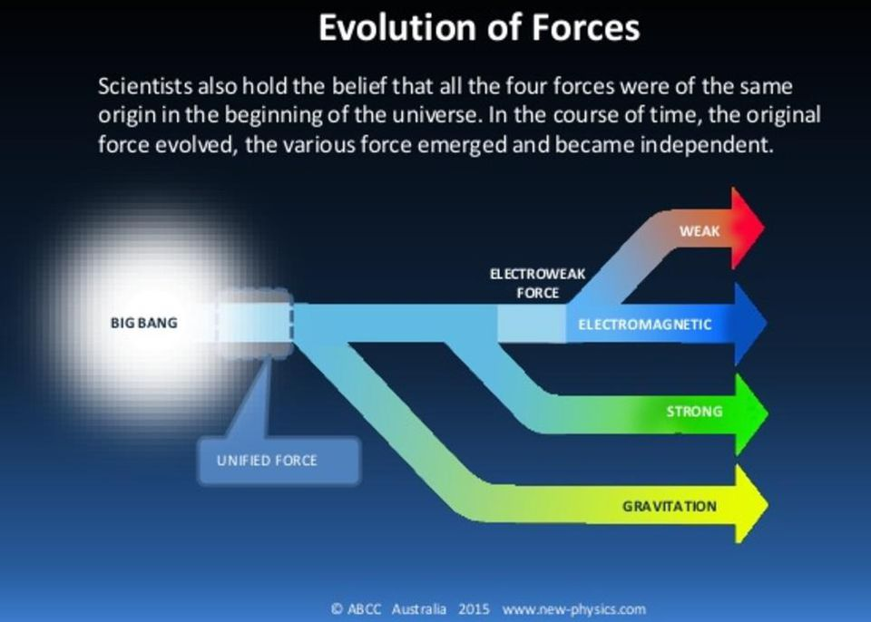
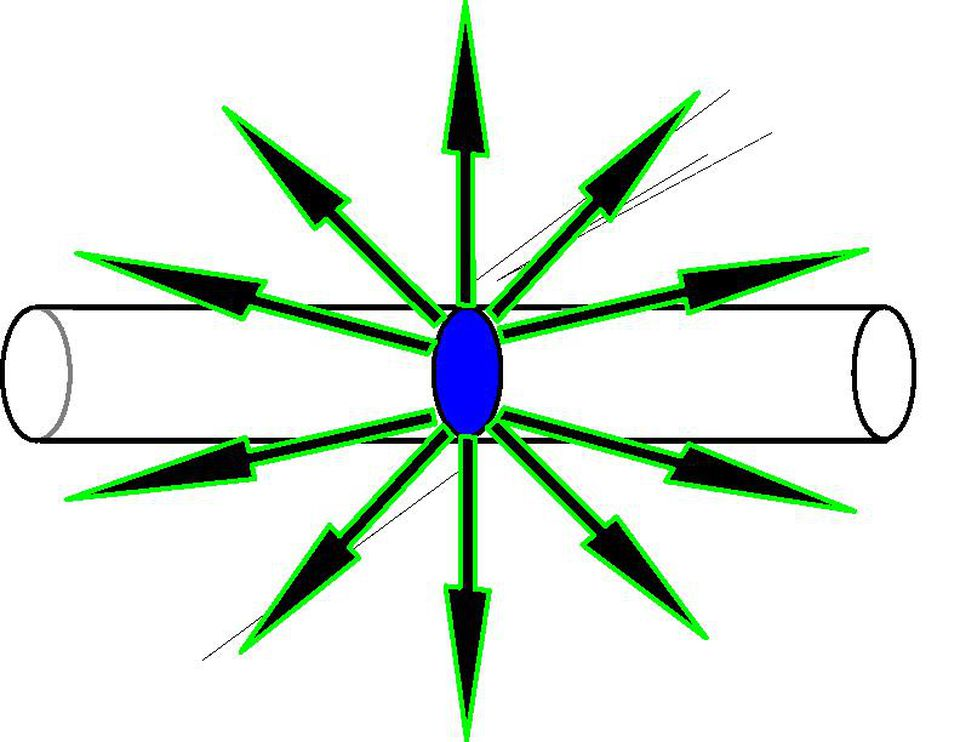
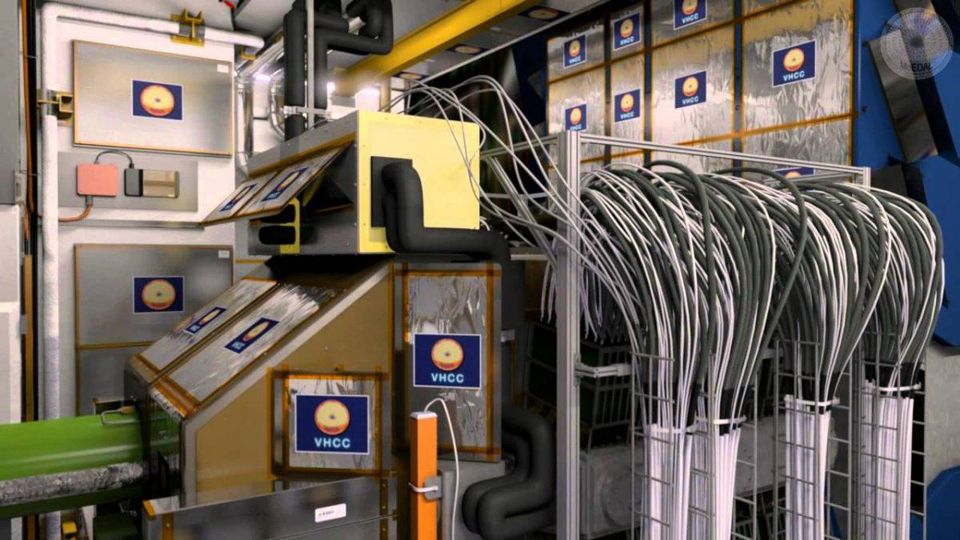
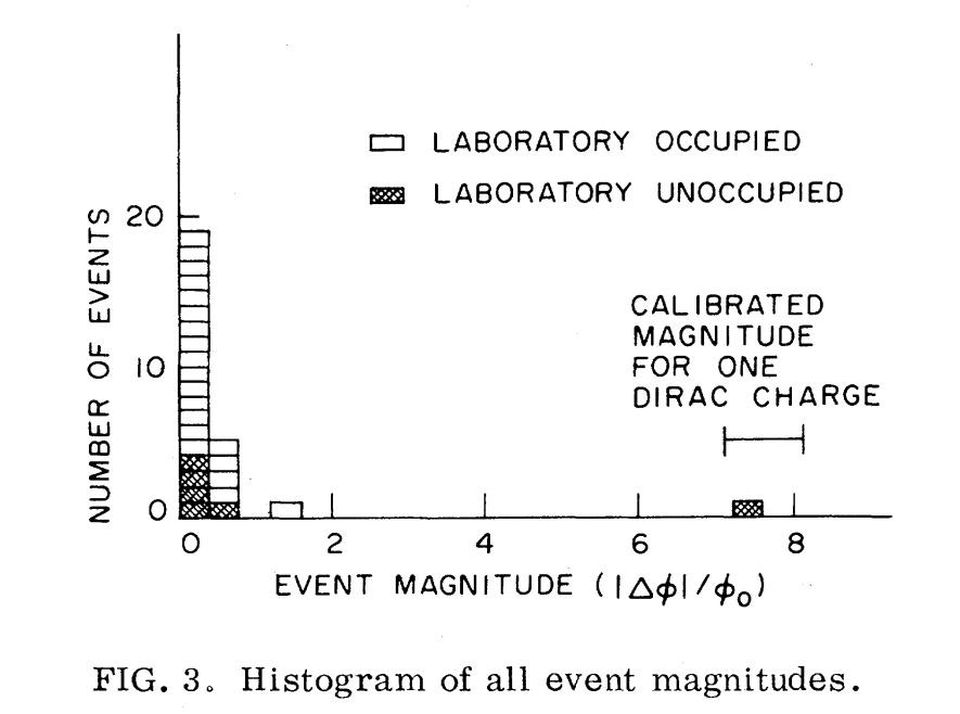
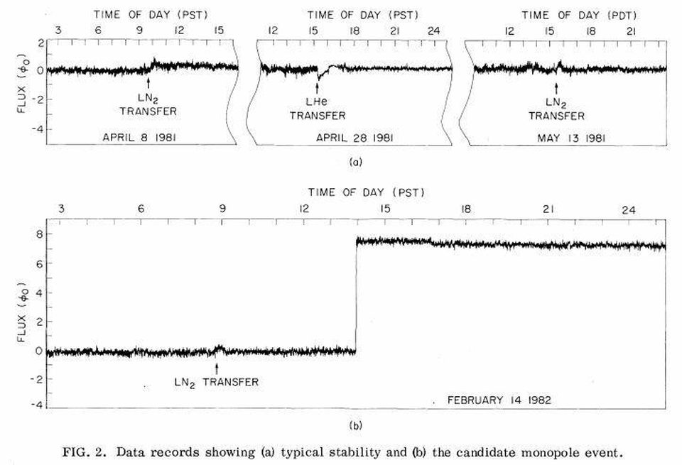
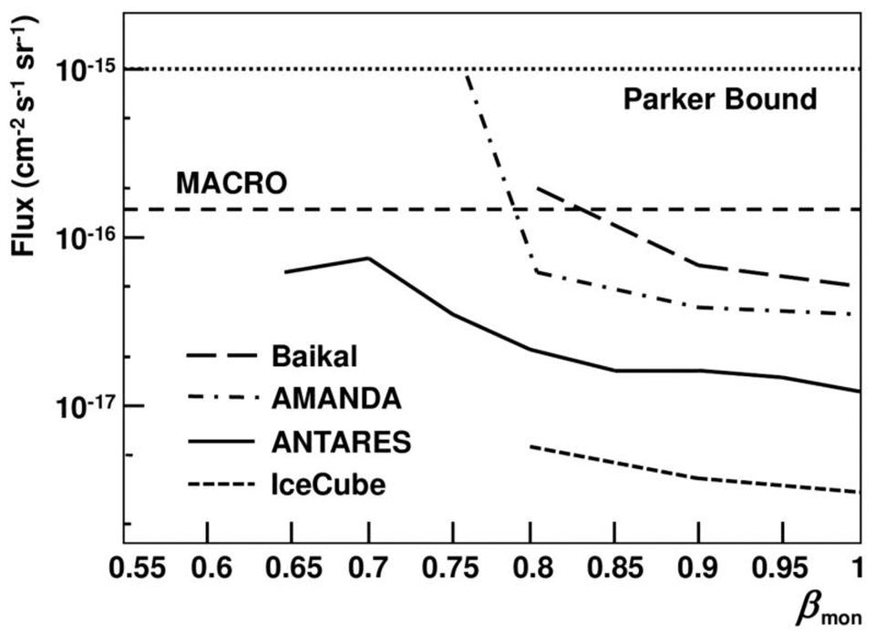

The Enduring Mystery Of Detecting The Universe's Only Magnetic Monopole

12,453 views|Feb 7, 2019, 02:00am

# The Enduring Mystery Of Detecting The Universe's Only Magnetic Monopole

[Ethan Siegel](https://www.forbes.com/sites/ethansiegel/)Senior Contributor[Starts With A Bang](http://www.forbes.com/sites/startswithabang/)

Contributor Group

[Science](https://www.forbes.com/science)The Universe is out there, waiting for you to discover it.

-
-
-

 

Electromagnetic fields as they would be generated by positive and negative electric charges, both at rest and in motion (top), as well as those that would theoretically be created by magnetic monopoles (bottom), were they to exist.

 Wikimedia Commons user Maschen

Imagine that you're a scientist, going out on a limb to design and build an experiment that everyone expects will see absolutely nothing. You're invested in physics at the fringes: looking for a sign of an unlikely, but theoretically not impossible, particle that's never been seen before. A few scientists have speculated, over many decades, that such a particle could potentially exist, but all attempts to detect its existence — both direct and indirect — have come up empty.

One weekend, you set up your long-running experiment and decide not to come into the lab on that Sunday. When you return on Monday, you find that the unthinkable has occurred: your detector registered a signal unlike any you've ever seen before. For the first (and only) time, you saw evidence for a brand new particle. This isn't just a dream scenario; this happened, for real, back on Valentine's Day in 1982.

 

Magnetic field lines, as illustrated by a bar magnet: a magnetic dipole, with a north and south pole bound together. These permanent magnets remain magnetized even after any external magnetic fields are taken away.

 Newton Henry Black, Harvey N. Davis (1913) Practical Physics

ADVERTISING

[inRead invented by Teads](https://www.teads.com/?utm_source=inread&utm_medium=credits&utm_campaign=invented%20by%20teads)

In the science of electromagnetism, you have two types of charges: positive and negative. These fundamental charges are electric-only in nature, having no intrinsic magnetic charge. Sure, you can have north and south magnetic poles, but never one without the other. The fact that electromagnetism is not a symmetric theory — that there are electric charges but not magnetic ones — is a fundamental truth of our laws of nature.

The only way we can generate magnetic fields, therefore, is to have moving electric charges: electric currents. These currents can be generated down at the atomic or molecular level, as individual electrons orbit within much larger, macroscopic structures. Even the permanent magnets you know of cannot have detached north or south poles; they can only exist in tandem.

## YOU MAY ALSO LIKE

UNICEF USA BrandVoice

 [ ###  This Passover, Remember Today's Refugees]()

UNICEF USA BrandVoice

 [ ###  Audrey Hepburn's Humanitarian Legacy Continues]()

Grads of Life BrandVoice

 [ ###  How These Leading Companies Are Redefining The Workplace To Retain Talent]()

 

Magnetic strings can be created under specific laboratory conditions, where the two ends of the strings, corresponding to north and south poles, can be well-separated by extremely large distances. If one pole is kept relatively isolated from the rest, it can create a quasiparticle that serves as a magnetic monopole analogue.

 D. J. P. Morris et al. (2009), Science Vol. 326, 5951, pp. 411-414

In nature, finding a north pole and a south pole together is a non-negotiable property of magnetism. Magnets exist, but only in the form of magnetic dipoles. There's no such things as a north or south magnetic pole by itself: a magnetic monopole. If we wanted to create one, there are only two ways to do it. (And the first way involves a bit of cheating.)

**1.)** We can [create quasiparticles that resemble magnetic monopoles](http://science.sciencemag.org/content/326/5951/411). In certain applications of condensed matter physics, it's possible to create magnetic strings, where long, thin magnets are created on a lattice, allowing you to separate north and south poles by great distances. If you can separate them by large enough distances, it will appear, when you look at your system, that only one pole exists. The other pole, however, is still there; it's just well-separated and isolated from the pole you're measuring.

 

It's possible to write down a variety of equations, like Maxwell's equations, that describe the Universe. We can write them down in a variety of ways, but only by comparing their predictions with physical observations can we draw any conclusion about their validity. It's why the version of Maxwell's equations with magnetic monopoles (right) doesn't correspond to reality, while the version without (left) does.

 Ed Murdock

**2.)** We could modify the theory of electromagnetism to include magnetic monopoles. This is literally a theoretical conceit: change the known laws of physics to enable the creation of a new type of matter. The modification is simple: instead of just electric charge, hypothesize that a new type of charge — magnetic charge — exists as well. If you add this to your theory, all of electromagnetism becomes symmetric.

- Electric charges exist in positive and negative versions; magnetic charges exist in north and south versions.

- Moving electric charges generate magnetic fields; moving magnetic charges generate electric fields.

- Changing magnetic fields cause electric charges to move; now changing electric fields will cause magnetic charges to move.

This was first played around with by Dirac in the 1930s, but no one took it seriously because of the lack of evidence.

 

The idea of unification holds that all three of the Standard Model forces, and perhaps even gravity at higher energies, are unified together in a single framework. This idea is powerful, has led to a great deal of research, but is a completely unproven conjecture. Nevertheless, many physicists are convinced this is an important approach to understanding nature, and it has led to some interesting, generic, and testable predictions.

 © ABCC Australia 2015 www.new-physics.com

In the 1970s, however, there was a renewed interest in theories that were more symmetric than the Universe we knew and observed today. Grand Unification Theories came into fashion, as electroweak unification led many to suggest that perhaps, at even higher energies, there were additional types of unifications that might be present.

If the forces and interactions were more unified in the past, that would imply the existence of new physics beyond what's presently known in the Standard Model. Breaking those symmetries to obtain the low energy Universe we have today results in the prediction of additional fields and new, massive particles. In many incarnations, magnetic monopoles (of the ['t Hooft/Polyakov variety](http://en.wikipedia.org/wiki/%27t_Hooft%E2%80%93Polyakov_monopole)) are some of those new predictions.

 

The concept of a magnetic monopole, emitting magnetic field lines the same way an isolated electric charge would emit electric field lines. Unlike magnetic dipoles, there's only a single, isolated source.

 BPS States in Omega Background and Integrability — Bulycheva, Kseniya et al. JHEP 1210 (2012) 116

Whenever you have an interesting, compelling theoretical prediction, you want to find a way to test it out. If there were magnetic monopoles permeating the Universe, there's a chance that we could detect one of them if it passed through a loop of wire. Passing a magnet through a conducting loop would register a signal: a positive one of a particular magnitude when the first pole passed through it, and then a negative one of equal magnitude when the second pole passed through.

If magnetic monopoles were real, however, you'd get a signal that only had one direction: positive or negative, followed by a failure to return back to your baseline of zero. Throughout the 1970s, a few researchers were designing and building exactly this type of experiment. By far, the most famous one was put together by physicist Blas Cabrera.

 

Although the original experiments searching for magnetic monopoles were primitive by comparison to detectors like IceCube or the LHC's MoEDAL, which are also designed to detect exotic particles like magnetic monopoles, many of the basic design elements are universal.

 CERN / MoEDAL Collaboration

Cabrera designed his experiment to operate at cold, cryogenic temperatures, fashioning not just one loop out of wire, but a coil containing eight loops. The coil was designed and optimized to measure magnetic flux, so if a monopole of one magneton (the theoretical unit of quantized magnetism) passed through it, you'd see a signal of exactly 8 magnetons.

If, on the other hand, you passed a dipole magnet through it, you'd get a signal of +8 followed by one of -8 (or -8 followed by +8), so you could distinguish between a monopole and a dipole. If the signal was anything other than 8 magnetons (or a multiple of 8), you'd know you weren't seeing magnetic monopoles.

 

Prior to the event of February 14, 1982, the only events registered in Cabrera's detector were of 2 magnetons or less. The one event of 8 magnetons was unprecedented, and was consistent with a magnetic monopole of the predicted (Dirac) charge passing through it.

 Cabrera B. (1982). First Results from a Superconductive Detector for Moving Magnetic Monopoles, Physical Review Letters, 48 (20) 1378–1381

So, he built this device and waited. The device wasn’t perfect, and occasionally one of the loops would send a signal, giving a false positive of +1 or -1 magnetons. On even rarer occasions, two loops would send a signal at once, giving a false signal of +2 or -2. Remember, you’d need a signal of 8 (and exactly 8) for it to be a magnetic monopole.

The apparatus never detected three or more.

This experiment ran for some months with no success, and was eventually relegated to being checked up on only a few times a day. In February of 1982, Valentine’s Day fell on a Sunday, and Cabrera didn't come into the lab. When he returned to the office on the 15th, he surprisingly found that the computer and the device had recorded exactly 8 magnetons just shy of 2:00 PM on February 14th, 1982.

 

In 1982, an experiment running under the leadership of Blas Cabrera, one with eight turns of wire, detected a flux change of eight magnetons: indications of a magnetic monopole. Unfortunately, no one was present at the time of detection, and no one has ever reproduced this result or found a second monopole.

 Cabrera B. (1982). First Results from a Superconductive Detector for Moving Magnetic Monopoles, Physical Review Letters, 48 (20) 1378–1381

The discovery roared through the community, generating a huge amount of interest. Enormous devices with larger surface areas and more loops were built, with many new groups joining the search for magnetic monopoles. Despite the large investment of resources, another monopole was never seen. Stephen Weinberg, the famed Nobel Laureate and developer of the Standard Model, wrote Cabrera a poem the next Valentine's Day:

> “>
*> Roses are red,
>  Violets are blue,
>  It's time for monopole
>  number TWO!*
>

But monopole two never came. 37 years after the first (and only) detection, the search for magnetic monopoles has largely been abandoned, with Antarctica's IceCube experiment providing the most stringent limits.

 

Experimental limits on the existence of magnetic monopoles. The lowest line on the chart represents the most stringent limit, and comes from the IceCube experiment. A second magnetic monopole, in the 37 years we've been searching for them, has never been found.

 Katz, U.F. et al. Prog.Part.Nucl.Phys. 67 (2012) 651–704

We may never know what went on inside that detector back on Valentine's Day of 1982. Was there really a magnetic monopole that passed through it, where we were fortunate enough to find it but never saw another one? Was it an unprecedented glitch in the equipment? A most unusual cosmic ray with heretofore inexplicable properties? Or, perhaps, a prank played by a student, rival, or professional saboteur?

In experimental science, the most important thing is to be able to replicate your results, and a second monopole detection has never come to pass. As beautiful as a symmetric Universe might be, that simply doesn't appear to be the Universe we have. Nobody knows what happened to fool us into thinking we'd detected a magnetic monopole, but without repeat confirmation, we have no choice but to conclude it wasn't real. Magnetic monopoles, as far as we can tell, don't appear to exist.

*

*Astrophysicist and author Ethan Siegel is the founder and primary writer of Starts With A Bang! His books, [Treknology](http://amzn.to/2na2hwn) and [Beyond The Galaxy](http://amzn.to/2mZrGIv), are available wherever books are sold.*

*

[Ethan Siegel](https://www.forbes.com/sites/ethansiegel/)Senior Contributor

I am a Ph.D. astrophysicist, author, and science communicator, who professes physics and astronomy at various colleges. I have won numerous awards for science writing s...

[Starts With A Bang](http://www.forbes.com/sites/startswithabang/)
Contributor Group

Starts With A Bang is dedicated to exploring the story of what we know about the Universe as well as how we know it, with a focus on physics, astronomy, and the scientif...

- [Print]()
- [Site Feedback](https://www.forbes.com/mailto:feedback@forbes.com)
- [Tips](https://www.forbes.com/tips/)
- [Corrections](https://www.forbes.com/mailto:corrections@forbes.com?subject=Report%20Correction%3A%20Ethan%20Siegel&body=Reporting%20Correction%20for%3A%0A%0ATitle%3A%20The%20Enduring%20Mystery%20Of%20Detecting%20The%20Universe%27s%20Only%20Magnetic%20Monopole%0AAuthor%3A%20Ethan%20Siegel%0AURL%3A%20https%3A%2F%2Fwww.forbes.com%2Fsites%2Fstartswithabang%2F2019%2F02%2F07%2Fthe-enduring-mystery-of-detecting-the-universes-only-magnetic-monopole%2F%0A%0A--%0A%0AYour%20Name%3A%0ACorrection%20Request%3A%0A%0A--%0A%0AThank%20you%20for%20reporting%20a%20correction.%20Forbes%20staff%20will%20review%20your%20concern%20shortly.)
- [Reprints & Permissions](https://www.parsintl.com/publication/forbes/)
- [Terms](https://www.forbes.com/terms/)
- [Privacy](https://www.forbes.com/fdc/privacy.html)
- ©2019 Forbes Media LLC. All Rights Reserved.
- [AdChoices](http://preferences-mgr.truste.com/?pid=forbes01)