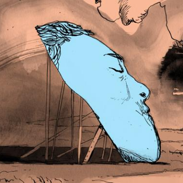

The Ethics of Consciousness Hunting - Issue 64: The Unseen - Nautilus

The Ethics of Consciousness Hunting - Issue 64: The Unseen - Nautilus

http://nautil.us/issue/64/the-unseen/the-ethics-of-consciousness-hunting

When Adrian Owen, a neuroscientist at the University of Western Ontario, asked Scott Routley to imagine playing a game of tennis,&#8230;