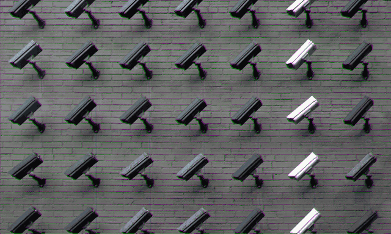
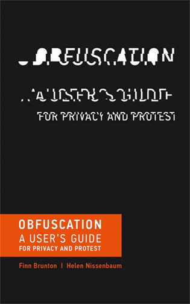

The Fantasy of Opting Out

# The Fantasy of Opting Out

Those who know about us have power over us. Obfuscation may be our best digital weapon.

**There are still ways to carve out spaces of resistance, counterargument, and autonomy. Image: Lianhao Qu, [via Unsplash](https://unsplash.com/photos/LfaN1gswV5c)

By: Finn Brunton & Helen Nissenbaum

Consider a day in the life of a fairly ordinary person in a large city in a stable, democratically governed country. She is not in prison or institutionalized, nor is she a dissident or an enemy of the state, yet she lives in a condition of permanent and total surveillance unprecedented in its precision and intimacy.

As soon as she leaves her apartment, she is on camera: while in the hallway and the elevator of her building, when using the ATM outside her bank, while passing shops and waiting at crosswalks, while in the subway station and on the train — and all that before lunch. A montage of nearly every move of her life in the city outside her apartment could be assembled, and each step accounted for. But that montage would hardly be necessary: Her mobile phone, in the course of its ordinary operation of seeking base stations and antennas to keep her connected as she walks, provides a constant log of her position and movements. Her apps are [keeping tabs](https://www.nytimes.com/interactive/2018/12/10/business/location-data-privacy-apps.html), too.

**This article is adapted from Finn Brunton and Helen Nissenbaum’s book “[Obfuscation: A User’s Guide for Privacy and Protest](https://www.amazon.com/dp/0262029731/).”

Any time she spends in “dead zones” without phone reception can also be accounted for: Her subway pass logs her entry into the subway, and her radio-frequency identification badge produces a record of her entry into the building in which she works. (If she drives a car, her electronic toll-collection pass serves a similar purpose, as does [automatic license-plate imaging](https://www.usatoday.com/story/news/nation/2014/11/02/license-plate-data-is-big-business/18370791/).) If her apartment is part of a smart-grid program, spikes in her electricity usage can reveal exactly when she is up and around, turning on lights and ventilation fans and using the microwave oven and the coffee maker.

Surely some of the fault must lie with this individual for using services or engaging with institutions that offer unfavorable terms of service and are known to misbehave. Isn’t putting all the blame on government institutions and private services unfair, when they are trying to maintain security and capture some of the valuable data produced by their users? Can’t we users just opt out of systems with which we disagree?

Before we return to the question of opting out, consider how thoroughly the systems mentioned are embedded in our hypothetical ordinary person’s everyday life, far more invasively than mere logs of her daily comings and goings. Someone observing her could assemble in forensic detail her social and familial connections, her struggles and interests, and her beliefs and commitments. From [Amazon purchases](https://www.nytimes.com/2019/01/20/technology/amazon-ads-advertising.html) and Kindle highlights, from purchase records linked with her [loyalty cards at the drugstore](https://www.bbc.com/news/technology-43483426) and the supermarket, from [Gmail metadata](https://www.forbes.com/sites/kashmirhill/2013/07/10/heres-a-tool-to-see-what-your-email-metadata-reveals-about-you/#1121fec2d252) and chat logs, from [search history](https://www.businessinsider.com/even-if-you-cleared-your-history-google-records-your-search-activity-2018-4) and checkout records from the public library, from Netflix-streamed movies, and from activity on Facebook and Twitter, dating sites, and other social networks, a very specific and personal narrative is clear.

**

> If the apparatus of total surveillance that we have described here were deliberate, centralized, and explicit, a Big Brother machine toggling between cameras, it would demand revolt, and we could conceive of a life outside the totalitarian microscope.

**

If the apparatus of total surveillance that we have described here were deliberate, centralized, and explicit, a Big Brother machine toggling between cameras, it would demand revolt, and we could conceive of a life outside the totalitarian microscope. But if we are nearly as observed and documented as any person in history, our situation is a prison that, although it has no walls, bars, or wardens, is difficult to escape.

Which brings us back to the problem of “opting out.” For all the dramatic language about prisons and panopticons, the sorts of data collection we describe here are, in democratic countries, still theoretically voluntary. But the costs of refusal are high and getting higher: A life lived in social isolation means living far from centers of business and commerce, without access to many forms of credit, insurance, or other significant financial instruments, not to mention the minor inconveniences and disadvantages — long waits at road toll cash lines, higher prices at grocery stores, inferior seating on airline flights.

It isn’t possible for everyone to live on principle; as a practical matter, many of us must make compromises in asymmetrical relationships, without the control or consent for which we might wish. In those situations — everyday 21st-century life — there are still ways to carve out spaces of resistance, counterargument, and autonomy.

We are surrounded by examples of obfuscation that we do not yet think of under that name. Lawyers engage in overdisclosure, sending mountains of vaguely related client documents in hopes of burying a pertinent detail. Teenagers on social media — surveilled by their parents — will conceal a meaningful communication to a friend in a throwaway line or a song title surrounded by banal chatter. Literature and history provide many instances of “collective names,” where a population took a single identifier to make attributing any action or identity to a particular person impossible, from the fictional “I am Spartacus” to the real “Poor Conrad” and “Captain Swing” in prior centuries — and “Anonymous,” of course, in ours.

We can apply obfuscation in our own lives by using practices and technologies that make use of it, including:

- •The secure browser [Tor](https://www.torproject.org/), which (among other anti-surveillance technologies) muddles our Internet activity with that of other Tor users, concealing our trail in that of many others.
- •The browser plugins [TrackMeNot](http://trackmenot.io/) and [AdNauseam](https://adnauseam.io/), which explore obfuscation techniques by issuing many fake search requests and loading and clicking every ad, respectively.
- •The browser extension [Go Rando](https://bengrosser.com/projects/go-rando/), which randomly chooses your emotional “reactions” on Facebook, interfering with their emotional profiling and analysis.
- •Playful experiments like Adam Harvey’s “[HyperFace” project](https://ahprojects.com/), finding patterns on textiles that fool facial recognition systems – not by hiding your face, but by creating the illusion of many faces.

* * *

If obfuscation has an emblematic animal, it is the family of orb-weaving spiders, *Cyclosa mulmeinensis*, which fill their webs with decoys of themselves. The decoys are far from perfect copies, but when a wasp strikes they work well enough to give the orb-weaver a second or two to scramble to safety. At its most abstract, obfuscation is the production of noise modeled on an existing signal in order to make a collection of data more ambiguous, confusing, harder to exploit, more difficult to act on, and therefore less valuable. Obfuscation assumes that the signal can be spotted in some way and adds a plethora of related, similar, and pertinent signals — a crowd which an individual can mix, mingle, and, if only for a short time, hide.

**

> There is no simple solution to the problem of privacy, because privacy itself is a solution to societal challenges that are in constant flux.

**

There is real utility in an obfuscation approach, whether that utility lies in bolstering an existing strong privacy system, in covering up some specific action, in making things marginally harder for an adversary, or even in the “mere gesture” of registering our discontent and refusal. After all, those who know about us have power over us. They can deny us employment, deprive us of credit, restrict our movements, refuse us shelter, membership, or education, manipulate our thinking, suppress our autonomy, and limit our access to the good life.

There is no simple solution to the problem of privacy, because privacy itself is a solution to societal challenges that are in constant flux. Some are natural and beyond our control; others are technological and should be within our control but are shaped by a panoply of complex social and material forces with indeterminate effects. Privacy does not mean stopping the flow of data; it means channeling it wisely and justly to serve societal ends and values and the individuals who are its subjects, particularly the vulnerable and the disadvantaged. Innumerable customs, concepts, tools, laws, mechanisms, and protocols have evolved to achieve privacy, so conceived, and it is to that collection that we add obfuscation to sustain it — as an active conversation, a struggle, and a choice.

* * *

*Finn Brunton is assistant professor in the Department of Media, Culture, and Communication at New York University. He is the author of “[Spam: A Shadow History of the Internet](https://www.amazon.com/Spam-Shadow-History-Internet-Infrastructures/dp/026252757X)” and coauthor (with Helen Nissenbaum) of “[Obfuscation: A User’s Guide for Privacy and Protest,](https://www.amazon.com/dp/0262029731/)” from which this excerpt is adapted. *

*Helen Nissenbaum is professor of information science at Cornell Tech and the author or coauthor of several books, including “[Privacy in Context](https://www.amazon.com/Privacy-Context-Technology-Policy-Integrity/dp/0804752370)” and “[Values at Play in Digital Games](https://mitpress.mit.edu/books/values-play-digital-games).” She is one of the developers of TrackMeNot, a browser extension used to foil the profiling of users through their searches.*