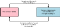
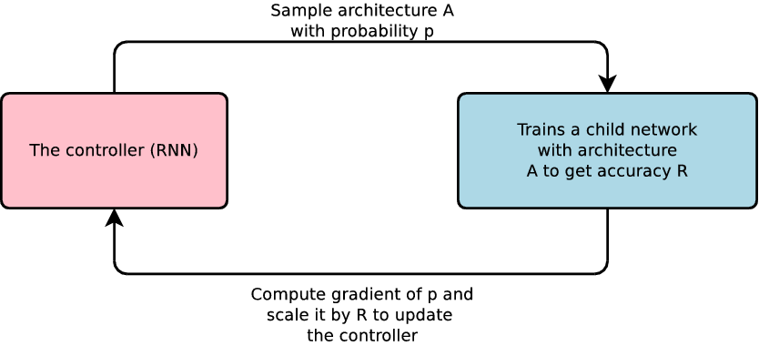
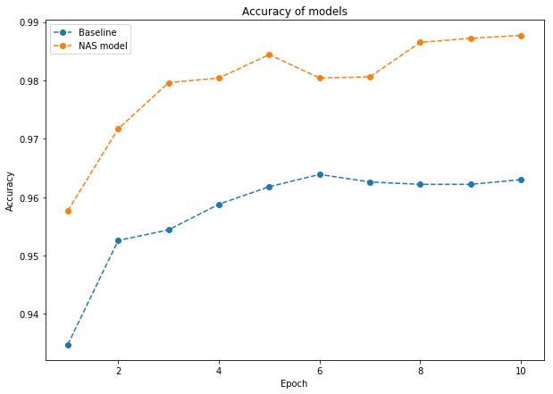

The First Step-by-Step Guide for Implementing Neural Architecture Search with Reinforcement…

# The First Step-by-Step Guide for Implementing Neural Architecture Search with Reinforcement Learning Using TensorFlow

Our team is no stranger to various flavors of AI including deep learning (DL). That’s why we’ve immediately noticed when Google came out with [AutoML](https://research.googleblog.com/2017/05/using-machine-learning-to-explore.html) project, designed to make AI build other AIs.

Neural networks have recently gained popularity and wide practical applications. However, to get good results with neural networks, it is critical to pick the right network topology, which has always been a difficult manual task.

Google’s recent project promises to help solve this task automatically with a meta-AI which will design the topology for neural networks. Google, however, did not offer documentation or examples of how to use this new wonderful technology. We liked the idea and, among the first, came up with a practical implementation that other people can follow, using it as an example. This is similar in concept to AlphaGo, for instance.

Google’s approach is based on the AI concept called [Reinforcement Learning](https://arxiv.org/abs/1611.01578), meaning that the parent AI reviews the efficiency of the child AI and makes adjustments to the neural networks, such as adjusting the number of layers, weights, regularization methods, etc. to improve efficiency.

Image from [google blog](https://research.googleblog.com/2017/05/using-machine-learning-to-explore.html)

The advantage of automation is the ability to eliminate guesswork from the manual neural network model design as well as significantly reducing the time required for each problem, since designing the neural network model is the most labor-intensive part of the task.

Although Google has recently [open sourced](https://github.com/tensorflow/models/tree/master/research/slim/nets/nasnet) an example of NASnet, how they found the architecture of NASnet is still unclear to most folks.

In addition, in our opinion, the name itself adds to the confusion with these technologies.

In this post, we will take a detailed look (with a step by step explanation) at implementing a simple model for neural architecture search with AutoML and reinforcement learning.

Note: To understand this post, you will need to have sufficient background understanding of the convolutional neural networks, recurrent neural networks and reinforcement learning.

Links below will provide you with good background information:

Neural Architecture Search (NAS) with Reinforcement Learning is a method for finding good neural networks architecture. For this post, we will try to find optimal architecture for Convolutional Neural Network (CNN) which recognizes handwritten digits.

For this implementation we use TensorFlow 1.4, but if you want to try this at home, you can use any version after 1.1, since NASCell first became available in TensorFlow 1.1. It is important not to confuse AutoML and NAS.

[**The full code is available on Github**](https://github.com/wallarm/nascell-automl).

### Data and preprocessing.

To train the model we will use the [MNIST](https://en.wikipedia.org/wiki/MNIST_database) database of handwritten digits, which has a training set of 55,000 examples and a test set of 10,000 examples.

### The Model.

The network we are building in this exercise consists of a controller and the actual neural network that we are trying to optimize. The Controller is a recurrent network with [NAS cells](https://www.tensorflow.org/api_docs/python/tf/contrib/rnn/NASCell) and special reinforcement learning methods for training and getting rewards. We will define “rewards” as maximizing the accuracy of the desired neural network and train the Controller to improve this outcome. The controller should generate Actions to modify the architecture of CNN. Specifically Actions can modify filters: the dimensionality of the output space, kernel_size (integer, specifying the length of the 1D convolution window), pool_size ( integer, representing the size of the pooling window) and dropout_rate per layer.

### Details of architecture search space

All convolutions employ [Rectified Linear Units (ReLU)](https://en.wikipedia.org/wiki/Rectifier_%28neural_networks%29) nonlinearity. Weights were initialized by the [Xavier initialization](https://prateekvjoshi.com/2016/03/29/understanding-xavier-initialization-in-deep-neural-networks/) algorithm.

### Implementation.

For the Controller, we built a method for policy network based on NASCell. This network takes, as inputs, the current state (in this task, state and action is the same things) and maximum number of searching layers and outputs new Action to update the desired neural network. If, for some reason, NASCell is not available, you can use any RNNCell.

https://gist.github.com/d0znpp/db1caaefd6c9ed5c72e65721fbd859bb

To allow [hyperparameter tuning](https://cloud.google.com/ml-engine/docs/hyperparameter-tuning-overview) we put our code into a Reinforce class.

To instantiate the class we then pass the following arguments:

sess and optimizer — TensorFlow session and optimizer, will be initialized separately.

- policy_network — Method initialized above.
- max_layers — The maximum number of layers
- division_rate — Normal distribution values of each neuron from -1.0 to 1.0.
- reg_param — Parameter for regularization.
- exploration — The probability of generating random action.

Of course, we also must create variables and placeholders, consisting of logits and gradients. To do this, let’s write a method create_variables:

After computing the initial gradients, we launch the [gradient descent](https://en.wikipedia.org/wiki/Gradient_descent) method. Now let’s take a look at how the reinforcement learning is implemented.

First, we can multiply gradient value to the discounted reward.

After defining the variables, we should initialize it in a TensorFlow graph in end of __init__:

Every Action depends on the previous state, but sometimes, for more effective training, we can generate random actions to avoid local minimums.

In each cycle, our network will generate an Action, get rewards and after that, take a training step.

The implementation of the training step includes store_rollout and train_step methods below:

As mentioned above, we need to define rewards for each Action\State.

This is accomplished by generating a new CNN network with new architecture per Action, training it and assessing its accuracy. Since this process generates a lot of CNN networks, let’s write a manager for it:

*Then we formed bathc with hyperparameters for every layer in “action” and we created cnn_drop_rate — list of dropout rates for every layer.*

Here we define convolution neural model with CNN class. It can be any class that is able to generate neural model by some Action.

We created a separate container to avoid confusion in TF graph.
After creating new a CNN model, we can train it and get a reward.

As defined, the reward improves accuracy on all test datasets; for MNIST it is 10000 examples.

Now that we have everything in place, let’s find the best architecture for MNIST. First, we will optimize the architecture for the number of layers. Let’s set the maximum number of layers to 2. Of course, you can set this value to be higher, but every layer needs a lot of computing power.

We couldn’t be sure about what we should feed to our policy network. First, we tried to always feed in the array of 1.0 to our RNN per episode, but it yielded no results. Then we tried feeding every new state per episode and it resulted in a good architecture. We concluded that the first state can be any non-zero array, to expedite finding a suitable architecture we set the first state: [[10.0, 128.0, 1.0, 1.0]*args.max_layers]

We have updated the weights after every episode. Otherwise, our calculations would have been useless. That’s why our “batch size” for reinforce = 1.

After 100 cycles, we get the following architecture:

- input layer : 784 nodes (MNIST images size)
- first convolution layer : 61x24
- first max-pooling layer: 60
- second convolution layer : 57x55
- second max-pooling layer: 59
- output layer : 10 nodes (number of class for MNIST)

### Measuring Results

Now that we’ve trained our “NAS model” on MNIST dataset, we should be able to compare the architecture our AI has created with the other architectures created manually. For comparable results we will use popular [Convolutional Neural Network (CNN) architecture](https://www.tensorflow.org/get_started/mnist/pros) for MNIST [It’s not the state-of-the-art architecture, but it’s good for comparing]:

- input layer : 784 nodes (MNIST images size)
- first convolution layer : 5x32
- first max-pooling layer: 2
- second convolution layer : 5x64
- second max-pooling layer: 2
- output layer : 10 nodes (number of class for MNIST)

All weights were initialized by the Xavier algorithm.

We trained our models on 10 epochs and got of the accuracy of 0.9987 for our “NAS model”, compared to 0.963 for the popular manually defined neural network architecture.

### Conclusion

We have presented a code example of a simple implementation that automates the design of machine learning models and:

- doesn’t require any human time to design
- actually delivered a better performance than a manually designed network

Going forward, we will continue working on careful analysis and testing of these machine-generated architectures to help refine our understanding of them. Naturally, if we search for more parameters using our model, we’ll achieve better results for MNIST, but more importantly, this simple example illustrates how this approach can be applied to the problems that are much more complicated.

 We built this model using some assumptions which are quite difficult to justify if you notice any mistakes, please write in issues on GitHub.

[**The full code of the project is available on Github**](https://github.com/wallarm/nascell-automl)