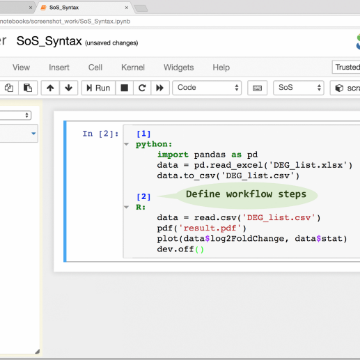

The Future of Notebooks: Lessons from JupyterCon | Will Crichton

The Future of Notebooks: Lessons from JupyterCon | Will Crichton

http://willcrichton.net/notes/lessons-from-jupytercon/

At JupyterCon, I learned three things: reactive notebooks are the future, Jupyter is the new Bash, and data science is a gateway drug.