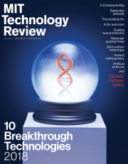
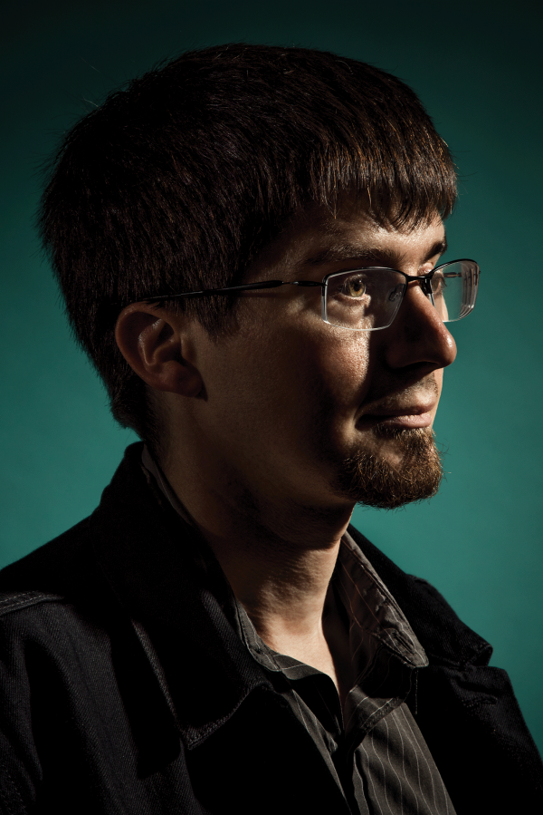
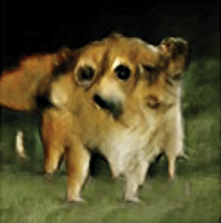
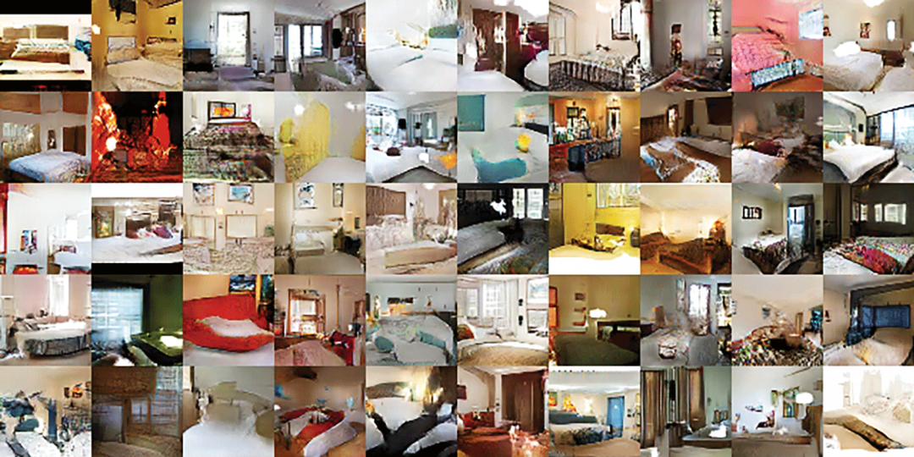

The GANfather: The man who’s given machines the gift of imagination

# The GANfather: The man who’s given machines the gift of imagination

## By pitting neural networks against one another, Ian Goodfellow has created a powerful AI tool. Now he, and the rest of us, must face the consequences.

One night in 2014, Ian Goodfellow went drinking to celebrate with a fellow doctoral student who had just graduated. At Les 3 Brasseurs (The Three Brewers), a favorite Montreal watering hole, some friends asked for his help with a thorny project they were working on: a computer that could create photos by itself.

Researchers were already using neural networks, algorithms loosely modeled on the web of neurons in the human brain, as “generative” models to create plausible new data of their own. But the results were often not very good: images of a computer-generated face tended to be blurry or have errors like missing ears. The plan Goodfellow’s friends were proposing was to use a complex statistical analysis of the elements that make up a photograph to help machines come up with images by themselves. This would have required a massive amount of number-crunching, and Goodfellow told them it simply wasn’t going to work.

But as he pondered the problem over his beer, he hit on an idea. What if you pitted two neural networks against each other? His friends were skeptical, so once he got home, where his girlfriend was already fast asleep, he decided to give it a try. Goodfellow coded into the early hours and then tested his software. It worked the first time.

This story is part of our March/April 2018 Issue
[See the rest of the issue](https://www.technologyreview.com/magazine/2018/03/)
[Subscribe](https://www.technologyreview.com/subscribe/)

What he invented that night is now called a GAN, or “generative adversarial network.” The technique has sparked huge excitement in the field of machine learning and turned its creator into an AI celebrity.

Christie Hemm Klok

In the last few years, AI researchers have made impressive progress using a technique called deep learning. Supply a deep-learning system with enough images and it learns to, say, recognize a pedestrian who’s about to cross a road. This approach has made possible things like self-driving cars and the conversational technology that powers Alexa, Siri, and other virtual assistants.

But while deep-learning AIs can learn to recognize things, they have not been good at creating them. The goal of GANs is to give machines something akin to an imagination.

In the future, computers will get much better at feasting on raw data and working out what they need to learn from it.

Doing so wouldn’t merely enable them to draw pretty pictures or compose music; it would make them less reliant on humans to instruct them about the world and the way it works. Today, AI programmers often need to tell a machine exactly what’s in the training data it’s being fed—which of a million pictures contain a pedestrian crossing a road, and which don’t. This is not only costly and labor-intensive; it limits how well the system deals with even slight departures from what it was trained on. In the future, computers will get much better at feasting on raw data and working out what they need to learn from it without being told.

That will mark a big leap forward in what’s known in AI as “unsupervised learning.” A self-driving car could teach itself about many different road conditions without leaving the garage. A robot could anticipate the obstacles it might encounter in a busy warehouse without needing to be taken around it.

That will mark a big leap forward in what is known in AI as “unsupervised learning.”

Our ability to imagine and reflect on many different scenarios is part of what makes us human. And when future historians of technology look back, they’re likely to see GANs as a big step toward creating machines with a human-like consciousness. Yann LeCun, Facebook’s chief AI scientist, has called GANs “the coolest idea in deep learning in the last 20 years.” Another AI luminary, Andrew Ng, the former chief scientist of China’s Baidu, says GANs represent “a significant and fundamental advance” that’s inspired a growing global community of researchers.

### The GANfather, Part II: AI fight club

Goodfellow is now a research scientist on the Google Brain team, at the company’s headquarters in Mountain View, California. When I met him there recently, he still seemed surprised by his superstar status, calling it “a little surreal.” Perhaps no less surprising is that, having made his discovery, he now spends much of his time working against those who wish to use it for evil ends.

The magic of GANs lies in the rivalry between the two neural nets. It mimics the back-and-forth between a picture forger and an art detective who repeatedly try to outwit one another. Both networks are trained on the same data set. The first one, known as the generator, is charged with producing artificial outputs, such as photos or handwriting, that are as realistic as possible. The second, known as the discriminator, compares these with genuine images from the original data set and tries to determine which are real and which are fake. On the basis of those results, the generator adjusts its parameters for creating new images. And so it goes, until the discriminator can no longer tell what’s genuine and what’s bogus.

A GAN trained on photos of real celebrities came up with its own set of imaginary stars. In most cases, the fakes looked pretty realistic.

Nvidia

In one widely publicized example last year, researchers at Nvidia, a chip company heavily invested in AI, trained a GAN to generate pictures of imaginary celebrities by studying real ones. Not all the fake stars it produced were perfect, but some were impressively realistic. Unlike other machine-learning approaches that require tens of thousands of training images, GANs can become proficient with a few hundred.

This power of imagination is still limited. Once it’s been trained on a lot of dog photos, a GAN can generate a convincing fake image of a dog that has, say, a different pattern of spots; but it can’t conceive of an entirely new animal. The quality of the original training data also has a big influence on the results. In one telling example, a GAN began producing pictures of cats with random letters integrated into the images. Because the training data contained cat memes from the internet, the machine had taught itself that words were part of what it meant to be a cat.

Getting GANS to work well can be tricky. If there are glitches, the results can be bizarre.

Alec Radford

GANs are also temperamental, says Pedro Domingos, a machine-learning researcher at the University of Washington. If the discriminator is too easy to fool, the generator’s output won’t look realistic. And calibrating the two dueling neural nets can be difficult, which explains why GANs sometimes spit out bizarre stuff such as animals with two heads.

Still, the challenges haven’t deterred researchers. Since Goodfellow and a few others published the first study on his discovery, in 2014, hundreds of GAN-related papers have been written. One fan of the technology has even created a web page called the “GAN zoo,” dedicated to keeping track of the various versions of the technique that have been developed.

The most obvious immediate applications are in areas that involve a lot of imagery, such as video games and fashion: what, for instance, might a game character look like running through the rain? But looking ahead, Goodfellow thinks GANs will drive more significant advances. “There are a lot of areas of science and engineering where we need to optimize something,” he says, citing examples such as medicines that need to be more effective or batteries that must get more efficient. “That’s going to be the next big wave.”

In high-energy physics, scientists use powerful computers to simulate the likely interactions of hundreds of subatomic particles in machines like the Large Hadron Collider at CERN in Switzerland. These simulations are slow and require massive computing power. Researchers at Yale University and Lawrence Berkeley National Laboratory have developed a GAN that, after training on existing simulation data, learns to generate pretty accurate predictions of how a particular particle will behave, and does it much faster.

Goodfellow's creation can be used to imagine all sorts of things, including new interior designs.

Ian Goodfellow

Medical research is another promising field. Privacy concerns mean researchers sometimes can’t get enough real patient data to, say, analyze why a drug didn’t work. GANs can help solve this problem by generating fake records that are almost as good as the real thing, says Casey Greene of the University of Pennsylvania. This data could be shared more widely, helping to advance research, while the real records are tightly protected.

### The GANfather, Part III: Bad fellows

There is a darker side, however. A machine designed to create realistic fakes is a perfect weapon for purveyors of fake news who want to influence everything from stock prices to elections. AI tools are already being used to put pictures of other people’s faces on the bodies of porn stars and put words in the mouths of politicians. GANs didn’t create this problem, but they’ll make it worse.

Hany Farid, who studies digital forensics at Dartmouth College, is working on better ways to spot fake videos, such as detecting slight changes in the color of faces caused by inhaling and exhaling that GANs find hard to mimic precisely. But he warns that GANs will adapt in turn. “We’re fundamentally in a weak position,” says Farid.

This cat-and-mouse game will play out in cybersecurity, too. Researchers are already highlighting the risk of “black box” attacks, in which GANs are used to figure out the machine-learning models with which plenty of security programs spot malware. Having divined how a defender’s algorithm works, an attacker can evade it and insert rogue code. The same approach could also be used to dodge spam filters and other defenses.

“There are a lot of areas of science and engineering where we need to optimize something. That’s going to be the next big wave.”

Goodfellow is well aware of the dangers. Now heading a team at Google that’s focused on making machine learning more secure, he warns that the AI community must learn the lesson of previous waves of innovation, in which technologists treated security and privacy as an afterthought. By the time they woke up to the risks, the bad guys had a significant lead. “Clearly, we’re already beyond the start,” he says, “but hopefully we can make significant advances in security before we’re too far in.”

Nonetheless, he doesn’t think there will be a purely technological solution to fakery. Instead, he believes, we’ll have to rely on societal ones, such as teaching kids critical thinking by getting them to take things like speech and debating classes. “In speech and debate you’re competing against another student,” he says, “and you’re thinking about how to craft misleading claims, or how to craft correct claims that are very persuasive.” He may well be right, but his conclusion that technology can’t cure the fake-news problem is not one many will want to hear.

Don’t miss your chance to meet Ian Goodfellow and the sharpest minds at EmTech Digital.

[Learn more and register](https://events.technologyreview.com/emtech/digital/18/?utm_medium=trsite&utm_source=instory&utm_campaign=emtch_dig_18&utm_term=conference&utm_content=meet_speakers&discount=MEET#section-register)