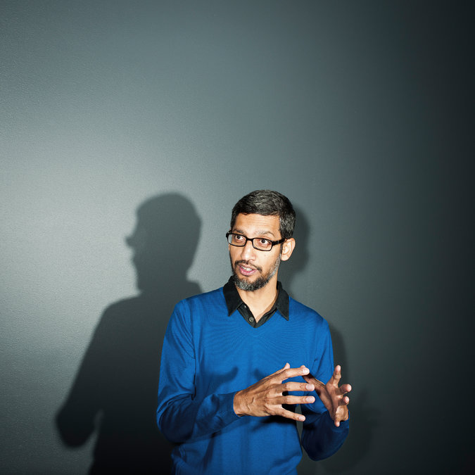
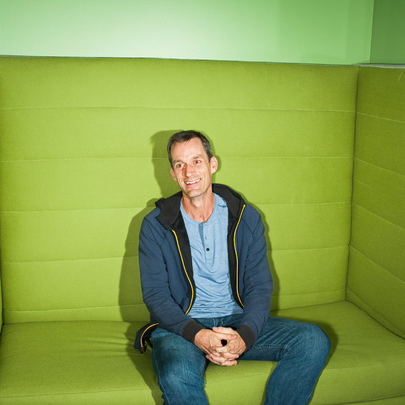
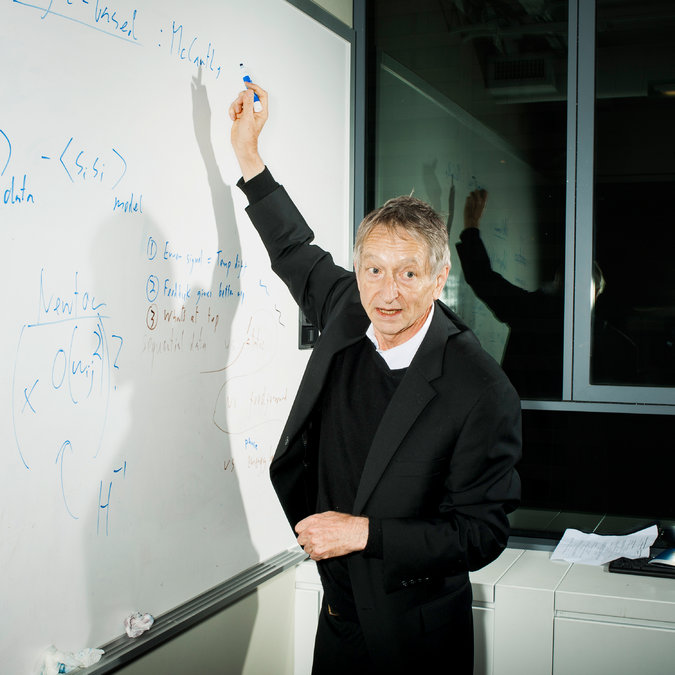
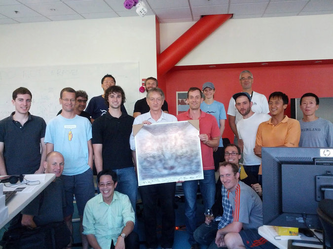
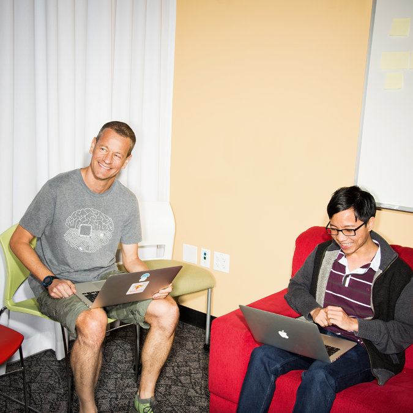

The Great A.I. Awakening

**Four days later,** a couple of hundred journalists, entrepreneurs and advertisers from all over the world gathered in Google’s London engineering office for a special announcement. Guests were greeted with Translate-branded fortune cookies. Their paper slips had a foreign phrase on one side — mine was in Norwegian — and on the other, an invitation to download the Translate app. Tables were set with trays of doughnuts and smoothies, each labeled with a placard that advertised its flavor in German (*zitrone*), Portuguese (*baunilha*) or Spanish (*manzana*). After a while, everyone was ushered into a plush, dark theater.

 Photo
 
**

 Sundar Pichai, chief executive of Google, outside his office in Mountain View, Calif.    Credit Brian Finke for The New York Times

Sadiq Khan, the mayor of London, stood to make a few opening remarks. A friend, he began, had recently told him he reminded him of Google. “Why, because I know all the answers?” the mayor asked. “No,” the friend replied, “because you’re always trying to finish my sentences.” The crowd tittered politely. Khan concluded by introducing Google’s chief executive, Sundar Pichai, who took the stage.

Pichai was in London in part to inaugurate Google’s new building there, the cornerstone of a new “knowledge quarter” under construction at King’s Cross, and in part to unveil the completion of the initial phase of a company transformation he announced last year. The Google of the future, Pichai had said on several occasions, was going to be “A.I. first.” What that meant in theory was complicated and had welcomed much speculation. What it meant in practice, with any luck, was that soon the company’s products would no longer represent the fruits of traditional computer programming, exactly, but “machine learning.”

A rarefied department within the company, Google Brain, was founded five years ago on this very principle: that artificial “neural networks” that acquaint themselves with the world via trial and error, as toddlers do, might in turn develop something like human flexibility. This notion is not new — a version of it dates to the earliest stages of modern computing, in the 1940s — but for much of its history most computer scientists saw it as vaguely disreputable, even mystical. Since 2011, though, Google Brain has demonstrated that this approach to artificial intelligence could solve many problems that confounded decades of conventional efforts. Speech recognition didn’t work very well until Brain undertook an effort to revamp it; the application of machine learning made its performance on Google’s mobile platform, Android, almost as good as human transcription. The same was true of image recognition. Less than a year ago, Brain for the first time commenced with the gut renovation of an entire consumer product, and its momentous results were being celebrated tonight.

Translate made its debut in 2006 and since then has become one of Google’s most reliable and popular assets; it serves more than 500 million monthly users in need of 140 billion words per day in a different language. It exists not only as its own stand-alone app but also as an integrated feature within Gmail, Chrome and many other Google offerings, where we take it as a push-button given — a frictionless, natural part of our digital commerce. It was only with the refugee crisis, Pichai explained from the lectern, that the company came to reckon with Translate’s geopolitical importance: On the screen behind him appeared a graph whose steep curve indicated a recent fivefold increase in translations between Arabic and German. (It was also close to Pichai’s own heart. He grew up in India, a land divided by dozens of languages.) The team had been steadily adding new languages and features, but gains in quality over the last four years had slowed considerably.

Until today. As of the previous weekend, Translate had been converted to an A.I.-based system for much of its traffic, not just in the United States but in Europe and Asia as well: The rollout included translations between English and Spanish, French, Portuguese, German, Chinese, Japanese, Korean and Turkish. The rest of Translate’s hundred-odd languages were to come, with the aim of eight per month, by the end of next year. The new incarnation, to the pleasant surprise of Google’s own engineers, had been completed in only nine months. The A.I. system had demonstrated overnight improvements roughly equal to the total gains the old one had accrued over its entire lifetime.

Pichai has an affection for the obscure literary reference; he told me a month earlier, in his office in Mountain View, Calif., that Translate in part exists because not everyone can be like the physicist Robert Oppenheimer, who learned Sanskrit to read the Bhagavad Gita in the original. In London, the slide on the monitors behind him flicked to a Borges quote: “*Uno no es lo que es por lo que escribe, sino por lo que ha leído*.”

Grinning, Pichai read aloud an awkward English version of the sentence that had been rendered by the old Translate system: “One is not what is for what he writes, but for what he has read.”

To the right of that was a new A.I.-rendered version: “You are not what you write, but what you have read.”

It was a fitting remark: The new Google Translate was run on the first machines that had, in a sense, ever learned to read anything at all.

**Google’s decision** to reorganize itself around A.I. was the first major manifestation of what has become an industrywide machine-learning delirium. Over the past four years, six companies in particular — Google, Facebook, Apple, Amazon, Microsoft and the Chinese firm Baidu — have touched off an arms race for A.I. talent, particularly within universities. Corporate promises of resources and freedom have thinned out top academic departments. It has become widely known in Silicon Valley that Mark Zuckerberg, chief executive of Facebook, personally oversees, with phone calls and video-chat blandishments, his company’s overtures to the most desirable graduate students. Starting salaries of seven figures are not unheard-of. Attendance at the field’s most important academic conference has nearly quadrupled. What is at stake is not just one more piecemeal innovation but control over what very well could represent an entirely new computational platform: pervasive, ambient artificial intelligence.

What is at stake is not just one more piecemeal innovation but control over what very well could represent an entirely new computational platform.

The phrase “artificial intelligence” is invoked as if its meaning were self-evident, but it has always been a source of confusion and controversy. Imagine if you went back to the 1970s, stopped someone on the street, pulled out a smartphone and showed her Google Maps. Once you managed to convince her you weren’t some oddly dressed wizard, and that what you withdrew from your pocket wasn’t a black-arts amulet but merely a tiny computer more powerful than the one that guided Apollo missions, Google Maps would almost certainly seem to her a persuasive example of “artificial intelligence.” In a very real sense, it is. It can do things any map-literate human can manage, like get you from your hotel to the airport — though it can do so much more quickly and reliably. It can also do things that humans simply and obviously cannot: It can evaluate the traffic, plan the best route and reorient itself when you take the wrong exit.

Practically nobody today, however, would bestow upon Google Maps the honorific “A.I.,” so sentimental and sparing are we in our use of the word “intelligence.” Artificial intelligence, we believe, must be something that distinguishes HAL from whatever it is a loom or wheelbarrow can do. The minute we can automate a task, we downgrade the relevant skill involved to one of mere mechanism. Today Google Maps seems, in the pejorative sense of the term, robotic: It simply accepts an explicit demand (the need to get from one place to another) and tries to satisfy that demand as efficiently as possible. The goal posts for “artificial intelligence” are thus constantly receding.

When he has an opportunity to make careful distinctions, Pichai differentiates between the current applications of A.I. and the ultimate goal of “artificial *general* intelligence.” Artificial general intelligence will not involve dutiful adherence to explicit instructions, but instead will demonstrate a facility with the implicit, the interpretive. It will be a general tool, designed for general purposes in a general context. Pichai believes his company’s future depends on something like this. Imagine if you could tell Google Maps, “I’d like to go to the airport, but I need to stop off on the way to buy a present for my nephew.” A more generally intelligent version of that service — a ubiquitous assistant, of the sort that Scarlett Johansson memorably disembodied three years ago in the Spike Jonze film “Her”— would know all sorts of things that, say, a close friend or an earnest intern might know: your nephew’s age, and how much you ordinarily like to spend on gifts for children, and where to find an open store. But a truly intelligent Maps could also conceivably know all sorts of things a close friend wouldn’t, like what has only recently come into fashion among preschoolers in your nephew’s school — or more important, what its users actually want. If an intelligent machine were able to discern some intricate if murky regularity in data about what we have done in the past, it might be able to extrapolate about our subsequent desires, even if we don’t entirely know them ourselves.

The new wave of A.I.-enhanced assistants — Apple’s Siri, Facebook’s M, Amazon’s Echo — are all creatures of machine learning, built with similar intentions. The corporate dreams for machine learning, however, aren’t exhausted by the goal of consumer clairvoyance. A medical-imaging subsidiary of Samsung announced this year that its new ultrasound devices could detect breast cancer. Management consultants are falling all over themselves to prep executives for the widening industrial applications of computers that program themselves. DeepMind, a 2014 Google acquisition, defeated the reigning human grandmaster of the ancient board game Go, despite predictions that such an achievement would take another 10 years.

In a famous [1950 essay](https://www.csee.umbc.edu/courses/471/papers/turing.pdf), Alan Turing proposed a test for an artificial general intelligence: a computer that could, over the course of five minutes of text exchange, successfully deceive a real human interlocutor. Once a machine can translate fluently between two natural languages, the foundation has been laid for a machine that might one day “understand” human language well enough to engage in plausible conversation. Google Brain’s members, who pushed and helped oversee the Translate project, believe that such a machine would be on its way to serving as a generally intelligent all-encompassing personal digital assistant.

**What follows here **is the story of how a team of Google researchers and engineers — at first one or two, then three or four, and finally more than a hundred — made considerable progress in that direction. It’s an uncommon story in many ways, not least of all because it defies many of the Silicon Valley stereotypes we’ve grown accustomed to. It does not feature people who think that everything will be unrecognizably different tomorrow or the next day because of some restless tinkerer in his garage. It is neither a story about people who think technology will solve all our problems nor one about people who think technology is ineluctably bound to create apocalyptic new ones. It is not about disruption, at least not in the way that word tends to be used.

It is, in fact, three overlapping stories that converge in Google Translate’s successful metamorphosis to A.I. — a technical story, an institutional story and a story about the evolution of ideas. The technical story is about one team on one product at one company, and the process by which they refined, tested and introduced a brand-new version of an old product in only about a quarter of the time anyone, themselves included, might reasonably have expected. The institutional story is about the employees of a small but influential artificial-intelligence group within that company, and the process by which their intuitive faith in some old, unproven and broadly unpalatable notions about computing upended every other company within a large radius. The story of ideas is about the cognitive scientists, psychologists and wayward engineers who long toiled in obscurity, and the process by which their ostensibly irrational convictions ultimately inspired a paradigm shift in our understanding not only of technology but also, in theory, of consciousness itself.

It’s an uncommon story in many ways, not least of all because it defies many of the Silicon Valley stereotypes we’ve grown accustomed to.

The first story, the story of Google Translate, takes place in Mountain View over nine months, and it explains the transformation of machine translation. The second story, the story of Google Brain and its many competitors, takes place in Silicon Valley over five years, and it explains the transformation of that entire community. The third story, the story of deep learning, takes place in a variety of far-flung laboratories — in Scotland, Switzerland, Japan and most of all Canada — over seven decades, and it might very well contribute to the revision of our self-image as first and foremost beings who think.

All three are stories about artificial intelligence. The seven-decade story is about what we might conceivably expect or want from it. The five-year story is about what it might do in the near future. The nine-month story is about what it can do right this minute. These three stories are themselves just proof of concept. All of this is only the beginning.

#### Part I: Learning Machine

#### 1. The Birth of Brain

Jeff Dean, though his title is senior fellow, is the de facto head of Google Brain. Dean is a sinewy, energy-efficient man with a long, narrow face, deep-set eyes and an earnest, soapbox-derby sort of enthusiasm. The son of a medical anthropologist and a public-health epidemiologist, Dean grew up all over the world — Minnesota, Hawaii, Boston, Arkansas, Geneva, Uganda, Somalia, Atlanta — and, while in high school and college, wrote software used by the World Health Organization. He has been with Google since 1999, as employee 25ish, and has had a hand in the core software systems beneath nearly every significant undertaking since then. A beloved artifact of company culture is [Jeff Dean Facts](https://www.quora.com/What-are-all-the-Jeff-Dean-facts), written in the style of the Chuck Norris Facts meme: “Jeff Dean’s PIN is the last four digits of pi.” “When Alexander Graham Bell invented the telephone, he saw a missed call from Jeff Dean.” “Jeff Dean got promoted to Level 11 in a system where the maximum level is 10.” (This last one is, in fact, true.)

 Photo
 
**

 The Google engineer and Google Brain leader Jeff Dean.    Credit Brian Finke for The New York Times

One day in early 2011, Dean walked into one of the Google campus’s “microkitchens” — the “Googley” word for the shared break spaces on most floors of the Mountain View complex’s buildings — and ran into Andrew Ng, a young Stanford computer-science professor who was working for the company as a consultant. Ng told him about Project Marvin, an internal effort (named after the celebrated A.I. pioneer Marvin Minsky) he had recently helped establish to experiment with “neural networks,” pliant digital lattices based loosely on the architecture of the brain. Dean himself had worked on a primitive version of the technology as an undergraduate at the University of Minnesota in 1990, during one of the method’s brief windows of mainstream acceptability. Now, over the previous five years, the number of academics working on neural networks had begun to grow again, from a handful to a few dozen. Ng told Dean that Project Marvin, which was being underwritten by Google’s secretive X lab, had already achieved some promising results.

Dean was intrigued enough to lend his “20 percent” — the portion of work hours every Google employee is expected to contribute to programs outside his or her core job — to the project. Pretty soon, he suggested to Ng that they bring in another colleague with a neuroscience background, Greg Corrado. (In graduate school, Corrado was taught briefly about the technology, but strictly as a historical curiosity. “It was good I was paying attention in class that day,” he joked to me.) In late spring they brought in one of Ng’s best graduate students, Quoc Le, as the project’s first intern. By then, a number of the Google engineers had taken to referring to Project Marvin by another name: Google Brain.

Since the term “artificial intelligence” was first coined, at a kind of constitutional convention of the mind at Dartmouth in the summer of 1956, a majority of researchers have long thought the best approach to creating A.I. would be to write a very big, comprehensive program that laid out both the rules of logical reasoning and sufficient knowledge of the world. If you wanted to translate from English to Japanese, for example, you would program into the computer all of the grammatical rules of English, and *then* the entirety of definitions contained in the Oxford English Dictionary, and *then* all of the grammatical rules of Japanese, as well as all of the words in the Japanese dictionary, and *only after all of that *feed it a sentence in a source language and ask it to tabulate a corresponding sentence in the target language. You would give the machine a language map that was, as Borges would have had it, the size of the territory. This perspective is usually called “symbolic A.I.” — because its definition of cognition is based on symbolic logic — or, disparagingly, “good old-fashioned A.I.”

There are two main problems with the old-fashioned approach. The first is that it’s awfully time-consuming on the human end. The second is that it only really works in domains where rules and definitions are very clear: in mathematics, for example, or chess. Translation, however, is an example of a field where this approach fails horribly, because words cannot be reduced to their dictionary definitions, and because languages tend to have as many exceptions as they have rules. More often than not, a system like this is liable to translate “minister of agriculture” as “priest of farming.” Still, for math and chess it worked great, and the proponents of symbolic A.I. took it for granted that no activities signaled “general intelligence” better than math and chess.

[The Thinking Machine (Artificial Intelligence in the 1960s)](https://www.youtube.com/watch?v=aygSMgK3BEM)

An excerpt of a 1961 documentary emphasizing the longstanding premise of artificial-intelligence research: If you could program a computer to mimic higher-order cognitive tasks like math or chess, you were on a path that would eventually lead to something akin to consciousness.  Video posted on YouTube by Roberto Pieraccini

There were, however, limits to what this system could do. In the 1980s, a robotics researcher at Carnegie Mellon pointed out that it was easy to get computers to do adult things but nearly impossible to get them to do things a 1-year-old could do, like hold a ball or identify a cat. By the 1990s, despite punishing advancements in computer chess, we still weren’t remotely close to artificial general intelligence.

There has always been another vision for A.I. — a dissenting view — in which the computers would learn from the ground up (from data) rather than from the top down (from rules). This notion dates to the early 1940s, when it occurred to researchers that the best model for flexible automated intelligence was the brain itself. A brain, after all, is just a bunch of widgets, called neurons, that either pass along an electrical charge to their neighbors or don’t. What’s important are less the individual neurons themselves than the manifold connections among them. This structure, in its simplicity, has afforded the brain a wealth of adaptive advantages. The brain can operate in circumstances in which information is poor or missing; it can withstand significant damage without total loss of control; it can store a huge amount of knowledge in a very efficient way; it can isolate distinct patterns but retain the messiness necessary to handle ambiguity.

There was no reason you couldn’t try to mimic this structure in electronic form, and in 1943 [it was shown](http://www.cse.chalmers.se/~coquand/AUTOMATA/mcp.pdf) that arrangements of simple *artificial* neurons could carry out basic logical functions. They could also, at least in theory, learn the way we do. With life experience, depending on a particular person’s trials and errors, the synaptic connections among pairs of neurons get stronger or weaker. An artificial neural network could do something similar, by gradually altering, on a guided trial-and-error basis, the numerical relationships among artificial neurons. It wouldn’t need to be preprogrammed with fixed rules. It would, instead, rewire itself to reflect patterns in the data it absorbed.

This attitude toward artificial intelligence was evolutionary rather than creationist. If you wanted a flexible mechanism, you wanted one that could adapt to its environment. If you wanted something that could adapt, you didn’t want to begin with the indoctrination of the rules of chess. You wanted to begin with very basic abilities — sensory perception and motor control — in the hope that advanced skills would emerge organically. Humans don’t learn to understand language by memorizing dictionaries and grammar books, so why should we possibly expect our computers to do so?

Google Brain was the first major commercial institution to invest in the possibilities embodied by this way of thinking about A.I. Dean, Corrado and Ng began their work as a part-time, collaborative experiment, but they made immediate progress. They took architectural inspiration for their models from recent theoretical outlines — as well as ideas that had been on the shelf since the 1980s and 1990s — and drew upon both the company’s peerless reserves of data and its massive computing infrastructure. They instructed the networks on enormous banks of “labeled” data — speech files with correct transcriptions, for example — and the computers improved their responses to better match reality.

“The portion of evolution in which animals developed eyes was a big development,” Dean told me one day, with customary understatement. We were sitting, as usual, in a whiteboarded meeting room, on which he had drawn a crowded, snaking timeline of Google Brain and its relation to inflection points in the recent history of neural networks. “Now computers have eyes. We can build them around the capabilities that now exist to understand photos. Robots will be drastically transformed. They’ll be able to operate in an unknown environment, on much different problems.” These capacities they were building may have seemed primitive, but their implications were profound.

 Photo
 
**

 Geoffrey Hinton, whose ideas helped lay the foundation for the neural-network approach to Google Translate, at Google’s offices in Toronto.    Credit Brian Finke for The New York Times

#### 2. The Unlikely Intern

In its first year or so of existence, Brain’s experiments in the development of a machine with the talents of a 1-year-old had, as Dean said, worked to great effect. Its speech-recognition team swapped out part of their old system for a neural network and encountered, in pretty much one fell swoop, the best quality improvements anyone had seen in 20 years. Their system’s object-recognition abilities improved by an order of magnitude. This was not because Brain’s personnel had generated a sheaf of outrageous new ideas in just a year. It was because Google had finally devoted the resources — in computers and, increasingly, personnel — to fill in outlines that had been around for a long time.

A great preponderance of these extant and neglected notions had been proposed or refined by a peripatetic English polymath named Geoffrey Hinton. In the second year of Brain’s existence, Hinton was recruited to Brain as Andrew Ng left. (Ng now leads the 1,300-person A.I. team at Baidu.) Hinton wanted to leave his post at the University of Toronto for only three months, so for arcane contractual reasons he had to be hired as an intern. At intern training, the orientation leader would say something like, “Type in your LDAP” — a user login — and he would flag a helper to ask, “What’s an LDAP?” All the smart 25-year-olds in attendance, who had only ever known deep learning as the sine qua non of artificial intelligence, snickered: “Who is that old guy? Why doesn’t he get it?”

“At lunchtime,” Hinton said, “someone in the queue yelled: ‘Professor Hinton! I took your course! What are you doing here?’ After that, it was all right.”

A few months later, Hinton and two of his students [demonstrated](https://papers.nips.cc/paper/4824-imagenet-classification-with-deep-convolutional-neural-networks.pdf) truly astonishing gains in a big image-recognition contest, run by an open-source collective called ImageNet, that asks computers not only to identify a monkey but also to distinguish between spider monkeys and howler monkeys, and among God knows how many different breeds of cat. Google soon approached Hinton and his students with an offer. They accepted. “I thought they were interested in our I.P.,” he said. “Turns out they were interested in us.”

Hinton comes from one of those old British families emblazoned like the Darwins at eccentric angles across the intellectual landscape, where regardless of titular preoccupation a person is expected to make sideline contributions to minor problems in astronomy or fluid dynamics. His great-great-grandfather was George Boole, whose foundational work in symbolic logic underpins the computer; another great-great-grandfather was a celebrated surgeon, his father a venturesome entomologist, his father’s cousin a Los Alamos researcher; the list goes on. He trained at Cambridge and Edinburgh, then taught at Carnegie Mellon before he ended up at Toronto, where he still spends half his time. (His work has long been supported by the largess of the Canadian government.) I visited him in his office at Google there. He has tousled yellowed-pewter hair combed forward in a mature Noel Gallagher style and wore a baggy striped dress shirt that persisted in coming untucked, and oval eyeglasses that slid down to the tip of a prominent nose. He speaks with a driving if shambolic wit, and says things like, “Computers will understand sarcasm before Americans do.”

Hinton had been working on neural networks since his undergraduate days at Cambridge in the late 1960s, and he is seen as the intellectual primogenitor of the contemporary field. For most of that time, whenever he spoke about machine learning, people looked at him as though he were talking about the Ptolemaic spheres or bloodletting by leeches. Neural networks were taken as a disproven folly, largely on the basis of one overhyped project: the Perceptron, an artificial neural network that Frank Rosenblatt, a Cornell psychologist, developed in the late 1950s. The New York Times reported that the machine’s sponsor, the United States Navy, expected it would “be able to walk, talk, see, write, reproduce itself and be conscious of its existence.” It went on to do approximately none of those things. Marvin Minsky, the dean of artificial intelligence in America, had worked on neural networks for his 1954 Princeton thesis, but he’d since grown tired of the inflated claims that Rosenblatt — who was a contemporary at Bronx Science — made for the neural paradigm. (He was also competing for Defense Department funding.) Along with an M.I.T. colleague, Minsky published a book that proved that there were painfully simple problems the Perceptron could never solve.

Minsky’s criticism of the Perceptron extended only to networks of one “layer,” i.e., one layer of artificial neurons between what’s fed to the machine and what you expect from it — and later in life, he expounded ideas very similar to contemporary deep learning. But Hinton already knew at the time that complex tasks could be carried out if you had recourse to multiple layers. The simplest description of a neural network is that it’s a machine that makes classifications or predictions based on its ability to discover patterns in data. With one layer, you could find only simple patterns; with more than one, you could look for patterns of patterns. Take the case of image recognition, which tends to rely on a contraption called a “convolutional neural net.” (These were elaborated in a [seminal 1998 paper](http://yann.lecun.com/exdb/publis/pdf/lecun-01a.pdf) whose lead author, a Frenchman named Yann LeCun, did his postdoctoral research in Toronto under Hinton and now directs a huge A.I. endeavor at Facebook.) The first layer of the network learns to identify the very basic visual trope of an “edge,” meaning a *nothing* (an off-pixel) followed by a *something* (an on-pixel) or vice versa. Each successive layer of the network looks for a pattern in the previous layer. A pattern of edges might be a circle or a rectangle. A pattern of circles or rectangles might be a face. And so on. This more or less parallels the way information is put together in increasingly abstract ways as it travels from the photoreceptors in the retina back and up through the visual cortex. At each conceptual step, detail that isn’t immediately relevant is thrown away. If several edges and circles come together to make a face, you don’t care exactly where the face is found in the visual field; you just care that it’s a face.

[Convolutional Network Demo from 1993](https://www.youtube.com/watch?v=FwFduRA_L6Q)

A demonstration from 1993 showing an early version of the researcher Yann LeCun's convolutional neural network, which by the late 1990s was processing 10 to 20 percent of all checks in the United States. A similar technology now drives most state-of-the-art image-recognition systems.  Video posted on YouTube by Yann LeCun

The issue with multilayered, “deep” neural networks was that the trial-and-error part got extraordinarily complicated. In a single layer, it’s easy. Imagine that you’re playing with a child. You tell the child, “Pick up the green ball and put it into Box A.” The child picks up a green ball and puts it into Box B. You say, “Try again to put the green ball in Box A.” The child tries Box A. Bravo.

Now imagine you tell the child, “Pick up a green ball, go through the door marked 3 and put the green ball into Box A.” The child takes a red ball, goes through the door marked 2 and puts the red ball into Box B. How do you begin to correct the child? You cannot just repeat your initial instructions, because the child does not know at which point he went wrong. In real life, you might start by holding up the red ball and the green ball and saying, “Red ball, green ball.” The whole point of machine learning, however, is to avoid that kind of explicit mentoring. Hinton and a few others went on to [invent a solution](https://www.iro.umontreal.ca/~vincentp/ift3395/lectures/backprop_old.pdf) (or rather, reinvent [an older one](http://www.wiley.com/WileyCDA/WileyTitle/productCd-0471598976.html)) to this layered-error problem, over the halting course of the late 1970s and 1980s, and interest among computer scientists in neural networks was briefly revived. “People got very excited about it,” he said. “But we oversold it.” Computer scientists quickly went back to thinking that people like Hinton were weirdos and mystics.

These ideas remained popular, however, among philosophers and psychologists, who called it “connectionism” or “parallel distributed processing.” “This idea,” Hinton told me, “of a few people keeping a torch burning, it’s a nice myth. It was true within artificial intelligence. But within psychology lots of people believed in the approach but just couldn’t do it.” Neither could Hinton, despite the generosity of the Canadian government. “There just wasn’t enough computer power or enough data. People on our side kept saying, ‘Yeah, but if I had a really big one, it would work.’ It wasn’t a very persuasive argument.”

‘The portion of evolution in which animals developed eyes was a big development. Now computers have eyes.’

#### 3. A Deep Explanation of Deep Learning

When Pichai said that Google would henceforth be “A.I. first,” he was not just making a claim about his company’s business strategy; he was throwing in his company’s lot with this long-unworkable idea. Pichai’s allocation of resources ensured that people like Dean could ensure that people like Hinton would have, at long last, enough computers and enough data to make a persuasive argument. An average brain has something on the order of 100 billion neurons. Each neuron is connected to up to 10,000 other neurons, which means that the number of synapses is between 100 trillion and 1,000 trillion. For a simple artificial neural network of the sort proposed in the 1940s, the attempt to even try to replicate this was unimaginable. We’re still far from the construction of a network of that size, but Google Brain’s investment allowed for the creation of artificial neural networks comparable to the brains of mice.

To understand why scale is so important, however, you have to start to understand some of the more technical details of what, exactly, machine intelligences are doing with the data they consume. A lot of our ambient fears about A.I. rest on the idea that they’re just vacuuming up knowledge like a sociopathic prodigy in a library, and that an artificial intelligence constructed to make paper clips might someday decide to treat humans like ants or lettuce. This just isn’t how they work. All they’re doing is shuffling information around in search of commonalities — basic patterns, at first, and then more complex ones — and for the moment, at least, the greatest danger is that the information we’re feeding them is biased in the first place.

If that brief explanation seems sufficiently reassuring, the reassured nontechnical reader is invited to skip forward to the next section, which is about cats. If not, then read on. (This section is also, luckily, about cats.)

Imagine you want to program a cat-recognizer on the old symbolic-A.I. model. You stay up for days preloading the machine with an exhaustive, explicit definition of “cat.” You tell it that a cat has four legs and pointy ears and whiskers and a tail, and so on. All this information is stored in a special place in memory called Cat. Now you show it a picture. First, the machine has to separate out the various distinct elements of the image. Then it has to take these elements and apply the rules stored in its memory. If(legs=4) and if(ears=pointy) and if(whiskers=yes) and if(tail=yes) and if(expression=supercilious), then(cat=yes). But what if you showed this cat-recognizer a Scottish Fold, a heart-rending breed with a prized genetic defect that leads to droopy doubled-over ears? Our symbolic A.I. gets to (ears=pointy) and shakes its head solemnly, “Not cat.” It is hyperliteral, or “brittle.” Even the thickest toddler shows much greater inferential acuity.

Now imagine that instead of hard-wiring the machine with a set of rules for classification stored in one location of the computer’s memory, you try the same thing on a neural network. There is no special place that can hold the definition of “cat.” There is just a giant blob of interconnected switches, like forks in a path. On one side of the blob, you present the inputs (the pictures); on the other side, you present the corresponding outputs (the labels). Then you just tell it to work out *for itself,* via the individual calibration of all of these interconnected switches, whatever path the data should take so that the inputs are mapped to the correct outputs. The training is the process by which a labyrinthine series of elaborate tunnels are excavated through the blob, tunnels that connect any given input to its proper output. The more training data you have, the greater the number and intricacy of the tunnels that can be dug. Once the training is complete, the middle of the blob has enough tunnels that it can make reliable predictions about how to handle data it has never seen before. This is called “supervised learning.”

The reason that the network requires so many neurons and so much data is that it functions, in a way, like a sort of giant machine democracy. Imagine you want to train a computer to differentiate among five different items. Your network is made up of millions and millions of neuronal “voters,” each of whom has been given five different cards: one for cat, one for dog, one for spider monkey, one for spoon and one for defibrillator. You show your electorate a photo and ask, “Is this a cat, a dog, a spider monkey, a spoon or a defibrillator?” All the neurons that voted the same way collect in groups, and the network foreman peers down from above and identifies the majority classification: “A dog?”

You say: “No, maestro, it’s a cat. Try again.”

Now the network foreman goes back to identify which voters threw their weight behind “cat” and which didn’t. The ones that got “cat” right get their votes counted double next time — at least when they’re voting for “cat.” They have to prove independently whether they’re also good at picking out dogs and defibrillators, but one thing that makes a neural network so flexible is that each individual unit can contribute differently to different desired outcomes. What’s important is not the individual vote, exactly, but the pattern of votes. If Joe, Frank and Mary all vote together, it’s a dog; but if Joe, Kate and Jessica vote together, it’s a cat; and if Kate, Jessica and Frank vote together, it’s a defibrillator. The neural network just needs to register enough of a regularly discernible signal somewhere to say, “Odds are, this particular arrangement of pixels represents something these humans keep calling ‘cats.’ ” The more “voters” you have, and the more times you make them vote, the more keenly the network can register even very weak signals. If you have only Joe, Frank and Mary, you can maybe use them only to differentiate among a cat, a dog and a defibrillator. If you have millions of different voters that can associate in billions of different ways, you can learn to classify data with incredible granularity. Your trained voter assembly will be able to look at an unlabeled picture and identify it more or less accurately.

Part of the reason there was so much resistance to these ideas in computer-science departments is that because the output is just a prediction based on patterns of patterns, it’s not going to be perfect, and the machine will never be able to define for you what, exactly, a cat is. It just knows them when it sees them. This wooliness, however, is the point. The neuronal “voters” will recognize a happy cat dozing in the sun and an angry cat glaring out from the shadows of an untidy litter box, as long as they have been exposed to millions of diverse cat scenes. You just need lots and lots of the voters — in order to make sure that *some* part of your network picks up on even very weak regularities, on Scottish Folds with droopy ears, for example — and enough labeled data to make sure your network has seen the widest possible variance in phenomena.

It is important to note, however, that the fact that neural networks are probabilistic in nature means that they’re not suitable for all tasks. It’s no great tragedy if they mislabel 1 percent of cats as dogs, or send you to the wrong movie on occasion, but in something like a self-driving car we all want greater assurances. This isn’t the only caveat. Supervised learning is a trial-and-error process based on *labeled* data. The machines might be doing the learning, but there remains a strong human element in the initial categorization of the inputs. If your data had a picture of a man and a woman in suits that someone had labeled “woman with her boss,” that relationship would be encoded into all future pattern recognition. Labeled data is thus fallible the way that human labelers are fallible. If a machine was asked to identify creditworthy candidates for loans, it might use data like felony convictions, but if felony convictions were unfair in the first place — if they were based on, say, discriminatory drug laws — then the loan recommendations would perforce also be fallible.

Image-recognition networks like our cat-identifier are only one of many varieties of deep learning, but they are disproportionately invoked as teaching examples because each layer does something at least vaguely recognizable to humans — picking out edges first, then circles, then faces. This means there’s a safeguard against error. For instance, an early oddity in Google’s image-recognition software meant that it could not always identify a barbell in isolation, even though the team had trained it on an image set that included a lot of exercise categories. A visualization tool showed them the machine had learned not the concept of “dumbbell” but the concept of “dumbbell+arm,” because all the dumbbells in the training set were attached to arms. They threw into the training mix some photos of solo barbells. The problem was solved. Not everything is so easy.

Google Brain’s investment allowed for the creation of artificial neural networks comparable to the brains of mice.

#### **4. The Cat Paper**

Over the course of its first year or two, Brain’s efforts to cultivate in machines the skills of a 1-year-old were auspicious enough that the team was graduated out of the X lab and into the broader research organization. (The head of Google X once noted that Brain had paid for the entirety of X’s costs.) They still had fewer than 10 people and only a vague sense for what might ultimately come of it all. But even then they were thinking ahead to what ought to happen next. First a human mind learns to recognize a ball and rests easily with the accomplishment for a moment, but sooner or later, it wants to ask for the ball. And then it wades into language.

The first step in that direction was [the cat paper](http://static.googleusercontent.com/media/research.google.com/en//archive/unsupervised_icml2012.pdf), which made Brain famous.

What the cat paper demonstrated was that a neural network with more than a billion “synaptic” connections — a hundred times larger than any publicized neural network to that point, yet still many orders of magnitude smaller than our brains — could observe raw, unlabeled data and pick out for itself a high-order human concept. The Brain researchers had shown the network millions of still frames from YouTube videos, and out of the welter of the pure sensorium the network had isolated a stable pattern any toddler or chipmunk would recognize without a moment’s hesitation as the face of a cat. The machine had not been programmed with the foreknowledge of a cat; it reached directly into the world and seized the idea for itself. (The researchers discovered this with the neural-network equivalent of something like an M.R.I., which showed them that a ghostly cat face caused the artificial neurons to “vote” with the greatest collective enthusiasm.) Most machine learning to that point had been limited by the quantities of labeled data. The cat paper showed that machines could also deal with raw *unlabeled* data, perhaps even data of which humans had no established foreknowledge. This seemed like a major advance not only in cat-recognition studies but also in overall artificial intelligence.

The lead author on the cat paper was Quoc Le. Le is short and willowy and soft-spoken, with a quick, enigmatic smile and shiny black penny loafers. He grew up outside Hue, Vietnam. His parents were rice farmers, and he did not have electricity at home. His mathematical abilities were obvious from an early age, and he was sent to study at a magnet school for science. In the late 1990s, while still in school, he tried to build a chatbot to talk to. He thought, How hard could this be?

“But actually,” he told me in a whispery deadpan, “it’s very hard.”

He left the rice paddies on a scholarship to a university in Canberra, Australia, where he worked on A.I. tasks like computer vision. The dominant method of the time, which involved feeding the machine definitions for things like edges, felt to him like cheating. Le didn’t know then, or knew only dimly, that there were at least a few dozen computer scientists elsewhere in the world who couldn’t help imagining, as he did, that machines could learn from scratch. In 2006, Le took a position at the Max Planck Institute for Biological Cybernetics in the medieval German university town of Tübingen. In a reading group there, he encountered [two new](http://www.cs.toronto.edu/~fritz/absps/ncfast.pdf)  [papers](https://www.cs.toronto.edu/~hinton/science.pdf) by Geoffrey Hinton. People who entered the discipline during the long diaspora all have conversion stories, and when Le read those papers, he felt the scales fall away from his eyes.

“There was a big debate,” he told me. “A very big debate.” We were in a small interior conference room, a narrow, high-ceilinged space outfitted with only a small table and two whiteboards. He looked to the curve he’d drawn on the whiteboard behind him and back again, then softly confided, “I’ve never seen such a big debate.”

He remembers standing up at the reading group and saying, “This is the future.” It was, he said, an “unpopular decision at the time.” A former adviser from Australia, with whom he had stayed close, couldn’t quite understand Le’s decision. “Why are you doing this?” he asked Le in an email.

“I didn’t have a good answer back then,” Le said. “I was just curious. There was a successful paradigm, but to be honest I was just curious about the new paradigm. In 2006, there was very little activity.” He went to join Ng at Stanford and began to pursue Hinton’s ideas. “By the end of 2010, I was pretty convinced something was going to happen.”

What happened, soon afterward, was that Le went to Brain as its first intern, where he carried on with his dissertation work — an extension of which ultimately became the cat paper. On a simple level, Le wanted to see if the computer could be trained to identify on its own the information that was absolutely essential to a given image. He fed the neural network a still he had taken from YouTube. He then told the neural network to throw away some of the information contained in the image, though he didn’t specify what it should or shouldn’t throw away. The machine threw away some of the information, initially at random. Then he said: “Just kidding! Now recreate the initial image you were shown based only on the information you retained.” It was as if he were asking the machine to find a way to “summarize” the image, and then expand back to the original from the summary. If the summary was based on irrelevant data — like the color of the sky rather than the presence of whiskers — the machine couldn’t perform a competent reconstruction. Its reaction would be akin to that of a distant ancestor whose takeaway from his brief exposure to saber-tooth tigers was that they made a restful swooshing sound when they moved. Le’s neural network, unlike that ancestor, got to try again, and again and again and again. Each time it mathematically “chose” to prioritize different pieces of information and performed incrementally better. A neural network, however, was a black box. It divined patterns, but the patterns it identified didn’t always make intuitive sense to a human observer. The same network that hit on our concept of cat also became enthusiastic about a pattern that looked like some sort of furniture-animal compound, like a cross between an ottoman and a goat.

Le didn’t see himself in those heady cat years as a language guy, but he felt an urge to connect the dots to his early chatbot. After the cat paper, he realized that if you could ask a network to summarize a photo, you could perhaps also ask it to summarize a sentence. This problem preoccupied Le, along with a Brain colleague named Tomas Mikolov, for the next two years.

In that time, the Brain team outgrew several offices around him. For a while they were on a floor they shared with executives. They got an email at one point from the administrator asking that they please stop allowing people to sleep on the couch in front of Larry Page and Sergey Brin’s suite. It unsettled incoming V.I.P.s. They were then allocated part of a research building across the street, where their exchanges in the microkitchen wouldn’t be squandered on polite chitchat with the suits. That interim also saw dedicated attempts on the part of Google’s competitors to catch up. (As Le told me about his close collaboration with Tomas Mikolov, he kept repeating Mikolov’s name over and over, in an incantatory way that sounded poignant. Le had never seemed so solemn. I finally couldn’t help myself and began to ask, “Is he ... ?” Le nodded. “At Facebook,” he replied.)

 Photo
 
**

 Members of the Google Brain team in 2012, after their famous “cat paper” demonstrated the ability of neural networks to analyze unlabeled data. When shown millions of still frames from YouTube, a network isolated a pattern resembling the face of a cat.    Credit Google

They spent this period trying to come up with neural-network architectures that could accommodate not only simple photo classifications, which were static, but also complex structures that unfolded over time, like language or music. Many of these were first [proposed in the 1990s](http://deeplearning.cs.cmu.edu/pdfs/Hochreiter97_lstm.pdf), and Le and his colleagues went back to those long-ignored contributions to see what they could glean. They knew that once you established a facility with basic linguistic prediction, you could then go on to do all sorts of other intelligent things — like predict a suitable reply to an email, for example, or predict the flow of a sensible conversation. You could sidle up to the sort of prowess that would, from the outside at least, look a lot like thinking.

#### **Part II: Language Machine**

#### **5. The Linguistic Turn**

The hundred or so current members of Brain — it often feels less like a department within a colossal corporate hierarchy than it does a club or a scholastic society or an intergalactic cantina — came in the intervening years to count among the freest and most widely admired employees in the entire Google organization. They are now quartered in a tiered two-story eggshell building, with large windows tinted a menacing charcoal gray, on the leafy northwestern fringe of the company’s main Mountain View campus. Their microkitchen has a foosball table I never saw used; a Rock Band setup I never saw used; and a Go kit I saw used on a few occasions. (I did once see a young Brain research associate introducing his colleagues to ripe jackfruit, carving up the enormous spiky orb like a turkey.)

## The New York Times Magazine

The best of The New York Times Magazine delivered to your inbox every week, including exclusive feature stories, photography, columns and more.

 Receive occasional updates and special offers for The New York Times's products and services.

Recaptcha requires verification

I'm not a robot

reCAPTCHA

[Privacy](https://www.google.com/intl/en/policies/privacy/) - [Terms](https://www.google.com/intl/en/policies/terms/)

- [See Sample](http://www.nytimes.com/newsletters/sample/magazine?pgtype=subscriptionspage&version=new&contentId=MA&eventName=sample&module=newsletter-sign-up)

- [Manage Email Preferences](https://www.nytimes.com/mem/email.html)

- [Privacy Policy](https://www.nytimes.com/privacy)

When I began spending time at Brain’s offices, in June, there were some rows of empty desks, but most of them were labeled with Post-it notes that said things like “Jesse, 6/27.” Now those are all occupied. When I first visited, parking was not an issue. The closest spaces were those reserved for expectant mothers or Teslas, but there was ample space in the rest of the lot. By October, if I showed up later than 9:30, I had to find a spot across the street.

Brain’s growth made Dean slightly nervous about how the company was going to handle the demand. He wanted to avoid what at Google is known as a “success disaster” — a situation in which the company’s capabilities in theory outpaced its ability to implement a product in practice. At a certain point he did some back-of-the-envelope calculations, which he presented to the executives one day in a two-slide presentation.

“If everyone in the future speaks to their Android phone for three minutes a day,” he told them, “this is how many machines we’ll need.” They would need to double or triple their global computational footprint.

“That,” he observed with a little theatrical gulp and widened eyes, “sounded scary. You’d have to” — he hesitated to imagine the consequences — “build new buildings.”

There was, however, another option: just design, mass-produce and install in dispersed data centers a new kind of chip to make everything faster. These chips would be called T.P.U.s, or “tensor processing units,” and their value proposition — counterintuitively — is that they are deliberately less precise than normal chips. Rather than compute 12.246 times 54.392, they will give you the perfunctory answer to 12 times 54. On a mathematical level, rather than a metaphorical one, a neural network is just a structured series of hundreds or thousands or tens of thousands of matrix multiplications carried out in succession, and it’s much more important that these processes be fast than that they be exact. “Normally,” Dean said, “special-purpose hardware is a bad idea. It usually works to speed up one thing. But because of the generality of neural networks, you can leverage this special-purpose hardware for a lot of other things.”

Just as the chip-design process was nearly complete, Le and two colleagues finally demonstrated that neural networks might be configured to handle the structure of language. He drew upon an idea, called “word embeddings,” that had been [around for more than 10 years](http://www.jmlr.org/papers/volume3/bengio03a/bengio03a.pdf). When you summarize images, you can divine a picture of what each stage of the summary looks like — an edge, a circle, etc. When you summarize language in a similar way, you essentially produce multidimensional maps of the distances, based on common usage, between one word and every single other word in the language. The machine is not “analyzing” the data the way that we might, with linguistic rules that identify some of them as nouns and others as verbs. Instead, it is shifting and twisting and warping the words around in the map. In two dimensions, you cannot make this map useful. You want, for example, “cat” to be in the rough vicinity of “dog,” but you also want “cat” to be near “tail” and near “supercilious” and near “meme,” because you want to try to capture all of the different relationships — both strong and weak — that the word “cat” has to other words. It can be related to all these other words simultaneously only if it is related to each of them in a different dimension. You can’t easily make a 160,000-dimensional map, but it turns out you can represent a language pretty well in a mere thousand or so dimensions — in other words, a universe in which each word is designated by a list of a thousand numbers. Le gave me a good-natured hard time for my continual requests for a mental picture of these maps. “Gideon,” he would say, with the blunt regular demurral of Bartleby, “I do not generally like trying to visualize thousand-dimensional vectors in three-dimensional space.”

Still, certain dimensions in the space, it turned out, did seem to represent legible human categories, like gender or relative size. If you took the thousand numbers that meant “king” and literally just *subtracted* the thousand numbers that meant “queen,” you got the same numerical result as if you subtracted the numbers for “woman” from the numbers for “man.” And if you took the entire space of the English language and the entire space of French, you could, at least in theory, train a network to learn how to take a sentence in one space and propose an equivalent in the other. You just had to give it millions and millions of English sentences as inputs on one side and their desired French outputs on the other, and over time it would recognize the relevant patterns in words the way that an image classifier recognized the relevant patterns in pixels. You could then give it a sentence in English and ask it to predict the best French analogue.

The major difference between words and pixels, however, is that all of the pixels in an image are there at once, whereas words appear in a progression over time. You needed a way for the network to “hold in mind” the progression of a chronological sequence — the complete pathway from the first word to the last. In a period of about a week, in September 2014, three papers came out — [one by Le](https://arxiv.org/abs/1409.3215) and two others by academics in [Canada](https://arxiv.org/pdf/1409.1259v2.pdf) and [Germany](https://arxiv.org/pdf/1409.0473v7.pdf) — that at last provided all the theoretical tools necessary to do this sort of thing. That research allowed for open-ended projects like Brain’s Magenta, an investigation into how machines might generate art and music. It also cleared the way toward an instrumental task like machine translation. Hinton told me he thought at the time that this follow-up work would take at least five more years.

It’s no great tragedy if neural networks mislabel 1 percent of cats as dogs, but in something like a self-driving car we all want greater assurances.

#### **6. The Ambush**

Le’s paper showed that neural translation was plausible, but he had used only a relatively small public data set. (Small for Google, that is — it was actually the biggest public data set in the world. A decade of the old Translate had gathered production data that was between a hundred and a thousand times bigger.) More important, Le’s model didn’t work very well for sentences longer than about seven words.

Mike Schuster, who then was a staff research scientist at Brain, picked up the baton. He knew that if Google didn’t find a way to scale these theoretical insights up to a production level, someone else would. The project took him the next two years. “You think,” Schuster says, “to translate something, you just get the data, run the experiments and you’re done, but it doesn’t work like that.”

Schuster is a taut, focused, ageless being with a tanned, piston-shaped head, narrow shoulders, long camo cargo shorts tied below the knee and neon-green Nike Flyknits. He looks as if he woke up in the lotus position, reached for his small, rimless, elliptical glasses, accepted calories in the form of a modest portion of preserved acorn and completed a relaxed desert decathlon on the way to the office; in reality, he told me, it’s only an 18-mile bike ride each way. Schuster grew up in Duisburg, in the former West Germany’s blast-furnace district, and studied electrical engineering before moving to Kyoto to work on early neural networks. In the 1990s, he ran experiments with a neural-networking machine as big as a conference room; it cost millions of dollars and had to be trained for weeks to do something you could now do on your desktop in less than an hour. He published [a paper in 1997](http://deeplearning.cs.cmu.edu/pdfs/Schuster97_BRNN.pdf) that was barely cited for a decade and a half; this year it has been cited around 150 times. He is not humorless, but he does often wear an expression of some asperity, which I took as his signature combination of German restraint and Japanese restraint.

The issues Schuster had to deal with were tangled. For one thing, Le’s code was custom-written, and it wasn’t compatible with the new open-source machine-learning platform Google was then developing, TensorFlow. Dean directed to Schuster two other engineers, Yonghui Wu and Zhifeng Chen, in the fall of 2015. It took them two months just to replicate Le’s results on the new system. Le was around, but even he couldn’t always make heads or tails of what they had done.

As Schuster put it, “Some of the stuff was not done in full consciousness. They didn’t know themselves why they worked.”

This February, Google’s research organization — the loose division of the company, roughly a thousand employees in all, dedicated to the forward-looking and the unclassifiable — convened their leads at an offsite retreat at the Westin St. Francis, on Union Square, a luxury hotel slightly less splendid than Google’s own San Francisco shop a mile or so to the east. The morning was reserved for rounds of “lightning talks,” quick updates to cover the research waterfront, and the afternoon was idled away in cross-departmental “facilitated discussions.” The hope was that the retreat might provide an occasion for the unpredictable, oblique, Bell Labs-ish exchanges that kept a mature company prolific.

At lunchtime, Corrado and Dean paired up in search of Macduff Hughes, director of Google Translate. Hughes was eating alone, and the two Brain members took positions at either side. As Corrado put it, “We ambushed him.”

“O.K.,” Corrado said to the wary Hughes, holding his breath for effect. “We have something to tell you.”

They told Hughes that 2016 seemed like a good time to consider an overhaul of Google Translate — the code of hundreds of engineers over 10 years — with a neural network. The old system worked the way all machine translation has worked for about 30 years: It sequestered each successive sentence fragment, looked up those words in a large statistically derived vocabulary table, then applied a battery of post-processing rules to affix proper endings and rearrange it all to make sense. The approach is called “phrase-based statistical machine translation,” because by the time the system gets to the next phrase, it doesn’t know what the last one was. This is why Translate’s output sometimes looked like a shaken bag of fridge magnets. Brain’s replacement would, if it came together, read and render entire sentences at one draft. It would capture context — and something akin to meaning.

The stakes may have seemed low: Translate generates minimal revenue, and it probably always will. For most Anglophone users, even a radical upgrade in the service’s performance would hardly be hailed as anything more than an expected incremental bump. But there was a case to be made that human-quality machine translation is not only a short-term necessity but also a development very likely, in the long term, to prove transformational. In the immediate future, it’s vital to the company’s business strategy. Google estimates that 50 percent of the internet is in English, which perhaps 20 percent of the world’s population speaks. If Google was going to compete in China — where a majority of market share in search-engine traffic belonged to its competitor Baidu — or India, decent machine translation would be an indispensable part of the infrastructure. Baidu itself had published a [pathbreaking paper](https://www.aclweb.org/anthology/P/P15/P15-1166.pdf) about the possibility of neural machine translation in July 2015.

‘You think to translate something, you just get the data, run the experiments and you’re done, but it doesn’t work like that.’

And in the more distant, speculative future, machine translation was perhaps the first step toward a general computational facility with human language. This would represent a major inflection point — perhaps *the* major inflection point — in the development of something that felt like true artificial intelligence.

Most people in Silicon Valley were aware of machine learning as a fast-approaching horizon, so Hughes had seen this ambush coming. He remained skeptical. A modest, sturdily built man of early middle age with mussed auburn hair graying at the temples, Hughes is a classic line engineer, the sort of craftsman who wouldn’t have been out of place at a drafting table at 1970s Boeing. His jeans pockets often look burdened with curious tools of ungainly dimension, as if he were porting around measuring tapes or thermocouples, and unlike many of the younger people who work for him, he has a wardrobe unreliant on company gear. He knew that various people in various places at Google and elsewhere had been trying to make neural translation work — not in a lab but at production scale — for years, to little avail.

Hughes listened to their case and, at the end, said cautiously that it sounded to him as if maybe they could pull it off in three years.

Dean thought otherwise. “We can do it by the end of the year, if we put our minds to it.” One reason people liked and admired Dean so much was that he had a long record of successfully putting his mind to it. Another was that he wasn’t at all embarrassed to say sincere things like “if we put our minds to it.”

Hughes was sure the conversion wasn’t going to happen any time soon, but he didn’t personally care to be the reason. “Let’s prepare for 2016,” he went back and told his team. “I’m not going to be the one to say Jeff Dean can’t deliver speed.”

A month later, they were finally able to run a side-by-side experiment to compare Schuster’s new system with Hughes’s old one. Schuster wanted to run it for English-French, but Hughes advised him to try something else. “English-French,” he said, “is so good that the improvement won’t be obvious.”

It was a challenge Schuster couldn’t resist. The benchmark metric to evaluate machine translation is called a BLEU score, which compares a machine translation with an average of many reliable human translations. At the time, the best BLEU scores for English-French were in the high 20s. An improvement of one point was considered very good; an improvement of two was considered outstanding.

The neural system, on the English-French language pair, showed an improvement over the old system of seven points.

Hughes told Schuster’s team they hadn’t had even half as strong an improvement in their own system in the last four years.

To be sure this wasn’t some fluke in the metric, they also turned to their pool of human contractors to do a side-by-side comparison. The user-perception scores, in which sample sentences were graded from zero to six, showed an average improvement of 0.4 — roughly equivalent to the aggregate gains of the old system over its entire lifetime of development.

 Photo
 
**

 Google’s Quoc Le (right), whose work demonstrated the plausibility of neural translation, with Mike Schuster, who helped apply that work to Google Translate.    Credit Brian Finke for The New York Times

In mid-March, Hughes sent his team an email. All projects on the old system were to be suspended immediately.

#### **7. Theory Becomes Product**

Until then, the neural-translation team had been only three people — Schuster, Wu and Chen — but with Hughes’s support, the broader team began to coalesce. They met under Schuster’s command on Wednesdays at 2 p.m. in a corner room of the Brain building called Quartz Lake. The meeting was generally attended by a rotating cast of more than a dozen people. When Hughes or Corrado were there, they were usually the only native English speakers. The engineers spoke Chinese, Vietnamese, Polish, Russian, Arabic, German and Japanese, though they mostly spoke in their own efficient pidgin and in math. It is not always totally clear, at Google, who is running a meeting, but in Schuster’s case there was no ambiguity.

The steps they needed to take, even then, were not wholly clear. “This story is a lot about uncertainty — uncertainty throughout the whole process,” Schuster told me at one point. “The software, the data, the hardware, the people. It was like” — he extended his long, gracile arms, slightly bent at the elbows, from his narrow shoulders — “swimming in a big sea of mud, and you can only see this far.” He held out his hand eight inches in front of his chest. “There’s a goal somewhere, and maybe it’s there.”

Most of Google’s conference rooms have videochat monitors, which when idle display extremely high-resolution oversaturated public Google+ photos of a sylvan dreamscape or the northern lights or the Reichstag. Schuster gestured toward one of the panels, which showed a crystalline still of the Washington Monument at night.

“The view from outside is that everyone has binoculars and can see ahead so far.”

The theoretical work to get them to this point had already been painstaking and drawn-out, but the attempt to turn it into a viable product — the part that academic scientists might dismiss as “mere” engineering — was no less difficult. For one thing, they needed to make sure that they were training on good data. Google’s billions of words of training “reading” were mostly made up of complete sentences of moderate complexity, like the sort of thing you might find in Hemingway. Some of this is in the public domain: The original Rosetta Stone of statistical machine translation was millions of pages of the complete bilingual records of the Canadian Parliament. Much of it, however, was culled from 10 years of collected data, including human translations that were crowdsourced from enthusiastic respondents. The team had in their storehouse about 97 million unique English “words.” But once they removed the emoticons, and the misspellings, and the redundancies, they had a working vocabulary of only around 160,000.

Then you had to refocus on what users actually wanted to translate, which frequently had very little to do with reasonable language as it is employed. Many people, Google had found, don’t look to the service to translate full, complex sentences; they translate weird little shards of language. If you wanted the network to be able to handle the stream of user queries, you had to be sure to orient it in that direction. The network was very sensitive to the data it was trained on. As Hughes put it to me at one point: “The neural-translation system is learning everything it can. It’s like a toddler. ‘Oh, Daddy says that word when he’s mad!’ ” He laughed. “You have to be careful.”

More than anything, though, they needed to make sure that the whole thing was fast and reliable enough that their users wouldn’t notice. In February, the translation of a 10-word sentence took 10 seconds. They could never introduce anything that slow. The Translate team began to conduct latency experiments on a small percentage of users, in the form of faked delays, to identify tolerance. They found that a translation that took twice as long, or even five times as long, wouldn’t be registered. An eightfold slowdown would. They didn’t need to make sure this was true across all languages. In the case of a high-traffic language, like French or Chinese, they could countenance virtually no slowdown. For something more obscure, they knew that users wouldn’t be so scared off by a slight delay if they were getting better quality. They just wanted to prevent people from giving up and switching over to some competitor’s service.

Schuster, for his part, admitted he just didn’t know if they ever could make it fast enough. He remembers a conversation in the microkitchen during which he turned to Chen and said, “There must be something we don’t know to make it fast enough, but I don’t know what it could be.”

He did know, though, that they needed more computers — “G.P.U.s,” graphics processors reconfigured for neural networks — for training.

Hughes went to Schuster to ask what he thought. “Should we ask for a thousand G.P.U.s?”

Schuster said, “Why not 2,000?”

In the more distant, speculative future, machine translation was perhaps the first step toward a general computational facility with human language.

Ten days later, they had the additional 2,000 processors.

By April, the original lineup of three had become more than 30 people — some of them, like Le, on the Brain side, and many from Translate. In May, Hughes assigned a kind of provisional owner to each language pair, and they all checked their results into a big shared spreadsheet of performance evaluations. At any given time, at least 20 people were running their own independent weeklong experiments and dealing with whatever unexpected problems came up. One day a model, for no apparent reason, started taking all the numbers it came across in a sentence and discarding them. There were months when it was all touch and go. “People were almost yelling,” Schuster said.

By late spring, the various pieces were coming together. The team introduced something called a “word-piece model,” a “coverage penalty,” “length normalization.” Each part improved the results, Schuster says, by maybe a few percentage points, but in aggregate they had significant effects. Once the model was standardized, it would be only a single multilingual model that would improve over time, rather than the 150 different models that Translate currently used. Still, the paradox — that a tool built to further generalize, via learning machines, the process of automation required such an extraordinary amount of concerted human ingenuity and effort — was not lost on them. So much of what they did was just gut. How many neurons per layer did you use? 1,024 or 512? How many layers? How many sentences did you run through at a time? How long did you train for?

“We did hundreds of experiments,” Schuster told me, “until we knew that we could stop the training after one week. You’re always saying: When do we stop? How do I know I’m done? You never know you’re done. The machine-learning mechanism is never perfect. You need to train, and at some point you have to stop. That’s the very painful nature of this whole system. It’s hard for some people. It’s a little bit an art — where you put your brush to make it nice. It comes from just doing it. Some people are better, some worse.”

By May, the Brain team understood that the only way they were ever going to make the system fast enough to implement as a product was if they could run it on T.P.U.s, the special-purpose chips that Dean had called for. As Chen put it: “We did not even know if the code would work. But we did know that without T.P.U.s, it *definitely* wasn’t going to work.” He remembers going to Dean one on one to plead, “Please reserve something for us.” Dean had reserved them. The T.P.U.s, however, didn’t work right out of the box. Wu spent two months sitting next to someone from the hardware team in an attempt to figure out why. They weren’t just debugging the model; they were debugging the chip. The neural-translation project would be proof of concept for the whole infrastructural investment.

One Wednesday in June, the meeting in Quartz Lake began with murmurs about [a Baidu paper](https://arxiv.org/pdf/1606.04199.pdf) that had recently appeared on the discipline’s chief online forum. Schuster brought the room to order. “Yes, Baidu came out with a paper. It feels like someone looking through our shoulder — similar architecture, similar results.” The company’s BLEU scores were essentially what Google achieved in its internal tests in February and March. Le didn’t seem ruffled; his conclusion seemed to be that it was a sign Google was on the right track. “It is very similar to our system,” he said with quiet approval.

The Google team knew that they could have published their results earlier and perhaps beaten their competitors, but as Schuster put it: “Launching is more important than publishing. People say, ‘Oh, I did something first,’ but who cares, in the end?”

This did, however, make it imperative that they get their own service out first and better. Hughes had a fantasy that they wouldn’t even inform their users of the switch. They would just wait and see if social media lit up with suspicions about the vast improvements.

“We don’t want to say it’s a new system yet,” he told me at 5:36 p.m. two days after Labor Day, one minute before they rolled out Chinese-to-English to 10 percent of their users, without telling anyone. “We want to make sure it works. The ideal is that it’s exploding on Twitter: ‘Have you seen how awesome Google Translate got?’ ”

#### **8. A Celebration **

The only two reliable measures of time in the seasonless Silicon Valley are the rotations of seasonal fruit in the microkitchens — from the pluots of midsummer to the Asian pears and Fuyu persimmons of early fall — and the zigzag of technological progress. On an almost uncomfortably warm Monday afternoon in late September, the team’s paper was [at last released.](https://arxiv.org/abs/1609.08144) It had an almost comical 31 authors. The next day, the members of Brain and Translate gathered to throw themselves a little celebratory reception in the Translate microkitchen. The rooms in the Brain building, perhaps in homage to the long winters of their diaspora, are named after Alaskan locales; the Translate building’s theme is Hawaiian.

The Hawaiian microkitchen has a slightly grainy beach photograph on one wall, a small lei-garlanded thatched-hut service counter with a stuffed parrot at the center and ceiling fixtures fitted to resemble paper lanterns. Two sparse histograms of bamboo poles line the sides, like the posts of an ill-defended tropical fort. Beyond the bamboo poles, glass walls and doors open onto rows of identical gray desks on either side. That morning had seen the arrival of new hooded sweatshirts to honor 10 years of Translate, and many team members went over to the party from their desks in their new gear. They were in part celebrating the fact that their decade of collective work was, as of that day, en route to retirement. At another institution, these new hoodies might thus have become a costume of bereavement, but the engineers and computer scientists from both teams all seemed pleased.

‘It was like swimming in a big sea of mud, and you can only see this far.’ Schuster held out his hand eight inches in front of his chest.

Google’s neural translation was at last working. By the time of the party, the company’s Chinese-English test had already processed 18 million queries. One engineer on the Translate team was running around with his phone out, trying to translate entire sentences from Chinese to English using Baidu’s alternative. He crowed with glee to anybody who would listen. “If you put in more than two characters at once, it times out!” (Baidu says this problem has never been reported by users.)

When word began to spread, over the following weeks, that Google had introduced neural translation for Chinese to English, some people speculated that it was because that was the only language pair for which the company had decent results. Everybody at the party knew that the reality of their achievement would be clear in November. By then, however, many of them would be on to other projects.

Hughes cleared his throat and stepped in front of the tiki bar. He wore a faded green polo with a rumpled collar, lightly patterned across the midsection with dark bands of drying sweat. There had been last-minute problems, and then last-last-minute problems, including a very big measurement error in the paper and a weird punctuation-related bug in the system. But everything was resolved — or at least sufficiently resolved for the moment. The guests quieted. Hughes ran efficient and productive meetings, with a low tolerance for maundering or side conversation, but he was given pause by the gravity of the occasion. He acknowledged that he was, perhaps, stretching a metaphor, but it was important to him to underline the fact, he began, that the neural translation project itself represented a “collaboration between groups that spoke different languages.”

Their neural-translation project, he continued, represented a “step function forward” — that is, a discontinuous advance, a vertical leap rather than a smooth curve. The relevant translation had been not just between the two teams but from theory into reality. He raised a plastic demi-flute of expensive-looking Champagne.

“To communication,” he said, “and cooperation!”

The engineers assembled looked around at one another and gave themselves over to little circumspect whoops and applause.

Jeff Dean stood near the center of the microkitchen, his hands in his pockets, shoulders hunched slightly inward, with Corrado and Schuster. Dean saw that there was some diffuse preference that he contribute to the observance of the occasion, and he did so in a characteristically understated manner, with a light, rapid, concise addendum.

What they had shown, Dean said, was that they could do two major things at once: “Do the research and get it in front of, I dunno, half a billion people.”

Everyone laughed, not because it was an exaggeration but because it wasn’t.

#### **Epilogue: Machines Without Ghosts**

Perhaps the most famous historic critique of artificial intelligence, or the claims made on its behalf, implicates the question of translation. The Chinese Room argument was proposed in 1980 by the Berkeley philosopher John Searle. In Searle’s thought experiment, a monolingual English speaker sits alone in a cell. An unseen jailer passes him, through a slot in the door, slips of paper marked with Chinese characters. The prisoner has been given a set of tables and rules in English for the composition of replies. He becomes so adept with these instructions that his answers are soon “absolutely indistinguishable from those of Chinese speakers.” Should the unlucky prisoner be said to “understand” Chinese? Searle thought the answer was obviously not. This metaphor for a computer, Searle later wrote, exploded the claim that “the appropriately programmed digital computer with the right inputs and outputs would thereby have a mind in exactly the sense that human beings have minds.”

For the Google Brain team, though, or for nearly everyone else who works in machine learning in Silicon Valley, that view is entirely beside the point. This doesn’t mean they’re just ignoring the philosophical question. It means they have a fundamentally different view of the mind. Unlike Searle, they don’t assume that “consciousness” is some special, numinously glowing mental attribute — what the philosopher Gilbert Ryle called the “ghost in the machine.” They just believe instead that the complex assortment of skills we call “consciousness” has randomly emerged from the coordinated activity of many different simple mechanisms. The implication is that our facility with what we consider the higher registers of thought are no different in kind from what we’re tempted to perceive as the lower registers. Logical reasoning, on this account, is seen as a lucky adaptation; so is the ability to throw and catch a ball. Artificial intelligence is not about building a mind; it’s about the improvement of tools to solve problems. As Corrado said to me on my very first day at Google, “It’s not about what a machine ‘knows’ or ‘understands’ but what it ‘does,’ and — more importantly — what it doesn’t do yet.”

Where you come down on “knowing” versus “doing” has real cultural and social implications. At the party, Schuster came over to me to express his frustration with the paper’s media reception. “Did you see the first press?” he asked me. He paraphrased a headline from that morning, blocking it word by word with his hand as he recited it: GOOGLE SAYS A.I. TRANSLATION IS INDISTINGUISHABLE FROM HUMANS’. Over the final weeks of the paper’s composition, the team had struggled with this; Schuster often repeated that the message of the paper was “It’s much better than it was before, but not as good as humans.” He had hoped it would be clear that their efforts weren’t about replacing people but helping them.

And yet the rise of machine learning makes it more difficult for us to carve out a special place for us. If you believe, with Searle, that there is something special about human “insight,” you can draw a clear line that separates the human from the automated. If you agree with Searle’s antagonists, you can’t. It is understandable why so many people cling fast to the former view. At a 2015 M.I.T. conference about the roots of artificial intelligence, Noam Chomsky was asked what he thought of machine learning. He pooh-poohed the whole enterprise as mere statistical prediction, a glorified weather forecast. Even if neural translation attained perfect functionality, it would reveal nothing profound about the underlying nature of language. It could never tell you if a pronoun took the dative or the accusative case. This kind of prediction makes for a good tool to accomplish our ends, but it doesn’t succeed by the standards of furthering our understanding of why things happen the way they do. A machine can already detect tumors in medical scans better than human radiologists, but the machine can’t tell you what’s causing the cancer.

Then again, can the radiologist?

Medical diagnosis is one field most immediately, and perhaps unpredictably, threatened by machine learning. Radiologists are extensively trained and extremely well paid, and we think of their skill as one of professional insight — the highest register of thought. In the past year alone, researchers have shown not only that neural networks can find tumors in medical images much earlier than their human counterparts but also that machines can even make such diagnoses from the texts of pathology reports. What radiologists do turns out to be something much closer to predictive pattern-matching than logical analysis. They’re not telling you what caused the cancer; they’re just telling you it’s there.

Once you’ve built a robust pattern-matching apparatus for one purpose, it can be tweaked in the service of others. One Translate engineer took a network he put together to judge artwork and used it to drive an autonomous radio-controlled car. A network built to recognize a cat can be turned around and trained on CT scans — and on infinitely more examples than even the best doctor could ever review. A neural network built to translate could work through millions of pages of documents of legal discovery in the tiniest fraction of the time it would take the most expensively credentialed lawyer. The kinds of jobs taken by automatons will no longer be just repetitive tasks that were once — unfairly, it ought to be emphasized — associated with the supposed lower intelligence of the uneducated classes. We’re not only talking about three and a half million truck drivers who may soon lack careers. We’re talking about inventory managers, economists, financial advisers, real estate agents. What Brain did over nine months is just one example of how quickly a small group at a large company can automate a task nobody ever would have associated with machines.

The most important thing happening in Silicon Valley right now is not disruption. Rather, it’s institution-building — and the consolidation of power — on a scale and at a pace that are both probably unprecedented in human history. Brain has interns; it has residents; it has “ninja” classes to train people in other departments. Everywhere there are bins of free bike helmets, and free green umbrellas for the two days a year it rains, and little fruit salads, and nap pods, and shared treadmill desks, and massage chairs, and random cartons of high-end pastries, and places for baby-clothes donations, and two-story climbing walls with scheduled instructors, and reading groups and policy talks and variegated support networks. The recipients of these major investments in human cultivation — for they’re far more than perks for proles in some digital salt mine — have at hand the power of complexly coordinated servers distributed across 13 data centers on four continents, data centers that draw enough electricity to light up large cities.

But even enormous institutions like Google will be subject to this wave of automation; once machines can learn from human speech, even the comfortable job of the programmer is threatened. As the party in the tiki bar was winding down, a Translate engineer brought over his laptop to show Hughes something. The screen swirled and pulsed with a vivid, kaleidoscopic animation of brightly colored spheres in long looping orbits that periodically collapsed into nebulae before dispersing once more.

Hughes recognized what it was right away, but I had to look closely before I saw all the names — of people and files. It was an animation of the history of 10 years of changes to the Translate code base, every single buzzing and blooming contribution by every last team member. Hughes reached over gently to skip forward, from 2006 to 2008 to 2015, stopping every once in a while to pause and remember some distant campaign, some ancient triumph or catastrophe that now hurried by to be absorbed elsewhere or to burst on its own. Hughes pointed out how often Jeff Dean’s name expanded here and there in glowing spheres.

Hughes called over Corrado, and they stood transfixed. To break the spell of melancholic nostalgia, Corrado, looking a little wounded, looked up and said, “So when do we get to delete it?”

“Don’t worry about it,” Hughes said. “The new code base is going to grow. Everything grows.”**

 ** Correction: December 22, 2016 **

An earlier version of this article referred incorrectly to a computer used in space travel. A computer was used to guide Apollo missions — not the “Apollo shuttle.” (There was no such shuttle.)

Gideon Lewis-Kraus is a writer at large for the magazine and a fellow at New America. He last wrote about the [contradictions of travel photography](https://www.nytimes.com/2016/09/25/magazine/what-we-see-when-we-look-at-travel-photography.html).

*Sign up for *[*our newsletter*](http://www.nytimes.com/newsletters/magazine)* to get the best of The New York Times Magazine delivered to your inbox every week. *

A version of this article appears in print on December 18, 2016, on Page MM40 of the Sunday Magazine with the headline: Going Neural.   [Today's Paper](http://www.nytimes.com/pages/todayspaper/index.html)|[Subscribe](http://www.nytimes.com/subscriptions/Multiproduct/lp839RF.html?campaignId=48JQY)

 [Continue reading the main story](https://www.nytimes.com/2016/12/14/magazine/the-great-ai-awakening.html?_r=1#whats-next)