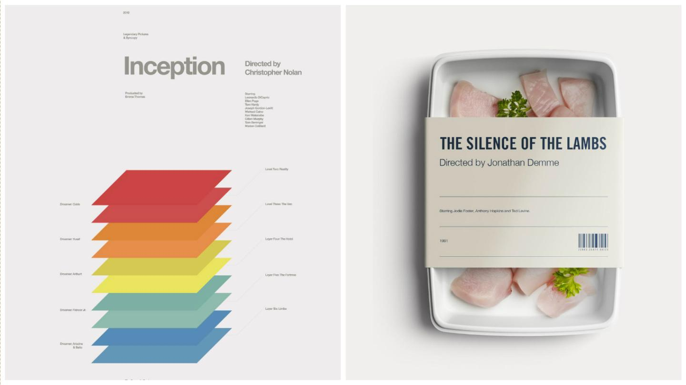
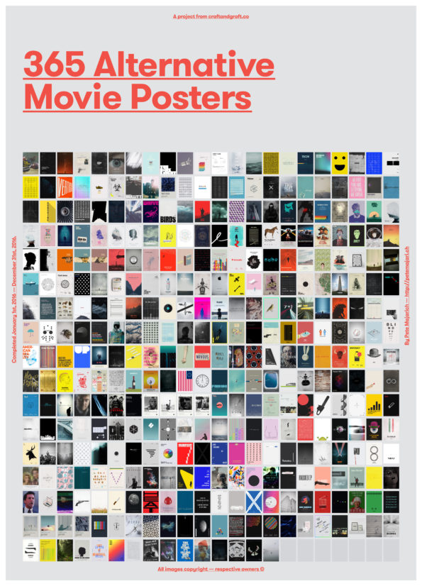
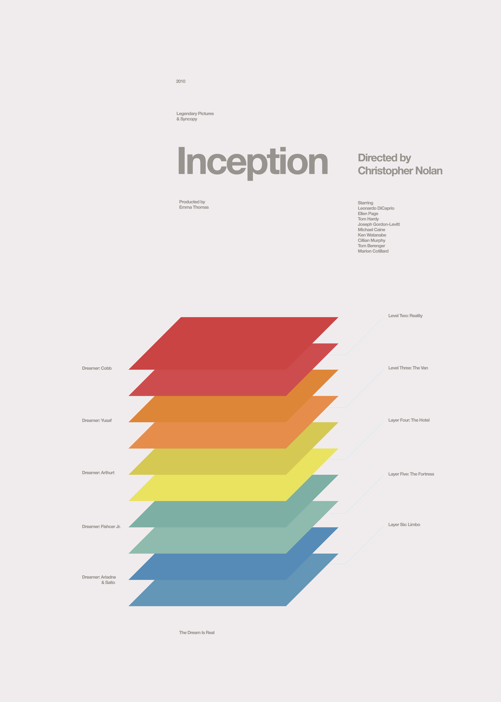
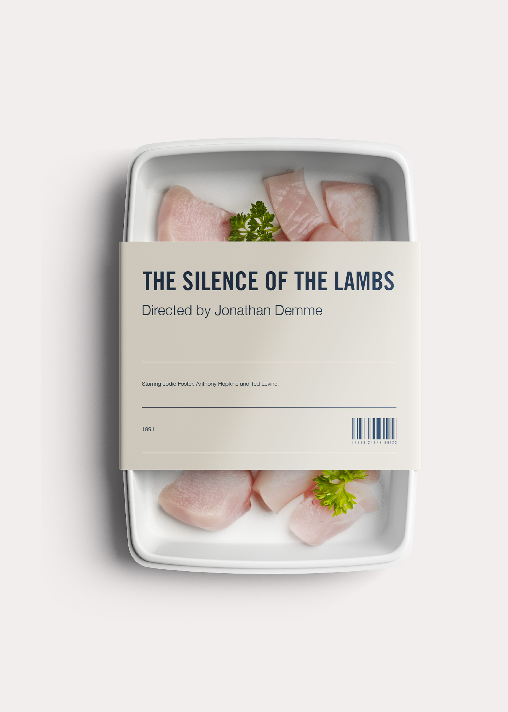
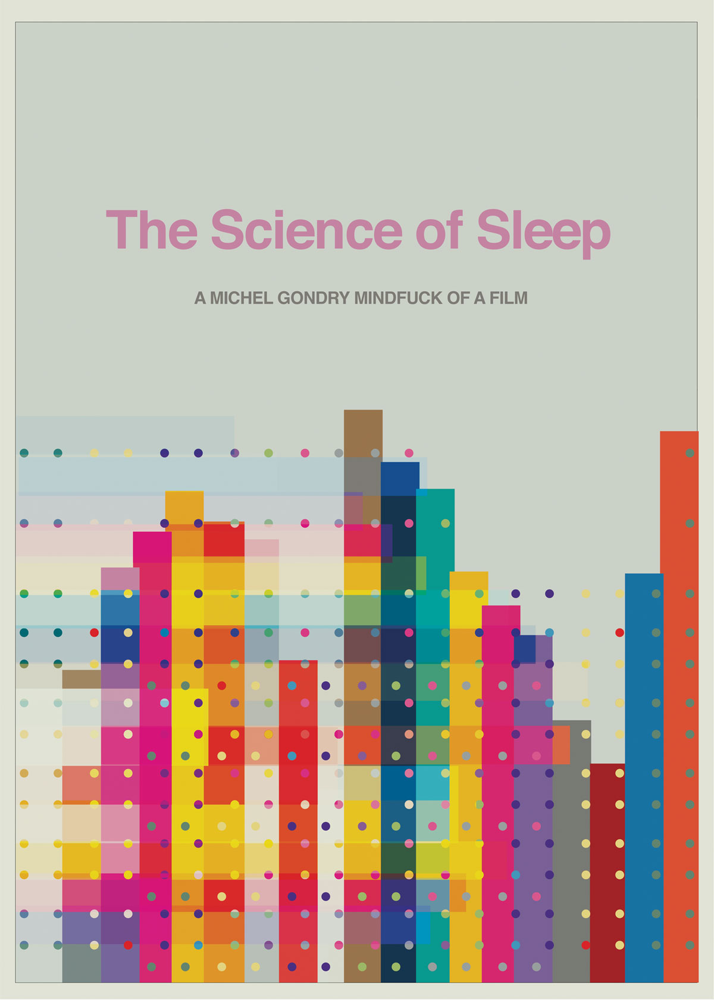
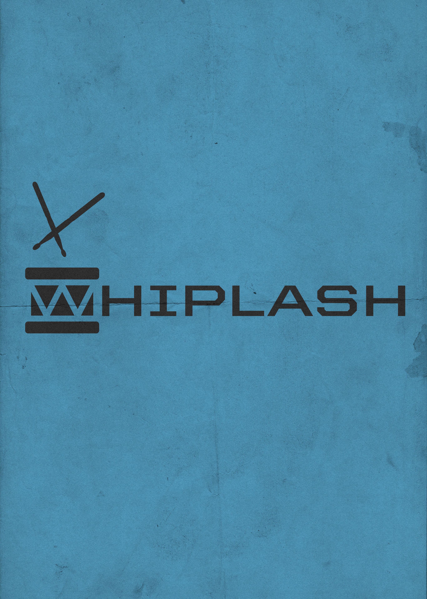
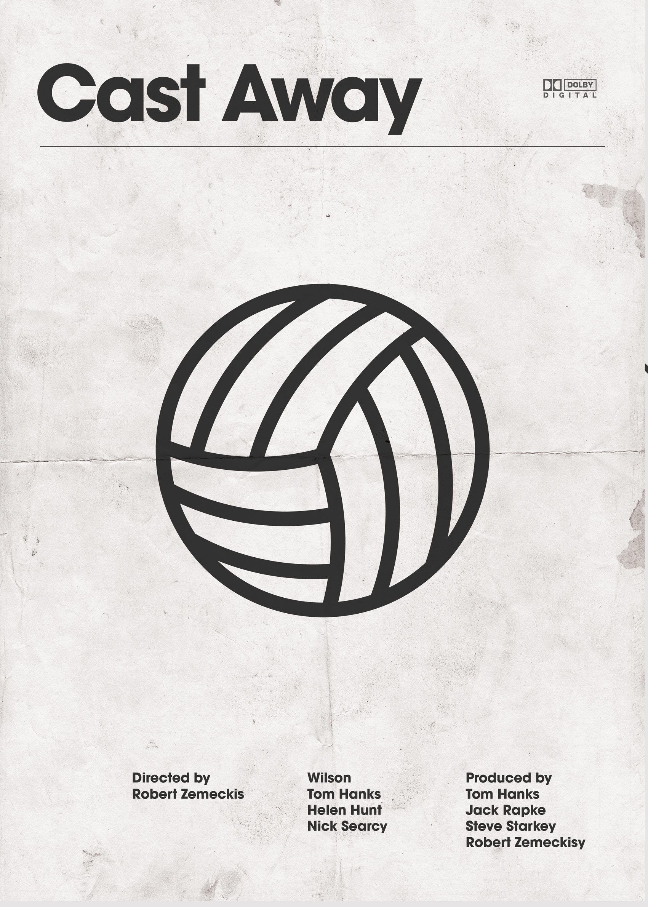

The Guy Who Designed Minimalist Movie Posters Every Day For a Year Finally Finished

[film](https://creators.vice.com/en_us/topic/film?utm_source=dmfb)

The Guy Who Designed Minimalist Movie Posters Every Day For a Year Finally Finished

[ DS](https://creators.vice.com/en_us/contributor/diana-shi)
[Diana Shi](https://creators.vice.com/en_us/contributor/diana-shi)

Apr 2 2017, 12:30pm

### Pete Majarich caps off his year-long project to create a remixed movie poster every day with a packed video.

He made it! After an entire year, graphic designer [Pete Majarich](http://craftandgraft.co/) completed his [ambitious design project, *A Movie Poster a Day*](https://creators.vice.com/en_us/article/movie-poster-a-day-graphic-design-instagram-challenge), completing exactly 365 unique poster redesigns. An artist of impeccable time management, Majarich finished the final poster, a moody reinterpretation of Alfonso Cuarón's *Children of Men*, on December 31, 2016.

To wrap up and toast his success in completing the massive effort, Majarich put together a video reel of all his works. Similar to binging a much-hyped TV series or film trilogy, the entire project is enthralling to view as a whole. Majarich demonstrates not only high-caliber discipline but also a keen creative spirit, embracing the project to diversify his practice and develop new artistic styles.

In a comment accompanying [the Vimeo video](https://vimeo.com/197401359), Majarich says he thinks "he tapped into something everybody loves—movies." Check out a few posters from *A Movie Poster a Day* below, along with the fast-paced video:

Advertisement

See every poster on Pete Majarich's website, [here](http://craftandgraft.co/product-category/movie-poster/), and follow him on his Instagram, [here](http://www.instagram.com/craftandgraft/).

Related:

 [* Wes Anderson-Esque Posters Map Cult Films' Props and Blueprints*](https://creators.vice.com/en_us/article/cult-movie-posters-created-from-set-pieces-props)

 [* See Portraits of Directors Made from Their Famous Movies *](https://creators.vice.com/en_us/article/see-portraits-of-directors-made-from-their-famous-movies)

[* This Music Video Will Test Your Music IQ*](https://creators.vice.com/en_us/article/this-music-video-will-test-your-movie-knowledge)

Toutes les images sont publiées avec l'aimable autorisation de Pete Majarich.

[cinema](https://creators.vice.com/en_us/topic/cinema?utm_source=dmfb)[visual art](https://creators.vice.com/en_us/topic/visual-art?utm_source=dmfb)[graphic design](https://creators.vice.com/en_us/topic/graphic-design?utm_source=dmfb)[CG](https://creators.vice.com/en_us/topic/cg?utm_source=dmfb)[movie poster](https://creators.vice.com/en_us/topic/movie-poster?utm_source=dmfb)[Pete Majarich](https://creators.vice.com/en_us/topic/pete-majarich?utm_source=dmfb)

Watch This Next

[    6:56     Striking Scenes, Illuminated Brooklyn, and Wild Performances | Culture Beat Episode 7]()

Explore the world through our colorful lens.

## The best and the brightest on Creators.

Advertisement