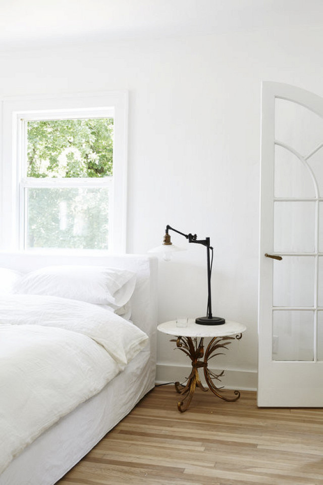
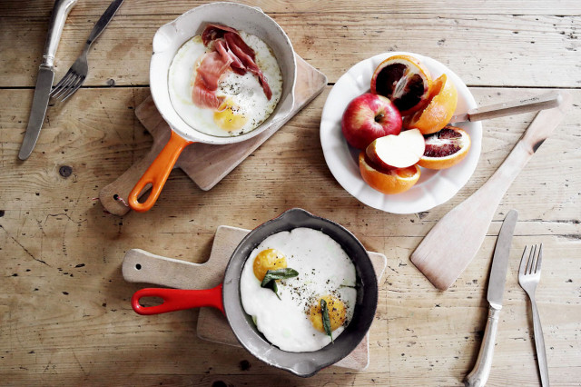

The Healthiest People Do This Every Single Day

March 15, 2017
 | [Healthy Living](http://www.mydomaine.com/categories/healthy-living)

# The Healthiest People Do This Every Single Day

 

by [Sacha Strebe](http://www.mydomaine.com/author/sacha-strebe)

 [**](http://facebook.com/sharer.php?u=http%3A%2F%2Fwww.mydomaine.com%2Fhow-to-live-a-healthy-lifestyle%3Futm_campaign%3Darticle-share%26utm_source%3Dsocial-facebook-button%26utm_medium%3Dsocial&title=The+Healthiest+People+Do+This+Every+Single+Day)  [**](http://pinterest.com/pin/create/link/?url=http%3A%2F%2Fwww.mydomaine.com%2Fhow-to-live-a-healthy-lifestyle%3Futm_campaign%3Darticle-share%26utm_source%3Dsocial-pinterest-button%26utm_medium%3Dsocial&media=http%3A%2F%2Fcliqueimg.com%2Fposts%2F218964%2Fhow-to-live-a-healthy-lifestyle-218964-1489609666-promo.jpg&description=The+Healthiest+People+Do+This+Every+Single+Day+via+%40MyDomaine)  [**](http://www.mydomaine.com/how-to-live-a-healthy-lifestylemailto:?subject=You%20have%20to%20read%20this...&body=I%20just%20read%20this%20story%20on%20MyDomaine%E2%80%94it%20reminded%20me%20of%20you%21%0A%0DThe%20Healthiest%20People%20Do%20This%20Every%20Single%20Day%0A%0Dhttp://dmnh.me/y6amou3)

*How do I live a [healthy lifestyle](http://www.mydomaine.com/thirties-healthy-living-habits)? *It's a question we're often asked (and one we often ponder ourselves), but after all the content we've [written on the topic](http://www.mydomaine.com/section/healthy-living), we can safely say that the holy grail of [wellness](http://www.mydomaine.com/health-and-wellness) (much like the fountain of youth) is ever elusive and constantly changing.

But one thing we do know for sure is we'll never give up our quest. And to be honest, being healthy is all relative to the individual. What boosts your [happiness](http://www.mydomaine.com/tags/happiness) scale might not even register on someone else's joyometer ([this will help you banish a bad mood](http://www.mydomaine.com/happiness-hacks)), and health works the same way. When one particular lifestyle change or [diet swap](http://www.mydomaine.com/foods-that-keep-you-full-longer) makes *you* feel better, that same shift could make your friend or colleague actually feel worse.

Since everyone's version of [healthy](http://www.mydomaine.com/how-to-be-healthier/) is so different, we decided to round up 11 different activities you can do to create a [healthier (and happier) lifestyle](http://www.mydomaine.com/healthy-habits-for-women) for yourself. No pressure, just try one (or two) at first and see how you go. Then slowly add another one and another until you feel that fresh bright-eyed glow, the twinkle in your eye, and a pep in your step again—these [healthy quotes are good motivation too](http://www.mydomaine.com/healthy-lifestyle-quotes). **Ready? Let's go.**

1 / 5

   [**](http://pinterest.com/pin/create/link/?url=http%3A%2F%2Fwww.mydomaine.com%2Fhow-to-live-a-healthy-lifestyle%3Futm_campaign%3Darticle-share%26utm_source%3Dsocial-pinterest-button%26utm_medium%3Dsocial&media=http%3A%2F%2Fcliqueimg.com%2Fposts%2F218964%2F-2121559-1489609681.jpg&description=The+Healthiest+People+Do+This+Every+Single+Day+via+%40MyDomaine)

PHOTO:
[We the People](http://www.wethepeoplestyle.com/2016/10/new-york-hit-list/)

They Practice Self-Care

Even though we live insanely busy lives juggling all of life's balls in the air (home, work, family, friends), it's important to take a step back every now and then for a little [self-love](http://www.mydomaine.com/self-care). Doing something for yourself might feel like a selfish act at first (especially when you have children to tend to), but it's actually not. How much can you do for someone else when you're not at your best? Not much, or at least not to the best of your ability if you were in peak healthy condition.

Take Lisa Ferentz's advice. The psychotherapist and author of *[Finding Your Ruby Slippers](http://amzn.to/2iOyRxy) *told MyDomaine that through the simple act of "taking your emotional temperature," you can delve deeper into yourself and clear the emotional fog that can often cloud judgment and ultimately impact health. So next time you have a few minutes to spare, ask yourself this: *Right now, what am I feeling?* or *What do I need that I'm not getting?* and stop stress in its tracks.

They Quiet Their Mind

While we're all familiar with the many benefits of meditation ([it only takes 10 minutes to notice the benefits](http://www.mydomaine.com/health-benefits-of-ten-minute-meditation)), not all of us have the patience to sit still long enough. If this sounds like you, then take up another mindful practice that can quiet your mind in the same way. [Guided imagery meditation](http://www.mydomaine.com/guided-imagery-meditation) is a great alternative to channel inner calm, anywhere, anytime. This simple technique can alleviate stress and anxiety while instilling a sense of inner peace and serene feeling—a welcome break from the chaos.

"The techniques are in essence a non-verbal instruction or direct suggestion to the body and unconscious mind to act 'as though' the peaceful, safe and beautiful (and thus relaxing) environment were real," suggest [Harry Mills, PhD; Natalie Reiss, PhD; and Mark Dombeck, PhD](https://www.mentalhelp.net/articles/visualization-and-guided-imagery-techniques-for-stress-reduction/). If this doesn't interest you either, then try [Headspace](https://www.headspace.com/science/meditation-for-anxiety) app, which talks you through the process instead, or [journaling](http://www.mydomaine.com/benefits-of-free-form-journaling). Don't dimiss it as mere words, the pen and paper can prove very powerful tools in [reducing negative ailments](https://psychcentral.com/lib/the-health-benefits-of-journaling/) and enhancing one's well-being, both physically and emotionally. [A PsychCentral report](https://psychcentral.com/lib/the-health-benefits-of-journaling/) found "writing removes mental blocks and allows you to use all of your brainpower to better understand yourself, others and the world around you."

2 / 5

   [**](http://pinterest.com/pin/create/link/?url=http%3A%2F%2Fwww.mydomaine.com%2Fhow-to-live-a-healthy-lifestyle%3Futm_campaign%3Darticle-share%26utm_source%3Dsocial-pinterest-button%26utm_medium%3Dsocial&media=http%3A%2F%2Fcliqueimg.com%2Fposts%2F218964%2F-2121745-1489615030.jpg&description=The+Healthiest+People+Do+This+Every+Single+Day+via+%40MyDomaine)

PHOTO:
[Brooke Testoni](http://www.brooketestoni.com/)

They Stop Negative Thinking

There's no denying that [negative thinking](http://www.mydomaine.com/how-to-stop-negative-thoughts) amid the fight-or-flight mode of our ancestors served its evolutionary purpose, but in today's world, those irrational fears can severely impact our mental and physical health. Plus, what saved our distant relatives no longer serves us today in the same way. So how do we stop something that is coded in our genetic makeup? Our news editor, Kelsey Clarke, took up a simple five-step method outlined [in MindBodyGreen](http://www.mindbodygreen.com/0-8647/5-ways-to-retrain-your-brain-into-a-positive-powerhouse.html) that allows her to not only monitor negative thoughts but stop them in real time, and "replace them with positive ones more rooted in reality." She wrote, **"The success of this practice is rooted in gratitude, empathy, and a general awareness of just how fortunate I am in many aspects of my life." **If you want to be truly happy in life, here's a [few other habits you need to give up too](http://www.mydomaine.com/how-to-be-happy-in-life/).

## Related

 

 [Healthy Living](http://www.mydomaine.com/categories/healthy-living)

 [ 7 Self-Care Rituals That Will Make You a Happier and Healthier Person](http://www.mydomaine.com/self-care)

They Prioritize Sleep

We can't stress how crucial [sleep](http://www.mydomaine.com/tags/sleep) is. Without your recommended dose of shut-eye each night, your [energy level dwindles](http://www.mydomaine.com/foods-that-give-you-energy), you succumb to distractions and you are [four times more likely to fall ill](http://www.mydomaine.com/common-cold). But according to [The Better Sleep Council study](http://bettersleep.org/better-sleep/the-science-of-sleep/sleep-statistics-research/better-sleep-survey), "Half of Americans (about 48%) say they don't get enough sleep, but less than half of them take any one specific action to help them get better sleep." So it's time to start putting [sleep](http://www.mydomaine.com/hypnotist-sleep-relax-tips) at the top of your to-do list. Here are a few [science-backed sleeping habits](http://www.mydomaine.com/sleeping-habits) you can adopt to induce some sweet slumber. ([Bella Hadid's sleep hack is genius](http://www.mydomaine.com/bella-hadid-best-sleep-advice) too). But if all else fails, this will have you [snoozing in less than a minute](http://www.byrdie.com/how-to-fall-asleep-fast).

3 / 5

   [**](http://pinterest.com/pin/create/link/?url=http%3A%2F%2Fwww.mydomaine.com%2Fhow-to-live-a-healthy-lifestyle%3Futm_campaign%3Darticle-share%26utm_source%3Dsocial-pinterest-button%26utm_medium%3Dsocial&media=http%3A%2F%2Fcliqueimg.com%2Fposts%2F218964%2F-2121744-1489615030.jpg&description=The+Healthiest+People+Do+This+Every+Single+Day+via+%40MyDomaine)

PHOTO:

[Nicole Franzen](http://www.nicolefranzen.com/interiors/) for [Leanne Ford Interiors](http://leannefordinteriors.com/)

They Curb Worry

Just like negative thinking, worry is something else we let get a hold of us. In small doses, this can be a protective measure, but too much can be all-consuming and downright crippling. Don't get us wrong, [there's a lot to be worried about](http://abcnews.go.com/Politics/top-15-issues-americans-worried/story?id=29758744) right now, but when it creeps into our everyday lives like a black cloud, it can really rock our happiness, relationships, and career. A great way to [curb your anxiety naturally](http://www.mydomaine.com/how-to-stop-anxiety-naturally) is to write it down, question it, and even make time for it.

Yes, you read right. According to a study featured on [Live Science](http://www.livescience.com/15233-planning-worry-time-ease-anxiety.html) and published in the *[Journal of Psychotherapy and Psychosomatics](http://www.alphagalileo.org/Organisations/Default.aspx?OrganisationId=638)*, "Planning a certain time every day to worry may be a useful strategy." The study suggests a technique called "stimulus control" where you set aside a 30-minute period each day to think about your worries and consider solutions. If that doesn't help, then these [natural remedies](http://www.mydomaine.com/best-natural-remedies-for-anxiety) can help to alleviate symptoms too.

They Create a Happy Home

When you need a place to escape the world, where do you go? [Home](http://www.mydomaine.com/section/decor). It's our special sanctuary and [self-care haven](http://www.mydomaine.com/self-care-tips) where we can all retreat to recharge and unwind without judgment. This is where we can truly be ourselves in the comfort and ease of an environment we've created. Designing your happy place will evoke instant calm and a smile as soon as you walk through the door. "**I think a sign of good design is how it makes you feel," interior designer, [Lane McNab](http://lanemcnab.com/) told [MyDomaine](http://www.mydomaine.com/happy-home/). "I love creating a space that immediately puts a client at ease, makes them feel comfortable, happy, and reflects their personality, but also offers an additional *wow* of beauty, quality, and visual interest." **This is how home *should* feel.

4 / 5

   [**](http://pinterest.com/pin/create/link/?url=http%3A%2F%2Fwww.mydomaine.com%2Fhow-to-live-a-healthy-lifestyle%3Futm_campaign%3Darticle-share%26utm_source%3Dsocial-pinterest-button%26utm_medium%3Dsocial&media=http%3A%2F%2Fcliqueimg.com%2Fposts%2F218964%2F-2121721-1489613956.jpg&description=The+Healthiest+People+Do+This+Every+Single+Day+via+%40MyDomaine)

PHOTO:
[We the People](http://www.wethepeoplestyle.com/2017/01/east-end/)

They Wake Up Earlier

If you want to start the day of right and set the course for a healthy day, [wake up earlier](http://www.mydomaine.com/early-birds-eat-healthier). If only it were that easy, right? But according to [a study published in the journal *Obesity*](http://onlinelibrary.wiley.com/doi/10.1002/oby.21747/full), [early birds](http://www.mydomaine.com/how-morning-people-prevent-burnout) are more likely to instinctively choose a [healthier diet than nighttime people](https://www.nytimes.com/2017/03/08/well/eat/night-owls-eat-less-healthfully-than-morning-people-do.html). Why? Not only do night owl participants in the study eat less in the morning, they were also more likely to choose foods high in sugar and low in fiber, carbohydrates, and fats. They also ate more sugar and fats over the weekends, had irregular meal times, and snacked twice as often.

So if you're really serious about living a healthier life, then go to bed at a reasonable hour and don't hit snooze. Katherine Power, co-founder, and CEO of Clique Media Group, MyDomaine’s parent company, says she avoids it at all costs. "Don't hit the snooze button," [she told us](http://www.mydomaine.com/best-morning-routines). "I read on [Byrdie.com](http://byrdie.com/) that this was a big no-no and can make you drowsier throughout the day."

## Related

 

 [News](http://www.mydomaine.com/categories/news)

 [ Bella Hadid's Genius Sleep Hack Is One We Should All Follow](http://www.mydomaine.com/bella-hadid-best-sleep-advice)

They Give Up Bad Eating Habits

If your busy life has pushed your personal health down the list of priorities, then you're probably fallen back into some [bad eating habits](http://www.mydomaine.com/bad-eating-habits). If you're snacking on the sweets, consuming a little too much wine, or ramped up that morning cup of joe to three or four by day's end, then it's time to scale it back and be mindful of our bodies. Because how are you able to handle the stresses of everyday life when you don't support your body with the right nutrition? These [healthy snacks](http://www.mydomaine.com/health-snacks) are great swaps when you need to nosh mid-afternoon, and [nutritionists swear by these foods](http://www.mydomaine.com/healthy-foods-to-eat-every-day) every day.

5 / 5

   [**](http://pinterest.com/pin/create/link/?url=http%3A%2F%2Fwww.mydomaine.com%2Fhow-to-live-a-healthy-lifestyle%3Futm_campaign%3Darticle-share%26utm_source%3Dsocial-pinterest-button%26utm_medium%3Dsocial&media=http%3A%2F%2Fcliqueimg.com%2Fposts%2F218964%2F-2121730-1489614855.jpg&description=The+Healthiest+People+Do+This+Every+Single+Day+via+%40MyDomaine)

PHOTO:
[Harper and Harley](http://harperandharley.com/page/2/)

They Develop Hobbies

While you might think [hobbies are something you do when you're bored](http://www.mydomaine.com/hobby-ideas), there are so many other health benefits to picking one up. In fact, did you know that [painting alleviates anxiety](http://www.mydomaine.com/how-to-start-painting)? [According to](http://www.mydomaine.com/how-to-get-rid-of-anxiety)[Barrie Sueskind](http://www.mydomaine.com/how-to-get-rid-of-anxiety), a licensed marriage and family therapist who specializes in anxiety, you can quash the effects instantly just by picking up painting or [journaling as a hobby](http://www.mydomaine.com/benefits-of-free-form-journaling). Not only that, [taking up writing](http://www.mydomaine.com/hobbies-for-intelligence) as a pastime also makes you smarter. But perhaps one of our favorites (that we also share with Warren Buffett and Bill Gates) is [reading](http://www.mydomaine.com/reading-secret-to-success-wealth). In fact, a [*Fast Company* report](https://www.fastcompany.com/3048913/how-changing-your-reading-habits-can-transform-your-health) showed that "reading doesn't just improve your knowledge, it can help fight depression, make you more confident, empathetic, and a better decision maker." We're sold.

## Related

 

 [Healthy Living](http://www.mydomaine.com/categories/healthy-living)

 [ 3 Weekend Habits That Are Throwing Off Your Healthy Lifestyle](http://www.mydomaine.com/how-to-stop-weekend-weight-gain)

They Write Gratitude Lists

While there is no secret to happiness, there *is* a proven daily ritual that can increase its chances of happening: [a gratitude list](http://www.mydomaine.com/o%20there%20is%20no%20secret,%20but%20there%20is%20a%20simple%20daily%20ritual%20you%20can%20do%20that's%20scientifically%20proven%20to%20bring%20more%20joy%20into%20your%20life:%20a%20gratitude%20list.). And being happier makes you feel better, which in turn improves your overall health. Still not convinced that writing down what you're grateful for on a piece of paper can improve your well-being? We'll leave that explanation to science. According to positive psychology research outlined in*  [Harvard Health Publications](http://www.health.harvard.edu/newsletter_article/in-praise-of-gratitude),* "**Gratitude is strongly and consistently associated with greater happiness**." The simple act of recognizing the positive things in your life can not only make you smile but also improve your health, help you handle adversity, and build stronger relationships. Now that's worth carving five minutes out of your calendar for.

They Get to Know Their Body

First things first. Before you can live a healthier lifestyle, you have to get to know your body and what areas need attention first. [Are you always tired?](http://www.mydomaine.com/why-am-i-always-tired) Do you feel [anxious](http://www.mydomaine.com/how-to-overcome-anxiety) all the time? Are [mood swings a daily occurrence](http://www.mydomaine.com/what-causes-irregular-periods)? If you answer yes to some of these, then it might be time to investigate why. Set up some time with yourself to tune into your body, really be mindful at every meal and note how it makes you feel. See a professional and have a blood test. Sometimes it's as simple as [taking a new supplement](http://www.mydomaine.com/supplements-at-all-ages), a [subtle diet change](http://www.mydomaine.com/best-weight-loss-diets), or [10 minutes of exercise](http://www.mydomaine.com/hiit) to feel your healthy self again.

When senior editor Sophie Miura's energy was zapped, she consulted a doctor and [found out she had a vitamin D deficiency](http://www.mydomaine.com/vitamin-d-deficient). A simple supplement each day has brought her back to normal, and she's feeling better than ever. Getting in touch with your body and how it's feeling is the only way you're going to know where to begin and what to do. So be kind and take note of your emotional, physical, and physiological well-being. Because, to use an oldie but a goodie tagline, you're worth it.

*Scroll through our favorite products below and start making healthier choices.*

### Make It Healthy

Sponsor Content

- [     - Moon Juice,$30      - Free People](http://shop.mydomaine.com/splash/mlCprT?location=productcarousel&location_name=article)
- [     - Tina Frey Designs,$158      - Barneys New York](http://shop.mydomaine.com/splash/mWPbqg?location=productcarousel&location_name=article)
- [     - Anthropologie,$35      - Anthropologie](http://shop.mydomaine.com/splash/ml2L8D?location=productcarousel&location_name=article)
- [     - Williams Sonoma,$100$80      - Williams-Sonoma](http://shop.mydomaine.com/splash/mWtVc4?location=productcarousel&location_name=article)
- [     - West Elm,$19      - West Elm](http://shop.mydomaine.com/splash/mWtNdD?location=productcarousel&location_name=article)
- [     - Williams Sonoma,$50      - Williams-Sonoma](http://shop.mydomaine.com/splash/mWtb6P?location=productcarousel&location_name=article)
- [     - Williams Sonoma,$20      - Williams-Sonoma](http://shop.mydomaine.com/splash/mWt8zr?location=productcarousel&location_name=article)
- [     - Williams Sonoma,$50      - Williams-Sonoma](http://shop.mydomaine.com/splash/mWtr78?location=productcarousel&location_name=article)
- [     - Cost Plus World Market,$6      - Cost Plus World Market](http://shop.mydomaine.com/splash/mlvgrl?location=productcarousel&location_name=article)
- [     - Sur La Table,$20      - Sur La Table](http://shop.mydomaine.com/splash/mmJfJf?location=productcarousel&location_name=article)
- [     - Williams Sonoma,$600      - Williams-Sonoma](http://shop.mydomaine.com/splash/mYJ4jp?location=productcarousel&location_name=article)
- [     - Williams Sonoma,$30      - Williams-Sonoma](http://shop.mydomaine.com/splash/mWtFrr?location=productcarousel&location_name=article)
- [     - West Elm,$24      - West Elm](http://shop.mydomaine.com/splash/mzYLdb?location=productcarousel&location_name=article)
- [     - Martha Stewart Collection,$30$21      - Macy's](http://shop.mydomaine.com/splash/mY9fBB?location=productcarousel&location_name=article)
- [     - Williams Sonoma,$220$75      - Williams-Sonoma](http://shop.mydomaine.com/splash/mWtrbr?location=productcarousel&location_name=article)
- [     - Staub,$310      - Sur La Table](http://shop.mydomaine.com/splash/mW7Zbl?location=productcarousel&location_name=article)
- [     - Anthropologie,$25      - Anthropologie](http://shop.mydomaine.com/splash/mY2Vfg?location=productcarousel&location_name=article)
- [     - S'well,$35      - Sur La Table](http://shop.mydomaine.com/splash/mzq76R?location=productcarousel&location_name=article)
- [     - Serena & Lily,$98      - Serena & Lily](http://shop.mydomaine.com/splash/mW7NFN?location=productcarousel&location_name=article)
- [     - Williams Sonoma,$30      - Williams-Sonoma](http://shop.mydomaine.com/splash/mWt7g9?location=productcarousel&location_name=article)
- [     - Williams Sonoma,$360$300      - Williams-Sonoma](http://shop.mydomaine.com/splash/mmq4b3?location=productcarousel&location_name=article)
- [     - Staub,$170      - Sur La Table](http://shop.mydomaine.com/splash/mW7Zby?location=productcarousel&location_name=article)
- [     - Anthropologie,$40      - Anthropologie](http://shop.mydomaine.com/splash/mlmJqY?location=productcarousel&location_name=article)
- [     - Williams Sonoma,$40$32      - Williams-Sonoma](http://shop.mydomaine.com/splash/mlHpHQ?location=productcarousel&location_name=article)
- [     - Dash,$30$20      - Crate & Barrel](http://shop.mydomaine.com/splash/mJnWzb?location=productcarousel&location_name=article)
- [     - Anthropologie,$26      - Anthropologie](http://shop.mydomaine.com/splash/mWDlwb?location=productcarousel&location_name=article)
- [     - Crate & Barrel,$25      - Crate & Barrel](http://shop.mydomaine.com/splash/mmgwHw?location=productcarousel&location_name=article)

-
-
-
-
-
-
-
-
-
smartPortraitAndUp

**How do you make every day count? What are the daily health rituals you swear by? **

 Explore:   [how to live a healthy lifestyle](http://www.mydomaine.com/tags/how-to-live-a-healthy-lifestyle), [healthy lifestyle](http://www.mydomaine.com/tags/healthy-lifestyle), [Healthy](http://www.mydomaine.com/tags/healthy), [Happiness](http://www.mydomaine.com/tags/happiness)

- [**](http://facebook.com/sharer.php?u=http%3A%2F%2Fwww.mydomaine.com%2Fhow-to-live-a-healthy-lifestyle%3Futm_campaign%3Darticle-share%26utm_source%3Dsocial-facebook-button%26utm_medium%3Dsocial&title=The+Healthiest+People+Do+This+Every+Single+Day)

- [**](http://pinterest.com/pin/create/link/?url=http%3A%2F%2Fwww.mydomaine.com%2Fhow-to-live-a-healthy-lifestyle%3Futm_campaign%3Darticle-share%26utm_source%3Dsocial-pinterest-button%26utm_medium%3Dsocial&media=http%3A%2F%2Fcliqueimg.com%2Fposts%2F218964%2Fhow-to-live-a-healthy-lifestyle-218964-1489609666-promo.jpg&description=The+Healthiest+People+Do+This+Every+Single+Day+via+%40MyDomaine)

- [Shop MyDomaine **](http://shop.mydomaine.com/?utm_campaign=contextual-commerce&utm_source=mydomaine&utm_medium=shop-button)

#### Add a Comment

 **

[](https://googleads.g.doubleclick.net/aclk?sa=l&ai=CRItU-BzcWIbsEJLObpHngagPlpfp5kj52rjZngO_4R4QASDzoKAiYLu-roPQCqAB36fGoQPIAQLgAgCoAwHIA5kEqgTEAU_QbkxsWR86P6SCwUDwGO_go0wEqeCe8nU4zjf8_24DQiiioUCaogPlFM3FwhD-dLut4kSGJ3P-pMy9pphvLAbDGCS9zf5xTjI3FAbK2CHDEpXBKQznoaCPL8f_ChbKKQFBgtcPf1AtiuaBFr9IdAgNi8D6p9PR61WoKW8Suoh5BMw4_Adtsumt5zHHcfvl3idGxdo3KIS9tOjMR7_Ul1jcJK_arl4LBLUMTU4L25AAs0OkHU8AzvfHXhlYKpjx0W1olVLgBAGgBgKAB76byV-oB6a-G9gHAdIIBQiMYxAB&num=1&sig=AOD64_0gKyiJJ6Cn8JcGCJ2iVflzSCBF5Q&client=ca-pub-7071103729757397&adurl=http://www.romwe.com/UK-Cool-Sweatshirts-vc-4248.html%3Furl_from%3Dukadgg03UKCoolSweatshirtsvc4248xgn0918-160*600)

Ad closed by 

[Report this ad]()[AdChoices ](http://support.google.com/adsense/troubleshooter/1631343)

[Ad covered content]()[Ad was inappropriate]()[Not interested in this ad]()[Seen this ad multiple times]()

We'll try not to show that ad again

Ad closed by 