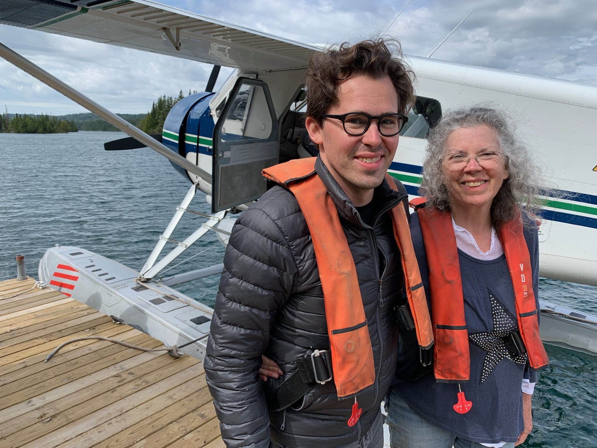
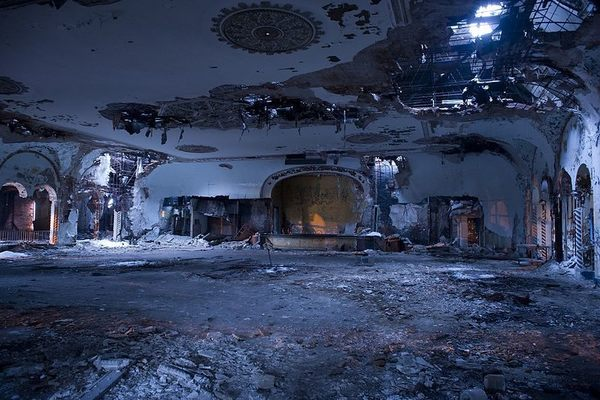
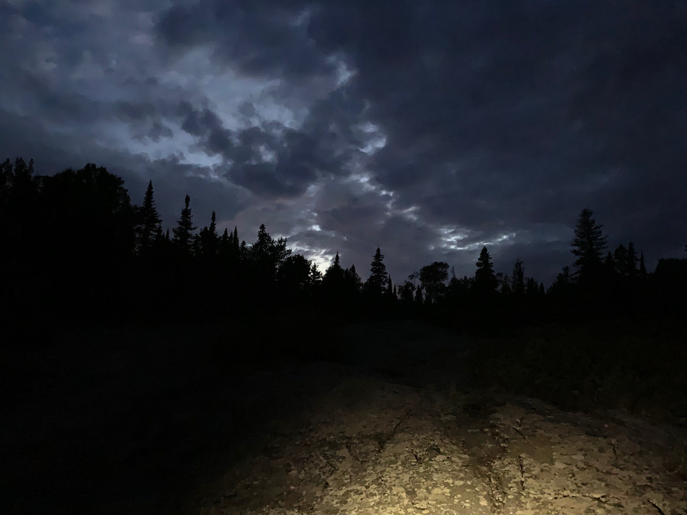
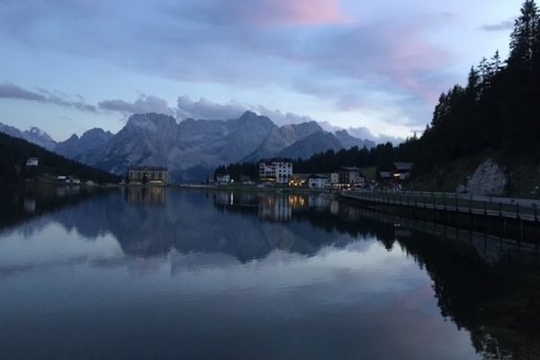
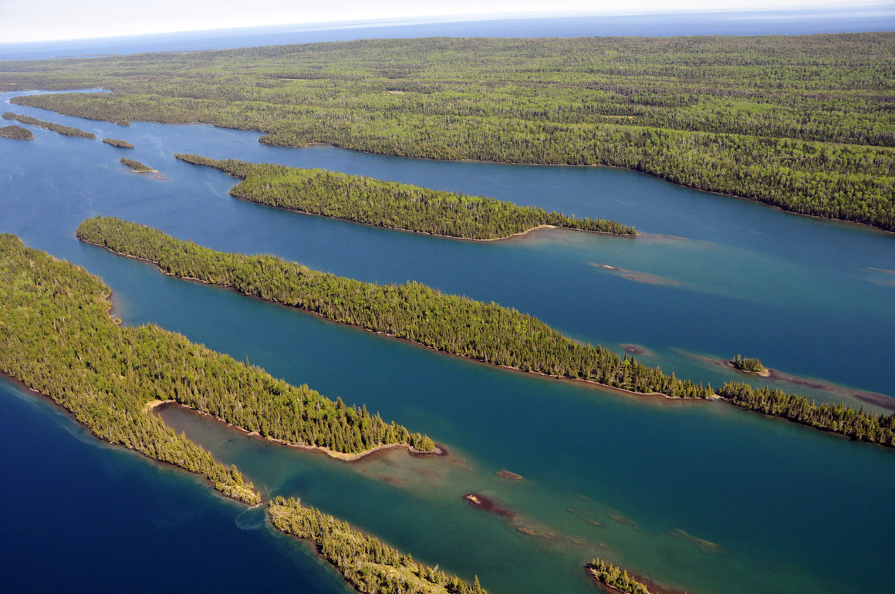
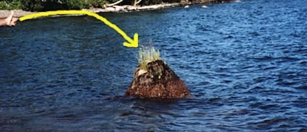
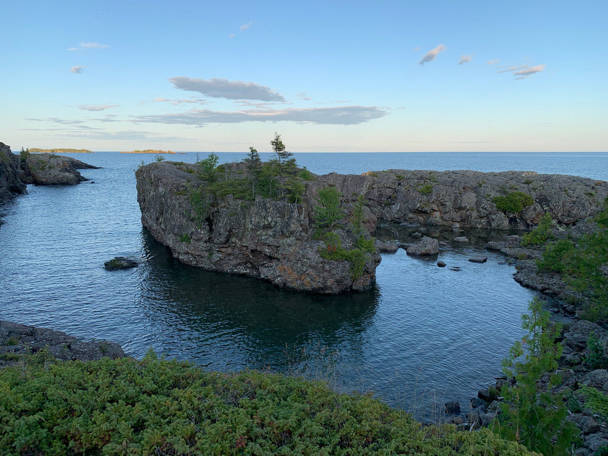
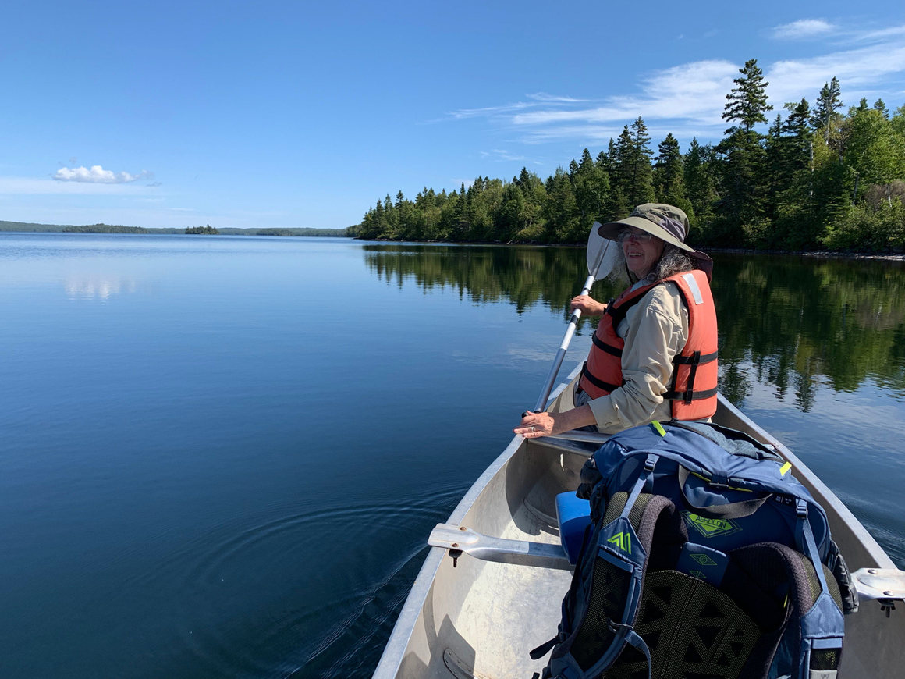
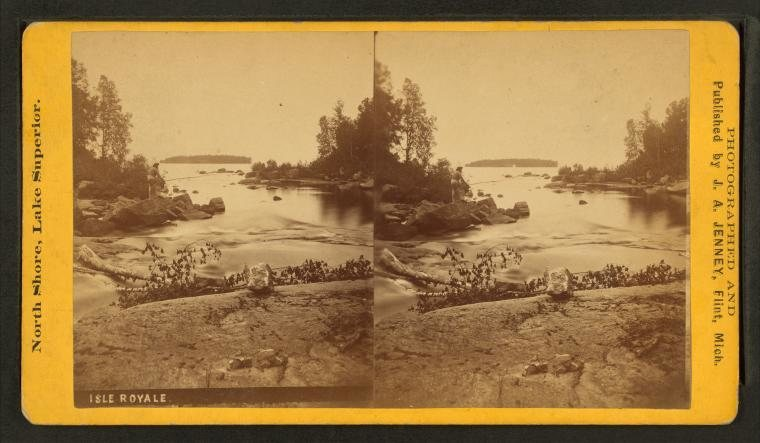
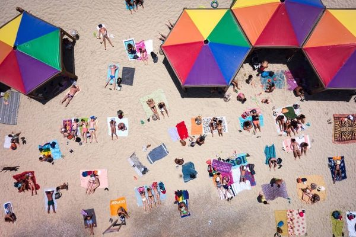

The Intrepid Mother and Son Who Unraveled a Geographic Hoax - Atlas Obscura

# The Intrepid Mother and Son Who Unraveled a Geographic Hoax

## Atlas Obscura had a page for something called Moose Boulder, until fan Roger Dickey called us on it.

by [Matthew Taub](https://www.atlasobscura.com/users/matthewtaub?view=articles)•March 10, 2020

[**](https://www.atlasobscura.com/articles/moose-boulder-debunked)[**](https://twitter.com/share?text=The%20Intrepid%20Mother%20and%20Son%20Who%20Unraveled%20a%20Geographic%20Hoax%20@atlasobscura&count=none&url=https://www.atlasobscura.com/articles/moose-boulder-debunked)[**](https://www.atlasobscura.com/articles/moose-boulder-debunkedmailto:?subject=The%20Intrepid%20Mother%20and%20Son%20Who%20Unraveled%20a%20Geographic%20Hoax&body=The%20Intrepid%20Mother%20and%20Son%20Who%20Unraveled%20a%20Geographic%20Hoax%0AAtlas%20Obscura%20had%20a%20page%20for%20something%20called%20Moose%20Boulder%2C%20until%20fan%20Roger%20Dickey%20called%20us%20on%20it.%20%0A%0Ahttps%3A%2F%2Fwww.atlasobscura.com%2Farticles%2Fmoose-boulder-debunked?utm_source=share_by_email%26utm_medium=email%26utm_campaign=mailto_share)

Roger Dickey and Ellie Talburtt at the end of their Isle Royale adventure. Courtesy Roger Dickey

In This Story

[    Destination Guide  ### Michigan](https://www.atlasobscura.com/things-to-do/michigan)

It was 3 a.m. on a nearly deserted island, and two hikers were badly lost. Roger Dickey and his mother, Ellie Talburtt, had been exploring Michigan’s Isle Royale—the least-visited national park in the United States—and were trying to recover the trail in the island’s murky and bewildering woods. This was not what they had had in mind for a mother-son getaway, no matter how good a story it would make if things turned out okay.

What had brought them there, and into this rather dicey situation, was something called Moose Boulder, a kind of geological *matryoshka*. Here’s what makes Moose Boulder special, from the outside in: Lake Superior is the world’s largest freshwater lake, and its largest island is Isle Royale, whose largest lake is called Siskiwit, whose largest island is called Ryan. According to [Wikipedia](https://en.wikipedia.org/wiki/Siskiwit_Lake_(Isle_Royale)), at least, Ryan Island is home to a seasonal pond called Moose Flats that, when flooded, contains its own island—Moose Boulder. This makes it “the largest island in the largest lake on the largest island in the largest lake on the largest island in the largest lake in the world.” Pity it’s not in Greenland, it could have gone all the way.

Not the most promising sight. Courtesy Roger Dickey

Spoiler: Mother and son made it out alive, but it wasn’t because they stumbled on a geological/hydrological anomaly that they could use to get their bearings. They couldn’t have, because, despite what the internet has to say, Moose Boulder almost surely doesn’t exist.

* * *

[ Related  ### The Places You Never Tire of Visiting  Atlas Obscura readers share the destinations they just can't quit.    Read more   ](https://www.atlasobscura.com/articles/best-places-for-repeat-visits)

Let’s give Roger Dickey some credit, though. He actually knew that Moose Boulder was some kind of hoax before trekking across Isle Royale. But when he first heard about it, the San Francisco–based entrepreneur knew where he was taking his next trip. “I just like finding extreme features on maps,” he says, and he’s prepared to travel far and wide to see them for himself.

Over the course of his travels, Dickey has crossed the Arctic Circle. When he visits more populous tourist destinations, he goes hunting for the unbeaten path, like the time he trekked to the westernmost point in Portugal—also the westernmost point in continental Europe—just to watch the sun set. Next, he says, he’s planning a trip to Newfoundland because the Flat Earth Society has deemed it one of the four corners of the Earth.

Dickey set out to ground-truth his internet sleuthing. Courtesy Roger Dickey

In short, Dickey is the *Atlas Obscura *reader par excellence, the kind of person who looks at a map, notices a “funny-shaped peninsula,” and feels that his trip won’t be complete without seeing it—come hell or high water. So when his mother sent him an article about Moose Boulder, which linked to this very website, Dickey had no choice. He was already planning the trip.

A diligent hiker and thoughtful son, Dickey wanted to make sure he had solid GPS coordinates for Moose Boulder before trying to visit. Its very existence, he recalls, depended on a pond that isn’t even always there. Google Maps didn’t have a mark for Moose Boulder, nor did the alternative specialty mapping services that Dickey downloaded just for this search. It’s not hard to find Ryan Island, but “a little spot of blue” inside it? That had proved impossible.

Dickey’s next move was to turn to fellow hikers and topography enthusiasts, so he consulted several online forums that had hosted discussions about Moose Boulder over the years. Between all of these sites, fewer than a dozen people had actually discussed this place—and none had actually seen it, not even those who had been to Ryan Island and looked around. Some wondered if they had simply visited during the wrong season.

Belle Harbor on Isle Royale—perfectly remote. [National Park Service](https://www.nps.gov/npgallery/GetAsset/B7B69D96-1DD8-B71B-0B53980E3C4E8796)

It’s doubtful that any of these other hikers, however, had consulted *Atlas Obscura*. Had they done so, Dickey soon realized, they would have found the precise coordinates: [48.0088°, -88.7720°](https://www.google.com/maps/place/48%C2%B000'31.7%22N+88%C2%B046'19.2%22W/@48.0088036,-88.774194,590m/data=!3m2!1e3!4b1!4m5!3m4!1s0x0:0x0!8m2!3d48.0088!4d-88.772). They would have seen that some people had marked visiting it on their *Atlas Obscura* profiles. Dickey had to get creative to actually contact these people. “I did Google reverse image search for their profile photos,” he says, which led him to two people with social media presences, neither of whom responded to his messages. Dickey wasn’t exactly discouraged: On the contrary, he was starting to have some fun. “It became kind of a pet project for me,” he says. This might be an understatement.

The *Atlas Obscura* entry for Moose Boulder led Dickey to the Wikipedia page for Siskiwit Lake, and he got in touch with the Wikipedia user who had edited the page in 2012 to include information about Moose Boulder. That user, whose identity Dickey wants to keep secret—like a good investigative reporter might—pointed Dickey to a book, *Superior Wilderness: Isle Royale National Park*, by Napier Shelton, also cited on Wikipedia. So Dickey ordered a copy and read it, only to discover that it contained absolutely no information regarding Moose Boulder. (I know what you’re thinking: Yes, he did try to contact Shelton, but he couldn’t find any contact information. A research society to which Shelton once belonged didn’t get back to Dickey, either.) The case had by now become highly suspicious, but did not yet seem unsolvable. After all, says Dickey, “*Atlas Obscura *is a trusted source to me.” Thanks—it is to us too.

And then it hit him like a bolt of lightning: Dickey realized that he had overlooked a major piece of evidence. Pictures, those internet-age angels of truth. “Pictures or it didn’t happen,” right? Naturally, as they all do, the *Atlas Obscura* entry for the site had an image—albeit a grainy one—of a lonely little rock, cautiously jutting out of the water, feebly sprouting some weeds. (For good measure, there’s a yellow arrow drawn onto the photo, in case you weren’t sure what you should be looking at.) A photographer, of all people, had scaled the Everest of seasonal ponds and come back with this piece of evidence.

It’s like the Nessie of geographical quirks. WHOI Seafloor Samples Laboratory, apparently.

Many photos that users upload to *Atlas Obscura* link to their original sources, but this one was a dead end. Using the Wayback Machine, Dickey found that it had come from a defunct website that appeared to document a geological research expedition to Ryan Island. So Dickey got in touch with one of the members of that research crew, from the Woods Hole Oceanographic Institution, who—you guessed it!—had never heard of Moose Boulder. The team, in fact, hadn’t even made it to Ryan Island. The supposed photographic evidence had indeed come from that expedition, but it was merely a photo of an ordinary rock, off the coast of Isle Royale itself and not of the *Inception* of islands deep inside it.

By now, the odds seemed overwhelming to Dickey that Moose Boulder was a myth, a spasm of the internet’s imagination that had managed to proliferate and live on. But still, something didn’t quite add up. There was a missing piece to the puzzle that stopped Dickey short of declaring it all a hoax. He had found another article about Moose Boulder, published in 2009, that cited Wikipedia as its source of information. But the information about Moose Boulder had been added to Siskiwit Lake’s Wikipedia page in 2012. It was like a scene in a bad horror movie in which someone gets a phone call from a dead person. Dickey joked with his girlfriend that perhaps Moose Boulder does exist, but only in some kind of “temporal anomaly.”

> Maybe Moose Boulder does exist, but only in some kind of “temporal anomaly.”

Here’s the rub: Wikipedia is a nesting doll, too. Before a page for Siskiwit Lake had been added to the site, the page for Isle Royale had pointed readers to Moose Boulder, and had been doing so since 2009. It was put there by a different user than the one who added it to the Siskiwit page in 2012. Either way, that’s where the trail goes cold, and there’s no other evidence that the place exists. The identity of that first Wikipedia user to write about it—with those completely unrelated sources—remains a mystery, but all available evidence suggests that it was a person having a laugh, nothing more. Dickey had now grown certain of that himself, but with the end of summer approaching and the plans booked, he packed up and left for the wilderness of Isle Royale.

* * *

Ellie Talburtt, Dickey’s mother and traveling companion, did not yet know the truth. Dickey had kept her apprised of the early stages of his investigation, but he decided to keep the final Moose Boulder revelation a surprise until after they met up in Michigan. “Hey mom,” Dickey said at the airport, “I’m excited about this trip. By the way, Moose Boulder isn’t real.” Talburtt took the news well, perhaps suspecting this to some degree all along. As lovers of geographical obscura, the duo were still excited to be heading to the least-visited national park in the United States. They didn’t know it, but there was more excitement to come.

It’s a shame more people don’t see Isle Royale. Courtesy Roger Dickey

There is little that’s easy about getting to and around Isle Royale. The pair got there by seaplane, and stayed overnight at a lodge on Rock Harbor. They caught a water taxi to Malone Bay, the embarkation point closest to Siskiwit Lake. Dickey brought along a canoe, which they hefted to the lake and then paddled 2.5 miles to Ryan Island, which is barely a mile long. Moose Boulder may have been off the table, but that wasn’t going to stop them from visiting the largest island in the largest lake on the largest island in the largest lake in the world—even if it ended up being a brief stop. (Dickey and Talburtt did, however, consider “creating” Moose Boulder by pouring some water around a rock.)

All told, Dickey doesn’t recommend heading to Ryan Island should you find yourself on Isle Royale. It requires a tremendous amount of effort and, frankly, is not without risk. Very few people visit the Isle Royale complex at all. Dickey estimates seeing between 20 and 30 people while on the outermost part of the island, near the lodge, and almost none of them would venture much farther inland. They saw none of the island’s wolves and just one moose (the dueling subjects of [a long-term predator-prey study](https://en.wikipedia.org/wiki/Wolves_and_moose_on_Isle_Royale) on the island)—to which lodge staff replied, “Oh yeah, you saw Bruce.”

Our explorers on their way to Ryan Island. Courtesy Roger Dickey

After canoeing back from Ryan Island, mother and son got well and truly lost. At some point during their 18 miles of hiking, they lost the trail. In their genuine terror—it was, by then, the middle of the night—they realized that their best shot was to find the coastline, since following that was guaranteed, eventually, to get them back to the lodge. Finally, they found the park ranger’s house, and had no choice but to knock on his door until he woke up. They didn’t know it, but they were still 10 miles from the lodge, and would have missed their flight off of the island had they not been driven back.

* * *

“I don’t think anyone in the world has researched [Moose Boulder] as much as me,” says Dickey. He’s almost definitely right. So when he contacted *Atlas Obscura* to share his findings, we took the page down, lest anyone else get lost chasing this phantom anomaly.

Dickey is pretty sure that the second Wikipedia editor—who perpetuated the earlier misinformation on Moose Boulder—had been “genuinely duped” rather than a conspirator. He was hardly the only one. It’s probably the same for the *Atlas Obscura* user who created the Moose Boulder page. It’s also true for the U.S. Coast Guard. In 2017, the Coast Guard’s Great Lakes division posted about Moose Boulder on [Facebook](https://www.facebook.com/uscggreatlakes/photos/a.426448284127641/1104278753011254/?type=3&theater), playing up the novelty and its comical complexity. When the (satirical) Twitter account of East Africa’s [Lake Kivu](https://www.britannica.com/place/Lake-Kivu) boasted of its nearby volcano and challenged Lake Superior to best that, Superior’s Coast Guard–run [Twitter](https://twitter.com/LakeSuperior/status/954500569351294976?s=20) replied: “I have Moose Boulder. Which is the largest island in the largest lake on the largest island in the largest lake on the largest island in the largest lake in the world. #GLOAT.” (Read: “Greatest Lake of All Time.”)

A stereographic image of Isle Royale from the 1870s. [New York Public Library; The Miriam and Ira D. Wallach Division of Art, Prints and Photographs](https://digitalcollections.nypl.org/items/510d47e0-14be-a3d9-e040-e00a18064a99%20https://images.nypl.org/index.php?id=G90F415_022ZF&t=w&download=1&suffix=510d47e0-14be-a3d9-e040-e00a18064a99.001)

Let’s be honest about the stakes here: They’re not high. Nonetheless, the case of Moose Boulder attests to the ease with which a hoax or a prank or harmless goofing off can penetrate our official discourse, and become a kind of “real.” This is all part of why Dickey felt so fiercely determined to visit Moose Boulder, or at least solve its mystery. There’s something exciting, he says, about being a “modern-day explorer”—about arriving at one of the world’s few remaining unknown destinations. In a world where you can sit in New York City and watch a live street view of Tambov, Russia, a rock in a tiny seasonal pond grows in stature for being genuinely elusive.

And so, perhaps, after developing a safer contingency plan for getting lost, Dickey will return to Ryan Island—and keep searching. He may not be able to help it. After all, he says, he “can’t be 100 percent sure that it doesn’t exist, without exploring every square foot of the island, which is very densely forested.” He’s just the explorer for the job.

[ Read next  ### Tel Aviv’s Gay Beach, Dog Beach, and Orthodox Beach  A tale of unlikely neighbors.   ](https://www.atlasobscura.com/articles/hilton-beach-nordau-beach-tel-aviv)

[#hoaxes](https://www.atlasobscura.com/categories/hoaxes)[#exploration](https://www.atlasobscura.com/categories/exploration)[#national parks](https://www.atlasobscura.com/categories/national-parks)[#lakes](https://www.atlasobscura.com/categories/lakes)[#maps](https://www.atlasobscura.com/categories/maps)[#islands](https://www.atlasobscura.com/categories/islands)