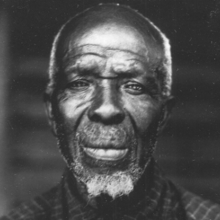

The Last Slave Ship Survivor Gave an Interview in the 1930s. It Just Surfaced

The Last Slave Ship Survivor Gave an Interview in the 1930s. It Just Surfaced

https://www.history.com/news/zora-neale-hurston-barracoon-slave-clotilda-survivor

Zora Neale Hurston’s searing book about the final survivor of the transatlantic slave trade, Cudjo Lewis, is being published nearly a century after it was written.