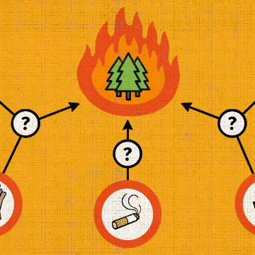
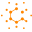

The Math of Causation Puzzle | Quanta Magazine

The Math of Causation Puzzle | Quanta Magazine

https://www.quantamagazine.org/the-math-of-causation-puzzle-20180530/

If a forest is burning and we don’t know what’s responsible, does it have a cause?