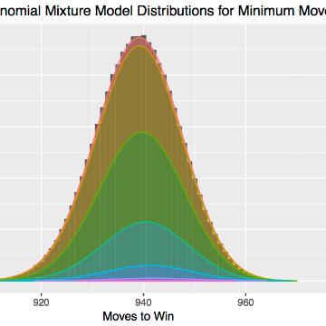

The Mathematics of 2048: Minimum Moves to Win with Markov Chains

The Mathematics of 2048: Minimum Moves to Win with Markov Chains

http://jdlm.info/articles/2017/08/05/markov-chain-2048.html

How many moves does it take to win a game of 2048? Find out using Markov chains!