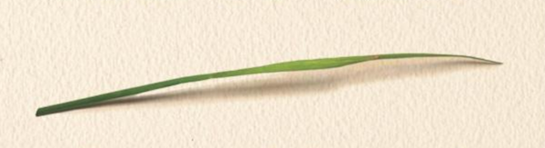
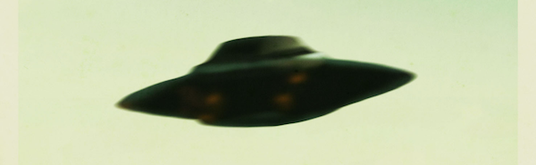
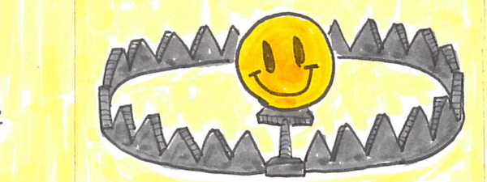
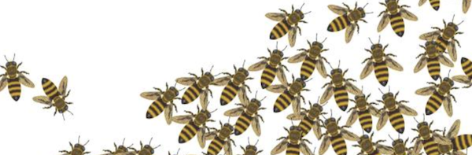
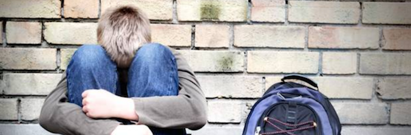
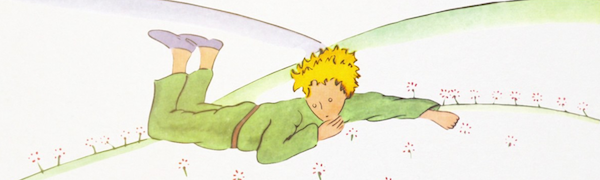
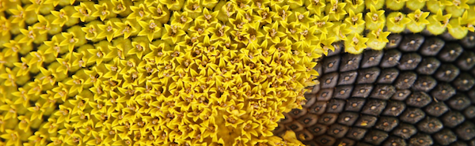
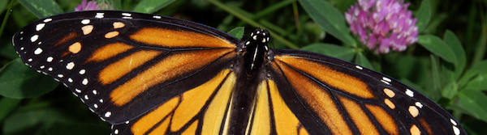
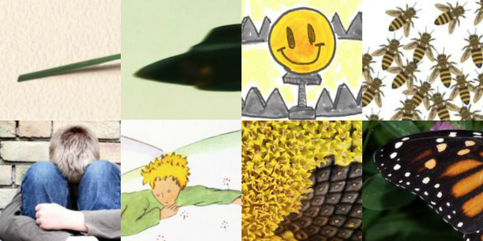

The Most Meaningful Books I Read in 2017

# The Most Meaningful Books I Read in 2017

  posted on Jan 10th, 2018 in [Nicky Reads](http://blog.ncase.me/tag/nicky-reads/)

Yes, this blog post is way past due. A new New Year's Resolution: actually blog on schedule, sheesh.

Last year, I read 40 books – 25 non-fiction, 15 fiction! Of all those, there were *eight books* that resonated deeply with me, both intellectually and emotionally, and I can honestly say I see them affecting me for the rest of my life. (Also see: [the most meaningful books I read in 20*16*](http://blog.ncase.me/the-most-meaningful-books-i-read-in-2016/))

Here they are, in the order I read them:

**[Being Mortal](https://www.amazon.com/Being-Mortal-Illness-Medicine-Matters/dp/1250081246) by Atul Gawande (2015)**

Finding "purpose" or "meaning" isn't just some fluffy first-world problem. It's literally a matter of life or death.

Mixing rich medical information with heart-wrenching personal stories, Atul Gawande (a surgeon) shows how knowing your values can help you live healthier & reduce healthcare costs... and how our current healthcare system causes too many people to suffer unnecessarily, by optimizing for *survival* rather than *meaningful living*.

This book forced me to deeply consider what I value in life. Also, made me realize I need to get a living will, pronto.

**[Abducted](https://www.amazon.com/Abducted-People-Believe-Kidnapped-Aliens/dp/067402401X) by Susan Clancy (2007)**

*“After two years of intense alienography, this is what I conclude. Aliens are entirely and extremely human, the imaginative creations of people with ordinary emotional needs and desires. We don't want to be alone. We feel helpless and vulnerable much of the time. We want to believe there's something bigger and better than us out there. [...] **Being abducted by aliens is a culturally shaped manifestation of a universal human need.**”*

This book is a sympathetic look at the psychology of people who believe they've been abducted by aliens. I started reading for the amusement, finished reading with a profound realization about the human search for meaning.

Also, don't trust the book's low rating on Amazon. It got 1-star bombed by the alien abductee community.

**[The Happiness Trap](https://www.amazon.com/Happiness-Trap-Struggling-Start-Living/dp/1590305841/) by Russ Harris (2007)**

Five years ago, I missed my bus. My train of thought went as follows: *I'm living in a new city* → *I can't even get around in this city* → *how the hell am I supposed to take care of myself, to get a job, to make friends, to eat* → *i'm going to die* → *i deserve to die* → *worthless worthless worthless worthless worthless* and that's how missing a bus caused me to have a very public and very embarrassing panic attack.

Thanks to [a book about Cognitive Behavioral Therapy (CBT) I read last year](http://blog.ncase.me/nicky-reads-feeling-good/), my anxiety disorder is so, *so* much better. However, I soon realized CBT has a couple limits: 1) it's sometimes counter-productive, and 2) it can bring a someone from negative to zero, but not zero to positive.

Enter the topic of this book, Acceptance & Commitment Therapy (ACT). If you want a summary of ACT, [I drew a zine based off this book a couple months ago!](http://blog.ncase.me/the-happiness-trap-zine-ified/) Long story short, thanks to this book, when someone asks me how I'm doing, I can answer more than "not bad" – I can honestly say, "good".

**[Honeybee Democracy](https://www.amazon.com/Honeybee-Democracy-Thomas-D-Seeley/dp/0691147213/) by Tom Seeley (2010)**

BEES. ARE. AWESOME.

Do you know how bees make collective decisions, how bees "do democracy"? Spoiler: BETTER THAN WE DO, DANG IT

People tend to have one of two misconceptions about bees: either that the queen makes all the decisions (she doesn't), or that all the bees are "thinking" the same thing at the same time – a "hivemind". This book, written beautifully and poetically, shows how bees actually *cooperate through competition*: they make collective decisions not via a leader nor blind imitation, but a rigorous, spirited debate. Also, bees communicate through dance. Their debates are dance-offs.

This book really resonated with me because, 1) I love the idea "emergence", how complex wholes can emerge from simple parts. And 2) near the end of the book, Thomas Seeley shows some lessons that we, as human societies, can learn from bee societies.

*“go to the bee / thou poet / consider her ways / and be wise.”*
~ George Bernard Shaw

**[How Children Fail](https://www.amazon.com/Children-Fail-Classics-Child-Development/dp/0201484021/) by John Holt (1964)**

When I first read this book, I didn't know when it was published. I just assumed it was a recent book. It *sounded* like a recent book. It was talking about how kids in schools are bored or scared, how teachers are pressured to only teach to the test, how school beats a *true* love of learning out of the vast majority of students... and I thought, yup, that sounds like the world of 2017.

Then the author mentioned a "recent program" called "New Math", and I thought: *wait.* I checked the publication date. *1964.*

😱

If you didn't already guess, this book isn't really about how children fail us, but how we fail children. Written as half-diary, half-confessional, John Holt shows how – in his teaching experience – children are taught not to love learning, but to please the adults. They're taught not to gain a true understanding, but to cram & guess & regurgitate just enough to survive the power struggle of school.

Since *I* make "educational material", this book deeply resonated with me. I also recommend his follow-up book, [How Children Learn](https://www.amazon.com/How-Children-Learn-John-Holt-ebook/dp/B00ADO79QQ/), where he lists, y'know, actual solutions to these problems.

**[The Little Prince](https://www.amazon.com/Little-Prince-Antoine-Saint-Exup%C3%A9ry/dp/0156012197/) by Antoine de Saint-Exupéry (1943)**

I think I first read this when I was... 7? 8? Way too young to actually remember what it was about, except for the snake-elephant-hat thing. Now that I'm "an adult", I decided to re-read it and *holy crap this book is emotionally DEVASTATING.*

Still, I'm really, really glad I re-read it. Despite reading 15 novels last year, many of them "serious" and "literary" and "for adults"... honestly, this is the *only* one I read in 2017 that deeply resonated with me. At its core, it's about what "grown-ups" tend to value – the visible – versus what really matters in life – the invisible.

Children see the hidden elephant inside the snake. Grown-ups only see the hat.

**[Biomimicry](https://www.amazon.com/Biomimicry-Innovation-Inspired-Janine-Benyus/dp/0060533226/) by Jenine Benyus (2002)**

I learnt about this book through [this 99% Invisible video](https://www.youtube.com/watch?v=iMtXqTmfta0), which told the story of how a Japanese bullet train's design was inspired by the kingfisher bird's beak. But this book is about so much more – it's nothing short of **a powerful *and* practical manifesto**.

The core premise is this: we've only been engineering things for about 10,000 years. Mother Nature's been engineering things for about 3,800,000,000 years. Why not copy her homework?

In this book, Janine Benyus shows how people are *already* taking inspiration from evolution in farming, energy, manufacturing, medicine, computation, business, etc... And since the book was written 16 years ago, it's pretty cool now to see some of those technologies actually take off! (In the "Computation" chapter, she mentions a then-new idea of "artificial neural networks" – which is nowadays the big hot sexy thing)

But it's not just a book full of cool new technologies. Underneath it all, there's a philosophy: we are *a part of* nature, not *apart from* nature. It's about high time we not just accept this, but embrace this.

**[Endless Forms Most Beautiful](https://www.amazon.com/Endless-Forms-Most-Beautiful-Science/dp/0393327795/) by Sean B. Carroll (2006)**

Okay, confession: I only learnt about this book because of this [Acapella Science parody of Despacito](https://www.youtube.com/watch?v=ydqReeTV_vk).

This is a poetic and scientifically rich book about the age-old question: (how is babby formed?) How is life formed? How does a single fertilized egg cell not only divide into *hundreds* of different specialized cells, but *also* make sure those cells are all in the correct place at the correct time?

This may seem like a niche "who cares" kind of question, but the answer to this – **the new science of "evo-devo" and "gene-regulation networks"** – will also help us understand cancer, improve public health, and design new life-saving medical technologies. And, oh yeah, this new field of study is re-writing everything we thought we knew about the evolution of life on earth.

By the way, Sean **B.** Carroll is not to be confused with Sean **M.** Carroll, who *also* writes science books for the general public. (maybe I'll read the other Sean Carroll this year, for completion)

If I were to try to retrofit a couple "common themes" for the top eight books that resonated most with me this year, I'd say it's this:

**What life is** (biology), and
**What a fulfilling life is** (psychology).

If I'm being honest, I felt a bit "stuck" the last year. I'm pretty good at what I currently do, but I also feel the need to *do* something new, to *learn* something new. I guess that's why I was drawn to a lot of biology books last year – I come from an engineering background, a field where everything I work with is very *not* alive – and why this next year, I want to learn about more stuff outside my field of knowledge, including biology.

Also, thanks to [the books I read two years ago (2016)](http://blog.ncase.me/the-most-meaningful-books-i-read-in-2016/), my anxiety disorder got a lot better. But that's only bringing me from negative to zero. I want to go from zero to positive – a *fulfilling* life, not just a "not depressed" life. The books I read in 2017 really helped with that, and I'll try to read/learn/do more in 2018 to improve myself further, as a full human being.

And, you peeps – dear readers and fans – are already helping me figure out my reading list for next year! [I asked for some good recommendations on Twitter, and I got a heckload.](https://twitter.com/ncasenmare/status/947152104069533696) And next year, we'll see which ones get a spot on *The Most Meaningful Books I Read in 2018*.

...hopefully I'm not late with *that* blog post, too.
**<3,**
~ Nicky Case

**[(got more book recommendations for me? send 'em to me in a reply to this tweet!)](https://twitter.com/ncasenmare/status/951121076192497665)**

* * *

## p.s: some runner-ups

Here's some books that I really, *really* liked, but due to whatever arbitrary, idiosyncratic reasons, didn't make the cut for my personal "best of" list. Maybe these will resonate more with you?

My 13 runner-ups, in order of when I read them last year:

- **[Stories of Your Life](https://www.amazon.com/Stories-Your-Life-Others-Chiang-ebook/dp/B0048EKOP0/) by Ted Chiang.** A collection of sci-fi short stories. (The title story got adapted into *Arrival*, my favorite non-Zootopia movie of 2016) All are really clever, but "Understand" was the most mind-warping. I felt *dizzy* after reading it.
- **[Trust](https://www.amazon.com/Trust-Human-Nature-Reconstitution-Social-ebook/dp/B003719FUU/) by Francis Fukuyama.** I used to see "economics" as a cold, detached system, and "culture" as the warm fuzzy stuff. This massive tome shows how culture and economics (and politics and history) are tightly intertwined. (Also: I'm Asian and live in America, yet this book still taught me a lot about Asian & American culture) However, it's dry & sometimes has too much detail, so I recommend skimming through it.
- **[Through The Woods](https://www.amazon.com/Through-Woods-Emily-Carroll-ebook/dp/B00FNVSVUC/) by Emily Carroll.** A collection of creepy stories, told through a beautiful and inventive comics form. Each page feels like a painting. A really disturbing painting. I remember reading "His Face All Red" in its original webcomic form seven years ago, and it *still* haunts me to this day.
- **[Tenth of December](https://www.amazon.com/Tenth-December-Stories-George-Saunders-ebook/dp/B008LMB4C2/) by George Saunders.** A collection of comically dark stories, all of them with a deep, philosophical bent. Every one of George's characters exemplifies that tragic dignity of being human. Also, each story is told in an incredibly inventive format. The first story is told through three different points of view. Another story is told as a series of diary entries. Another is just two pages long, with one of the most abrupt, shocking, and sad endings I've ever read.
- **[Secret of Our Success](https://www.amazon.com/Secret-Our-Success-Evolution-Domesticating-ebook/dp/B00WY4OXAS/) by Joe Henrich.** A science book about the evolution of humans. The core idea: the catalyst that accelerated our evolution was not (just) fire, or tool use, or language – it's *culture*: the ability to pass down your knowledge to the next generation, and your descendants' ability to build upon *that* knowledge, and pass it on their *their* descendants, and so on, and so on.
- **[Watership Down](https://www.amazon.com/Watership-Down-Novel-Puffin-Books-ebook/dp/B002NXOQF2) by Richard Adams.** Surprisingly, the book's *less* dark than the film adaptation! A great adventure book, starring rabbits and severe psychological trauma. You know, for kids.
- **[Designing Your Life](https://www.amazon.com/Designing-Your-Life-Well-Lived-Joyful-ebook/dp/B01BJSRSEC/) by Bill Burnett and Dave Evans.** Based off the popular Stanford course, this book's about applying the principles of product design to "designing your life". Each chapter also comes with a hands-on exercise you can do. However, the book, being based off a college course, it's mostly geared towards college students. Can still be helpful to others, though!
- **[Lifelong Kindergarten](https://www.amazon.com/Lifelong-Kindergarten-Cultivating-Creativity-Projects/dp/0262037297/) by Mitch Resnick.** Since I make things that help people "learn through play", I wanted to read what MIT Media Lab's Mitch Resnick, the creator of Scratch, had to say about it. The book says a lot about how people best learn, but the main thing I took away is that not all kinds of "learning by playing" is equal – and Scratch uses one of its more powerful forms: "learning by *making*". ([This book inspired my project, Joy.js](http://ncase.me/joy/))
- **[If I Understood You, Would I Have This Look on My Face?](https://www.amazon.com/Understood-Would-Have-This-Look/dp/1524781924) by Alan Alda.** A book about communication, but especially *science* communication. Also about how, apparently, improv class solves everything, from teaching social skills to kids with autism, to helping scientists write better grants to get funding.
- **[Connected](https://www.amazon.com/Connected-Surprising-Power-Social-Networks-ebook/dp/B002OFVO5Y/) by Nicholas Christakis and James Fowler.** How are individuals shaped by society? How do individuals, in turn, shape their society? This book is a friendly introduction to the math of social networks (*actual* social networks, not facebook) and presents some original research. Most interestingly, their finding of "Three Degrees of Influence": your health and happiness affects those of your friends, your friends' friends, *and* your friends' friends' friends!
- **[Turtles All The Way Down](https://www.amazon.com/Turtles-All-Down-John-Green-ebook/dp/B072SSMC4H/) by John Green.** John Green, who has anxiety/OCD, wrote this novel with a main character who also has anxiety/OCD. The book is written in a "stream of consciousness" mode, which really captures the feeling of being trapped in an obsessive thought spiral. Since I myself have had an anxiety disorder, I wanted to read this book. It's a good book, but I'd say it's a book for people who want to *understand what OCD feels like*, rather than a book for people who *have* OCD.
- **[Lincoln In The Bardo](https://www.amazon.com/Lincoln-Bardo-Novel-George-Saunders-ebook/dp/B01FPH2N0C/) by George Saunders.** It's Saunders' first full-length novel! As always, it's chockfull of dark comedy, characters with a human tragic dignity, and really weird inventing storytelling. The *entire* book is in the form of quotations – most fictional, some non-fictional – and mixes the actual story of the death of Abraham Lincoln's son, with the story of his son's ghost meeting strange new characters in purgatory. One of the characters has a massive penis.
- **[This Book Is A Planetarium](https://www.amazon.com/This-Book-Planetarium-Extraordinary-Contraptions/dp/1452136211) by Kelli Anderson.** Think "pop-up book" meets "interactive science exhibit". This pop-up book has six fully-functional contraptions: an instrument, an encryption device, a speaker, a perpetual calendar, a spiralgraph, and yes, a planetarium. A really cool concept, beautifully executed.

And the other 19 books I read in 2017 were just okay. Meh.

* * *

if you like my shtuff, you can show your appreciation
by throwing currency at me [on patreon!](http://patreon.com/ncase)
 [zero rights reserved.](https://creativecommons.org/publicdomain/zero/1.0/)

- 

- 

- 