The New Treasures of Pompeii

## The New Treasures of Pompeii

#### From gorgeous artworks to grimacing corpses, archaeologists are still uncovering the truth about life—and death—in the doomed city

By Franz Lidz; Photographs by Chiara Goia

In a 21st-century tribute to antiquity, bronze sculptures by the late Igor Mitoraj, including this centaur, grace the public grounds of the archaeological site. (Chiara Goia)

1.1Kshares[]()[]()[]()[]()[]()[]()

 SMITHSONIAN MAGAZINE | September 2019

If you stand inside the ruins of Pompeii and listen very, very hard, you can almost hear the creaking of cart wheels, the tumult of the marketplace, the echoes of Roman voices. Few modern visitors would care to conjure the ghost city’s most striking feature, its appalling stench—togas were brightened by bleaching with sulfur fumes, animal and human waste flowed down streets whenever it rained heavily—but on this pleasantly piney day in early spring, Pompeii has that peculiar stillness of a place where calamity has come and gone. There’s a whiff of mimosa and orange blossom in the salt air until, suddenly, the wind swoops down the “Vicolo dei Balconi,” Alley of the Balconies, kicking up the ancient dust along with it.

   [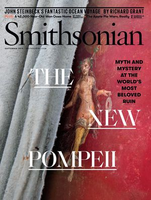](https://subscribe.smithsonianmag.com/sub.php?idx=245&inetz=article-banner-ad&ipromo=%7Cperm%7Csub%7C%7Cbanner%7Cm%7Ccover%7C%7Cauto-default)

###   [Subscribe to Smithsonian magazine now for just $12](https://subscribe.smithsonianmag.com/sub.php?idx=245&inetz=article-banner-ad&ipromo=%7Cperm%7Csub%7C%7Cbanner%7Cm%7Ccover%7C%7Cauto-default)

This article is a selection from the September 2019 issue of Smithsonian magazine

 [(L)](https://subscribe.smithsonianmag.com/sub.php?idx=245&inetz=article-banner-ad&ipromo=%7Cperm%7Csub%7C%7Cbanner%7Cm%7Ccover%7C%7Cauto-default)

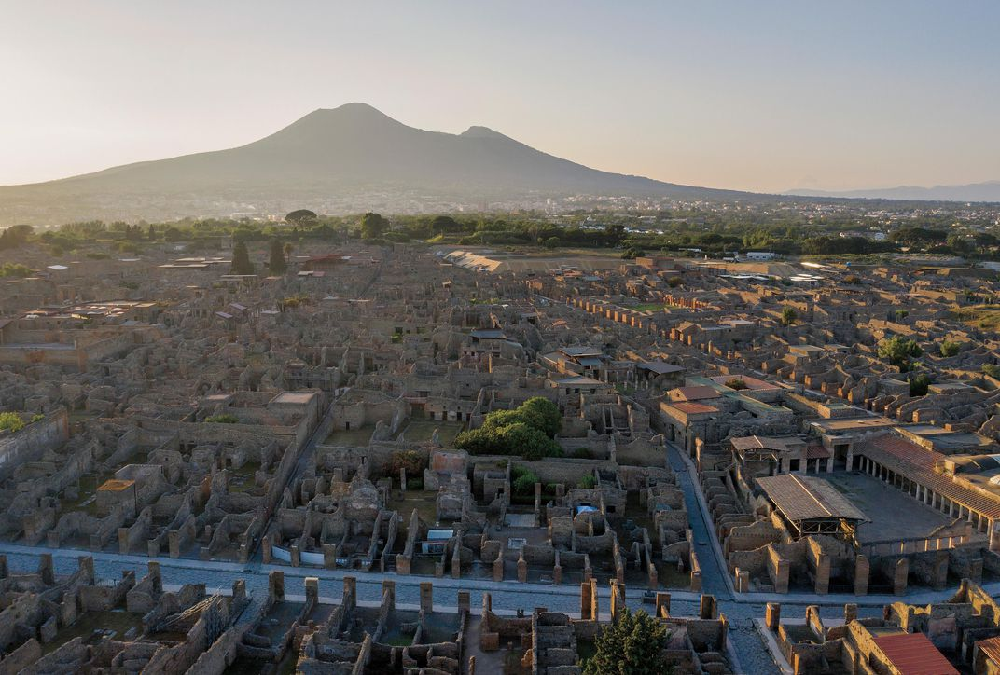

Vesuvius engulfed Pompeii, Pliny the Younger recalled, in darkness that was "as if the light has gone out of a room that is locked and sealed." (Chiara Goia)

In A.D. 79, when Mount Vesuvius rumbled to life after being dormant for nearly 300 years, the alley was entombed and its balconies largely incinerated in the cascades of scorching ash and superheated toxic gases known as pyroclastic surges that brought instant death to the residents of Pompeii. Archaeologists discovered and unearthed the Vicolo dei Balconi only last year, in a part of the site called Regio V, which is not yet open to the public. The alleyway turned out to be lined with grand houses, some with intact balconies, some with amphorae—the terra-cotta containers used to hold wine, oil and* garum*, a sauce made from fermented fish intestines. Now, like nearly all the other scents of Rome’s classical era, the once pungent garum is virtually odorless.

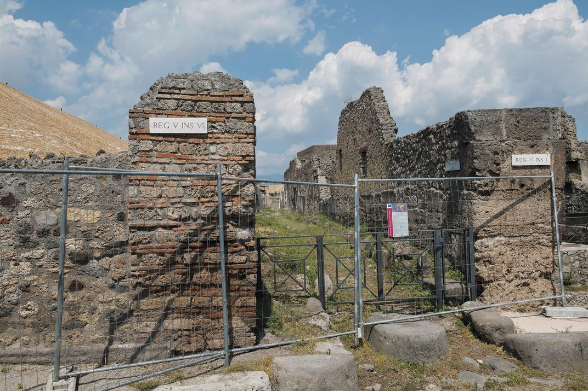

Still off-limits, Regio V will someday be opened to visitors. One-third of Pompeii's 170 acres remain buried and not studied by modern researchers. (Chiara Goia)

Part of the “Grande Progetto Pompei,” or Great Pompeii Project, the $140 million conservation and restoration program launched in 2012 and largely underwritten by the European Union, the Regio V dig has already yielded skeletons, coins, a wooden bed, a stable harboring the remains of a thoroughbred horse (bronze-plated wooden horns on the saddle; iron harness with small bronze studs), gorgeously preserved frescoes, murals and mosaics of mythological figures, and other dazzling examples of ancient Roman artistry.

That’s a surprisingly rich cache for what is arguably the most famous archaeological site in the world. But until now Pompeii has never been subjected to fully scientific excavation techniques. Almost as soon as the clouds of choking volcanic dust had settled, tunneling plunderers—or returning homeowners—grabbed whatever treasures they could. Even during the 1950s, the artifacts that researchers and others found were deemed more significant than the evidence of everyday life in the year 79. So far, the most explosive information to come out of this new excavation—one that will prompt textbooks to be rewritten and scholars to re-evaluate their dates—has no material value whatsoever.

Advertisement

One of the central mysteries of that fateful day, long accepted as August 24, has been the incongruity of certain finds, including corpses in cool-weather clothing. Over the centuries, some scholars have bent over backward to rationalize such anomalies, while others have voiced suspicions that the date must be incorrect. Now the new dig offers the first clear alternative.

Scratched lightly, but legibly, on an unfinished wall of a house that was being refurbished when the volcano blew is a banal notation in charcoal: “*in [d]ulsit pro masumis esurit[ions],*” which roughly translates as “he binged on food.” While not listing a year, the graffito, likely scrawled by a builder, cites “XVI K Nov”—the 16th day before the first of November on the ancient calendar, or October 17 on the modern one. That’s nearly two months after August 24, the fatal eruption’s official date, which originated with a letter by Pliny the Younger, an eyewitness to the catastrophe, to the Roman historian Tacitus 25 years later and transcribed over the centuries by monks.

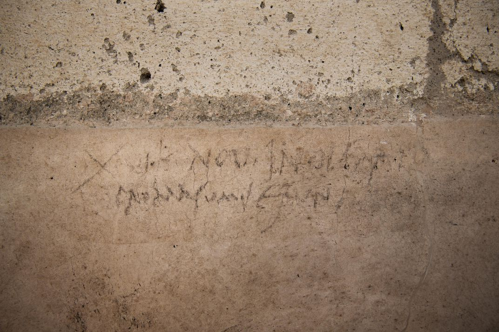

A charcoal inscription, newly uncovered, resets the eruption date from August to October, solving a mystery: Why did shops stock fresh autumn fare like chestnuts? (Chiara Goia)

Massimo Osanna, Pompeii’s general director and mastermind of the project, is convinced that the notation was idly doodled a week before the blast. “This spectacular find finally allows us to date, with confidence, the disaster,” he says. “It reinforces other clues pointing to an autumn eruption: unripe pomegranates, heavy clothing found on bodies, wood-burning braziers in homes, wine from the harvest in sealed jars. When you reconstruct the daily life of this vanished community, two months of difference are important. We now have the lost piece of a jigsaw puzzle.”

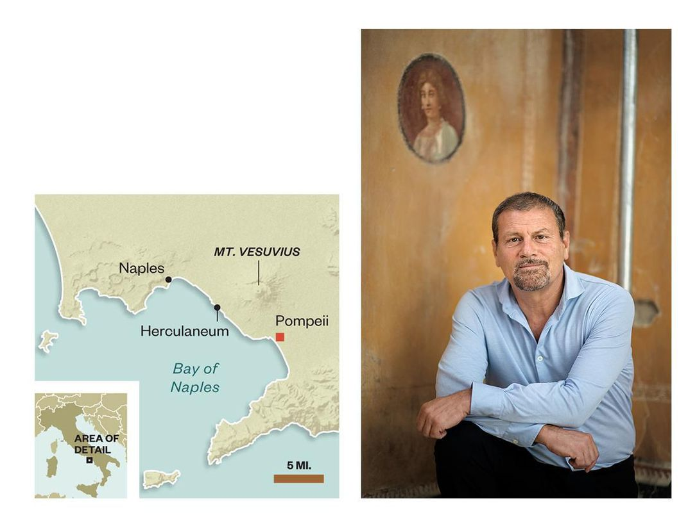

Massimo Osanna is restoring public faith in Pompeii after years of neglect; 3.5 million people visited in 2018, a million more in 2012. (Map by Guilbert Gates; Chiara Goia)

The robust campaign that Osanna has directed since 2014 marks a new era in old Pompeii, which earlier this decade suffered visibly from age, corruption, vandalism, climate change, mismanagement, underfunding, institutional neglect and collapses caused by downpours. The most infamous occurred in 2010 when the Schola Armaturarum, a stone building that featured resplendent frescoes of gladiators, keeled over. Giorgio Napolitano, Italy’s president at the time, called the incident a “disgrace for Italy.” Six years ago, Unesco, the United Nations agency that seeks to preserve the world’s most significant cultural assets, threatened to place Pompeii on its list of World Heritage sites in peril unless Italian authorities gave higher priority to protecting it.

The project has led to the opening, or reopening, of dozens of passageways and 39 buildings, including the Schola Armaturarum. “The restoration of the Schola was a symbol of redemption for Pompeii,” says Osanna, who is also a professor of classical archaeology at the University of Naples. He has assembled a vast team of more than 200 experts to conduct what he terms “global archaeology,” including not only archaeologists but also archaeozoologists, anthropologists, art restorers, biologists, bricklayers, carpenters, computer scientists, demographers, dentists, electricians, geologists, geneticists, mapping technicians, medical engineers, painters, plumbers, paleobotanists, photographers and radiologists. They’re aided by enough modern analytical tools to fill an imperial bathhouse, from ground sensors and drone videography to CAT scans and virtual reality.

 [**]()  [**]()
 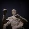

 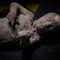

 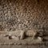

 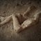

 

 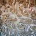

 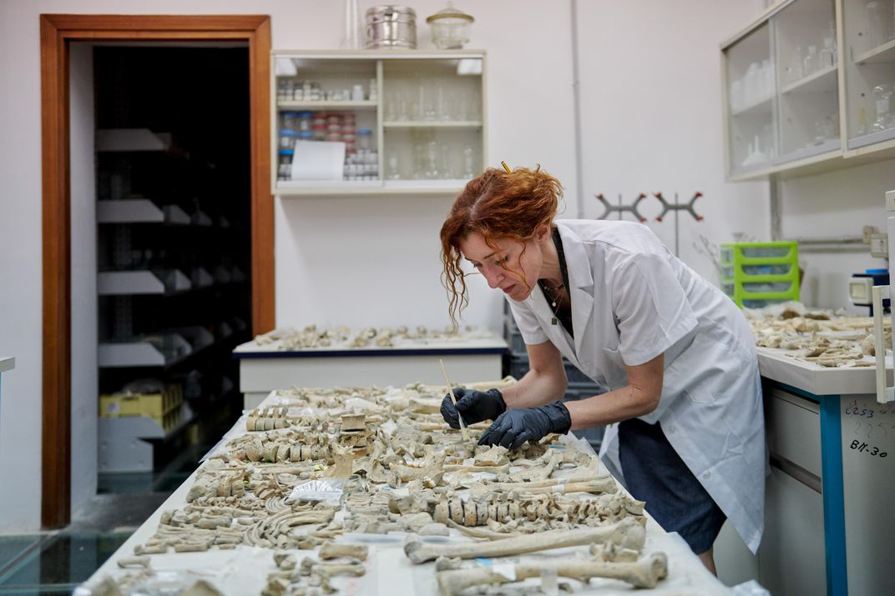

Anthropologist Valeria Moretti cleans bones of six people found huddled together in a house in the Regio V site, still off-limits to the public. (Chiara Goia)

 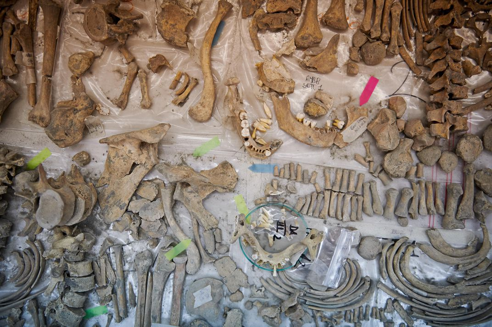

The bones of the six victims are now kept in the Laboratory of Applied Research at Pompeii. (Chiara Goia)

Advertisement

At the time of the cataclysm, the city is said to have had a population of about 12,000. Most escaped. Only about 1,200 bodies have been recovered, but the new work is changing that. Excavators in Regio V recently uncovered skeletal remains of four women, along with five or six children, in the innermost room of a villa. A man, presumed to be somehow connected to the group, was found outside. Was he in the act of rescuing them? Abandoning them? Checking to see if the coast was clear? These are the sorts of riddles that have been seizing our imaginations since Pompeii was discovered.

The house in which this horror played out had frescoed rooms, suggesting that a prosperous family lived within. The paintings were preserved by the ash, streaks of which still stain the walls. Even in the current unrestored state, the colors—black, white, gray, ocher, Pompeii red, deep maroon—are astonishingly intense. As you step from room to room, over one threshold into another, finally standing in the spot where the bodies were found, the immediacy of the tragedy gives you chills.

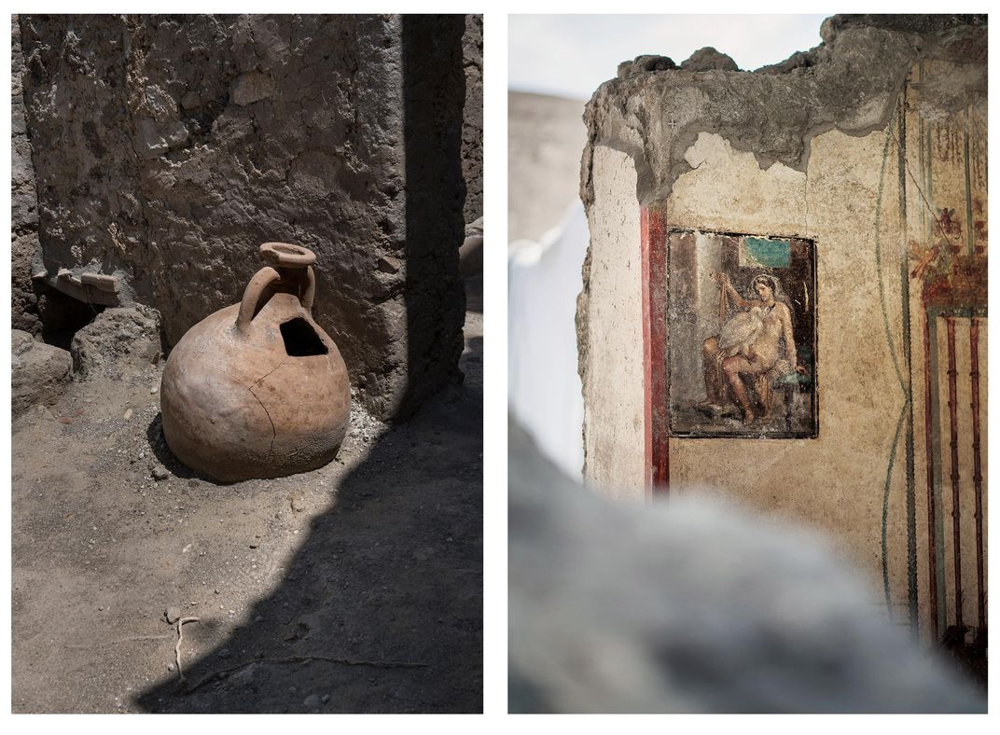

Left: A remarkably intact terra-cotta amphora found in Regio V's House of the Garden would have held wine, olive oil or dried fruit.

Right: A 13- by 18 inch fresco, also newly uncovered, of Leda, raped by Jupiter in a swan guise, was built up from as many as six or seven layers of plaster under pigments. (Chiara Goia)

Back outside on the Vicolo dei Balconi, I walked by archaeological teams at work and came across a freshly uncovered snack bar. This mundane convenience is one of some 80 scattered through the city. The large jars (*dolia*) embedded in the masonry serving-counter establish that this was a Thermopolium, the McDonald’s of its day, where drinks and hot foods were served. Typical menu: coarse bread with salty fish, baked cheese, lentils and spicy wine. This Thermopolium is adorned with paintings of a nymph seated on a sea horse. Her eyes seem to be saying “Hold the fries!”—but maybe that’s just me.

As I walk the Roman street, Francesco Muscolino, an archaeologist who was kindly showing me around, points out the courtyards, election notices and, scratched into the outer wall of a home, a lewd graffito thought to be targeted at the last occupants. Though he cautions that even the Latin is practically unprintable, he tries his best to clean up the single entendre for a family readership. “This is about a man named Lucius and a woman named Leporis,” he says. “Lucius probably lived in the house and Leporis appears to have been a woman paid to do something...erotic.”

I later ask Osanna if the inscription was meant as a joke. “Yes, a joke at their expense,” he says. “It was not an appreciation of the activity.”

Advertisement

[](https://adclick.g.doubleclick.net/pcs/click?xai=AKAOjstmAy_UgIq1g2CuuJ2arPVQGeo-z12ycaPHebn9SUg-ALtztF9A1lcITPoNLQHIxQkkL7NMvAO4MwlOVvJZTFcbf2UsKtMbSB29DGhA0LIz3dCI4gVMpEvZTPJqyQsjcO508zWQJMHYaV_RMY_04aOThK0F4Euz0lud9nYFgxBcgCllW4p3JLcMgyTyyR0PJJ_Ocl2K5NyM-kBmczPfXxdfabvgrAjfCMXqhvTpXRSoQGvPU3N1NB2qYobe9cY8GypXv_sjY_lz2W-f3-ZfdGDAQahJlWMaKW-tJZK_6zBkUatAm6LLAGm8nJx-ARP6uYjD7iIGxQ4TmyAS1FcOCMrOQvpAowSydu9kKim9Ex-wPxwyQoqGd_IM4TKeJyIzJbdxzCOH7o1bXNRXytSgnJTQbbeEQiZAwGWL21HhtY4cUwtytT_0Pn7DzP12tTdz35YmvPbjuknNzGJ5SgXAPq6diYTeNRXmia4Yb-sxLqFaoiubVVcahAag1EK4JwcO7Qy6GC0zS4nSZDuNo2wFKUmtjjL-WpW6_9UGTPRfXQwv_htnBzvrpkiweezm5XheyAQ2szbiMpmj01ADxyRmmQ_jjpZBHJ7HFbTqBKdVdAy5VoRuNsQ36drB2XQiuA37ZC4VPZ8CvDY0qgs_RaDbREGst1UWdTE3h6oFbiCaDJOUZAiRC9POSJoW8r6HujdsIz8ORBN87h0uMqb6Yrcs-E0WpV0RxV30sTwVWqhO7sZUS6MwQ7WW3FosNlCvro7mYazvcQI6eCP9s8v0BVflrSv7yvvFeX94sWz3nJ4aTHOQxWf7csBMKFUnryDyBDQjlknkk-tpi3mYWPtpphW-VG5Xx6B2VHbN7xvn6mSfal4nSevM8VH2RfrBLVtFPMNZbifvgYxWE6TV8mQxmDIzQHXdNwiyWPixrxvbevX2VDo2EAAufWr1G47MxA_OzNkXUHOxy73CbAhXfRyd2jHNj08w17ym2v0KFas82ra17spRjKfBmkD0JrZ5FvtbFQKxkzxaHT0RGXzGZV_ddRU4B-HVtyIcGpvjhTQ8jjkAaHGPmk92Wrx5RihZZbOiwB6u&sai=AMfl-YR6HC90lf21Gj72Fj2wArtqcIEAFTLoxZxwNeRVYVZhel6GD6PNwr6YjBChuFPqQpwC8OXt0PEKt7lV7wEHT9h76eSbF5Mzb5xvLqzR8vstQUB8b3HoZg64EPwRVBIgSJU&sig=Cg0ArKJSzA6Z3VGhmLYA&urlfix=1&adurl=https://www.northamericatravelservice.co.uk/state/utah/%3Futm_source%3Dck%26utm_medium%3Dbanner%26utm_campaign%3Dclarke%2520and%2520king)

* * *

Osanna laughs softly at the mention of a rumor he spread to combat theft at the site, where visitors regularly attempt to make off with souvenirs. “I told a newspaper about the curse on objects stolen from Pompeii,” he says. Since then, Osanna has received hundreds of purloined bricks, fresco fragments and bits of painted plaster in packages from across the world. Many were accompanied by letters of apology claiming that the mementos had brought bad luck. A repentant South American wrote that after he pinched a stone, his family “had nothing but trouble.” An Englishwoman whose parents had pocketed a roof tile while on their honeymoon returned it with a note: “All through my childhood this piece was showcased at my home. Now that they are both dead, I want to give it back. Please, don’t judge my mother and father. They were children of their generation.”

Osanna smiles. “From the point of view of tourist psychology,” he says, “her letter is an incredible treasure.”

The smallish, roundish Osanna wears a suede jacket, a trim Vandyke beard and an air of becoming modesty. He looks faintly out of place in his office at the University of Naples, seated behind a desk and surrounded by computer monitors, with only the high-rises of the city in view and not a trace of rubble anywhere. On his desk is [*Pompeianarum Antiquitatum Historia*](https://amzn.to/2H8vkc8), by Giuseppe Fiorelli, the archaeologist who took charge of the excavations in 1860. It was Fiorelli, Osanna tells me, who had liquid plaster poured into the cavities left in the volcanic ash by bodies that had long since rotted away. Once the plaster had set, workers chipped away at the encasing layers of ash, pumice and debris to remove the casts, revealing the posture, dimensions and facial expressions of Pompeiians in their final moments. To Osanna, the results—tragic figures caught writhing or gasping for breath with their hands covering their mouths—are grim reminders of the precariousness of human existence.

Osanna himself grew up near the extinct volcano Monte Vulture in the southern Italian hill town of Venosa, birthplace of the lyric poet Horace. According to local legend, Venosa was founded by the Greek hero Diomedes, King of Argos, who dedicated the city to the goddess Aphrodite (Venus to the Romans) to appease her after the defeat of her beloved Troy. The Romans wrenched the town from the Samnites in 291 B.C. and made it a colony.

Advertisement

As a child, Osanna frolicked in the ruins. “I was 7 when I found a skull in the necropolis under the medieval church in the center of town,” he recalls. “That emotional moment was when I fell in love with archaeology.” At 14, his stepfather took him to Pompeii. Osanna remembers feeling thunderstruck. He came under the spell of the ancient city. “Still, I never imagined I would someday be involved in its excavation,” he says.

He went on to earn two doctoral degrees (one in archaeology, the other in Greek mythology); study the second-century Greek geographer and travel writer Pausanias; teach at universities in France, Germany and Spain; and oversee the ministry of archaeological heritage for Basilicata, a region of southern Italy famous for its shrines and churches dating from antiquity to medieval times, and its 9,000-year-old cave dwellings. “Near the Bradano River is the Tavole Palatine, a temple dedicated to the Greek goddess Hera,” Osanna says. “Given that it was built in the late sixth century B.C., the structure is very well preserved.”

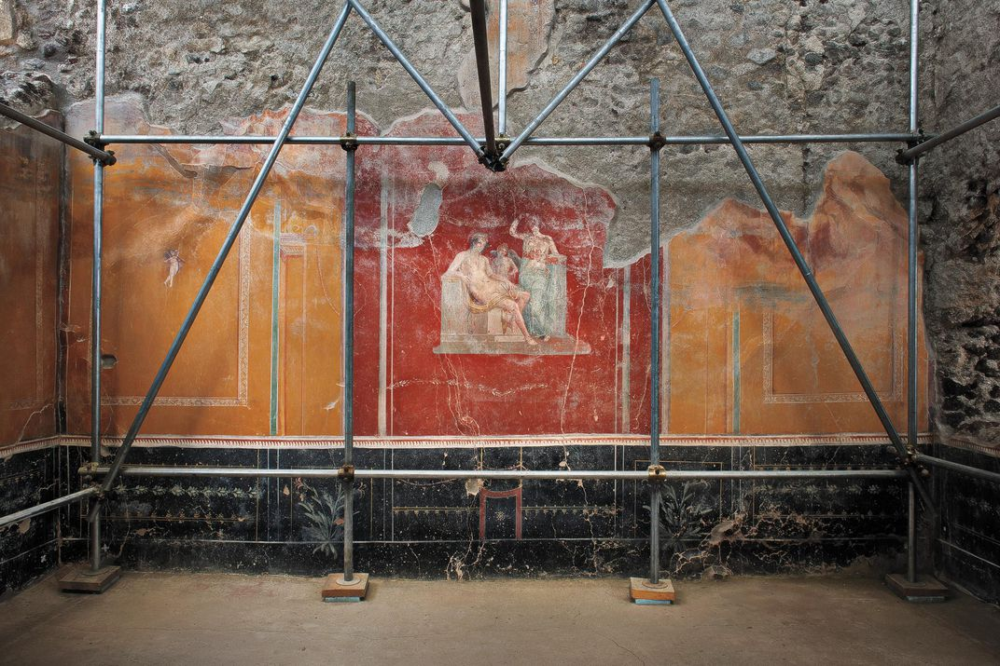

A recently exposed fresco shows Adonis, a Greek, with Venus, a Roman goddess. Mythology reflects political reality: Victorious Rome adopted Greek culture. (Chiara Goia)

Pompeii wasn’t so lucky. Today’s archaeological park is largely a rebuild of a rebuild. And no one in its long history rebuilt more than Amedeo Maiuri, a human dynamo, who, as superintendent from 1924 to 1961, directed digs during some of Italy’s most trying times. (During World War II, the Allied aerial assault of 1943—more than 160 bombs dropped—demolished the site’s gallery and some of its most celebrated monuments. Over the years, 96 unexploded bombs have been found and inactivated; a few more are likely to be uncovered in areas not yet excavated.) Maiuri created what was effectively an open-air museum and hired a staff of specialists to continuously watch over the grounds. “He wanted to excavate everywhere,” says Osanna. “Unfortunately, his era was very poorly documented. It is very difficult to understand if an object came from one house or another. What a pity: His excavations made very important discoveries, but were carried out with inadequate instruments, using inaccurate procedures.”

After Maiuri retired, the impetus to excavate went with him.

* * *

Advertisement

[](https://adclick.g.doubleclick.net/pcs/click?xai=AKAOjsv8u5dIeNyybpWsckVe1iU8vNuOdJyBspT2k6nz5_2pZdWquXVRHtM2do0h-JhFJW3tvrEmSqCcJUp-rHYeDwT4xdlLK6gWi1yz2nnIr-SCZQEYc0LM4zATVuiwlGIqK5rM27Wht8mlSycvyzg_P1D9KuQntCFc6AIvXN7yPoVr9Rv0wJnF0UCUXPUj4EO30SDactMj10qwF0nD2lGKLb5SstiCv-Tp1SLWxY3osl3k7Z2WE3KErOZnjavOvQ7AQGRnpRWe3ZtCFBBS5OfmSYEA_R7L1WqKELJ0cMWYjg13JSCd3wjfR0CvUG1jGryVh5EUlw0AvmdSqBdyZ34XfBc_6bYYaUa7wtzo2BGXYXdsqJiv5e5dkfmNbkM8r0BENFkfYoMc0VehLWSO86oJUdE3ZrwuDgcmuS8P-Qt0giee8JTvwqCUprSHgQ8LsybE37clY6chG79s7XtGomCiVI9ImiQYNhGQOWPZPqpzfH5ExOxkwSiuepJoIKIX27XAZ47vm_N6QgvpppLJY9gw5y4ZjH0Y97yZ5s4cTqelRMxoaFQ46f7bkPcTpyWcwsLeAG6RpQXP82xWoppTlTiYmbe2osNzDbykLTFlb0pxD8Vmzu8E0uyZPs-Xlav4xkyprtYrZXHyZYs5d8q-xa_WbzLC86MKgCQG1xLvdxaRzeE2BAOtFV8qgVOoTkyGqLrArT8sNS2szPZJ2z6MmBI2PiHzUK7FvCXH01f3SLiyAssJbcLKU3Y--BYq2FQ0yolxF3FG9xmvvb2qDB8sVHL_yNt43NhcJqxp9VvBLEltKY8ZSiOZSUvOKQbVdrI2J6NpjiJnxQBltLE3qq2nFKhttKIGKda_bf0U2bgM5q1WX9MliGfFD3J1BMa59KkooKAL17uaTjS0jj42be038lLVFfO3j-_zNCmpScsT2r5mz0_3dFyVPyxJboZ6Cnp1KdMBhhvenlMw6Ddg_6oHH2cq4ew2S5VxcBcvPiFDW1D9avbWRGybmcWLHleskV3MWjrcHqcTDntaM7Jc8-ukkSLcYqioSmsOtXmEzZbBSBsY6I8RfrpCDsN3&sai=AMfl-YTbjYM4NwjQlean7CwRfnR5LYSdYCdv1kLvjBqzyWaarwHdtkbAgOSI81EQLI_YQhswb37tgHBTDuOo9WXIm5zM7sJnYBTuTe5wpJI0i0DkTwDEdvUR_9blvY4gulntvJU&sig=Cg0ArKJSzAFVA0lnM6US&urlfix=1&adurl=https://www.selectcarleasing.co.uk/car-leasing/nissan/juke/hatchback/16-112-tekna-5dr-cvt-bose/%3Fterm%3D48%26mileage%3D5000%26initialpayment%3D9%3Futm_source%3Dww%26utm_medium%3Dbanner%26utm_campaign%3Dweb%2520windows)

When Osanna took over, the Italian government had slashed spending on culture to the point where ancient Pompeii was falling down faster than it could be repaired. Though the site generated more tourist revenue than any monument in Italy except the Colosseum, so little attention had been paid to day-to-day upkeep that in 2008 Silvio Berlusconi, then prime minister, declared a state of emergency at Pompeii and, to stave off its disintegration, appointed Marcello Fiori as the new special commissioner. It didn’t take long for the restorer to disintegrate, too. In 2013, Fiori was indicted after he allegedly awarded building contracts inflated by as much as 400 percent; spent $126,000 of taxpayers’ money on an adoption scheme for the 55 feral dogs wandering forlornly amid the ruins (about $2,300 per stray); $67,000 on 1,000 promotional bottles of wine—enough to pay the annual salary of a badly needed additional archaeologist; $9.8 million in a rush job to repair seating at the city’s amphitheater, altering its historical integrity by cementing over the original stones; and $13,000 to publish 50 copies of a book on Fiori’s *extraordinary* accomplishments.

Osanna took the job somewhat reluctantly. The archaeological site was beset by labor strife, work crews had been infiltrated by the powerful Naples Camorra mafia, buildings were crumbling at an alarming rate. To revive interest in the place and its history, Osanna mounted a popular exhibition focused on victims of the eruption, preserved in plaster. He gave visitors the opportunity to explore the site by moonlight, with guided tours, video installations and wine tastings based on an ancient Roman recipe. “It’s always difficult to change the culture,” he says. “You can achieve change, I think, step by step.”

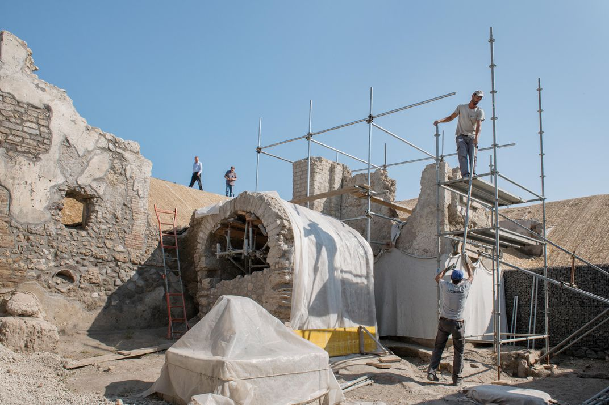

In addition to stabilizing structures, archaeologists install extensive drainage to divert destructive rainwater. (Chiara Goia)

Having spent much of his first three years safeguarding what had already been uncovered, Osanna began to probe an untouched wedge of land in Regio V, considered the last great explorable section of the city. While bolstering the fragile walls, his team was soon disabused of the notion that Pompeii was preserved completely intact there. “We found traces of digs going back to the 1700s,” he says. “We also found a more contemporary tunnel that extended for more than 600 feet and ended in one of the villas. Evidently, tomb raiders got there first.”

The new excavation—which has also put a stop to looting—has opened a window on early post-Hellenistic culture. The entrance hall of one elegant home features the welcoming image of the fertility god Priapus, weighing his prodigious *membrum virile* on a scale like a prize-winning zucchini. Dominating a wall of the atrium is a stunning fresco of the hunter Narcissus leaning languidly on a block of stone while contemplating his reflection in a pool of water.

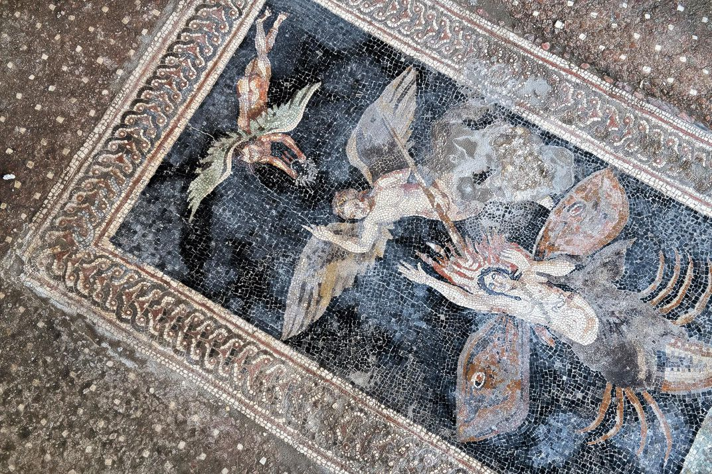

Discovered only last year, a floor mosaic of Orion turning into a constellation hints at the influence of Egypt, where the study of astronomy was revered. (Chiara Goia)

Embellished with a tracery of garlands, cherubs and grotesques, the bedroom of the same house contains a small, exquisite painting depicting the eroticized myth of Leda and the Swan. Half-nude, with dark eyes that seem to follow the observer, the Spartan queen is shown in flagrante with Jupiter disguised as a swan. The king of the gods is perched on Leda’s lap, claws sunk into her thighs, neck curled beneath her chin. Osanna says the explicit fresco is “exceptional and unique for its decisively sensual iconography.” He speculates that the owner of the house was a wealthy merchant, perhaps a former slave, who displayed the image in an attempt to ingratiate himself with the local aristocracy. “By flaunting his knowledge of the myths of high culture,” he says, “the homeowner could have been trying to elevate his social status.”

Advertisement

One floor design found in the House of Jupiter stumped archaeologists: A mosaic showing a winged half-man, half-scorpion with hair ablaze, suspended over a coiled snake. “As far as we knew, the figure was unknown to classical iconography,” says Osanna. Eventually he identified the character as the hunter Orion, son of the sea god Neptune, during his transformation into a constellation. “There is a version of the myth in which Orion announces he will kill every animal on Earth,” Osanna explains. “The angered goddess Gaia sends a scorpion to kill him, but Jupiter, god of sky and thunder, gives Orion wings and, like a butterfly leaving the chrysalis, he rises above Earth—represented by the snake—into the firmament, metamorphosing into a constellation.”

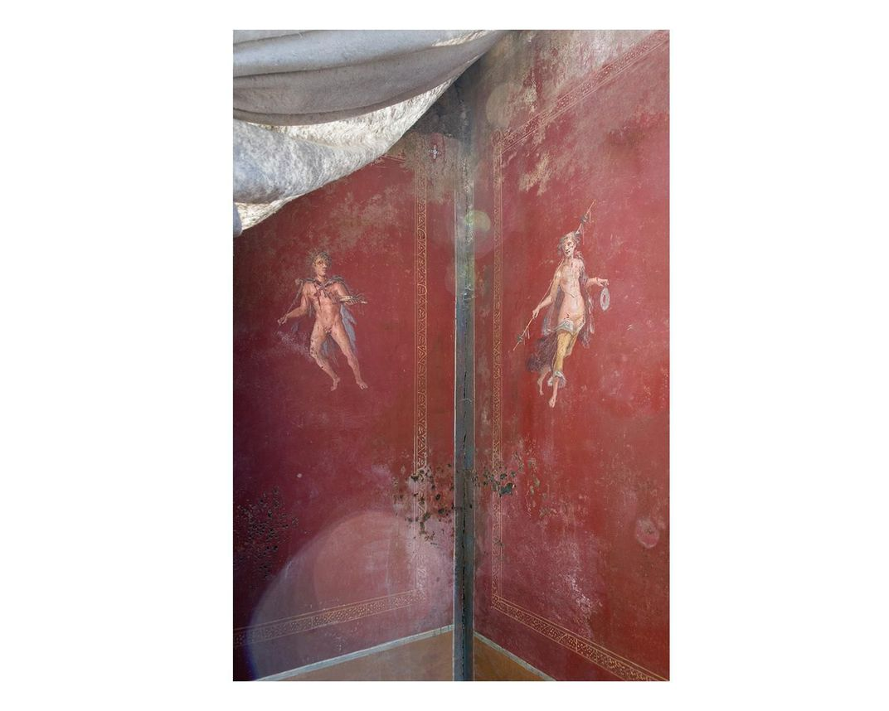

In the exceptionally luxurious Casa di Leda, decorations on an atrium wall include a satyr and nymph associated with the cult of Dionysus. (Chiara Goia)

Roman religious practices were evident at a villa called the House of the Enchanted Garden, where a shrine to the household gods—or *lararium*—is embedded in a chamber with a raised pool and sumptuous ornamentation. Beneath the shrine was a painting of two large snakes slithering toward an altar that held offerings of eggs and a pine cone. The blood-red walls of the garden were festooned with drawings of fanciful creatures—a wolf, a bear, an eagle, a gazelle, a crocodile. “Never before have we found such complex decoration within a space dedicated to worship inside a house,” marvels Osanna.

 [**]()  [**]()
 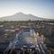

 

 

 

 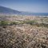

 

 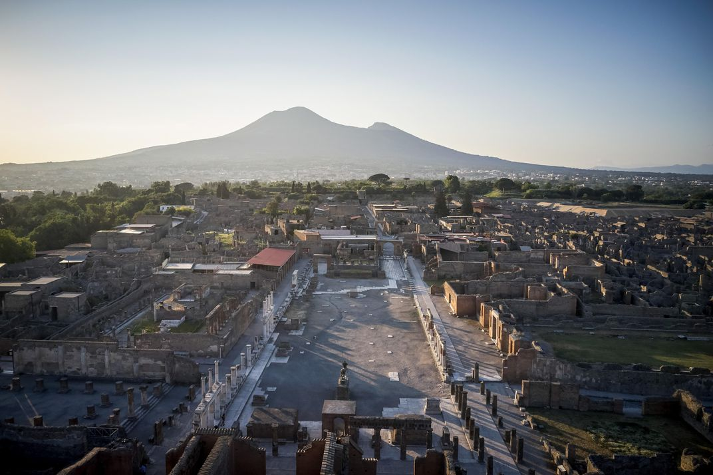
Drone view of Pompeii at sunset. (Chiara Goia)

One of the first really sensational discoveries was the skeleton of a man who at first seemed to have been decapitated by a massive flying slab of rock as he fled the eruption. The rock jutted out of the ground at an angle, with the man’s torso protruding and intact from the chest down, like some Romanic Wile E. Coyote. Man and rock were found at a crossroads near the first floor of a building, slightly above a thick layer of volcanic lapilli. Rather than having been beheaded, however, the 30-something fugitive may have taken refuge in his home in the hours after the initial explosion, leaving only when he thought the danger had passed. The archaeologists established that the man had an infected leg that caused him to limp, hampering his escape. “The stone block may have been a doorjamb catapulted by the force of the volcanic cloud,” says Osanna. “But it appears that the man was killed by the lethal gases of the disaster’s later stages.”

He and his team drew this conclusion from the missing arms, thorax and skull later found three feet below the body. Presumably, a tunnel dug during an 18th-century excavation of Pompeii had caved in, burying the open-mouthed skull—which has lots of teeth and only a few fractures. Beneath the skeleton lay a leather pouch containing an iron key, about 20 silver coins and two bronze coins. “If this is a house key, the man might have taken it with him, thinking there was the possibility to come back, no?”

* * *

Advertisement

The paradox of Pompeii, of course, is that its very annihilation was its salvation, and that the volcanic violence created the enduring narrative of an entire town frozen in time, its inhabitants baking bread, shaking hands, making love. In 1816, this seeming contradiction inspired in Goethe “the painful thought that so much happiness had to be erased, in order to preserve such treasures.”

To preserve Pompeii’s first-century treasures and decipher a history related to the larger narrative of classical antiquity, Osanna has embraced 21st-century technology. “We must leave for the next generation documentation that is very rich in comparison to what previous excavators left to us,” he says. “We can now obtain information that was once impossible to get. This is the real revolution.” Satellites assess risks of flooding to the site today. Ground sensors collect data seismically, acoustically and electro-optically. Drones produce 3-D imaging of houses and document the dig’s progress. CAT scans sweep away old certainties by peering into Fiorelli’s thick plaster casts and drawing a clearer picture of victims and what happened to them. Laser scanning has shown, among other findings, that Pompeiians had excellent teeth thanks to a fiber-rich, low-sugar diet.

“Through DNA analysis we can learn age, sex, ethnicity and even disease,” Osanna says. One plaster figure long believed to be a man was revealed to be female. The famous “Muleteer,” a crouched male who appeared to be shielding his face from the fumes, turned out to have no arms. (Was he born without them? Were they hacked off? The plaster arms were apparently “sculptural improvements” added to the cast in the 20th century.) And Pompeii’s celebrated “Two Maidens” locked in a poignant embrace may, in fact, have been young male lovers. “They were not related,” says Osanna. “It’s a fair hypothesis.”

Determining family relationships will be a key objective of the genetic research. Another: assessing the diversity of Pompeii’s population. “With all the talk about ethnic purity, it’s important to understand how mixed we are,” says Osanna. “This sense of proximity to our time is critical.”

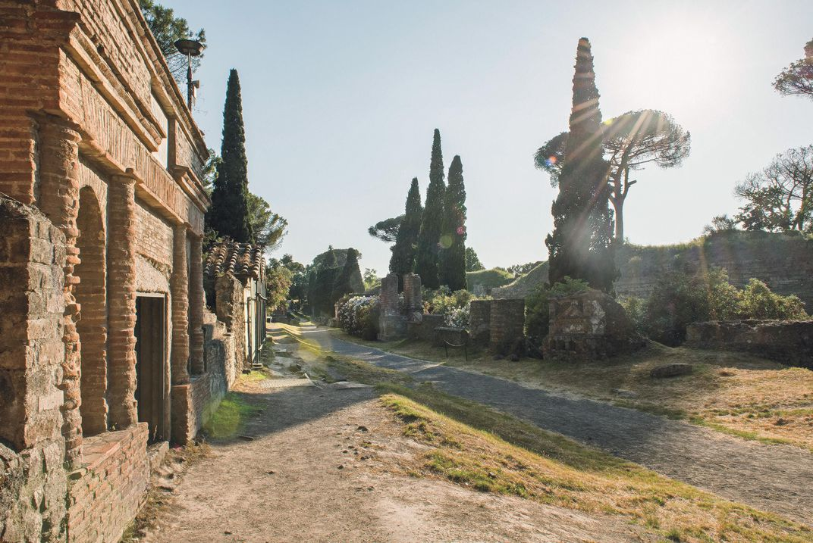

Pompeii's extensive necropolis sites were set outside the city, in order to separate the world of the dead, regarded as tainted, from that of the living. (Chiara Goia)

Pompeii now seems more secure than it has since October 23, 79 A.D. Mary Beard, the Cambridge University classicist and reigning authority on Roman history, contends that the wisest course might be to stop digging for new answers: “One-third of the town is underground, and that is where it should stay, safe and sound, for the future. Meanwhile, we can look after the other two-thirds as best we can, delaying its collapse as far as is reasonable.”

Advertisement

Not far from the Regio V dig is a storeroom packed with just-bared artifacts— pottery, paint pots, plaster moldings—the puzzle pieces of life in a city locked in an unending cycle of being lost and found. The glorious mundanity—chunked up with sex, money and gossip—foreshadowed by the knowledge that it will end badly, like a “Real Housewives” reality show. “Pompeii has so many similarities with our present,” says Osanna. “Its past is never completely in the past.”

   **About the Author**: Chiara Goia is an Italian documentary and fine arts photographer who has won the Sony World Photography Award in Arts and Entertainment, and the Canon prize for emerging photographers. Her work has appeared in such publications as *National Geographic*, *TIME* and *Vanity Fair*. [Read more articles from Chiara Goia](https://www.smithsonianmag.com/author/chiara-goia/) and [Follow on Twitter @chiaraggoia](https://twitter.com/chiaraggoia)

   **About the Author**: A longtime Senior Writer at *Sports Illustrated* and the author of several memoirs, Franz Lidz has written for the *New York Times* since 1983, on travel, TV, film and theater. He is a frequent contributor to *Smithsonian*. [Read more articles from Franz Lidz](https://www.smithsonianmag.com/author/franz-lidz/)

## Comment on this Story

What do you think?
237 Responses

Upvote

Funny

Love

Surprised

Angry

Sad

- [0 comments]()
- [**Smithsonian Magazine**](https://disqus.com/home/forums/smithsonianmagazine/)
- [Marc Cohen](https://disqus.com/embed/comments/?base=default&f=smithsonianmagazine&t_i=article-new-treasures-pompeii&t_u=https%3A%2F%2Fwww.smithsonianmag.com%2Fhistory%2Fnew-treasures-pompeii-180972829%2F&t_d=The%20New%20Treasures%20of%20Pompeii%20%7C%20History%20%7C%20Smithsonian&t_t=The%20New%20Treasures%20of%20Pompeii%20%7C%20History%20%7C%20Smithsonian&s_o=default#)
- [](https://disqus.com/home/inbox/)
- [ Recommend  11](https://disqus.com/embed/comments/?base=default&f=smithsonianmagazine&t_i=article-new-treasures-pompeii&t_u=https%3A%2F%2Fwww.smithsonianmag.com%2Fhistory%2Fnew-treasures-pompeii-180972829%2F&t_d=The%20New%20Treasures%20of%20Pompeii%20%7C%20History%20%7C%20Smithsonian&t_t=The%20New%20Treasures%20of%20Pompeii%20%7C%20History%20%7C%20Smithsonian&s_o=default#)
- tTweetfShare
- [Sort by Best](https://disqus.com/embed/comments/?base=default&f=smithsonianmagazine&t_i=article-new-treasures-pompeii&t_u=https%3A%2F%2Fwww.smithsonianmag.com%2Fhistory%2Fnew-treasures-pompeii-180972829%2F&t_d=The%20New%20Treasures%20of%20Pompeii%20%7C%20History%20%7C%20Smithsonian&t_t=The%20New%20Treasures%20of%20Pompeii%20%7C%20History%20%7C%20Smithsonian&s_o=default#)

Start the discussion…

Be the first to comment.

- [Powered by Disqus](https://disqus.com/)
- [*✉*Subscribe*✔*](https://disqus.com/embed/comments/?base=default&f=smithsonianmagazine&t_i=article-new-treasures-pompeii&t_u=https%3A%2F%2Fwww.smithsonianmag.com%2Fhistory%2Fnew-treasures-pompeii-180972829%2F&t_d=The%20New%20Treasures%20of%20Pompeii%20%7C%20History%20%7C%20Smithsonian&t_t=The%20New%20Treasures%20of%20Pompeii%20%7C%20History%20%7C%20Smithsonian&s_o=default#)
- [*d*Add Disqus to your site](https://publishers.disqus.com/engage?utm_source=smithsonianmagazine&utm_medium=Disqus-Footer)
- [**Disqus' Privacy Policy](https://help.disqus.com/customer/portal/articles/466259-privacy-policy)

###### Current Issue | September 2019

[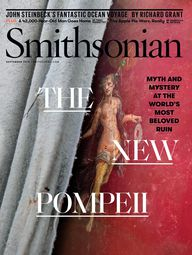](https://www.smithsonianmag.com/issue/september-2019/)

- [John Steinbeck's Epic Ocean Voyage Rewrote the Rules of Ecology](https://www.smithsonianmag.com/arts-culture/ship-sent-john-steinbeck-epic-ocean-voyage-may-ride-again-180972847/)

- [A 42,000-Year-Old Man Finally Goes Home](https://www.smithsonianmag.com/history/mungo-man-finally-goes-home-180972835/)

- [Saturn Could Lose Its Rings in Less Than 100 Million Years](https://www.smithsonianmag.com/science-nature/saturns-rings-are-slowly-disappearing-180972856/)

 [View Table of Contents](https://www.smithsonianmag.com/issue/september-2019/)

###### Subscribe

Save 84% off the newsstand price!

 Last Name

 First Name

 Address 1

 Address 2

 City

 State
 AL

 Zip

 Enter your email address

 *or*  [Give a Gift](https://subscribe.smithsonianmag.com/gift.php?idx=246&inetz=www-page-subscription-form&ipromo=|perm|gift||banner|m|embedded-form|338x440|)

##### Newsletters

Get the best of Smithsonian.com by email. Keep up-to-date on:

- History

- Science & Innovation

- Art

- Travel

- Special Offers

###### Sign-Up Now

 Enter your email address

 [Privacy Policy](https://www.smithsonianmag.com/about/privacy/), [Terms of Use](https://www.si.edu/termsofuse)