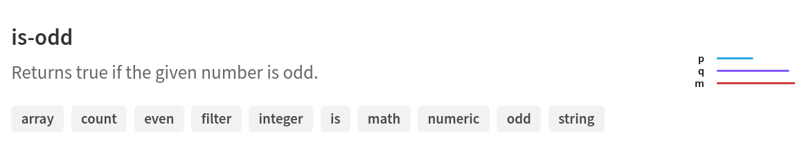
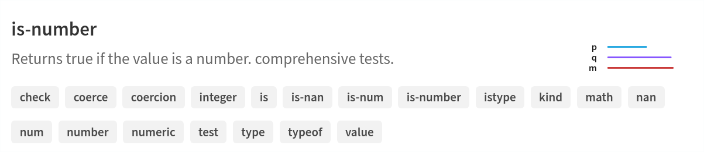

The Node.js Ecosystem Is Chaotic and Insecure – Casper Beyer – Medium

# The Node.js Ecosystem Is Chaotic and Insecure

A modern web developer at work

It seems like only yesterday we had the “left-pad” fiasco where [Azer Koçulu](https://medium.com/@azerbike) ended up [pulling his packages](https://medium.com/@azerbike/i-ve-just-liberated-my-modules-9045c06be67c) after a name dispute.

It wasn’t really that dangerous that the code was deleted, that only breaks the build which everyone would catch that during the build process before deploying it live on the web.

What was dangerous was that it was a small redundant package that no one would ever actually bother to audit before deploying, so anyone could have jumped in and published a package with the same functionality but also stick some malicious code into it and get a free ride to get deployed essentially anywhere that ran JavaScript.

Well, it sure is a good thing we learned our lesson isn’t it?

### We Still Can’t Code

When left-pad hit, developers from other camps were having their laughs at how this tiny piece of code could be a module. Obviously we have learned by now right? Well, no.

The following wonder of engineering aptly named `is-odd` has around 500 000 downloads **per day.**

Going through the dependents tree, I found hundreds of projects depending on this but more importantly also the big players including Webpack, BrowserSync and Babel depend on it.

Basically this means that **if** this package went rogue in a minor patch then it could theoretically inject code into both developer machines as-well as hook into the code generation of Webpack and/or Babel. That’s a lot of power to give to a package that should just have been a modulus operator.

But surely this is a freak occurrence right? Nope, it seems to be common practice. The `is-number` package has nearly two million downloads per day. Not only that it’s also by the same author along with a myriad of other similar one liner packages.

My personal favorite is the `is-even` package, because using the negation operator is too reinventing the wheel?

**var** isOdd = require('is-odd');
module.exports = **function** isEven(i) {
 **return** !isOdd(i);
};

Now to be fair to the author and maintainers of the above packages, the problem statement applies to any package available in the package repository and there thousands of similar trivial packages from hundreds of both known and completely anonymous unknown authors which are just as popular with millions of downloads per week.

### Be Responsible

Don’t trust package managers, every dependency is written by some random developer somewhere in the world. Every package is a potential attack vector in any package system but these one liner packages makes it a death by a thousand needles with no effort required.

All it takes is for one single maintainer to wait until the reach is wide enough, then release a patch with a malicious payload and it spreads like wildfire because no one locks down a dependency like `is-string` to a patch version.

Is this being too paranoid? Perhaps, or maybe it’s the healthy amount considering the massive reach these trivial packages have. Given how many browser extensiond and sites that have been injected with the CoinHive miner I’d say it is even fairly probable that a few cryptocurrency miners that are currently living in the package repository already.

Why would anyone bother with all the work involved in finding exploits when you can just create a rubbish package with zero effort and just release letting JavaScript developers spread it for you on both on npm, their machines and possibly even on client’s machines.

**TL;DR** do you really need `is-true` and `is-false` as packages? **No, no you don’t, stop it.**