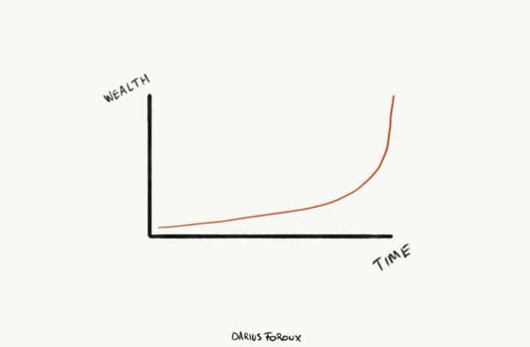
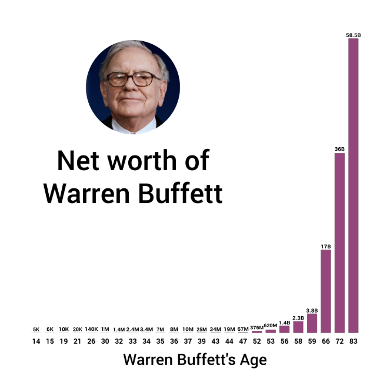
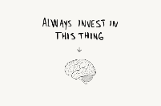

The Power Of Compounding: You Can Achieve Anything, If You Stop Trying To Do Everything - Darius Foroux

## The Power Of Compounding: You Can Achieve Anything, If You Stop Trying To Do Everything

September 4, 2017

Do you have a long list of goals, desires, and wants for your life? Do you want to learn more? Earn more? Improve your skills? Get the most out of your relationships? Live better?

All those things are good. Life is about moving forward and making consistent progress.

However, there’s one important thing about all this working, hustling, striving, and achieving more: You can’t do everything at the same time.

That’s common sense, right? You only have so much time and energy. So if you take on too many things, [you end up spread too thin](http://dariusforoux.com/workhardwithoutburningout/).

Instead, it’s much more effective to focus your effort on one thing.

### Success Adds Up

Real success happens when we focus on one thing at a time. The first time I discovered that idea was in high school. When I was preparing for my final exams, I decided to study only one subject at a time. And I only moved on to the next when I fully grasped the material.

I noticed that I could learn something way faster if I immersed myself in it for a few days. Most of my peers studied multiple subjects a day. I never like that approach because it’s too scattered.

If I’m working on a project at work, I don’t pick up another big project. If I’m working on a new course for my blog, I don’t start writing a book at the same time. That strategy helps me to get things done quicker and better. Hence, I achieve much more when I give my attention to one thing.

Gary Keller and Jay Papasan, authors of [The One Thing](https://www.amazon.com/gp/product/1885167776/ref=as_li_qf_sp_asin_il_tl?ie=UTF8&tag=dariusforoux-20&camp=1789&creative=9325&linkCode=as2&creativeASIN=1885167776&linkId=f674b013792bbb58687aac458c629c7d), which is a great book about this same concept, said it best:

> “Where I’d had huge success, I had narrowed my concentration to one thing, and where my success varied, my focus had too.”

Are you working on a lot of things? Is your attention not on one thing? There’s a big chance that you will not achieve the best possible results. Or worse: You might fail if you try to achieve many things at the same time

The reason is simple: Most of us believe that success happens all at once. Real life is different. Keller and Papasan put it well:

> “Success is sequential, not simultaneous.”

[Things add up](http://dariusforoux.com/little-things-big-things/). You learn one skill. Then another. You finish one project. Then another. Over time, your accomplishments add up to form an impressive feat.

This is especially true for money. Most people earned their money over time. Few people make a big financial splash. Forget about the Conor McGregors and Evan Spiegels of this world. These are people who hit the career jackpot.

But you don’t need special talent or skills to succeed in life. If you take the long road, achieve one goal after the other, and build up your wealth step by step, you are more likely to live a good life.

It’s simple. And it always works. People who say it doesn’t just haven’t had the patience to apply it to their own life.

One of my mentors owns a few dozen properties, worth millions. He acquired his wealth over time. He’s in his sixties now. You see, things take time. And when you combine patience with compounding, you achieve the biggest results.

And these are not extraordinary things. I’m not promising you a gold medal at the 2020 Olympics or that you’ll become the next Zuckerberg.

*Everyone* can save money, improve their skills, and create wealth.

### The Impact Of Long-Term Compounding

It’s incredibly corny example, but take Warren Buffett. This is how he built his wealth over time.

*Source: dadaviz.com*
Don’t look at the numbers (or random x-axis). Look at the relative growth.

Between age 32 and age 44, Buffett improved his net worth by 1257%. That’s pretty exceptional growth over 12 years, right? Especially if you take into account that he lost a lot of money in his 40s. But that’s not the point here.

Look at this. From age 44 to 56, Warren Buffett’s wealth increased by a ridiculous 7268% over a similar time period. And of course, this is his net worth and there’s always luck involved with these type of numbers.

Plus, his net worth is based on stock prices — which means a big portion of it could be all gone tomorrow. But still, it’s about the growth he achieved over time.

Another thing: Buffett acquired 99% of his net worth after he became 50. Think about all those spoiled idiots in their teens, twenties, and even thirties (me included), who complain about the slow progress of their career. This helps you to put things in perspective.

Anyway, there’s a lot of Warren Buffett porn on the internet. And a lot of people pretend you can become rich by investing in the stock market. All you need to do is to buy their course that contains all the secrets to wealth.

Yeah right. It doesn’t work that way. Personally, I hate stocks, and I think normal folks should [stay away](https://www.youtube.com/watch?v=u5Pp1HEKSPM&t=17s) from Wall Street. I prefer real estate.

However, Buffett is the perfect example of sequential success. You can achieve big things with small actions, that build up over time.

This is not only true for money. The same concept applies to skills, health, and relationships.

You don’t build a strong body in a day, month, or even a year. It takes years of consistent effort. Shortcuts don’t exist, no matter how ‘smart’ you work.

For example, cyclists under the age of 28 rarely win big races like The Tour The France because it takes them years to build the strength, stamina, and mindset you need to win.

If you want to see the impact of compounding in your own life, it requires you to focus on one thing at a time (for every aspect of your life) and always look at the bigger picture.

It comes down to this: You’ll get there if you put in the work. Who cares if it’s tomorrow or 20 years? It *will* happen. That’s all that matters.

#  Ready to improve your productivity + build a better life and business?

Join thousands of other entrepreneurs who get my newsletter. I’ll also send you my eBook ‘How To Go From Procrastinate Hero To Procrastinate Zero’ for free.

   Sign up

### Spread the word:

- [*8,412*********]()

-

[(L)](https://www.facebook.com/sharer/sharer.php?app_id=249643311490&kid_directed_site=0&sdk=joey&u=http%3A%2F%2Fdariusforoux.com%2Fthe-power-of-compounding%2F&display=popup&ref=plugin&src=share_button)

- [**Tweet](https://twitter.com/intent/tweet?original_referer=http%3A%2F%2Fdariusforoux.com%2Fthe-power-of-compounding%2F%3Futm_source%3Dpocket%26utm_medium%3Demail%26utm_campaign%3Dpockethits&ref_src=twsrc%5Etfw&text=The%20Power%20Of%20Compounding%3A%20You%20Can%20Achieve%20Anything%2C%20If%20You%20Stop%20Trying%20To%20Do%20Everything&tw_p=tweetbutton&url=http%3A%2F%2Fdariusforoux.com%2Fthe-power-of-compounding%2F&via=dariusforoux)
- [inShare.](#)124
- [3](https://www.pinterest.com/pin/create/button/?guid=WiYPW5zXtfJC-2&url=http%3A%2F%2Fdariusforoux.com%2Fthe-power-of-compounding%2F&media=http%3A%2F%2Fdariusforoux.com%2Fwp-content%2Fuploads%2F2017%2F09%2FIMG_0303.png&description=The%20Power%20Of%20Compounding%3A%20You%20Can%20Achieve%20Anything%2C%20If%20You%20Stop%20Trying%20To%20Do%20Everything)
- [More](http://dariusforoux.com/the-power-of-compounding/?utm_source=pocket&utm_medium=email&utm_campaign=pockethits#)

-
.

#### Darius Foroux

I’m an entrepreneur, author, and podcaster. I also research tools to build a better life, career, and business. Join my free newsletter if you want to get my latest articles delivered to your inbox.

- [**](https://www.facebook.com/dariusforoux/)
- [**](https://twitter.com/DariusForoux)
- [**](https://www.instagram.com/dariusforoux/)
- [**](https://www.youtube.com/channel/UCxF-6VQbH6J_7KE7jvhFenw)
- [**](https://soundcloud.com/dariusforoux)

#### Read Next

April 21, 2016

## [If You Want To Be More Productive, Research Shows You Need A Break](http://dariusforoux.com/takebreaks/)

October 10, 2016

## [Always Invest In Your Education](http://dariusforoux.com/education/)

February 13, 2017

## [The Practical Podcast (about life) Is Here!](http://dariusforoux.com/the-practical-podcast-about-life-is-here/)

### 5 comments

1.   **joyce**  *says:*

[September 4, 2017 at 3:04 pm](http://dariusforoux.com/the-power-of-compounding/#comment-2170)

Thank you Darius! Your article gave me new found inspiration and hope. I am going to apply this starting today, it makes sense. Joyce

[Reply](http://dariusforoux.com/the-power-of-compounding/?replytocom=2170#respond)

    1.   **[Darius Foroux](http://dariusforoux.com/)**  *says:*

[September 4, 2017 at 4:09 pm](http://dariusforoux.com/the-power-of-compounding/#comment-2171)

Happy to hear that, Joyce!

[Reply](http://dariusforoux.com/the-power-of-compounding/?replytocom=2171#respond)

2.   **Tom Viscount**  *says:*

[September 5, 2017 at 1:28 pm](http://dariusforoux.com/the-power-of-compounding/#comment-2178)

Cool article. Helps woth daily anxieties about the future of personal finance.

[Reply](http://dariusforoux.com/the-power-of-compounding/?replytocom=2178#respond)

3.   **[Raj](https://gravatar.com/reachkraj)**  *says:*

[September 7, 2017 at 3:09 pm](http://dariusforoux.com/the-power-of-compounding/#comment-2186)

Thank you Darius . It really helps , when you are lost in the thick and thin of life and peer pressure .

[Reply](http://dariusforoux.com/the-power-of-compounding/?replytocom=2186#respond)

    1.   **[Darius Foroux](http://dariusforoux.com/)**  *says:*

[September 7, 2017 at 4:52 pm](http://dariusforoux.com/the-power-of-compounding/#comment-2187)

Happy to hear that, Raj. Thanks for reading.

[Reply](http://dariusforoux.com/the-power-of-compounding/?replytocom=2187#respond)

### Share Your Thoughts