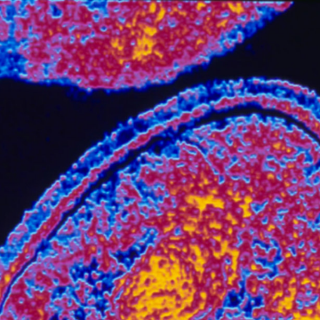

The Problem With Probiotics

The Problem With Probiotics

https://www.nytimes.com/2018/10/22/upshot/the-problem-with-probiotics.html?utm_source=nextdraft&utm_medium=email

There are potential harms as well as benefits, and a lot of wishful thinking and imprecision in the marketing of products containing them.