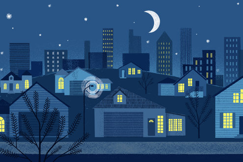

The Purpose of Sleep? To Forget, Scientists Say

In the years since, Dr. Tononi and Dr. Cirelli, along with other researchers, have found a great deal of indirect evidence to support the so-called synaptic homeostasis hypothesis.

It turns out, for example, that neurons can prune their synapses — at least in a dish. In laboratory experiments on clumps of neurons, scientists can give them a drug that spurs them to grow extra synapses. Afterward, the neurons pare back some of the growth.

Other evidence comes from the electric waves released by the brain. During deep sleep, the waves slow down. Dr. Tononi and Dr. Cirelli have argued that shrinking synapses produce this change.

Four years ago, Dr. Tononi and Dr. Cirelli got a chance to test their theory by looking at the synapses themselves. They acquired a kind of deli slicer for brain tissue, which they used to shave ultrathin sheets from a mouse’s brain.

 [  ##  How to Get a Better Night’s Sleep      How do you become a more successful sleeper? Grab a pillow, curl up and keep reading to find out.                     **](https://www.nytimes.com/interactive/2016/well/mind/well-better-sleep-guide-interactive.html)

Luisa de Vivo, an assistant scientist working in their lab, led a painstaking survey of tissue taken from mice, some awake and others asleep. She and her colleagues determined the size and shape of 6,920 synapses in total.

The synapses in the brains of sleeping mice, they found, were 18 percent smaller than in awake ones. “That there’s such a big change over all is surprising,” Dr. Tononi said.

[The second study](http://science.sciencemag.org/cgi/doi/10.1126/science.aai8355) was led by Graham H. Diering, a postdoctoral researcher at Johns Hopkins University. Dr. Diering and his colleagues set out to explore the synaptic homeostasis hypothesis by studying the proteins in mouse brains. “I’m really coming at it from this nuts-and-bolts place,” Dr. Diering said.

In one experiment, Dr. Diering and his colleagues created a tiny window through which they could peer into mouse brains. Then he and his colleagues added a chemical that lit up a surface protein on brain synapses.

Looking through the window, they found that the number of surface proteins dropped during sleep. That decline is what you would expect if the synapses were shrinking.

Dr. Diering and his colleagues then searched for the molecular trigger for this change. They found that hundreds of proteins increase or decrease inside of synapses during the night. But one protein in particular, called Homer1A, stood out.

In earlier experiments on neurons in a dish, Homer1A proved to be important for paring back synapses. Dr. Diering wondered if it was important in sleep, too.

To find out, he and his colleagues studied mice genetically engineered so that they couldn’t make Homer1A proteins. These mice slept like ordinary mice, but their synapses didn’t change their proteins like the ones in ordinary mice.

## Science Times

We’ll bring you stories that capture the wonders of the human body, nature and the cosmos.

 Receive occasional updates and special offers for The New York Times's products and services.

Recaptcha requires verification

I'm not a robot

reCAPTCHA

[Privacy](https://www.google.com/intl/en/policies/privacy/) - [Terms](https://www.google.com/intl/en/policies/terms/)

- [See Sample](http://www.nytimes.com/newsletters/sample/science-times?pgtype=subscriptionspage&version=new&contentId=SC&eventName=sample&module=newsletter-sign-up)

- [Manage Email Preferences](https://www.nytimes.com/mem/email.html)

- [Privacy Policy](https://www.nytimes.com/privacy)

Dr. Diering’s research suggests that sleepiness triggers neurons to make Homer1A and ship it into their synapses. When sleep arrives, Homer1A turns on the pruning machinery.

To see how this pruning machinery affects learning, the scientists gave regular mice a memory test. They put the animals in a room where they got a mild electric shock if they walked over one section of the floor.

That night, the scientists injected a chemical into the brains of some of the mice. The chemical had been shown to block neurons in dishes from pruning their synapses.

The next day, the scientists put all the mice back in the chamber they had been in before. Both groups of mice spent much of the time frozen, fearfully recalling the shock.

But when the researchers put the mice in a different chamber, they saw a big difference. The ordinary mice sniffed around curiously. The mice that had been prevented from pruning their brain synapses during sleep, on the other hand, froze once again.

Dr. Diering thinks that the injected mice couldn’t narrow their memories down to the particular chamber where they had gotten the shock. Without nighttime pruning, their memories ended up fuzzy.

In their own experiment, Dr. Tononi and his colleagues found that the pruning didn’t strike every neuron. A fifth of the synapses were unchanged. It’s possible that these synapses encode well-established memories that shouldn’t be tampered with.

“You can forget in a smart way,” Dr. Tononi said.

Other researchers cautioned that the new findings weren’t definitive proof of the synaptic homeostasis hypothesis.

Marcos G. Frank, a sleep researcher at Washington State University in Spokane, said that it could be hard to tell whether changes to the brain at night were caused by sleep or by the biological clock. “It’s a general problem in the field,” he said.

Markus H. Schmidt, of the Ohio Sleep Medicine Institute, said that while the brain might prune synapses during sleep, he questioned whether this was the main explanation for why sleep exists.

“The work is great,” he said of the new studies, “but the question is, is this a function of sleep or is it *the* function?”

Many organs, not just the brain, seem to function differently during sleep, Dr. Schmidt pointed out. The gut appears to make many new cells, for example.

Dr. Tononi said that the new findings should prompt a look at what current sleeping drugs do in the brain. While they may be good at making people sleepy, it’s also possible that they may interfere with the pruning required for forming memories.

“You may actually work against yourself,” Dr. Tononi said.

In the future, sleep medicines might precisely target the molecules involved in sleep, ensuring that synapses get properly pruned.

“Once you know a little bit of what happens at the ground-truth level, you can get a better idea of what to do for therapy,” Dr. Tononi said.

Follow Carl Zimmer on Twitter [@carlzimmer](https://twitter.com/carlzimmer)

[Like the Science Times page on Facebook.](http://on.fb.me/1paTQ1h) | Sign up for the [Science Times newsletter.](http://nyti.ms/1MbHaRU)

A version of this article appears in print on February 7, 2017, on Page D5 of the New York edition with the headline: To Sleep, Perchance to Forget?.   [Order Reprints](http://www.nytreprints.com/)|  [Today's Paper](http://www.nytimes.com/pages/todayspaper/index.html)|[Subscribe](http://www.nytimes.com/subscriptions/Multiproduct/lp839RF.html?campaignId=48JQY)

 [Continue reading the main story](https://www.nytimes.com/2017/02/02/science/sleep-memory-brain-forgetting.html?_r=0#whats-next)