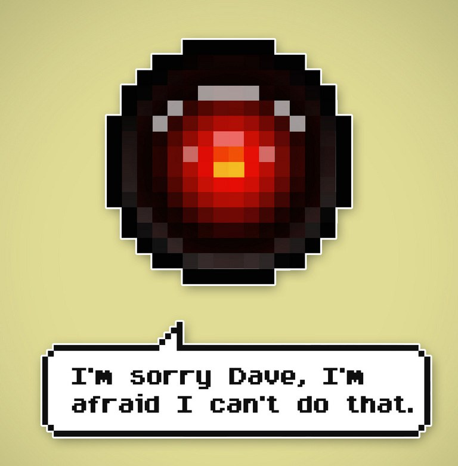
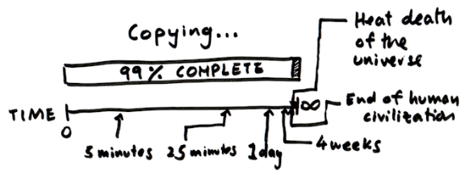
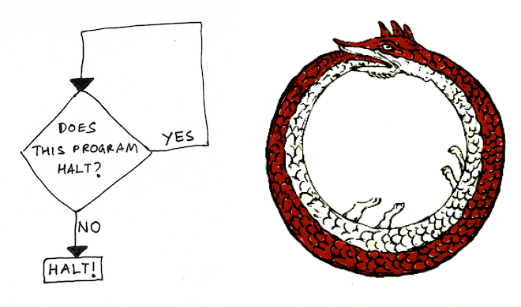

The Questions That Computers Can Never Answer

# The Questions That Computers Can Never Answer

Armin Cifuentes
/Flickr

Computers can drive cars, land a rover on Mars, and beat humans at *Jeopardy*. But do you ever wonder if there's anything that a computer can never do? Computers are, of course, limited by their hardware. My smartphone can't double as an electric razor (yet). But that's a physical limitation, one that we could overcome if we really wanted to. So let me be a little more precise in what I mean. What I'm asking is, **are there any questions that a computer can never answer?**

Now of course, there are plenty of questions that are *really hard* for computers to answer. Here's an example. In school, we learn how to factor numbers. So, for example, 30 = 2 × 3 × 5, or 42 = 2 × 3 × 7. School kids learn to factor numbers by following a straightforward, algorithmic procedure. Yet, up until 2007, there was a [$100,000 bounty](http://en.wikipedia.org/wiki/RSA_Factoring_Challenge) on factoring this number:

> 13506641086599522334960321627880596993888147560566702752448514385152651060
> 48595338339402871505719094417982072821644715513736804197039641917430464965
> 89274256239341020864383202110372958725762358509643110564073501508187510676
> 59462920556368552947521350085287941637732853390610975054433499981115005697
> 7236890927563

And as of 2014, no one has publicly claimed the solution to this puzzle. It's not that we don't know *how* to solve it, it's just that it would take way too long. Our computers are too slow. (In fact, the encryption that makes the internet possible relies on these huge numbers being impossibly difficult to factor.)

So lets rephrase our question so that it isn't limited by current technology. __Are there any questions that, __no matter how powerful your computer, and **no matter how long you waited, your computer would never be able to answer?**

Surprisingly, the answer is yes. The [Halting Problem](http://en.wikipedia.org/wiki/Halting_problem) asks whether a computer program will stop after some time, or whether it will keep running forever. This is a very practical concern, because an [infinite loop](http://en.wikipedia.org/wiki/Infinite_loop) is a common type of bug that can subtly creep in to one's code. In 1936, the brilliant mathematician and codebreaker [Alan Turing](http://en.wikipedia.org/wiki/Alan_Turing) proved that it's *impossible* for a computer to inspect any code that you give it, and correctly tell you whether the code will halt or run forever. In other words, Turing showed that a computer can never solve the Halting Problem.

You've probably experienced this situation: you're copying some files, and the progress bar gets stuck (typically at 99%). At what point do you give up on waiting for it to move? How would you know whether it's going to stay stuck forever, or whether, in a few hundred years, it'll eventually copy your file? To use an analogy by [Scott Aaronson](http://www.scottaaronson.com/writings/bignumbers.html), "*If you bet a friend that your watch will never stop ticking, when could you declare victory?*"

### Trending Now

Science

### Dot Physics: How Planes Fly (Admit it -- You Always Wanted To Know)

[(L)](https://www.wired.com/images_blogs/wiredscience/2014/02/copying.png)

As you get sick of waiting for the copy bar to move, you begin to wonder, wouldn't it be great if someone wrote a debugging program that could weed out all annoying bugs like this? Whoever wrote that program could sell it to Microsoft for a ton of money. But before you get to work on writing it yourself, you should heed Turing's advice - a computer can never reliably inspect someone's code and tell you whether it will halt or run forever.

Think about how bold a claim this is. Turing isn't talking about what we can do today, instead he's raised a fundamental limitation on what computers can *possibly* do. Be it now, or in the year 2450, there isn't, and never will be, any computer program that can solve the Halting Problem.

In his proof, Turing first had to mathematically define what we mean by a computer and a program. With this groundwork covered, he could deliver the final blow using the time honored tactic of [proof by contradiction](http://en.wikipedia.org/wiki/Proof_by_contradiction). As a warm up to understanding Turing's proof, let's think about a toy problem called the [Liar paradox](http://en.wikipedia.org/wiki/Liar_paradox). Imagine someone tells you, "this sentence is false." If that sentence is true, then going by what they said, it must also be false. Similarly, if the sentence is false, then it accurately describes itself, so it must also be true. But it can't be both true and false - so we have a contradiction. This idea of using self-reference to create a contradiction is at the heart of Turing's proof.

Here's how computer scientist Scott Aaronson [introduces it](http://www.scottaaronson.com/writings/bignumbers.html):

*> [Turing's] proof is a beautiful example of self-reference. It formalizes an old argument about why you can never have perfect introspection: because if you could, then you could determine what you were going to do ten seconds from now, and then do something else. Turing imagined that there was a special machine that could solve the Halting Problem. Then he showed how we could have this machine analyze itself, in such a way that it has to halt if it runs forever, and run forever if it halts. Like a hound that finally catches its tail and devours itself, the mythical machine vanishes in a fury of contradiction.*

Michael Holden
/Flickr

And so, let's go through Turing's proof that the Halting Problem can never be solved by a computer, or why you could never program a 'loop snooper'. The proof I'm about to present is a rather unconventional one. It's a poem written by [Geoffrey Pullum](http://www.lel.ed.ac.uk/~gpullum/) in honor of Alan Turing, in the style of Dr. Seuss. I've reproduced it here, in entirety, with his permission.

**> SCOOPING THE LOOP SNOOPER**
> A proof that the Halting Problem is undecidable
> Geoffrey K. Pullum
> No general procedure for bug checks will do.
> Now, I won’t just assert that, I’ll prove it to you.
> I will prove that although you might work till you drop,
> you cannot tell if computation will stop.
> For imagine we have a procedure called P
> that for specified input permits you to see
> whether specified source code, with all of its faults,
> defines a routine that eventually halts.
> You feed in your program, with suitable data,
> and P gets to work, and a little while later
> (in finite compute time) correctly infers
> whether infinite looping behavior occurs.
> If there will be no looping, then P prints out ‘Good.’
> That means work on this input will halt, as it should.
> But if it detects an unstoppable loop,
> then P reports ‘Bad!’ — which means you’re in the soup.
> Well, the truth is that P cannot possibly be,
> because if you wrote it and gave it to me,
> I could use it to set up a logical bind
> that would shatter your reason and scramble your mind.
> Here’s the trick that I’ll use — and it’s simple to do.
> I’ll define a procedure, which I will call Q,
> that will use P’s predictions of halting success
> to stir up a terrible logical mess.
> For a specified program, say A, one supplies,
> the first step of this program called Q I devise
> is to find out from P what’s the right thing to say
> of the looping behavior of A run on A.
> If P’s answer is ‘Bad!’, Q will suddenly stop.
> But otherwise, Q will go back to the top,
> and start off again, looping endlessly back,
> till the universe dies and turns frozen and black.
> And this program called Q wouldn’t stay on the shelf;
> I would ask it to forecast its run on itself.
> When it reads its own source code, just what will it do?
> What’s the looping behavior of Q run on Q?
> If P warns of infinite loops, Q will quit;
> yet P is supposed to speak truly of it!
> And if Q’s going to quit, then P should say ‘Good.’
> Which makes Q start to loop! (P denied that it would.)
> No matter how P might perform, Q will scoop it:
> Q uses P’s output to make P look stupid.
> Whatever P says, it cannot predict Q:
> P is right when it’s wrong, and is false when it’s true!
> I’ve created a paradox, neat as can be —
> and simply by using your putative P.
> When you posited P you stepped into a snare;
> Your assumption has led you right into my lair.
> So where can this argument possibly go?
> I don’t have to tell you; I’m sure you must know.
> A reductio: There cannot possibly be
> a procedure that acts like the mythical P.
> You can never find general mechanical means
> for predicting the acts of computing machines;
> it’s something that cannot be done. So we users
> must find our own bugs. Our computers are losers!

What you just read, in delightfully whimsical poetic form, was the punchline of Turing's proof. Here's a visual representation of the same idea. The diamond represents the loop-snooping program P, which is asked to evaluate whether the program Q (the flow chart) will halt.

"The program will halt when the loop snooper said it wouldn't, and it runs forever when the loop snooper said it would halt!"

Like the serpent that tries to eat its tail, Turing conjured up a self-referential paradox. The program will halt when the loop snooper said it wouldn't, and it runs forever when the loop snooper said it would halt! To resolve this contradiction, we're forced to conclude that this loop snooping program can't exist.

And this idea has far-reaching consequences. There are [uncountably](http://en.wikipedia.org/wiki/Uncountable_set) many questions for which computers [can't reliably give you the right answer](http://en.wikipedia.org/wiki/List_of_undecidable_problems). Many of these impossible questions are really just the loop snooper in disguise. [Among the things](http://introcs.cs.princeton.edu/java/76computability/) that a computer can never do perfectly is identifying whether a program is a virus, or whether it contains vulnerable code that can be exploited. So much for our hopes of having the perfect anti-virus software or unbreakable software. It's also impossible for a computer to always tell you whether two different programs do the same thing, an unfortunate fact for the [poor souls](http://www.preposterousuniverse.com/blog/2013/04/24/why-is-code-hard-to-understand/) who have to grade computer science homework.

By slaying the mythical loop snooper, Turing taught us that there are fundamental limits to what computers can do. We all have our limits, and in a way it's comforting to know that the artificial brains that we create will always have theirs too.