The Raw Videos That Have Sparked Outrage Over Police Treatment of Blacks

##     [U.S.](https://www.nytimes.com/section/us)

- [**Share](#)

# The Raw Videos That Have Sparked

Outrage Over Police Treatment of Blacks

  By MERCY BENZAQUEN,   [DAMIEN CAVE](http://www.nytimes.com/by/damien-cave) and   [ROCHELLE OLIVER](http://www.nytimes.com/by/rochelle-oliver)    UPDATED DEC. 14, 2017

 From footage showing the death of Eric Garner in 2014 to a recent clip that captured an [11-year-old girl being handcuffed](http://woodtv.com/2017/12/12/grpd-chief-to-address-girl-held-at-gunpoint-cuffed-by-officers/), raw video has thoroughly [shaken American policing](http://www.nytimes.com/2015/04/09/us/video-of-fatal-shooting-of-walter-scott-reignites-debate-on-police-use-of-force.html). Grainy images of questionable police behavior, [spread through social media](http://www.nytimes.com/2015/05/10/magazine/our-demand-is-simple-stop-killing-us.html), have led to [nationwide protests](http://www.nytimes.com/interactive/2016/07/16/us/protesting-police-shootings-of-blacks.html), federal investigations and changes in policy and attitudes on race.

“A lot of white people are truly shocked by what these videos depict; I know very few African-Americans who are surprised,” said Paul D. Butler, a law professor at Georgetown University and a former prosecutor. “The videos are smoking-gun evidence,” he added, “both literally because they are very graphic, which generates outrage, and figuratively, because people believe their own eyes.”

These videos include graphic scenes of violence.  [Related Article](https://www.nytimes.com/interactive/2016/09/25/us/charlotte-scott-shooting-video.html)

## 11-year-old girl

 Dec. 6, 2017  Grand Rapids, Mich.  [Related Article »](https://www.nytimes.com/2017/12/15/us/grand-rapids-police-girl-arrested.html)

 A police body camera video shows an 11-year-old girl being held at gunpoint and then handcuffed as she screamed. Chief David Rahinsky of the Grand Rapids Police Department said in a news conference that the episode was “inappropriate.”

 **

Grand Rapids Police Department

## Richard Hubbard III

 Aug. 12, 2017  Euclid, Ohio  [Related Article »](https://www.nytimes.com/2017/08/17/us/euclid-ohio-police-brutality.html)

 A police dashcam video shows Richard Hubbard III, 25, being beaten during a traffic stop in the Cleveland suburb of Euclid, Ohio. Officer Michael Amiott can be seen repeatedly punching Mr. Hubbard, who is black, and hitting his head on the pavement.

[GRAPHIC IMAGE AND AUDIO: Euclid police dash cam video](https://www.youtube.com/watch?v=E9C3FhBzw6I)

10:38 / 25:24
[(L)](https://www.youtube.com/watch?v=E9C3FhBzw6I)

Euclid Police Department

## Demetrius Bryan Hollins

 April 12, 2017  Lawrenceville, Ga.  [Related Article »](https://www.nytimes.com/2017/04/14/us/georgia-police-officer-fired.html)

 Cellphone video shows Demetrius B. Hollins, 21, being kicked in the head and punched in the face by two officers during a traffic stop. The Gwinnett County Police Department later dismissed 89 cases involving the officers, Robert McDonald and Sgt. Michael F. Bongiovanni, who were fired and face criminal charges.


00:42


01:25

Black Lives Matter Greater Atlanta

## Nania Cain

 April 10, 2017  Sacramento, Calif.  [Related Article »](https://www.nytimes.com/2017/04/13/us/cop-jaywalk-beating-video.html)

 Footage from a dashboard camera and a cellphone shows Nania Cain being thrown to the ground and repeatedly punched in the face by an officer who claims Mr. Cain had allegedly jaywalked. Mr. Cain, 24, was initially charged with resisting arrest, but was released the next morning. The Sacramento police officer was placed on paid administrative leave.


00:06


01:21

Naomi Montaie via Facebook, Sacramento Police Department

## Dejuan Hall

 March 10, 2017  Vallejo, Calif.

 Dejuan Hall, 23, was chased and apprehended by a police officer who is seen punching Mr. Hall and striking him with an object. In a bystander video, people can be heard yelling, “Police brutality.” The Vallejo police officer then shouts back: “Shut up. Get back,” and brandishes his gun.


02:00


02:00

Laura Maldonado via Facebook

## A Rolesville High School student

 Jan. 3, 2017  Rolesville, N.C.  [Related Article »](https://www.nytimes.com/2017/03/08/us/north-carolina-officer-student-video.html)

 Cellphone video shows a police officer slamming a 15-year-old female to the floor in effort to stop a fight involving three students. Officer Ruben De Los Santos was placed on paid administrative leave, and did not face criminal charges. He resigned in March.


00:09


00:09

@ahunnaaa_ via Twitter

## Jacqueline Craig and her children

 Dec. 21, 2016  Fort Worth, Tex.  [Related Article »](https://www.nytimes.com/aponline/2017/06/14/us/ap-us-mother-daughters-arrested-video.html)

 Jacqueline Craig, 46, and her daughters, ages 15 and 19, were arrested after reporting to police that a neighbor had choked her 7-year-old son for littering. Bodycam video shows the responder, Officer William Martin, asking the mother, “Why don’t you teach your son not to litter?” Later, he aims a Taser toward the family and then handcuffs the women. Mr. Martin received a 10-day suspension for excessive force and continues to defend his actions.

[BREAKING: Body Cam footage of Ft. Worth PD Officer Brutalizing Black Family Who Called HIM for Help](https://www.youtube.com/watch?v=4jxGw4kc8BE)

7:26 / 12:24
[(L)](https://www.youtube.com/watch?v=4jxGw4kc8BE)

YouTube video uploaded by Shaun King

## Charles Kinsey

 July 18, 2016  North Miami, Fla.  [Related Article »](https://www.nytimes.com/2016/07/22/us/north-miami-police-officers-shoot-man-aiding-patient-with-autism.html)

 Charles Kinsey, a behavioral therapist, was trying to help a young man who has autism when Mr. Kinsey was shot in the leg by a North Miami police officer. Jonathan Aledda, the officer, was fired for shooting the 47-year-old. His commander, Emile Hollant, is to be fired as well.

 **

@toddtongen via Twitter

## Carnell Snell Jr.

 Oct. 1, 2016  Los Angeles  [Related Article »](http://www.nytimes.com/2016/10/05/us/la-police-release-video-of-fatal-shooting-of-man-say-he-had-a-gun.html)

 Carnell Snell Jr., 18, was fatally shot by the police in a strip mall parking lot. Surveillance video shows Mr. Snell running into the parking lot while tucking what appeared to be a handgun into his pants. The video was released after two days of protests over the shooting.

 **

Los Angeles Police Department

## Keith Lamont Scott

 Sept. 20, 2016  Charlotte, N.C.  [Related Article »](http://www.nytimes.com/interactive/2016/09/25/us/charlotte-scott-shooting-video.html)

 Keith Lamont Scott, 43, was fatally shot by the police at his apartment complex. The police were there to serve someone else with a warrant. Mr. Scott had parked his car in a visitor’s space, where he often waited for one of his children to return home on a bus. The video was captured by his wife on her cellphone.

 **

Evan Grothjan/The New York Times

## Terence Crutcher

 Sept. 16, 2016  Tulsa, Okla.  [Related Article »](http://www.nytimes.com/2016/09/20/us/video-released-in-terence-crutchers-killing-by-tulsa-police.html)

 Terence Crutcher, 40, was fatally shot by a Tulsa police officer who was responding to reports of an abandoned vehicle in the road. Footage from the dashboard camera of a police car shows Mr. Crutcher walking toward a car with his hands raised before being Tasered and then shot.

 **

The New York Times

## Paul O’Neal

 July 28, 2016  Chicago, Ill.  [Related Article »](http://www.nytimes.com/2016/08/06/us/chicago-releases-video-from-police-officers-killing-of-18-year-old.html)

 Videos taken from police officers’ body and dashboard cameras show two officers firing their guns at a stolen car moments before the driver, Paul O’Neal, 18, crashed it into a police vehicle. Mr. O’Neal was shot and killed in the back as he fled the scene and ran behind a nearby house. Police officers could be seen gathering around Mr. O’Neal as he lay on the ground.

 **

Chicago Police Dept.

## Joseph Mann

 July 11, 2016  Sacramento  [Related Article »](http://www.nytimes.com/2016/10/05/us/in-video-sacramento-police-appear-to-try-to-hit-man-with-their-car-before-hes-fatally-shot.html)

 Dashboard camera audio suggests that police officers tried to hit Joseph Mann with their patrol car as he fled on foot. “I’m going to hit him,” one officer is heard saying. “Go for it,” another says. Officers then followed Mr. Mann on foot and fired 18 shots, 14 of which hit him.

 **

Sacramento Police Department

## Philando Castile

 July 6, 2016  Falcon Heights, Minn.  [Related Article »](https://www.nytimes.com/2017/06/16/us/police-shooting-trial-philando-castile.html)

 Philando Castile, 32, was fatally shot during a traffic stop in a St. Paul suburb, the aftermath of which was captured in a grisly video recorded by the car’s front-seat passenger and streamed live as the man slumped against her. Her young daughter sat in the back seat. In June, a jury found the Minnesota police officer, Jeronimo Yanez, not guilty of all charges, including second-degree manslaughter. Dashboard camera video was released days later.

 **

Minnesota Bureau of Criminal Apprehension, Diamond Reynolds

## Alton Sterling

 July 5, 2016  Baton Rouge, La.  [Related Article »](http://www.nytimes.com/2016/07/06/us/alton-sterling-baton-rouge-shooting.html)

 A cellphone video shows a black man, Alton Sterling, 37, being tackled and then held to the ground by two white officers. Someone shouts, “He’s got a gun!” and one officer appears to hold a gun above Mr. Sterling’s chest. Multiple gunshots are heard while Mr. Sterling is pinned down. Mr. Sterling died at the scene.

[Graphic content: Baton Rouge police fatally shoot Alton Sterling outside convenience store](https://www.youtube.com/watch?v=Pn-fYQRTjP4)

Nola.com

## South Carolina High School Student

 Oct. 26, 2015  Columbia, S.C.  [Related Article »](http://www.nytimes.com/2015/10/27/us/officers-classroom-fight-with-student-is-caught-on-video.html)

 Videos, apparently shot by students in a high school classroom, show a white school police officer grabbing an African-American student by the neck, flipping her backward as she sat at her desk, then dragging and throwing her across the floor.

 **

YouTube video uploaded by Reginald Seabrooks

## James Blake

 Sept. 9, 2015  New York  [Related Article »](http://www.nytimes.com/2015/10/08/nyregion/officer-in-james-blake-arrest-used-excessive-force-panel-says.html)

 James Blake, a retired tennis star who is biracial, was standing outside a Manhattan hotel when Officer James Frascatore threw him to the ground, mistaking him for a thief. Investigators studying the surveillance video concluded that the officer had used excessive force.

 **

New York City Police Dept.

## Christian Taylor

 Aug. 7, 2015  Arlington, Tex.  [Related Article »](http://www.nytimes.com/2015/08/12/us/arlington-tex-officer-is-fired-in-fatal-shooting-of-christian-taylor.html)

 Surveillance cameras at a car dealership showed what occurred just before a white rookie police officer shot and killed Christian Taylor, 19, an unarmed black college student and football player. Officer Brad Miller was fired for using poor judgment.

 **

Classic Buick GMC

## Samuel Dubose

 July 19, 2015    [Related Article »](https://www.nytimes.com/2017/06/23/us/raymond-tensing-samuel-dubose-cincinnati.html)

 The body camera for Officer Ray Tensing, of the University of Cincinnati police, captured the moment when he shot Samuel Dubose, 43, during a traffic stop involving a missing front license plate. Officer Tensing, who is white, faced a jury twice on charges relating to the death of Mr. Dubose. Both times ended in a mistrial.

 **

Hamilton County Prosecutor

## Sandra Bland

 July 10, 2015  Prairie View, Tex.  [Related Article »](http://www.nytimes.com/interactive/2015/07/20/us/sandra-bland-arrest-death-videos-maps.html)

 Dashboard camera video revealed that the white Texas State trooper who pulled over Sandra Bland, 28, threatened her with a stun gun as their encounter escalated, partly because of her apparent [unwillingness to snuff out a cigarette](http://www.nytimes.com/2015/07/22/us/sandra-bland-was-combative-texas-arrest-report-says.html). Ms. Bland, a black woman, was arrested and later found dead in a jail cell.

 **

Texas Department of Public Safety

## A Teenager and a Pool Party

 June 5, 2015  McKinney, Tex.  [Related Article »](http://www.nytimes.com/2015/06/09/us/mckinney-tex-pool-party-dispute-leads-to-police-officer-suspension.html)

 Cellphone video showed a white police officer, David Eric Casebolt, pointing a gun at teenagers in bathing suits and shoving a black girl’s face into the ground.

 **

YouTube video uploaded by Brandon Brooks

## Freddie Gray

 April 12, 2015  Baltimore  [Related Article »](http://www.nytimes.com/interactive/2015/04/30/us/what-happened-freddie-gray-arrested-by-baltimore-police-department-map-timeline.html)

 Freddie Gray, 25, suffered a spinal injury while in police custody. He died a week later. The six officers involved in his arrest, a mix of black and white, were charged with crimes that included murder and manslaughter.

[Raw Video: Freddie Gray Arrested By Baltimore Police!](https://www.youtube.com/watch?v=-fztnOdFwEE)

YouTube video uploaded by The Attorney Depot

## Walter L. Scott

 April 4, 2015  North Charleston, S.C.  [Related Article »](http://www.nytimes.com/2015/04/08/us/south-carolina-officer-is-charged-with-murder-in-black-mans-death.html)

 A bystander recorded a white officer, Michael T. Slager, shooting an unarmed black man, Walter L. Scott, 50, in the back as he ran away. The video showed Mr. Slager firing eight times then casually walking over to Mr. Scott, who was pronounced dead at the scene.

 **

Video made available to The New York Times

## Tamir Rice

 Nov. 22, 2014  Cleveland  [Related Article »](http://www.nytimes.com/2015/01/23/us/in-tamir-rice-shooting-in-cleveland-many-errors-by-police-then-a-fatal-one.html)

 Surveillance video showed Officer Timothy Loehmann, who is white, hopping out of a police cruiser and immediately firing two shots at Tamir Rice, 12, killing him at close range. Before the shooting, Tamir, who was black, had been using a fake gun that looked strikingly like the real thing.

 **

Northeast Ohio Media Group

## Laquan McDonald

 Oct. 20, 2014  Chicago  [Related Article »](http://www.nytimes.com/interactive/2015/12/04/us/questions-in-laquan-mcdonald-shooting.html)

 A dashcam video shows Laquan McDonald, 17, running, then walking past police officers when he is struck by bullets. One of the officers, Jason Van Dyke, who is white, was charged with murder on Nov. 24, 2015. Mr. McDonald, who is black, was shot 16 times.

 **

Chicago Police Dept.

## Michael Brown

 Aug. 9, 2014  Ferguson, Mo.  [Related Article »](http://www.nytimes.com/2015/03/05/us/darren-wilson-is-cleared-of-rights-violations-in-ferguson-shooting.html)

 A bystander’s video showed Michael Brown, 18, lying in the middle of the street after being shot and killed by a white officer named Darren Wilson. His body stayed in the street for hours. He was unarmed. Mr. Wilson was not indicted.

 **

Ace Johnson via Facebook

## Eric Garner

 July 17, 2014  Staten Island  [Related Article »](http://www.nytimes.com/2015/06/14/nyregion/eric-garner-police-chokehold-staten-island.html)

 Eric Garner, 43, died after police officers tried to arrest him for the illegal sale of cigarettes. He was wrestled to the ground and placed in a chokehold. A cellphone camera held by a friend recorded the struggle as Mr. Garner told the police multiple times, “I can’t breathe.”

 **

Taisha Allen

**  At least two videos since 2013 depicting police shootings of Hispanic men have also raised difficult questions about whether the shootings were justified.

## Antonio Zambrano-Montes

 Feb. 10, 2015  Pasco, Wash.  [Related Article »](http://www.nytimes.com/2015/02/17/us/killing-in-washington-state-offers-ferguson-moment-for-hispanics.html)

 A video shot by a bystander showed a Hispanic man, Antonio Zambrano-Montes, 35, running from three police officers after being accused of throwing rocks at cars and officers. His hands were in the air when the police fired. Two of the officers were white; one was Hispanic.

 **

YouTube video uploaded by Dario Infante Zuniga

## Ricardo Diaz-Zeferino

 June 2, 2013  Gardena, Calif.  [Related Article »](http://www.nytimes.com/2015/07/16/us/video-of-2013-police-shooting-of-unarmed-man-renews-familiar-questions.html)

 Ricardo Diaz-Zeferino, 34, was trying to help his brother find his stolen bike. Dashboard camera videos (which the police in Los Angeles tried to keep secret) later showed that he was shot when he was mistaken for the thief and did not keep his hands still in the air as instructed. The three officers involved were not charged.

 **

Gardena Police Department

Readers who have more information about this subject can contact the reporters at [policing@nytimes.com](https://www.nytimes.com/interactive/2017/08/19/us/police-videos-race.htmlmailto:policing@nytimes.com).

Additional work by Gregor Aisch and Yuliya Parshina-Kottas

 ** Correction: July 15, 2016 **

An illustration on Saturday about two years of violent encounters between police and minority Americans misstated the location of one such episode. The shooting of Samuel Debose took place near the University of Cincinnati, not on the campus. (The officer involved, however, worked for the university.)

- [**Email](#)
- [**Share](#)
- [**Tweet](#)
- [**More](#)

## More on NYTimes.com

- [ 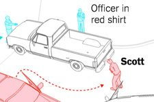    ## The Keith Scott Shooting: A 3-D Reconstruction   Jan. 18, 2017](https://www.nytimes.com/interactive/2016/09/25/us/charlotte-scott-shooting-video.html)

- [ 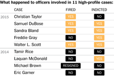    ## Looking for Accountability in Police-Involved Deaths of Blacks   June 5, 2017](https://www.nytimes.com/interactive/2016/07/12/us/looking-for-accountability-in-police-involved-deaths-of-blacks.html)

- [ 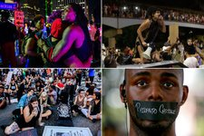    ## At Least 88 Cities Have Had Protests in the Past 13 Days Over Police Killings of Blacks   July 20, 2016](https://www.nytimes.com/interactive/2016/07/16/us/protesting-police-shootings-of-blacks.html)

- [ 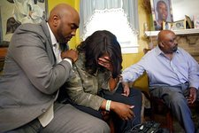    ## Video Released in Terence Crutcher’s Killing by Tulsa Police   Dec. 21, 2017](https://www.nytimes.com/2016/09/20/us/video-released-in-terence-crutchers-killing-by-tulsa-police.html)

- [ 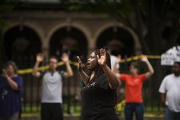    ## After Philando Castile’s Killing, Obama Calls Police Shootings ‘an American Issue’   Dec. 21, 2017](https://www.nytimes.com/2016/07/08/us/philando-castile-falcon-heights-shooting.html)

- [ 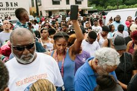    ## Alton Sterling Shooting in Baton Rouge Prompts Justice Dept. Investigation   Dec. 21, 2017](https://www.nytimes.com/2016/07/06/us/alton-sterling-baton-rouge-shooting.html)

- [ 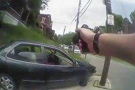    ## University of Cincinnati Officer Indicted in Shooting Death of Samuel Dubose   Dec. 21, 2017](https://www.nytimes.com/2015/07/30/us/university-of-cincinnati-officer-indicted-in-shooting-death-of-motorist.html)

- [ 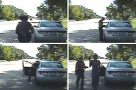    ## Assessing the Legality of Sandra Bland’s Arrest   June 1, 2017](https://www.nytimes.com/interactive/2015/07/20/us/sandra-bland-arrest-death-videos-maps.html)

- [ 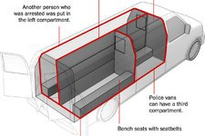    ## Police Board Clears Driver in Freddie Gray Case; No Officers Have Been Convicted   Nov. 8, 2017](https://www.nytimes.com/interactive/2015/04/30/us/what-happened-freddie-gray-arrested-by-baltimore-police-department-map-timeline.html)

- [ 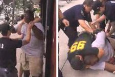    ## New Perspective on Eric Garner's Death   June 1, 2017](https://www.nytimes.com/interactive/2014/12/03/us/2014-12-03-garner-video.html)

- [ 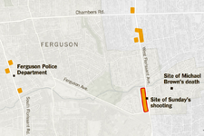    ## What Happened in Ferguson?   June 1, 2017](https://www.nytimes.com/interactive/2014/08/13/us/ferguson-missouri-town-under-siege-after-police-shooting.html)

Advertisement