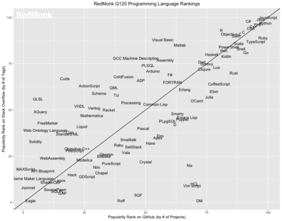

The RedMonk Programming Language Rankings: January 2020 – tecosystems

#### [tecosystems](https://redmonk.com/sogrady)

# The RedMonk Programming Language Rankings: January 2020

By [Stephen O'Grady](https://redmonk.com/sogrady/author/sogrady/) |[@sogrady](https://twitter.com/sogrady) |February 28, 2020

[Share via Twitter**]()[Share via Facebook**]()[Share via Linkedin**]()[Share via Reddit**]()

This iteration of the RedMonk Programming Language Rankings is brought to you by MongoDB. No matter the language, MongoDB helps developers solve their hardest data problems. Build better, bigger, and faster with [MongoDB Cloud](https://www.mongodb.com/cloud/atlas?utm_campaign=sponsorship&utm_source=redmonk&utm_medium=referral).

* * *

With the new year well underway, it’s time to drop our first quarter bi-annual Programming Language rankings. As always, these are a continuation of the work originally performed by Drew Conway and John Myles White late in [2010](http://www.dataists.com/2010/12/ranking-the-popularity-of-programming-langauges/). While the specific means of collection has changed, the basic process remains the same: we extract language rankings from GitHub and Stack Overflow, and combine them for a ranking that attempts to reflect both code (GitHub) and discussion (Stack Overflow) traction. The idea is not to offer a statistically valid representation of current usage, but rather to correlate language discussion and usage in an effort to extract insights into potential future adoption trends.

# Our Current Process

The data source used for the GitHub portion of the analysis is the GitHub Archive. We query languages by pull request in a manner similar to the one GitHub used to assemble the State of the Octoverse. Our query is designed to be as comparable as possible to the previous process.

- Language is based on the base repository language. While this continues to have the caveats outlined below, it does have the benefit of cohesion with our previous methodology.
- We exclude forked repos.
- We use the aggregated history to determine ranking (though based on the table structure changes this can no longer be accomplished via a single query.)

For Stack Overflow, we simply collect the required metrics using their useful data explorer tool.

With that description out of the way, please keep in mind the other usual caveats.

- To be included in this analysis, a language must be observable within both GitHub and Stack Overflow.
- No claims are made here that these rankings are representative of general usage more broadly. They are nothing more or less than an examination of the correlation between two populations we believe to be predictive of future use, hence their value.
- There are many potential communities that could be surveyed for this analysis. GitHub and Stack Overflow are used here first because of their size and second because of their public exposure of the data necessary for the analysis. We encourage, however, interested parties to perform their own analyses using other sources.
- All numerical rankings should be taken with a grain of salt. We rank by numbers here strictly for the sake of interest. In general, the numerical ranking is substantially less relevant than the language’s tier or grouping. In many cases, one spot on the list is not distinguishable from the next. The separation between language tiers on the plot, however, is generally representative of substantial differences in relative popularity.
- In addition, the further down the rankings one goes, the less data available to rank languages by. Beyond the top tiers of languages, depending on the snapshot, the amount of data to assess is minute, and the actual placement of languages becomes less reliable the further down the list one proceeds.
- Languages that have communities based outside of Stack Overflow such as Mathematica will be under-represented on that axis. It is not possible to scale a process that measures one hundred different community sites, both because many do not have public metrics available and because measuring different community sites against one another is not statistically valid.

With that, here is the first quarter plot for 2020.

Besides the above plot, which can be difficult to parse even at full size, we offer the following numerical rankings. As will be observed, this run produced several ties which are reflected below (they are listed out here alphabetically rather than consolidated as ties because the latter approach led to misunderstandings).

1 JavaScript
2 Python
2 Java
4 PHP
5 C#
6 C++
7 Ruby
7 CSS
9 TypeScript
9 C
11 Swift
12 Objective-C
13 Scala
13 R
15 Go
15 Shell
17 PowerShell
18 Perl
19 Kotlin
20 Haskell

Generally when these rankings are prepared, there is little to comment on with regard to movement in the Top 10 entries. Because both the X and Y axis reflect metrics that are accretive in nature, the higher the language is ranked the more difficult it becomes to displace. It is notable, therefore, that we have movement amongst four languages. Two will be discussed in more detail below, but the drop of C++ (6) by one spot is overshadowed by the rise of Ruby from #8 to #7. By itself, this gain would be of relatively little consequence, but as was said [two years ago](https://redmonk.com/sogrady/2017/12/15/what-ruby-needs/) in this space, quantitatively Ruby appeared to have peaked and had been in a period of stagnancy and, arguably, decline. One quarter’s performance does not, of course, reverse this analyis or trajectory overnight, but it is certainly a bright spot for advocates of the language.

- **Python (+1)**: Python hasn’t been singled out in these rankings all that often, in part because its performance has been steady, almost metronomically so. With the exception of one quarter, it spent approximately four years sitting in fourth place, jumping up to third place three years ago and holding – until this month. For the first time in the history of these rankings which began in 2012, we have a non-Java or JavaScript entry in our number two slot. It didn’t displace either of those languages, but it has tied Java for the first time. We are often asked about the reasons that particular languages rise or fall in usage, and there are several patterns that have tended to correlate with increased (or decreased) usage. One of those is versatility. Like the language it tied with in this run, Java, Python has continued to find a role for itself in new workloads and use cases, even as it faces more specialized competition in these arenas. This, as much as the language’s general accessibility and ease of use, is one of the most important factors in Python’s ability to not merely survive, but thrive. The question now is whether it can sustain this unprecedented ranking, or if it’s merely a blip.

- **TypeScript (+1)**: As noted in our [last run](https://redmonk.com/sogrady/2019/07/18/language-rankings-6-19/), with the exception of Swift’s performance for a single quarter, it had been five years since we’d seen a new Top 10 language. Having accomplished that feat in June, the question was whether TypeScript could sustain that performance, or whether – like Swift, the fastest growing language we had measured – it would be a one time anomaly and slip back outside of the Top 10. This quarter brings the answer, which was that TypeScript did not sustain its performance, it exceeded it. Instead of retreating back to the 10-15 range, the JavaScript-compatible language continued to gain, moving from tenth place to ninth. As with Python, TypeScript is succeeding in part because of patterns. Instead of versatility, however, TypeScript is buoyed by both its ability to intermingle with a large existing codebase in JavaScript and its potential ability to make the resulting code safer. This has proven to be a winning combination, one which raises expectations from whether or not the language belongs in the Top 10 to how much higher – if at all – it might go.
- **R (+2)**: In our first run of these rankings, R placed 17th. All these years later it jumps two spots from the last quarter’s edition up to #13. In the interim, it has ranked as high as 12th but mostly commonly is found in the 13-15 range. Given the language’s specialized focus, this is likely its effective ceiling, but it’s also an illustration of the remarkable popularity of a language whose usage is restricted for all intents and purposes to a single domain – those who work with and operate on data. R’s success is an example of the power of an academia-supported community to elevate a language beyond its expected threshold, and it is notable that the aforementioned growth of Python and its expansion into data analytics has not observably come at the expense of traction in R.
- **Rust (0) / Go (+1)**: For those expecting another jump this quarter from Rust, the results will be disappointing: the shiny language that many have argued should be used as the basis for more core infrastructure projects moving forward remained flat at #21. In this regard, Rust’s measured ascent mirrors Go’s (15) recent stagnation – this quarter’s bump for the latter notwithstanding. After Go’s initially rapid trip up the standings, its progress has largely stalled and it has languished in the mid-teens: since 2015, it’s clocked in at 14 once, 16 twice, and 15 seven times. Like R, that appears to be its effective ceiling for the moment, but while that exceeds expectations for a narrowly focused language like R, it somewhat underperforms them for a more broadly applicable – if still specialized – language such as Go. The question then is whether Rust’s technical differentiation from Go, albeit with an arguably longer learning curve, will be enough to allow it to outperform its most serious current rival for modern infrastructure workloads.
- **Kotlin (+1) / Clojure (-1) / Groovy (+1) / Scala (0)**: Kotlin, the second fastest growing language we’ve seen outside of Swift, made a big splash a year ago at this time when it vaulted eight full spots up the list to just crack the Top 20 at spot #20. While it grew in leaps and bounds initially, however, growth since has been more difficult to come by. There have even been suggestions that the syntactically and aesthetically popular language might have been a flash in the pan, and give back the ground it had gained to fellow JVM-based alternatives such as Clojure, Groovy or Scala. With the exception of Groovy, however, which went from #24 to #23, Scala was static at #13 and Clojure dropped one spot. Kotlin, meanwhile, finally made progress inching up the Top 20 board to #19. The next run will be interesting to observe in order to determine whether it can continue to build on those gains, or whether there is another long pause before growth continues.
- **Dart (+3)**: Lastly, we have the case of Dart. It is not a language that has been commented on in this space in [some time](https://redmonk.com/sogrady/2015/07/01/language-rankings-6-15/), due to its middling historical performance on these rankings. As correctly predicted by at least [one person](https://twitter.com/jacobrothstein/status/1233139869653729280), however, Dart has made some recent gains that are roughly correlated with a spike in popularity of the UI toolkit Flutter. Eighteen months ago, Dart checked in at #33. Since the Dart-based Flutter went 1.0 six months after that, the language has jumped all the way up to #24 in the latest rankings. It was [argued](https://redmonk.com/sogrady/2011/04/27/frameworks-lead-adoption/) in this space nearly a decade ago that frameworks lead adoption, and Dart’s rapid rise after years of stagnation is one example of this phenomenon at work. If Dart is now powered in large part by Flutter, however, the obvious question is how far Flutter can take the language up our charts.

**Credit**: My colleague [Rachel Stephens](https://redmonk.com/rstephens) wrote and executed the queries that are responsible for the GitHub axis in these rankings. She is also responsible for the query design and collection for the Stack Overflow data.

## 2 comments

1. 

#### — Elto Desukane  says:

##### [March 4, 2020 at 11:08 am](https://redmonk.com/sogrady/2020/02/28/language-rankings-1-20/#comment-134484)

“they are listed out here alphabetically rather than consolidated as ties”
Then why 2 Python before 2 Java ?

[Reply](https://redmonk.com/sogrady/2020/02/28/language-rankings-1-20/?replytocom=134484#respond)

2. 

#### — [Michelle Hirsch](https://www.linkedin.com/in/michellethirsch/)  says:

##### [March 4, 2020 at 1:11 pm](https://redmonk.com/sogrady/2020/02/28/language-rankings-1-20/#comment-134487)

I’m puzzled by the relative position of MATLAB and Julia on the GitHub axis. When I use the GitHub API, I get a bit over 200k MATLAB repos and fewer than 30k Julia repos. MATLAB is hanging out near languages like FORTRAN which have ~20k repos.

I query with these URLs and look at total_count:
https://api.github.com/search/repositories?q=language:MATLAB+fork:false
https://api.github.com/search/repositories?q=language:Julia+fork:false
Any thoughts? Thanks!

[Reply](https://redmonk.com/sogrady/2020/02/28/language-rankings-1-20/?replytocom=134487#respond)

### Leave a Reply

Your email address will not be published. Required fields are marked *
Comment
Name *
Email *
Website
 Save my name, email, and website in this browser for the next time I comment.

 Notify me of follow-up comments by email.
 Notify me of new posts by email.